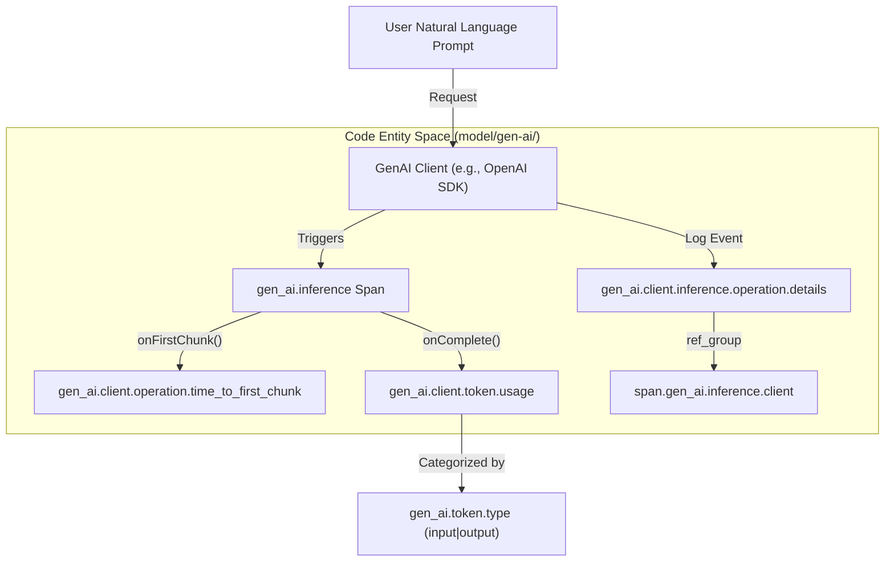

This page details how Generative AI metrics and events are defined within the semantic conventions model. These signals provide quantitative data (e.g., token counts, latencies) and discrete lifecycle information (e.g., evaluation results, model parameters) that complement distributed traces.

## Metric Definitions

Metrics are defined in `model/gen-ai/metrics.yaml` and categorized into client-side, server-side, and workflow-level instruments. All current metrics use the `histogram` instrument type to capture distributions of values such as token counts and durations [model/gen-ai/metrics.yaml:20-110]().

### Client-Side Metrics
Client-side metrics focus on the consumer's experience and resource consumption.

| Metric Name | Unit | Description |
| :--- | :--- | :--- |
| `gen_ai.client.token.usage` | `{token}` | Number of input and output tokens used [model/gen-ai/metrics.yaml:21-24](). |
| `gen_ai.client.operation.duration` | `s` | Total duration of the GenAI operation [model/gen-ai/metrics.yaml:33-36](). |
| `gen_ai.client.operation.time_to_first_chunk` | `s` | Latency for the first chunk in streaming responses [model/gen-ai/metrics.yaml:44-47](). |
| `gen_ai.client.operation.time_per_output_chunk` | `s` | Time elapsed between subsequent chunks [model/gen-ai/metrics.yaml:56-60](). |

### Server and Workflow Metrics
These metrics capture backend performance and high-level process orchestration.

| Metric Name | Unit | Description |
| :--- | :--- | :--- |
| `gen_ai.server.request.duration` | `s` | Server-side duration until the last byte/token [model/gen-ai/metrics.yaml:69-72](). |
| `gen_ai.server.time_to_first_token` | `s` | Time to generate the first token [model/gen-ai/metrics.yaml:90-93](). |
| `gen_ai.workflow.duration` | `s` | Duration of a multi-agent or multi-step workflow [model/gen-ai/metrics.yaml:100-104](). |

### Bucket Boundaries
To ensure consistency across different implementations, specific `ExplicitBucketBoundaries` are recommended for token usage: `[1, 4, 16, 64, 256, 1024, 4096, 16384, 65536, 262144, 1048576, 4194304, 16777216, 67108864]` [docs/gen-ai/gen-ai-metrics.md:51-51]().

**Sources:** [model/gen-ai/metrics.yaml:1-110](), [docs/gen-ai/gen-ai-metrics.md:40-101]()

---

## Event Definitions

Events are discrete occurrences captured as logs with specific semantic meaning, defined in `model/gen-ai/events.yaml`. They allow for capturing high-cardinality or large-payload data (like full chat histories) that might be too heavy for span attributes.

### Core Events

1.  **`gen_ai.client.inference.operation.details`**: Captures the parameters and chat history of a completion request [model/gen-ai/events.yaml:3-9](). It inherits attributes from the inference span group [model/gen-ai/events.yaml:12-12]().
2.  **`gen_ai.evaluation.result`**: Captures quality or accuracy scores. It should be parented to the operation span or linked via `gen_ai.response.id` [model/gen-ai/events.yaml:13-17]().
3.  **`gen_ai.client.operation.exception`**: Represents client-side errors like rate limits or timeouts. It is recorded with a `WARN` severity (number 13) [model/gen-ai/events.yaml:39-47]().

### Data Flow: Natural Language to Code Entity Space

The following diagram illustrates how a natural language request flows through the system and is transformed into specific code-defined metrics and events.

**Diagram: Request to Signal Mapping**

**Sources:** [model/gen-ai/events.yaml:1-60](), [docs/gen-ai/gen-ai-events.md:21-65](), [model/gen-ai/metrics.yaml:21-55]()

---

## Attribute Relationships & Refinements

Metrics and events share common attribute groups defined in the registry to ensure correlation across signal types.

### Shared Attribute Groups
In `metrics.yaml`, the `metric_attributes.gen_ai` internal group bundles mandatory attributes for all GenAI metrics:
*   `gen_ai.provider.name` (Required) [model/gen-ai/metrics.yaml:10-11]()
*   `gen_ai.response.model` (Recommended) [model/gen-ai/metrics.yaml:8-9]()
*   `gen_ai.address_and_port` (Reference group) [model/gen-ai/metrics.yaml:6-6]()

### Provider-Specific Refinements
The model supports refining base metrics for specific providers. For example, when the provider is `openai`, the `gen_ai.client.token.usage` metric is extended to include OpenAI-specific attributes [model/gen-ai/metrics.yaml:118-124]().

**Diagram: Metric Refinement Hierarchy**
```mermaid
classDiagram
    class gen_ai_client_token_usage {
        +gen_ai.provider.name
        +gen_ai.token.type
        +gen_ai.response.model
    }
    class openai_client_token_usage {
        +openai.response.service_tier
        +openai.response.system_fingerprint
    }
    gen_ai_client_token_usage <|-- openai_client_token_usage : "Refinement (model/gen-ai/metrics.yaml:118)"
```

### Event-to-Span Correlation
Events are designed to work in tandem with spans. The `gen_ai.evaluation.result` event uses `gen_ai.response.id` as a correlation key when a direct span parent-child relationship is not feasible [model/gen-ai/events.yaml:31-37]().

**Sources:** [model/gen-ai/metrics.yaml:2-19](), [model/gen-ai/metrics.yaml:117-144](), [model/gen-ai/events.yaml:13-37]()