This page describes the semantic conventions for the [Model Context Protocol (MCP)](https://github.com/modelcontextprotocol/modelcontextprotocol), a JSON-RPC based protocol designed to connect AI models to data and tools. These conventions ensure consistent observability across different MCP transports and implementations.

## Overview

MCP is transport-independent and commonly uses `stdio`, Streamable HTTP, or SSE. Because MCP allows multiple requests and notifications to be multiplexed over a single transport connection, standard HTTP or RPC semantic conventions are often insufficient [docs/gen-ai/mcp.md:31-40](). The MCP conventions provide domain-specific context for tool calls, resource reading, and prompt management.

### Data Flow and JSON-RPC Mapping

MCP operations map directly to JSON-RPC methods. The following diagram illustrates the relationship between the natural language concepts of the protocol and the code entities defined in the registry.

**MCP Method Mapping**
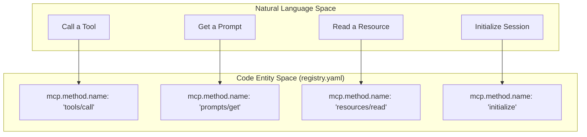
Sources: [model/mcp/registry.yaml:86-90](), [model/mcp/registry.yaml:71-75](), [model/mcp/registry.yaml:41-45](), [model/mcp/registry.yaml:11-15]()

## Trace Context Propagation

Since MCP does not define a standard propagation mechanism, instrumentations SHOULD use the `params._meta` property bag in MCP requests and notifications [docs/gen-ai/mcp.md:51-53]().

- **Mechanism**: Inject `traceparent` and `tracestate` (W3C Trace Context) or `baggage` into `params._meta` [docs/gen-ai/mcp.md:64-67]().
- **Server Behavior**: MCP servers SHOULD extract context from `_meta` to use as the parent for the server span [docs/gen-ai/mcp.md:104-107]().

### Example Trace Context Injection
```json
{
  "jsonrpc": "2.0",
  "method": "tools/call",
  "params": {
    "name": "get-weather",
    "_meta": {
      "traceparent": "00-4bf92f3577b34da6a3ce929d0e0e4736-00f067aa0ba902b7-01"
    }
  },
  "id": 1
}
```
Sources: [docs/gen-ai/mcp.md:70-82]()

## Spans

The protocol defines two primary span types: `mcp.client` and `mcp.server`.

### Span Definitions
| Span Type | Kind | Description |
| :--- | :--- | :--- |
| `mcp.client` | `CLIENT` | Describes the call from the sender's perspective (initiating request/notification) [model/mcp/spans.yaml:18-30](). |
| `mcp.server` | `SERVER` | Describes the processing on the receiver's side [model/mcp/spans.yaml:68-80](). |

### Naming Convention
Span names SHOULD follow the format `{mcp.method.name} {target}` [model/mcp/spans.yaml:22-25]():
- `target` SHOULD be `gen_ai.tool.name` or `gen_ai.prompt.name` where applicable.
- If no low-cardinality target exists, use `{mcp.method.name}`.
- `mcp.resource.uri` is opt-in for names to avoid high cardinality [model/mcp/spans.yaml:27-29]().

### Integration with GenAI Spans
MCP tool call spans are compatible with `gen_ai.execute_tool` spans. If a GenAI instrumentation is already tracing a tool execution, MCP attributes SHOULD be added to that existing span instead of creating a new one [model/mcp/spans.yaml:51-56]().

Sources: [model/mcp/spans.yaml:18-114](), [docs/gen-ai/mcp.md:130-137]()

## Metrics

MCP defines four primary histogram metrics to track operation and session latency.

| Metric Name | Unit | Description |
| :--- | :--- | :--- |
| `mcp.client.operation.duration` | `s` | Latency from request sent to response/ack received [model/mcp/metrics.yaml:20-25](). |
| `mcp.server.operation.duration` | `s` | Latency from request received to result/ack sent [model/mcp/metrics.yaml:31-36](). |
| `mcp.client.session.duration` | `s` | Total duration of the MCP session on the client [model/mcp/metrics.yaml:40-43](). |
| `mcp.server.session.duration` | `s` | Total duration of the MCP session on the server [model/mcp/metrics.yaml:49-52](). |

Sources: [model/mcp/metrics.yaml:19-56]()

## Transport Variants

MCP requires specific recording of the underlying transport protocol via the `network.transport` attribute [model/mcp/common.yaml:49-54]().

**Transport Entity Mapping**
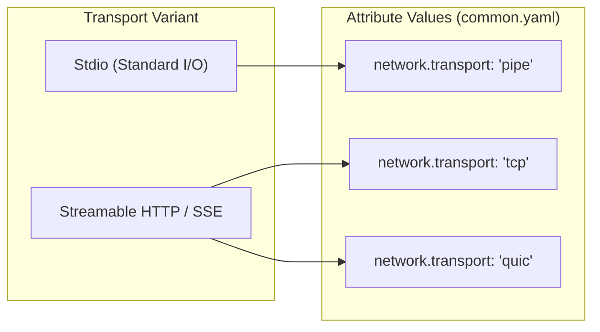
Sources: [model/mcp/common.yaml:49-54](), [docs/gen-ai/mcp.md:20-28]()

## Error Handling

Errors in MCP are captured using the `error.type` attribute.

1.  **JSON-RPC Errors**: `error.type` SHOULD be the string representation of the JSON-RPC error code [model/mcp/common.yaml:28-29]().
2.  **Tool Execution Errors**: When a `CallToolResult` is returned with `isError: true`, `error.type` MUST be set to `tool_error` [model/mcp/common.yaml:34-36]().
3.  **Span Status**: If `error.type` is present, the span status MUST be set to `ERROR` [model/mcp/spans.yaml:45-46]().

Sources: [model/mcp/common.yaml:24-36](), [model/mcp/spans.yaml:94-96]()

# Toolchain & Code Generation


This section provides an overview of the **Weaver-based toolchain** used to manage, validate, and transform the YAML-based semantic convention models into human-readable documentation and machine-readable schema snapshots. The toolchain ensures that GenAI conventions remain consistent with the upstream OpenTelemetry standards while providing a streamlined workflow for contributors.

## Overview

The repository utilizes [Weaver](https://github.com/open-telemetry/weaver) as its primary engine for processing semantic conventions [README.md:10-11](). Weaver consumes the YAML definitions located in the `model/` directory and applies Jinja2 templates to generate the contents of the `docs/` and `schema-snapshot/` directories [CONTRIBUTING.md:21-31]().

The following diagram illustrates the flow from the Natural Language Space (YAML definitions) to the Code Entity Space (generated artifacts and validation logic).

### Toolchain Data Flow
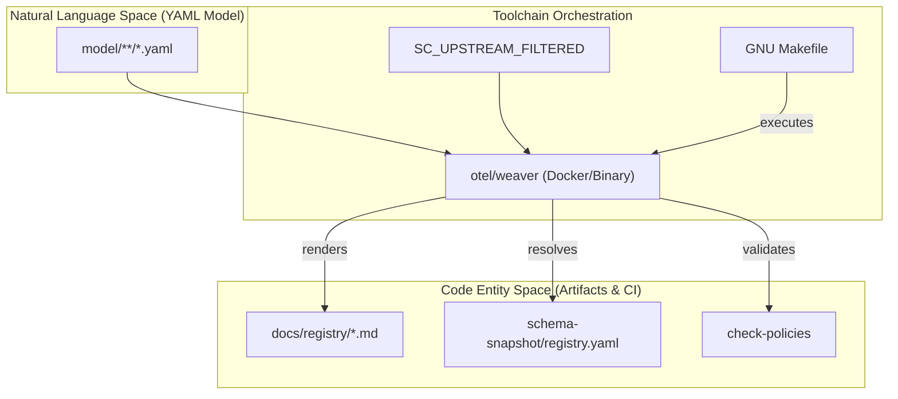
**Sources:** [README.md:7-11](), [CONTRIBUTING.md:11-13](), [CONTRIBUTING.md:49-63]()

---

## Makefile & Weaver Pipeline

The `Makefile` serves as the entry point for all automation tasks. It orchestrates the Weaver container (or binary) to perform complex operations like filtering upstream dependencies and synchronizing the local model with the core OpenTelemetry semantic conventions.

Key capabilities include:
*   **Code Generation**: Using `make generate-all` to refresh all documentation and snapshots [CONTRIBUTING.md:49-55]().
*   **Upstream Synchronization**: Filtering core conventions (e.g., `error.type`) to be used as base types for GenAI extensions [schema-snapshot/registry.yaml:1-11]().
*   **Version Pinning**: Managing the specific version of Weaver and upstream models via a centralized configuration.

For details, see [Makefile & Weaver Pipeline](#5.1).

**Sources:** [CONTRIBUTING.md:46-56](), [CONTRIBUTING.md:59-67](), [.github/workflows/ci.yml:80-87]()

---

## Jinja2 Templates

The transformation of raw YAML into the documentation found in `docs/registry/` is handled by **Jinja2 templates**. These templates define how namespaces (like `gen_ai.*` or `mcp.*`), attributes, and metrics are rendered into Markdown tables and prose [docs/README.md:22-23]().

The template system allows for:
*   **Consistent Formatting**: Ensuring all attribute tables follow the same layout.
*   **Requirement Level Mapping**: Translating YAML requirement levels (e.g., `conditionally_required`) into human-readable guidance [schema-snapshot/registry.yaml:16-17]().
*   **Cross-Referencing**: Automatically linking to external JSON schemas for complex attributes like `gen_ai.input.messages` [schema-snapshot/registry.yaml:89-92]().

For details, see [Jinja2 Templates](#5.2).

**Sources:** [CONTRIBUTING.md:52-53](), [schema-snapshot/registry.yaml:108-116](), [docs/gen-ai/README.md:9-15]()

---

## Schema Snapshot

The `schema-snapshot/registry.yaml` file is a fully resolved, single-file representation of the GenAI semantic conventions [CONTRIBUTING.md:54-55](). Unlike the source YAMLs in `model/`, which are split by namespace and signal type, the snapshot contains the complete expanded model including inherited attributes and resolved references.

This snapshot serves two critical roles:
1.  **PR Visibility**: It allows reviewers to see the exact impact of a change on the final schema, including how refinements affect existing attributes [schema-snapshot/registry.yaml:1-26]().
2.  **Stability Tracking**: It provides a stable target for the published Schema URL (e.g., `https://opentelemetry.io/schemas/gen-ai/1.42.0`) [README.md:15]().

For details, see [Schema Snapshot](#5.3).

**Sources:** [README.md:13-15](), [CONTRIBUTING.md:54-55](), [.github/workflows/ci.yml:82-83]()

---

## Validation & CI Integration

The toolchain is integrated into the GitHub Actions CI pipeline to ensure model integrity. This includes link checking with `lychee` and policy enforcement via `make check-policies` [.github/workflows/ci.yml:19-64]().

### CI Validation Pipeline
```mermaid
graph LR
    subgraph "CI Job: generated-docs"
        GenAll["make generate-all"]
        DiffCheck["git diff --exit-code"]
    end

    subgraph "CI Job: policies"
        PolicyCheck["make check-policies"]
    end

    subgraph "CI Job: links"
        Lychee["flint run (lychee)"]
    end

    GenAll --> DiffCheck
    PolicyCheck --> "Required Status Check"
    DiffCheck --> "Required Status Check"
    Lychee --> "Required Status Check"
```
**Sources:** [.github/workflows/ci.yml:19-22](), [.github/workflows/ci.yml:47-49](), [.github/workflows/ci.yml:65-67](), [.github/workflows/ci.yml:183-200]()

**Sources:**
*   [CONTRIBUTING.md:59-74]()
*   [.github/workflows/ci.yml:19-95]()
*   [mise.toml:11-14]()

# Makefile & Weaver Pipeline


The `semantic-conventions-genai` repository uses a `Makefile` to orchestrate **Weaver**, the OpenTelemetry semantic convention toolchain. This pipeline transforms YAML model definitions into human-readable documentation, schema snapshots, and validated registry artifacts. By using a containerized Weaver execution model, the repository ensures a consistent environment for all contributors without requiring local installation of the Weaver binary.

### Implementation Overview

The orchestration logic is centralized in the [Makefile:1-22](). It manages external dependencies, performs pre-processing on upstream semantic conventions to avoid ID collisions, and executes Weaver commands for validation and generation.

#### Version Pinning
Versions for the toolchain and dependencies are managed in `versions.env`. This file is included by the `Makefile` to set variables used in container image tags and git checkouts [Makefile:8-10]().
*   `WEAVER_VERSION`: The version of the `otel/weaver` Docker image [versions.env:2-2]().
*   `SEMCONV_VERSION`: The version of the upstream `open-telemetry/semantic-conventions` repository used for shared attributes [versions.env:5-5]().
*   `POLICY_REPO_URL` & `POLICY_REPO_REF`: The location and specific commit of the OTel policy pack used for linting [versions.env:8-9]().

### The Weaver Execution Model

Weaver is executed via Docker to ensure platform independence. The repository is bind-mounted to `/workspace` inside the container, allowing Weaver to resolve relative paths for models and templates as if it were running natively [Makefile:15-21]().

#### Weaver Execution Pipeline
The following diagram illustrates the flow from raw YAML models to generated artifacts via the `WEAVER` command defined in the `Makefile`.

**System Name to Code Entity Mapping: Weaver Pipeline**
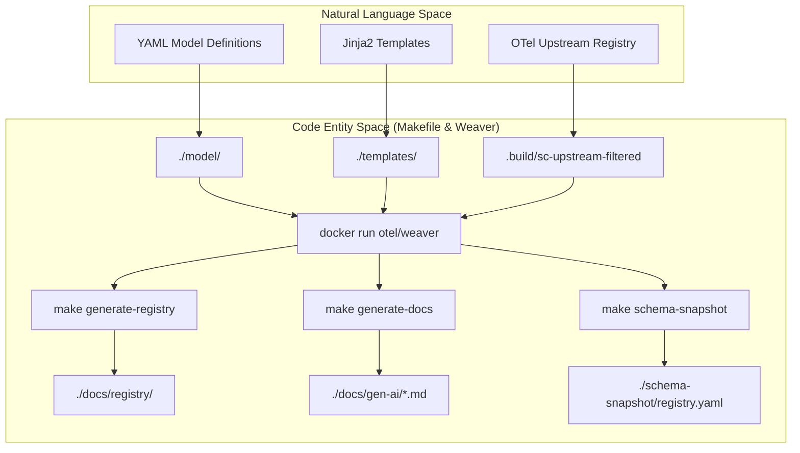
Sources: [Makefile:15-21](), [Makefile:123-129](), [Makefile:134-141](), [Makefile:150-155]()

---

### Upstream Filtering (SC_UPSTREAM_FILTERED)

Because this repository is the new home for GenAI and MCP conventions, it contains definitions that may still exist in the upstream `open-telemetry/semantic-conventions` repository during the migration period. To prevent Weaver from encountering duplicate ID definitions, the `Makefile` implements a filtering step.

The `filter-upstream` target (and its dependency `$(SC_UPSTREAM_STAMP)`) performs the following:
1.  Clones the upstream registry at `SEMCONV_VERSION` [Makefile:90-92]().
2.  Deletes entire directories that have been fully migrated (`gen-ai`, `mcp`, `openai`) [Makefile:51-51](), [Makefile:94-94]().
3.  Performs fine-grained "group-level" removal for files that are shared. For example, it strips `registry.aws.bedrock` from the upstream `aws/registry.yaml` using an `awk` script to slice out the specific YAML block [Makefile:58-58](), [Makefile:98-107]().

Sources: [Makefile:45-58](), [Makefile:87-110]()

---

### Key Makefile Targets

The `Makefile` defines several high-level targets used in local development and CI/CD.

| Target | Description | Weaver Command / Action |
| :--- | :--- | :--- |
| `check-policies` | Validates the model against OTel best practices and breaking change rules. | `weaver registry check` with `--policy` [Makefile:113-117]() |
| `generate-registry` | Generates the per-namespace attribute pages in `docs/registry/`. | `weaver registry generate` using `templates/registry` [Makefile:122-129]() |
| `generate-docs` | Updates hand-written markdown files by injecting Weaver snippet tables. | `weaver registry update-markdown` [Makefile:133-141]() |
| `schema-snapshot` | Produces a single resolved YAML file for PR review visibility. | `weaver registry generate` with `yaml` target [Makefile:149-155]() |
| `generate-all` | Runs all generation targets. Used by CI to check for out-of-sync files. | Aggregates `schema-snapshot`, `generate-registry`, `generate-docs` [Makefile:145-145]() |
| `package-dev` | Prepares artifacts for a GitHub release. | Resolves the registry and moves `manifest.yaml` to `.build/package` [Makefile:159-170]() |

Sources: [Makefile:112-170]()

---

### Data Flow: From Model to Release

The following diagram bridges the logical concept of a "Release" to the specific file entities and Makefile targets involved in the pipeline.

**System Name to Code Entity Mapping: Release Pipeline**
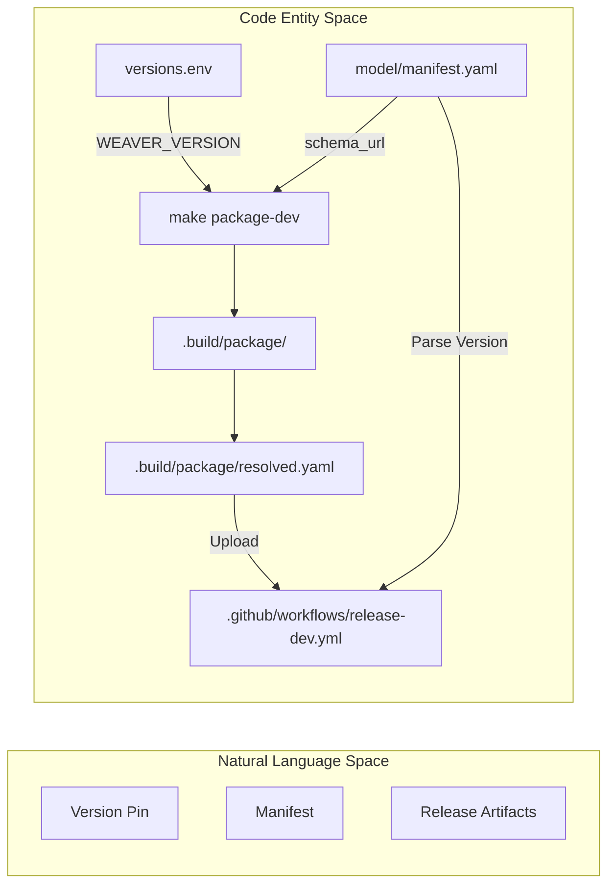
Sources: [Makefile:68-70](), [Makefile:159-170](), [.github/workflows/release-dev.yml:19-24](), [RELEASING.md:8-10]()

### CI/CD Integration

The `Makefile` is the primary entry point for GitHub Actions. The `CI` workflow executes `make check-policies` and `make generate-all`. If `make generate-all` produces any changes to the `docs/registry` or `schema-snapshot` directories that were not committed by the developer, the CI job fails [ .github/workflows/ci.yml:80-87](). This ensures that the human-readable documentation always reflects the state of the YAML model.

Sources: [.github/workflows/ci.yml:62-63](), [.github/workflows/ci.yml:80-95]()

# Jinja2 Templates


The `templates/registry/` directory contains the Jinja2 templates used by [Weaver](https://github.com/open-telemetry/weaver) to transform the YAML-based semantic convention models into human-readable Markdown documentation and the resolved schema registry. These templates define the structure, formatting, and logic for how attributes, spans, metrics, and events are presented in the `docs/` directory.

## Template Architecture and Data Flow

The transformation process follows a pipeline where Weaver parses the YAML models, resolves references, and injects a "Resolved Registry" object into the Jinja2 environment.

### Data Flow Diagram: YAML to Markdown

This diagram illustrates how the `weaver` tool uses templates to bridge the "Natural Language Space" (YAML definitions) to the "Documentation Entity Space" (Markdown).

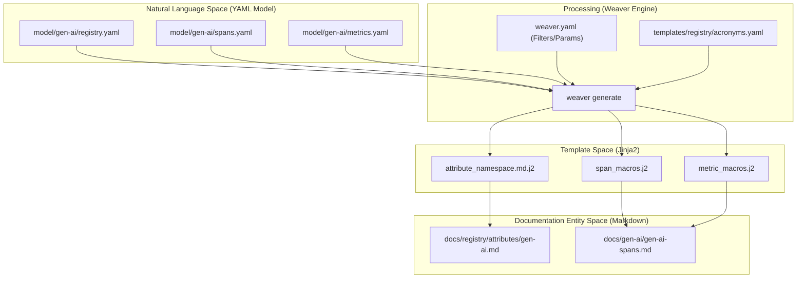
**Sources:** [CONTRIBUTING.md:21-31](), [CONTRIBUTING.md:44-55]()

## Key Templates and Macros

The templates are organized to promote reuse through Jinja2 macros. This ensures that the rendering of an attribute table remains consistent whether it appears in the global registry or within a specific span definition.

### 1. Attribute Namespace Template
`attribute_namespace.md.j2` is the primary template for generating files under `docs/registry/attributes/`. It iterates over the resolved attributes belonging to a specific namespace (e.g., `gen_ai.*`) and renders their properties including `id`, `type`, `stability`, and `brief` [docs/registry/attributes/README.md:10-18]().

### 2. Span and Metric Macros
- `span_macros.j2`: Contains logic to render span-specific tables, including attribute requirement levels (`required`, `conditionally_required`, `opt_in`) [schema-snapshot/registry.yaml:105-106]().
- `metric_macros.j2`: Handles the rendering of metric instruments (histograms, counters), units, and associated attributes [schema-snapshot/registry.yaml:23-24]().

### 3. Acronym List
The repository maintains an acronym list (often found in `templates/registry/acronyms.yaml` or injected via `weaver.yaml`) to ensure that technical terms like "MCP" (Model Context Protocol) or "TTFC" (Time To First Chunk) are correctly expanded or linked in the generated documentation [CHANGELOG.md:23-24](), [README.md:3-5]().

## The Resolved Registry (v2)

When Weaver processes the model, it produces a "Resolved Registry". This is a flattened, fully-dereferenced version of the conventions. The `schema-snapshot/registry.yaml` file is a committed artifact of this resolved state [CONTRIBUTING.md:54-55]().

### Registry Structure Entity Mapping

This diagram maps the internal code entities of the resolved registry to the resulting documentation structures.

```mermaid
classDiagram
    class ResolvedRegistry {
        +groups: List~Group~
    }
    class Group {
        +id: String
        +type: String (attribute_group|span|metric|event)
        +attributes: List~Attribute~
        +brief: String
        +note: String
    }
    class Attribute {
        +id: String
        +type: String
        +stability: String
        +requirement_level: String
        +examples: List
    }

    ResolvedRegistry "1" --> "*" Group : contains
    Group "1" --> "*" Attribute : references

    style ResolvedRegistry stroke-dasharray: 5 5
```
**Sources:** [schema-snapshot/registry.yaml:1-20](), [docs/registry/attributes/README.md:10-18]()

## Weaver Configuration (`weaver.yaml`)

The `weaver.yaml` file (referenced in the pipeline) configures how the templates are applied. It defines:
- **Template Mappings**: Which `.j2` file generates which `.md` output.
- **Filters**: Custom Jinja2 filters for text manipulation (e.g., converting IDs to anchors).
- **Global Parameters**: Variables like `schema_url` or `semconv_version` (e.g., `v1.41.1`) that are used across all templates [versions.env:5-5](), [README.md:15-15]().

## Implementation Details: Attribute Rendering

The templates must handle complex attribute types, such as enums and structured JSON. For example, the `gen_ai.operation.name` attribute contains a list of allowed members (`chat`, `embeddings`, `execute_tool`, etc.) [schema-snapshot/registry.yaml:116-157](). The templates iterate over these members to generate the "Allowed Values" tables seen in the documentation.

### Conditional Logic in Templates
Templates use Jinja2 conditionals to handle `requirement_level`. For instance, if an attribute is `conditionally_required`, the template looks for the `note` or specific condition string to display to the user [schema-snapshot/registry.yaml:16-17](), [schema-snapshot/registry.yaml:45-46]().

**Sources:**
- [CONTRIBUTING.md:19-31]() (Structure)
- [schema-snapshot/registry.yaml:1-174]() (Resolved Registry structure)
- [docs/registry/attributes/README.md:5-24]() (Registry template purpose)
- [versions.env:1-10]() (Version pins for Weaver and SemConv)

# Schema Snapshot


The **Schema Snapshot** is a committed artifact located at `schema-snapshot/registry.yaml` that represents the fully resolved state of all semantic conventions defined in this repository [CONTRIBUTING.md:52-55](). It serves as a single source of truth for the flattened model, incorporating local definitions and upstream dependencies into a unified registry format.

## Overview and Purpose

The primary purpose of the schema snapshot is to provide visibility into the final, "resolved" version of the semantic conventions. While the source of truth is distributed across multiple YAML files in the `model/` directory, the snapshot aggregates these into a single file [CONTRIBUTING.md:33-35]().

Key roles include:
- **PR Review Visibility**: By committing the snapshot, reviewers can see exactly how a change to a local YAML file (like `model/gen-ai/registry.yaml`) affects the final resolved schema, including inherited attributes and refinements [CONTRIBUTING.md:46-55]().
- **Stability Tracking**: It allows for tracking changes to attribute stability levels and requirement levels across the entire registry [schema-snapshot/registry.yaml:16-18]().
- **Schema Publishing**: The snapshot is used to verify the state of the registry before a release is cut and a new `schema_url` is published [model/manifest.yaml:7-8]().

## Data Flow: Model to Snapshot

The snapshot is generated using the [Weaver](https://github.com/open-telemetry/weaver) toolchain. Weaver processes the local `model/` directory and merges it with a filtered version of the upstream OpenTelemetry semantic conventions [model/manifest.yaml:9-19]().

### Process Diagram: Generating the Snapshot

The following diagram illustrates how `make schema-snapshot` (part of `make generate-all`) transforms raw model definitions into the resolved artifact.

**Registry Resolution Pipeline**
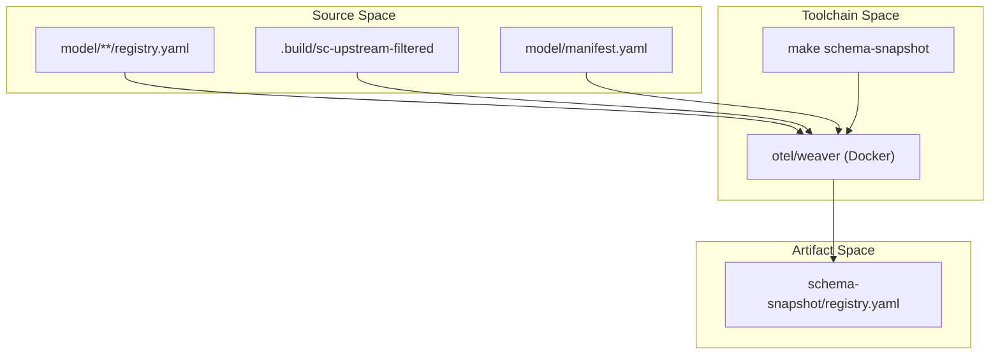
**Sources:** [CONTRIBUTING.md:11-13](), [CONTRIBUTING.md:48-55](), [model/manifest.yaml:9-19]()

## Snapshot Contents

The `schema-snapshot/registry.yaml` file contains a flattened list of all attributes, metrics, spans, and events. Unlike the source files, the snapshot includes **provenance** information, indicating exactly which file defined the attribute [schema-snapshot/registry.yaml:43-44]().

### Structure of a Resolved Attribute
A resolved attribute in the snapshot includes its full context:

| Field | Description | Example |
| :--- | :--- | :--- |
| `key` | The fully qualified attribute name | `gen_ai.operation.name` |
| `type` | The resolved data type or enum members | `string` or `enum` |
| `stability` | The current stability level | `development` |
| `provenance` | Path to the source definition | `./model/gen-ai/registry.yaml` |
| `requirement_level` | When the attribute must be recorded | `required` |

**Sources:** [schema-snapshot/registry.yaml:108-116](), [schema-snapshot/registry.yaml:138-141]()

### Refinements
The snapshot also captures "refinements," where this repository extends or modifies attributes defined in the upstream registry. For example, it might refine `error.type` to include GenAI-specific guidance [schema-snapshot/registry.yaml:1-15]().

## Implementation in the Pipeline

The generation of the snapshot is orchestrated by the `Makefile`. It ensures that upstream dependencies are correctly filtered (to avoid duplicate definitions of `gen_ai.*` namespaces) before Weaver runs the resolution logic.

### System Component Mapping

This diagram bridges the human-readable commands to the specific files and logic involved in the snapshot lifecycle.

**Code Entity Interaction Map**
```mermaid
graph LR
    subgraph "Natural Language Space"
        "User runs make"
        "Reviewer checks PR"
    end

    subgraph "Code Entity Space"
        Makefile["Makefile (target: generate-all)"]
        WeaverBin["otel/weaver (container)"]
        RegistryFile["schema-snapshot/registry.yaml"]
        ManifestFile["model/manifest.yaml"]
    end

    "User runs make" --> Makefile
    Makefile --> WeaverBin
    WeaverBin -- "reads" --> ManifestFile
    WeaverBin -- "writes" --> RegistryFile
    RegistryFile --> "Reviewer checks PR"
```
**Sources:** [CONTRIBUTING.md:48-55](), [model/manifest.yaml:1-8](), [README.md:7-11]()

## Usage in Development

1.  **Modification**: A developer modifies a file in `model/` [CONTRIBUTING.md:38-42]().
2.  **Generation**: The developer runs `make generate-all` [CONTRIBUTING.md:48-51]().
3.  **Validation**: This command internally calls Weaver to update `schema-snapshot/registry.yaml`.
4.  **Verification**: The developer uses `git diff schema-snapshot/registry.yaml` to ensure no unintended side effects occurred (e.g., an attribute being accidentally marked as `stable` or a description being overwritten) [CONTRIBUTING.md:52-55]().
5.  **Policy Check**: `make check-policies` is run to validate the resolved snapshot against OpenTelemetry standards [CONTRIBUTING.md:59-67]().

**Sources:** [CONTRIBUTING.md:36-67](), [schema-snapshot/registry.yaml:18-25]()

# Reference Scenarios & Validation


The `reference/` directory contains a suite of runnable Python scenarios designed to validate the Generative AI semantic conventions against real-world LLM client libraries. This system ensures that the conventions defined in the YAML model are both implementable and correctly mapped to the telemetry produced by popular SDKs like OpenAI, Anthropic, and LangChain.

The validation process uses **Weaver live-check** to compare captured OpenTelemetry spans and events against the expected schemas [reference/README.md:9-13]().

### Validation Workflow

The validation pipeline bridges the gap between the abstract **Semantic Convention Model** and actual **Library Implementations**.

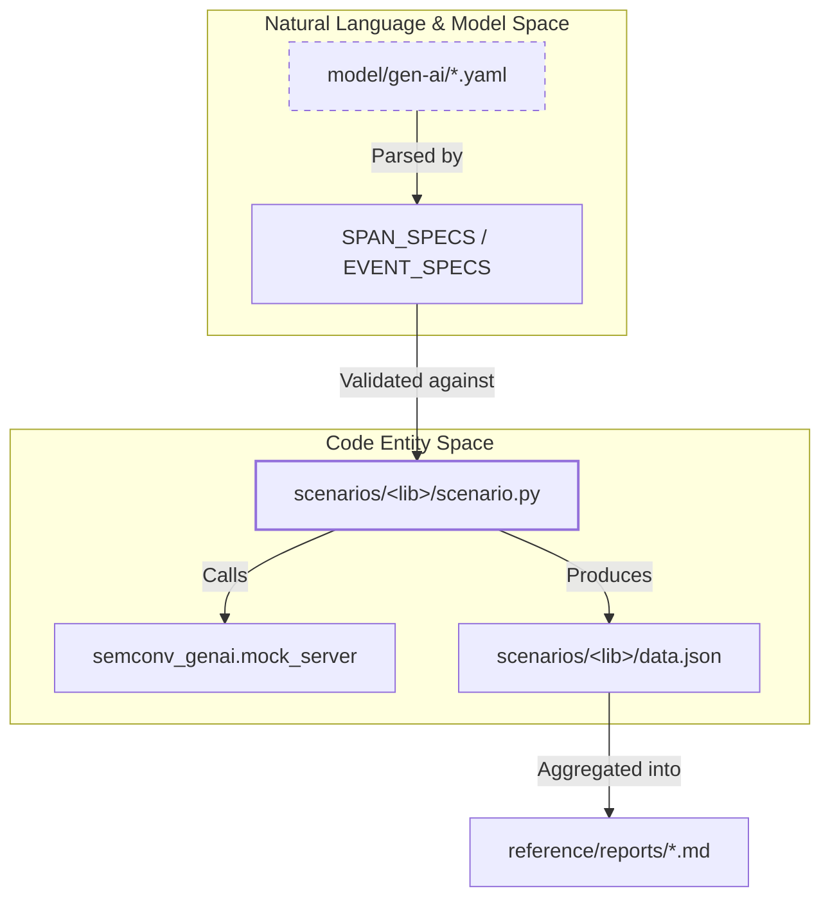
Sources: [reference/src/semconv_genai/semconv_model.py:22-45](), [reference/src/semconv_genai/report.py:25-34](), [reference/README.md:7-13]()

### Key Components

The reference system is divided into three main functional areas:

#### 1. Reference Framework & Pipeline
The core orchestration logic resides in the `semconv_genai` Python package. It manages the execution of scenarios, provides a mock LLM server to ensure deterministic responses, and translates the YAML definitions into `AttributeSpec` objects for validation [reference/src/semconv_genai/semconv_model.py:113-202]().
*   **Pipeline Orchestration:** Manages `uv` runs and Weaver binary execution.
*   **Mock Server:** A Flask-based application that mimics provider APIs (OpenAI, Anthropic, Bedrock).
*   **Model Translation:** The `semconv_model.py` script resolves inheritance and requirement levels from the YAML source [reference/src/semconv_genai/semconv_model.py:56-78]().

For details, see [Reference Framework & Pipeline](#6.1).

#### 2. Library Scenarios
Each supported library has a dedicated directory in `reference/scenarios/`. A `scenario.py` file contains the "reference implementation"—code that uses the library's SDK to perform operations like chat completion or embedding generation while manually emitting OpenTelemetry signals [reference/scenarios/openai/scenario.py:19-53]().
*   **Span Boundaries:** Scenarios define where spans start and end (e.g., `chat gpt-4o-mini`).
*   **Attribute Emission:** Explicitly sets attributes like `gen_ai.request.model` and `gen_ai.usage.input_tokens` [reference/scenarios/openai/scenario.py:44-64]().
*   **Data Snapshots:** Successful runs generate a `data.json` file documenting exactly which attributes were captured [reference/scenarios/openai/data.json:1-27]().

For details, see [Reference Scenarios by Library](#6.2).

#### 3. Coverage Reports
The validation results are aggregated into human-readable markdown reports. These reports provide a matrix of which libraries support which attributes for every span and event type [reference/reports/inference-span.md:7-10]().
*   **Status Tables:** The main `reference/README.md` contains a live-updated summary of library support [reference/README.md:22-44]().
*   **Per-Signal Details:** Detailed pages (e.g., `inference-span.md`) list every attribute and the specific libraries that successfully emitted them [reference/reports/inference-span.md:14-23]().

For details, see [Coverage Reports](#6.3).

### System Mapping

The following diagram illustrates how specific Python classes and files in the `reference/` directory interact to validate the semantic conventions.

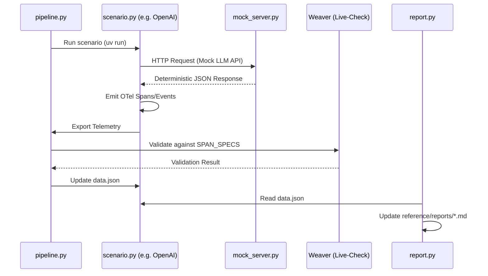
Sources: [reference/scenarios/openai/scenario.py:65-76](), [reference/src/semconv_genai/semconv_model.py:113-119](), [reference/src/semconv_genai/report.py:131-170](), [reference/README.md:7-13]()

# Reference Framework & Pipeline


The Reference Framework provides a runnable validation environment for GenAI Semantic Conventions. It executes real Python LLM client libraries against a deterministic mock server, captures the resulting telemetry, and validates it against the YAML-defined model using the OTel Weaver toolchain. This ensures that the conventions are both implementable and correctly applied across various providers and orchestration frameworks.

## Pipeline Architecture

The validation pipeline is orchestrated by `semconv_genai.run_scenario`, which manages the lifecycle of a library validation run. It coordinates the mock server, the scenario execution, and the Weaver-based policy check.

### Data Flow Diagram

The following diagram illustrates the flow from a scenario execution to the final coverage report.

**Scenario Validation & Reporting Flow**
```mermaid
graph TD
    subgraph "Scenario Execution"
        [ScenarioRunner] -- "executes" --> [scenario.py]
        [scenario.py] -- "REST/gRPC" --> [mock_server]
        [scenario.py] -- "OTLP" --> [Collector/File]
    end

    subgraph "Validation Pipeline"
        [Collector/File] -- "JSON Spans" --> [weaver_check]
        [weaver_check] -- "validates against" --> [model/gen-ai/*.yaml]
        [weaver_check] -- "produces" --> [weaver_results.json]
    end

    subgraph "Report Generation"
        [weaver_results.json] -- "parsed by" --> [parse_results.py]
        [parse_results.py] -- "ScenarioResult" --> [data_files.py]
        [data_files.py] -- "writes" --> [scenarios/lib/data.json]
        [scenarios/lib/data.json] -- "read by" --> [report.py]
        [report.py] -- "updates" --> [README.md]
        [report.py] -- "generates" --> [reports/*.md]
    end
```
**Sources:** `reference/src/semconv_genai/run_scenario.py`, `reference/src/semconv_genai/data_files.py`, `reference/src/semconv_genai/report.py`

## Core Components

### 1. Mock Server (`mock_server`)
The mock server is a Flask-based application that simulates various LLM provider APIs. It ensures deterministic testing without requiring actual API keys or incurring costs.

*   **Provider Blueprints**: The server is composed of multiple blueprints, including `openai`, `anthropic`, `bedrock`, and `google_genai` [reference/src/semconv_genai/mock_server/__init__.py:15-20]().
*   **Deterministic Logic**: It contains specialized logic to trigger specific GenAI behaviors, such as tool calls or structured planning outputs for frameworks like CrewAI and LangChain [reference/src/semconv_genai/mock_server/openai.py:134-210]().
*   **State Management**: For stateful operations like AWS Bedrock Agent Memory, it maintains in-memory stores for records and memory IDs [reference/src/semconv_genai/mock_server/bedrock_agentcore.py:14-17]().

### 2. Semantic Convention Model (`semconv_model.py`)
This module acts as the bridge between the YAML definitions and the Python validation logic.

*   **YAML Loading**: It loads all files from `model/gen-ai/` and unifies them into a lookup table [reference/src/semconv_genai/semconv_model.py:25-45]().
*   **Attribute Resolution**: It mirrors Weaver's resolution logic, following `ref_group` inheritance and attribute overrides [reference/src/semconv_genai/semconv_model.py:56-78]().
*   **Signal Specs**: It defines `SPAN_SPECS` and `EVENT_SPECS` which map span types (e.g., `inference`, `embeddings`) to their required, recommended, and opt-in attributes as defined in the model [reference/src/semconv_genai/semconv_model.py:113-210]().

### 3. Span Classification (`classify.py`)
Because GenAI spans are often differentiated by attributes rather than just names, the `classify_span` function determines the "type" of a span (e.g., `inference` vs `plan`) based on `gen_ai.operation.name` and other discriminator attributes.

*   **Discriminators**: Uses `discriminator_attrs` defined in `SPAN_SPECS` to identify span types like `retrieval` (via `gen_ai.data_source.id`) or `execute_tool` (via `gen_ai.tool.name`) [reference/src/semconv_genai/semconv_model.py:137-164]().
*   **Disambiguation**: Logic in `classify_span` distinguishes between `invoke_agent_client` and `invoke_agent_internal` by checking for the presence of network attributes like `server.address` [reference/src/semconv_genai/classify.py:38-42]().

**Classification Mapping**
| Span Type Key | `gen_ai.operation.name` | Discriminator Attributes |
| :--- | :--- | :--- |
| `inference` | `chat`, `generate_content` | N/A |
| `embeddings` | `embeddings` | `gen_ai.embeddings.dimension.count`, etc. |
| `retrieval` | `retrieval` | `gen_ai.data_source.id` |
| `execute_tool` | `execute_tool` | `gen_ai.tool.name`, `gen_ai.tool.call.id` |

**Sources:** `reference/src/semconv_genai/classify.py`, `reference/src/semconv_genai/semconv_model.py`

## Data Pipeline & Reporting

The pipeline converts raw OTLP data into human-readable coverage reports.

### Result Processing (`data_files.py`)
This module processes the output of Weaver validation.
*   **Coverage Computation**: It calculates which attributes from the `AttributeSpec` were actually observed in the telemetry [reference/src/semconv_genai/data_files.py:63-110]().
*   **Normalization**: It drops empty fields and sorts attribute names alphabetically to ensure deterministic `data.json` files [reference/src/semconv_genai/data_files.py:184-198]().

### Report Generation (`report.py`)
The `update-reports` script (mapped to `semconv_genai.report:main`) generates the final documentation.
*   **README Injection**: It updates the status table in the main `reference/README.md` between `<!-- status:begin -->` markers [reference/src/semconv_genai/report.py:42-45]().
*   **Detail Pages**: It creates per-signal markdown files in `reference/reports/` (e.g., `inference-span.md`), listing which libraries support which specific attributes [reference/src/semconv_genai/report.py:131-170]().
*   **Semantic Linkage**: It maps span/event types to their official documentation via the `SEMCONV_DOC_LINKS` dictionary [reference/src/semconv_genai/report.py:69-82]().

## System Entity Map

The following diagram bridges the logical concepts to the specific code entities implementing them.

**Code Entity & Framework Mapping**
```mermaid
graph LR
    subgraph "Natural Language Space"
        [Model Definition]
        [Mock Provider]
        [Coverage Report]
        [Validation Runner]
    end

    subgraph "Code Entity Space"
        [Model Definition] --- [semconv_model.py]
        [Mock Provider] --- [mock_server/openai.py]
        [Mock Provider] --- [mock_server/anthropic.py]
        [Coverage Report] --- [report.py]
        [Coverage Report] --- [data_files.py]
        [Validation Runner] --- [run_scenario.py]

        [semconv_model.py] --> [SPAN_SPECS]
        [data_files.py] --> [ScenarioDataEntry]
        [mock_server/openai.py] --> [CHAT_RESPONSE]
        [report.py] --> [SEMCONV_DOC_LINKS]
    end
```
**Sources:** `reference/src/semconv_genai/semconv_model.py`, `reference/src/semconv_genai/mock_server/openai.py`, `reference/src/semconv_genai/report.py`, `reference/src/semconv_genai/data_files.py`

# Reference Scenarios by Library


Reference scenarios are runnable Python implementations located in the `reference/scenarios/` directory. They serve as the concrete proof-of-concept for the GenAI semantic conventions, demonstrating how attributes, spans, and events should be emitted using real-world LLM client libraries [reference/scenarios/openai/scenario.py:1-2](), [.github/instructions/reference-scenarios.instructions.md:8-11]().

## Purpose and Principles

The primary goal of these scenarios is to validate that proposed conventions are "capturable"—meaning they can be honestly extracted from a library's public API and response objects without faking data [.github/instructions/reference-scenarios.instructions.md:8-11](), [.github/skills/reference/SKILL.md:12-14]().

### Core Implementation Rules
*   **Inline Emission**: Attributes must be set inline at the instrumentation site. Moving emission into helper methods (e.g., `_set_request_attributes`) is prohibited to ensure readability [.github/instructions/reference-scenarios.instructions.md:15-17]().
*   **Public Entry Points**: Scenarios must call the library's public entry point. While patching private methods to open spans is allowed, the scenario logic itself must interact with public APIs [.github/instructions/reference-scenarios.instructions.md:48-52]().
*   **Current-Call Values**: Attributes like `gen_ai.request.model` or `gen_ai.response.id` must come directly from the variables passed to or returned by the SDK call [.github/instructions/reference-scenarios.instructions.md:27-34]().
*   **Span Boundaries**: Spans must wrap the library invocation. Request attributes used for sampling are passed to `start_as_current_span`, while others are set within the `with` block [.github/instructions/reference-scenarios.instructions.md:41-44]().

## Scenario Structure and Data Flow

Each library directory contains a `scenario.py` (the implementation) and a `data.json` (the validation baseline) [.github/copilot-instructions.md:21-22]().

### Implementation Pattern: OpenAI Example
The OpenAI scenario demonstrates the standard flow for a `chat` operation, including event logging for inference details [reference/scenarios/openai/scenario.py:19-128]().

#### Natural Language to Code Entity Mapping: OpenAI
This diagram shows how system concepts map to specific code entities within the `openai` reference scenario.

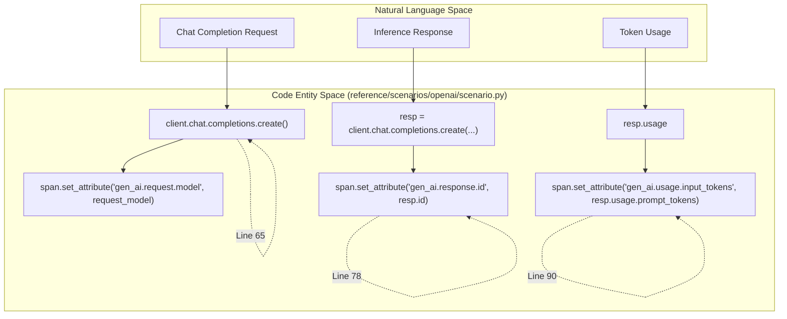
Sources: [reference/scenarios/openai/scenario.py:65-91]()

### Data Flow: Multi-Span Scenarios (LangChain)
For complex libraries like LangChain, scenarios may involve multiple span types, such as `retrieval` and `plan` [reference/scenarios/langchain/scenario.py:13-114]().

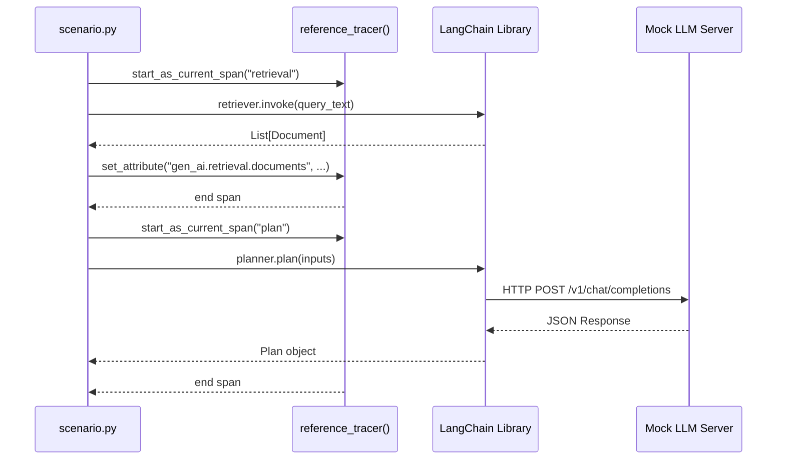
Sources: [reference/scenarios/langchain/scenario.py:39-56](), [reference/scenarios/langchain/scenario.py:98-126]()

## Supported Libraries and Coverage

The repository maintains reference implementations for a wide range of providers and frameworks. Coverage is tracked via `data.json` files which list the attributes emitted for each span type [reference/scenarios/openai/data.json:1-64]().

| Library | Key Operations Covered | Primary Span Types |
| :--- | :--- | :--- |
| `openai` | Chat, Streaming, Embeddings, Tool Call | `inference`, `embeddings`, `execute_tool` |
| `anthropic` | Chat, Document Modality | `inference` |
| `aws-bedrock` | Converse API, Tool Calling | `inference`, `execute_tool` |
| `langchain` | Retrieval, Plan-and-Execute | `retrieval`, `plan`, `inference` |
| `claude-agent-sdk` | Agent Query | `inference` |
| `azure-openai` | Chat, Embeddings | `inference`, `embeddings` |

Sources: [reference/scenarios/openai/scenario.py:19-170](), [reference/scenarios/anthropic/scenario.py:23-177](), [reference/scenarios/aws-bedrock/scenario.py:32-186](), [reference/scenarios/langchain/scenario.py:13-126](), [reference/scenarios/claude-agent-sdk/scenario.py:17-96](), [reference/scenarios/azure-openai/scenario.py:12-71]()

## Output Format: data.json
The `data.json` file acts as a schema validation contract. It records which attributes were successfully captured during the scenario execution [reference/scenarios/openai/data.json:1-5]().

**Example structure (OpenAI):**
```json
{
  "spans": {
    "inference": [
      "gen_ai.operation.name",
      "gen_ai.request.model",
      "gen_ai.response.id",
      "..."
    ]
  },
  "events": {
    "gen_ai.client.inference.operation.details": [
      "gen_ai.input.messages",
      "..."
    ]
  }
}
```
Sources: [reference/scenarios/openai/data.json:1-64]()

## Validation and Reporting
Reference implementations are used to generate the **Coverage Reports** found in `reference/reports/`. These reports cross-reference the semantic convention definitions with the actual support found in the scenarios [reference/reports/inference-span.md:1-54]().

*   **Required Attributes**: Attributes that must be present in every implementation (e.g., `gen_ai.operation.name`) [reference/reports/inference-span.md:5-11]().
*   **Supporting Libraries**: A list of libraries that successfully emitted the attribute in their reference scenario [reference/reports/inference-span.md:7-10]().
*   **Capture Gaps**: If a library cannot credibly emit a field defined in the spec, it is recorded as a "capture gap" to inform future convention iterations [.github/skills/reference/SKILL.md:52-53](), [.github/skills/reference/SKILL.md:71-72]().

Sources: [reference/reports/inference-span.md:1-76](), [.github/skills/reference/SKILL.md:1-76]()