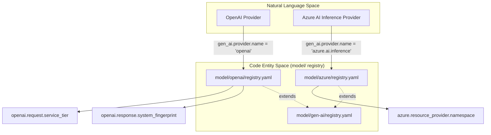
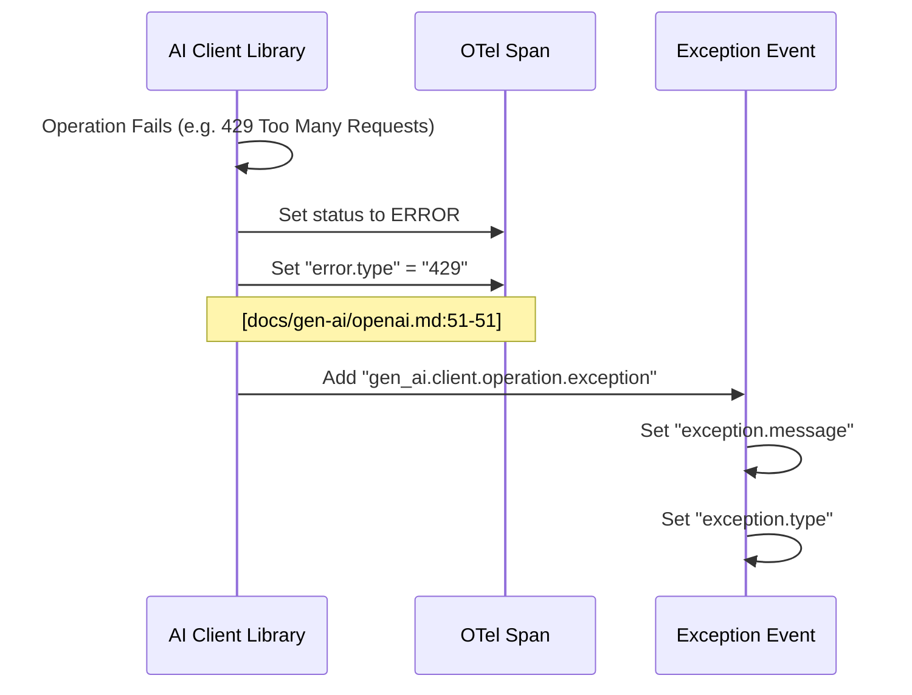

This page details the provider-specific semantic conventions for OpenAI and Azure AI Inference. These conventions extend the core Generative AI semantic conventions to capture provider-specific features such as service tiers, system fingerprints, and resource namespaces.

## Overview

The semantic conventions for these providers are defined as refinements to the base `gen_ai` spans. They utilize a provider discriminator (`gen_ai.provider.name`) to signal which specific set of attributes and behaviors are expected.

### Data Flow and Provider Selection

The following diagram illustrates how the "Natural Language Space" (provider names) maps to the "Code Entity Space" (specific attribute keys and requirements defined in the YAML model).

**Provider Mapping to Attribute Space**

**Sources:** [docs/gen-ai/openai.md:20-24](), [docs/gen-ai/azure-ai-inference.md:18-24](), [model/openai/registry.yaml:2-3]()

---

## OpenAI Conventions

OpenAI-specific attributes track environment stability and billing/performance tiers.

### Provider Discriminator
For all OpenAI operations, `gen_ai.provider.name` MUST be set to `"openai"` [docs/gen-ai/openai.md:24-24]().

### Specific Attributes
| Attribute | Key | Description |
| :--- | :--- | :--- |
| **Service Tier (Req)** | `openai.request.service_tier` | Requested tier: `auto` (use scale credits) or `default`. [model/openai/registry.yaml:3-16]() |
| **Service Tier (Resp)** | `openai.response.service_tier` | The actual tier used for the response (e.g., `scale`). [model/openai/registry.yaml:30-34]() |
| **System Fingerprint** | `openai.response.system_fingerprint` | A unique string representing the backend configuration to track model changes. [model/openai/registry.yaml:35-39]() |
| **API Type** | `openai.api.type` | Identifies the API: `chat_completions` or `responses`. [model/openai/registry.yaml:17-29]() |

### Span Refinement
OpenAI inference spans (defined as `openai.inference.client`) require `gen_ai.operation.name` and `gen_ai.request.model` [docs/gen-ai/openai.md:47-50]().

**Sources:** [docs/gen-ai/openai.md:58-60](), [docs/registry/attributes/openai.md:10-13](), [model/openai/registry.yaml:1-40]()

---

## Azure AI Inference Conventions

Azure AI Inference conventions focus on identifying the Azure resource infrastructure providing the model.

### Provider Discriminator
For Azure AI Inference, `gen_ai.provider.name` MUST be set to `"azure.ai.inference"` [docs/gen-ai/azure-ai-inference.md:24-24]().

### Resource Identification
The primary extension for Azure is the inclusion of the resource provider namespace:

*   **`azure.resource_provider.namespace`**: Recommended to be set to the namespace recognized by the client, such as `Microsoft.CognitiveServices` [docs/gen-ai/azure-ai-inference.md:55-55]().

### Metric Extensions
Azure AI Inference spans track token usage using the standard `gen_ai.client.token.usage` metric but specifically emphasize tracking `gen_ai.usage.cache_creation.input_tokens` and `gen_ai.usage.cache_read.input_tokens` when supported by the underlying model [docs/gen-ai/azure-ai-inference.md:66-66]().

**Sources:** [docs/gen-ai/azure-ai-inference.md:18-66]()

---

## Implementation & Error Handling

Both providers follow the standard OpenTelemetry Gen AI error handling patterns, but refine which attributes are required during a failure.

### Logic Flow for Error Capture
This diagram bridges the error reporting logic from the provider-specific documentation to the `error.type` attribute used in code.

**Error Handling Data Flow**

### Key Differences in Requirements
*   **OpenAI**: Requires `gen_ai.request.model` and `gen_ai.operation.name` on all inference spans [docs/gen-ai/openai.md:49-50]().
*   **Azure**: `gen_ai.request.model` is `Conditionally Required` (if available), reflecting scenarios where the model name might be inferred from the endpoint URL [docs/gen-ai/azure-ai-inference.md:50-50]().

**Sources:** [docs/gen-ai/openai.md:43-51](), [docs/gen-ai/azure-ai-inference.md:39-46]()