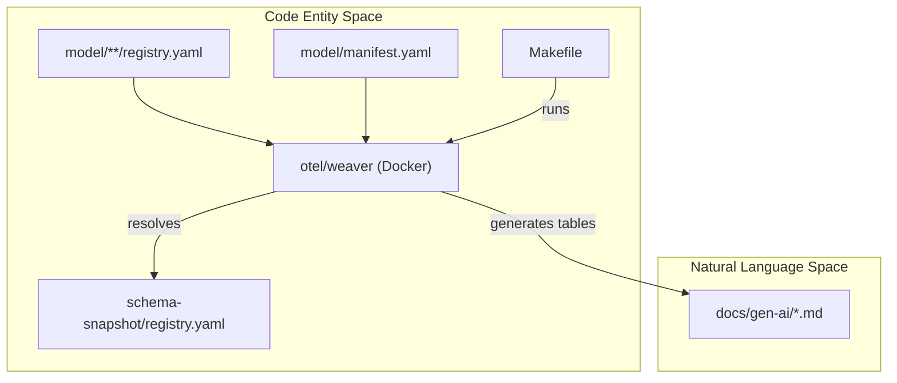
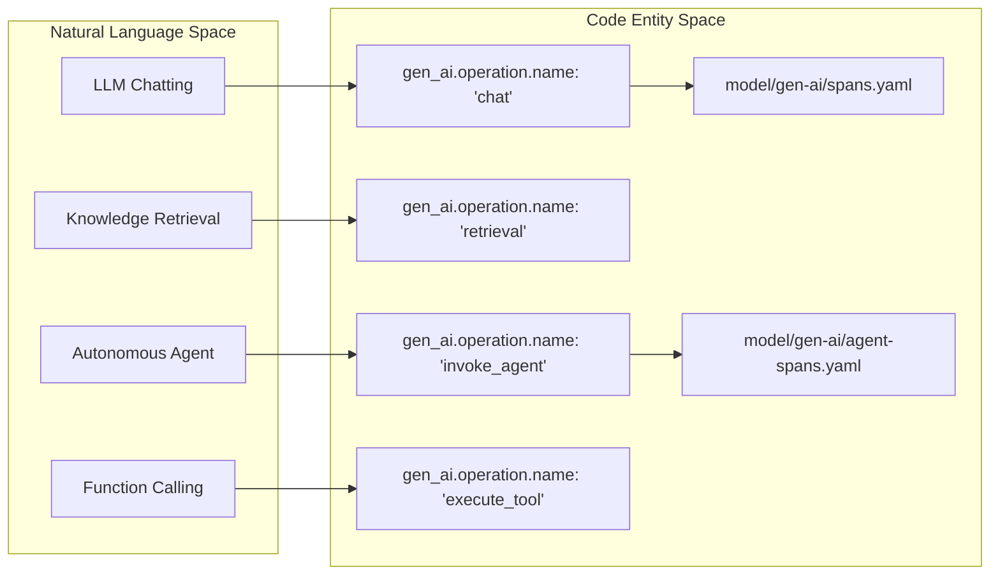

The `semantic-conventions-genai` repository defines the standard [OpenTelemetry Semantic Conventions](https://opentelemetry.io/docs/concepts/semantic-conventions/) for Generative AI systems. This includes telemetry schemas for Large Language Model (LLM) inference, AI agents, vector database retrieval, tool execution, and the Model Context Protocol (MCP) [README.md:1-11]().

This repository is the canonical home for GenAI-specific conventions, extending the core OpenTelemetry semantic conventions by using the [Weaver](https://github.com/open-telemetry/weaver) toolchain to manage model definitions and documentation generation [README.md:7-12]().

## Architecture & Components

The repository is organized into three primary layers: the **Model** (YAML definitions), the **Documentation** (Markdown output), and the **Reference** (validation logic).

### 1. Semantic Convention Model
The "source of truth" resides in the `model/` directory. It uses a structured YAML format to define attributes, spans, metrics, and events [CONTRIBUTING.md:19-31]().
*   **Registry**: Centralized attribute definitions (e.g., `gen_ai.operation.name`, `gen_ai.system`) [model/manifest.yaml:4-6]().
*   **Signals**: Definitions for how spans (e.g., `chat`, `embeddings`), metrics (e.g., `gen_ai.workflow.duration`), and events (e.g., `gen_ai.choice`) should be structured [CHANGELOG.md:13-24]().

### 2. Toolchain (Weaver)
The project uses `make` and Docker-based [Weaver](https://github.com/open-telemetry/weaver) to transform the YAML model into human-readable documentation and a resolved schema snapshot [CONTRIBUTING.md:9-13]().
*   **`make generate-all`**: Regenerates the registry and documentation [CONTRIBUTING.md:44-55]().
*   **`make check-policies`**: Validates the model against OpenTelemetry's naming and stability rules [CONTRIBUTING.md:59-67]().

### 3. Reference & Validation
The `reference/` directory contains a Python-based framework and library-specific scenarios (e.g., OpenAI, Anthropic, LangChain) that validate if real-world implementations can capture the defined conventions [README.md:23-25]().

### Component Interaction Diagram
The following diagram illustrates how the YAML model is processed by the toolchain to produce the final documentation and schema artifacts.

**Convention Generation Pipeline**

Sources: [CONTRIBUTING.md:19-55](), [model/manifest.yaml:1-20]()

## Repository Structure

The codebase is strictly organized to separate the abstract model from the generated artifacts.

| Directory | Description |
| :--- | :--- |
| `model/` | YAML files defining attributes, spans, and metrics per namespace (`gen-ai`, `mcp`, `openai`) [CONTRIBUTING.md:25-30](). |
| `docs/` | Hand-written prose and auto-generated tables for the semantic conventions [README.md:19-22](). |
| `reference/` | Python reference scenarios and coverage reports [README.md:23-25](). |
| `schema-snapshot/` | The fully resolved registry artifact used for tracking changes [CONTRIBUTING.md:54-55](). |

Sources: [CONTRIBUTING.md:19-31](), [README.md:19-25]()

## Core Semantic Concepts

The conventions are built around specific operations defined in the `gen_ai.operation.name` attribute [schema-snapshot/registry.yaml:108-116]().

### Operation Mapping
The following diagram maps high-level AI concepts to the specific code identifiers used in the semantic convention model.

**System Concepts to Code Identifiers**

Sources: [schema-snapshot/registry.yaml:118-157](), [docs/gen-ai/README.md:9-15]()

## Child Pages

For detailed technical information, please refer to the following sub-pages:

*   **[Getting Started & Contributing](#1.1)**: Setup your environment using Docker and `make`, run the Weaver toolchain, and follow the workflow for modifying the YAML model [CONTRIBUTING.md:1-67]().
*   **[Release & Versioning](#1.2)**: Understand how the `schema_url` is managed in `model/manifest.yaml` and the process for updating the `CHANGELOG.md` [model/manifest.yaml:7-18](), [CHANGELOG.md:1-30]().

For details on specific conventions, see the **Semantic Convention Model** and **Provider-Specific Conventions** sections in the main wiki navigation.