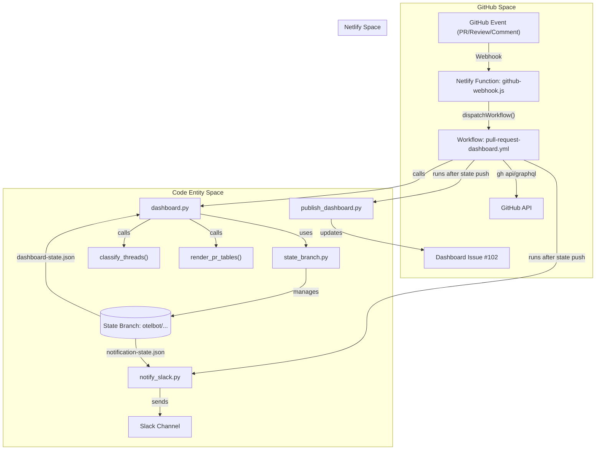
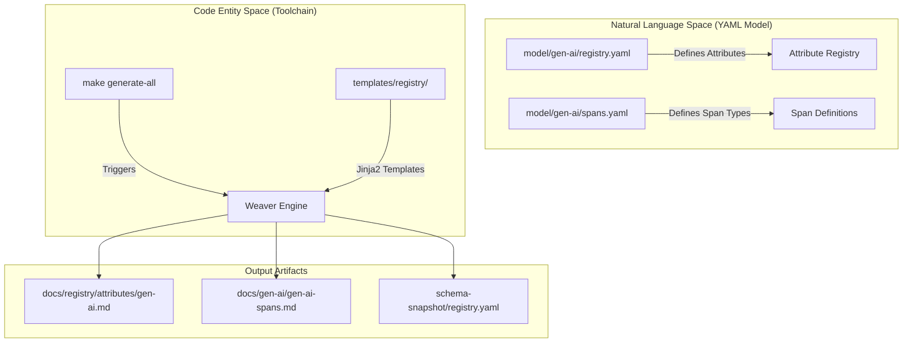
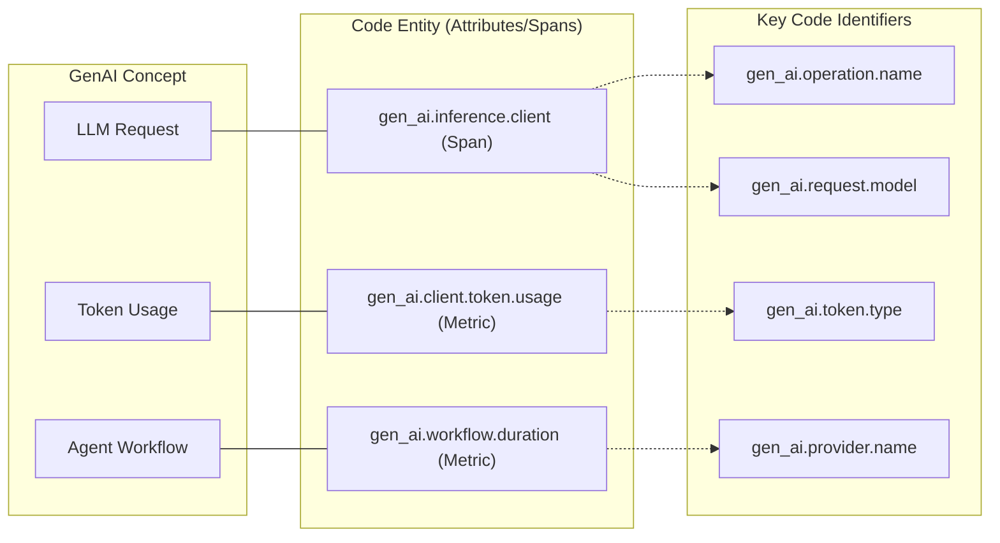

The Pull Request (PR) Dashboard is an automated tooling system designed to provide deterministic triage and visibility into open pull requests within the `semantic-conventions-genai` repository. It utilizes a combination of GitHub Actions, a Netlify-hosted webhook listener, and a git-backed state management system to classify PRs, render a status dashboard, and send Slack notifications.

## System Architecture

The dashboard operates as a reactive system triggered by GitHub events. It maintains its persistent state on a dedicated git branch, `otelbot/pull-request-dashboard-state`, which acts as a durable compare-and-swap (CAS) boundary for concurrent updates [[.github/workflows/pull-request-dashboard.yml:29-30]]().

### Data Flow Diagram

The following diagram illustrates the flow from a GitHub event to the updated dashboard and Slack notifications.

**PR Dashboard Data Flow**

**Sources:** [[.github/scripts/pull-request-dashboard/dashboard.py:18-52]](), [[.github/scripts/pull-request-dashboard/netlify/functions/github-webhook.js:79-84]](), [[.github/workflows/pull-request-dashboard.yml:1-30]]()

---

## Webhook Integration

The entry point for real-time updates is a Node.js Netlify Function.

### `github-webhook.js`
This function listens for signed GitHub webhooks. It validates the `x-hub-signature-256` using a shared secret [[.github/scripts/pull-request-dashboard/netlify/functions/github-webhook.js:46-48]]().

1.  **Event Filtering**: It only processes specific events such as `pull_request`, `issue_comment`, and `pull_request_review` [[.github/scripts/pull-request-dashboard/netlify/functions/github-webhook.js:6-23]]().
2.  **PR Extraction**: It extracts the PR number from various payload locations (e.g., `issue.number` for comments or `pull_request.number`) [[.github/scripts/pull-request-dashboard/netlify/functions/github-webhook.js:155-179]]().
3.  **Workflow Dispatch**: It uses a GitHub App installation token to trigger the `pull-request-dashboard.yml` workflow via the `actions/workflows/.../dispatches` endpoint, passing the PR number and trigger context as inputs [[.github/scripts/pull-request-dashboard/netlify/functions/github-webhook.js:234-250]]().

**Sources:** [[.github/scripts/pull-request-dashboard/netlify/functions/github-webhook.js:1-250]](), [[.github/scripts/pull-request-dashboard/WEBHOOK_SETUP.md:22-52]]()

---

## State Management

The system uses a "Git-as-a-database" pattern to handle state persistence without a traditional backend database.

### `state_branch.py`
This module provides the low-level git operations required to treat a branch as a state store.
*   **`checkout_state`**: Uses `git worktree` to check out the state branch into a temporary directory [[.github/scripts/pull-request-dashboard/state_branch.py:75-84]]().
*   **`push_state_changes`**: Implements a retry loop with `git push --force-with-lease`. If the push is rejected (meaning a concurrent run updated the state), it performs a `git reset --hard` to the new origin and retries the update logic [[.github/scripts/pull-request-dashboard/state_branch.py:115-154]]().

### `state.py`
Defines the schema and accessors for the state files stored on the branch:
*   `dashboard-state.json`: Cached classification and routing results for all open PRs [[.github/scripts/pull-request-dashboard/dashboard.py:23]]().
*   `notification-state.json`: History of Slack notifications sent to prevent duplicates [[.github/scripts/pull-request-dashboard/dashboard.py:24]]().
*   `pull-request-dashboard.md`: The latest rendered markdown body [[.github/scripts/pull-request-dashboard/dashboard.py:25]]().

**Sources:** [[.github/scripts/pull-request-dashboard/state_branch.py:1-174]](), [[.github/scripts/pull-request-dashboard/dashboard.py:21-28]]()

---

## Processing Pipeline

The `dashboard.py` script executes the core logic in two primary modes: **Single-PR Update** (triggered by webhook) and **Full Rebuild** (scheduled hourly) [[.github/scripts/pull-request-dashboard/dashboard.py:54-57]]().

### Logic Flow

1.  **Fact Extraction**: `compute_facts` gathers deterministic data from GitHub (author, CI status, merge conflicts, activity timestamps) [[.github/scripts/pull-request-dashboard/dashboard.py:85-103]]().
2.  **Classification**: The system identifies unresolved review threads. If enabled, it uses an LLM via `classify_threads()` to determine if the "next action" belongs to the author or a reviewer [[.github/scripts/pull-request-dashboard/dashboard.py:78]](), [[.github/scripts/pull-request-dashboard/classification.py:140]]().
3.  **Routing**: PRs are assigned to buckets (routes) such as `maintainer`, `approver`, `author`, or `external` based on the extracted facts and thread classifications [[.github/scripts/pull-request-dashboard/dashboard.py:70-73]]().
4.  **Rendering**: `render_pr_tables()` generates the final Markdown document, grouping PRs by their assigned routes [[.github/scripts/pull-request-dashboard/dashboard.py:145]]().

**Sources:** [[.github/scripts/pull-request-dashboard/dashboard.py:30-57]](), [[.github/scripts/pull-request-dashboard/dashboard.py:84-115]]()

---

## Dashboard Publishing

Once the state is successfully pushed to the git branch, the `publish_dashboard.py` script updates the human-readable dashboard issue.

### `publish_dashboard.py`
*   **Issue Discovery**: It uses a GraphQL query (`_FIND_DASHBOARD_ISSUE_QUERY`) to find an open issue labeled `dashboard`. GraphQL is preferred over REST to avoid caching issues that lead to duplicate dashboard issues [[.github/scripts/pull-request-dashboard/publish_dashboard.py:26-59]]().
*   **Update/Create**: If the issue exists, it uses `gh issue edit` to update the body with the latest rendered markdown [[.github/scripts/pull-request-dashboard/publish_dashboard.py:66-79]](). If not found, it creates a new issue [[.github/scripts/pull-request-dashboard/publish_dashboard.py:81-94]]().

**Sources:** [[.github/scripts/pull-request-dashboard/publish_dashboard.py:1-112]]()

---

## Deployment Workflow

The `.github/workflows/pull-request-dashboard.yml` orchestrates the entire process.

### Workflow Jobs

| Job | Responsibility |
| :--- | :--- |
| `resolve-trigger` | Determines if the run is a full rebuild or a targeted PR update based on inputs [[.github/workflows/pull-request-dashboard.yml:33-44]](). |
| `update-dashboard` | Runs `dashboard.py`. It uses `concurrency` groups based on the PR number to serialize events for the same PR [[.github/workflows/pull-request-dashboard.yml:111-119]](). |
| `notify-slack` | (Conceptual) Loads state and sends notifications based on `notification-state.json` [[.github/scripts/pull-request-dashboard/dashboard.py:45-48]](). |

**Sources:** [[.github/workflows/pull-request-dashboard.yml:33-127]](), [[.github/scripts/pull-request-dashboard/dashboard.py:45-48]]()

# Glossary

This page provides definitions for codebase-specific terms, jargon, and domain concepts used within the `semantic-conventions-genai` repository. It bridges the gap between high-level Generative AI concepts and their specific technical implementation in the OpenTelemetry semantic convention model.

## Core Concepts

### Semantic Convention Model
The "source of truth" for all GenAI telemetry. It consists of YAML files that define the structure, naming, and requirement levels of attributes, spans, metrics, and events.
*   **Implementation**: Located in the `model/` directory, organized by namespace (e.g., `gen-ai`, `mcp`, `openai`) [[CONTRIBUTING.md:25-31]]().
*   **Key Files**:
    *   `registry.yaml`: Attribute definitions [[CONTRIBUTING.md:27-27]]().
    *   `spans.yaml`: Span types and their associated attribute groups [[CONTRIBUTING.md:28-28]]().
    *   `metrics.yaml`: Metric instruments (e.g., histograms) [[CONTRIBUTING.md:29-29]]().
    *   `events.yaml`: Log-based event schemas [[CONTRIBUTING.md:30-30]]().

### Weaver
The toolchain engine used to transform YAML model definitions into human-readable documentation and machine-readable schema snapshots.
*   **Usage**: Invoked via `make generate-all` [[CONTRIBUTING.md:49-49]]().
*   **Role**: Manages dependencies on the core [open-telemetry/semantic-conventions](https://github.com/open-telemetry/semantic-conventions) repository [[README.md:7-11]]().

### Requirement Level
A classification for attributes that dictates when an instrumentation library must include them.
*   **Required**: Must always be present [[docs/gen-ai/gen-ai-spans.md:53-53]]().
*   **Conditionally Required**: Must be present if specific conditions are met (e.g., `error.type` is required if the operation ended in an error) [[model/gen-ai/spans.yaml:7-8]]().
*   **Recommended**: Should be included if available [[docs/gen-ai/gen-ai-spans.md:64-64]]().
*   **Opt-In**: Experimental or high-overhead attributes that are disabled by default [[model/gen-ai/spans.yaml:54-60]]().

---

## Domain Terms & Code Entities

### GenAI Operations
Specific tasks performed by a GenAI system, mapped to the `gen_ai.operation.name` attribute [[model/gen-ai/spans.yaml:24-25]]().

| Term | Code Identifier / Value | Description |
| :--- | :--- | :--- |
| **Inference** | `gen_ai.inference.client` | A client call to a model for generation or tool calls [[model/gen-ai/spans.yaml:130-130]](). |
| **Embeddings** | `embeddings` | Converting text/data into vector representations. |
| **Retrieval** | `retrieval` | Fetching documents from a data source (e.g., Vector DB) [[docs/gen-ai/gen-ai-spans.md:14-14]](). |
| **Agent Invocation** | `invoke_agent` | Calling a high-level agent that coordinates multiple steps [[docs/gen-ai/gen-ai-agent-spans.md:14-15]](). |
| **Planning** | `plan` | Operation for agent task decomposition [[CHANGELOG.md:21-22]](). |

### Model Context Protocol (MCP)
An open protocol that enables GenAI models to interact with external data and tools via JSON-RPC [[docs/gen-ai/mcp.md:31-31]]().
*   **Context Propagation**: Handled via the `params._meta` property bag in JSON-RPC messages [[docs/gen-ai/mcp.md:51-53]]().
*   **Key Attributes**: `mcp.method.name` (e.g., `tools/call`) [[docs/gen-ai/mcp.md:160-160]]().

---

## Technical Architecture Diagrams

### Data Flow: From Model to Documentation
This diagram shows how natural language concepts (defined in YAML) are processed by the toolchain into the final documentation.

**Title: Convention Generation Pipeline**

**Sources:** [[CONTRIBUTING.md:25-31]](), [[CONTRIBUTING.md:44-55]](), [[README.md:19-23]]()

### Mapping GenAI Concepts to Telemetry Signals
This diagram associates GenAI domain concepts with the specific OpenTelemetry signals and code-level attributes defined in the model.

**Title: GenAI Domain to Telemetry Mapping**

**Sources:** [[model/gen-ai/spans.yaml:130-130]](), [[docs/gen-ai/gen-ai-metrics.md:40-40]](), [[CHANGELOG.md:23-24]](), [[docs/gen-ai/gen-ai-spans.md:53-59]]()

---

## Glossary Table

| Term | Definition | Code Pointer |
| :--- | :--- | :--- |
| **Discriminator** | The `gen_ai.provider.name` attribute, used to identify provider-specific telemetry flavors. | [[docs/gen-ai/gen-ai-metrics.md:86-88]]() |
| **Schema URL** | The published URI representing a specific version of the semantic conventions. | [[README.md:15-15]]() |
| **Stability** | The maturity level of a convention (e.g., `development`, `stable`). | [[docs/gen-ai/gen-ai-spans.md:34-34]]() |
| **Time to First Chunk (TTFC)** | Duration from request issuance to the first chunk of a streaming response. | [[docs/gen-ai/gen-ai-spans.md:73-73]]() |
| **Billable Tokens** | When a system reports both used and billable tokens, instrumentation must report these. | [[docs/gen-ai/gen-ai-metrics.md:49-49]]() |
| **Reference Scenario** | Python-based validation code that demonstrates compliance with the conventions. | [[README.md:23-27]]() |

**Sources:** [[docs/gen-ai/gen-ai-spans.md]](), [[docs/gen-ai/gen-ai-metrics.md]](), [[README.md]](), [[model/gen-ai/spans.yaml]]()