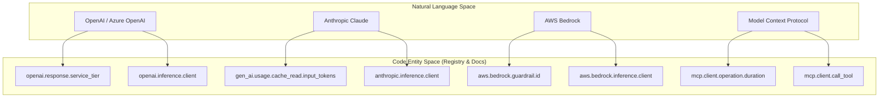
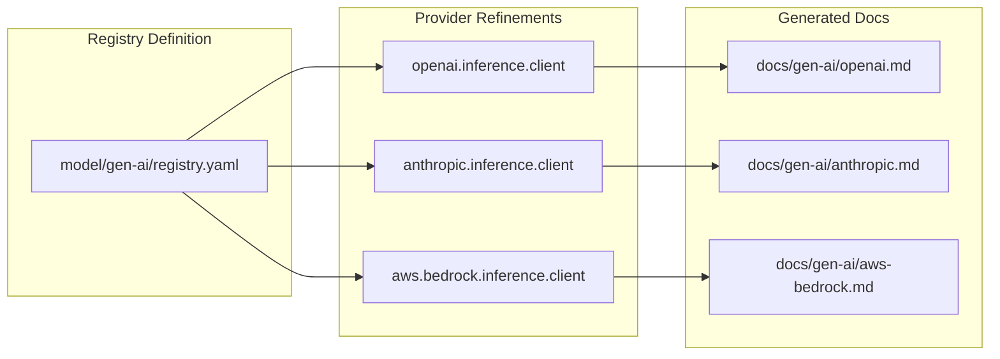

While the core Generative AI semantic conventions provide a unified baseline for observability, different AI providers often have unique features, metadata, and billing models. The `semantic-conventions-genai` repository uses **refinements** to extend the base `gen_ai.*` attributes and spans for specific providers like OpenAI, Anthropic, and AWS Bedrock.

This page provides a high-level overview of how these provider-specific extensions are structured. For deep technical details, refer to the child pages linked in each section.

### Provider Extension Architecture

The repository manages provider-specific logic by defining specialized attributes and refining existing span definitions. For example, a standard `inference` span is refined into an `openai.inference.client` or `anthropic.inference.client` span, allowing for provider-specific requirement levels and custom attributes.

#### Provider Mapping to Code Entities
The following diagram illustrates how natural language provider concepts map to specific instrumentation requirements and code-level identifiers used in the semantic convention registry.

**Natural Language to Code Entity Mapping**

Sources: [docs/gen-ai/openai.md:28-59](), [docs/gen-ai/anthropic.md:26-68](), [docs/gen-ai/aws-bedrock.md:19-49]()

---

### OpenAI & Azure AI Inference
OpenAI and Azure AI Inference share similar patterns but include specific metadata for enterprise features. Key extensions include `openai.response.service_tier` to track whether a request used "scale" or "default" tiers, and `openai.response.system_fingerprint` for tracking model determinism.

For Azure, the `azure.resource_provider.namespace` attribute is recommended to identify the specific Azure AI service instance.

For details, see [OpenAI & Azure AI Inference](#4.1).

Sources: [docs/gen-ai/openai.md:58-59](), [docs/gen-ai/azure-ai-inference.md:55-65]()

---

### Anthropic
Anthropic conventions focus heavily on their unique prompt caching and token usage models. They utilize specific attributes for cache hits and misses, such as `gen_ai.usage.cache_read.input_tokens` and `gen_ai.usage.cache_creation.input_tokens`.

For details, see [Anthropic](#4.2).

Sources: [docs/gen-ai/anthropic.md:67-68]()

---

### AWS Bedrock
AWS Bedrock conventions incorporate AWS-specific infrastructure components like Guardrails and Knowledge Bases. Attributes like `aws.bedrock.guardrail.id` and `aws.bedrock.knowledge_base.id` are used to provide context for safety filtering and RAG operations.

For details, see [AWS Bedrock](#4.3).

Sources: [docs/gen-ai/aws-bedrock.md:38-49]()

---

### Model Context Protocol (MCP)
The Model Context Protocol (MCP) is a standardized way for AI agents to interact with tools and resources. Unlike the LLM-specific providers above, MCP conventions focus on the JSON-RPC communication between clients and servers, including method mapping and transport-specific metrics.

For details, see [Model Context Protocol (MCP)](#4.4).

Sources: [docs/registry/attributes/gen-ai.md:27-28]()

---

### Provider Implementation Overview
This table summarizes the core span refinements used by each provider to override the base GenAI behavior.

| Provider | `gen_ai.provider.name` | Key Unique Attributes | Span Naming Pattern |
| --- | --- | --- | --- |
| **OpenAI** | `"openai"` | `openai.response.service_tier` | `{gen_ai.operation.name} {gen_ai.request.model}` |
| **Anthropic** | `"anthropic"` | `gen_ai.usage.cache_read.input_tokens` | `{gen_ai.operation.name} {gen_ai.request.model}` |
| **AWS Bedrock** | `"aws.bedrock"` | `aws.bedrock.guardrail.id` | Base GenAI Standard |
| **Azure AI** | `"azure.ai.inference"`| `azure.resource_provider.namespace` | Base GenAI Standard |

**Provider Logic to Code Implementation**

Sources: [docs/gen-ai/openai.md:37-39](), [docs/gen-ai/anthropic.md:35-37](), [docs/gen-ai/aws-bedrock.md:28-30](), [docs/gen-ai/azure-ai-inference.md:24-35]()