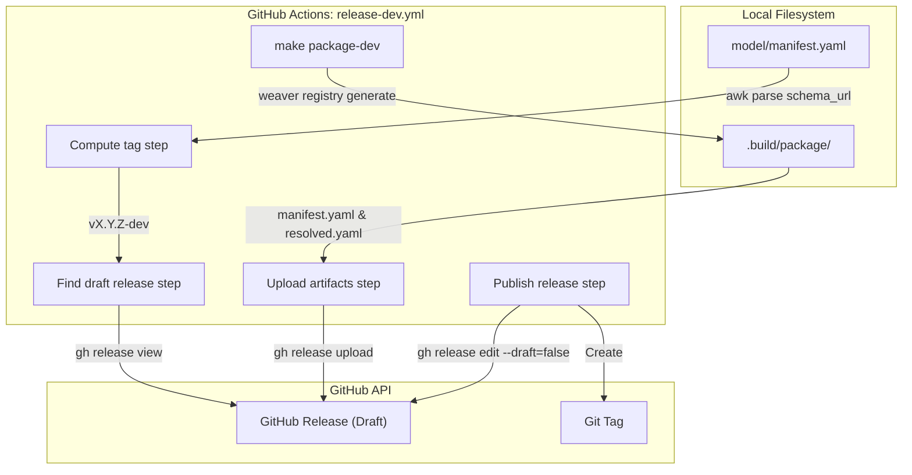
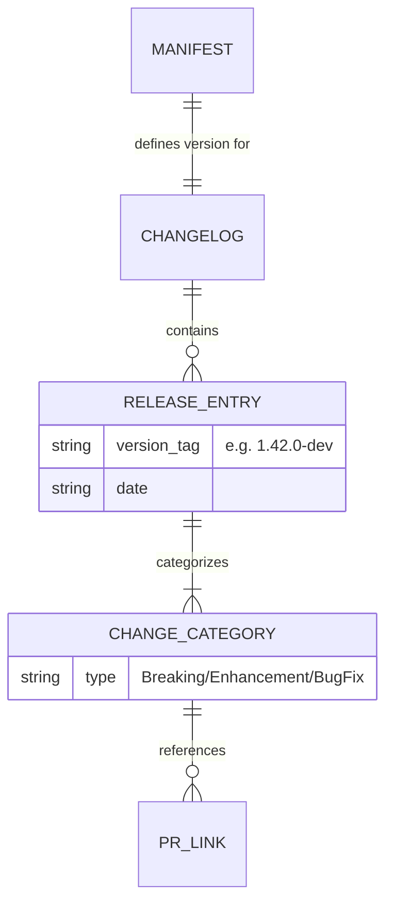

This page describes the release lifecycle and versioning strategy for the OpenTelemetry GenAI Semantic Conventions. The repository follows a release process that couples the versioning of the YAML model with the publication of generated documentation and schema artifacts.

## Versioning Strategy

The repository manages its own versioning independently of the core OpenTelemetry semantic conventions, though it maintains a dependency on a pinned version of the core registry [model/manifest.yaml:9-18]().

### The `schema_url`
The authoritative source of the current version is the `schema_url` field in the top-level manifest [model/manifest.yaml:7](). This URL serves two purposes:
1. It identifies the version of the conventions for telemetry consumers.
2. The last segment of the path (e.g., `1.42.0-dev`) is extracted by the `Makefile` and GitHub Actions to determine the release tag and artifact metadata [Makefile:68-69]().

### Dev-Channel Releases
Currently, the repository operates on a "dev channel." Versions and tags follow the format `vX.Y.Z-dev` [RELEASING.md:4-6](). The schema URLs for these releases are hosted under the `gen-ai-dev` path [RELEASING.md:6]().

## Release Workflow

Releases are initiated by updating the model metadata and finalized through an automated GitHub Action.

### 1. Release Preparation
To start a release, a contributor opens a "release-prep" Pull Request [RELEASING.md:8](). This PR must perform two critical updates:
* **Bump Version**: Update the `schema_url` in `model/manifest.yaml` to the target version [RELEASING.md:9-10]().
* **Update Changelog**: Rename the `## Unreleased` section in `CHANGELOG.md` to the new version and create a fresh `## Unreleased` block at the top [RELEASING.md:11-14]().

### 2. Publication Process
Once the prep PR is merged to `main`, a maintainer creates a **Draft Release** on GitHub [RELEASING.md:16]().
* The tag must match the version in the manifest (e.g., `v1.43.0-dev`) [RELEASING.md:17]().
* The release notes are populated by copying the entries from `CHANGELOG.md` [RELEASING.md:18]().

The actual publication is handled by the `Release (dev)` workflow [RELEASING.md:20]().

### Release Automation Data Flow
The following diagram illustrates how the `release-dev.yml` workflow interacts with the codebase and GitHub API to publish artifacts.

**Title: Release Automation Logic**

Sources: [.github/workflows/release-dev.yml:16-75](), [RELEASING.md:1-23](), [Makefile:159-165]()

## Artifact Generation

When a release is cut, the toolchain generates specific artifacts that are attached to the GitHub Release.

| Artifact | Generation Command | Description |
| :--- | :--- | :--- |
| `manifest.yaml` | `make package-dev` | The publication manifest for the release [Makefile:159-165](). |
| `resolved.yaml` | `make package-dev` | The fully resolved semantic convention registry, including all inherited attributes from upstream [Makefile:159-165](). |
| `schema-snapshot/registry.yaml` | `make schema-snapshot` | A committed version of the resolved registry used for PR diffing [Makefile:149-155](). |

### Schema Snapshot
The `schema-snapshot/registry.yaml` is a key part of the versioning process. It allows reviewers to see the "final" state of the registry (including resolved references and refinements) in a single file during a PR review [CONTRIBUTING.md:54-55](). It is updated automatically whenever `make generate-all` is run [Makefile:145]().

Sources: [Makefile:145-165](), [CONTRIBUTING.md:46-55]()

## Changelog Process

The `CHANGELOG.md` is the source of truth for human-readable changes. It is organized by change type to help consumers understand the impact of a new version.

### Change Categories
The file uses a standardized set of subsections under the `## Unreleased` header [CHANGELOG.md:3-34]():
* **Breaking changes**: Incompatible modifications to existing conventions.
* **Deprecations**: Attributes or spans marked for future removal.
* **New components**: Addition of entirely new namespaces or signal types.
* **Enhancements**: Additions to existing components (e.g., new attributes in a span).
* **Bug fixes**: Corrections to existing definitions.
* **Clarifications**: Editorial updates to descriptions or notes.

### Maintenance
Every PR that modifies the conventions in the `model/` directory is expected to include a corresponding entry in the `Unreleased` section [CONTRIBUTING.md:84-86]().

**Title: Changelog and Versioning Entity Relationship**

Sources: [CHANGELOG.md:1-34](), [RELEASING.md:8-14](), [CONTRIBUTING.md:84-86]()