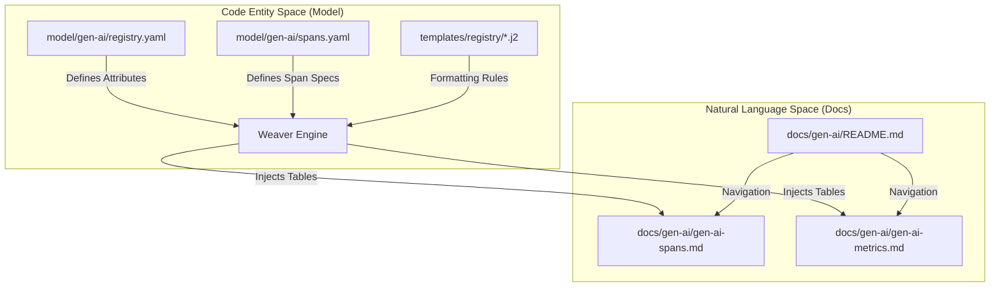

This page provides an overview of the human-readable documentation for Generative AI semantic conventions. These documents are located in the `docs/gen-ai/` directory and are largely generated from the YAML model definitions using the [Weaver](https://github.com/open-telemetry/weaver) toolchain.

The documentation is organized by signal type (spans, metrics, events) and extended by provider-specific refinements (e.g., OpenAI, Anthropic, AWS Bedrock).

### Documentation Architecture

The documentation system bridges the gap between abstract YAML definitions and practical implementation guidance for instrumentation authors.

**Documentation Generation Flow**

**Sources:** [docs/README.md:18-29](), [CONTRIBUTING.md:21-31](), [docs/gen-ai/gen-ai-spans.md:29-33]()

---

### Core Span Conventions
The core span documentation defines the foundational operations for GenAI clients. This includes `inference` (chat, completions), `embeddings`, `retrievals`, `memory`, and `execute_tool` spans. It establishes standard span naming patterns, such as `{gen_ai.operation.name} {gen_ai.request.model}`, and details how to record sensitive content like prompts and responses.

For details, see [Core Span Conventions](#3.1).

**Sources:** [docs/gen-ai/gen-ai-spans.md:25-40](), [schema-snapshot/registry.yaml:108-174]()

---

### Agent & Workflow Span Conventions
As GenAI systems evolve into autonomous agents, these conventions provide a hierarchy for multi-step processes. This includes spans for creating and invoking agents, executing workflows, and the `plan` operation for task decomposition. It addresses the complexity of nested spans where an agent might call multiple tools or sub-agents.

For details, see [Agent & Workflow Span Conventions](#3.2).

**Sources:** [CHANGELOG.md:19-24](), [schema-snapshot/registry.yaml:138-157]()

---

### Metrics & Events Conventions
The metrics documentation covers histogram instruments used to track operational health, such as token usage, operation duration, and Time to First Chunk (TTFC). The events documentation defines structured logs for fine-grained details that occur during a span's lifetime, such as specific inference operation details or evaluation results.

For details, see [Metrics & Events Conventions](#3.3).

**Sources:** [docs/gen-ai/README.md:9-13](), [CHANGELOG.md:23-24]()

---

### Exception Conventions
Errors in GenAI operations are handled through a combination of the `error.type` attribute on spans and a specific `gen_ai.client.operation.exception` event. The documentation provides guidance on mapping provider-specific error codes (e.g., from AWS Bedrock or OpenAI) to these standard fields to ensure cross-provider observability.

For details, see [Exception Conventions](#3.4).

**Sources:** [docs/gen-ai/README.md:12-12](), [schema-snapshot/registry.yaml:1-18]()

---

### Structured Content Schemas
To handle the complexity of multi-modal inputs (text, images, documents) and tool calls, the conventions rely on rigorous JSON schemas. These schemas define the structure for `gen_ai.input.messages`, `gen_ai.output.messages`, and tool definitions, ensuring that telemetry remains interoperable across different backends.

For details, see [Structured Content Schemas](#3.5).

**Sources:** [schema-snapshot/registry.yaml:49-102](), [CHANGELOG.md:16-18]()

---

### Relationship between Model and Documentation

The following diagram illustrates how the `registry.yaml` file informs the human-readable tables found in the `docs/` directory.

**Model-to-Doc Mapping**
```mermaid
classDiagram
    class "registry.yaml" {
        +gen_ai.operation.name
        +gen_ai.request.model
        +gen_ai.input.messages
    }
    class "gen-ai-spans.md" {
        +Table: Attributes
        +Requirement Levels
        +Example Values
    }
    class "JSON Schemas" {
        +gen-ai-input-messages.json
        +gen-ai-tool-definitions.json
    }
    "registry.yaml" --|> "gen-ai-spans.md" : "Weaver transforms"
    "registry.yaml" ..> "JSON Schemas" : "References for validation"
```
**Sources:** [CONTRIBUTING.md:44-55](), [schema-snapshot/registry.yaml:89-92]()