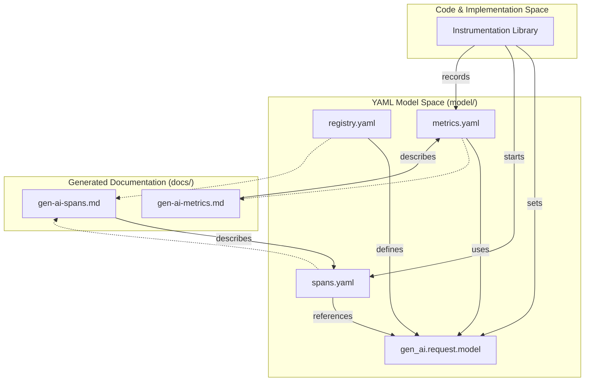
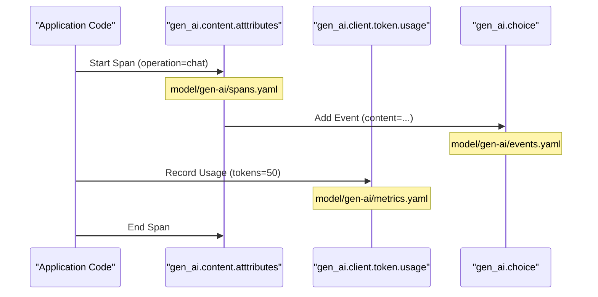

The **Semantic Convention Model** defines the structure, behavior, and requirements for telemetry emitted by Generative AI systems. This model is defined using a YAML-based schema that is processed by the [Weaver](https://github.com/open-telemetry/weaver) toolchain to generate human-readable documentation and machine-readable schema snapshots.

The model is located primarily in the `model/` directory and is organized by namespace and signal type. It establishes a unified language for describing LLM inference, vector database interactions (retrieval), agentic workflows, and the Model Context Protocol (MCP).

### Directory Structure

The model is partitioned into logical groups based on the entity or provider being described:

*   `model/gen-ai/`: The core registry for general-purpose GenAI telemetry, including base attributes (`gen_ai.*`), span definitions (inference, retrieval), and common metrics.
*   `model/mcp/`: Definitions specific to the [Model Context Protocol](https://modelcontextprotocol.io), covering client and server operations (`mcp.*`).
*   `model/aws-bedrock/`: Provider-specific extensions and refinements for AWS Bedrock services.
*   `model/openai/`: Provider-specific attributes for OpenAI and compatible APIs.

Sources: [model/manifest.yaml:1-8](), [model/gen-ai/registry.yaml:1-3]()

### Model Components

The semantic convention model is composed of three primary building blocks that define how GenAI operations are observed.

#### 1. Attribute Registry
The registry is the foundation of the model. It defines individual data points (attributes) such as `gen_ai.request.model`, their data types (string, int, double), and their stability levels. It also manages the allowed values for enumerations, such as the list of supported `gen_ai.provider.name` values.

For details, see [Attribute Registry](#2.1).

#### 2. Span Definitions
Spans represent units of work in a GenAI system. The model defines several span types to categorize different operations, including:
*   **Inference**: Chat completions and text generation.
*   **Embeddings**: Vectorization of text.
*   **Retrieval**: Querying data sources or vector stores.
*   **Agent/Workflow**: High-level orchestration and planning.

Each span definition specifies which attributes from the registry are `required`, `recommended`, or `opt_in`.

For details, see [Span Definitions](#2.2).

#### 3. Metrics & Events
Metrics define quantitative measurements like `gen_ai.client.token.usage` (histograms), while Events define structured log-like entries for point-in-time occurrences, such as a specific content block being generated during a stream.

For details, see [Metrics & Events Definitions](#2.3).

### Relationship between Model and Code

The following diagram illustrates how the YAML definitions in the `model/` directory map to the conceptual entities used by instrumentation libraries and the generated documentation.

**Model Entity Mapping**

Sources: [model/gen-ai/registry.yaml:99-103](), [model/manifest.yaml:1-6]()

### Signal Interaction

The model ensures that different signals (spans, metrics, and events) share a consistent context. For example, a `gen_ai.client.operation.duration` metric is expected to carry the same `gen_ai.request.model` attribute defined in the registry and used by the corresponding inference span.

**Signal Correlation Flow**

Sources: [model/gen-ai/registry.yaml:104-108](), [model/gen-ai/registry.yaml:174-180]()

### External Dependencies
The model depends on a filtered version of the upstream OpenTelemetry semantic conventions. This allows the GenAI-specific model to reference standard attributes (like `server.address` or `error.type`) while remaining the canonical source for `gen_ai.*` and `mcp.*` namespaces.

Sources: [model/manifest.yaml:9-19]()