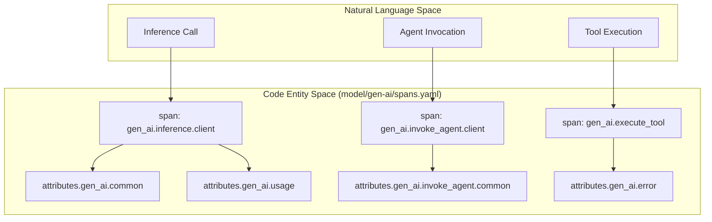
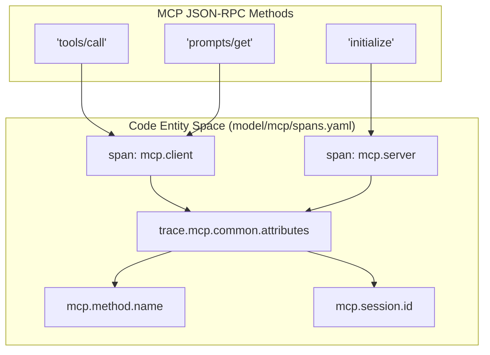

This page details the technical implementation of span definitions within the Generative AI semantic conventions. Spans are defined using the OpenTelemetry Semantic Convention YAML format (version 2) and are categorized into two primary namespaces: `gen_ai` for general model operations and agentic workflows, and `mcp` for the Model Context Protocol.

## Architecture of Span Definitions

Spans in this repository are defined in `model/gen-ai/spans.yaml` and `model/mcp/spans.yaml`. These definitions utilize `attribute_groups` to promote reuse and consistency across different operation types.

### Data Flow and Model Resolution
The YAML files serve as the source of truth. The `weaver` toolchain resolves these definitions, expanding `ref_group` and `ref` pointers into a flat structure used for documentation and code generation.

### Natural Language to Code Entity Mapping: GenAI Spans
The following diagram illustrates how high-level GenAI operations described in documentation map to the specific span types and attribute groups defined in `model/gen-ai/spans.yaml`.

Sources: [model/gen-ai/spans.yaml:129-155](), [model/gen-ai/spans.yaml:124-128](), [model/gen-ai/spans.yaml:2-26]()

## Core GenAI Span Types

The `gen_ai` namespace defines spans for the full lifecycle of a Generative AI request.

### Inference Spans
The `gen_ai.inference.client` span represents a call to a model to generate a response.
- **Naming Convention**: `{gen_ai.operation.name} {gen_ai.request.model}` [model/gen-ai/spans.yaml:134-136]().
- **Requirement Levels**: `gen_ai.operation.name` is required [model/gen-ai/spans.yaml:24-25](), while `gen_ai.request.model` is conditionally required if available [model/gen-ai/spans.yaml:17-19]().

### Agent and Workflow Spans
- **`gen_ai.invoke_agent.client`**: Describes the top-level invocation of an agentic system [model/gen-ai/spans.yaml:124-128]().
- **`gen_ai.execute_tool`**: Represents the execution of a specific tool. It is often a child of an inference or agent span.

### Attribute Groups
Attributes are bundled into logical groups to ensure consistency:
| Group ID | Description | Key Attributes |
| --- | --- | --- |
| `attributes.gen_ai.common` | Core identification | `gen_ai.operation.name`, `gen_ai.request.model` |
| `attributes.gen_ai.usage` | Token consumption | `gen_ai.usage.input_tokens`, `gen_ai.usage.output_tokens` |
| `attributes.gen_ai.content` | Payload recording | `gen_ai.input.messages`, `gen_ai.output.messages` |
| `attributes.gen_ai.error` | Error reporting | `error.type` |

Sources: [model/gen-ai/spans.yaml:2-61]()

## Model Context Protocol (MCP) Spans

MCP spans are defined in `model/mcp/spans.yaml` and track JSON-RPC based communications between MCP clients and servers.

### MCP Span Mapping
The following diagram maps MCP methods to the corresponding span entities in the model.

Sources: [model/mcp/spans.yaml:17-114](), [model/mcp/common.yaml:1-45]()

### Key MCP Span Definitions
- **`mcp.client`**: Reported by the initiator of the MCP request. It covers the duration until a response or acknowledgement is received [model/mcp/spans.yaml:31-34]().
- **`mcp.server`**: Reported by the receiver of the MCP request. It tracks the internal processing time [model/mcp/spans.yaml:80-84]().

### MCP Attribute Requirements
MCP spans require specific attributes to identify the method and context:
- `mcp.method.name`: Required. Must be a valid MCP method (e.g., `tools/call`, `resources/read`) [model/mcp/common.yaml:37-38](), [model/mcp/registry.yaml:3-132]().
- `mcp.session.id`: Recommended when the operation is part of a session [model/mcp/spans.yaml:7-9]().
- `error.type`: Conditionally required on failure. For MCP tool calls, if `isError` is true in the result, this should be set to `tool_error` [model/mcp/common.yaml:24-36]().

## Provider Refinements

The base span definitions are designed to be extended by specific providers. This is handled by refining requirement levels or adding provider-specific attributes.

### Error Handling
Errors are captured using the `error.type` attribute on the span [model/gen-ai/spans.yaml:6-12](). For terminal failures, a `gen_ai.client.operation.exception` event is also recorded, capturing the stacktrace and exception type [docs/gen-ai/gen-ai-exceptions.md:26-40]().

### Content Opt-in
Sensitive attributes like `gen_ai.input.messages` and `gen_ai.output.messages` are marked with a requirement level of `opt_in` [model/gen-ai/spans.yaml:55-58](). This ensures that content is only recorded if the user explicitly enables it in the instrumentation.

Sources: [model/gen-ai/spans.yaml:50-61](), [docs/gen-ai/gen-ai-exceptions.md:9-33]()