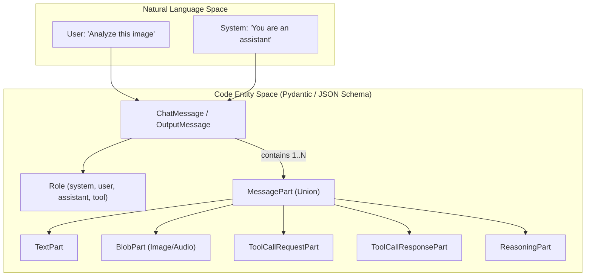
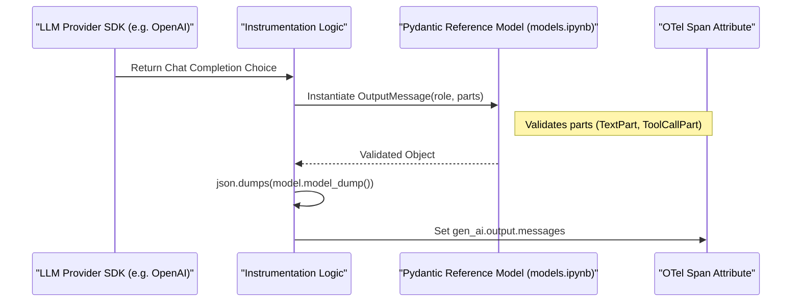

This page details the JSON schemas used to represent complex attributes in GenAI telemetry. To maintain consistency across different providers (OpenAI, Anthropic, Bedrock, etc.) and programming languages, the repository defines structured schemas for chat messages, tool definitions, retrieval results, and memory records.

## Overview of Structured Attributes

The semantic conventions for GenAI utilize complex JSON structures for attributes that contain multi-modal data, conversation history, or tool specifications. These schemas are defined under `docs/gen-ai/` and are mirrored by reference Pydantic models for implementation guidance.

### Schema Catalog

| Schema File | Attribute Mapping | Purpose |
| :--- | :--- | :--- |
| `gen-ai-input-messages.json` | `gen_ai.input.messages` | Captures conversation history and prompts. |
| `gen-ai-output-messages.json` | `gen_ai.output.messages` | Captures model responses, including tool calls. |
| `gen-ai-system-instructions.json` | `gen_ai.system.instructions` | Captures system-level directives/prompts. |
| `gen-ai-tool-definitions.json` | `gen_ai.tool.definitions` | Captures available functions/tools for the model. |
| `gen-ai-retrieval-documents.json` | `gen_ai.retrieval.documents` | Captures documents returned from RAG operations. |
| `gen-ai-memory-records.json` | `gen_ai.memory.records` | Captures records retrieved from long-term memory. |

**Sources:** [docs/gen-ai/gen-ai-input-messages.json:1-126](), [docs/gen-ai/gen-ai-output-messages.json:171-190](), [docs/gen-ai/gen-ai-tool-definitions.json:75-88]().

---

## Chat Messages and Content Modalities

The core of GenAI interaction is the `ChatMessage` (or `OutputMessage`). A message consists of a `role` and a list of `parts`. This "parts" approach allows for multi-modal inputs where a single message contains text, images, and tool results.

### Message Structure Diagram
This diagram bridges the conceptual "Chat Message" to the structured JSON/Pydantic entities used in the codebase.

**Sources:** [docs/gen-ai/gen-ai-input-messages.json:52-105](), [docs/gen-ai/non-normative/models.ipynb:50-160]().

### Content Part Types

The schema supports several specialized part types to handle modern LLM capabilities:

1.  **TextPart**: Standard string content [docs/gen-ai/gen-ai-input-messages.json:204-225]().
2.  **BlobPart**: Inline binary data (e.g., base64 images) with a required `modality` (image, video, audio, document) [docs/gen-ai/gen-ai-input-messages.json:3-51]().
3.  **ToolCallRequestPart**: Generated by the model to request a tool execution, including `id`, `name`, and `arguments` [docs/gen-ai/gen-ai-input-messages.json:173-202]().
4.  **ToolCallResponsePart**: The result of a tool execution sent back to the model [docs/gen-ai/gen-ai-input-messages.json:227-254]().
5.  **ReasoningPart**: Internal "Chain of Thought" or "Thinking" tokens produced by models like OpenAI o1 or Anthropic Claude [docs/gen-ai/gen-ai-input-messages.json:127-149]().

---

## Tool and Retrieval Schemas

Beyond chat, the schemas define how the environment and external data sources are represented.

### Tool Definitions
`gen-ai-tool-definitions.json` defines the structure for `gen_ai.tool.definitions`. It primarily supports `FunctionToolDefinition`, which includes a `name`, `description`, and a `parameters` field that must conform to **JSON Schema Draft-07** [docs/gen-ai/gen-ai-tool-definitions.json:3-51]().

### Retrieval and Memory
For RAG (Retrieval Augmented Generation) and Agentic memory, the schemas standardize how "hits" are recorded:
*   **RetrievalDocument**: Requires an `id` and a `score` (relevance) [docs/gen-ai/gen-ai-retrieval-documents.json:3-24]().
*   **MemoryRecord**: Requires `content`, and optionally includes `id`, `metadata`, and `score` [docs/gen-ai/gen-ai-memory-records.json:3-36]().

---

## Reference Implementation (Pydantic)

The repository provides a reference implementation in Python using Pydantic. This serves as the "Source of Truth" for how instrumentations should serialize GenAI data.

### Data Flow: Library to Telemetry
This diagram illustrates how a provider-specific response (e.g., from the OpenAI SDK) is mapped through the reference models into the final JSON attribute.

**Sources:** [docs/gen-ai/non-normative/models.ipynb:171-200](), [docs/gen-ai/non-normative/examples-llm-calls.md:109-124]().

### Pydantic Model Classes
The following classes in `docs/gen-ai/non-normative/models.ipynb` define the structure:

| Class Name | Description |
| :--- | :--- |
| `TextPart` | Captures `type: 'text'` and `content: str` [docs/gen-ai/non-normative/models.ipynb:50-59](). |
| `BlobPart` | Captures binary data with `modality` and `mime_type` [docs/gen-ai/non-normative/models.ipynb:152-160](). |
| `ToolCallRequestPart` | Captures `name` and `arguments` (Any) [docs/gen-ai/non-normative/models.ipynb:60-71](). |
| `ChatMessage` | Root model for inputs; requires `role` and `List[MessagePart]` [docs/gen-ai/non-normative/models.ipynb:221-236](). |
| `OutputMessage` | Root model for outputs; adds `finish_reason` [docs/gen-ai/non-normative/models.ipynb:238-258](). |

**Sources:** [docs/gen-ai/non-normative/models.ipynb:45-258]().