# OpenTelemetry Semantic Conventions for Generative AI

Source: https://deepwiki.com/open-telemetry/semantic-conventions-genai

## Summary

This repository defines a provider-neutral telemetry vocabulary for generative AI applications. Its YAML semantic model describes attributes, spans, metrics, and events for inference, embeddings, retrieval, memory, tool execution, agents, workflows, and Model Context Protocol operations. Instrumentation can therefore represent the same logical operation consistently even when applications switch between OpenAI, Anthropic, Azure AI, AWS Bedrock, or orchestration frameworks.

The span model separates model calls from the surrounding agent workflow. An inference span records the requested and returned model, token usage, response identifiers, finish reasons, and errors. Parent spans represent agent creation or invocation, planning, workflows, retrieval, memory, and tool execution. For streaming calls, the inference span remains open across chunks so it can record time to first chunk and final usage data. Metrics aggregate duration, token use, and streaming responsiveness, while events retain point-in-time details that should correlate with the active trace.

Content capture is deliberately opt-in because prompts, responses, tool arguments, retrieved documents, and memory can contain sensitive data. When enabled, provider-neutral JSON schemas encode messages as typed parts such as text, blobs, reasoning, tool requests, and tool responses. Large content may instead be stored externally and referenced by URL. Provider-specific registries refine the common model only where a platform exposes additional information, preserving a portable core.

The repository also treats implementability as part of specification quality. Deterministic mock provider servers, runnable SDK scenarios, Weaver validation, and coverage reports test whether required attributes can be captured honestly from public library APIs. This closes the gap between a declarative convention and telemetry that real instrumentation can emit.

## Knowledge Map

- GenAI operation spans and agent/workflow trace hierarchy
- Correlated spans, metrics, events, errors, and streaming signals
- Opt-in content capture and structured multimodal payload schemas
- Provider refinements over a portable core convention
- MCP client/server trace propagation and operation mapping
- Executable reference scenarios and implementation coverage

## Key Takeaways

- Model calls, retrieval, memory, tools, planning, and workflows need distinct span boundaries.
- Sensitive GenAI payloads should never be recorded by default.
- Typed content schemas make multimodal and tool-use telemetry interoperable.
- Provider extensions should refine shared semantics rather than replace them.
- A semantic convention is credible only when real SDK scenarios can emit and validate it.

## Detailed Extracted Notes


# semantic-conventions-genai Documentation Index

This file contains links to all extracted documents.
Please refer to the files below for detailed information.

- [Introduction](semantic-conventions-genai/Introduction.md)
- [Overview](semantic-conventions-genai/Overview.md)
- [Getting Started  Contributing](semantic-conventions-genai/Getting_Started__Contributing.md)
- [Release  Versioning](semantic-conventions-genai/Release__Versioning.md)
- [Semantic Convention Model](semantic-conventions-genai/Semantic_Convention_Model.md)
- [Attribute Registry](semantic-conventions-genai/Attribute_Registry.md)
- [Span Definitions](semantic-conventions-genai/Span_Definitions.md)
- [Metrics  Events Definitions](semantic-conventions-genai/Metrics__Events_Definitions.md)
- [Semantic Convention Documentation](semantic-conventions-genai/Semantic_Convention_Documentation.md)
- [Core Span Conventions](semantic-conventions-genai/Core_Span_Conventions.md)
- [Agent  Workflow Span Conventions](semantic-conventions-genai/Agent__Workflow_Span_Conventions.md)
- [Metrics  Events Conventions](semantic-conventions-genai/Metrics__Events_Conventions.md)
- [Exception Conventions](semantic-conventions-genai/Exception_Conventions.md)
- [Structured Content Schemas](semantic-conventions-genai/Structured_Content_Schemas.md)
- [Provider-Specific Conventions](semantic-conventions-genai/Provider-Specific_Conventions.md)
- [OpenAI  Azure AI Inference](semantic-conventions-genai/OpenAI__Azure_AI_Inference.md)
- [Anthropic](semantic-conventions-genai/Anthropic.md)
- [AWS Bedrock](semantic-conventions-genai/AWS_Bedrock.md)
- [Model Context Protocol MCP](semantic-conventions-genai/Model_Context_Protocol_MCP.md)
- [Coverage Reports](semantic-conventions-genai/Coverage_Reports.md)
- [Using uv](semantic-conventions-genai/Using_uv.md)
- [Or via python module](semantic-conventions-genai/Or_via_python_module.md)
- [PR Dashboard  Notifications](semantic-conventions-genai/PR_Dashboard__Notifications.md)

The AWS Bedrock semantic conventions extend the core Generative AI conventions to capture provider-specific metadata and operations unique to the Amazon Bedrock ecosystem. This includes support for Guardrails, Knowledge Bases, and specialized operations like `invoke_agent`.

## Overview

AWS Bedrock instrumentation focuses on capturing the unique identifiers used in the AWS ecosystem to manage model safety and Retrieval Augmented Generation (RAG). It refines the standard `gen_ai` spans by adding attributes for Bedrock-specific features and ensuring that error reporting aligns with AWS service error codes.

### Key Requirements
- **Provider Name**: `gen_ai.provider.name` MUST be set to `"aws.bedrock"` [docs/gen-ai/aws-bedrock.md:14-14]().
- **Span Kind**: Operations SHOULD be captured as `CLIENT` spans [docs/gen-ai/aws-bedrock.md:30-30]().
- **Operation Names**: Common operations include `chat`, `generate_content`, `text_completion`, and the Bedrock-specific `invoke_agent` [docs/gen-ai/aws-bedrock.md:39-39]().

## Provider-Specific Attributes

Bedrock introduces specific attributes to track the usage of safety and data augmentation tools.

| Attribute | Type | Description |
| :--- | :--- | :--- |
| `aws.bedrock.guardrail.id` | `string` | Unique identifier of the Bedrock Guardrail used to safeguard model responses [model/aws-bedrock/registry.yaml:3-9](). |
| `aws.bedrock.knowledge_base.id` | `string` | Unique identifier of the Bedrock Knowledge base used for RAG [model/aws-bedrock/registry.yaml:10-17](). |

**Sources:** [docs/gen-ai/aws-bedrock.md:38-49](), [model/aws-bedrock/registry.yaml:1-18]()

## Data Flow and Operation Mapping

The following diagram illustrates how natural language requests from a user are processed through the Bedrock infrastructure and how they map to specific code entities and span attributes.

### Bedrock Operation Lifecycle
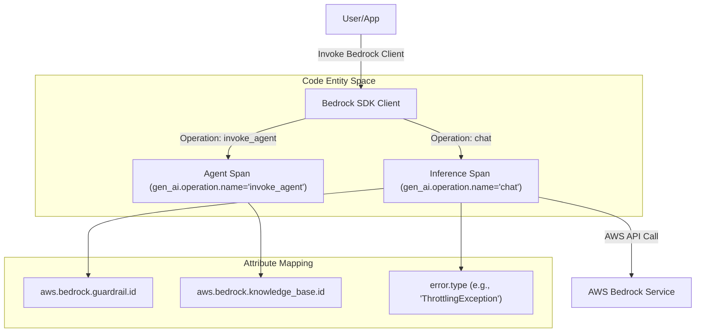
**Sources:** [docs/gen-ai/aws-bedrock.md:38-49](), [docs/gen-ai/aws-bedrock.md:61-63]()

## Retrieval Augmented Generation (RAG)

AWS Bedrock Knowledge Bases allow models to query external data. When a Knowledge Base is utilized, the `aws.bedrock.knowledge_base.id` is recorded on the span to provide traceability for the data source used in the retrieval step.

### RAG Trace Structure
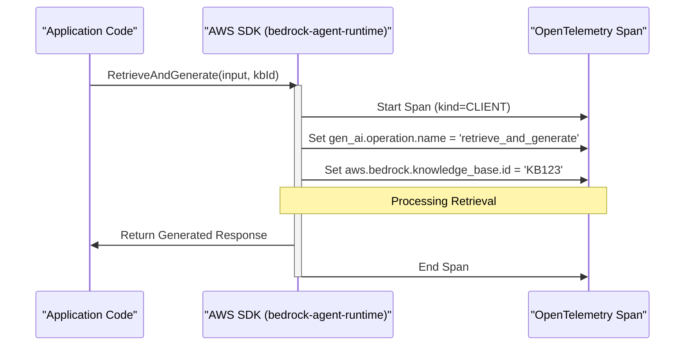
**Sources:** [docs/gen-ai/aws-bedrock.md:49-49](), [model/aws-bedrock/registry.yaml:10-17]()

## Error Handling

Bedrock operations use specific AWS error codes for `error.type`. This allows for fine-grained analysis of failures such as throttling, validation errors, or model-specific issues.

Common `error.type` values for Bedrock include:
- `AccessDeniedException`
- `ThrottlingException`
- `ModelNotReadyException`
- `ValidationException`

**Sources:** [docs/gen-ai/aws-bedrock.md:41-41](), [docs/gen-ai/aws-bedrock.md:61-63]()

## Reference Implementation

The `semantic-conventions-genai` repository provides reference scenarios to validate these conventions against actual AWS SDK behavior.

| Component | Role | Location |
| :--- | :--- | :--- |
| **Scenario** | Validates span attribute emission for Bedrock | [reference/scenarios/aws-bedrock/scenario.py]() |
| **Mock Server** | Simulates Bedrock API responses for testing | [reference/src/semconv_genai/mock_server/bedrock.py]() |

**Sources:** [reference/scenarios/aws-bedrock/scenario.py](), [reference/src/semconv_genai/mock_server/bedrock.py]()
This page describes the semantic conventions for GenAI agents and framework-level operations. As Generative AI models evolve to use tools, plan tasks, and execute multi-step workflows, these conventions provide a standardized way to trace the reasoning, logic, and external information access that characterize "agentic" systems [docs/gen-ai/gen-ai-agent-spans.md:22-24]().

## Overview of Agentic Spans

The conventions distinguish between the lifecycle of an agent (creation), the execution of an agent's logic (invocation), and the higher-level orchestration of multiple steps (workflows and planning).

### Span Types and Hierarchy

| Span Type | Purpose | Span Kind |
| --- | --- | --- |
| `gen_ai.create_agent.client` | Creation of a remote agent service or assistant. | `CLIENT` |
| `gen_ai.invoke_agent.client` | Client-side call to a remote agent service. | `CLIENT` |
| `gen_ai.invoke_agent.internal` | Local execution of agent logic within a framework. | `INTERNAL` |
| `gen_ai.invoke_workflow` | High-level orchestration of multiple GenAI tasks. | `INTERNAL` |
| `gen_ai.plan` | Reasoning or step-generation phase of an agent. | `INTERNAL` |

**Sources:** [docs/gen-ai/gen-ai-agent-spans.md:13-17](), [model/gen-ai/spans.yaml:129-131]()

### Agent Interaction Flow
The following diagram illustrates how these spans relate in a typical agentic system, bridging the "Natural Language Space" (User Intent) to the "Code Entity Space" (Span Operations).

**Title: Agentic System Execution Flow**
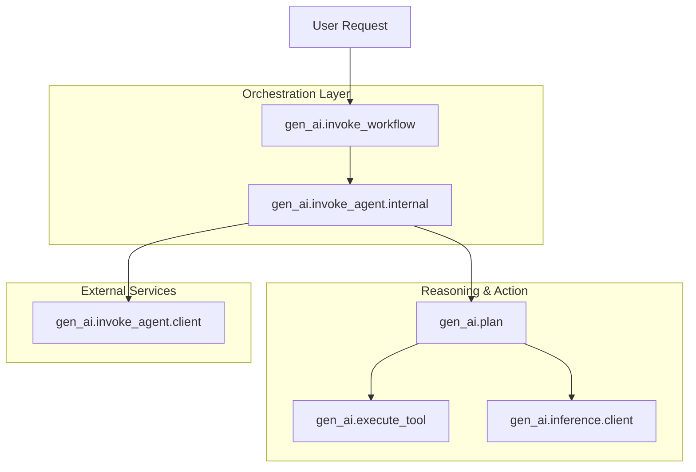
**Sources:** [docs/gen-ai/gen-ai-agent-spans.md:22-28](), [model/gen-ai/spans.yaml:130-149]()

---

## Core Agent Operations

### Create Agent
Used primarily when working with remote services that persist agent configurations (e.g., OpenAI Assistants or AWS Bedrock Agents).

*   **Operation Name:** `create_agent` [docs/gen-ai/gen-ai-agent-spans.md:43]()
*   **Span Name:** `create_agent {gen_ai.agent.name}` [docs/gen-ai/gen-ai-agent-spans.md:45]()
*   **Key Attributes:**
    *   `gen_ai.agent.id`: Unique identifier (e.g., `asst_...`) [docs/gen-ai/gen-ai-agent-spans.md:60]()
    *   `gen_ai.system_instructions`: The instructions/persona provided to the agent [docs/gen-ai/gen-ai-agent-spans.md:66]()

### Invoke Agent (Client vs. Internal)
An agent invocation represents the end-to-end process of an agent attempting to fulfill a goal.

*   **Invoke Agent Client:** Represents a call to a managed service (e.g., AWS Bedrock `InvokeAgent`). The span kind is `CLIENT` [docs/gen-ai/gen-ai-agent-spans.md:48]().
*   **Invoke Agent Internal:** Represents a framework (e.g., LangChain, PydanticAI) running an agent loop locally. The span kind is `INTERNAL`.

**Sources:** [docs/gen-ai/gen-ai-agent-spans.md:14-15](), [model/gen-ai/spans.yaml:62-128]()

---

## Workflows and Planning

### Invoke Workflow
Workflows represent complex, often multi-agent, sequences. This span acts as a parent to multiple agent invocations or tool calls.

*   **Operation Name:** `invoke_workflow`
*   **Attributes:** Includes `gen_ai.operation.name` and standard metadata.

### Plan Span
Planning spans capture the "thinking" phase where a model determines which tools to use or what steps to take.

*   **Operation Name:** `plan`
*   **Hierarchy:** Typically a child of `invoke_agent` and a parent of `inference` spans that generate the plan.

**Sources:** [docs/gen-ai/gen-ai-agent-spans.md:16-17](), [model/gen-ai/spans.yaml:129-150]()

---

## Integration: Tools and Data Sources

Agents often interact with external systems via tools or retrieve information from data sources (RAG).

### Tool Execution
When an agent decides to use a tool, it emits a `gen_ai.execute_tool` span. For Model Context Protocol (MCP) integrations, the `mcp.client` span is compatible with the `execute_tool` definition [docs/gen-ai/mcp.md:145-146]().

### Data Source Integration
Attributes are provided to link agent operations to specific knowledge bases or data stores.
*   `gen_ai.data_source.id`: The identifier for the vector database or knowledge base being queried [model/gen-ai/spans.yaml:120-122]().

**Title: Code-to-Span Mapping for Tool Calls**
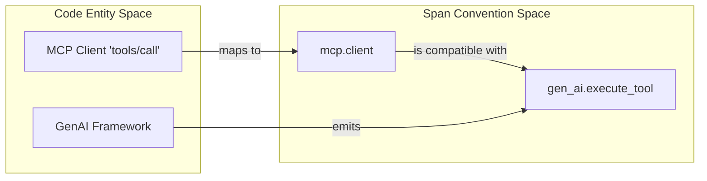
**Sources:** [docs/gen-ai/mcp.md:145-153](), [model/gen-ai/spans.yaml:59-60]()

---

## Attribute Requirements

The following attributes are frequently used across agent and workflow spans to provide context:

| Attribute | Requirement Level | Description |
| --- | --- | --- |
| `gen_ai.agent.id` | Conditionally Required | Unique ID of the agent [model/gen-ai/spans.yaml:108-110]() |
| `gen_ai.agent.name` | Conditionally Required | Human-readable name [model/gen-ai/spans.yaml:111-113]() |
| `gen_ai.conversation.id` | Conditionally Required | Links spans to a specific session/thread [model/gen-ai/spans.yaml:92-94]() |
| `gen_ai.operation.name` | Required | e.g., `create_agent`, `plan`, `chat` [model/gen-ai/spans.yaml:24-25]() |

**Sources:** [model/gen-ai/spans.yaml:14-123](), [docs/gen-ai/gen-ai-agent-spans.md:54-66]()
This page defines the provider-specific semantic conventions for [Anthropic](https://www.anthropic.com/) within the Generative AI instrumentation framework. These conventions extend the core GenAI spans and metrics to account for Anthropic-specific features such as prompt caching and reasoning tokens.

## Overview

Anthropic instrumentation focuses on capturing high-fidelity telemetry for Claude models. Key differentiators from the base conventions include specialized token usage tracking (cache hits/misses) and the inclusion of reasoning-specific metrics.

### Key Requirements
*   **Provider Name**: `gen_ai.provider.name` MUST be set to `"anthropic"` [docs/gen-ai/anthropic.md:24-24]().
*   **Span Naming**: The span name MUST follow the format `{gen_ai.operation.name} {gen_ai.request.model}` [docs/gen-ai/anthropic.md:37-37]().
*   **Span Kind**: Operations should be recorded as `CLIENT` spans [docs/gen-ai/anthropic.md:39-39]().

**Sources:** [docs/gen-ai/anthropic.md:24-39]()

---

## Token Calculation Logic

Anthropic provides granular details regarding token usage, particularly for prompt caching. Total input tokens are often a sum of several components.

### Usage Attributes
Anthropic instrumentations SHOULD populate the following attributes to provide a complete picture of cost and performance:

| Attribute | Description |
| :--- | :--- |
| `gen_ai.usage.input_tokens` | The total number of input tokens. [model/gen-ai/spans.yaml:41-42]() |
| `gen_ai.usage.cache_read.input_tokens` | Tokens served from a provider-managed cache (cache hits). [docs/gen-ai/anthropic.md:68-68]() |
| `gen_ai.usage.cache_creation.input_tokens` | Tokens written to a provider-managed cache (cache misses/creation). [docs/gen-ai/anthropic.md:67-67]() |
| `gen_ai.usage.output_tokens` | The number of tokens generated by the model. [model/gen-ai/spans.yaml:47-48]() |

### Data Flow: Usage Attribution
The following diagram illustrates how raw response data from the Anthropic API is mapped to OpenTelemetry attributes.

**Anthropic Token Mapping**
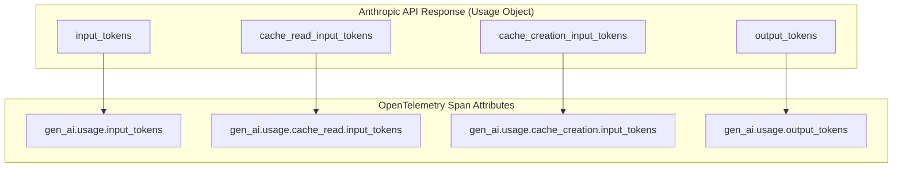
**Sources:** [model/gen-ai/spans.yaml:38-48](), [docs/gen-ai/anthropic.md:67-70]()

---

## Reasoning Tokens

For models supporting reasoning (e.g., Claude 3.7 Sonnet), the instrumentation tracks tokens used for internal chain-of-thought processing. These are captured using the `gen_ai.usage.output_tokens` attribute in conjunction with provider-specific extensions if available.

| Attribute | Purpose |
| :--- | :--- |
| `gen_ai.usage.output_tokens` | Includes both the final visible response and the internal reasoning tokens. [docs/gen-ai/anthropic.md:70-70]() |

**Sources:** [docs/gen-ai/anthropic.md:70-70]()

---

## Attribute Requirements

Anthropic spans refine the requirement levels for several core attributes to ensure consistency across implementations.

### Required and Recommended Attributes
| Attribute | Requirement Level | Note |
| :--- | :--- | :--- |
| `gen_ai.operation.name` | Required | e.g., `chat` [docs/gen-ai/anthropic.md:47-47]() |
| `gen_ai.request.model` | Conditionally Required | The requested model name [docs/gen-ai/anthropic.md:52-52]() |
| `error.type` | Conditionally Required | If the operation fails [docs/gen-ai/anthropic.md:48-48]() |
| `gen_ai.response.id` | Recommended | The unique ID from Anthropic [docs/gen-ai/anthropic.md:64-64]() |
| `gen_ai.request.max_tokens` | Recommended | User-defined limit [docs/gen-ai/anthropic.md:57-57]() |

### Error Handling
When an Anthropic operation fails, the `error.type` attribute SHOULD match the error code returned by the Anthropic API or the exception name from the client library [model/gen-ai/spans.yaml:9-12](). For catastrophic failures, a `gen_ai.client.operation.exception` event should be emitted [docs/gen-ai/gen-ai-exceptions.md:26-28]().

**Sources:** [docs/gen-ai/anthropic.md:45-66](), [model/gen-ai/spans.yaml:3-12](), [docs/gen-ai/gen-ai-exceptions.md:26-31]()

---

## Implementation Diagram

The following diagram bridges the Anthropic SDK concepts to the Semantic Convention model entities.

**SDK to Semantic Convention Mapping**
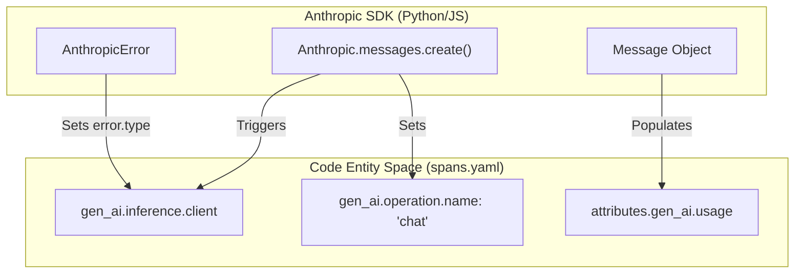

**Sources:** [model/gen-ai/spans.yaml:130-155](), [docs/gen-ai/anthropic.md:22-43]()
The Attribute Registry serves as the central source of truth for all metadata keys used across Generative AI and Model Context Protocol (MCP) telemetry. By defining attributes in a centralized registry, the project ensures consistency across spans, metrics, and events, regardless of the underlying LLM provider or orchestration framework.

## Architecture and Namespaces

Attributes are partitioned into namespaces to manage scope and prevent collisions. The registry is defined across multiple YAML files within the `model/` directory, which are then processed by the `weaver` toolchain to generate documentation and schema snapshots.

### Key Namespaces
- **`gen_ai.*`**: Core attributes applicable to most Generative AI operations (e.g., `gen_ai.request.model`, `gen_ai.usage.input_tokens`). Defined in [model/gen-ai/registry.yaml:2-100]().
- **`mcp.*`**: Attributes specific to the Model Context Protocol, covering client/server interactions and JSON-RPC method mappings.
- **`openai.*`**: Provider-specific extensions for OpenAI-compatible APIs, such as `openai.response.system_fingerprint`. Defined in [model/openai/registry.yaml:2-40]().
- **`aws.bedrock.*`**: Attributes unique to the AWS Bedrock ecosystem, including Guardrails and Knowledge Bases. Defined in [model/aws-bedrock/registry.yaml:2-18]().

### Attribute Data Flow
The following diagram illustrates how raw YAML definitions in the `model/` directory are transformed into the final registry documentation.

**Registry Transformation Pipeline**
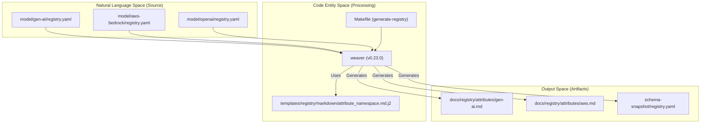
Sources: [model/gen-ai/registry.yaml:1-100](), [versions.env:2-5](), [docs/registry/attributes/gen-ai.md:1-4]()

## Attribute Definitions

Each entry in the registry contains metadata required for both human understanding and automated validation.

### Core Properties
| Property | Description | Code Reference |
| :--- | :--- | :--- |
| `key` | The fully qualified name (e.g., `gen_ai.request.temperature`). | [model/gen-ai/registry.yaml:114]() |
| `type` | Primitive (string, int, double, boolean) or Enum (members). | [model/gen-ai/registry.yaml:115]() |
| `stability` | Typically `development` for GenAI attributes. | [model/gen-ai/registry.yaml:118]() |
| `brief` | A short, one-line description of the attribute's purpose. | [model/gen-ai/registry.yaml:116]() |
| `examples` | An array of valid example values. | [model/gen-ai/registry.yaml:117]() |

### Provider Discriminator: `gen_ai.provider.name`
The `gen_ai.provider.name` attribute is a critical enum that acts as a discriminator for the telemetry format. It determines which provider-specific attributes (like `openai.*` or `aws.bedrock.*`) are expected on a span.

**Provider Logic and Mapping**
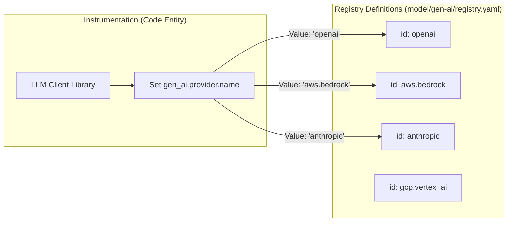
Sources: [model/gen-ai/registry.yaml:3-76](), [docs/gen-ai/anthropic.md:24-35]()

## Complex Attributes and JSON Schemas

Some attributes, such as `gen_ai.input.messages` and `gen_ai.output.messages`, represent complex structured data that cannot be captured by simple primitive types.

- **`gen_ai.input.messages`**: Captures chat history, including roles (user, assistant, tool) and content parts (text, image, tool calls). [docs/registry/attributes/gen-ai.md:21]()
- **`gen_ai.output.messages`**: Captures the model's response, including finish reasons and generated content. [docs/registry/attributes/gen-ai.md:28]()

These attributes are defined with `type: any` in the YAML registry but refer to external JSON schemas for validation. This allows the registry to maintain flexibility while providing strict requirements for content recording modes.

## Provider-Specific Registries

### AWS Bedrock
The Bedrock registry extends the base GenAI conventions with infrastructure-specific identifiers.
- `aws.bedrock.guardrail.id`: Used to track which safety guardrail was applied to a request. [model/aws-bedrock/registry.yaml:3-9]()
- `aws.bedrock.knowledge_base.id`: Identifies the RAG (Retrieval-Augmented Generation) source used during the operation. [model/aws-bedrock/registry.yaml:10-17]()

### OpenAI
The OpenAI registry defines attributes for specific API features:
- `openai.api.type`: Distinguishes between `chat_completions` and `responses` APIs. [model/openai/registry.yaml:17-29]()
- `openai.request.service_tier`: Tracks usage of `scale` vs `default` tiers. [model/openai/registry.yaml:3-16]()

## Stability and Requirement Levels

While the registry defines the **type** and **stability**, the **requirement level** (Required, Recommended, Opt-In) is often defined at the point of use within `spans.yaml` or `metrics.yaml`.

- **Development Stability**: Most `gen_ai` attributes are currently marked as `stability: development`, indicating they are subject to change based on feedback from the experimental phase. [model/gen-ai/registry.yaml:98]()
- **Refinements**: Provider-specific documentation (e.g., `anthropic.md`) can refine these requirements. For instance, `gen_ai.request.model` is `Conditionally Required` for Anthropic client spans. [docs/gen-ai/anthropic.md:52]()

Sources: [model/gen-ai/registry.yaml:1-150](), [model/aws-bedrock/registry.yaml:1-18](), [model/openai/registry.yaml:1-40](), [docs/registry/attributes/gen-ai.md:1-30](), [docs/gen-ai/anthropic.md:45-70]()
This page details the semantic conventions for generative AI spans, covering the lifecycle of inference, embeddings, retrieval, memory, and tool execution. It defines the required attributes, naming patterns, and content recording strategies for instrumenting GenAI client applications.

## Core Span Types

The GenAI lifecycle is represented by several distinct span types, each capturing specific operations within an AI-driven workflow.

### Inference Span (`gen_ai.inference.client`)
This span represents a client call to a model to generate a response or request a tool call [docs/gen-ai/gen-ai-spans.md:36-36]().

*   **Span Name**: MUST follow the pattern `{gen_ai.operation.name} {gen_ai.request.model}` [docs/gen-ai/gen-ai-spans.md:38-38]().
*   **Span Kind**: Generally `CLIENT`, but `INTERNAL` if the model runs in-process [docs/gen-ai/gen-ai-spans.md:42-45]().

### Embeddings Span (`gen_ai.embeddings.client`)
Represents the process of converting text or other data into vector embeddings [docs/gen-ai/gen-ai-spans.md:120-120]().

### Retrieval Span (`gen_ai.retrieval.client`)
Used for Retrieval Augmented Generation (RAG) to capture the process of fetching relevant documents from a data source [docs/gen-ai/gen-ai-spans.md:175-175]().

### Memory Span (`gen_ai.memory.client`)
Captures operations related to conversation history management, such as reading from or writing to a long-term memory store [docs/gen-ai/gen-ai-spans.md:231-231]().

### Tool Execution Span (`gen_ai.execute_tool.client`)
Represents the client-side execution of a tool (function) requested by the model [docs/gen-ai/gen-ai-spans.md:287-287]().

### Data Flow: Inference and Tool Execution
The following diagram illustrates the relationship between the application code entities and the resulting spans.

Title: GenAI Inference and Tool Execution Data Flow
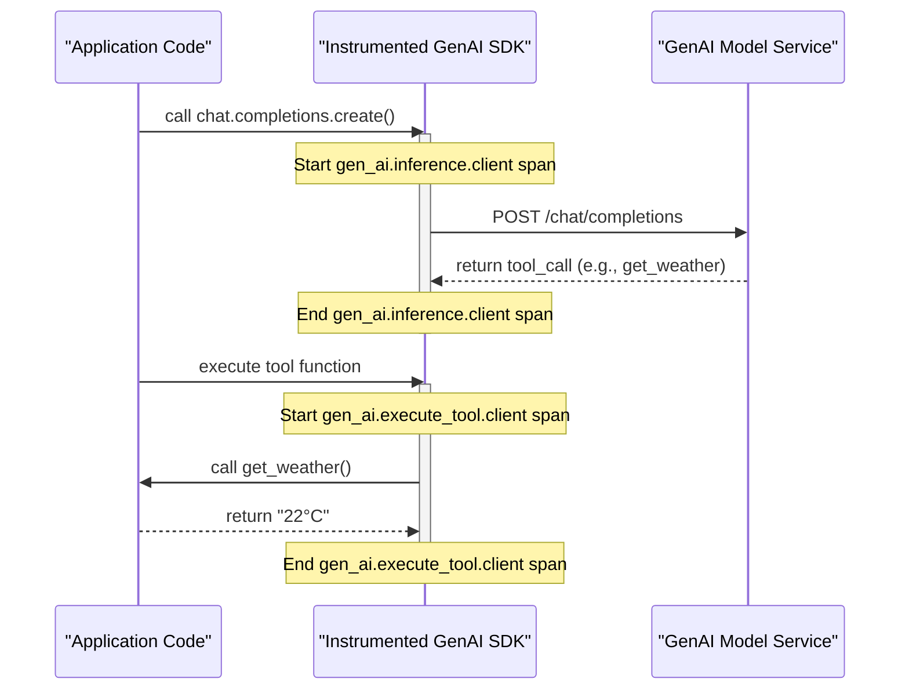
Sources: [docs/gen-ai/gen-ai-spans.md:27-45](), [docs/gen-ai/gen-ai-spans.md:287-300](), [docs/gen-ai/non-normative/examples-llm-calls.md:35-44]()

---

## Content Recording Modes

Recording sensitive information like prompts and responses is configurable. The conventions support two primary modes for capturing content.

### 1. Recording on Attributes
Content is stored directly on the span or event attributes using structured JSON strings [docs/gen-ai/gen-ai-spans.md:354-354]().
*   **Input**: `gen_ai.input.messages` [docs/gen-ai/gen-ai-spans.md:81-81]()
*   **Output**: `gen_ai.output.messages` [docs/gen-ai/gen-ai-spans.md:82-82]()

### 2. External Storage (Pointer Mode)
Instead of the full text, the span records a reference to an external location (e.g., S3, Blob Storage) where the content is stored [docs/gen-ai/gen-ai-spans.md:368-372]().

| Attribute | Description |
| :--- | :--- |
| `gen_ai.content.url` | The URL where content is uploaded [docs/gen-ai/gen-ai-spans.md:374-374]() |
| `gen_ai.content.upload_status` | The status of the upload operation [docs/gen-ai/gen-ai-spans.md:375-375]() |

Sources: [docs/gen-ai/gen-ai-spans.md:352-376](), [docs/gen-ai/non-normative/examples-llm-calls.md:64-82]()

---

## Streaming Lifecycle

Streaming GenAI calls require specific handling because attributes like `usage` and `finish_reason` are only available in the final chunk.

Title: Streaming Span Lifecycle and Event Association
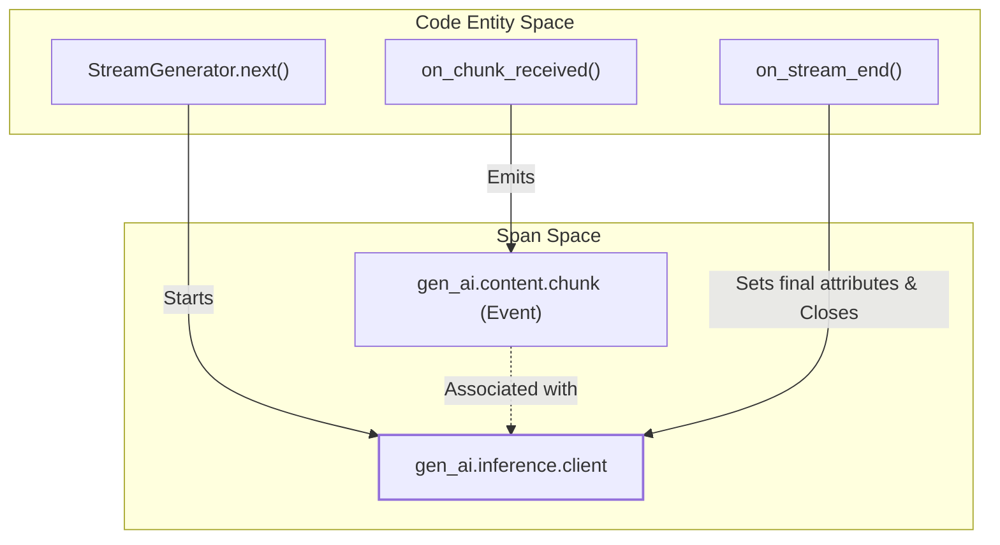

### Key Streaming Attributes
*   **`gen_ai.request.stream`**: A boolean indicating if the request was streaming [docs/gen-ai/gen-ai-spans.md:61-61]().
*   **`gen_ai.response.time_to_first_chunk`**: Measured from the start of the span to the arrival of the first token [docs/gen-ai/gen-ai-spans.md:73-73]().

Sources: [docs/gen-ai/gen-ai-spans.md:383-400](), [docs/gen-ai/gen-ai-spans.md:61-73]()

---

## Sampling and Performance Attributes

The conventions include attributes to track model configuration and performance metrics within the span.

| Category | Attributes |
| :--- | :--- |
| **Model Config** | `gen_ai.request.temperature`, `gen_ai.request.top_p`, `gen_ai.request.max_tokens` [docs/gen-ai/gen-ai-spans.md:65-69]() |
| **Usage Metrics** | `gen_ai.usage.input_tokens`, `gen_ai.usage.output_tokens` [docs/gen-ai/gen-ai-spans.md:74-75]() |
| **Identifiers** | `gen_ai.response.id`, `gen_ai.conversation.id` [docs/gen-ai/gen-ai-spans.md:56-71]() |

### Content Modalities
The system supports multimodal content (text, image, audio, video) via the `Modality` enum and structured `MessagePart` schemas [docs/gen-ai/gen-ai-input-messages.json:25-36]().

*   **TextPart**: Simple text content [docs/gen-ai/non-normative/models.ipynb:50-55]().
*   **BlobPart**: Inline binary data (base64) [docs/gen-ai/non-normative/models.ipynb:152-159]().
*   **FilePart**: Reference to a file by ID [docs/gen-ai/non-normative/models.ipynb:161-165]().

Sources: [docs/gen-ai/gen-ai-spans.md:51-82](), [docs/gen-ai/gen-ai-input-messages.json:2-125](), [docs/gen-ai/non-normative/models.ipynb:45-165]()
The coverage reporting system provides a human-readable bridge between the abstract semantic convention definitions and the actual telemetry emitted by GenAI libraries. It automates the generation of status tables and detailed markdown reports that track which libraries support which attributes and signals.

## Overview

The reporting logic resides in `reference/src/semconv_genai/report.py` and is responsible for parsing the results of reference scenario runs (stored in `data.json` files) and comparing them against the expected model defined in the YAML registry [reference/src/semconv_genai/report.py:1-11]().

### Key Components
*   **README.md Status Table**: A high-level summary in the `reference/` directory showing which libraries support which span and event types [reference/README.md:22-44]().
*   **Detail Pages**: Individual markdown files in `reference/reports/` (e.g., `inference-span.md`, `gen-ai-evaluation-result-event.md`) that break down support by attribute requirement level [reference/src/semconv_genai/report.py:10-11]().
*   **Model Integration**: The reporter uses `semconv_model.py` to dynamically load attribute requirements from the YAML source at `model/gen-ai/` [reference/src/semconv_genai/semconv_model.py:25-32]().

### Data Flow: From Model to Report

The following diagram illustrates how semantic convention definitions and library execution data are merged to produce the coverage reports.

**Coverage Report Generation Pipeline**
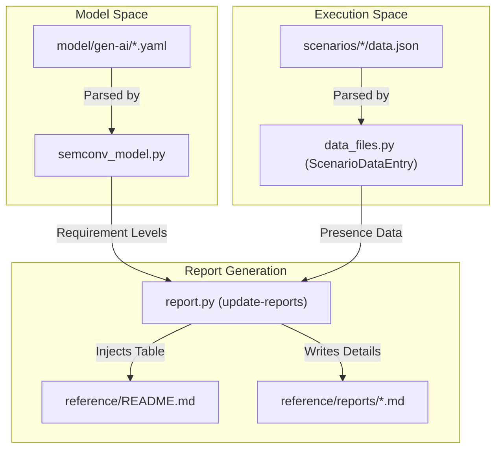
Sources: [reference/src/semconv_genai/semconv_model.py:25-45](), [reference/src/semconv_genai/report.py:1-11](), [reference/src/semconv_genai/data_files.py:25-30]()

## Implementation Details

### Model Specification Parsing
The `semconv_model.py` script parses the YAML files in `model/gen-ai/` to create `AttributeSpec` objects. These objects categorize attributes into four buckets based on the `requirement_level` defined in the schema: `required`, `conditionally_required`, `recommended`, and `opt_in` [reference/src/semconv_genai/semconv_model.py:90-95]().

The resolution logic mirrors the OTel Weaver resolution order, supporting inheritance via `ref_group` entries [reference/src/semconv_genai/semconv_model.py:56-78]().

### Determining Support
A library is considered to "support" a signal type if it emits at least one `required` attribute (or `conditionally_required` if no required attributes exist) for that specific span or event [reference/src/semconv_genai/report.py:182-197]().

The presence of attributes is determined by checking the `ScenarioDataEntry` objects, which represent the state captured in `scenarios/<lib>/data.json` [reference/src/semconv_genai/report.py:105]().

### Supporting Libraries and Link Mapping
The reports include direct links back to the documentation and the source code of the reference scenarios:
*   **SEMCONV_DOC_LINKS**: A mapping that associates internal span/event IDs (e.g., `inference`) with their corresponding generated documentation page in `docs/gen-ai/` [reference/src/semconv_genai/report.py:69-82]().
*   **Library References**: Every library listed in a report is linked to its `scenario.py` file using markdown link-reference definitions [reference/src/semconv_genai/report.py:108-129]().

## Report Structure

### README.md Status Table
The `reference/README.md` file contains two primary tables: **Spans** and **Events**. These are updated by looking for the `<!-- status:begin -->` and `<!-- status:end -->` markers [reference/src/semconv_genai/report.py:44-45]().

| Signal Type | Libraries |
| :--- | :--- |
| [Inference](reports/inference-span.md) | anthropic, openai, langchain, etc. |
| [Execute Tool](reports/execute-tool-span.md) | openai, mistralai, etc. |

Sources: [reference/README.md:23-44](), [reference/src/semconv_genai/report.py:230-240]()

### Per-Type Detail Pages
Each detail page (e.g., `reference/reports/memory-span.md`) follows a strict hierarchy:
1.  **Header**: The signal name and a link to the official Semantic Convention documentation [reference/src/semconv_genai/report.py:139-143]().
2.  **Requirement Sections**: Tables for each requirement level containing the attribute name and the list of supporting libraries [reference/src/semconv_genai/report.py:146-163]().
3.  **Source Links**: A block of reference links pointing to the `scenario.py` files for every library mentioned on the page [reference/src/semconv_genai/report.py:165-168]().

**Report Entity Association**
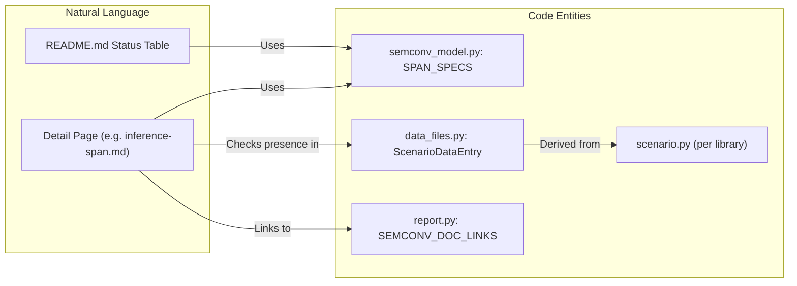
Sources: [reference/src/semconv_genai/report.py:69-82](), [reference/src/semconv_genai/report.py:131-170](), [reference/src/semconv_genai/semconv_model.py:113-202]()

## Execution

The reports are updated via the `update-reports` entry point.

```bash
This document details the semantic conventions for recording exceptions during Generative AI operations. It covers the specific event structure, required attributes, and the relationship between span-level error tracking and event-level exception reporting.

## Overview

In the Generative AI semantic conventions, errors are handled at two levels:
1.  **Span Status and Attributes**: High-level error classification on the span itself using `error.type`.
2.  **Exception Events**: Detailed diagnostic information captured as a `gen_ai.client.operation.exception` event.

[docs/gen-ai/gen-ai-exceptions.md:5-10]()

## Generative AI Client Operation Exception

The `gen_ai.client.operation.exception` event is used to record failures such as API errors, rate limiting (429), model-specific errors, or network timeouts that prevent an operation from completing.

### Event Definition
- **Event Name**: `gen_ai.client.operation.exception` [docs/gen-ai/gen-ai-exceptions.md:26-26]()
- **Severity**: Instrumentations SHOULD set the severity to `WARN` (Severity Number 13) [docs/gen-ai/gen-ai-exceptions.md:31-31]().
- **Context**: Instrumentations may optionally populate this event with attributes from the corresponding GenAI span (e.g., `gen_ai.request.model`) to provide better context for the failure [docs/gen-ai/gen-ai-exceptions.md:32-33]().

### Attributes

| Attribute | Requirement Level | Description |
| :--- | :--- | :--- |
| `exception.type` | Conditionally Required | The fully-qualified class name or dynamic type of the exception. [docs/gen-ai/gen-ai-exceptions.md:39-39]() |
| `exception.message` | Conditionally Required | The human-readable exception message. [docs/gen-ai/gen-ai-exceptions.md:38-38]() |
| `exception.stacktrace` | Recommended | The language-natural representation of the stack trace. [docs/gen-ai/gen-ai-exceptions.md:40-40]() |

**Note on Requirement Levels**: `exception.type` is required if `exception.message` is missing, and vice versa. Both are recommended when available [docs/gen-ai/gen-ai-exceptions.md:42-51]().

Sources: [docs/gen-ai/gen-ai-exceptions.md:24-60]()

## Error Handling on Spans

While the exception event provides detailed diagnostics, the parent span must also reflect the failure state to support high-level monitoring and alerting.

### The `error.type` Attribute
Every GenAI span (Inference, Embeddings, Agent, etc.) includes the `error.type` attribute when the operation fails.
- **Requirement**: Conditionally required if the operation ended in an error [model/gen-ai/spans.yaml:7-8]().
- **Value**: SHOULD match the provider's error code, the canonical exception name, or a low-cardinality identifier (e.g., `timeout`, `429`, `invalid_request_error`) [model/gen-ai/spans.yaml:10-12]().

### Span Status
Span status SHOULD follow the standard OTel [Recording Errors](https://github.com/open-telemetry/semantic-conventions/blob/v1.41.1/docs/general/recording-errors.md) guidance. For MCP-specific spans, the status description SHOULD match the `JSONRPCError.message` if available [docs/gen-ai/mcp.md:140-141]().

Sources: [model/gen-ai/spans.yaml:2-13](), [docs/gen-ai/gen-ai-spans.md:47-55](), [docs/gen-ai/mcp.md:139-143]()

## Data Flow and Implementation

The following diagrams illustrate how exceptions are captured and propagated from the library/SDK level into the OpenTelemetry signal space.

### Exception Event Lifecycle
This diagram shows the transition from a library-specific exception (Natural Language/SDK Space) to the structured OTel Event (Code Entity Space).

```mermaid
graph TD
    subgraph "SDK / Provider Space"
        A["OpenAI / Anthropic SDK"] -- "raises" --> B["APIConnectionError"]
        B -- "contains" --> B1["'Connection timed out'"]
    end

    subgraph "Instrumentation Logic (Code Entity Space)"
        C["on_exception() hook"]
        D["gen_ai.client.operation.exception"]
    end

    B --> C
    C -->| "Map type" | D
    C -->| "Map message" | D

    style D stroke-width:2px

    subgraph "Telemetry Output"
        D1["exception.type: 'openai.APIConnectionError'"]
        D2["exception.message: 'Connection timed out'"]
        D3["severity_number: 13 (WARN)"]
    end

    D --- D1
    D --- D2
    D --- D3
```
Sources: [docs/gen-ai/gen-ai-exceptions.md:26-40]()

### Relationship between Spans and Exception Events
This diagram bridges the relationship between the `Span` (tracking the operation) and the `Event` (tracking the specific failure detail).

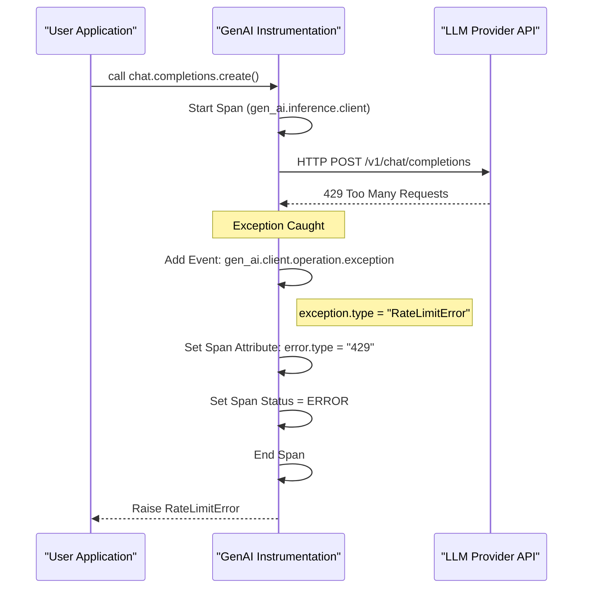
Sources: [docs/gen-ai/gen-ai-spans.md:55-55](), [model/gen-ai/spans.yaml:130-155](), [docs/gen-ai/gen-ai-exceptions.md:26-31]()
This page provides technical guidance on setting up the development environment, executing the toolchain, and contributing to the OpenTelemetry GenAI Semantic Conventions repository. This repository extends core OpenTelemetry conventions with specific models for Generative AI clients, agents, and the Model Context Protocol (MCP) [README.md:7-11]().

## Repository Layout

The repository is structured to separate the YAML-based semantic models from the generated documentation and validation logic.

| Directory | Purpose |
| :--- | :--- |
| `model/` | Contains the source of truth YAML files for attributes, spans, metrics, and events [CONTRIBUTING.md:25-30](). |
| `docs/` | Contains hand-written prose (`gen-ai/`) and auto-generated registry reference pages (`registry/`) [CONTRIBUTING.md:22-24](). |
| `templates/` | Jinja2 templates used by Weaver to transform the model into documentation [Makefile:126-127](). |
| `schema-snapshot/` | A fully resolved YAML representation of the registry used for PR diff visibility [Makefile:149-156](). |
| `reference/` | Python-based reference implementations and validation scenarios [README.md:23-25](). |

Sources: [CONTRIBUTING.md:21-31](), [README.md:19-25](), [Makefile:12-14]()

## Development Environment Setup

To contribute, you must satisfy the following prerequisites:

1.  **Docker (or Podman)**: Required to run the `otel/weaver` container image. The toolchain uses Docker to ensure a consistent environment without requiring local installation of the Weaver binary [CONTRIBUTING.md:11-13]().
2.  **GNU Make**: Used to orchestrate the generation and validation pipeline [CONTRIBUTING.md:14-17]().
3.  **Python (uv)**: Required for running reference scenarios and generating coverage reports under the `reference/` directory [.github/workflows/ci.yml:106-110]().

### Version Pinning
The repository uses a `versions.env` file to pin external dependencies, including the Weaver version and the upstream `semantic-conventions` version [Makefile:8-9](). These pins are automatically updated via Renovate [.github/renovate.json5:17-24]().

Sources: [CONTRIBUTING.md:9-17](), [Makefile:3-9](), [.github/renovate.json5:14-26]()

## The Toolchain Pipeline

The build system is centered around **Weaver**, an OpenTelemetry tool that resolves semantic convention models and applies templates [README.md:10-11]().

### Data Flow: From Model to Documentation
The following diagram illustrates how YAML definitions in `model/` are processed through Weaver and Jinja2 templates to produce the final artifacts.

**Model Resolution and Generation Flow**
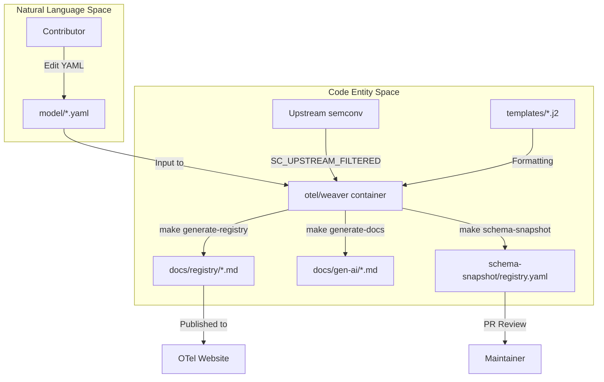
Sources: [Makefile:113-156](), [CONTRIBUTING.md:46-55](), [README.md:19-21]()

### Key Make Targets
The `Makefile` defines the primary entry points for the toolchain:

*   `make generate-all`: Runs the full generation suite, including registry pages, embedded tables in prose docs, and the schema snapshot [Makefile:145]().
*   `make check-policies`: Validates the local model against OpenTelemetry's global semantic convention policies (naming, stability, etc.) [Makefile:113-117]().
*   `make filter-upstream`: Clones the core `semantic-conventions` repository and removes overlapping GenAI/MCP directories to prevent ID collisions during resolution [Makefile:87-108]().

Sources: [Makefile:60-156](), [CONTRIBUTING.md:46-67]()

## Contribution Workflow

### 1. Modifying the Model
All attributes must be defined in the `registry.yaml` of their respective namespace (e.g., `model/gen-ai/registry.yaml`) [CONTRIBUTING.md:33-34](). Spans, metrics, and events are defined in sibling files within the same directory [CONTRIBUTING.md:28-30]().

### 2. Regenerating Artifacts
After any YAML change, you must run `make generate-all` [CONTRIBUTING.md:49](). This updates:
1.  **Registry Pages**: Individual markdown files for every attribute namespace under `docs/registry/` [Makefile:122-129]().
2.  **Markdown Snippets**: Weaver looks for `<!-- weaver ... -->` markers in `docs/gen-ai/*.md` and injects generated tables [Makefile:133-141]().
3.  **Schema Snapshot**: Updates `schema-snapshot/registry.yaml` so reviewers can see exactly how the resolved model has changed [Makefile:149-156]().

### 3. Validation and Reference Scenarios
Proposed changes should be validated using the reference implementation framework.

**Reference Validation Logic**
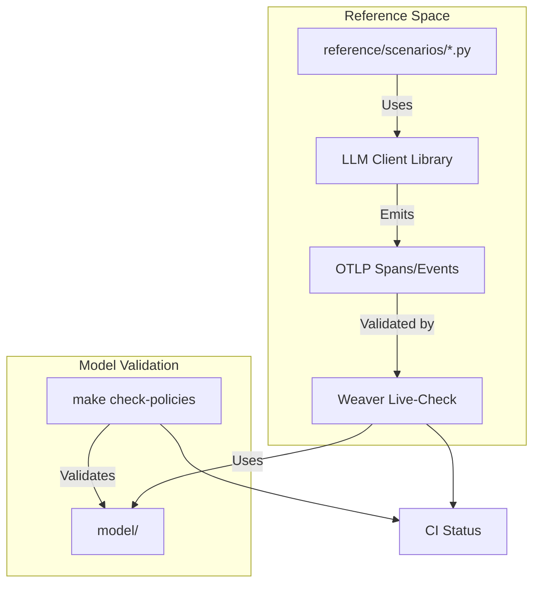
Sources: [.github/workflows/ci.yml:155-163](), [CONTRIBUTING.md:59-80](), [README.md:23-25]()

### 4. Changelog and PR
Add an entry to `CHANGELOG.md` under the `## Unreleased` section for any consumer-facing changes [CONTRIBUTING.md:84-86](). Ensure the PR is small and focused to facilitate quick review [CONTRIBUTING.md:88-92]().

Sources: [CONTRIBUTING.md:36-92](), [CHANGELOG.md:1-33]()

## Continuous Integration (CI)
The CI pipeline [.github/workflows/ci.yml]() enforces the following checks on every Pull Request:
1.  **Link Integrity**: Uses `lychee` via `mise run links` to check for broken URLs [.github/workflows/ci.yml:20-45]().
2.  **Policy Compliance**: Runs `make check-policies` [.github/workflows/ci.yml:47-64]().
3.  **Sync Check**: Ensures that the committed files in `docs/registry/` and `schema-snapshot/` match the output of `make generate-all` [.github/workflows/ci.yml:80-95]().
4.  **Reference Scenarios**: Executes the Python reference scenarios to ensure the conventions are capturable by real-world instrumentation [.github/workflows/ci.yml:136-163]().

Sources: [.github/workflows/ci.yml:1-200](), [CONTRIBUTING.md:57-74]()
---
extraction_url: https://deepwiki.com/open-telemetry/semantic-conventions-genai
---
This page describes the semantic conventions for metrics and events in Generative AI systems. These conventions ensure that performance data (latencies, token counts) and discrete lifecycle occurrences (inference details, evaluations) are captured consistently across different providers and instrumentation libraries.

## Metrics Conventions

Generative AI metrics are categorized into client-side, server-side, and workflow-level instruments. Most performance metrics are defined as **Histograms** to capture the distribution of latencies and usage [docs/gen-ai/gen-ai-metrics.md:58-60]().

### Client-Side Metrics
Client metrics focus on the consumer's perspective of GenAI operations, including token consumption and various latency stages.

| Metric Name | Instrument | Unit | Description |
| --- | --- | --- | --- |
| `gen_ai.client.token.usage` | Histogram | `{token}` | Number of input and output tokens used [docs/gen-ai/gen-ai-metrics.md:60](). |
| `gen_ai.client.operation.duration` | Histogram | `s` | Total time for the operation to complete [docs/gen-ai/gen-ai-metrics.md:107](). |
| `gen_ai.client.operation.time_to_first_chunk` | Histogram | `s` | Latency until the first chunk is received in streaming [docs/gen-ai/gen-ai-metrics.md:144](). |

### Server-Side & Workflow Metrics
Server metrics are typically emitted by model providers or self-hosted model gateways, while workflow metrics track higher-level agentic processes.

*   **`gen_ai.server.request.duration`**: Measures the server-side processing time [docs/gen-ai/gen-ai-metrics.md:214]().
*   **`gen_ai.workflow.duration`**: Tracks the end-to-end duration of a complex GenAI workflow (e.g., an agentic loop) [docs/gen-ai/gen-ai-metrics.md:288]().

### Bucket Strategies
To ensure consistent aggregation across backends, specific explicit bucket boundaries are recommended:
*   **Token Usage**: `[1, 4, 16, 64, 256, 1024, 4096, 16384, 65536, 262144, 1048576, 4194304, 16777216, 67108864]` [docs/gen-ai/gen-ai-metrics.md:51]().
*   **Duration (Seconds)**: `[0.01, 0.02, 0.04, 0.08, 0.16, 0.32, 0.64, 1.28, 2.56, 5.12, 10.24, 20.48, 40.96, 81.92]` [docs/gen-ai/gen-ai-metrics.md:111]().

### Data Flow: Metric Emission
The following diagram illustrates how instrumentation libraries map internal provider responses to OpenTelemetry metric instruments.

**GenAI Metric Mapping**
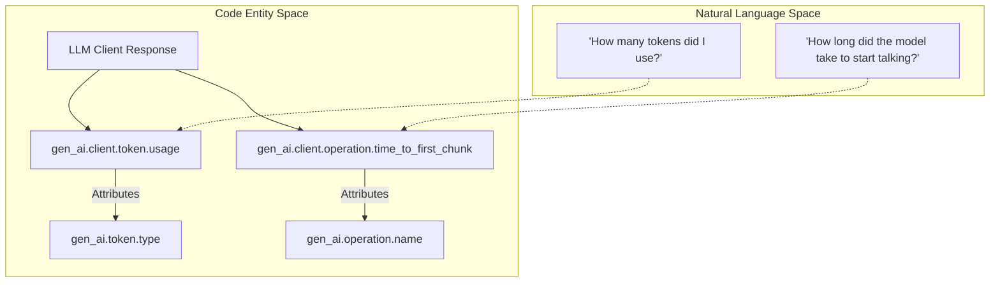
Sources: [docs/gen-ai/gen-ai-metrics.md:40-72](), [docs/gen-ai/gen-ai-metrics.md:144-155]()

## Events Conventions

Events allow for capturing high-cardinality or large-payload data (like full chat histories or evaluation scores) that may be too heavy for span attributes or metrics [docs/gen-ai/gen-ai-events.md:16-19]().

### Core Event Definitions
Definitions are managed in `model/gen-ai/events.yaml` and rendered into documentation.

| Event Name | Purpose | Key Attributes |
| --- | --- | --- |
| `gen_ai.client.inference.operation.details` | Captures full prompt/response and parameters [model/gen-ai/events.yaml:3-6](). | `gen_ai.request.model`, `gen_ai.response.id`, `gen_ai.request.temperature` |
| `gen_ai.evaluation.result` | Records quality/accuracy scores for a GenAI output [model/gen-ai/events.yaml:13-17](). | `gen_ai.evaluation.name`, `gen_ai.evaluation.score.value`, `gen_ai.evaluation.explanation` |
| `gen_ai.client.operation.exception` | Specialized event for errors occurring during client operations [model/gen-ai/events.yaml:39-43](). | `exception.type`, `exception.message`, `exception.stacktrace` |

### Evaluation Events
The `gen_ai.evaluation.result` event is used to store the output of an evaluation process. It SHOULD be parented to the GenAI operation span being evaluated [model/gen-ai/events.yaml:16-17](). If the span context is unavailable, the `gen_ai.response.id` attribute is used to correlate the evaluation with the original inference [model/gen-ai/events.yaml:31-37]().

### Implementation Logic: Event Recording
The following diagram bridges the logical concept of an "Inference Detail" to the YAML definitions and generated event structures.

**Event Definition to Code Mapping**
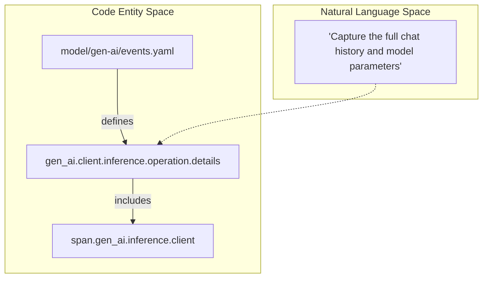
Sources: [model/gen-ai/events.yaml:3-12](), [docs/gen-ai/gen-ai-events.md:21-36]()

## Exception Handling
When a client operation fails, instrumentations record the `gen_ai.client.operation.exception` event.
*   **Severity**: SHOULD be set to `WARN` (Severity Number 13) [model/gen-ai/events.yaml:47]().
*   **Correlation**: This event provides detailed error metadata that complements the `error.type` attribute found on the parent span [docs/gen-ai/gen-ai-events.md:42]().

Sources: [model/gen-ai/events.yaml:39-60](), [docs/gen-ai/gen-ai-events.md:42]()
This page details how Generative AI metrics and events are defined within the semantic conventions model. These signals provide quantitative data (e.g., token counts, latencies) and discrete lifecycle information (e.g., evaluation results, model parameters) that complement distributed traces.

## Metric Definitions

Metrics are defined in `model/gen-ai/metrics.yaml` and categorized into client-side, server-side, and workflow-level instruments. All current metrics use the `histogram` instrument type to capture distributions of values such as token counts and durations [model/gen-ai/metrics.yaml:20-110]().

### Client-Side Metrics
Client-side metrics focus on the consumer's experience and resource consumption.

| Metric Name | Unit | Description |
| :--- | :--- | :--- |
| `gen_ai.client.token.usage` | `{token}` | Number of input and output tokens used [model/gen-ai/metrics.yaml:21-24](). |
| `gen_ai.client.operation.duration` | `s` | Total duration of the GenAI operation [model/gen-ai/metrics.yaml:33-36](). |
| `gen_ai.client.operation.time_to_first_chunk` | `s` | Latency for the first chunk in streaming responses [model/gen-ai/metrics.yaml:44-47](). |
| `gen_ai.client.operation.time_per_output_chunk` | `s` | Time elapsed between subsequent chunks [model/gen-ai/metrics.yaml:56-60](). |

### Server and Workflow Metrics
These metrics capture backend performance and high-level process orchestration.

| Metric Name | Unit | Description |
| :--- | :--- | :--- |
| `gen_ai.server.request.duration` | `s` | Server-side duration until the last byte/token [model/gen-ai/metrics.yaml:69-72](). |
| `gen_ai.server.time_to_first_token` | `s` | Time to generate the first token [model/gen-ai/metrics.yaml:90-93](). |
| `gen_ai.workflow.duration` | `s` | Duration of a multi-agent or multi-step workflow [model/gen-ai/metrics.yaml:100-104](). |

### Bucket Boundaries
To ensure consistency across different implementations, specific `ExplicitBucketBoundaries` are recommended for token usage: `[1, 4, 16, 64, 256, 1024, 4096, 16384, 65536, 262144, 1048576, 4194304, 16777216, 67108864]` [docs/gen-ai/gen-ai-metrics.md:51-51]().

**Sources:** [model/gen-ai/metrics.yaml:1-110](), [docs/gen-ai/gen-ai-metrics.md:40-101]()

---

## Event Definitions

Events are discrete occurrences captured as logs with specific semantic meaning, defined in `model/gen-ai/events.yaml`. They allow for capturing high-cardinality or large-payload data (like full chat histories) that might be too heavy for span attributes.

### Core Events

1.  **`gen_ai.client.inference.operation.details`**: Captures the parameters and chat history of a completion request [model/gen-ai/events.yaml:3-9](). It inherits attributes from the inference span group [model/gen-ai/events.yaml:12-12]().
2.  **`gen_ai.evaluation.result`**: Captures quality or accuracy scores. It should be parented to the operation span or linked via `gen_ai.response.id` [model/gen-ai/events.yaml:13-17]().
3.  **`gen_ai.client.operation.exception`**: Represents client-side errors like rate limits or timeouts. It is recorded with a `WARN` severity (number 13) [model/gen-ai/events.yaml:39-47]().

### Data Flow: Natural Language to Code Entity Space

The following diagram illustrates how a natural language request flows through the system and is transformed into specific code-defined metrics and events.

**Diagram: Request to Signal Mapping**
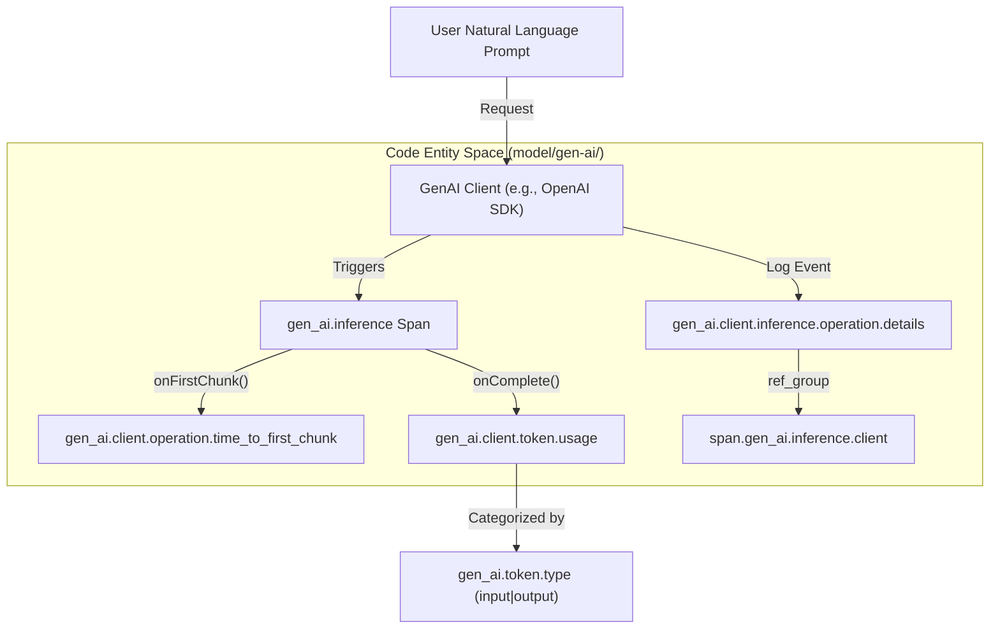
**Sources:** [model/gen-ai/events.yaml:1-60](), [docs/gen-ai/gen-ai-events.md:21-65](), [model/gen-ai/metrics.yaml:21-55]()

---

## Attribute Relationships & Refinements

Metrics and events share common attribute groups defined in the registry to ensure correlation across signal types.

### Shared Attribute Groups
In `metrics.yaml`, the `metric_attributes.gen_ai` internal group bundles mandatory attributes for all GenAI metrics:
*   `gen_ai.provider.name` (Required) [model/gen-ai/metrics.yaml:10-11]()
*   `gen_ai.response.model` (Recommended) [model/gen-ai/metrics.yaml:8-9]()
*   `gen_ai.address_and_port` (Reference group) [model/gen-ai/metrics.yaml:6-6]()

### Provider-Specific Refinements
The model supports refining base metrics for specific providers. For example, when the provider is `openai`, the `gen_ai.client.token.usage` metric is extended to include OpenAI-specific attributes [model/gen-ai/metrics.yaml:118-124]().

**Diagram: Metric Refinement Hierarchy**
```mermaid
classDiagram
    class gen_ai_client_token_usage {
        +gen_ai.provider.name
        +gen_ai.token.type
        +gen_ai.response.model
    }
    class openai_client_token_usage {
        +openai.response.service_tier
        +openai.response.system_fingerprint
    }
    gen_ai_client_token_usage <|-- openai_client_token_usage : "Refinement (model/gen-ai/metrics.yaml:118)"
```

### Event-to-Span Correlation
Events are designed to work in tandem with spans. The `gen_ai.evaluation.result` event uses `gen_ai.response.id` as a correlation key when a direct span parent-child relationship is not feasible [model/gen-ai/events.yaml:31-37]().

**Sources:** [model/gen-ai/metrics.yaml:2-19](), [model/gen-ai/metrics.yaml:117-144](), [model/gen-ai/events.yaml:13-37]()
This page describes the semantic conventions for the [Model Context Protocol (MCP)](https://github.com/modelcontextprotocol/modelcontextprotocol), a JSON-RPC based protocol designed to connect AI models to data and tools. These conventions ensure consistent observability across different MCP transports and implementations.

## Overview

MCP is transport-independent and commonly uses `stdio`, Streamable HTTP, or SSE. Because MCP allows multiple requests and notifications to be multiplexed over a single transport connection, standard HTTP or RPC semantic conventions are often insufficient [docs/gen-ai/mcp.md:31-40](). The MCP conventions provide domain-specific context for tool calls, resource reading, and prompt management.

### Data Flow and JSON-RPC Mapping

MCP operations map directly to JSON-RPC methods. The following diagram illustrates the relationship between the natural language concepts of the protocol and the code entities defined in the registry.

**MCP Method Mapping**
```mermaid
graph TD
    subgraph "Natural Language Space"
        A["Call a Tool"]
        B["Get a Prompt"]
        C["Read a Resource"]
        D["Initialize Session"]
    end

    subgraph "Code Entity Space (registry.yaml)"
        direction LR
        M1["mcp.method.name: 'tools/call'"]
        M2["mcp.method.name: 'prompts/get'"]
        M3["mcp.method.name: 'resources/read'"]
        M4["mcp.method.name: 'initialize'"]
    end

    A --> M1
    B --> M2
    C --> M3
    D --> M4
```
Sources: [model/mcp/registry.yaml:86-90](), [model/mcp/registry.yaml:71-75](), [model/mcp/registry.yaml:41-45](), [model/mcp/registry.yaml:11-15]()

## Trace Context Propagation

Since MCP does not define a standard propagation mechanism, instrumentations SHOULD use the `params._meta` property bag in MCP requests and notifications [docs/gen-ai/mcp.md:51-53]().

- **Mechanism**: Inject `traceparent` and `tracestate` (W3C Trace Context) or `baggage` into `params._meta` [docs/gen-ai/mcp.md:64-67]().
- **Server Behavior**: MCP servers SHOULD extract context from `_meta` to use as the parent for the server span [docs/gen-ai/mcp.md:104-107]().

### Example Trace Context Injection
```json
{
  "jsonrpc": "2.0",
  "method": "tools/call",
  "params": {
    "name": "get-weather",
    "_meta": {
      "traceparent": "00-4bf92f3577b34da6a3ce929d0e0e4736-00f067aa0ba902b7-01"
    }
  },
  "id": 1
}
```
Sources: [docs/gen-ai/mcp.md:70-82]()

## Spans

The protocol defines two primary span types: `mcp.client` and `mcp.server`.

### Span Definitions
| Span Type | Kind | Description |
| :--- | :--- | :--- |
| `mcp.client` | `CLIENT` | Describes the call from the sender's perspective (initiating request/notification) [model/mcp/spans.yaml:18-30](). |
| `mcp.server` | `SERVER` | Describes the processing on the receiver's side [model/mcp/spans.yaml:68-80](). |

### Naming Convention
Span names SHOULD follow the format `{mcp.method.name} {target}` [model/mcp/spans.yaml:22-25]():
- `target` SHOULD be `gen_ai.tool.name` or `gen_ai.prompt.name` where applicable.
- If no low-cardinality target exists, use `{mcp.method.name}`.
- `mcp.resource.uri` is opt-in for names to avoid high cardinality [model/mcp/spans.yaml:27-29]().

### Integration with GenAI Spans
MCP tool call spans are compatible with `gen_ai.execute_tool` spans. If a GenAI instrumentation is already tracing a tool execution, MCP attributes SHOULD be added to that existing span instead of creating a new one [model/mcp/spans.yaml:51-56]().

Sources: [model/mcp/spans.yaml:18-114](), [docs/gen-ai/mcp.md:130-137]()

## Metrics

MCP defines four primary histogram metrics to track operation and session latency.

| Metric Name | Unit | Description |
| :--- | :--- | :--- |
| `mcp.client.operation.duration` | `s` | Latency from request sent to response/ack received [model/mcp/metrics.yaml:20-25](). |
| `mcp.server.operation.duration` | `s` | Latency from request received to result/ack sent [model/mcp/metrics.yaml:31-36](). |
| `mcp.client.session.duration` | `s` | Total duration of the MCP session on the client [model/mcp/metrics.yaml:40-43](). |
| `mcp.server.session.duration` | `s` | Total duration of the MCP session on the server [model/mcp/metrics.yaml:49-52](). |

Sources: [model/mcp/metrics.yaml:19-56]()

## Transport Variants

MCP requires specific recording of the underlying transport protocol via the `network.transport` attribute [model/mcp/common.yaml:49-54]().

**Transport Entity Mapping**
```mermaid
graph LR
    subgraph "Transport Variant"
        STDIO["Stdio (Standard I/O)"]
        HTTP["Streamable HTTP / SSE"]
    end

    subgraph "Attribute Values (common.yaml)"
        PIPE["network.transport: 'pipe'"]
        TCP["network.transport: 'tcp'"]
        QUIC["network.transport: 'quic'"]
    end

    STDIO --> PIPE
    HTTP --> TCP
    HTTP --> QUIC
```
Sources: [model/mcp/common.yaml:49-54](), [docs/gen-ai/mcp.md:20-28]()

## Error Handling

Errors in MCP are captured using the `error.type` attribute.

1.  **JSON-RPC Errors**: `error.type` SHOULD be the string representation of the JSON-RPC error code [model/mcp/common.yaml:28-29]().
2.  **Tool Execution Errors**: When a `CallToolResult` is returned with `isError: true`, `error.type` MUST be set to `tool_error` [model/mcp/common.yaml:34-36]().
3.  **Span Status**: If `error.type` is present, the span status MUST be set to `ERROR` [model/mcp/spans.yaml:45-46]().

Sources: [model/mcp/common.yaml:24-36](), [model/mcp/spans.yaml:94-96]()

# Toolchain & Code Generation


This section provides an overview of the **Weaver-based toolchain** used to manage, validate, and transform the YAML-based semantic convention models into human-readable documentation and machine-readable schema snapshots. The toolchain ensures that GenAI conventions remain consistent with the upstream OpenTelemetry standards while providing a streamlined workflow for contributors.

## Overview

The repository utilizes [Weaver](https://github.com/open-telemetry/weaver) as its primary engine for processing semantic conventions [README.md:10-11](). Weaver consumes the YAML definitions located in the `model/` directory and applies Jinja2 templates to generate the contents of the `docs/` and `schema-snapshot/` directories [CONTRIBUTING.md:21-31]().

The following diagram illustrates the flow from the Natural Language Space (YAML definitions) to the Code Entity Space (generated artifacts and validation logic).

### Toolchain Data Flow
```mermaid
graph TD
    subgraph "Natural Language Space (YAML Model)"
        YAML["model/**/*.yaml"]
    end

    subgraph "Toolchain Orchestration"
        Makefile["GNU Makefile"]
        Weaver["otel/weaver (Docker/Binary)"]
        Upstream["SC_UPSTREAM_FILTERED"]
    end

    subgraph "Code Entity Space (Artifacts & CI)"
        Docs["docs/registry/*.md"]
        Snapshot["schema-snapshot/registry.yaml"]
        Policy["check-policies"]
    end

    YAML --> Weaver
    Upstream --> Weaver
    Makefile -- "executes" --> Weaver
    Weaver -- "renders" --> Docs
    Weaver -- "resolves" --> Snapshot
    Weaver -- "validates" --> Policy
```
**Sources:** [README.md:7-11](), [CONTRIBUTING.md:11-13](), [CONTRIBUTING.md:49-63]()

---

## Makefile & Weaver Pipeline

The `Makefile` serves as the entry point for all automation tasks. It orchestrates the Weaver container (or binary) to perform complex operations like filtering upstream dependencies and synchronizing the local model with the core OpenTelemetry semantic conventions.

Key capabilities include:
*   **Code Generation**: Using `make generate-all` to refresh all documentation and snapshots [CONTRIBUTING.md:49-55]().
*   **Upstream Synchronization**: Filtering core conventions (e.g., `error.type`) to be used as base types for GenAI extensions [schema-snapshot/registry.yaml:1-11]().
*   **Version Pinning**: Managing the specific version of Weaver and upstream models via a centralized configuration.

For details, see [Makefile & Weaver Pipeline](#5.1).

**Sources:** [CONTRIBUTING.md:46-56](), [CONTRIBUTING.md:59-67](), [.github/workflows/ci.yml:80-87]()

---

## Jinja2 Templates

The transformation of raw YAML into the documentation found in `docs/registry/` is handled by **Jinja2 templates**. These templates define how namespaces (like `gen_ai.*` or `mcp.*`), attributes, and metrics are rendered into Markdown tables and prose [docs/README.md:22-23]().

The template system allows for:
*   **Consistent Formatting**: Ensuring all attribute tables follow the same layout.
*   **Requirement Level Mapping**: Translating YAML requirement levels (e.g., `conditionally_required`) into human-readable guidance [schema-snapshot/registry.yaml:16-17]().
*   **Cross-Referencing**: Automatically linking to external JSON schemas for complex attributes like `gen_ai.input.messages` [schema-snapshot/registry.yaml:89-92]().

For details, see [Jinja2 Templates](#5.2).

**Sources:** [CONTRIBUTING.md:52-53](), [schema-snapshot/registry.yaml:108-116](), [docs/gen-ai/README.md:9-15]()

---

## Schema Snapshot

The `schema-snapshot/registry.yaml` file is a fully resolved, single-file representation of the GenAI semantic conventions [CONTRIBUTING.md:54-55](). Unlike the source YAMLs in `model/`, which are split by namespace and signal type, the snapshot contains the complete expanded model including inherited attributes and resolved references.

This snapshot serves two critical roles:
1.  **PR Visibility**: It allows reviewers to see the exact impact of a change on the final schema, including how refinements affect existing attributes [schema-snapshot/registry.yaml:1-26]().
2.  **Stability Tracking**: It provides a stable target for the published Schema URL (e.g., `https://opentelemetry.io/schemas/gen-ai/1.42.0`) [README.md:15]().

For details, see [Schema Snapshot](#5.3).

**Sources:** [README.md:13-15](), [CONTRIBUTING.md:54-55](), [.github/workflows/ci.yml:82-83]()

---

## Validation & CI Integration

The toolchain is integrated into the GitHub Actions CI pipeline to ensure model integrity. This includes link checking with `lychee` and policy enforcement via `make check-policies` [.github/workflows/ci.yml:19-64]().

### CI Validation Pipeline
```mermaid
graph LR
    subgraph "CI Job: generated-docs"
        GenAll["make generate-all"]
        DiffCheck["git diff --exit-code"]
    end

    subgraph "CI Job: policies"
        PolicyCheck["make check-policies"]
    end

    subgraph "CI Job: links"
        Lychee["flint run (lychee)"]
    end

    GenAll --> DiffCheck
    PolicyCheck --> "Required Status Check"
    DiffCheck --> "Required Status Check"
    Lychee --> "Required Status Check"
```
**Sources:** [.github/workflows/ci.yml:19-22](), [.github/workflows/ci.yml:47-49](), [.github/workflows/ci.yml:65-67](), [.github/workflows/ci.yml:183-200]()

**Sources:**
*   [CONTRIBUTING.md:59-74]()
*   [.github/workflows/ci.yml:19-95]()
*   [mise.toml:11-14]()

# Makefile & Weaver Pipeline


The `semantic-conventions-genai` repository uses a `Makefile` to orchestrate **Weaver**, the OpenTelemetry semantic convention toolchain. This pipeline transforms YAML model definitions into human-readable documentation, schema snapshots, and validated registry artifacts. By using a containerized Weaver execution model, the repository ensures a consistent environment for all contributors without requiring local installation of the Weaver binary.

### Implementation Overview

The orchestration logic is centralized in the [Makefile:1-22](). It manages external dependencies, performs pre-processing on upstream semantic conventions to avoid ID collisions, and executes Weaver commands for validation and generation.

#### Version Pinning
Versions for the toolchain and dependencies are managed in `versions.env`. This file is included by the `Makefile` to set variables used in container image tags and git checkouts [Makefile:8-10]().
*   `WEAVER_VERSION`: The version of the `otel/weaver` Docker image [versions.env:2-2]().
*   `SEMCONV_VERSION`: The version of the upstream `open-telemetry/semantic-conventions` repository used for shared attributes [versions.env:5-5]().
*   `POLICY_REPO_URL` & `POLICY_REPO_REF`: The location and specific commit of the OTel policy pack used for linting [versions.env:8-9]().

### The Weaver Execution Model

Weaver is executed via Docker to ensure platform independence. The repository is bind-mounted to `/workspace` inside the container, allowing Weaver to resolve relative paths for models and templates as if it were running natively [Makefile:15-21]().

#### Weaver Execution Pipeline
The following diagram illustrates the flow from raw YAML models to generated artifacts via the `WEAVER` command defined in the `Makefile`.

**System Name to Code Entity Mapping: Weaver Pipeline**
```mermaid
graph TD
    subgraph "Natural Language Space"
        Model["YAML Model Definitions"]
        Templates["Jinja2 Templates"]
        Upstream["OTel Upstream Registry"]
    end

    subgraph "Code Entity Space (Makefile & Weaver)"
        M_SRC["./model/"]
        T_SRC["./templates/"]
        UP_FILT[".build/sc-upstream-filtered"]

        W_CMD["docker run otel/weaver"]

        REG_GEN["make generate-registry"]
        DOC_GEN["make generate-docs"]
        SNAP_GEN["make schema-snapshot"]

        OUT_REG["./docs/registry/"]
        OUT_DOC["./docs/gen-ai/*.md"]
        OUT_SNAP["./schema-snapshot/registry.yaml"]
    end

    Model --> M_SRC
    Templates --> T_SRC
    Upstream --> UP_FILT

    M_SRC --> W_CMD
    T_SRC --> W_CMD
    UP_FILT --> W_CMD

    W_CMD --> REG_GEN
    W_CMD --> DOC_GEN
    W_CMD --> SNAP_GEN

    REG_GEN --> OUT_REG
    DOC_GEN --> OUT_DOC
    SNAP_GEN --> OUT_SNAP
```
Sources: [Makefile:15-21](), [Makefile:123-129](), [Makefile:134-141](), [Makefile:150-155]()

---

### Upstream Filtering (SC_UPSTREAM_FILTERED)

Because this repository is the new home for GenAI and MCP conventions, it contains definitions that may still exist in the upstream `open-telemetry/semantic-conventions` repository during the migration period. To prevent Weaver from encountering duplicate ID definitions, the `Makefile` implements a filtering step.

The `filter-upstream` target (and its dependency `$(SC_UPSTREAM_STAMP)`) performs the following:
1.  Clones the upstream registry at `SEMCONV_VERSION` [Makefile:90-92]().
2.  Deletes entire directories that have been fully migrated (`gen-ai`, `mcp`, `openai`) [Makefile:51-51](), [Makefile:94-94]().
3.  Performs fine-grained "group-level" removal for files that are shared. For example, it strips `registry.aws.bedrock` from the upstream `aws/registry.yaml` using an `awk` script to slice out the specific YAML block [Makefile:58-58](), [Makefile:98-107]().

Sources: [Makefile:45-58](), [Makefile:87-110]()

---

### Key Makefile Targets

The `Makefile` defines several high-level targets used in local development and CI/CD.

| Target | Description | Weaver Command / Action |
| :--- | :--- | :--- |
| `check-policies` | Validates the model against OTel best practices and breaking change rules. | `weaver registry check` with `--policy` [Makefile:113-117]() |
| `generate-registry` | Generates the per-namespace attribute pages in `docs/registry/`. | `weaver registry generate` using `templates/registry` [Makefile:122-129]() |
| `generate-docs` | Updates hand-written markdown files by injecting Weaver snippet tables. | `weaver registry update-markdown` [Makefile:133-141]() |
| `schema-snapshot` | Produces a single resolved YAML file for PR review visibility. | `weaver registry generate` with `yaml` target [Makefile:149-155]() |
| `generate-all` | Runs all generation targets. Used by CI to check for out-of-sync files. | Aggregates `schema-snapshot`, `generate-registry`, `generate-docs` [Makefile:145-145]() |
| `package-dev` | Prepares artifacts for a GitHub release. | Resolves the registry and moves `manifest.yaml` to `.build/package` [Makefile:159-170]() |

Sources: [Makefile:112-170]()

---

### Data Flow: From Model to Release

The following diagram bridges the logical concept of a "Release" to the specific file entities and Makefile targets involved in the pipeline.

**System Name to Code Entity Mapping: Release Pipeline**
```mermaid
graph LR
    subgraph "Natural Language Space"
        Ver["Version Pin"]
        Man["Manifest"]
        Art["Release Artifacts"]
    end

    subgraph "Code Entity Space"
        V_ENV["versions.env"]
        M_YAML["model/manifest.yaml"]

        P_DEV["make package-dev"]

        B_PKG[".build/package/"]
        RES_YAML[".build/package/resolved.yaml"]

        REL_WF[".github/workflows/release-dev.yml"]
    end

    V_ENV -- "WEAVER_VERSION" --> P_DEV
    M_YAML -- "schema_url" --> P_DEV
    P_DEV --> B_PKG
    B_PKG --> RES_YAML
    RES_YAML -- "Upload" --> REL_WF
    M_YAML -- "Parse Version" --> REL_WF
```
Sources: [Makefile:68-70](), [Makefile:159-170](), [.github/workflows/release-dev.yml:19-24](), [RELEASING.md:8-10]()

### CI/CD Integration

The `Makefile` is the primary entry point for GitHub Actions. The `CI` workflow executes `make check-policies` and `make generate-all`. If `make generate-all` produces any changes to the `docs/registry` or `schema-snapshot` directories that were not committed by the developer, the CI job fails [ .github/workflows/ci.yml:80-87](). This ensures that the human-readable documentation always reflects the state of the YAML model.

Sources: [.github/workflows/ci.yml:62-63](), [.github/workflows/ci.yml:80-95]()

# Jinja2 Templates


The `templates/registry/` directory contains the Jinja2 templates used by [Weaver](https://github.com/open-telemetry/weaver) to transform the YAML-based semantic convention models into human-readable Markdown documentation and the resolved schema registry. These templates define the structure, formatting, and logic for how attributes, spans, metrics, and events are presented in the `docs/` directory.

## Template Architecture and Data Flow

The transformation process follows a pipeline where Weaver parses the YAML models, resolves references, and injects a "Resolved Registry" object into the Jinja2 environment.

### Data Flow Diagram: YAML to Markdown

This diagram illustrates how the `weaver` tool uses templates to bridge the "Natural Language Space" (YAML definitions) to the "Documentation Entity Space" (Markdown).

```mermaid
graph TD
    subgraph "Natural Language Space (YAML Model)"
        R1["model/gen-ai/registry.yaml"]
        S1["model/gen-ai/spans.yaml"]
        M1["model/gen-ai/metrics.yaml"]
    end

    subgraph "Processing (Weaver Engine)"
        WV["weaver generate"]
        CONF["weaver.yaml (Filters/Params)"]
        ACRO["templates/registry/acronyms.yaml"]
    end

    subgraph "Template Space (Jinja2)"
        T1["attribute_namespace.md.j2"]
        T2["span_macros.j2"]
        T3["metric_macros.j2"]
    end

    subgraph "Documentation Entity Space (Markdown)"
        D1["docs/registry/attributes/gen-ai.md"]
        D2["docs/gen-ai/gen-ai-spans.md"]
    end

    R1 --> WV
    S1 --> WV
    M1 --> WV
    CONF --> WV
    ACRO --> WV

    WV --> T1
    WV --> T2
    WV --> T3

    T1 --> D1
    T2 --> D2
    T3 --> D2
```
**Sources:** [CONTRIBUTING.md:21-31](), [CONTRIBUTING.md:44-55]()

## Key Templates and Macros

The templates are organized to promote reuse through Jinja2 macros. This ensures that the rendering of an attribute table remains consistent whether it appears in the global registry or within a specific span definition.

### 1. Attribute Namespace Template
`attribute_namespace.md.j2` is the primary template for generating files under `docs/registry/attributes/`. It iterates over the resolved attributes belonging to a specific namespace (e.g., `gen_ai.*`) and renders their properties including `id`, `type`, `stability`, and `brief` [docs/registry/attributes/README.md:10-18]().

### 2. Span and Metric Macros
- `span_macros.j2`: Contains logic to render span-specific tables, including attribute requirement levels (`required`, `conditionally_required`, `opt_in`) [schema-snapshot/registry.yaml:105-106]().
- `metric_macros.j2`: Handles the rendering of metric instruments (histograms, counters), units, and associated attributes [schema-snapshot/registry.yaml:23-24]().

### 3. Acronym List
The repository maintains an acronym list (often found in `templates/registry/acronyms.yaml` or injected via `weaver.yaml`) to ensure that technical terms like "MCP" (Model Context Protocol) or "TTFC" (Time To First Chunk) are correctly expanded or linked in the generated documentation [CHANGELOG.md:23-24](), [README.md:3-5]().

## The Resolved Registry (v2)

When Weaver processes the model, it produces a "Resolved Registry". This is a flattened, fully-dereferenced version of the conventions. The `schema-snapshot/registry.yaml` file is a committed artifact of this resolved state [CONTRIBUTING.md:54-55]().

### Registry Structure Entity Mapping

This diagram maps the internal code entities of the resolved registry to the resulting documentation structures.

```mermaid
classDiagram
    class ResolvedRegistry {
        +groups: List~Group~
    }
    class Group {
        +id: String
        +type: String (attribute_group|span|metric|event)
        +attributes: List~Attribute~
        +brief: String
        +note: String
    }
    class Attribute {
        +id: String
        +type: String
        +stability: String
        +requirement_level: String
        +examples: List
    }

    ResolvedRegistry "1" --> "*" Group : contains
    Group "1" --> "*" Attribute : references

    style ResolvedRegistry stroke-dasharray: 5 5
```
**Sources:** [schema-snapshot/registry.yaml:1-20](), [docs/registry/attributes/README.md:10-18]()

## Weaver Configuration (`weaver.yaml`)

The `weaver.yaml` file (referenced in the pipeline) configures how the templates are applied. It defines:
- **Template Mappings**: Which `.j2` file generates which `.md` output.
- **Filters**: Custom Jinja2 filters for text manipulation (e.g., converting IDs to anchors).
- **Global Parameters**: Variables like `schema_url` or `semconv_version` (e.g., `v1.41.1`) that are used across all templates [versions.env:5-5](), [README.md:15-15]().

## Implementation Details: Attribute Rendering

The templates must handle complex attribute types, such as enums and structured JSON. For example, the `gen_ai.operation.name` attribute contains a list of allowed members (`chat`, `embeddings`, `execute_tool`, etc.) [schema-snapshot/registry.yaml:116-157](). The templates iterate over these members to generate the "Allowed Values" tables seen in the documentation.

### Conditional Logic in Templates
Templates use Jinja2 conditionals to handle `requirement_level`. For instance, if an attribute is `conditionally_required`, the template looks for the `note` or specific condition string to display to the user [schema-snapshot/registry.yaml:16-17](), [schema-snapshot/registry.yaml:45-46]().

**Sources:**
- [CONTRIBUTING.md:19-31]() (Structure)
- [schema-snapshot/registry.yaml:1-174]() (Resolved Registry structure)
- [docs/registry/attributes/README.md:5-24]() (Registry template purpose)
- [versions.env:1-10]() (Version pins for Weaver and SemConv)

# Schema Snapshot


The **Schema Snapshot** is a committed artifact located at `schema-snapshot/registry.yaml` that represents the fully resolved state of all semantic conventions defined in this repository [CONTRIBUTING.md:52-55](). It serves as a single source of truth for the flattened model, incorporating local definitions and upstream dependencies into a unified registry format.

## Overview and Purpose

The primary purpose of the schema snapshot is to provide visibility into the final, "resolved" version of the semantic conventions. While the source of truth is distributed across multiple YAML files in the `model/` directory, the snapshot aggregates these into a single file [CONTRIBUTING.md:33-35]().

Key roles include:
- **PR Review Visibility**: By committing the snapshot, reviewers can see exactly how a change to a local YAML file (like `model/gen-ai/registry.yaml`) affects the final resolved schema, including inherited attributes and refinements [CONTRIBUTING.md:46-55]().
- **Stability Tracking**: It allows for tracking changes to attribute stability levels and requirement levels across the entire registry [schema-snapshot/registry.yaml:16-18]().
- **Schema Publishing**: The snapshot is used to verify the state of the registry before a release is cut and a new `schema_url` is published [model/manifest.yaml:7-8]().

## Data Flow: Model to Snapshot

The snapshot is generated using the [Weaver](https://github.com/open-telemetry/weaver) toolchain. Weaver processes the local `model/` directory and merges it with a filtered version of the upstream OpenTelemetry semantic conventions [model/manifest.yaml:9-19]().

### Process Diagram: Generating the Snapshot

The following diagram illustrates how `make schema-snapshot` (part of `make generate-all`) transforms raw model definitions into the resolved artifact.

**Registry Resolution Pipeline**
```mermaid
graph TD
    subgraph "Source Space"
        LocalModel["model/**/registry.yaml"]
        UpstreamModel[".build/sc-upstream-filtered"]
        Manifest["model/manifest.yaml"]
    end

    subgraph "Toolchain Space"
        Weaver["otel/weaver (Docker)"]
        MakeTarget["make schema-snapshot"]
    end

    subgraph "Artifact Space"
        Snapshot["schema-snapshot/registry.yaml"]
    end

    LocalModel --> Weaver
    UpstreamModel --> Weaver
    Manifest --> Weaver
    MakeTarget --> Weaver
    Weaver --> Snapshot
```
**Sources:** [CONTRIBUTING.md:11-13](), [CONTRIBUTING.md:48-55](), [model/manifest.yaml:9-19]()

## Snapshot Contents

The `schema-snapshot/registry.yaml` file contains a flattened list of all attributes, metrics, spans, and events. Unlike the source files, the snapshot includes **provenance** information, indicating exactly which file defined the attribute [schema-snapshot/registry.yaml:43-44]().

### Structure of a Resolved Attribute
A resolved attribute in the snapshot includes its full context:

| Field | Description | Example |
| :--- | :--- | :--- |
| `key` | The fully qualified attribute name | `gen_ai.operation.name` |
| `type` | The resolved data type or enum members | `string` or `enum` |
| `stability` | The current stability level | `development` |
| `provenance` | Path to the source definition | `./model/gen-ai/registry.yaml` |
| `requirement_level` | When the attribute must be recorded | `required` |

**Sources:** [schema-snapshot/registry.yaml:108-116](), [schema-snapshot/registry.yaml:138-141]()

### Refinements
The snapshot also captures "refinements," where this repository extends or modifies attributes defined in the upstream registry. For example, it might refine `error.type` to include GenAI-specific guidance [schema-snapshot/registry.yaml:1-15]().

## Implementation in the Pipeline

The generation of the snapshot is orchestrated by the `Makefile`. It ensures that upstream dependencies are correctly filtered (to avoid duplicate definitions of `gen_ai.*` namespaces) before Weaver runs the resolution logic.

### System Component Mapping

This diagram bridges the human-readable commands to the specific files and logic involved in the snapshot lifecycle.

**Code Entity Interaction Map**
```mermaid
graph LR
    subgraph "Natural Language Space"
        "User runs make"
        "Reviewer checks PR"
    end

    subgraph "Code Entity Space"
        Makefile["Makefile (target: generate-all)"]
        WeaverBin["otel/weaver (container)"]
        RegistryFile["schema-snapshot/registry.yaml"]
        ManifestFile["model/manifest.yaml"]
    end

    "User runs make" --> Makefile
    Makefile --> WeaverBin
    WeaverBin -- "reads" --> ManifestFile
    WeaverBin -- "writes" --> RegistryFile
    RegistryFile --> "Reviewer checks PR"
```
**Sources:** [CONTRIBUTING.md:48-55](), [model/manifest.yaml:1-8](), [README.md:7-11]()

## Usage in Development

1.  **Modification**: A developer modifies a file in `model/` [CONTRIBUTING.md:38-42]().
2.  **Generation**: The developer runs `make generate-all` [CONTRIBUTING.md:48-51]().
3.  **Validation**: This command internally calls Weaver to update `schema-snapshot/registry.yaml`.
4.  **Verification**: The developer uses `git diff schema-snapshot/registry.yaml` to ensure no unintended side effects occurred (e.g., an attribute being accidentally marked as `stable` or a description being overwritten) [CONTRIBUTING.md:52-55]().
5.  **Policy Check**: `make check-policies` is run to validate the resolved snapshot against OpenTelemetry standards [CONTRIBUTING.md:59-67]().

**Sources:** [CONTRIBUTING.md:36-67](), [schema-snapshot/registry.yaml:18-25]()

# Reference Scenarios & Validation


The `reference/` directory contains a suite of runnable Python scenarios designed to validate the Generative AI semantic conventions against real-world LLM client libraries. This system ensures that the conventions defined in the YAML model are both implementable and correctly mapped to the telemetry produced by popular SDKs like OpenAI, Anthropic, and LangChain.

The validation process uses **Weaver live-check** to compare captured OpenTelemetry spans and events against the expected schemas [reference/README.md:9-13]().

### Validation Workflow

The validation pipeline bridges the gap between the abstract **Semantic Convention Model** and actual **Library Implementations**.

```mermaid
graph TD
    subgraph "Natural Language & Model Space"
        YAML["model/gen-ai/*.yaml"]
        Spec["SPAN_SPECS / EVENT_SPECS"]
    end

    subgraph "Code Entity Space"
        Scenario["scenarios/&lt;lib&gt;/scenario.py"]
        MockServer["semconv_genai.mock_server"]
        DataJSON["scenarios/&lt;lib&gt;/data.json"]
    end

    YAML -->|Parsed by| Spec
    Spec -->|Validated against| Scenario
    Scenario -->|Calls| MockServer
    Scenario -->|Produces| DataJSON
    DataJSON -->|Aggregated into| Reports["reference/reports/*.md"]

    style YAML stroke-dasharray: 5 5
    style Scenario stroke-width:2px
```
Sources: [reference/src/semconv_genai/semconv_model.py:22-45](), [reference/src/semconv_genai/report.py:25-34](), [reference/README.md:7-13]()

### Key Components

The reference system is divided into three main functional areas:

#### 1. Reference Framework & Pipeline
The core orchestration logic resides in the `semconv_genai` Python package. It manages the execution of scenarios, provides a mock LLM server to ensure deterministic responses, and translates the YAML definitions into `AttributeSpec` objects for validation [reference/src/semconv_genai/semconv_model.py:113-202]().
*   **Pipeline Orchestration:** Manages `uv` runs and Weaver binary execution.
*   **Mock Server:** A Flask-based application that mimics provider APIs (OpenAI, Anthropic, Bedrock).
*   **Model Translation:** The `semconv_model.py` script resolves inheritance and requirement levels from the YAML source [reference/src/semconv_genai/semconv_model.py:56-78]().

For details, see [Reference Framework & Pipeline](#6.1).

#### 2. Library Scenarios
Each supported library has a dedicated directory in `reference/scenarios/`. A `scenario.py` file contains the "reference implementation"—code that uses the library's SDK to perform operations like chat completion or embedding generation while manually emitting OpenTelemetry signals [reference/scenarios/openai/scenario.py:19-53]().
*   **Span Boundaries:** Scenarios define where spans start and end (e.g., `chat gpt-4o-mini`).
*   **Attribute Emission:** Explicitly sets attributes like `gen_ai.request.model` and `gen_ai.usage.input_tokens` [reference/scenarios/openai/scenario.py:44-64]().
*   **Data Snapshots:** Successful runs generate a `data.json` file documenting exactly which attributes were captured [reference/scenarios/openai/data.json:1-27]().

For details, see [Reference Scenarios by Library](#6.2).

#### 3. Coverage Reports
The validation results are aggregated into human-readable markdown reports. These reports provide a matrix of which libraries support which attributes for every span and event type [reference/reports/inference-span.md:7-10]().
*   **Status Tables:** The main `reference/README.md` contains a live-updated summary of library support [reference/README.md:22-44]().
*   **Per-Signal Details:** Detailed pages (e.g., `inference-span.md`) list every attribute and the specific libraries that successfully emitted them [reference/reports/inference-span.md:14-23]().

For details, see [Coverage Reports](#6.3).

### System Mapping

The following diagram illustrates how specific Python classes and files in the `reference/` directory interact to validate the semantic conventions.

```mermaid
sequenceDiagram
    participant P as pipeline.py
    participant S as scenario.py (e.g. OpenAI)
    participant M as mock_server.py
    participant V as Weaver (Live-Check)
    participant R as report.py

    P->>S: Run scenario (uv run)
    S->>M: HTTP Request (Mock LLM API)
    M-->>S: Deterministic JSON Response
    S->>S: Emit OTel Spans/Events
    S->>P: Export Telemetry
    P->>V: Validate against SPAN_SPECS
    V-->>P: Validation Result
    P->>S: Update data.json
    R->>S: Read data.json
    R->>R: Update reference/reports/*.md
```
Sources: [reference/scenarios/openai/scenario.py:65-76](), [reference/src/semconv_genai/semconv_model.py:113-119](), [reference/src/semconv_genai/report.py:131-170](), [reference/README.md:7-13]()

# Reference Framework & Pipeline


The Reference Framework provides a runnable validation environment for GenAI Semantic Conventions. It executes real Python LLM client libraries against a deterministic mock server, captures the resulting telemetry, and validates it against the YAML-defined model using the OTel Weaver toolchain. This ensures that the conventions are both implementable and correctly applied across various providers and orchestration frameworks.

## Pipeline Architecture

The validation pipeline is orchestrated by `semconv_genai.run_scenario`, which manages the lifecycle of a library validation run. It coordinates the mock server, the scenario execution, and the Weaver-based policy check.

### Data Flow Diagram

The following diagram illustrates the flow from a scenario execution to the final coverage report.

**Scenario Validation & Reporting Flow**
```mermaid
graph TD
    subgraph "Scenario Execution"
        [ScenarioRunner] -- "executes" --> [scenario.py]
        [scenario.py] -- "REST/gRPC" --> [mock_server]
        [scenario.py] -- "OTLP" --> [Collector/File]
    end

    subgraph "Validation Pipeline"
        [Collector/File] -- "JSON Spans" --> [weaver_check]
        [weaver_check] -- "validates against" --> [model/gen-ai/*.yaml]
        [weaver_check] -- "produces" --> [weaver_results.json]
    end

    subgraph "Report Generation"
        [weaver_results.json] -- "parsed by" --> [parse_results.py]
        [parse_results.py] -- "ScenarioResult" --> [data_files.py]
        [data_files.py] -- "writes" --> [scenarios/lib/data.json]
        [scenarios/lib/data.json] -- "read by" --> [report.py]
        [report.py] -- "updates" --> [README.md]
        [report.py] -- "generates" --> [reports/*.md]
    end
```
**Sources:** `reference/src/semconv_genai/run_scenario.py`, `reference/src/semconv_genai/data_files.py`, `reference/src/semconv_genai/report.py`

## Core Components

### 1. Mock Server (`mock_server`)
The mock server is a Flask-based application that simulates various LLM provider APIs. It ensures deterministic testing without requiring actual API keys or incurring costs.

*   **Provider Blueprints**: The server is composed of multiple blueprints, including `openai`, `anthropic`, `bedrock`, and `google_genai` [reference/src/semconv_genai/mock_server/__init__.py:15-20]().
*   **Deterministic Logic**: It contains specialized logic to trigger specific GenAI behaviors, such as tool calls or structured planning outputs for frameworks like CrewAI and LangChain [reference/src/semconv_genai/mock_server/openai.py:134-210]().
*   **State Management**: For stateful operations like AWS Bedrock Agent Memory, it maintains in-memory stores for records and memory IDs [reference/src/semconv_genai/mock_server/bedrock_agentcore.py:14-17]().

### 2. Semantic Convention Model (`semconv_model.py`)
This module acts as the bridge between the YAML definitions and the Python validation logic.

*   **YAML Loading**: It loads all files from `model/gen-ai/` and unifies them into a lookup table [reference/src/semconv_genai/semconv_model.py:25-45]().
*   **Attribute Resolution**: It mirrors Weaver's resolution logic, following `ref_group` inheritance and attribute overrides [reference/src/semconv_genai/semconv_model.py:56-78]().
*   **Signal Specs**: It defines `SPAN_SPECS` and `EVENT_SPECS` which map span types (e.g., `inference`, `embeddings`) to their required, recommended, and opt-in attributes as defined in the model [reference/src/semconv_genai/semconv_model.py:113-210]().

### 3. Span Classification (`classify.py`)
Because GenAI spans are often differentiated by attributes rather than just names, the `classify_span` function determines the "type" of a span (e.g., `inference` vs `plan`) based on `gen_ai.operation.name` and other discriminator attributes.

*   **Discriminators**: Uses `discriminator_attrs` defined in `SPAN_SPECS` to identify span types like `retrieval` (via `gen_ai.data_source.id`) or `execute_tool` (via `gen_ai.tool.name`) [reference/src/semconv_genai/semconv_model.py:137-164]().
*   **Disambiguation**: Logic in `classify_span` distinguishes between `invoke_agent_client` and `invoke_agent_internal` by checking for the presence of network attributes like `server.address` [reference/src/semconv_genai/classify.py:38-42]().

**Classification Mapping**
| Span Type Key | `gen_ai.operation.name` | Discriminator Attributes |
| :--- | :--- | :--- |
| `inference` | `chat`, `generate_content` | N/A |
| `embeddings` | `embeddings` | `gen_ai.embeddings.dimension.count`, etc. |
| `retrieval` | `retrieval` | `gen_ai.data_source.id` |
| `execute_tool` | `execute_tool` | `gen_ai.tool.name`, `gen_ai.tool.call.id` |

**Sources:** `reference/src/semconv_genai/classify.py`, `reference/src/semconv_genai/semconv_model.py`

## Data Pipeline & Reporting

The pipeline converts raw OTLP data into human-readable coverage reports.

### Result Processing (`data_files.py`)
This module processes the output of Weaver validation.
*   **Coverage Computation**: It calculates which attributes from the `AttributeSpec` were actually observed in the telemetry [reference/src/semconv_genai/data_files.py:63-110]().
*   **Normalization**: It drops empty fields and sorts attribute names alphabetically to ensure deterministic `data.json` files [reference/src/semconv_genai/data_files.py:184-198]().

### Report Generation (`report.py`)
The `update-reports` script (mapped to `semconv_genai.report:main`) generates the final documentation.
*   **README Injection**: It updates the status table in the main `reference/README.md` between `<!-- status:begin -->` markers [reference/src/semconv_genai/report.py:42-45]().
*   **Detail Pages**: It creates per-signal markdown files in `reference/reports/` (e.g., `inference-span.md`), listing which libraries support which specific attributes [reference/src/semconv_genai/report.py:131-170]().
*   **Semantic Linkage**: It maps span/event types to their official documentation via the `SEMCONV_DOC_LINKS` dictionary [reference/src/semconv_genai/report.py:69-82]().

## System Entity Map

The following diagram bridges the logical concepts to the specific code entities implementing them.

**Code Entity & Framework Mapping**
```mermaid
graph LR
    subgraph "Natural Language Space"
        [Model Definition]
        [Mock Provider]
        [Coverage Report]
        [Validation Runner]
    end

    subgraph "Code Entity Space"
        [Model Definition] --- [semconv_model.py]
        [Mock Provider] --- [mock_server/openai.py]
        [Mock Provider] --- [mock_server/anthropic.py]
        [Coverage Report] --- [report.py]
        [Coverage Report] --- [data_files.py]
        [Validation Runner] --- [run_scenario.py]

        [semconv_model.py] --> [SPAN_SPECS]
        [data_files.py] --> [ScenarioDataEntry]
        [mock_server/openai.py] --> [CHAT_RESPONSE]
        [report.py] --> [SEMCONV_DOC_LINKS]
    end
```
**Sources:** `reference/src/semconv_genai/semconv_model.py`, `reference/src/semconv_genai/mock_server/openai.py`, `reference/src/semconv_genai/report.py`, `reference/src/semconv_genai/data_files.py`

# Reference Scenarios by Library


Reference scenarios are runnable Python implementations located in the `reference/scenarios/` directory. They serve as the concrete proof-of-concept for the GenAI semantic conventions, demonstrating how attributes, spans, and events should be emitted using real-world LLM client libraries [reference/scenarios/openai/scenario.py:1-2](), [.github/instructions/reference-scenarios.instructions.md:8-11]().

## Purpose and Principles

The primary goal of these scenarios is to validate that proposed conventions are "capturable"—meaning they can be honestly extracted from a library's public API and response objects without faking data [.github/instructions/reference-scenarios.instructions.md:8-11](), [.github/skills/reference/SKILL.md:12-14]().

### Core Implementation Rules
*   **Inline Emission**: Attributes must be set inline at the instrumentation site. Moving emission into helper methods (e.g., `_set_request_attributes`) is prohibited to ensure readability [.github/instructions/reference-scenarios.instructions.md:15-17]().
*   **Public Entry Points**: Scenarios must call the library's public entry point. While patching private methods to open spans is allowed, the scenario logic itself must interact with public APIs [.github/instructions/reference-scenarios.instructions.md:48-52]().
*   **Current-Call Values**: Attributes like `gen_ai.request.model` or `gen_ai.response.id` must come directly from the variables passed to or returned by the SDK call [.github/instructions/reference-scenarios.instructions.md:27-34]().
*   **Span Boundaries**: Spans must wrap the library invocation. Request attributes used for sampling are passed to `start_as_current_span`, while others are set within the `with` block [.github/instructions/reference-scenarios.instructions.md:41-44]().

## Scenario Structure and Data Flow

Each library directory contains a `scenario.py` (the implementation) and a `data.json` (the validation baseline) [.github/copilot-instructions.md:21-22]().

### Implementation Pattern: OpenAI Example
The OpenAI scenario demonstrates the standard flow for a `chat` operation, including event logging for inference details [reference/scenarios/openai/scenario.py:19-128]().

#### Natural Language to Code Entity Mapping: OpenAI
This diagram shows how system concepts map to specific code entities within the `openai` reference scenario.

```mermaid
graph TD
    subgraph "Natural Language Space"
        A["Chat Completion Request"]
        B["Inference Response"]
        C["Token Usage"]
    end

    subgraph "Code Entity Space (reference/scenarios/openai/scenario.py)"
        A --> D["client.chat.completions.create()"]
        D --> E["span.set_attribute('gen_ai.request.model', request_model)"]

        B --> F["resp = client.chat.completions.create(...)"]
        F --> G["span.set_attribute('gen_ai.response.id', resp.id)"]

        C --> H["resp.usage"]
        H --> I["span.set_attribute('gen_ai.usage.input_tokens', resp.usage.prompt_tokens)"]
    end

    D -.-> |"Line 65"| D
    G -.-> |"Line 78"| G
    I -.-> |"Line 90"| I
```
Sources: [reference/scenarios/openai/scenario.py:65-91]()

### Data Flow: Multi-Span Scenarios (LangChain)
For complex libraries like LangChain, scenarios may involve multiple span types, such as `retrieval` and `plan` [reference/scenarios/langchain/scenario.py:13-114]().

```mermaid
sequenceDiagram
    participant S as scenario.py
    participant T as reference_tracer()
    participant L as LangChain Library
    participant M as Mock LLM Server

    S->>T: start_as_current_span("retrieval")
    S->>L: retriever.invoke(query_text)
    L-->>S: List[Document]
    S->>T: set_attribute("gen_ai.retrieval.documents", ...)
    T-->>S: end span

    S->>T: start_as_current_span("plan")
    S->>L: planner.plan(inputs)
    L->>M: HTTP POST /v1/chat/completions
    M-->>L: JSON Response
    L-->>S: Plan object
    T-->>S: end span
```
Sources: [reference/scenarios/langchain/scenario.py:39-56](), [reference/scenarios/langchain/scenario.py:98-126]()

## Supported Libraries and Coverage

The repository maintains reference implementations for a wide range of providers and frameworks. Coverage is tracked via `data.json` files which list the attributes emitted for each span type [reference/scenarios/openai/data.json:1-64]().

| Library | Key Operations Covered | Primary Span Types |
| :--- | :--- | :--- |
| `openai` | Chat, Streaming, Embeddings, Tool Call | `inference`, `embeddings`, `execute_tool` |
| `anthropic` | Chat, Document Modality | `inference` |
| `aws-bedrock` | Converse API, Tool Calling | `inference`, `execute_tool` |
| `langchain` | Retrieval, Plan-and-Execute | `retrieval`, `plan`, `inference` |
| `claude-agent-sdk` | Agent Query | `inference` |
| `azure-openai` | Chat, Embeddings | `inference`, `embeddings` |

Sources: [reference/scenarios/openai/scenario.py:19-170](), [reference/scenarios/anthropic/scenario.py:23-177](), [reference/scenarios/aws-bedrock/scenario.py:32-186](), [reference/scenarios/langchain/scenario.py:13-126](), [reference/scenarios/claude-agent-sdk/scenario.py:17-96](), [reference/scenarios/azure-openai/scenario.py:12-71]()

## Output Format: data.json
The `data.json` file acts as a schema validation contract. It records which attributes were successfully captured during the scenario execution [reference/scenarios/openai/data.json:1-5]().

**Example structure (OpenAI):**
```json
{
  "spans": {
    "inference": [
      "gen_ai.operation.name",
      "gen_ai.request.model",
      "gen_ai.response.id",
      "..."
    ]
  },
  "events": {
    "gen_ai.client.inference.operation.details": [
      "gen_ai.input.messages",
      "..."
    ]
  }
}
```
Sources: [reference/scenarios/openai/data.json:1-64]()

## Validation and Reporting
Reference implementations are used to generate the **Coverage Reports** found in `reference/reports/`. These reports cross-reference the semantic convention definitions with the actual support found in the scenarios [reference/reports/inference-span.md:1-54]().

*   **Required Attributes**: Attributes that must be present in every implementation (e.g., `gen_ai.operation.name`) [reference/reports/inference-span.md:5-11]().
*   **Supporting Libraries**: A list of libraries that successfully emitted the attribute in their reference scenario [reference/reports/inference-span.md:7-10]().
*   **Capture Gaps**: If a library cannot credibly emit a field defined in the spec, it is recorded as a "capture gap" to inform future convention iterations [.github/skills/reference/SKILL.md:52-53](), [.github/skills/reference/SKILL.md:71-72]().

Sources: [reference/reports/inference-span.md:1-76](), [.github/skills/reference/SKILL.md:1-76]()
This page details the provider-specific semantic conventions for OpenAI and Azure AI Inference. These conventions extend the core Generative AI semantic conventions to capture provider-specific features such as service tiers, system fingerprints, and resource namespaces.

## Overview

The semantic conventions for these providers are defined as refinements to the base `gen_ai` spans. They utilize a provider discriminator (`gen_ai.provider.name`) to signal which specific set of attributes and behaviors are expected.

### Data Flow and Provider Selection

The following diagram illustrates how the "Natural Language Space" (provider names) maps to the "Code Entity Space" (specific attribute keys and requirements defined in the YAML model).

**Provider Mapping to Attribute Space**
```mermaid
graph TD
    subgraph "Natural Language Space"
        OpenAI["OpenAI Provider"]
        AzureAI["Azure AI Inference Provider"]
    end

    subgraph "Code Entity Space (model/ registry)"
        direction TB
        OpenAI_Reg["model/openai/registry.yaml"]
        Azure_Reg["model/azure/registry.yaml"]
        GenAI_Reg["model/gen-ai/registry.yaml"]
    end

    OpenAI -->|gen_ai.provider.name = 'openai'| OpenAI_Reg
    AzureAI -->|gen_ai.provider.name = 'azure.ai.inference'| Azure_Reg
    OpenAI_Reg -.->|extends| GenAI_Reg
    Azure_Reg -.->|extends| GenAI_Reg

    OpenAI_Reg --> ATTR1["openai.response.system_fingerprint"]
    OpenAI_Reg --> ATTR2["openai.request.service_tier"]
    Azure_Reg --> ATTR3["azure.resource_provider.namespace"]
```
**Sources:** [docs/gen-ai/openai.md:20-24](), [docs/gen-ai/azure-ai-inference.md:18-24](), [model/openai/registry.yaml:2-3]()

---

## OpenAI Conventions

OpenAI-specific attributes track environment stability and billing/performance tiers.

### Provider Discriminator
For all OpenAI operations, `gen_ai.provider.name` MUST be set to `"openai"` [docs/gen-ai/openai.md:24-24]().

### Specific Attributes
| Attribute | Key | Description |
| :--- | :--- | :--- |
| **Service Tier (Req)** | `openai.request.service_tier` | Requested tier: `auto` (use scale credits) or `default`. [model/openai/registry.yaml:3-16]() |
| **Service Tier (Resp)** | `openai.response.service_tier` | The actual tier used for the response (e.g., `scale`). [model/openai/registry.yaml:30-34]() |
| **System Fingerprint** | `openai.response.system_fingerprint` | A unique string representing the backend configuration to track model changes. [model/openai/registry.yaml:35-39]() |
| **API Type** | `openai.api.type` | Identifies the API: `chat_completions` or `responses`. [model/openai/registry.yaml:17-29]() |

### Span Refinement
OpenAI inference spans (defined as `openai.inference.client`) require `gen_ai.operation.name` and `gen_ai.request.model` [docs/gen-ai/openai.md:47-50]().

**Sources:** [docs/gen-ai/openai.md:58-60](), [docs/registry/attributes/openai.md:10-13](), [model/openai/registry.yaml:1-40]()

---

## Azure AI Inference Conventions

Azure AI Inference conventions focus on identifying the Azure resource infrastructure providing the model.

### Provider Discriminator
For Azure AI Inference, `gen_ai.provider.name` MUST be set to `"azure.ai.inference"` [docs/gen-ai/azure-ai-inference.md:24-24]().

### Resource Identification
The primary extension for Azure is the inclusion of the resource provider namespace:

*   **`azure.resource_provider.namespace`**: Recommended to be set to the namespace recognized by the client, such as `Microsoft.CognitiveServices` [docs/gen-ai/azure-ai-inference.md:55-55]().

### Metric Extensions
Azure AI Inference spans track token usage using the standard `gen_ai.client.token.usage` metric but specifically emphasize tracking `gen_ai.usage.cache_creation.input_tokens` and `gen_ai.usage.cache_read.input_tokens` when supported by the underlying model [docs/gen-ai/azure-ai-inference.md:66-66]().

**Sources:** [docs/gen-ai/azure-ai-inference.md:18-66]()

---

## Implementation & Error Handling

Both providers follow the standard OpenTelemetry Gen AI error handling patterns, but refine which attributes are required during a failure.

### Logic Flow for Error Capture
This diagram bridges the error reporting logic from the provider-specific documentation to the `error.type` attribute used in code.

**Error Handling Data Flow**
```mermaid
sequenceDiagram
    participant C as AI Client Library
    participant S as OTel Span
    participant E as Exception Event

    C->>C: Operation Fails (e.g. 429 Too Many Requests)
    C->>S: Set status to ERROR
    C->>S: Set "error.type" = "429"
    Note over C,S: [docs/gen-ai/openai.md:51-51]
    C->>E: Add "gen_ai.client.operation.exception"
    E->>E: Set "exception.message"
    E->>E: Set "exception.type"
```

### Key Differences in Requirements
*   **OpenAI**: Requires `gen_ai.request.model` and `gen_ai.operation.name` on all inference spans [docs/gen-ai/openai.md:49-50]().
*   **Azure**: `gen_ai.request.model` is `Conditionally Required` (if available), reflecting scenarios where the model name might be inferred from the endpoint URL [docs/gen-ai/azure-ai-inference.md:50-50]().

**Sources:** [docs/gen-ai/openai.md:43-51](), [docs/gen-ai/azure-ai-inference.md:39-46]()
python -m semconv_genai.report
```
Sources: [reference/src/semconv_genai/report.py:5-6]()

This command:
1.  Loads all `data.json` files from `reference/scenarios/` [reference/src/semconv_genai/report.py:218]().
2.  Loads the semantic convention model via `semconv_model.py` [reference/src/semconv_genai/report.py:31-34]().
3.  Generates the markdown content for each signal type [reference/src/semconv_genai/report.py:220-227]().
4.  Updates the `reference/README.md` file [reference/src/semconv_genai/report.py:230-240]().

# CI/CD & GitHub Automation


This page provides a high-level overview of the automation infrastructure supporting the Semantic Conventions for Generative AI. The repository utilizes GitHub Actions to orchestrate model validation, documentation generation, reference scenario testing, and release management.

## Automation Overview

The automation strategy ensures that the YAML-based semantic convention model remains consistent with its generated documentation and that the conventions are practically verifiable against real-world LLM client libraries.

### System Orchestration Diagram

The following diagram illustrates how GitHub Actions (`CI.yml`) interacts with the repository's toolchain (Weaver, Makefile, and Python Reference Framework) to validate changes.

**CI Validation Flow**
```mermaid
graph TD
    subgraph "GitHub Actions Space"
        [".github/workflows/ci.yml"] -- "triggers" --> ["links"]
        [".github/workflows/ci.yml"] -- "triggers" --> ["policies"]
        [".github/workflows/ci.yml"] -- "triggers" --> ["generated-docs"]
        [".github/workflows/ci.yml"] -- "triggers" --> ["reference-scenarios"]
    end

    subgraph "Code Entity Space"
        ["policies"] -- "executes" --> ["make check-policies"]
        ["generated-docs"] -- "executes" --> ["make generate-all"]
        ["reference-scenarios"] -- "invokes" --> ["uv run run-scenario"]

        ["make check-policies"] -- "calls" --> ["weaver registry check"]
        ["make generate-all"] -- "calls" --> ["weaver registry generate"]
        ["uv run run-scenario"] -- "executes" --> ["reference/src/semconv_genai/pipeline.py"]
    end

    subgraph "Filesystem"
        ["weaver registry check"] -- "reads" --> ["model/"]
        ["weaver registry generate"] -- "updates" --> ["docs/registry/"]
        ["weaver registry generate"] -- "updates" --> ["schema-snapshot/"]
    end
```
Sources: [.github/workflows/ci.yml:1-192](), [Makefile:112-156](), [reference/src/semconv_genai/pipeline.py:1-50]()

---

## CI Pipeline

The primary CI pipeline is defined in `.github/workflows/ci.yml`. It acts as a gatekeeper for all Pull Requests, ensuring that no breaking changes are introduced to the model or the reference implementations.

### Key Workflows
*   **Link Checking**: Uses `lychee` via the `flint` wrapper to verify all internal and external documentation links [.github/workflows/ci.yml:20-45]().
*   **Model Validation**: Executes `make check-policies` which runs the `weaver registry check` command against the `model/` directory using OPA policies [.github/workflows/ci.yml:47-64]().
*   **Sync Checks**: Runs `make generate-all` and verifies that the resulting files in `docs/registry/` and `schema-snapshot/` match the committed versions [.github/workflows/ci.yml:65-95]().
*   **Scenario Testing**: A matrix-based job that runs reference scenarios for libraries like OpenAI and Anthropic, ensuring the conventions can be correctly implemented [.github/workflows/ci.yml:136-163]().

For details, see [CI Workflows](#7.1).

---

## Release & Versioning

The repository follows a structured release process for the "dev-channel" of GenAI semantic conventions. Versions are managed via the `schema_url` in the model manifest.

### Release Automation Diagram

This diagram maps the release process from the YAML configuration to the GitHub Release assets.

**Release Asset Generation**
```mermaid
graph LR
    subgraph "Natural Language Space"
        ["Version Bump"]
        ["Changelog Update"]
    end

    subgraph "Code Entity Space"
        ["Version Bump"] --> ["model/manifest.yaml"]
        ["model/manifest.yaml"] -- "parsed by" --> [".github/workflows/release-dev.yml"]
        [".github/workflows/release-dev.yml"] -- "calls" --> ["make package-dev"]
        ["make package-dev"] -- "produces" --> [".build/package/resolved.yaml"]
        [".build/package/resolved.yaml"] -- "uploaded to" --> ["GitHub Release Asset"]
    end
```
Sources: [RELEASING.md:1-23](), [.github/workflows/release-dev.yml:16-75](), [Makefile:68-70]()

### Release Process Summary
1.  **Preparation**: The `schema_url` in `model/manifest.yaml` is updated [RELEASING.md:8-10]().
2.  **Drafting**: A GitHub Release draft is created manually with the corresponding `vX.Y.Z-dev` tag [RELEASING.md:16-19]().
3.  **Execution**: The `release-dev.yml` workflow is triggered. It computes the tag from the manifest, runs `make package-dev` to generate a resolved schema, and attaches `resolved.yaml` and `manifest.yaml` to the release [.github/workflows/release-dev.yml:16-64]().

---

## PR Dashboard & Notifications

To manage the high volume of contributions and track the status of various provider-specific conventions, the repository utilizes a custom PR dashboard and Slack notification system.

*   **Dashboard**: A Netlify-hosted interface that aggregates PR status, labels, and CI results.
*   **State Management**: Python scripts under `.github/scripts/pull-request-dashboard/` manage the lifecycle of PR data, using `state.py` to track individual PR entities.
*   **Notifications**: Automated Slack alerts notify maintainers of new PRs or status changes, classified by the logic in `classification.py`.

For details, see [PR Dashboard & Notifications](#7.2).

---

## Tooling and Environment

The automation relies on a consistent environment defined by several configuration files:
*   **Makefile**: The central entry point for all automation tasks, abstracting `weaver` calls via Docker [Makefile:1-22]().
*   **versions.env**: Contains pinned versions for `WEAVER_VERSION` and `SEMCONV_VERSION` to ensure reproducible builds [Makefile:8-10]().
*   **mise.toml**: Configures local development tools like `lychee` and `flint` [mise.toml:1-14]().

Sources: [Makefile:1-160](), [RELEASING.md:1-23](), [.github/workflows/ci.yml:1-200](), [.github/workflows/release-dev.yml:1-75]()

# CI Workflows


The `semantic-conventions-genai` repository utilizes GitHub Actions to ensure the integrity of the semantic convention model, the consistency of generated documentation, and the validity of reference implementations. The primary CI pipeline is defined in `.github/workflows/ci.yml` and is supplemented by security scanning and issue management workflows.

## CI Pipeline Overview

The main CI workflow ([.github/workflows/ci.yml:1-11]()) triggers on every push to the `main` branch, pull requests targeting `main`, and within GitHub Merge Groups. It is designed with high concurrency to cancel in-progress runs when new commits are pushed to the same branch or PR ([.github/workflows/ci.yml:11-13]()).

### Workflow Execution Flow

The following diagram illustrates the dependency graph and data flow of the CI pipeline.

**CI Job Dependencies and Data Flow**
```mermaid
graph TD
    subgraph "Validation Phase"
        [links] --> [required-status-check]
        [policies] --> [required-status-check]
        [generated-docs] --> [required-status-check]
        [reference-python-lint] --> [required-status-check]
    end

    subgraph "Reference Testing Phase"
        [reference-scenario-matrix] --> [reference-scenarios]
        [reference-scenarios] --> [required-status-check]
        [reference-status-report] --> [required-status-check]
    end

    [required-status-check] -- "Gatekeeper" --> SUCCESS["Branch Protection Pass"]

    style [required-status-check] stroke-dasharray: 5 5
```
**Sources:** [.github/workflows/ci.yml:183-200]()

---

## Static Analysis and Model Validation

### Link Checking (lychee)
The `links` job uses the `lychee` tool via the `flint` wrapper to validate all hyperlinks within the repository ([.github/workflows/ci.yml:20-45]()).
- **Configuration**: Managed via `.github/config/lychee.toml` and `.github/config/flint.toml`.
- **Behavior**: It checks all local links in every file and all remote links in changed files ([.github/config/flint.toml:1-4]()).
- **Exclusions**: Specific domains that block automated crawlers (e.g., OpenAI, DeepSeek) or future schema URLs not yet published are excluded ([.github/config/lychee.toml:15-26]()).

### Policy Validation
The `policies` job ensures the YAML model adheres to OpenTelemetry semantic convention rules ([.github/workflows/ci.yml:47-64]()).
- **Tooling**: It installs a specific version of `weaver` as defined in the repository's version pins ([.github/workflows/ci.yml:57-61]()).
- **Execution**: Runs `make check-policies` ([.github/workflows/ci.yml:63]()), which invokes Weaver's policy engine against the `model/` directory.

### Generated Documentation Sync
The `generated-docs` job verifies that the human-readable markdown in `docs/` and the `schema-snapshot/` are perfectly in sync with the YAML model ([.github/workflows/ci.yml:65-95]()).
- **Process**:
    1. Executes `make generate-all` to refresh all artifacts ([.github/workflows/ci.yml:82]()).
    2. Runs `git diff --exit-code` to detect if any generated files were modified but not committed ([.github/workflows/ci.yml:83]()).
    3. Checks for untracked files that should have been included in the PR ([.github/workflows/ci.yml:88-93]()).

**Sources:** [.github/workflows/ci.yml:20-95](), [mise.toml:11-14](), [.github/config/lychee.toml:1-27]()

---

## Reference Implementation Testing

The CI validates the conventions against real-world scenarios using a Python-based testing framework located in the `reference/` directory.

### Matrix Discovery and Parallel Execution
To optimize execution time, the CI dynamically discovers available scenarios.
1. **Discovery**: The `reference-scenario-matrix` job runs `uv run run-scenario --print-ci-matrix` ([.github/workflows/ci.yml:133]()). This outputs a JSON matrix of all subdirectories in `reference/scenarios/`.
2. **Execution**: The `reference-scenarios` job consumes this matrix to run tests in parallel ([.github/workflows/ci.yml:143-145]()).

### Scenario Validation Logic
Each parallel runner performs the following:
- **Environment Setup**: Uses the `setup-reference-tooling` composite action ([.github/workflows/ci.yml:149]()).
- **Dependency Materialization**: Runs `make filter-upstream` to prepare the base OpenTelemetry semantic conventions required for Weaver live-checks ([.github/workflows/ci.yml:151-153]()).
- **Test Run**: Executes the specific library scenario (e.g., `openai`, `anthropic`) which generates a `data.json` file ([.github/workflows/ci.yml:156]()).
- **Data Integrity**: Ensures the `data.json` produced by the code matches the version committed in the repository ([.github/workflows/ci.yml:158-163]()).

### Status Report Verification
The `reference-status-report` job runs `uv run update-reports` ([.github/workflows/ci.yml:177]()). This script aggregates results from all `data.json` files to update the coverage tables in `reference/README.md` and the detailed reports in `reference/reports/`. The CI fails if these reports are not up to date with the latest scenario outputs ([.github/workflows/ci.yml:179-180]()).

**Sources:** [.github/workflows/ci.yml:118-181]()

---

## Security and Maintenance

### CodeQL Analysis
The `CodeQL` workflow ([.github/workflows/codeql.yml]()) performs static analysis security testing (SAST) for GitHub Actions and Python code.
- **Schedules**: Runs weekly and on every PR ([.github/workflows/codeql.yml:3-9]()).
- **Exclusions**: The `mock_server` infrastructure used for local testing is excluded from analysis to reduce noise ([.github/codeql/codeql-config.yml:3-6]()).

### Issue Management
Automated workflows handle the lifecycle of issues and PRs:
- **Stale Action**: Automatically labels and eventually closes issues/PRs that have been inactive for 14 days while awaiting author feedback ([.github/workflows/issue-management-stale-action.yml:28-40]()).
- **Label Cleanup**: Automatically removes `needs author feedback` and `stale` labels when the original author posts a comment ([.github/workflows/issue-management-feedback-label.yml:11-28]()).

**Sources:** [.github/workflows/codeql.yml:1-50](), [.github/codeql/codeql-config.yml:1-7](), [.github/workflows/issue-management-stale-action.yml:1-42]()

---

## Branch Protection: The Required Gate

The `required-status-check` job acts as the final gatekeeper for branch protection rules ([.github/workflows/ci.yml:183-200]()). It depends on every other functional job in the CI pipeline.

**Required Check Logic**
| Job | Responsibility |
| :--- | :--- |
| `links` | No broken URLs in documentation. |
| `policies` | Model complies with Weaver semantic rules. |
| `generated-docs` | `docs/` and `schema-snapshot/` match the YAML model. |
| `reference-python-lint` | `ruff` check and format pass for reference code. |
| `reference-scenarios` | All provider scenarios produce expected telemetry. |
| `reference-status-report` | Coverage reports are synchronized with scenario data. |

The job is configured to fail if any of its dependencies fail, are cancelled, or are skipped ([.github/workflows/ci.yml:197]()), ensuring that no PR can be merged unless the entire suite passes.

**Sources:** [.github/workflows/ci.yml:183-200]()
The `semantic-conventions-genai` repository defines the standard [OpenTelemetry Semantic Conventions](https://opentelemetry.io/docs/concepts/semantic-conventions/) for Generative AI systems. This includes telemetry schemas for Large Language Model (LLM) inference, AI agents, vector database retrieval, tool execution, and the Model Context Protocol (MCP) [README.md:1-11]().

This repository is the canonical home for GenAI-specific conventions, extending the core OpenTelemetry semantic conventions by using the [Weaver](https://github.com/open-telemetry/weaver) toolchain to manage model definitions and documentation generation [README.md:7-12]().

## Architecture & Components

The repository is organized into three primary layers: the **Model** (YAML definitions), the **Documentation** (Markdown output), and the **Reference** (validation logic).

### 1. Semantic Convention Model
The "source of truth" resides in the `model/` directory. It uses a structured YAML format to define attributes, spans, metrics, and events [CONTRIBUTING.md:19-31]().
*   **Registry**: Centralized attribute definitions (e.g., `gen_ai.operation.name`, `gen_ai.system`) [model/manifest.yaml:4-6]().
*   **Signals**: Definitions for how spans (e.g., `chat`, `embeddings`), metrics (e.g., `gen_ai.workflow.duration`), and events (e.g., `gen_ai.choice`) should be structured [CHANGELOG.md:13-24]().

### 2. Toolchain (Weaver)
The project uses `make` and Docker-based [Weaver](https://github.com/open-telemetry/weaver) to transform the YAML model into human-readable documentation and a resolved schema snapshot [CONTRIBUTING.md:9-13]().
*   **`make generate-all`**: Regenerates the registry and documentation [CONTRIBUTING.md:44-55]().
*   **`make check-policies`**: Validates the model against OpenTelemetry's naming and stability rules [CONTRIBUTING.md:59-67]().

### 3. Reference & Validation
The `reference/` directory contains a Python-based framework and library-specific scenarios (e.g., OpenAI, Anthropic, LangChain) that validate if real-world implementations can capture the defined conventions [README.md:23-25]().

### Component Interaction Diagram
The following diagram illustrates how the YAML model is processed by the toolchain to produce the final documentation and schema artifacts.

**Convention Generation Pipeline**
```mermaid
graph TD
    subgraph "Natural Language Space"
        UserDocs["docs/gen-ai/*.md"]
    end

    subgraph "Code Entity Space"
        YAML["model/**/registry.yaml"]
        Manifest["model/manifest.yaml"]
        Weaver["otel/weaver (Docker)"]
        Makefile["Makefile"]
        Snapshot["schema-snapshot/registry.yaml"]
    end

    YAML --> Weaver
    Manifest --> Weaver
    Makefile -- "runs" --> Weaver
    Weaver -- "generates tables" --> UserDocs
    Weaver -- "resolves" --> Snapshot
```
Sources: [CONTRIBUTING.md:19-55](), [model/manifest.yaml:1-20]()

## Repository Structure

The codebase is strictly organized to separate the abstract model from the generated artifacts.

| Directory | Description |
| :--- | :--- |
| `model/` | YAML files defining attributes, spans, and metrics per namespace (`gen-ai`, `mcp`, `openai`) [CONTRIBUTING.md:25-30](). |
| `docs/` | Hand-written prose and auto-generated tables for the semantic conventions [README.md:19-22](). |
| `reference/` | Python reference scenarios and coverage reports [README.md:23-25](). |
| `schema-snapshot/` | The fully resolved registry artifact used for tracking changes [CONTRIBUTING.md:54-55](). |

Sources: [CONTRIBUTING.md:19-31](), [README.md:19-25]()

## Core Semantic Concepts

The conventions are built around specific operations defined in the `gen_ai.operation.name` attribute [schema-snapshot/registry.yaml:108-116]().

### Operation Mapping
The following diagram maps high-level AI concepts to the specific code identifiers used in the semantic convention model.

**System Concepts to Code Identifiers**
```mermaid
graph LR
    subgraph "Natural Language Space"
        Chat["LLM Chatting"]
        RAG["Knowledge Retrieval"]
        Agent["Autonomous Agent"]
        Tool["Function Calling"]
    end

    subgraph "Code Entity Space"
        Chat --> op_chat["gen_ai.operation.name: 'chat'"]
        RAG --> op_retrieval["gen_ai.operation.name: 'retrieval'"]
        Agent --> op_invoke["gen_ai.operation.name: 'invoke_agent'"]
        Tool --> op_tool["gen_ai.operation.name: 'execute_tool'"]

        op_chat --> span_model["model/gen-ai/spans.yaml"]
        op_invoke --> span_agent["model/gen-ai/agent-spans.yaml"]
    end
```
Sources: [schema-snapshot/registry.yaml:118-157](), [docs/gen-ai/README.md:9-15]()

## Child Pages

For detailed technical information, please refer to the following sub-pages:

*   **[Getting Started & Contributing](#1.1)**: Setup your environment using Docker and `make`, run the Weaver toolchain, and follow the workflow for modifying the YAML model [CONTRIBUTING.md:1-67]().
*   **[Release & Versioning](#1.2)**: Understand how the `schema_url` is managed in `model/manifest.yaml` and the process for updating the `CHANGELOG.md` [model/manifest.yaml:7-18](), [CHANGELOG.md:1-30]().

For details on specific conventions, see the **Semantic Convention Model** and **Provider-Specific Conventions** sections in the main wiki navigation.
The Pull Request (PR) Dashboard is an automated tooling system designed to provide deterministic triage and visibility into open pull requests within the `semantic-conventions-genai` repository. It utilizes a combination of GitHub Actions, a Netlify-hosted webhook listener, and a git-backed state management system to classify PRs, render a status dashboard, and send Slack notifications.

## System Architecture

The dashboard operates as a reactive system triggered by GitHub events. It maintains its persistent state on a dedicated git branch, `otelbot/pull-request-dashboard-state`, which acts as a durable compare-and-swap (CAS) boundary for concurrent updates [[.github/workflows/pull-request-dashboard.yml:29-30]]().

### Data Flow Diagram

The following diagram illustrates the flow from a GitHub event to the updated dashboard and Slack notifications.

**PR Dashboard Data Flow**
```mermaid
graph TD
    subgraph "GitHub Space"
        A["GitHub Event (PR/Review/Comment)"] -- "Webhook" --> B["Netlify Function: github-webhook.js"]
        L["Workflow: pull-request-dashboard.yml"] -- "gh api/graphql" --> M["GitHub API"]
        N["Dashboard Issue #102"]
    end

    subgraph "Netlify Space"
        B -- "dispatchWorkflow()" --> L
    end

    subgraph "Code Entity Space"
        L -- "calls" --> C["dashboard.py"]
        C -- "uses" --> D["state_branch.py"]
        C -- "calls" --> E["classify_threads()"]
        C -- "calls" --> F["render_pr_tables()"]

        D -- "manages" --> G[("State Branch: otelbot/...")]

        L -- "runs after state push" --> H["publish_dashboard.py"]
        H -- "updates" --> N

        L -- "runs after state push" --> I["notify_slack.py"]
        I -- "sends" --> K["Slack Channel"]
    end

    G -- "dashboard-state.json" --> C
    G -- "notification-state.json" --> I
```
**Sources:** [[.github/scripts/pull-request-dashboard/dashboard.py:18-52]](), [[.github/scripts/pull-request-dashboard/netlify/functions/github-webhook.js:79-84]](), [[.github/workflows/pull-request-dashboard.yml:1-30]]()

---

## Webhook Integration

The entry point for real-time updates is a Node.js Netlify Function.

### `github-webhook.js`
This function listens for signed GitHub webhooks. It validates the `x-hub-signature-256` using a shared secret [[.github/scripts/pull-request-dashboard/netlify/functions/github-webhook.js:46-48]]().

1.  **Event Filtering**: It only processes specific events such as `pull_request`, `issue_comment`, and `pull_request_review` [[.github/scripts/pull-request-dashboard/netlify/functions/github-webhook.js:6-23]]().
2.  **PR Extraction**: It extracts the PR number from various payload locations (e.g., `issue.number` for comments or `pull_request.number`) [[.github/scripts/pull-request-dashboard/netlify/functions/github-webhook.js:155-179]]().
3.  **Workflow Dispatch**: It uses a GitHub App installation token to trigger the `pull-request-dashboard.yml` workflow via the `actions/workflows/.../dispatches` endpoint, passing the PR number and trigger context as inputs [[.github/scripts/pull-request-dashboard/netlify/functions/github-webhook.js:234-250]]().

**Sources:** [[.github/scripts/pull-request-dashboard/netlify/functions/github-webhook.js:1-250]](), [[.github/scripts/pull-request-dashboard/WEBHOOK_SETUP.md:22-52]]()

---

## State Management

The system uses a "Git-as-a-database" pattern to handle state persistence without a traditional backend database.

### `state_branch.py`
This module provides the low-level git operations required to treat a branch as a state store.
*   **`checkout_state`**: Uses `git worktree` to check out the state branch into a temporary directory [[.github/scripts/pull-request-dashboard/state_branch.py:75-84]]().
*   **`push_state_changes`**: Implements a retry loop with `git push --force-with-lease`. If the push is rejected (meaning a concurrent run updated the state), it performs a `git reset --hard` to the new origin and retries the update logic [[.github/scripts/pull-request-dashboard/state_branch.py:115-154]]().

### `state.py`
Defines the schema and accessors for the state files stored on the branch:
*   `dashboard-state.json`: Cached classification and routing results for all open PRs [[.github/scripts/pull-request-dashboard/dashboard.py:23]]().
*   `notification-state.json`: History of Slack notifications sent to prevent duplicates [[.github/scripts/pull-request-dashboard/dashboard.py:24]]().
*   `pull-request-dashboard.md`: The latest rendered markdown body [[.github/scripts/pull-request-dashboard/dashboard.py:25]]().

**Sources:** [[.github/scripts/pull-request-dashboard/state_branch.py:1-174]](), [[.github/scripts/pull-request-dashboard/dashboard.py:21-28]]()

---

## Processing Pipeline

The `dashboard.py` script executes the core logic in two primary modes: **Single-PR Update** (triggered by webhook) and **Full Rebuild** (scheduled hourly) [[.github/scripts/pull-request-dashboard/dashboard.py:54-57]]().

### Logic Flow

1.  **Fact Extraction**: `compute_facts` gathers deterministic data from GitHub (author, CI status, merge conflicts, activity timestamps) [[.github/scripts/pull-request-dashboard/dashboard.py:85-103]]().
2.  **Classification**: The system identifies unresolved review threads. If enabled, it uses an LLM via `classify_threads()` to determine if the "next action" belongs to the author or a reviewer [[.github/scripts/pull-request-dashboard/dashboard.py:78]](), [[.github/scripts/pull-request-dashboard/classification.py:140]]().
3.  **Routing**: PRs are assigned to buckets (routes) such as `maintainer`, `approver`, `author`, or `external` based on the extracted facts and thread classifications [[.github/scripts/pull-request-dashboard/dashboard.py:70-73]]().
4.  **Rendering**: `render_pr_tables()` generates the final Markdown document, grouping PRs by their assigned routes [[.github/scripts/pull-request-dashboard/dashboard.py:145]]().

**Sources:** [[.github/scripts/pull-request-dashboard/dashboard.py:30-57]](), [[.github/scripts/pull-request-dashboard/dashboard.py:84-115]]()

---

## Dashboard Publishing

Once the state is successfully pushed to the git branch, the `publish_dashboard.py` script updates the human-readable dashboard issue.

### `publish_dashboard.py`
*   **Issue Discovery**: It uses a GraphQL query (`_FIND_DASHBOARD_ISSUE_QUERY`) to find an open issue labeled `dashboard`. GraphQL is preferred over REST to avoid caching issues that lead to duplicate dashboard issues [[.github/scripts/pull-request-dashboard/publish_dashboard.py:26-59]]().
*   **Update/Create**: If the issue exists, it uses `gh issue edit` to update the body with the latest rendered markdown [[.github/scripts/pull-request-dashboard/publish_dashboard.py:66-79]](). If not found, it creates a new issue [[.github/scripts/pull-request-dashboard/publish_dashboard.py:81-94]]().

**Sources:** [[.github/scripts/pull-request-dashboard/publish_dashboard.py:1-112]]()

---

## Deployment Workflow

The `.github/workflows/pull-request-dashboard.yml` orchestrates the entire process.

### Workflow Jobs

| Job | Responsibility |
| :--- | :--- |
| `resolve-trigger` | Determines if the run is a full rebuild or a targeted PR update based on inputs [[.github/workflows/pull-request-dashboard.yml:33-44]](). |
| `update-dashboard` | Runs `dashboard.py`. It uses `concurrency` groups based on the PR number to serialize events for the same PR [[.github/workflows/pull-request-dashboard.yml:111-119]](). |
| `notify-slack` | (Conceptual) Loads state and sends notifications based on `notification-state.json` [[.github/scripts/pull-request-dashboard/dashboard.py:45-48]](). |

**Sources:** [[.github/workflows/pull-request-dashboard.yml:33-127]](), [[.github/scripts/pull-request-dashboard/dashboard.py:45-48]]()

# Glossary


This page provides definitions for codebase-specific terms, jargon, and domain concepts used within the `semantic-conventions-genai` repository. It bridges the gap between high-level Generative AI concepts and their specific technical implementation in the OpenTelemetry semantic convention model.

## Core Concepts

### Semantic Convention Model
The "source of truth" for all GenAI telemetry. It consists of YAML files that define the structure, naming, and requirement levels of attributes, spans, metrics, and events.
*   **Implementation**: Located in the `model/` directory, organized by namespace (e.g., `gen-ai`, `mcp`, `openai`) [[CONTRIBUTING.md:25-31]]().
*   **Key Files**:
    *   `registry.yaml`: Attribute definitions [[CONTRIBUTING.md:27-27]]().
    *   `spans.yaml`: Span types and their associated attribute groups [[CONTRIBUTING.md:28-28]]().
    *   `metrics.yaml`: Metric instruments (e.g., histograms) [[CONTRIBUTING.md:29-29]]().
    *   `events.yaml`: Log-based event schemas [[CONTRIBUTING.md:30-30]]().

### Weaver
The toolchain engine used to transform YAML model definitions into human-readable documentation and machine-readable schema snapshots.
*   **Usage**: Invoked via `make generate-all` [[CONTRIBUTING.md:49-49]]().
*   **Role**: Manages dependencies on the core [open-telemetry/semantic-conventions](https://github.com/open-telemetry/semantic-conventions) repository [[README.md:7-11]]().

### Requirement Level
A classification for attributes that dictates when an instrumentation library must include them.
*   **Required**: Must always be present [[docs/gen-ai/gen-ai-spans.md:53-53]]().
*   **Conditionally Required**: Must be present if specific conditions are met (e.g., `error.type` is required if the operation ended in an error) [[model/gen-ai/spans.yaml:7-8]]().
*   **Recommended**: Should be included if available [[docs/gen-ai/gen-ai-spans.md:64-64]]().
*   **Opt-In**: Experimental or high-overhead attributes that are disabled by default [[model/gen-ai/spans.yaml:54-60]]().

---

## Domain Terms & Code Entities

### GenAI Operations
Specific tasks performed by a GenAI system, mapped to the `gen_ai.operation.name` attribute [[model/gen-ai/spans.yaml:24-25]]().

| Term | Code Identifier / Value | Description |
| :--- | :--- | :--- |
| **Inference** | `gen_ai.inference.client` | A client call to a model for generation or tool calls [[model/gen-ai/spans.yaml:130-130]](). |
| **Embeddings** | `embeddings` | Converting text/data into vector representations. |
| **Retrieval** | `retrieval` | Fetching documents from a data source (e.g., Vector DB) [[docs/gen-ai/gen-ai-spans.md:14-14]](). |
| **Agent Invocation** | `invoke_agent` | Calling a high-level agent that coordinates multiple steps [[docs/gen-ai/gen-ai-agent-spans.md:14-15]](). |
| **Planning** | `plan` | Operation for agent task decomposition [[CHANGELOG.md:21-22]](). |

### Model Context Protocol (MCP)
An open protocol that enables GenAI models to interact with external data and tools via JSON-RPC [[docs/gen-ai/mcp.md:31-31]]().
*   **Context Propagation**: Handled via the `params._meta` property bag in JSON-RPC messages [[docs/gen-ai/mcp.md:51-53]]().
*   **Key Attributes**: `mcp.method.name` (e.g., `tools/call`) [[docs/gen-ai/mcp.md:160-160]]().

---

## Technical Architecture Diagrams

### Data Flow: From Model to Documentation
This diagram shows how natural language concepts (defined in YAML) are processed by the toolchain into the final documentation.

**Title: Convention Generation Pipeline**
```mermaid
graph TD
    subgraph "Natural Language Space (YAML Model)"
        A["model/gen-ai/registry.yaml"] -- "Defines Attributes" --> C["Attribute Registry"]
        B["model/gen-ai/spans.yaml"] -- "Defines Span Types" --> D["Span Definitions"]
    end

    subgraph "Code Entity Space (Toolchain)"
        E["make generate-all"] -- "Triggers" --> F["Weaver Engine"]
        G["templates/registry/"] -- "Jinja2 Templates" --> F
    end

    subgraph "Output Artifacts"
        F --> H["docs/registry/attributes/gen-ai.md"]
        F --> I["docs/gen-ai/gen-ai-spans.md"]
        F --> J["schema-snapshot/registry.yaml"]
    end
```
**Sources:** [[CONTRIBUTING.md:25-31]](), [[CONTRIBUTING.md:44-55]](), [[README.md:19-23]]()

### Mapping GenAI Concepts to Telemetry Signals
This diagram associates GenAI domain concepts with the specific OpenTelemetry signals and code-level attributes defined in the model.

**Title: GenAI Domain to Telemetry Mapping**
```mermaid
graph LR
    subgraph "GenAI Concept"
        direction TB
        L1["LLM Request"]
        L2["Token Usage"]
        L3["Agent Workflow"]
    end

    subgraph "Code Entity (Attributes/Spans)"
        direction TB
        S1["gen_ai.inference.client (Span)"]
        S2["gen_ai.client.token.usage (Metric)"]
        S3["gen_ai.workflow.duration (Metric)"]
    end

    L1 --- S1
    L2 --- S2
    L3 --- S3

    subgraph "Key Code Identifiers"
        S1 -.-> A1["gen_ai.operation.name"]
        S1 -.-> A2["gen_ai.request.model"]
        S2 -.-> A3["gen_ai.token.type"]
        S3 -.-> A4["gen_ai.provider.name"]
    end
```
**Sources:** [[model/gen-ai/spans.yaml:130-130]](), [[docs/gen-ai/gen-ai-metrics.md:40-40]](), [[CHANGELOG.md:23-24]](), [[docs/gen-ai/gen-ai-spans.md:53-59]]()

---

## Glossary Table

| Term | Definition | Code Pointer |
| :--- | :--- | :--- |
| **Discriminator** | The `gen_ai.provider.name` attribute, used to identify provider-specific telemetry flavors. | [[docs/gen-ai/gen-ai-metrics.md:86-88]]() |
| **Schema URL** | The published URI representing a specific version of the semantic conventions. | [[README.md:15-15]]() |
| **Stability** | The maturity level of a convention (e.g., `development`, `stable`). | [[docs/gen-ai/gen-ai-spans.md:34-34]]() |
| **Time to First Chunk (TTFC)** | Duration from request issuance to the first chunk of a streaming response. | [[docs/gen-ai/gen-ai-spans.md:73-73]]() |
| **Billable Tokens** | When a system reports both used and billable tokens, instrumentation must report these. | [[docs/gen-ai/gen-ai-metrics.md:49-49]]() |
| **Reference Scenario** | Python-based validation code that demonstrates compliance with the conventions. | [[README.md:23-27]]() |

**Sources:** [[docs/gen-ai/gen-ai-spans.md]](), [[docs/gen-ai/gen-ai-metrics.md]](), [[README.md]](), [[model/gen-ai/spans.yaml]]()
While the core Generative AI semantic conventions provide a unified baseline for observability, different AI providers often have unique features, metadata, and billing models. The `semantic-conventions-genai` repository uses **refinements** to extend the base `gen_ai.*` attributes and spans for specific providers like OpenAI, Anthropic, and AWS Bedrock.

This page provides a high-level overview of how these provider-specific extensions are structured. For deep technical details, refer to the child pages linked in each section.

### Provider Extension Architecture

The repository manages provider-specific logic by defining specialized attributes and refining existing span definitions. For example, a standard `inference` span is refined into an `openai.inference.client` or `anthropic.inference.client` span, allowing for provider-specific requirement levels and custom attributes.

#### Provider Mapping to Code Entities
The following diagram illustrates how natural language provider concepts map to specific instrumentation requirements and code-level identifiers used in the semantic convention registry.

**Natural Language to Code Entity Mapping**
```mermaid
graph TD
    subgraph "Natural Language Space"
        P_OpenAI["OpenAI / Azure OpenAI"]
        P_Anthropic["Anthropic Claude"]
        P_Bedrock["AWS Bedrock"]
        P_MCP["Model Context Protocol"]
    end

    subgraph "Code Entity Space (Registry & Docs)"
        attr_openai["openai.response.service_tier"]
        attr_anthropic["gen_ai.usage.cache_read.input_tokens"]
        attr_bedrock["aws.bedrock.guardrail.id"]
        attr_mcp["mcp.client.operation.duration"]

        span_openai["openai.inference.client"]
        span_anthropic["anthropic.inference.client"]
        span_bedrock["aws.bedrock.inference.client"]
        span_mcp["mcp.client.call_tool"]
    end

    P_OpenAI --> attr_openai
    P_OpenAI --> span_openai
    P_Anthropic --> attr_anthropic
    P_Anthropic --> span_anthropic
    P_Bedrock --> attr_bedrock
    P_Bedrock --> span_bedrock
    P_MCP --> attr_mcp
    P_MCP --> span_mcp
```
Sources: [docs/gen-ai/openai.md:28-59](), [docs/gen-ai/anthropic.md:26-68](), [docs/gen-ai/aws-bedrock.md:19-49]()

---

### OpenAI & Azure AI Inference
OpenAI and Azure AI Inference share similar patterns but include specific metadata for enterprise features. Key extensions include `openai.response.service_tier` to track whether a request used "scale" or "default" tiers, and `openai.response.system_fingerprint` for tracking model determinism.

For Azure, the `azure.resource_provider.namespace` attribute is recommended to identify the specific Azure AI service instance.

For details, see [OpenAI & Azure AI Inference](#4.1).

Sources: [docs/gen-ai/openai.md:58-59](), [docs/gen-ai/azure-ai-inference.md:55-65]()

---

### Anthropic
Anthropic conventions focus heavily on their unique prompt caching and token usage models. They utilize specific attributes for cache hits and misses, such as `gen_ai.usage.cache_read.input_tokens` and `gen_ai.usage.cache_creation.input_tokens`.

For details, see [Anthropic](#4.2).

Sources: [docs/gen-ai/anthropic.md:67-68]()

---

### AWS Bedrock
AWS Bedrock conventions incorporate AWS-specific infrastructure components like Guardrails and Knowledge Bases. Attributes like `aws.bedrock.guardrail.id` and `aws.bedrock.knowledge_base.id` are used to provide context for safety filtering and RAG operations.

For details, see [AWS Bedrock](#4.3).

Sources: [docs/gen-ai/aws-bedrock.md:38-49]()

---

### Model Context Protocol (MCP)
The Model Context Protocol (MCP) is a standardized way for AI agents to interact with tools and resources. Unlike the LLM-specific providers above, MCP conventions focus on the JSON-RPC communication between clients and servers, including method mapping and transport-specific metrics.

For details, see [Model Context Protocol (MCP)](#4.4).

Sources: [docs/registry/attributes/gen-ai.md:27-28]()

---

### Provider Implementation Overview
This table summarizes the core span refinements used by each provider to override the base GenAI behavior.

| Provider | `gen_ai.provider.name` | Key Unique Attributes | Span Naming Pattern |
| --- | --- | --- | --- |
| **OpenAI** | `"openai"` | `openai.response.service_tier` | `{gen_ai.operation.name} {gen_ai.request.model}` |
| **Anthropic** | `"anthropic"` | `gen_ai.usage.cache_read.input_tokens` | `{gen_ai.operation.name} {gen_ai.request.model}` |
| **AWS Bedrock** | `"aws.bedrock"` | `aws.bedrock.guardrail.id` | Base GenAI Standard |
| **Azure AI** | `"azure.ai.inference"`| `azure.resource_provider.namespace` | Base GenAI Standard |

**Provider Logic to Code Implementation**
```mermaid
graph LR
    subgraph "Registry Definition"
        REG["model/gen-ai/registry.yaml"]
    end

    subgraph "Provider Refinements"
        REF_OAI["openai.inference.client"]
        REF_ANT["anthropic.inference.client"]
        REF_BDR["aws.bedrock.inference.client"]
    end

    subgraph "Generated Docs"
        DOC_OAI["docs/gen-ai/openai.md"]
        DOC_ANT["docs/gen-ai/anthropic.md"]
        DOC_BDR["docs/gen-ai/aws-bedrock.md"]
    end

    REG --> REF_OAI --> DOC_OAI
    REG --> REF_ANT --> DOC_ANT
    REG --> REF_BDR --> DOC_BDR
```
Sources: [docs/gen-ai/openai.md:37-39](), [docs/gen-ai/anthropic.md:35-37](), [docs/gen-ai/aws-bedrock.md:28-30](), [docs/gen-ai/azure-ai-inference.md:24-35]()
This page describes the release lifecycle and versioning strategy for the OpenTelemetry GenAI Semantic Conventions. The repository follows a release process that couples the versioning of the YAML model with the publication of generated documentation and schema artifacts.

## Versioning Strategy

The repository manages its own versioning independently of the core OpenTelemetry semantic conventions, though it maintains a dependency on a pinned version of the core registry [model/manifest.yaml:9-18]().

### The `schema_url`
The authoritative source of the current version is the `schema_url` field in the top-level manifest [model/manifest.yaml:7](). This URL serves two purposes:
1. It identifies the version of the conventions for telemetry consumers.
2. The last segment of the path (e.g., `1.42.0-dev`) is extracted by the `Makefile` and GitHub Actions to determine the release tag and artifact metadata [Makefile:68-69]().

### Dev-Channel Releases
Currently, the repository operates on a "dev channel." Versions and tags follow the format `vX.Y.Z-dev` [RELEASING.md:4-6](). The schema URLs for these releases are hosted under the `gen-ai-dev` path [RELEASING.md:6]().

## Release Workflow

Releases are initiated by updating the model metadata and finalized through an automated GitHub Action.

### 1. Release Preparation
To start a release, a contributor opens a "release-prep" Pull Request [RELEASING.md:8](). This PR must perform two critical updates:
* **Bump Version**: Update the `schema_url` in `model/manifest.yaml` to the target version [RELEASING.md:9-10]().
* **Update Changelog**: Rename the `## Unreleased` section in `CHANGELOG.md` to the new version and create a fresh `## Unreleased` block at the top [RELEASING.md:11-14]().

### 2. Publication Process
Once the prep PR is merged to `main`, a maintainer creates a **Draft Release** on GitHub [RELEASING.md:16]().
* The tag must match the version in the manifest (e.g., `v1.43.0-dev`) [RELEASING.md:17]().
* The release notes are populated by copying the entries from `CHANGELOG.md` [RELEASING.md:18]().

The actual publication is handled by the `Release (dev)` workflow [RELEASING.md:20]().

### Release Automation Data Flow
The following diagram illustrates how the `release-dev.yml` workflow interacts with the codebase and GitHub API to publish artifacts.

**Title: Release Automation Logic**
```mermaid
graph TD
    subgraph "Local Filesystem"
        MANIFEST["model/manifest.yaml"]
        PKG_DIR[".build/package/"]
    end

    subgraph "GitHub Actions: release-dev.yml"
        STEP_TAG["Compute tag step"]
        STEP_DRAFT["Find draft release step"]
        STEP_PKG["make package-dev"]
        STEP_UPLOAD["Upload artifacts step"]
        STEP_PUB["Publish release step"]
    end

    subgraph "GitHub API"
        GH_REL["GitHub Release (Draft)"]
        GH_TAG["Git Tag"]
    end

    MANIFEST -->|"awk parse schema_url"| STEP_TAG
    STEP_TAG -->|"vX.Y.Z-dev"| STEP_DRAFT
    STEP_DRAFT -->|"gh release view"| GH_REL

    STEP_PKG -->|"weaver registry generate"| PKG_DIR
    PKG_DIR -->|"manifest.yaml & resolved.yaml"| STEP_UPLOAD

    STEP_UPLOAD -->|"gh release upload"| GH_REL
    STEP_PUB -->|"gh release edit --draft=false"| GH_REL
    STEP_PUB -->|"Create"| GH_TAG
```
Sources: [.github/workflows/release-dev.yml:16-75](), [RELEASING.md:1-23](), [Makefile:159-165]()

## Artifact Generation

When a release is cut, the toolchain generates specific artifacts that are attached to the GitHub Release.

| Artifact | Generation Command | Description |
| :--- | :--- | :--- |
| `manifest.yaml` | `make package-dev` | The publication manifest for the release [Makefile:159-165](). |
| `resolved.yaml` | `make package-dev` | The fully resolved semantic convention registry, including all inherited attributes from upstream [Makefile:159-165](). |
| `schema-snapshot/registry.yaml` | `make schema-snapshot` | A committed version of the resolved registry used for PR diffing [Makefile:149-155](). |

### Schema Snapshot
The `schema-snapshot/registry.yaml` is a key part of the versioning process. It allows reviewers to see the "final" state of the registry (including resolved references and refinements) in a single file during a PR review [CONTRIBUTING.md:54-55](). It is updated automatically whenever `make generate-all` is run [Makefile:145]().

Sources: [Makefile:145-165](), [CONTRIBUTING.md:46-55]()

## Changelog Process

The `CHANGELOG.md` is the source of truth for human-readable changes. It is organized by change type to help consumers understand the impact of a new version.

### Change Categories
The file uses a standardized set of subsections under the `## Unreleased` header [CHANGELOG.md:3-34]():
* **Breaking changes**: Incompatible modifications to existing conventions.
* **Deprecations**: Attributes or spans marked for future removal.
* **New components**: Addition of entirely new namespaces or signal types.
* **Enhancements**: Additions to existing components (e.g., new attributes in a span).
* **Bug fixes**: Corrections to existing definitions.
* **Clarifications**: Editorial updates to descriptions or notes.

### Maintenance
Every PR that modifies the conventions in the `model/` directory is expected to include a corresponding entry in the `Unreleased` section [CONTRIBUTING.md:84-86]().

**Title: Changelog and Versioning Entity Relationship**
```mermaid
erDiagram
    MANIFEST ||--|| CHANGELOG : "defines version for"
    CHANGELOG ||--o{ RELEASE_ENTRY : "contains"
    RELEASE_ENTRY {
        string version_tag "e.g. 1.42.0-dev"
        string date
    }
    RELEASE_ENTRY ||--|{ CHANGE_CATEGORY : "categorizes"
    CHANGE_CATEGORY {
        string type "Breaking/Enhancement/BugFix"
    }
    CHANGE_CATEGORY ||--o{ PR_LINK : "references"
```
Sources: [CHANGELOG.md:1-34](), [RELEASING.md:8-14](), [CONTRIBUTING.md:84-86]()
This page provides an overview of the human-readable documentation for Generative AI semantic conventions. These documents are located in the `docs/gen-ai/` directory and are largely generated from the YAML model definitions using the [Weaver](https://github.com/open-telemetry/weaver) toolchain.

The documentation is organized by signal type (spans, metrics, events) and extended by provider-specific refinements (e.g., OpenAI, Anthropic, AWS Bedrock).

### Documentation Architecture

The documentation system bridges the gap between abstract YAML definitions and practical implementation guidance for instrumentation authors.

**Documentation Generation Flow**
```mermaid
graph TD
    subgraph "Code Entity Space (Model)"
        A["model/gen-ai/registry.yaml"] -- "Defines Attributes" --> B["Weaver Engine"]
        C["model/gen-ai/spans.yaml"] -- "Defines Span Specs" --> B
        D["templates/registry/*.j2"] -- "Formatting Rules" --> B
    end

    subgraph "Natural Language Space (Docs)"
        B -- "Injects Tables" --> E["docs/gen-ai/gen-ai-spans.md"]
        B -- "Injects Tables" --> F["docs/gen-ai/gen-ai-metrics.md"]
        G["docs/gen-ai/README.md"] -- "Navigation" --> E
        G -- "Navigation" --> F
    end
```
**Sources:** [docs/README.md:18-29](), [CONTRIBUTING.md:21-31](), [docs/gen-ai/gen-ai-spans.md:29-33]()

---

### Core Span Conventions
The core span documentation defines the foundational operations for GenAI clients. This includes `inference` (chat, completions), `embeddings`, `retrievals`, `memory`, and `execute_tool` spans. It establishes standard span naming patterns, such as `{gen_ai.operation.name} {gen_ai.request.model}`, and details how to record sensitive content like prompts and responses.

For details, see [Core Span Conventions](#3.1).

**Sources:** [docs/gen-ai/gen-ai-spans.md:25-40](), [schema-snapshot/registry.yaml:108-174]()

---

### Agent & Workflow Span Conventions
As GenAI systems evolve into autonomous agents, these conventions provide a hierarchy for multi-step processes. This includes spans for creating and invoking agents, executing workflows, and the `plan` operation for task decomposition. It addresses the complexity of nested spans where an agent might call multiple tools or sub-agents.

For details, see [Agent & Workflow Span Conventions](#3.2).

**Sources:** [CHANGELOG.md:19-24](), [schema-snapshot/registry.yaml:138-157]()

---

### Metrics & Events Conventions
The metrics documentation covers histogram instruments used to track operational health, such as token usage, operation duration, and Time to First Chunk (TTFC). The events documentation defines structured logs for fine-grained details that occur during a span's lifetime, such as specific inference operation details or evaluation results.

For details, see [Metrics & Events Conventions](#3.3).

**Sources:** [docs/gen-ai/README.md:9-13](), [CHANGELOG.md:23-24]()

---

### Exception Conventions
Errors in GenAI operations are handled through a combination of the `error.type` attribute on spans and a specific `gen_ai.client.operation.exception` event. The documentation provides guidance on mapping provider-specific error codes (e.g., from AWS Bedrock or OpenAI) to these standard fields to ensure cross-provider observability.

For details, see [Exception Conventions](#3.4).

**Sources:** [docs/gen-ai/README.md:12-12](), [schema-snapshot/registry.yaml:1-18]()

---

### Structured Content Schemas
To handle the complexity of multi-modal inputs (text, images, documents) and tool calls, the conventions rely on rigorous JSON schemas. These schemas define the structure for `gen_ai.input.messages`, `gen_ai.output.messages`, and tool definitions, ensuring that telemetry remains interoperable across different backends.

For details, see [Structured Content Schemas](#3.5).

**Sources:** [schema-snapshot/registry.yaml:49-102](), [CHANGELOG.md:16-18]()

---

### Relationship between Model and Documentation

The following diagram illustrates how the `registry.yaml` file informs the human-readable tables found in the `docs/` directory.

**Model-to-Doc Mapping**
```mermaid
classDiagram
    class "registry.yaml" {
        +gen_ai.operation.name
        +gen_ai.request.model
        +gen_ai.input.messages
    }
    class "gen-ai-spans.md" {
        +Table: Attributes
        +Requirement Levels
        +Example Values
    }
    class "JSON Schemas" {
        +gen-ai-input-messages.json
        +gen-ai-tool-definitions.json
    }
    "registry.yaml" --|> "gen-ai-spans.md" : "Weaver transforms"
    "registry.yaml" ..> "JSON Schemas" : "References for validation"
```
**Sources:** [CONTRIBUTING.md:44-55](), [schema-snapshot/registry.yaml:89-92]()
The **Semantic Convention Model** defines the structure, behavior, and requirements for telemetry emitted by Generative AI systems. This model is defined using a YAML-based schema that is processed by the [Weaver](https://github.com/open-telemetry/weaver) toolchain to generate human-readable documentation and machine-readable schema snapshots.

The model is located primarily in the `model/` directory and is organized by namespace and signal type. It establishes a unified language for describing LLM inference, vector database interactions (retrieval), agentic workflows, and the Model Context Protocol (MCP).

### Directory Structure

The model is partitioned into logical groups based on the entity or provider being described:

*   `model/gen-ai/`: The core registry for general-purpose GenAI telemetry, including base attributes (`gen_ai.*`), span definitions (inference, retrieval), and common metrics.
*   `model/mcp/`: Definitions specific to the [Model Context Protocol](https://modelcontextprotocol.io), covering client and server operations (`mcp.*`).
*   `model/aws-bedrock/`: Provider-specific extensions and refinements for AWS Bedrock services.
*   `model/openai/`: Provider-specific attributes for OpenAI and compatible APIs.

Sources: [model/manifest.yaml:1-8](), [model/gen-ai/registry.yaml:1-3]()

### Model Components

The semantic convention model is composed of three primary building blocks that define how GenAI operations are observed.

#### 1. Attribute Registry
The registry is the foundation of the model. It defines individual data points (attributes) such as `gen_ai.request.model`, their data types (string, int, double), and their stability levels. It also manages the allowed values for enumerations, such as the list of supported `gen_ai.provider.name` values.

For details, see [Attribute Registry](#2.1).

#### 2. Span Definitions
Spans represent units of work in a GenAI system. The model defines several span types to categorize different operations, including:
*   **Inference**: Chat completions and text generation.
*   **Embeddings**: Vectorization of text.
*   **Retrieval**: Querying data sources or vector stores.
*   **Agent/Workflow**: High-level orchestration and planning.

Each span definition specifies which attributes from the registry are `required`, `recommended`, or `opt_in`.

For details, see [Span Definitions](#2.2).

#### 3. Metrics & Events
Metrics define quantitative measurements like `gen_ai.client.token.usage` (histograms), while Events define structured log-like entries for point-in-time occurrences, such as a specific content block being generated during a stream.

For details, see [Metrics & Events Definitions](#2.3).

### Relationship between Model and Code

The following diagram illustrates how the YAML definitions in the `model/` directory map to the conceptual entities used by instrumentation libraries and the generated documentation.

**Model Entity Mapping**
```mermaid
graph TD
    subgraph "YAML Model Space (model/)"
        R["registry.yaml"] -- "defines" --> A["gen_ai.request.model"]
        S["spans.yaml"] -- "references" --> A
        M["metrics.yaml"] -- "uses" --> A
    end

    subgraph "Code & Implementation Space"
        I["Instrumentation Library"] -- "sets" --> A
        I -- "starts" --> S
        I -- "records" --> M
    end

    subgraph "Generated Documentation (docs/)"
        D["gen-ai-spans.md"] -- "describes" --> S
        G["gen-ai-metrics.md"] -- "describes" --> M
    end

    R -.-> D
    S -.-> D
    M -.-> G
```
Sources: [model/gen-ai/registry.yaml:99-103](), [model/manifest.yaml:1-6]()

### Signal Interaction

The model ensures that different signals (spans, metrics, and events) share a consistent context. For example, a `gen_ai.client.operation.duration` metric is expected to carry the same `gen_ai.request.model` attribute defined in the registry and used by the corresponding inference span.

**Signal Correlation Flow**
```mermaid
sequenceDiagram
    participant App as "Application Code"
    participant Span as "gen_ai.content.atttributes"
    participant Metric as "gen_ai.client.token.usage"
    participant Event as "gen_ai.choice"

    App->>Span: Start Span (operation=chat)
    Note over Span: model/gen-ai/spans.yaml
    Span->>Event: Add Event (content=...)
    Note over Event: model/gen-ai/events.yaml
    App->>Metric: Record Usage (tokens=50)
    Note over Metric: model/gen-ai/metrics.yaml
    App->>Span: End Span
```
Sources: [model/gen-ai/registry.yaml:104-108](), [model/gen-ai/registry.yaml:174-180]()

### External Dependencies
The model depends on a filtered version of the upstream OpenTelemetry semantic conventions. This allows the GenAI-specific model to reference standard attributes (like `server.address` or `error.type`) while remaining the canonical source for `gen_ai.*` and `mcp.*` namespaces.

Sources: [model/manifest.yaml:9-19]()
This page details the technical implementation of span definitions within the Generative AI semantic conventions. Spans are defined using the OpenTelemetry Semantic Convention YAML format (version 2) and are categorized into two primary namespaces: `gen_ai` for general model operations and agentic workflows, and `mcp` for the Model Context Protocol.

## Architecture of Span Definitions

Spans in this repository are defined in `model/gen-ai/spans.yaml` and `model/mcp/spans.yaml`. These definitions utilize `attribute_groups` to promote reuse and consistency across different operation types.

### Data Flow and Model Resolution
The YAML files serve as the source of truth. The `weaver` toolchain resolves these definitions, expanding `ref_group` and `ref` pointers into a flat structure used for documentation and code generation.

### Natural Language to Code Entity Mapping: GenAI Spans
The following diagram illustrates how high-level GenAI operations described in documentation map to the specific span types and attribute groups defined in `model/gen-ai/spans.yaml`.

```mermaid
graph TD
    subgraph "Natural Language Space"
        A["Inference Call"]
        B["Agent Invocation"]
        C["Tool Execution"]
    end

    subgraph "Code Entity Space (model/gen-ai/spans.yaml)"
        A --> S1["span: gen_ai.inference.client"]
        B --> S2["span: gen_ai.invoke_agent.client"]
        C --> S3["span: gen_ai.execute_tool"]

        S1 --> G1["attributes.gen_ai.common"]
        S1 --> G2["attributes.gen_ai.usage"]
        S2 --> G3["attributes.gen_ai.invoke_agent.common"]
        S3 --> G4["attributes.gen_ai.error"]
    end
```
Sources: [model/gen-ai/spans.yaml:129-155](), [model/gen-ai/spans.yaml:124-128](), [model/gen-ai/spans.yaml:2-26]()

## Core GenAI Span Types

The `gen_ai` namespace defines spans for the full lifecycle of a Generative AI request.

### Inference Spans
The `gen_ai.inference.client` span represents a call to a model to generate a response.
- **Naming Convention**: `{gen_ai.operation.name} {gen_ai.request.model}` [model/gen-ai/spans.yaml:134-136]().
- **Requirement Levels**: `gen_ai.operation.name` is required [model/gen-ai/spans.yaml:24-25](), while `gen_ai.request.model` is conditionally required if available [model/gen-ai/spans.yaml:17-19]().

### Agent and Workflow Spans
- **`gen_ai.invoke_agent.client`**: Describes the top-level invocation of an agentic system [model/gen-ai/spans.yaml:124-128]().
- **`gen_ai.execute_tool`**: Represents the execution of a specific tool. It is often a child of an inference or agent span.

### Attribute Groups
Attributes are bundled into logical groups to ensure consistency:
| Group ID | Description | Key Attributes |
| --- | --- | --- |
| `attributes.gen_ai.common` | Core identification | `gen_ai.operation.name`, `gen_ai.request.model` |
| `attributes.gen_ai.usage` | Token consumption | `gen_ai.usage.input_tokens`, `gen_ai.usage.output_tokens` |
| `attributes.gen_ai.content` | Payload recording | `gen_ai.input.messages`, `gen_ai.output.messages` |
| `attributes.gen_ai.error` | Error reporting | `error.type` |

Sources: [model/gen-ai/spans.yaml:2-61]()

## Model Context Protocol (MCP) Spans

MCP spans are defined in `model/mcp/spans.yaml` and track JSON-RPC based communications between MCP clients and servers.

### MCP Span Mapping
The following diagram maps MCP methods to the corresponding span entities in the model.

```mermaid
graph TD
    subgraph "MCP JSON-RPC Methods"
        M1["'tools/call'"]
        M2["'prompts/get'"]
        M3["'initialize'"]
    end

    subgraph "Code Entity Space (model/mcp/spans.yaml)"
        M1 --> SP1["span: mcp.client"]
        M2 --> SP1
        M3 --> SP2["span: mcp.server"]

        SP1 --> AG1["trace.mcp.common.attributes"]
        SP2 --> AG1

        AG1 --> AT1["mcp.method.name"]
        AG1 --> AT2["mcp.session.id"]
    end
```
Sources: [model/mcp/spans.yaml:17-114](), [model/mcp/common.yaml:1-45]()

### Key MCP Span Definitions
- **`mcp.client`**: Reported by the initiator of the MCP request. It covers the duration until a response or acknowledgement is received [model/mcp/spans.yaml:31-34]().
- **`mcp.server`**: Reported by the receiver of the MCP request. It tracks the internal processing time [model/mcp/spans.yaml:80-84]().

### MCP Attribute Requirements
MCP spans require specific attributes to identify the method and context:
- `mcp.method.name`: Required. Must be a valid MCP method (e.g., `tools/call`, `resources/read`) [model/mcp/common.yaml:37-38](), [model/mcp/registry.yaml:3-132]().
- `mcp.session.id`: Recommended when the operation is part of a session [model/mcp/spans.yaml:7-9]().
- `error.type`: Conditionally required on failure. For MCP tool calls, if `isError` is true in the result, this should be set to `tool_error` [model/mcp/common.yaml:24-36]().

## Provider Refinements

The base span definitions are designed to be extended by specific providers. This is handled by refining requirement levels or adding provider-specific attributes.

### Error Handling
Errors are captured using the `error.type` attribute on the span [model/gen-ai/spans.yaml:6-12](). For terminal failures, a `gen_ai.client.operation.exception` event is also recorded, capturing the stacktrace and exception type [docs/gen-ai/gen-ai-exceptions.md:26-40]().

### Content Opt-in
Sensitive attributes like `gen_ai.input.messages` and `gen_ai.output.messages` are marked with a requirement level of `opt_in` [model/gen-ai/spans.yaml:55-58](). This ensures that content is only recorded if the user explicitly enables it in the instrumentation.

Sources: [model/gen-ai/spans.yaml:50-61](), [docs/gen-ai/gen-ai-exceptions.md:9-33]()
This page details the JSON schemas used to represent complex attributes in GenAI telemetry. To maintain consistency across different providers (OpenAI, Anthropic, Bedrock, etc.) and programming languages, the repository defines structured schemas for chat messages, tool definitions, retrieval results, and memory records.

## Overview of Structured Attributes

The semantic conventions for GenAI utilize complex JSON structures for attributes that contain multi-modal data, conversation history, or tool specifications. These schemas are defined under `docs/gen-ai/` and are mirrored by reference Pydantic models for implementation guidance.

### Schema Catalog

| Schema File | Attribute Mapping | Purpose |
| :--- | :--- | :--- |
| `gen-ai-input-messages.json` | `gen_ai.input.messages` | Captures conversation history and prompts. |
| `gen-ai-output-messages.json` | `gen_ai.output.messages` | Captures model responses, including tool calls. |
| `gen-ai-system-instructions.json` | `gen_ai.system.instructions` | Captures system-level directives/prompts. |
| `gen-ai-tool-definitions.json` | `gen_ai.tool.definitions` | Captures available functions/tools for the model. |
| `gen-ai-retrieval-documents.json` | `gen_ai.retrieval.documents` | Captures documents returned from RAG operations. |
| `gen-ai-memory-records.json` | `gen_ai.memory.records` | Captures records retrieved from long-term memory. |

**Sources:** [docs/gen-ai/gen-ai-input-messages.json:1-126](), [docs/gen-ai/gen-ai-output-messages.json:171-190](), [docs/gen-ai/gen-ai-tool-definitions.json:75-88]().

---

## Chat Messages and Content Modalities

The core of GenAI interaction is the `ChatMessage` (or `OutputMessage`). A message consists of a `role` and a list of `parts`. This "parts" approach allows for multi-modal inputs where a single message contains text, images, and tool results.

### Message Structure Diagram
This diagram bridges the conceptual "Chat Message" to the structured JSON/Pydantic entities used in the codebase.

```mermaid
graph TD
    subgraph "Natural Language Space"
        UserPrompt["User: 'Analyze this image'"]
        SystemPrompt["System: 'You are an assistant'"]
    end

    subgraph "Code Entity Space (Pydantic / JSON Schema)"
        CM["ChatMessage / OutputMessage"]
        R["Role (system, user, assistant, tool)"]
        MP["MessagePart (Union)"]

        TP["TextPart"]
        BP["BlobPart (Image/Audio)"]
        TCP["ToolCallRequestPart"]
        TCRP["ToolCallResponsePart"]
        RP["ReasoningPart"]
    end

    UserPrompt --> CM
    SystemPrompt --> CM
    CM --> R
    CM -- "contains 1..N" --> MP
    MP --> TP
    MP --> BP
    MP --> TCP
    MP --> TCRP
    MP --> RP
```
**Sources:** [docs/gen-ai/gen-ai-input-messages.json:52-105](), [docs/gen-ai/non-normative/models.ipynb:50-160]().

### Content Part Types

The schema supports several specialized part types to handle modern LLM capabilities:

1.  **TextPart**: Standard string content [docs/gen-ai/gen-ai-input-messages.json:204-225]().
2.  **BlobPart**: Inline binary data (e.g., base64 images) with a required `modality` (image, video, audio, document) [docs/gen-ai/gen-ai-input-messages.json:3-51]().
3.  **ToolCallRequestPart**: Generated by the model to request a tool execution, including `id`, `name`, and `arguments` [docs/gen-ai/gen-ai-input-messages.json:173-202]().
4.  **ToolCallResponsePart**: The result of a tool execution sent back to the model [docs/gen-ai/gen-ai-input-messages.json:227-254]().
5.  **ReasoningPart**: Internal "Chain of Thought" or "Thinking" tokens produced by models like OpenAI o1 or Anthropic Claude [docs/gen-ai/gen-ai-input-messages.json:127-149]().

---

## Tool and Retrieval Schemas

Beyond chat, the schemas define how the environment and external data sources are represented.

### Tool Definitions
`gen-ai-tool-definitions.json` defines the structure for `gen_ai.tool.definitions`. It primarily supports `FunctionToolDefinition`, which includes a `name`, `description`, and a `parameters` field that must conform to **JSON Schema Draft-07** [docs/gen-ai/gen-ai-tool-definitions.json:3-51]().

### Retrieval and Memory
For RAG (Retrieval Augmented Generation) and Agentic memory, the schemas standardize how "hits" are recorded:
*   **RetrievalDocument**: Requires an `id` and a `score` (relevance) [docs/gen-ai/gen-ai-retrieval-documents.json:3-24]().
*   **MemoryRecord**: Requires `content`, and optionally includes `id`, `metadata`, and `score` [docs/gen-ai/gen-ai-memory-records.json:3-36]().

---

## Reference Implementation (Pydantic)

The repository provides a reference implementation in Python using Pydantic. This serves as the "Source of Truth" for how instrumentations should serialize GenAI data.

### Data Flow: Library to Telemetry
This diagram illustrates how a provider-specific response (e.g., from the OpenAI SDK) is mapped through the reference models into the final JSON attribute.

```mermaid
sequenceDiagram
    participant SDK as "LLM Provider SDK (e.g. OpenAI)"
    participant Inst as "Instrumentation Logic"
    participant Model as "Pydantic Reference Model (models.ipynb)"
    participant OTel as "OTel Span Attribute"

    SDK->>Inst: Return Chat Completion Choice
    Inst->>Model: Instantiate OutputMessage(role, parts)
    Note right of Model: Validates parts (TextPart, ToolCallPart)
    Model-->>Inst: Validated Object
    Inst->>Inst: json.dumps(model.model_dump())
    Inst->>OTel: Set gen_ai.output.messages
```
**Sources:** [docs/gen-ai/non-normative/models.ipynb:171-200](), [docs/gen-ai/non-normative/examples-llm-calls.md:109-124]().

### Pydantic Model Classes
The following classes in `docs/gen-ai/non-normative/models.ipynb` define the structure:

| Class Name | Description |
| :--- | :--- |
| `TextPart` | Captures `type: 'text'` and `content: str` [docs/gen-ai/non-normative/models.ipynb:50-59](). |
| `BlobPart` | Captures binary data with `modality` and `mime_type` [docs/gen-ai/non-normative/models.ipynb:152-160](). |
| `ToolCallRequestPart` | Captures `name` and `arguments` (Any) [docs/gen-ai/non-normative/models.ipynb:60-71](). |
| `ChatMessage` | Root model for inputs; requires `role` and `List[MessagePart]` [docs/gen-ai/non-normative/models.ipynb:221-236](). |
| `OutputMessage` | Root model for outputs; adds `finish_reason` [docs/gen-ai/non-normative/models.ipynb:238-258](). |

**Sources:** [docs/gen-ai/non-normative/models.ipynb:45-258]().
uv run update-reports
