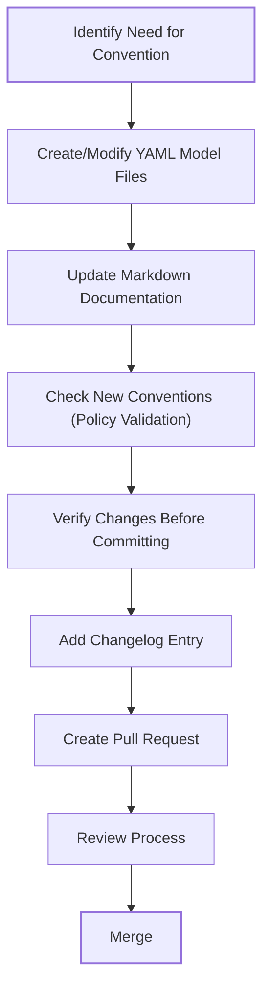
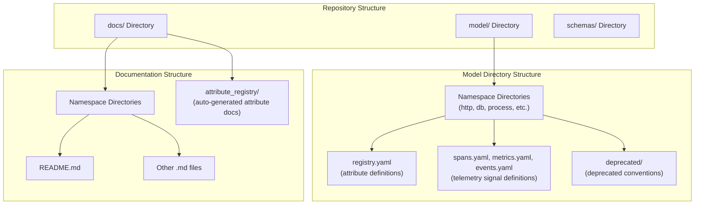

This document explains the process and best practices for adding new semantic conventions or modifying existing ones in the OpenTelemetry semantic-conventions repository. It covers the workflow for defining conventions in YAML models, generating documentation, and ensuring backward compatibility.

For working with specific schema syntax details, see [Working with YAML Models](#4.2). For managing version changes, see [Changelog Management](#4.3).

## Process Overview

Adding or modifying semantic conventions involves several steps that ensure quality, consistency, and backward compatibility. The following diagram illustrates the overall process:



Sources: [CONTRIBUTING.md:111-130](), [CONTRIBUTING.md:183-196](), [CONTRIBUTING.md:225-237]()

## File Organization

Before adding or modifying conventions, it's important to understand how files are organized in the repository:



Sources: [CONTRIBUTING.md:131-166](), [README.md:10-13]()

## 1. Modifying the YAML Model

The first step in adding or modifying semantic conventions is updating the YAML model files in the `model/` directory.

### Where to Define New Attributes

All attributes must be defined in a registry file matching their root namespace:

- Common attributes: `/model/{root-namespace}/registry.yaml`
- Telemetry signals (spans, metrics, events): `/model/{root-namespace}/{signal}.yaml`
- Deprecated conventions: `/model/{root-namespace}/deprecated/registry-deprecated.yaml`

### Example of Attribute Definition

Here's an example showing how attributes are defined in YAML files:

```yaml