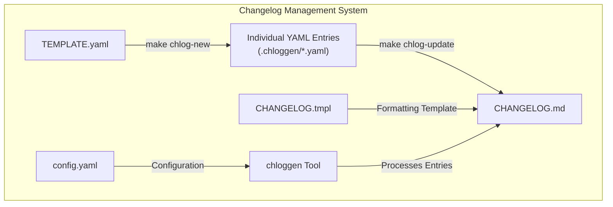
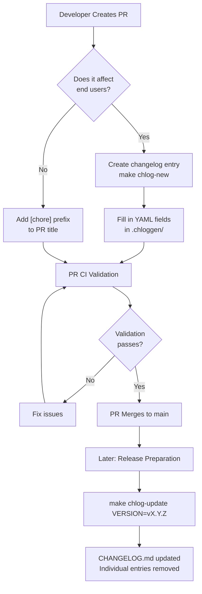
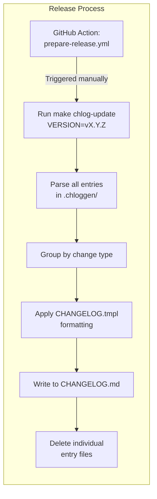
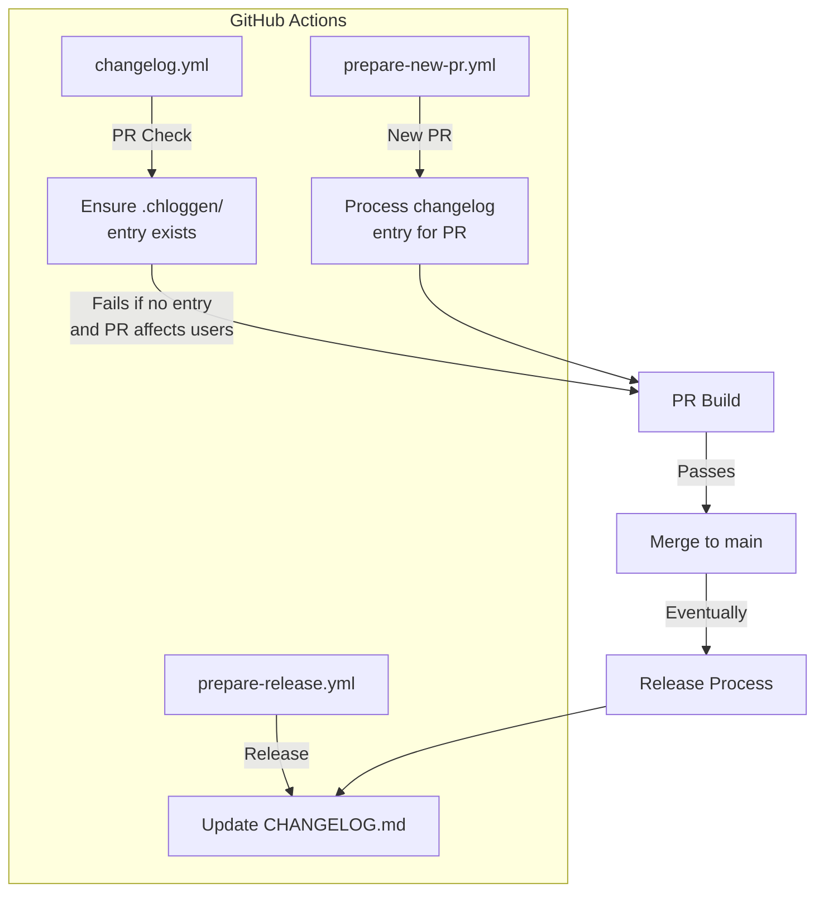

## Purpose and Scope

This document explains how version history and changelog entries are managed in the OpenTelemetry Semantic Conventions repository. It covers the process of creating, validating, and generating changelog entries, as well as the tooling and workflows that enforce proper changelog maintenance. For information about adding or modifying semantic conventions, see [Adding and Modifying Conventions](#4.1).

## Overview

The OpenTelemetry Semantic Conventions repository uses a structured approach to manage changelog entries. Rather than directly editing the `CHANGELOG.md` file, contributors create individual YAML-based changelog entries that are later compiled into the main changelog during releases.



Sources: [.chloggen/config.yaml](), [.chloggen/TEMPLATE.yaml](), [.chloggen/CHANGELOG.tmpl]()

## Changelog Entry Structure

Each changelog entry is a YAML file containing structured metadata about a change. This approach ensures consistency in changelog entries and makes it easier to categorize and process changes.

```mermaid
classDiagram
    class "Changelog Entry" {
        change_type: String
        component: String
        note: String
        issues: Number[]
        subtext: String (optional)
    }
    note for "Changelog Entry" "change_type options:
    - breaking
    - deprecation
    - new_component
    - enhancement
    - bug_fix"
```

Sources: [.chloggen/TEMPLATE.yaml]()

### Entry Fields Explained

| Field | Description | Required | Example |
|-------|-------------|----------|---------|
| `change_type` | Category of change | Yes | `enhancement` |
| `component` | Area of concern in the registry | Yes | `http`, `db`, `cloud` |
| `note` | Brief description of the change | Yes | "Add new attributes for HTTP client spans" |
| `issues` | Related issue or PR numbers | Yes | `[123, 456]` |
| `subtext` | Additional information (optional) | No | "These attributes allow for better filtering" |

Sources: [.chloggen/TEMPLATE.yaml]()

## Changelog Workflow

The following diagram illustrates the complete workflow for changelog management in the repository:



Sources: [.github/workflows/changelog.yml](), [.github/workflows/prepare-release.yml]()

## Creating Changelog Entries

When making changes that affect end users, you must create a changelog entry using the provided tooling.

### When to Add a Changelog Entry

A changelog entry is required when changes affect end users. This includes:

- New semantic conventions
- Changes to existing conventions
- Deprecations or removals
- Bug fixes affecting published conventions

A changelog entry is NOT required when:
- Making documentation-only changes
- Updating internal tooling
- Making other changes that don't affect published conventions

For changes that don't require a changelog entry, add the `[chore]` prefix to your PR title or apply the "Skip Changelog" label.

Sources: [.github/workflows/changelog.yml:16-27](), [.chloggen/TEMPLATE.yaml:1-5]()

### Creating an Entry

To create a new changelog entry:

1. Run `make chlog-new` which will create a new YAML file in the `.chloggen/` directory
2. Edit the generated file to fill in the required fields
3. Include the file in your PR

The file should follow this template:

```yaml
# One of 'breaking', 'deprecation', 'new_component', 'enhancement', 'bug_fix'
change_type: enhancement

# The name of the area of concern in the attributes-registry
component: http

# A brief description of the change
note: "Added new attributes for HTTP client spans"

# One or more tracking issues related to the change
issues: [123]

# Optional additional information
subtext: "These attributes allow for better filtering of HTTP client spans"
```

Sources: [.chloggen/TEMPLATE.yaml]()

## Validating Changelog Entries

The repository includes built-in validation to ensure that changelog entries follow the correct format.

### Local Validation

You can validate your changelog entries locally using:

```bash
make chlog-validate
```

This will check that all entries in the `.chloggen/` directory are valid according to the schema.

Sources: [.github/workflows/changelog.yml:72-75]()

### CI Validation

Pull requests are automatically validated by GitHub Actions workflows that check:

1. That PRs affecting user-facing code include changelog entries
2. That changelog entries follow the correct format
3. That links in changelog entries are valid

If a PR doesn't need a changelog entry, you can either:
- Add the `[chore]` prefix to your PR title
- Apply the "Skip Changelog" label to your PR

Sources: [.github/workflows/changelog.yml:19-27](), [.github/workflows/changelog.yml:59-75]()

## Generating the Changelog

The changelog is generated during release preparation. This process compiles all individual changelog entries into the main `CHANGELOG.md` file.



Sources: [.github/workflows/prepare-release.yml:41-43](), [.chloggen/CHANGELOG.tmpl]()

### Release Preparation

During release preparation:

1. A release PR is created by the `prepare-release.yml` workflow
2. `make chlog-update VERSION=vX.Y.Z` is executed
3. All changelog entries are processed and added to `CHANGELOG.md` under the new version
4. Individual entry files are removed from the `.chloggen/` directory
5. The updated `CHANGELOG.md` is committed to the repository

Sources: [.github/workflows/prepare-release.yml:10-60]()

### Changelog Format

The generated changelog organizes entries by type and includes links to relevant issues or PRs:

- 🛑 Breaking changes
- 🚩 Deprecations
- 🚀 New components
- 💡 Enhancements
- 🧰 Bug fixes

Each entry includes:
- Component name
- Description
- Links to related issues/PRs
- Optional additional information

Sources: [.chloggen/CHANGELOG.tmpl:19-72]()

## CI/CD Integration

The changelog management system is tightly integrated with the repository's CI/CD pipelines to enforce consistent versioning and changelog maintenance.



Sources: [.github/workflows/changelog.yml](), [.github/workflows/prepare-new-pr.yml](), [.github/workflows/prepare-release.yml]()

### PR Checks

The `changelog.yml` workflow runs on all PRs targeting the main branch and:

1. Skips validation for PRs with `[chore]` prefix or "Skip Changelog" label
2. Ensures PRs don't directly modify `CHANGELOG.md`
3. Verifies that new changelog entries are added to `.chloggen/`
4. Validates the format of changelog entries
5. Checks links in changelog entries

Sources: [.github/workflows/changelog.yml:1-82]()

### Automated Tools

The repository uses the following tools for changelog management:

- `chloggen`: A Go-based tool for generating and managing changelogs
- `make chlog-new`: Creates a new changelog entry
- `make chlog-validate`: Validates changelog entries
- `make chlog-update`: Updates the main changelog file
- `make chlog-preview`: Generates a preview of the changelog

Sources: [internal/tools/tools.go:26-29](), [.github/workflows/changelog.yml:72-75](), [.github/workflows/prepare-release.yml:43]()

## Best Practices

When managing changelog entries, follow these best practices:

1. **Be specific**: Provide clear, concise descriptions of changes
2. **Use the correct change type**: Accurately categorize your changes
3. **Reference issues**: Always include relevant issue or PR numbers
4. **Focus on user impact**: Explain how the change affects users of semantic conventions
5. **One change per entry**: Create separate entries for unrelated changes
6. **Don't modify CHANGELOG.md directly**: Always use the entry system

Remember that the primary purpose of the changelog is to communicate important changes to users of the semantic conventions. Your entries should help users understand what changed and why it matters.

Sources: [.chloggen/TEMPLATE.yaml](), [.github/workflows/changelog.yml:46-57]()