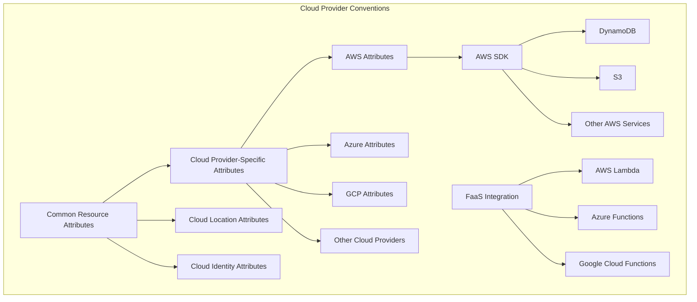
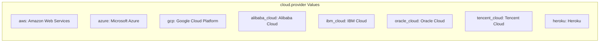
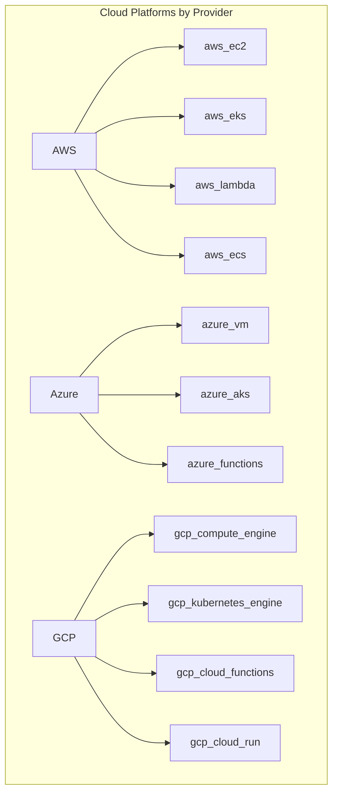
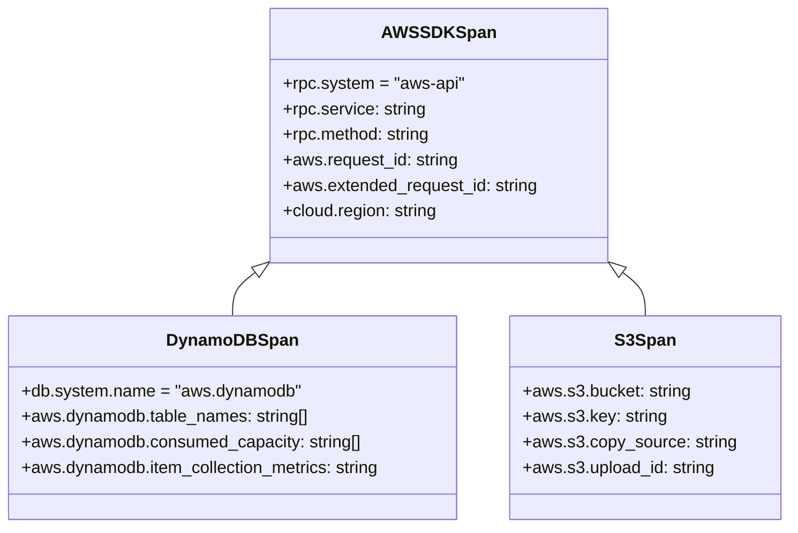
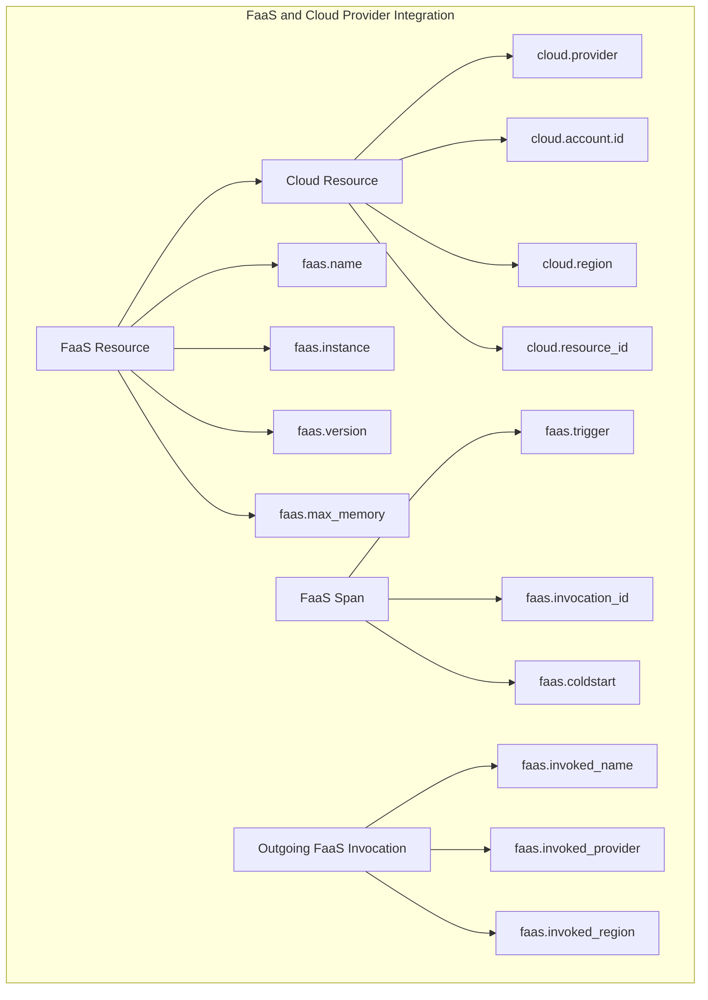
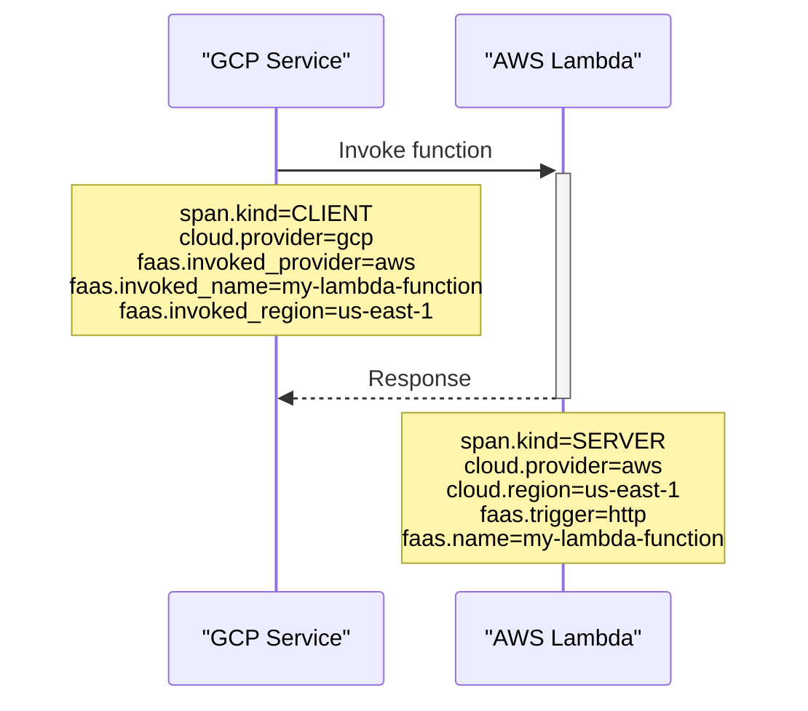

This document describes the semantic conventions for cloud provider-specific telemetry in OpenTelemetry. It covers the standardized attributes and patterns for instrumenting applications deployed on various cloud platforms, including AWS, Azure, GCP, and others. For Function-as-a-Service (FaaS) specific conventions, see [FaaS Conventions](#3.9).

## Overview

Cloud provider conventions define how to represent cloud-specific metadata in telemetry data. These conventions ensure consistent representation of cloud resources, services, and operations across different OpenTelemetry implementations.

Sources: [docs/resource/cloud.md:1-105](), [docs/cloud-providers/aws-sdk.md:1-85]()

## Common Cloud Resource Attributes

Cloud resource attributes represent the cloud environment where a resource operates. These attributes are typically defined as resource attributes that span multiple platforms.

| Attribute | Type | Description | Examples |
|-----------|------|-------------|----------|
| `cloud.provider` | string | Name of the cloud provider | `aws`, `azure`, `gcp` |
| `cloud.account.id` | string | Cloud account ID | `111111111111` |
| `cloud.region` | string | Geographical region | `us-east-1`, `us-central1` |
| `cloud.availability_zone` | string | Zone within a region | `us-east-1c` |
| `cloud.platform` | string | The cloud platform in use | `aws_ec2`, `azure_vm`, `gcp_compute_engine` |
| `cloud.resource_id` | string | Provider-specific resource identifier | `arn:aws:lambda:us-west-2:123456789012:function:my-function` |

The `cloud.provider` attribute has well-defined values for major cloud providers, ensuring consistency across implementations:

Sources: [docs/resource/cloud.md:17-24](), [model/cloud/registry.yaml:8-42]()

The `cloud.platform` attribute provides more granular information about the specific service or execution environment:

Sources: [docs/resource/cloud.md:52-86](), [model/cloud/registry.yaml:107-229]()

## AWS Semantic Conventions

AWS semantic conventions define how to instrument AWS SDK calls and service-specific operations.

### AWS SDK General Conventions

For AWS SDK calls, spans should:

1. Use span names in the format `Service.Operation` (e.g., `DynamoDB.GetItem`, `S3.ListBuckets`)
2. Set `rpc.system` to `aws-api`
3. Include AWS-specific attributes like `aws.request_id` and region information

Sources: [docs/cloud-providers/aws-sdk.md:15-72](), [model/aws/sdk-spans.yaml:1-50]()

### AWS Service-Specific Conventions

The AWS service-specific conventions extend the general AWS SDK conventions with attributes specific to each service.

#### DynamoDB Attributes

For DynamoDB operations, spans include attributes specific to the operation being performed:

| Operation Type | Key Attributes |
|----------------|----------------|
| BatchGetItem   | `aws.dynamodb.table_names`, `aws.dynamodb.consumed_capacity` |
| GetItem        | `aws.dynamodb.table_names`, `aws.dynamodb.consistent_read`, `aws.dynamodb.projection` |
| Query          | `aws.dynamodb.table_names`, `aws.dynamodb.scan_forward`, `aws.dynamodb.index_name` |
| PutItem        | `aws.dynamodb.table_names`, `aws.dynamodb.consumed_capacity` |

Sources: [docs/database/dynamodb.md:37-357](), [model/aws/sdk-spans.yaml:51-333]()

#### S3 Attributes

For S3 operations, spans include attributes specific to the object storage operations:

| Attribute | Description | Example |
|-----------|-------------|---------|
| `aws.s3.bucket` | S3 bucket name | `my-bucket` |
| `aws.s3.key` | S3 object key | `path/to/file.jpg` |
| `aws.s3.copy_source` | Source for copy operations | `source-bucket/source-key` |
| `aws.s3.upload_id` | Upload ID for multipart uploads | `dfRtDYWFbkRONycy.Yxwh66Yjlx.cph0gtNBtJ` |

Sources: [docs/object-stores/s3.md:10-102](), [model/aws/sdk-spans.yaml:335-356]()

## Integration with FaaS (Function as a Service)

Cloud provider conventions integrate with FaaS semantic conventions, allowing detailed instrumentation of serverless applications.

### Key FaaS-Cloud Integration Points

1. **Resource Identification**:
   - `cloud.resource_id` contains cloud-specific resource identifiers (e.g., ARN for AWS Lambda)
   - Different for each provider (e.g., ARN for AWS, URI for GCP, Fully Qualified Resource ID for Azure)

2. **Invocation Context**:
   - `faas.invoked_provider` maps to the `cloud.provider` of the invoked function
   - `faas.invoked_region` maps to the `cloud.region` of the invoked function

3. **Client-Server Relationship**:
   - When invoking FaaS functions across clouds, the invoking service records the target cloud provider details

Sources: [docs/faas/faas-spans.md:1-357](), [docs/resource/faas.md:12-96]()

### AWS Lambda Example

For an AWS Lambda function, the cloud and FaaS attributes would include:

| Attribute Type | Attribute | Value |
|----------------|-----------|-------|
| Resource | `cloud.provider` | `aws` |
| Resource | `cloud.region` | `us-east-1` |
| Resource | `cloud.resource_id` | `arn:aws:lambda:us-east-1:123456789012:function:my-function` |
| Resource | `faas.name` | `my-function` |
| Resource | `faas.version` | `$LATEST` |
| Resource | `faas.instance` | `2021/06/28/[$LATEST]2f399eb14537447da05ab2a2e39309de` |
| Span | `faas.trigger` | `http` or `sqs` or other trigger type |
| Span | `faas.invocation_id` | `af9d5aa4-a685-4c5f-a22b-444f80b3cc28` |
| Span | `faas.coldstart` | `true` or `false` |

Sources: [docs/faas/faas-spans.md:340-357](), [docs/resource/faas.md:30-70]()

## Provider-Specific Considerations

### AWS

- ARN format is used for `cloud.resource_id`
- For Lambda functions, resource ID should use the resolved function version, not aliases
- AWS SDK operations map to spans with names like `DynamoDB.GetItem` or `S3.ListBuckets`

### Azure

- Azure uses Fully Qualified Resource IDs
- For Azure Functions, `faas.name` should use the format `<FUNCAPP>/<FUNC>`
- `cloud.resource_id` should point to the specific function, not the function app

### GCP

- GCP uses resource URIs
- For Cloud Functions, version can be derived from the `K_REVISION` environment variable
- For Cloud Run, version is the revision (function name plus revision suffix)

Sources: [docs/resource/cloud.md:23-47](), [docs/resource/faas.md:53-83](), [docs/faas/faas-spans.md:53-70]()

## Cross-Provider Tracing

When services on different cloud providers interact, both client and server spans should include the appropriate cloud provider details:

This approach ensures that distributed traces can maintain context across different cloud environments.

Sources: [docs/faas/faas-spans.md:193-243](), [docs/faas/faas-spans.md:340-357]()

## Implementation Example

Below is an example showing how cloud provider conventions are applied when a service on GCP invokes an AWS Lambda function:

| Attribute Kind | Attribute | Span A (Client, GCP) | Span B (Server, AWS Lambda) |
|----------------|-----------|----------------------|----------------------------|
| Resource | `cloud.provider` | `gcp` | `aws` |
| Resource | `cloud.region` | `europe-west3` | `us-east-1` |
| Span | `faas.invoked_name` | `my-lambda-function` | n/a |
| Span | `faas.invoked_provider` | `aws` | n/a |
| Span | `faas.invoked_region` | `us-east-1` | n/a |
| Span | `faas.trigger` | n/a | `http` |
| Span | `faas.invocation_id` | n/a | `af9d5aa4-a685-4c5f-a22b-444f80b3cc28` |
| Span | `faas.coldstart` | n/a | `true` |
| Resource | `faas.name` | n/a | `my-lambda-function` |
| Resource | `faas.version` | n/a | `semver:2.0.0` |
| Resource | `faas.instance` | n/a | `my-lambda-function:instance-0001` |
| Resource | `cloud.resource_id` | n/a | `arn:aws:lambda:us-west-2:123456789012:function:my-lambda-function` |

Sources: [docs/faas/faas-spans.md:340-357]()