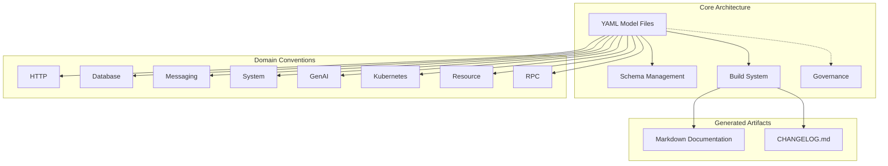
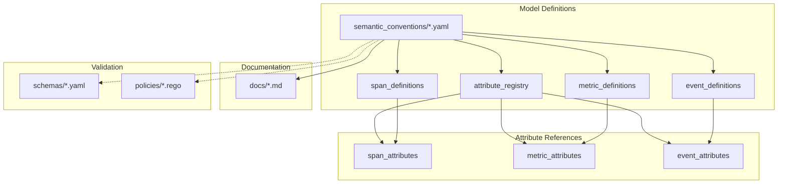
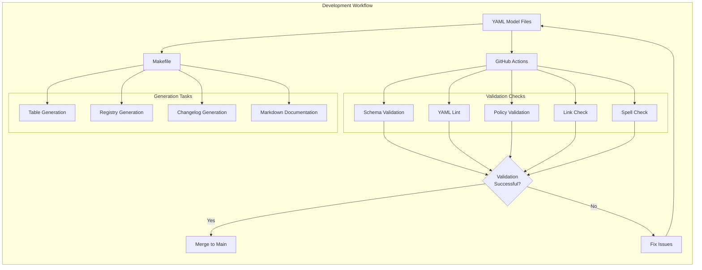
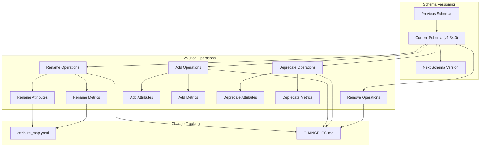
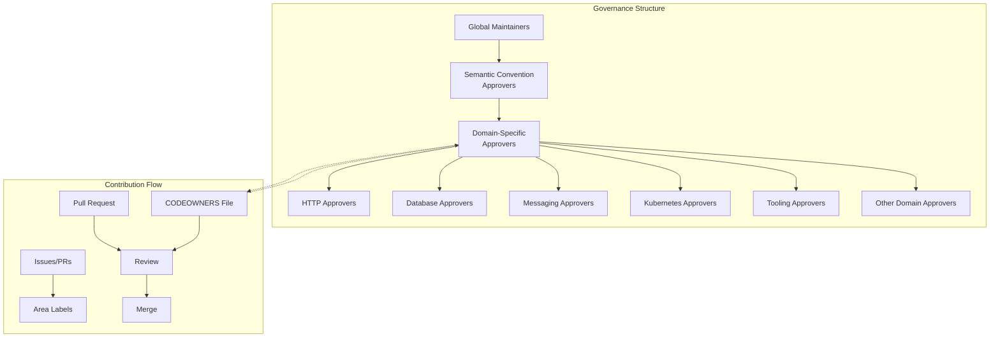
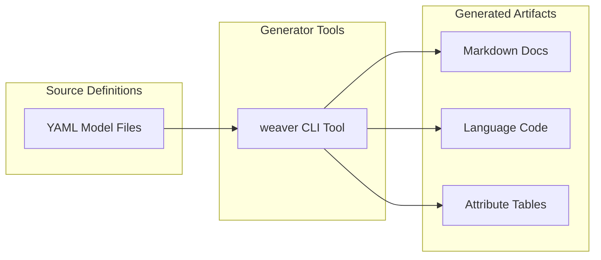

This document describes the fundamental architecture of the OpenTelemetry Semantic Conventions repository, explaining how semantic conventions are defined, structured, maintained, and governed. For specific details about domain-specific semantic conventions like HTTP or Database, see [Domain-Specific Conventions](#3).

## Semantic Convention Repository Overview

The OpenTelemetry Semantic Conventions repository serves as the central definition source for standardized telemetry attributes, metrics, spans, and events across various technology domains. These conventions ensure consistent telemetry data regardless of programming language or implementation.



Sources: [CHANGELOG.md:1-472]()/[docs/http/http-spans.md:1-40]()

## Semantic Convention Structure

Semantic conventions are defined in YAML model files, which serve as the source of truth for all telemetry conventions. These files follow a structured schema that enables validation, versioning, and documentation generation.



Sources: [docs/http/http-spans.md:35-115]()

### Key Components

| Component | Description | File Path Pattern |
|-----------|-------------|-------------------|
| Attribute Registry | Central definitions for all attributes used across spans, metrics, and events | `semantic_conventions/attributes/*.yaml` |
| Span Definitions | Definitions for trace spans across different domains | `semantic_conventions/trace/*.yaml` |
| Metric Definitions | Definitions for metrics across different domains | `semantic_conventions/metrics/*.yaml` |
| Event Definitions | Definitions for events across different domains | `semantic_conventions/events/*.yaml` |
| Schema Files | JSON Schema files for validating YAML model files | `schemas/*.yaml` |
| Policy Files | OPA Rego policies for semantic validation | `policies/*.rego` |

Sources: [docs/http/http-spans.md:35-115]()

### YAML Model Structure

The YAML model files contain structured definitions for spans, metrics, events, and attributes, with metadata that includes stability level, requirement level, and descriptive documentation.

Example snippet of a semantic convention YAML structure:

```
groups:
  - id: http.server
    prefix: http.server
    type: span
    stability: stable
    brief: "HTTP server span conventions"
    attributes:
      - id: request.method
        type: string
        brief: "HTTP request method"
        examples: ["GET", "POST", "HEAD"]
        requirement_level: required
      - id: response.status_code
        type: int
        brief: "HTTP response status code"
        examples: ["200"]
        requirement_level: conditionally_required
        condition: "If and only if one was received/sent"
```

Sources: [docs/http/http-spans.md:120-170]()

## Build and Validation System

The repository includes a comprehensive build and validation system that ensures semantic conventions are consistent, well-documented, and adhere to policies.



Sources: [CHANGELOG.md:1-20]()

The build process performs several key functions:

1. **Validation** - Ensures YAML files conform to schemas and policies
2. **Documentation Generation** - Creates consistent markdown documentation
3. **Changelog Management** - Tracks changes and maintains versioning
4. **Table Generation** - Creates consistent attribute tables in documentation
5. **Registry Generation** - Ensures attribute consistency across conventions

Sources: [CHANGELOG.md:1-20]()

## Schema Evolution System

The schema evolution system provides a structured way to evolve conventions over time while maintaining backward compatibility.



Sources: [CHANGELOG.md:6-102]()

### Schema Stability Levels

The semantic conventions define different stability levels:

| Stability Level | Description | Breaking Change Policy |
|-----------------|-------------|------------------------|
| Stable | Mature conventions unlikely to change | Breaking changes require major version bump |
| Release Candidate | Nearly stable, may have minor changes | Breaking changes announced in advance |
| Development | Actively evolving, may change significantly | Breaking changes with minor version bump |

Sources: [docs/http/http-spans.md:7-9]()

### Breaking Changes Process

When breaking changes are necessary, the repository follows a strict process:

1. Document the change in CHANGELOG.md
2. Update attribute maps for renamed attributes
3. Include migration guidance when applicable
4. Version bump according to stability level

For example, in v1.34.0, there was a breaking change to convert deprecated text to structured format:

```
- `all`: Convert deprecated text to structured format. (#2047)
  This is a breaking change from the schema perspective, but does not change anything for instrumentations or the end users. It breaks compatibility with the (old) code generation tooling.
```

Sources: [CHANGELOG.md:10-15]()

## Governance Model

The repository employs a domain-based governance model where experts in specific areas oversee their respective domains.



Sources: [CHANGELOG.md:1-5]()

### Domain-Specific Ownership

The governance model ensures that experts in each domain are responsible for approving changes to their specific areas. This is defined in the CODEOWNERS file, which maps directories and files to specific maintainers.

For example:
- HTTP conventions are maintained by HTTP experts
- Database conventions are maintained by database experts
- Messaging conventions are maintained by messaging experts
- Kubernetes conventions are maintained by Kubernetes experts

This ensures that conventions are accurate and meet the needs of domain specialists.

Sources: [docs/http/http-spans.md:1-40]()

## Code Generation and Tooling

The repository provides tools for generating code and documentation from the semantic convention definitions.



### Weaver Tool

A tool called "weaver" is used to generate:
- Semantic convention markdown documentation
- Code for various programming languages
- Consistent attribute tables

This replaced the older code generation tooling as mentioned in the CHANGELOG:

```
This is a breaking change from the schema perspective, but does not change anything for instrumentations or the end users. It breaks compatibility with the (old) code generation tooling. Please use [weaver](https://github.com/open-telemetry/weaver) to generate Semantic Conventions markdown or code.
```

Sources: [CHANGELOG.md:14-15]()

## Conclusion

The core architecture of the OpenTelemetry Semantic Conventions repository provides a robust system for defining, validating, evolving, and governing telemetry conventions across multiple domains. The YAML-based model files serve as the source of truth, while the build and validation system ensures quality and consistency. The schema evolution system allows for controlled changes over time, and the governance model ensures domain expertise is applied to convention development.