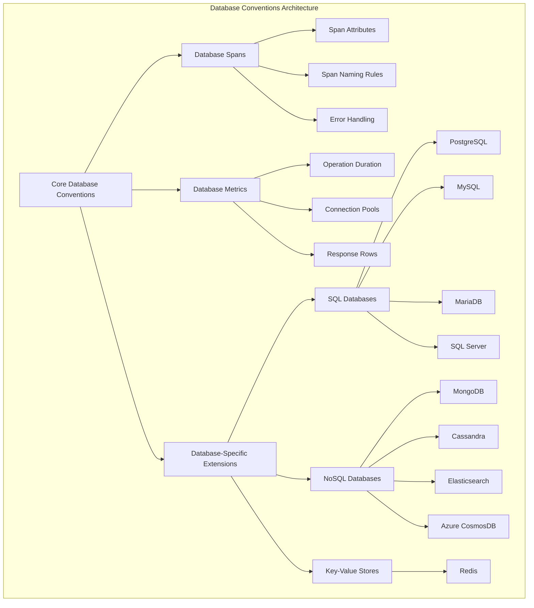
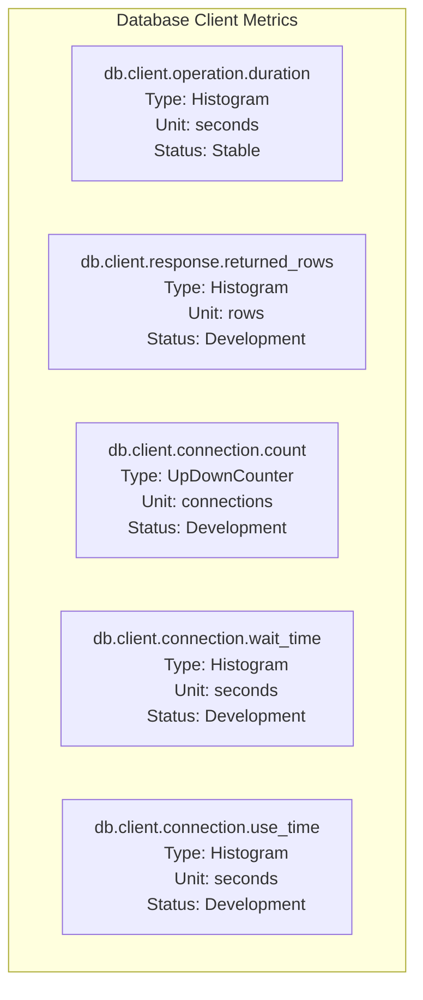
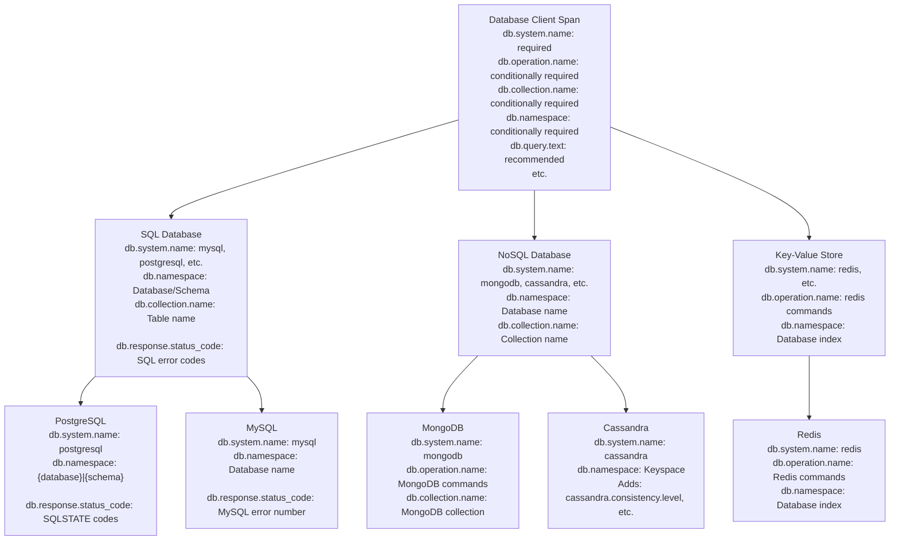

This document outlines the semantic conventions for database client operations in OpenTelemetry, providing standardized ways to represent database operations in traces and metrics. These conventions enable consistent telemetry across different database technologies while allowing for database-specific customizations.

## Core Structure and Concepts

Database conventions in OpenTelemetry consist of standardized attributes, spans, and metrics that describe interactions between applications and database systems. These conventions apply to client operations across various database technologies including SQL databases, NoSQL databases, and key-value stores.



Sources: [docs/database/database-spans.md:1-497](), [docs/database/database-metrics.md:1-235](), [model/database/spans.yaml:1-296]()

## Database Span Conventions

Database spans represent database client operations with consistent naming and attribute conventions. These spans capture the essential information about database operations while enabling database-specific extensions.

### Span Structure

A database client span has the following key properties:

```mermaid
classDiagram
    class "Database Client Span" {
        name: String
        kind: CLIENT or INTERNAL
        status: OK, ERROR
        attributes: Map~String, Value~
    }

    class "Core Attributes" {
        db.system.name: String
        db.operation.name: String
        db.namespace: String
        db.collection.name: String
        server.address: String
        server.port: Integer
        db.query.text: String
        db.query.summary: String
        db.response.status_code: String
        error.type: String
    }

    class "Optional Attributes" {
        db.operation.batch.size: Integer
        db.stored_procedure.name: String
        db.query.parameter.<key>: String
        db.response.returned_rows: Integer
        network.peer.address: String
        network.peer.port: Integer
    }

    "Database Client Span" --> "Core Attributes"
    "Database Client Span" --> "Optional Attributes"
```

Sources: [docs/database/database-spans.md:11-297](), [model/database/spans.yaml:76-103]()

### Span Naming Conventions

Database spans follow specific naming rules to provide consistent and meaningful span names:

1. If a query summary is available, use `{db.query.summary}`
2. Otherwise, use `{db.operation.name} {target}` if a low-cardinality operation name is available
3. Fall back to just `{target}` if operation name is not available
4. Use `{db.system.name}` as a last resort

The `{target}` can be:
- `db.collection.name` for operations on a collection
- `db.stored_procedure.name` for stored procedure operations
- `db.namespace` for namespace operations
- `server.address:server.port` for other operations

Sources: [docs/database/database-spans.md:46-74]()

### Core Attributes

These are the primary attributes used to describe database operations:

| Attribute | Type | Description | Requirement Level |
|-----------|------|-------------|-------------------|
| `db.system.name` | string | DBMS product identifier | Required |
| `db.operation.name` | string | Operation being executed | Conditionally Required |
| `db.collection.name` | string | Collection/table being accessed | Conditionally Required |
| `db.namespace` | string | Database name/schema | Conditionally Required |
| `server.address` | string | Database host name | Recommended |
| `server.port` | int | Database port number | Conditionally Required |
| `db.query.text` | string | Database query text | Recommended |
| `db.query.summary` | string | Low-cardinality query summary | Recommended |
| `db.response.status_code` | string | Database response code | Conditionally Required |
| `error.type` | string | Error type if operation failed | Conditionally Required |

Sources: [docs/database/database-spans.md:111-128](), [model/database/registry.yaml:8-138]()

### Query Sanitization

For security reasons, the `db.query.text` attribute should be handled with care:

- Non-parameterized queries should only be collected if sanitized to exclude sensitive data
- Parameterized queries can be collected without sanitization as sensitive data should be in parameters
- Query parameters can be collected separately as `db.query.parameter.<key>` attributes (opt-in)
- IN-clauses can be collapsed for better cardinality control

Sources: [docs/database/database-spans.md:320-340]()

### Query Summary Generation

The `db.query.summary` attribute provides a low-cardinality representation of database queries that can be used for grouping similar operations. It should:

- Preserve operation types (SELECT, INSERT, etc.)
- Include operation targets (collections, stored procedures)
- Be truncated to 255 characters
- Not contain sensitive or dynamic data

For example:
```
SELECT wuser_table
INSERT shipping_details SELECT orders
```

Sources: [docs/database/database-spans.md:342-441]()

## Database Metrics

OpenTelemetry defines standard metrics for database operations to monitor performance and behavior.

### Key Database Metrics



Sources: [docs/database/database-metrics.md:55-235]()

### Required Metrics

The `db.client.operation.duration` metric is required and captures the duration of database client operations. It shares the same attributes as database spans, allowing for correlation between traces and metrics.

This metric should be reported with explicit bucket boundaries of [0.001, 0.005, 0.01, 0.05, 0.1, 0.5, 1, 5, 10] seconds.

Sources: [docs/database/database-metrics.md:57-68](), [docs/database/database-metrics.md:82-97]()

### Additional Metrics

Development-stage metrics include:

1. `db.client.response.returned_rows` - Number of rows returned by database operations
2. Connection pool metrics:
   - `db.client.connection.count` - Number of connections in various states
   - `db.client.connection.idle.max` - Maximum idle connections
   - `db.client.connection.idle.min` - Minimum idle connections
   - `db.client.connection.max` - Maximum connections
   - `db.client.connection.pending_requests` - Pending connection requests
   - `db.client.connection.timeouts` - Connection timeouts
   - `db.client.connection.create_time` - Time to create connections
   - `db.client.connection.wait_time` - Time spent waiting for connections
   - `db.client.connection.use_time` - Time connections are in use

Sources: [docs/database/database-metrics.md:242-426]()

## Database-Specific Conventions

OpenTelemetry provides specialized conventions for various database systems, extending the core conventions with database-specific attributes and behaviors.



Sources: [docs/database/sql.md:1-220](), [docs/database/mongodb.md:1-115](), [docs/database/redis.md:1-119](), [docs/database/cassandra.md:1-194](), [docs/database/postgresql.md:1-169](), [docs/database/mysql.md:1-158]()

### SQL Databases

SQL database conventions apply to a variety of SQL-based systems including PostgreSQL, MySQL, MariaDB, SQL Server, and others. These conventions handle:

- SQL commands as `db.operation.name`
- Tables as `db.collection.name`
- Database and schema as `db.namespace`
- SQL state codes and vendor-specific error codes as `db.response.status_code`
- Stored procedures via `db.stored_procedure.name`

For example, in PostgreSQL:
- `db.namespace` follows `{database}|{schema}` pattern
- `db.response.status_code` uses PostgreSQL SQLSTATE error codes

Sources: [docs/database/sql.md:11-204](), [docs/database/postgresql.md:20-169](), [docs/database/mysql.md:20-156](), [docs/database/mariadb.md:18-158]()

### NoSQL Databases

NoSQL database conventions cover document stores, column-family stores, and search engines with specialized attributes for each:

- MongoDB: Focuses on MongoDB commands and collections
- Cassandra: Adds specialized attributes like `cassandra.consistency.level` and `cassandra.coordinator.id`
- Elasticsearch: Extends with HTTP-based attributes appropriate for its REST API
- CosmosDB: Adds Azure-specific attributes like `azure.cosmosdb.consistency.level`

Sources: [docs/database/mongodb.md:21-106](), [docs/database/cassandra.md:20-180](), [docs/database/elasticsearch.md:21-167](), [docs/database/cosmosdb.md:25-307]()

### Key-Value Stores

Key-value databases like Redis have specific conventions suited to their command-based nature:

- Redis: Uses Redis commands as `db.operation.name` and numeric database indices as `db.namespace`

Sources: [docs/database/redis.md:12-102]()

## Stability and Migration

The database conventions contain a mix of stable and development-stage elements. Stable components provide backward compatibility guarantees, while development-stage elements may change.

Instrumentation libraries transitioning from experimental to stable conventions should:

1. Not change conventions in existing major versions
2. Support an environment variable `OTEL_SEMCONV_STABILITY_OPT_IN` to control behavior:
   - `database` - emit only stable conventions
   - `database/dup` - emit both experimental and stable conventions
3. Maintain existing versions for at least six months when emitting both sets

Sources: [docs/database/database-spans.md:20-44](), [docs/database/database-metrics.md:29-53]()

## Usage Examples

### SQL Database Example

An example of attributes for a PostgreSQL database span:

| Key | Value |
|-----|-------|
| Span name | `"SELECT orders"` |
| `db.system.name` | `"postgresql"` |
| `db.namespace` | `"mydatabase.public"` |
| `server.address` | `"db.example.com"` |
| `server.port` | `5432` |
| `db.operation.name` | `"SELECT"` |
| `db.collection.name` | `"orders"` |
| `db.query.text` | `"SELECT * FROM orders WHERE order_id = ?"` |

Sources: [docs/database/postgresql.md:136-169]()

### NoSQL Database Example

An example of attributes for a MongoDB database span:

| Key | Value |
|-----|-------|
| Span name | `"findAndModify products"` |
| `db.system.name` | `"mongodb"` |
| `server.address` | `"mongodb0.example.com"` |
| `server.port` | `27017` |
| `db.collection.name` | `"products"` |
| `db.namespace` | `"shopDb"` |
| `db.operation.name` | `"findAndModify"` |

Sources: [docs/database/mongodb.md:93-106]()

## Relationship to Other Conventions

Database conventions are one part of the broader OpenTelemetry Semantic Conventions ecosystem. They relate to:

- [Resource Attribute Conventions](#3.6) - For identifying the database service itself
- [HTTP Conventions](#3.1) - For databases with HTTP-based APIs like Elasticsearch
- [RPC Conventions](#3.8) - For databases with RPC interfaces
- [Cloud Provider Conventions](#3.9) - For cloud-based database services

The database conventions focus specifically on application-to-database communication from the client perspective.

Sources: [docs/database/database-spans.md:1-10](), [docs/database/elasticsearch.md:9-17]()