## Purpose and Scope

This document provides an overview of the domain-specific semantic conventions in OpenTelemetry. Domain-specific conventions define standardized attributes, metrics, spans, and events for telemetry data across various technology domains and services. These conventions ensure consistent telemetry collection and interpretation across different implementations and programming languages.

While this page gives a high-level overview of domain categories and their relationships, detailed information about specific domain conventions can be found in their respective documentation pages (linked throughout this document).

## Domain Organization

The OpenTelemetry Semantic Conventions are organized hierarchically, with resource attributes forming the foundation upon which domain-specific conventions are built.

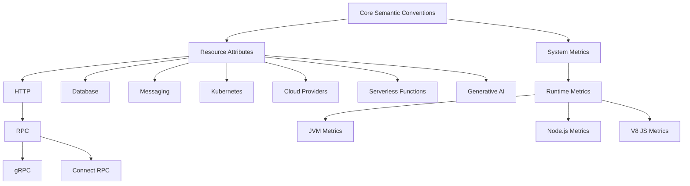

Sources:
- [docs/http/http-spans.md:1-339]()
- [docs/rpc/grpc.md:1-102]()
- [docs/rpc/connect-rpc.md:1-79]()

## Core Domain Categories

### HTTP Conventions

HTTP conventions define standardized telemetry for web servers and clients. These conventions are fundamental as they underpin many other domains that use HTTP as a transport layer.

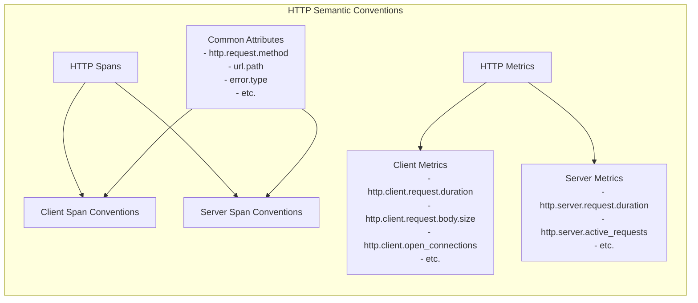

Sources:
- [docs/http/http-spans.md:9-116]()
- [docs/http/http-metrics.md:7-57]()

Key HTTP convention components include:
- Client and server span conventions
- Status mapping between HTTP status codes and span status
- Naming conventions for spans based on HTTP routes
- Handling of HTTP headers, metadata, and errors
- Metrics for request duration, body size, and connection tracking

HTTP conventions are referenced in [HTTP Conventions](#3.1) for detailed implementation.

### Database Conventions

Database conventions cover telemetry for database operations across various database systems, both SQL and NoSQL.

Main categories include:
- General database attributes (db.system.name, db.operation.name, etc.)
- SQL database specific conventions
- NoSQL database specific conventions (MongoDB, Redis, Cassandra, etc.)
- Database client metrics (connection pools, query duration)

For complete details, see [Database Conventions](#3.2).

### Messaging Conventions

Messaging conventions standardize telemetry for message brokers, queues, and pub/sub systems. They define:
- Message producer and consumer spans
- Message processing operations
- Queue, topic, and subscription attributes
- Message metadata attributes

These conventions cover systems like Kafka, RabbitMQ, AWS SQS, and more. For detailed information, see [Messaging Conventions](#3.3).

### RPC Conventions

RPC (Remote Procedure Call) conventions define telemetry for various RPC frameworks. They build upon HTTP conventions but add RPC-specific attributes.

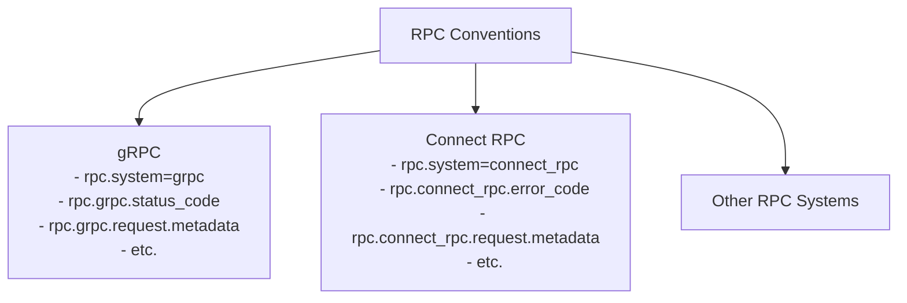

Sources:
- [docs/rpc/grpc.md:14-71]()
- [docs/rpc/connect-rpc.md:13-72]()

For complete RPC conventions, see [RPC Conventions](#3.8).

### System and Runtime Metrics

System and runtime metrics provide telemetry for:
- System resources (CPU, memory, disk, network)
- Container metrics
- Runtime environment metrics (JVM, Node.js, .NET, etc.)
- Process metrics

For more details, see [System Metrics Conventions](#3.4) and [Runtime Metrics Conventions](#3.7).

### Cloud Provider and FaaS Conventions

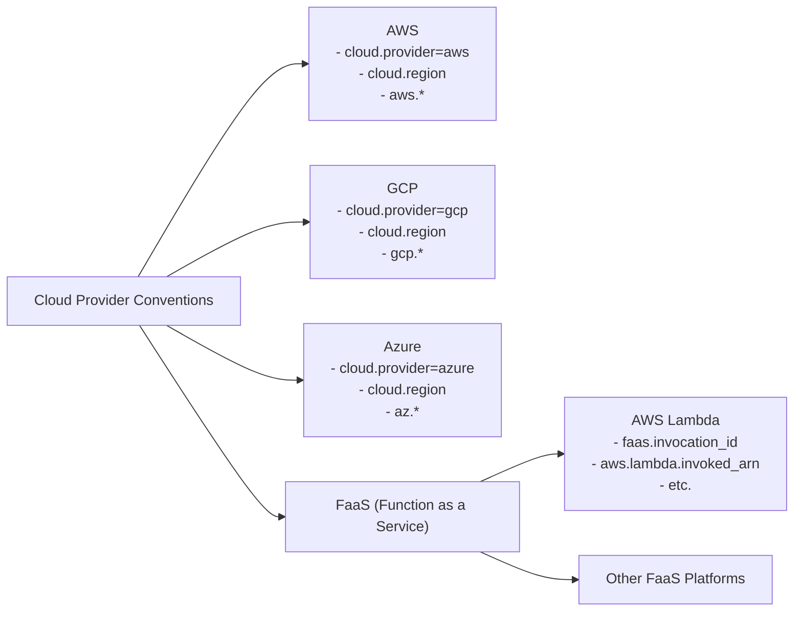

Sources:
- [docs/faas/aws-lambda.md:1-313]()
- [CHANGELOG.md:25-28]()

Cloud provider conventions standardize telemetry for resources and services specific to cloud providers like AWS, GCP, and Azure.

FaaS (Function as a Service) conventions cover serverless function execution, with specific implementations for platforms like AWS Lambda.

For more information, see [Cloud Provider Conventions](#3.9).

### Generative AI Conventions

Generative AI conventions are newer additions that provide standardized telemetry for AI model inference, embedding, and other AI operations.

Key components include:
- Model information attributes
- Inference requests and responses
- Token usage metrics
- Latency measurements
- LLM chain and agent telemetry

For detailed information, see [Generative AI Conventions](#3.5).

## Telemetry Signal Types Across Domains

Domain-specific conventions typically define telemetry for multiple signal types:

| Signal Type | Description | Example Domains |
|-------------|-------------|-----------------|
| **Traces** | Spans representing operations with timing, status, and context | HTTP, Database, RPC, Messaging |
| **Metrics** | Measurements of system behavior and performance | HTTP, Database, System, Runtime |
| **Logs** | Structured and unstructured records of events | All domains |
| **Events** | Named occurrences at specific times | Feature flags, Session lifecycle, Mobile app events |

Sources:
- [docs/general/metrics.md:20-37]()
- [docs/general/logs.md:22-30]()
- [docs/general/events.md:10-31]()
- [docs/general/trace.md:22-37]()

## Convention Structure and Implementation

Each domain-specific convention typically defines:

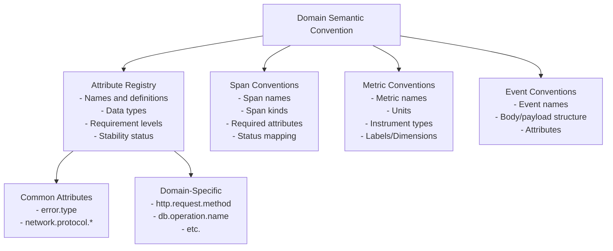

Sources:
- [CHANGELOG.md:14-16]()
- [docs/http/http-spans.md:117-338]()
- [docs/general/events.md:30-45]()

### Attribute Registry

The attribute registry is a central component containing definitions for all standardized attributes across domains. Attributes have:
- Unique names following namespace conventions
- Defined data types
- Requirement levels (Required, Recommended, Opt-In)
- Stability status (Stable, Development)

### Stability Levels

Conventions have different stability levels that indicate their maturity:

| Stability Level | Description |
|-----------------|-------------|
| **Stable** | Fully standardized, backward compatible changes only |
| **Release Candidate** | Feature complete, under final review |
| **Development** | Under active development, may change |
| **Deprecated** | Will be removed in future versions |

Sources:
- [docs/http/http-spans.md:7-8]()
- [docs/http/http-metrics.md:7-8]()
- [docs/general/events.md:8-9]()

## Cross-Domain Relationships and Composition

Domain-specific conventions often build upon and relate to each other:

1. **Hierarchical Relationships**: Some domains extend others (e.g., RPC extends HTTP)
2. **Common Foundations**: Resource attributes form a foundation used by all domains
3. **Propagation**: Context and trace information propagate between domains (e.g., HTTP client to database to messaging)

Understanding these relationships is crucial for end-to-end observability in complex systems.

## Versioning and Evolution

Semantic conventions evolve through a managed process defined in the governance model:

1. **Schema Versioning**: Tracks major and minor changes
2. **Attribute Renaming**: Managed through attribute maps for backward compatibility
3. **Changelog Management**: Records all changes with stability implications
4. **Approval Process**: Domain-specific approvers review changes to their areas

Sources:
- [CHANGELOG.md:1-101]()

## Domain-Specific Implementation Considerations

When implementing domain-specific conventions, consider:

- **Requirement Levels**: Not all attributes are required; understand what's mandatory vs. optional
- **Privacy and Security**: Some attributes may contain sensitive data (e.g., headers, query parameters)
- **Performance Impact**: High-cardinality attributes can impact backend systems
- **Composition**: Many applications use multiple domains; understand how they interact

Sources:
- [docs/http/http-spans.md:183-215]()
- [docs/general/metrics.md:44-134]()

## Summary

Domain-specific conventions provide a standardized approach to telemetry across various technology domains. They ensure consistent observability data across different implementations, languages, and environments. By leveraging these conventions, developers and operators can achieve consistent, interoperable monitoring and troubleshooting capabilities.

For implementation details of each domain-specific convention, refer to the respective detailed documentation pages linked throughout this document.

# HTTP Conventions


HTTP Conventions define standardized attributes, spans, and metrics for HTTP client and server communications in OpenTelemetry. These conventions enable consistent telemetry collection and analysis across different HTTP implementations and versions, providing a comprehensive approach to observability for HTTP-based applications.

This page covers the semantic conventions for both HTTP spans (traces) and HTTP metrics. For related network conventions that are used alongside HTTP telemetry, see [Network Conventions](#3.10).

## HTTP Conventions Overview

HTTP conventions in OpenTelemetry are a foundational component of the semantic conventions ecosystem, providing standardized ways to instrument and observe HTTP-based communication.

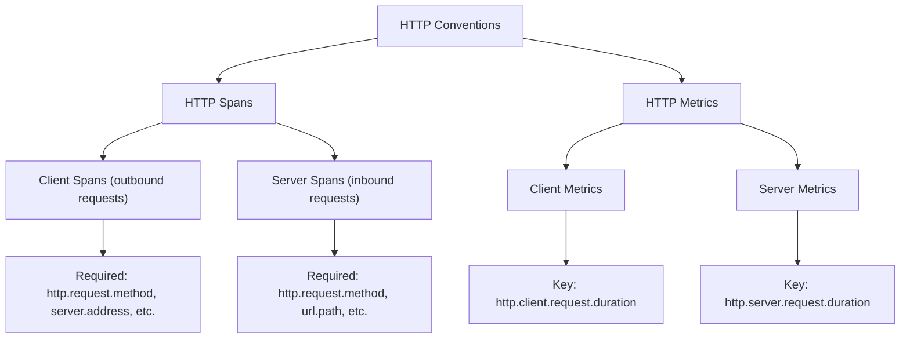

Sources: [docs/http/http-spans.md:1-10](docs/http/http-spans.md:1-10), [docs/http/http-metrics.md:1-10](docs/http/http-metrics.md:1-10)

## Stability Status

Most of the HTTP conventions are stable, with some specific attributes and metrics still in development. The core conventions for HTTP client and server spans, as well as the primary duration metrics, are considered stable and ready for production use.

Existing instrumentation libraries using older versions of HTTP conventions should follow the migration guidance in the documentation, which includes environment variable flags such as `OTEL_SEMCONV_STABILITY_OPT_IN` to control which convention version to emit.

Sources: [docs/http/http-spans.md:36-62](docs/http/http-spans.md:36-62), [docs/http/http-metrics.md:32-56](docs/http/http-metrics.md:32-56)

## HTTP Span Conventions

### Span Naming

HTTP spans follow the general span naming guidelines with specific rules for HTTP:

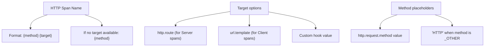

Sources: [docs/http/http-spans.md:63-81](docs/http/http-spans.md:63-81)

### Span Status

The status of HTTP spans depends on the HTTP status code and the span kind (client vs server):

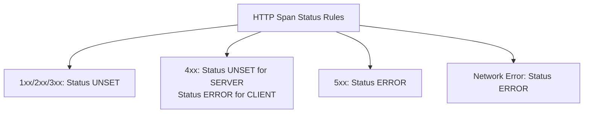

Sources: [docs/http/http-spans.md:82-114](docs/http/http-spans.md:82-114)

### HTTP Client Spans

HTTP client spans represent outbound HTTP requests. They follow these key rules:

1. Span kind must be `CLIENT`
2. Spans should be created for each attempt to send an HTTP request
3. For retries and redirects, follow the HTTP resend specification
4. Duration should include time from before sending the first byte until after the response headers are read

Key required attributes include:
- `http.request.method`
- `server.address`
- `server.port`
- `url.full`

Sources: [docs/http/http-spans.md:118-339](docs/http/http-spans.md:118-339)

### HTTP Server Spans

HTTP server spans represent inbound HTTP requests. They follow these key rules:

1. Span kind must be `SERVER`
2. Server span captures the processing of the HTTP request on the server side
3. Populating server address and port attributes follows specific rules to handle reverse proxies

Key required attributes include:
- `http.request.method`
- `url.path`
- `url.scheme`
- `http.route` (if available)

Sources: [docs/http/http-spans.md:371-637](docs/http/http-spans.md:371-637)

### HTTP Request Flow

This diagram shows how both client and server spans relate to the HTTP request/response cycle:

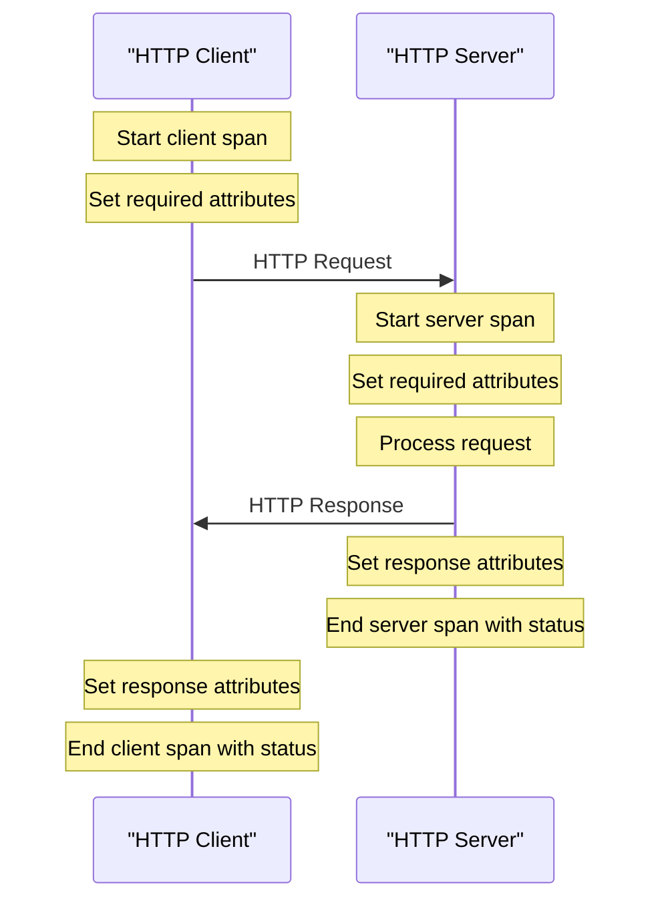

Sources: [docs/http/http-spans.md:635-740](docs/http/http-spans.md:635-740)

### HTTP Request Retries and Redirects

The HTTP conventions include specific handling for retries and redirects:

1. Each time an HTTP request is resent, increment the `http.request.resend_count` attribute
2. This applies to all types of resends including redirects, authorization challenges, and retries due to errors
3. Each attempt should be recorded as a separate span with appropriate attributes

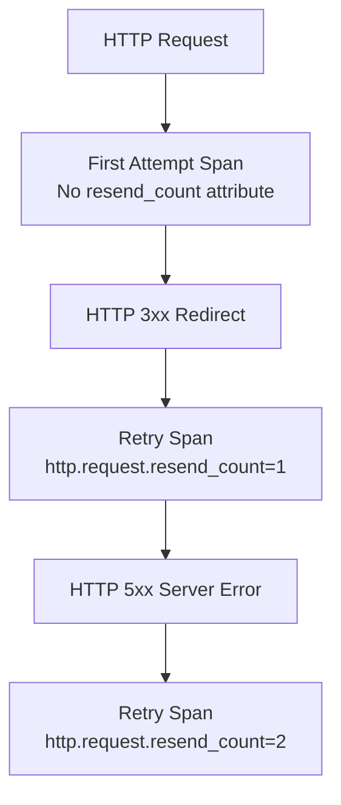

Sources: [docs/http/http-spans.md:357-370](docs/http/http-spans.md:357-370)

## HTTP Metric Conventions

HTTP metrics provide quantitative measurements of HTTP operations. There are metrics defined for both server and client sides.

### HTTP Server Metrics

The primary server-side metrics include:

1. `http.server.request.duration` (required): Histogram of HTTP server request durations in seconds
2. `http.server.active_requests` (optional): UpDownCounter of current active HTTP server requests
3. `http.server.request.body.size` (optional): Histogram of HTTP request body sizes in bytes
4. `http.server.response.body.size` (optional): Histogram of HTTP response body sizes in bytes

Required attributes for server metrics include:
- `http.request.method`
- `url.scheme`

Sources: [docs/http/http-metrics.md:58-503](docs/http/http-metrics.md:58-503)

### HTTP Client Metrics

The primary client-side metrics include:

1. `http.client.request.duration` (required): Histogram of HTTP client request durations in seconds
2. `http.client.request.body.size` (optional): Histogram of HTTP request body sizes in bytes
3. `http.client.response.body.size` (optional): Histogram of HTTP response body sizes in bytes
4. `http.client.open_connections` (optional): UpDownCounter of open HTTP connections
5. `http.client.connection.duration` (optional): Histogram of HTTP connection duration
6. `http.client.active_requests` (optional): UpDownCounter of active HTTP requests

Required attributes for client metrics include:
- `http.request.method`
- `server.address`
- `server.port`

Sources: [docs/http/http-metrics.md:505-715](docs/http/http-metrics.md:505-715)

### Metrics and Spans Relationship

When both spans and metrics are collected for the same HTTP operations, the duration metrics should match the corresponding span durations:

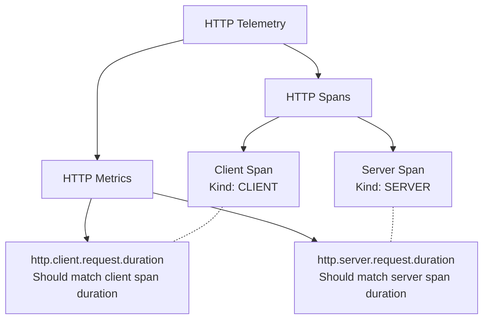

Sources: [docs/http/http-metrics.md:64-68](docs/http/http-metrics.md:64-68), [docs/http/http-metrics.md:511-516](docs/http/http-metrics.md:511-516)

## Attributes Overview

HTTP attributes provide context about HTTP operations. They are organized into common attributes and role-specific (client/server) attributes.

### Common Attributes

Both client and server spans share some common attributes:

- `http.request.method`: HTTP method (GET, POST, etc.)
- `http.response.status_code`: HTTP response status code
- `error.type`: Describes error class when applicable
- `network.protocol.name`: Protocol name (http, spdy, etc.)
- `network.protocol.version`: Protocol version (1.1, 2, etc.)

### Client-Specific Attributes

Client spans have specific attributes:

- `server.address`: Host identifier of the HTTP request target
- `server.port`: Port of the HTTP request target
- `url.full`: Absolute URL of the request
- `http.request.resend_count`: Count of request resend attempts

### Server-Specific Attributes

Server spans have specific attributes:

- `url.path`: URI path component
- `url.scheme`: URI scheme component
- `http.route`: Matched route template
- `client.address`: Client address (if available)

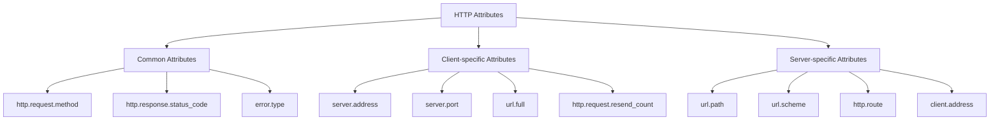

Sources: [docs/http/http-spans.md:148-170](docs/http/http-spans.md:148-170), [docs/http/http-spans.md:434-461](docs/http/http-spans.md:434-461)

## Special Considerations

### Setting Server Address and Port

For HTTP server spans, the `server.address` and `server.port` attributes should be populated using the best effort approach:

1. Use forwarded host information if available (from headers like `Forwarded` or `X-Forwarded-Host`)
2. Use the `:authority` pseudo-header for HTTP/2 or HTTP/3
3. Use the `Host` header as fallback

This approach helps correctly identify the original target server when requests go through proxies or load balancers.

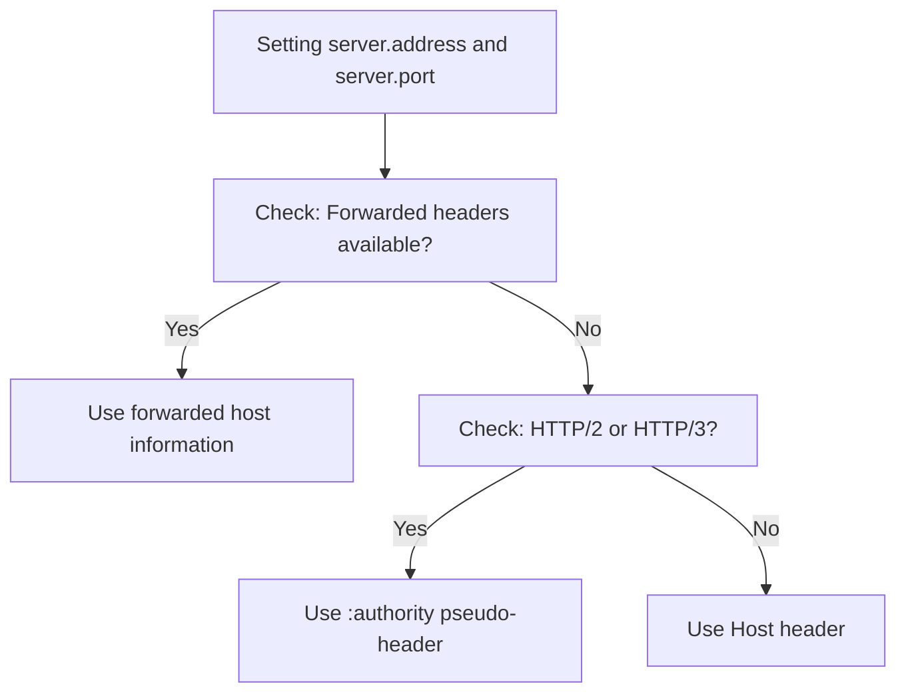

Sources: [docs/http/http-spans.md:387-400](docs/http/http-spans.md:387-400)

### Handling Sensitive Information

Several HTTP attributes may contain sensitive information that should be handled with care:

1. `url.full` must not contain credentials (usernames/passwords)
2. Query string values for security tokens should be redacted
3. Sensitive content in `url.path` and `url.query` should be scrubbed
4. HTTP headers should only be captured with explicit configuration

Sources: [docs/http/http-spans.md:192-215](docs/http/http-spans.md:192-215), [docs/http/http-spans.md:510-524](docs/http/http-spans.md:510-524)

## Schema Evolution

The HTTP conventions have evolved over time, with attribute renames to align with the semantic conventions design principles. Schema migration tools help handle these changes:

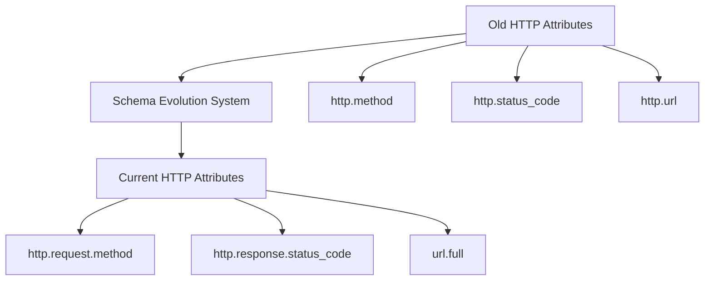

Sources: [schemas/1.21.0:1-53](schemas/1.21.0:1-53)

## Examples

### HTTP Client-Server Communication

This example shows a basic HTTP client-server interaction with spans:

```
Client Span:
  Name: "GET"
  Kind: CLIENT
  Attributes:
    http.request.method = "GET"
    server.address = "example.com"
    server.port = 443
    url.full = "https://example.com/users/123"
    http.response.status_code = 200

Server Span:
  Name: "GET /users/:id"
  Kind: SERVER
  Attributes:
    http.request.method = "GET"
    url.path = "/users/123"
    url.scheme = "https"
    http.route = "/users/:id"
    http.response.status_code = 200
```

### Error Handling Example

This example shows how errors are reflected in spans:

```
Client Span:
  Name: "GET"
  Kind: CLIENT
  Status: ERROR
  Attributes:
    http.request.method = "GET"
    server.address = "example.com"
    server.port = 443
    url.full = "https://example.com/users/999"
    http.response.status_code = 404
    error.type = "404"

Server Span:
  Name: "GET /users/:id"
  Kind: SERVER
  Status: UNSET
  Attributes:
    http.request.method = "GET"
    url.path = "/users/999"
    url.scheme = "https"
    http.route = "/users/:id"
    http.response.status_code = 404
```

### HTTP Client Retries Example

This example shows how retries are reflected in spans:

```
First Attempt Span:
  Name: "GET"
  Kind: CLIENT
  Status: ERROR
  Attributes:
    http.request.method = "GET"
    server.address = "example.com"
    server.port = 443
    url.full = "https://example.com/api/data"
    http.response.status_code = 503
    error.type = "503"

Retry Span:
  Name: "GET"
  Kind: CLIENT
  Status: UNSET
  Attributes:
    http.request.method = "GET"
    server.address = "example.com"
    server.port = 443
    url.full = "https://example.com/api/data"
    http.request.resend_count = 1
    http.response.status_code = 200
```

Sources: [docs/http/http-spans.md:637-740](docs/http/http-spans.md:637-740)

## Conclusion

HTTP Conventions form a critical part of the OpenTelemetry Semantic Conventions ecosystem. They provide standardized ways to instrument and collect telemetry from HTTP-based applications, enabling consistent observability across different implementations and environments.

By following these conventions, developers and operators can ensure that their HTTP telemetry is interoperable with OpenTelemetry tooling and can be effectively used for monitoring, troubleshooting, and analysis.