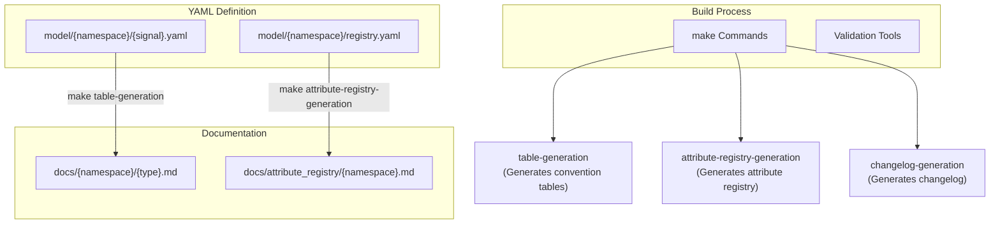
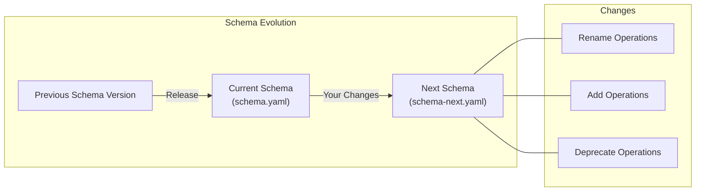
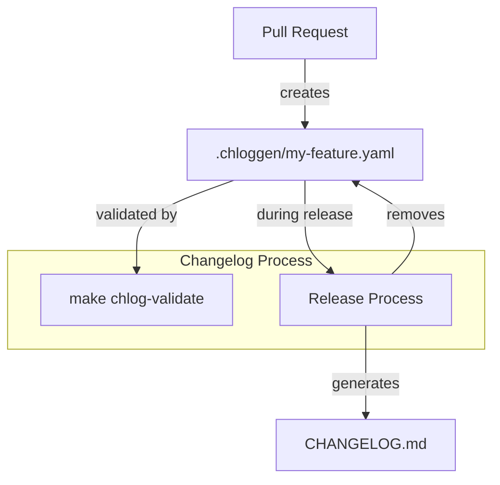
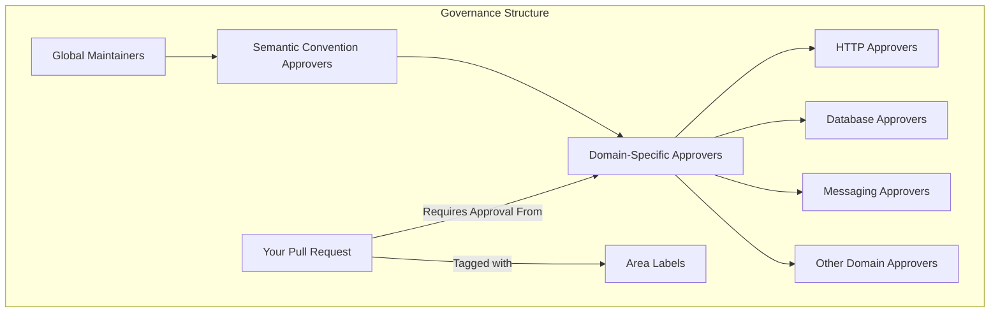

attributes:
  - id: process.pid
    type: int
    stability: development
    brief: >
      Process identifier (PID).
    examples: [1234]
  - id: process.executable.name
    type: string
    stability: development
    brief: >
      The name of the process executable.
    examples: ['otelcol']
```

Sources: [model/process/registry.yaml:1-78](), [CONTRIBUTING.md:124-166]()

### Semantic Convention Groups

To define semantic conventions for telemetry signals (spans, metrics, events), you need to create or modify the appropriate YAML file. Here's an example for CLI spans:

```yaml
# Example from model/cli/spans.yaml
groups:
  - id: span.cli.internal
    type: span
    span_kind: internal
    stability: development
    brief: >
      This span describes CLI program execution from a callee perspective.
    extends: attributes.cli.common
```

Sources: [model/cli/spans.yaml:21-34]()

## 2. Updating Documentation

After modifying the YAML files, you need to update the corresponding markdown documentation files. Much of this is automated using the `make table-generation` command.

### For Existing Tables

For existing tables, run:

```bash
make table-generation attribute-registry-generation
```

### For New Telemetry Signal Groups

For new telemetry signals, add this comment block in the relevant markdown file:

```markdown
<!-- semconv new-group-id -->
<!-- endsemconv -->
```

Then run:

```bash
make table-generation attribute-registry-generation
```

### Documentation Structure

The relationship between YAML models and documentation is illustrated in the following diagram:



Sources: [CONTRIBUTING.md:183-224]()

## 3. Handling Schema Changes

When modifying existing semantic conventions, you must also update schema files to ensure backward compatibility.

### Schema-Next Updates

Changes to existing conventions should be added to the `schema-next.yaml` file, which tracks changes that will be included in the next schema version.



### Renaming Attributes

When renaming attributes, the change must be documented in the schema file with the old and new names:

```yaml
# Example of renaming in schema
attribute_map:
  old.name: new.name
```

Sources: [CONTRIBUTING.md:167-182]()

## 4. Validation and Checks

Before submitting your changes, you need to validate them to ensure they meet the repository's quality standards.

### Policy Validation

Semantic conventions are validated for name formatting and backward compatibility. Run:

```bash
make check-policies
```

### Pre-Commit Checks

Run the full suite of automated checks:

```bash
make check
```

This includes:
- Markdown style checks
- Spelling checks
- Link validation
- YAML linting

Sources: [CONTRIBUTING.md:225-245](), [CONTRIBUTING.md:319-371]()

## 5. Adding Changelog Entries

For user-facing changes, you need to add a changelog entry to document the modification.

### When to Add a Changelog Entry

Changelog entries are required for:
- Modifications to existing conventions
- New semantic conventions
- Changes to definitions or normative language

### Creating a Changelog Entry

1. Create an entry file:
   ```bash
   make chlog-new
   ```
2. Fill in all fields in the generated YAML file
3. Validate the entry:
   ```bash
   make chlog-validate
   ```

The relationship between changelog entries and the final CHANGELOG.md is shown here:



Sources: [CONTRIBUTING.md:246-297]()

## 6. Getting Your PR Merged

For a pull request to be considered ready to merge, it must:

1. Receive at least two approvals from code owners (from different companies)
2. Have no "request changes" from code owners
3. Have no open discussions
4. Have been open for at least two working days since the last modification (for non-trivial changes)

The governance model ensures that semantic conventions are properly reviewed by domain experts:



Sources: [CONTRIBUTING.md:298-318](), [README.md:19-46]()

## Best Practices

### Namespacing and Naming

- Follow standard naming conventions (see [Working with YAML Models](#4.2))
- Choose attribute names that are precise and descriptive
- Use appropriate namespaces to group related attributes

### Documentation

- Provide clear, concise descriptions for each attribute
- Include examples that show typical values
- Specify the stability level (stable, development)
- Indicate requirement levels (required, recommended, optional)

### Reuse and Consistency

- Reuse existing attributes where appropriate
- Maintain consistent naming patterns within a domain
- Reference existing common attributes rather than creating duplicates

## Example Workflow

This section provides a real-world example of adding a new semantic convention:

1. Identify need for a new convention for CLI programs
2. Create YAML model in `model/cli/spans.yaml`
3. Define common attributes and specific span types
4. Create documentation in `docs/cli/cli-spans.md`
5. Run validation and generation tools
6. Add changelog entry
7. Submit pull request

Sources: [model/cli/spans.yaml:1-49](), [docs/cli/cli-spans.md:1-142]()

## Handling Deprecated Conventions

When a convention needs to be deprecated rather than removed:

1. Move the attribute definition to `/model/{root-namespace}/deprecated/registry-deprecated.yaml`
2. Add a `deprecated` field specifying the reason and, if applicable, what replaces it
3. Update the schema files to record the deprecation

Example of a deprecated attribute:

```yaml