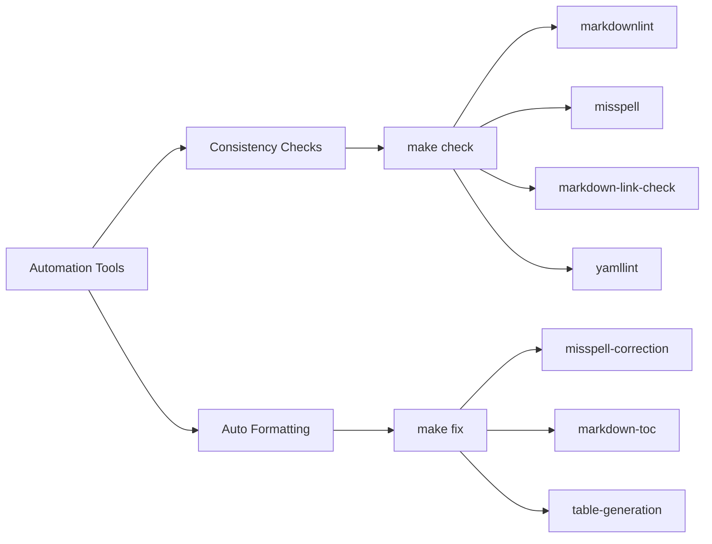

make table-generation attribute-registry-generation
```

For new telemetry signals, you'll need to add a markdown section with special tags:

```markdown
<!-- semconv new-group-id -->
<!-- endsemconv -->
```

### Hugo Frontmatter

New markdown files should include Hugo frontmatter at the top:

```markdown
<!--- Hugo front matter used to generate the website version of this page:
linkTitle: HTTP
path_base_for_github_subdir:
  from: content/en/docs/specs/semconv/http/_index.md
  to: http/README.md
--->
```

Sources: [CONTRIBUTING.md:183-224]()

## 3. Check New Conventions

Semantic conventions are validated for:

- Name formatting
- Backward compatibility
- Policy compliance

Run the following command to check all policies:

```bash
make check-policies
```

Sources: [CONTRIBUTING.md:225-237]()

## 4. Verify Changes

Before submitting a pull request, verify your changes with:

```bash
make check
```

This runs all validation checks, including:
- Markdown linting
- Spell checking
- Link checking
- YAML linting
- Table generation verification
- Schema verification
- Policy checking

Sources: [CONTRIBUTING.md:238-248]()

## 5. Changelog Management

### When to Add a Changelog Entry

Add a changelog entry for user-facing changes that affect:

1. Data consumers (alerts, dashboards, queries)
2. Instrumentation developers (library authors)
3. Observability backend systems

| Requires Changelog | No Changelog Required |
|---|---|
| Modifying existing conventions | Documentation/editorial updates |
| Adding new conventions | Internal tooling changes |
| Changing definitions or normative language | Refactorings with no behavior change |
| | Chores (enabling linters, updating dependencies) |

### Adding a Changelog Entry

Generate a new changelog entry:

```bash
make chlog-new
```

Fill in the required fields in the generated file and ensure it's valid:

```bash
make chlog-validate
```

Sources: [CONTRIBUTING.md:249-298]()

## 6. Getting Your PR Merged

A pull request is considered ready to merge when:

- It has received at least two approvals from code owners (from different companies)
- There are no "request changes" from code owners
- There are no open discussions
- It has been at least two working days since the last non-trivial modification
- All checks pass

Sources: [CONTRIBUTING.md:299-318]()

## Automation Tools

The repository provides several automation tools to assist contributors:



### Consistency Checks

Run all checks with:

```bash
make check
```

Individual checks can be run separately:

```bash
make markdownlint       # Check markdown style
make misspell           # Check for typos
make markdown-link-check # Check validity of links
make yamllint           # Check YAML syntax
```

### Auto Formatting

Fix formatting issues automatically:

```bash
make fix
```

Individual fixes can be run separately:

```bash
make misspell-correction # Fix typos
make markdown-toc        # Update tables of content
make table-generation    # Update markdown tables
```

Sources: [CONTRIBUTING.md:319-436]()

## Special Guidelines

### Which Semantic Conventions Belong in This Repo

This repository contains semantic conventions supported by the OpenTelemetry ecosystem. Instrumentations hosted in OpenTelemetry should contribute their semantic conventions to this repo, with limited exceptions for those following external schemas not fully compatible with OpenTelemetry.

### Suggesting Conventions for a New Area

Defining new semantic conventions requires:
- A group familiar with the domain
- Involvement with instrumentation efforts
- Commitment to be the point of contact for PRs, issues, and questions

Follow the project management guidelines and refer to the "How to define new conventions" document for guidance.

### Merging Existing ECS Conventions

When adding a semantic convention that exists in the Elastic Common Schema (ECS):

- Prefer using the existing ECS name when possible
- Do not use an existing ECS name as a namespace
- If proposing a different name, provide usage data or evidence supporting the alternative

Sources: [CONTRIBUTING.md:67-453]()

## Conclusion

Contributing to the OpenTelemetry Semantic Conventions repository follows a structured process designed to maintain quality and consistency across all conventions. By following this guide, you'll be able to effectively contribute to the project and help build the standardized telemetry framework that powers observability across the industry.

Sources: [CONTRIBUTING.md:1-458](), [README.md:1-47]()