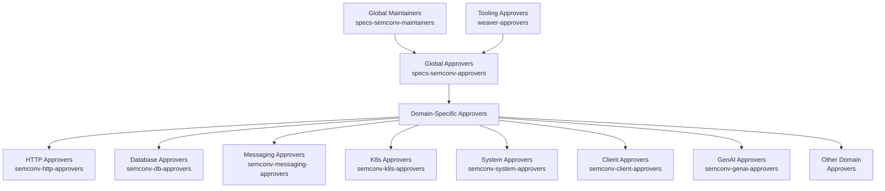
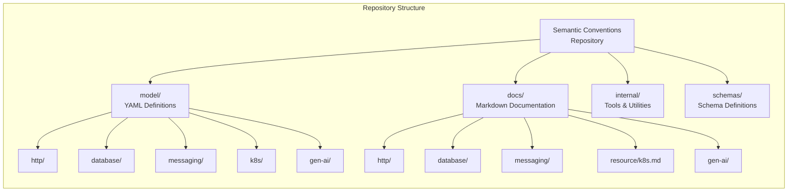
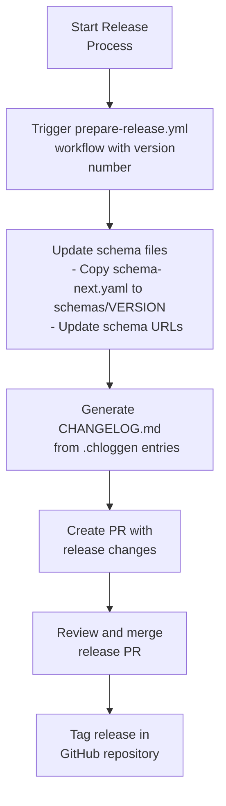

This document describes the governance structure for the OpenTelemetry Semantic Conventions repository. It explains the roles and responsibilities of different governance entities, how contributions are reviewed and approved, and how different components of the codebase are maintained. For information about contributing changes to semantic conventions, see [Contributing Guide](#4).

## Governance Structure

The OpenTelemetry Semantic Conventions repository follows a domain-based governance model where different areas of the codebase are managed by specialized teams with domain expertise.



Sources: [.github/CODEOWNERS:1-115]()

### Governance Roles and Responsibilities

| Role | Description | Responsibilities |
|------|-------------|------------------|
| Global Maintainers | Highest level of governance | Overall repository maintenance, strategic direction |
| Global Approvers | Responsible for the entire repository | Review and approve changes that affect the overall architecture |
| Domain-Specific Approvers | Experts in specific domains | Review and approve changes in their domain of expertise |
| Tooling Approvers | Experts in tooling | Review and approve changes to build system, validation tools |

Sources: [.github/CODEOWNERS:16-16](), [.github/CODEOWNERS:1-15]()

## Domain Organization

The semantic conventions are organized into domains, with each domain having its own set of conventions and dedicated approvers. The CODEOWNERS file maps specific directories and files to the appropriate approver groups.



Sources: [.github/CODEOWNERS:18-140]()

### Domain-Specific Approvers

Domain-specific approvers are responsible for reviewing and approving changes to their respective domains. The repository currently has approver groups for over 30 domains, including:

- HTTP semantic conventions
- Database semantic conventions
- Messaging semantic conventions
- Kubernetes semantic conventions
- System and process conventions
- Client-side conventions
- Cloud provider conventions
- Runtime-specific conventions (JVM, dotnet, etc.)
- Security conventions
- GenAI conventions

Each domain has corresponding directories in both the `model/` and `docs/` folders, which are defined in the CODEOWNERS file.

Sources: [.github/CODEOWNERS:22-140]()

## Contribution Process

The contribution process involves creating issues or pull requests, which are then reviewed by the appropriate approvers based on the areas being modified.

```mermaid
sequenceDiagram
    actor Contributor
    participant Issue as GitHub Issue
    participant PR as Pull Request
    participant CI as CI/CD Workflows
    participant Approvers as Domain Approvers
    participant Global as Global Approvers
    participant Main as Main Branch

    Contributor->>Issue: Create issue with area label
    Note over Issue: Automatically labeled with<br>domain-specific areas

    Contributor->>PR: Create PR referencing issue
    PR->>CI: Trigger CI workflows

    CI->>PR: Run validation checks
    Note over CI: Markdown lint, YAML lint,<br>schema check, policy check,<br>changelog validation

    alt CI Checks Fail
        CI->>Contributor: Report failures
        Contributor->>PR: Fix issues
    end

    PR->>Approvers: Require domain-specific approvals
    Note over Approvers: Based on CODEOWNERS file

    Approvers->>PR: Review and approve changes
    PR->>Global: Require global approver review

    Global->>PR: Review and approve changes
    PR->>Main: Merge changes

    classDef default font-family:sans-serif;
```

Sources: [.github/workflows/checks.yml:1-127](), [.github/workflows/changelog.yml:1-82](), [.github/CODEOWNERS:1-140](), [.github/ISSUE_TEMPLATE/bug_report.yaml:1-110](), [.github/ISSUE_TEMPLATE/change_proposal.yaml:1-101](), [.github/ISSUE_TEMPLATE/new-conventions.yaml:1-28](), [.github/PULL_REQUEST_TEMPLATE.md:1-15]()

### Issue Creation

When creating an issue, contributors specify the areas their change affects using labels. The repository has a comprehensive set of area labels derived from the domain organization.

For new semantic conventions, the process is more involved:

1. Create an issue using the "Propose new semantic conventions" template
2. Identify domain experts who are familiar with the area
3. Form a group of people committed to maintaining the new conventions

Sources: [.github/ISSUE_TEMPLATE/new-conventions.yaml:1-28](), [.github/ISSUE_TEMPLATE/change_proposal.yaml:1-101](), [.github/ISSUE_TEMPLATE/bug_report.yaml:1-110]()

### Pull Request Review Process

Pull requests are automatically routed to the appropriate approvers based on the CODEOWNERS file. Changes must be approved by:

1. Domain-specific approvers for each area affected by the changes
2. Global semantic convention approvers

The repository also enforces various checks through CI/CD workflows:

- Markdown linting
- YAML linting
- Link checking
- Spell checking
- Semantic convention table validation
- Schema validation
- Policy checks

Sources: [.github/workflows/checks.yml:1-127](), [.github/CODEOWNERS:1-140](), [.github/PULL_REQUEST_TEMPLATE.md:1-15]()

### Changelog Management

The repository uses a structured changelog management system:

1. Contributors add a `.yaml` file to the `.chloggen/` directory for each change
2. Each changelog entry specifies the change type, component, and description
3. CI workflows validate these entries
4. During release, the entries are compiled into the main CHANGELOG.md

Sources: [.github/workflows/changelog.yml:1-82](), [.chloggen/config.yaml:1-28](), [.chloggen/TEMPLATE.yaml:1-23](), [.chloggen/CHANGELOG.tmpl:1-72]()

## Stale PR Management

The repository automatically manages stale pull requests:

1. PRs that have no activity for 15 days are marked as stale
2. If no activity occurs within 7 days after being marked stale, the PR is closed
3. PRs with certain labels (bug, work in progress, experts needed, never stale) are exempt
4. Draft PRs are also exempt from the stale PR process

Sources: [.github/workflows/stale-pr.yml:1-23]()

## Release Process

The release process involves creating a new version of the semantic conventions:



Sources: [.github/workflows/prepare-release.yml:1-61]()

## Automatic Issue and PR Management

The repository includes automation for issue and PR management:

1. New issues are automatically labeled based on areas mentioned
2. New PRs with changelog entries are automatically validated
3. Area labels are automatically generated from the repository structure
4. Links to the OpenTelemetry specification are automatically updated

Sources: [.github/workflows/prepare-new-issue.yml:1-20](), [.github/workflows/prepare-new-pr.yml:1-34](), [.github/workflows/generate-registry-area-labels.yml:1-27](), [.github/workflows/auto-update-spec-repo-links.yml:1-81](), [internal/tools/scripts/generate-registry-area-labels.sh:1-32]()

## Dependencies Management

The repository uses Renovate to automatically update dependencies:

1. Patch updates are grouped together and run on weekdays
2. Minor and major updates are consolidated to run on Mondays
3. All dependency PRs are labeled with "dependencies"
4. PRs with "dependencies" label are exempt from changelog requirements

Sources: [.github/renovate.json5:1-30](), [.github/workflows/changelog.yml:19-27]()

## Summary

The OpenTelemetry Semantic Conventions repository follows a domain-based governance model with specialized teams of experts. This ensures that changes to semantic conventions are reviewed by people with deep knowledge of the specific domains. The governance model is supported by extensive automation through GitHub workflows, ensuring consistency and quality of contributions.