This page documents the OpenTelemetry Semantic Conventions for messaging systems. These conventions standardize how to collect and represent telemetry data from messaging technologies like Apache Kafka, RabbitMQ, Azure Service Bus, and others. The conventions define consistent attributes, naming patterns, and relationships for spans, metrics, and other telemetry signals.

For metrics-specific conventions related to messaging, see [Messaging Metrics Conventions](#3.4).

## Key Messaging Concepts

Understanding messaging systems in OpenTelemetry requires familiarity with several foundational concepts.

### Diagram: Core Messaging Components

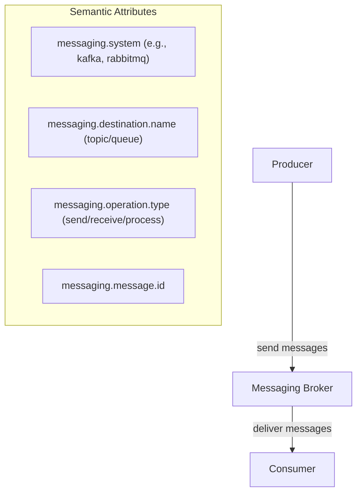

Sources: [docs/messaging/messaging-spans.md:70-169]()

### Message

A message is an envelope with a potentially empty body that may convey additional metadata, typically in key/value form. Messages are sent by producers to destinations via brokers, which handle delivery, re-delivery, and persistence.

### Producer and Consumer

The producer creates and sends messages to a messaging destination. "Sending" is the process of transmitting a message or batch of messages to an intermediary or consumer.

The consumer receives, processes, and settles a message:
- "Receiving" obtains a message from the intermediary
- "Processing" acts on the information in a message
- "Settling" notifies the intermediary that a message was processed successfully

### Destinations and Message Consumption

A destination represents the entity within a messaging system where messages are sent to and consumed from. Destinations are usually identified by unique names within the messaging system instance, such as a URL or simple identifier. Examples include Kafka topics, RabbitMQ queues, and topics.

Message consumption can happen in multiple steps, and often frameworks hide the lower-level receiving details, only exposing handlers for processing messages. Consumers can be organized into:

- **Consumer groups**: Provide logical grouping for message consumers, used to load balance message consumption or manage offsets independently
- **Subscriptions**: Entities that allow multiple consumers to receive messages from topics following subscription-specific consumption behaviors

## Context Propagation in Messaging Systems

Context propagation is crucial for correlating producers with consumers across different components and layers.

### Diagram: Context Propagation Flow

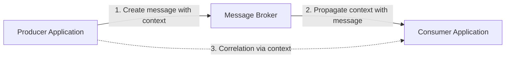

Sources: [docs/messaging/messaging-spans.md:156-190]()

To correlate producers with consumers, all components must propagate context throughout the message lifecycle:

1. Producers should attach a **message creation context** to each message
2. This context allows direct correlation between producers and consumers
3. The creation context should be propagated in a way that can't be altered by intermediaries

This approach enables tracing message flows regardless of the underlying messaging transport mechanism.

## Span Conventions

### Span Naming

Messaging spans should follow the format: `{messaging.operation.name} {destination}`

For example:
- `publish shop.orders`
- `send shop.orders`
- `process topic with spaces`
- `ack print_jobs`

The `{destination}` should be derived from one of the following (in order of preference):
1. `messaging.destination.template` (if available)
2. `messaging.destination.name` (when the destination is neither temporary nor anonymous)
3. `server.address:server.port` (only for operations not targeting specific destinations)

Sources: [docs/messaging/messaging-spans.md:192-222]()

### Operation Types and Span Kinds

The following operation types are defined for messaging systems:

| Operation type | Description | Span kind |
|----------------|-------------|-----------|
| `create` | A message is created or passed to a client library for sending | `PRODUCER` |
| `send` | One or more messages are provided for sending to an intermediary | `PRODUCER` or `CLIENT` |
| `receive` | One or more messages are requested by a consumer (pull-based) | `CLIENT` |
| `process` | One or more messages are processed by a consumer | `CONSUMER` |
| `settle` | One or more messages are settled | `CLIENT` |

Sources: [docs/messaging/messaging-spans.md:224-246]()

### Diagram: Typical Trace Structure

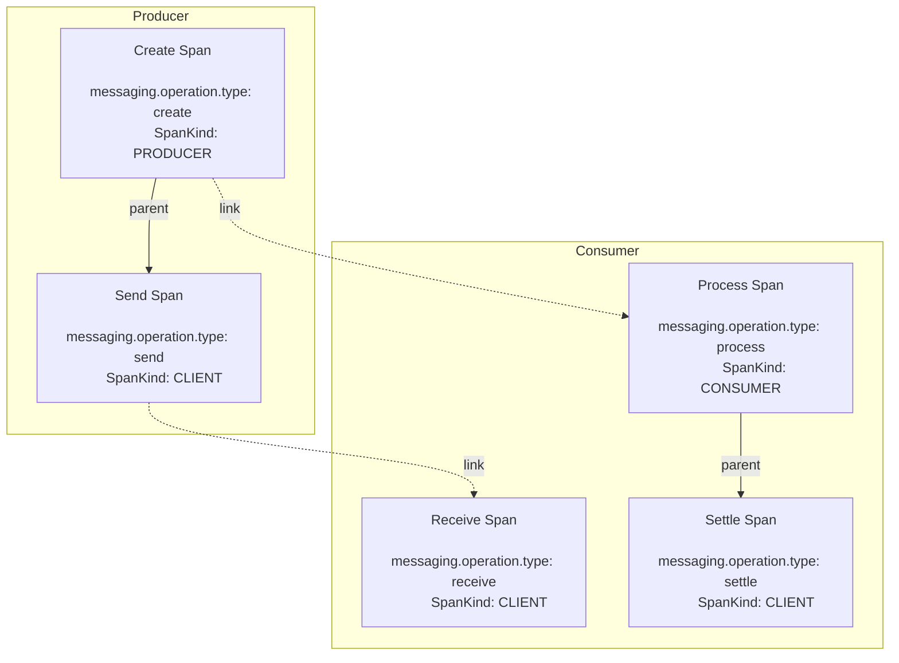

Sources: [docs/messaging/messaging-spans.md:257-343]()

### Producer Spans

"Create" spans should be created for individual messages, while "Send" spans can account for a single message or multiple messages in a batch.

When a message is created:
- If a custom creation context is provided, it should not be modified
- Otherwise, if a "Create" span exists, its context should be injected into the message
- If neither exists, the "Send" span context should be injected

The "Send" span should always link to the creation context injected into the message.

### Consumer Spans

"Receive" spans should be created for pull-based scenarios where applications explicitly request messages. "Process" spans should be created for push-based scenarios where handlers process incoming messages.

A single "Process" or "Receive" span can account for a single message, a batch of messages, or no messages. For each message it accounts for, the span should link to the message's creation context.

**Important**: OpenTelemetry uses span links as the default mechanism to correlate producers and consumers because:
- It's the only consistent trace structure possible across different messaging systems
- It's the only option for batch scenarios (a span can only have a single parent)
- It works when message consumption happens in another ambient context (e.g., HTTP server)

## Messaging Attributes

Messaging attributes are organized into several namespaces:

| Namespace | Purpose |
|-----------|---------|
| `messaging.message` | Describes individual messages |
| `messaging.destination` | Describes logical entities where messages are sent |
| `messaging.batch` | Describes batch operations |
| `messaging.consumer` | Describes consumer application instances |
| `messaging.{system}` | System-specific attributes |

Sources: [docs/messaging/messaging-spans.md:358-516]()

### Core Messaging Attributes

The most important attributes include:

| Attribute | Description | Requirement Level |
|-----------|-------------|------------------|
| `messaging.system` | The messaging system (e.g., "kafka", "rabbitmq") | Required |
| `messaging.operation.name` | System-specific operation name | Required |
| `messaging.destination.name` | The message destination name | Conditionally Required |
| `messaging.operation.type` | Type of messaging operation | Conditionally Required |
| `messaging.message.id` | Message identifier | Recommended |
| `messaging.consumer.group.name` | Consumer group name | Conditionally Required |
| `server.address` | Server domain name/IP address | Conditionally Required |

### Recording Batch Attributes

For batch operations, if attribute values are the same for all messages, set the attribute on the span representing the batch. If values vary, set attributes on links describing individual messages.

## Technology-Specific Conventions

OpenTelemetry provides specialized conventions for many messaging technologies.

### Diagram: Apache Kafka Instrumentation

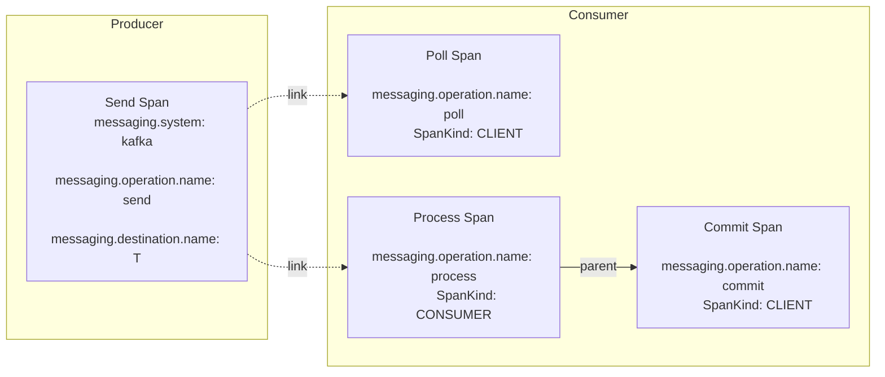

Sources: [docs/messaging/kafka.md:162-211]()

### Kafka-Specific Attributes

Apache Kafka adds several specific attributes:

| Attribute | Description | Requirement Level |
|-----------|-------------|------------------|
| `messaging.kafka.message.key` | Message key for grouping alike messages | Recommended |
| `messaging.kafka.offset` | Offset of a record in the partition | Recommended |
| `messaging.kafka.message.tombstone` | Boolean indicating if message is a tombstone | Conditionally Required |
| `messaging.consumer.group.name` | Kafka consumer group id | Recommended |
| `messaging.destination.partition.id` | String representation of the partition id | Recommended |

Similarly, there are specialized attributes for:
- RabbitMQ (routing keys, delivery tags)
- Apache RocketMQ (message types, keys, tags)
- Google Cloud Pub/Sub (ordering keys, delivery attempts)
- Azure Event Hubs (partitions, enqueued time)
- Azure Service Bus (subscription names, delivery counts)

Sources: [docs/messaging/kafka.md:42-136](), [docs/messaging/rabbitmq.md:42-142](), [docs/messaging/rocketmq.md:42-172](), [docs/messaging/gcp-pubsub.md:42-145](), [docs/messaging/azure-messaging.md:42-272]()

## Common Messaging Scenarios

OpenTelemetry defines conventions for several common messaging patterns.

### Diagram: Topic with Multiple Consumers

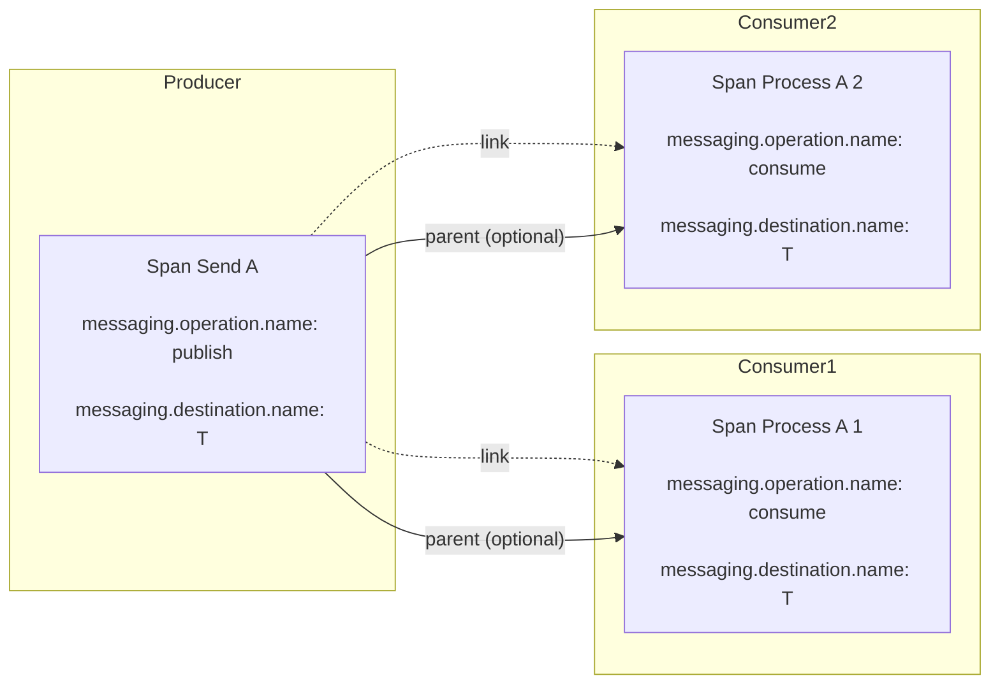

Sources: [docs/messaging/messaging-spans.md:545-586]()

### Diagram: Batch Publishing with Create Spans

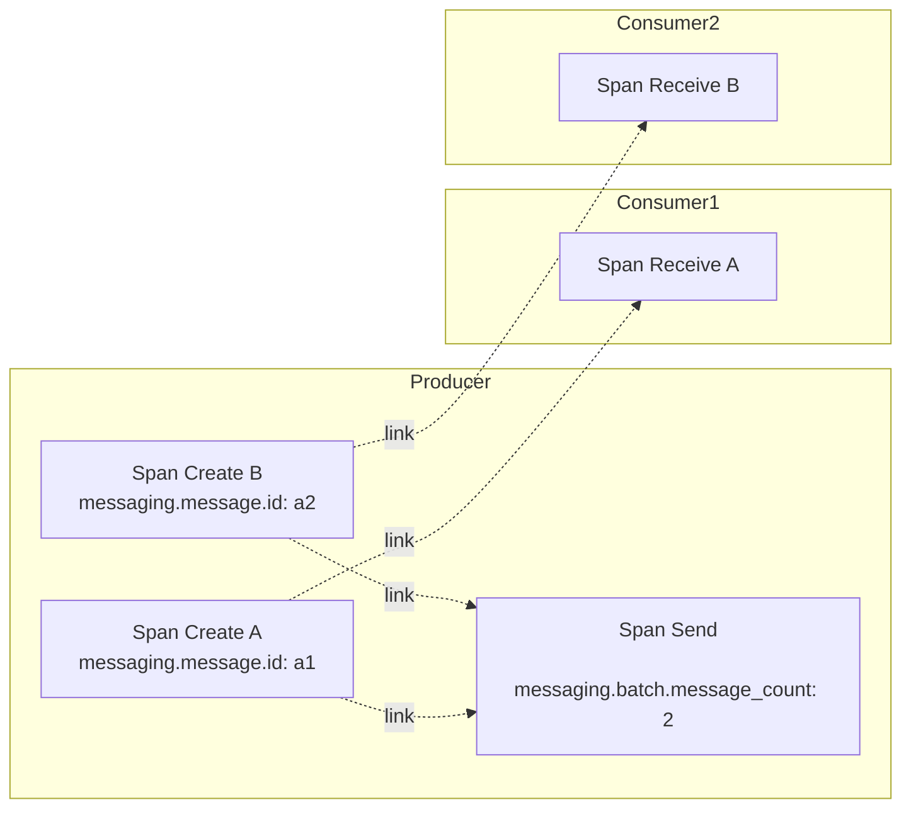

Sources: [docs/messaging/messaging-spans.md:626-664]()

### Batch Receiving

When a consumer receives multiple messages in a batch, the consumer span should link to the creation context of each message included in the batch.

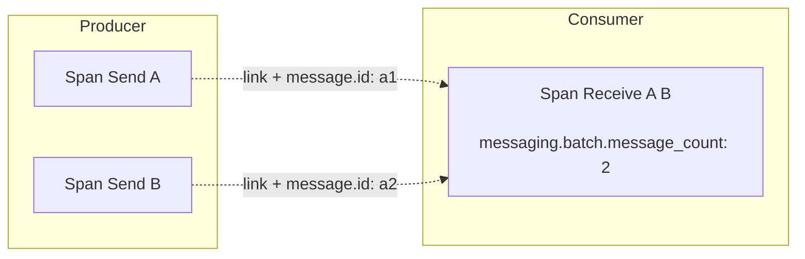

Sources: [docs/messaging/messaging-spans.md:586-624]()

## Metrics for Messaging Systems

OpenTelemetry defines several metrics for monitoring messaging systems performance.

### Common Metrics

- `messaging.client.operation.duration`: Duration of messaging operations (histogram)

### Producer Metrics

- `messaging.client.sent.messages`: Number of messages producers attempted to send (counter)

### Consumer Metrics

- `messaging.client.consumed.messages`: Number of messages delivered to the application (counter)
- `messaging.process.duration`: Duration of message processing operations (histogram)

For each metric, relevant attributes from the span conventions are used to provide dimensionality.

Sources: [docs/messaging/messaging-metrics.md:49-387]()

## Conclusion

The OpenTelemetry Messaging Conventions provide a comprehensive framework for instrumenting messaging systems, enabling correlation between producers and consumers while supporting various messaging patterns and technologies. By following these conventions, observability tools can provide insights into messaging operations, helping to diagnose issues and understand system behavior.

These conventions are particularly important for asynchronous systems where request flows span multiple services and components, connected through messaging infrastructure.

Sources: [docs/messaging/README.md:1-56](), [docs/messaging/messaging-spans.md:1-72]()

# System Metrics Conventions

## Purpose and Scope

This document describes the semantic conventions for system-level metrics in OpenTelemetry. These conventions define standardized instruments and attributes for monitoring host-level components including CPU, memory, disk, network, and other system resources. For runtime-specific metrics, such as JVM or Node.js metrics, see [Runtime Metrics Conventions](#3.7).

The system metrics namespace (`system.*`) is exclusively used for reporting metrics collected from the host system (physical servers, virtual machines, etc.). Metrics collected from technology-specific APIs (e.g., Kubernetes or container runtimes) should be reported under their respective namespaces (e.g., `k8s.*`, `container.*`).

Sources: [docs/system/system-metrics.md:1-19]()

## System Metrics Architecture

### System Metrics in the OpenTelemetry Ecosystem

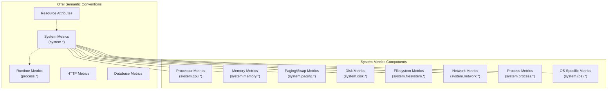

Sources: [docs/system/system-metrics.md:20-61]()

### System Metrics Data Flow and Components

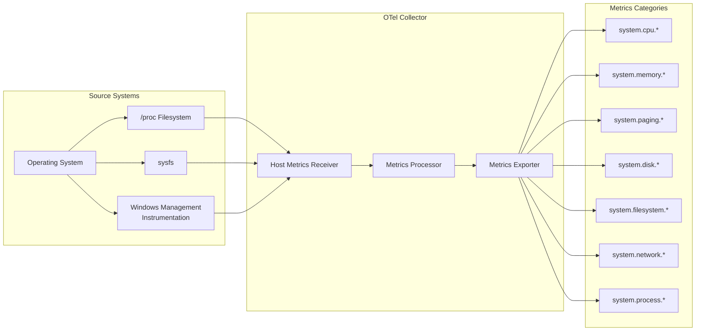

Sources: [docs/system/system-metrics.md:20-61]()

## General Metrics

System metrics include general-purpose metrics that apply to most systems.

### System Uptime

The `system.uptime` metric represents the time the system has been running in seconds. It is implemented as a gauge with type `double` for high precision.

| Name | Instrument Type | Unit | Description | Stability |
|------|----------------|------|-------------|-----------|
| `system.uptime` | Gauge | s | The time the system has been running | Development |

Sources: [docs/system/system-metrics.md:73-95]()

## Processor Metrics

Processor metrics capture system-level CPU resource usage under the namespace `system.cpu`.

### CPU Count Metrics

The system captures both physical and logical CPU counts:

| Name | Instrument Type | Unit | Description | Stability |
|------|----------------|------|-------------|-----------|
| `system.cpu.physical.count` | UpDownCounter | {cpu} | Number of physical processor cores | Development |
| `system.cpu.logical.count` | UpDownCounter | {cpu} | Number of logical processor cores | Development |

Logical count is calculated by multiplying the number of sockets, cores per socket, and threads per core. Physical count is the number of sockets multiplied by cores per socket.

Sources: [docs/system/system-metrics.md:98-143]()

## Memory Metrics

Memory metrics capture system-level memory usage under the namespace `system.memory`. This excludes paging/swap memory metrics.

### Memory Usage Metrics

| Name | Instrument Type | Unit | Description | Stability |
|------|----------------|------|-------------|-----------|
| `system.memory.usage` | UpDownCounter | By | Memory in use by state | Development |
| `system.memory.limit` | UpDownCounter | By | Total memory available | Development |
| `system.memory.shared` | UpDownCounter | By | Shared memory used | Development |
| `system.memory.utilization` | Gauge | 1 | Memory utilization | Development |

The `system.memory.usage` metric uses the `system.memory.state` attribute with values like `free`, `used`, `cached`, and `buffers` to distinguish different memory states. The sum of all states should equal the total memory available (`system.memory.limit`).

Sources: [docs/system/system-metrics.md:146-267]()

## Paging/Swap Metrics

Paging/swap metrics capture system-level virtual memory usage under the namespace `system.paging`.

| Name | Instrument Type | Unit | Description | Stability |
|------|----------------|------|-------------|-----------|
| `system.paging.usage` | UpDownCounter | By | Unix swap or Windows pagefile usage | Development |
| `system.paging.utilization` | Gauge | 1 | Paging utilization as a fraction | Development |
| `system.paging.faults` | Counter | {fault} | Number of page faults | Development |
| `system.paging.operations` | Counter | {operation} | Count of paging operations | Development |

These metrics use attributes like:
- `system.device`: Identifies the device managing paging operations
- `system.paging.state`: Indicates memory state (`free`, `used`)
- `system.paging.type`: Indicates page fault type (`major`, `minor`)
- `system.paging.direction`: Indicates operation direction (`in`, `out`)

Sources: [docs/system/system-metrics.md:269-415]()

## Disk Controller Metrics

Disk metrics capture system-level disk performance under the namespace `system.disk`.

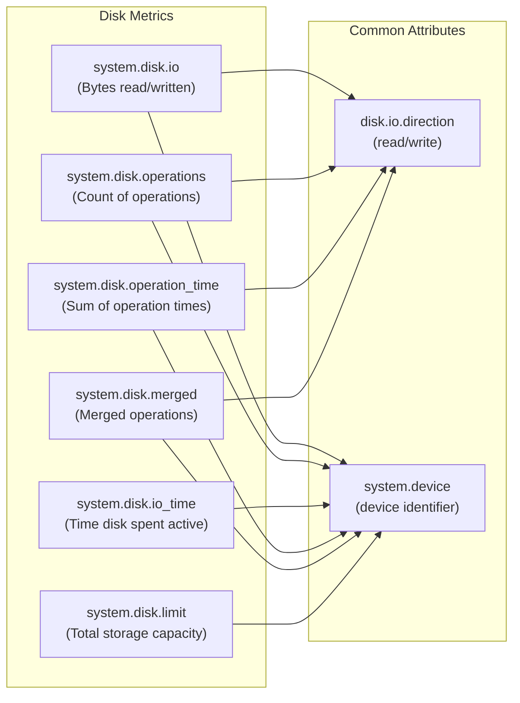

Disk metrics include:

| Name | Instrument Type | Unit | Description | Stability |
|------|----------------|------|-------------|-----------|
| `system.disk.io` | Counter | By | Bytes read or written | Development |
| `system.disk.operations` | Counter | {operation} | Count of read/write operations | Development |
| `system.disk.io_time` | Counter | s | Time disk spent activated | Development |
| `system.disk.operation_time` | Counter | s | Sum of time each operation took | Development |
| `system.disk.merged` | Counter | {operation} | Count of merged operations | Development |
| `system.disk.limit` | UpDownCounter | By | Total storage capacity | Development |

Sources: [docs/system/system-metrics.md:417-615]()

## Filesystem Metrics

Filesystem metrics capture system-level filesystem usage under the namespace `system.filesystem`.

| Name | Instrument Type | Unit | Description | Stability |
|------|----------------|------|-------------|-----------|
| `system.filesystem.usage` | UpDownCounter | By | Filesystem space usage | Development |
| `system.filesystem.utilization` | Gauge | 1 | Filesystem utilization as fraction | Development |
| `system.filesystem.limit` | UpDownCounter | By | Total storage capacity | Development |

Filesystem metrics use several attributes:
- `system.device`: Device identifier
- `system.filesystem.mountpoint`: Mount path
- `system.filesystem.type`: Type of filesystem (`ext4`, `ntfs`, etc.)
- `system.filesystem.state`: Usage state (`free`, `used`, `reserved`)
- `system.filesystem.mode`: Filesystem mode (`rw`, `ro`)

Sources: [docs/system/system-metrics.md:617-739]()

## Network Metrics

Network metrics capture system-level network performance under the namespace `system.network`.

| Name | Instrument Type | Unit | Description | Stability |
|------|----------------|------|-------------|-----------|
| `system.network.dropped` | Counter | {packet} | Count of dropped packets | Development |
| `system.network.packets` | Counter | {packet} | Count of packets sent/received | Development |
| `system.network.errors` | Counter | {error} | Count of network errors | Development |
| `system.network.io` | Counter | By | Bytes sent/received | Development |
| `system.network.connections` | UpDownCounter | {connection} | Count of current connections | Development |

Network metrics typically use attributes like:
- `network.direction`: Direction of traffic (`receive`, `transmit`)
- `network.interface.name`: Name of the network interface

Sources: [docs/system/system-metrics.md:48-54]()

## Aggregate System Process Metrics

Process metrics capture system-wide process information under the namespace `system.process`.

| Name | Instrument Type | Unit | Description | Stability |
|------|----------------|------|-------------|-----------|
| `system.process.count` | UpDownCounter | {process} | Number of processes | Development |
| `system.process.created` | Counter | {process} | Number of processes created | Development |

Process metrics typically use the `system.process.status` attribute to indicate the status of processes.

Sources: [docs/system/system-metrics.md:54-56]()

## OS-Specific System Metrics

OpenTelemetry defines OS-specific metrics using the namespace `system.{os}.*`, where `{os}` is the operating system name.

### Linux-Specific Metrics

| Name | Instrument Type | Unit | Description | Stability |
|------|----------------|------|-------------|-----------|
| `system.linux.memory.available` | UpDownCounter | By | Available memory on Linux | Development |
| `system.linux.memory.slab.usage` | UpDownCounter | By | Slab memory usage on Linux | Development |

Sources: [docs/system/system-metrics.md:57-61]()

## Common Attributes Across System Metrics

Several attributes are used consistently across system metrics:

| Attribute | Description | Example Values | Used In |
|-----------|-------------|---------------|---------|
| `system.device` | Device identifier | `/dev/sda`, `/dev/dm-0` | Disk, Filesystem, Paging metrics |
| `system.memory.state` | Memory state | `free`, `used`, `cached`, `buffers` | Memory metrics |
| `system.paging.state` | Paging memory state | `free`, `used` | Paging metrics |
| `system.paging.type` | Page fault type | `major`, `minor` | Paging metrics |
| `system.paging.direction` | Paging direction | `in`, `out` | Paging operations |
| `disk.io.direction` | Disk IO direction | `read`, `write` | Disk metrics |
| `network.direction` | Network traffic direction | `receive`, `transmit` | Network metrics |

Sources: [docs/system/system-metrics.md:144-149](), [docs/system/system-metrics.md:270-275](). [docs/general/attributes.md:1-427]()

## Implementation Considerations

### Stability and Versioning

System metrics conventions are currently in development status. Instrumentations following an earlier version of these conventions should not adopt breaking changes until the system semantic conventions are marked stable.

Implementors should:
- Not adopt breaking changes while in development status
- Introduce control mechanisms to allow users to opt into new conventions when available
- Follow the migration plans once finalized

### Integration with Other Metric Types

System metrics can be complemented with:
- Runtime metrics (JVM, Node.js) for application-specific monitoring
- Network metrics for detailed communication analysis
- HTTP, RPC, and database metrics for service monitoring

A comprehensive monitoring solution typically combines system metrics with higher-level metrics to provide full observability.

Sources: [docs/system/system-metrics.md:62-72](), [docs/rpc/rpc-metrics.md:1-412](), [docs/http/README.md:1-47](), [docs/database/README.md:1-58]()

## Relationship to Other Metric Conventions

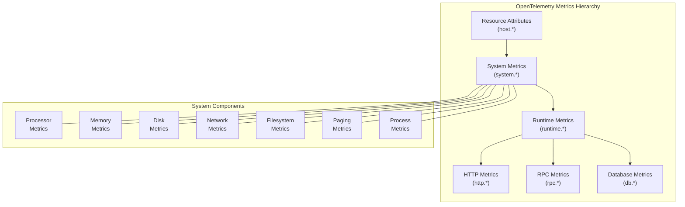

The system metrics (`system.*`) provide foundation-level observability of the underlying host system. These metrics complement other OpenTelemetry metrics:

- **Resource Attributes**: Provide static metadata about the host (e.g., `host.name`)
- **Runtime Metrics**: Build upon system metrics but focus on the execution environment
- **Application Metrics**: HTTP, RPC, Database metrics provide service-level observability

When collecting metrics, the system metrics should be considered the base layer for understanding resource utilization and system health.

Sources: [docs/system/system-metrics.md:1-19](), [docs/rpc/rpc-metrics.md:1-412](), [docs/http/README.md:1-47](), [docs/database/README.md:1-58]()

# Generative AI Conventions

## Purpose and Scope

This document describes the standardized semantic conventions for instrumenting Generative AI operations in OpenTelemetry. These conventions define the structure and attributes for spans, metrics, and events specifically related to interactions with Large Language Models (LLMs) and other generative AI systems. They enable consistent observability across different AI providers, client libraries, and applications.

> [!NOTE]
> These semantic conventions are currently in development status. While they are stable enough for non-critical workloads, they may undergo changes based on community feedback.

For conventions covering other domains, see related pages for [HTTP Conventions](3.1), [Database Conventions](3.2), and [Messaging Conventions](3.3).

Sources: [docs/gen-ai/README.md:5-27](docs/gen-ai/README.md:5-27)

## Architecture Overview

The Generative AI semantic conventions are organized into four main categories:

1. **Spans**: For tracing operations like model inference, embeddings generation, and agent interactions
2. **Metrics**: For measuring token usage, operation duration, and other performance characteristics
3. **Events**: For capturing inputs (prompts) and outputs (completions) from AI models
4. **Provider-specific extensions**: Additional conventions for specific AI systems like OpenAI, Azure AI, and AWS Bedrock

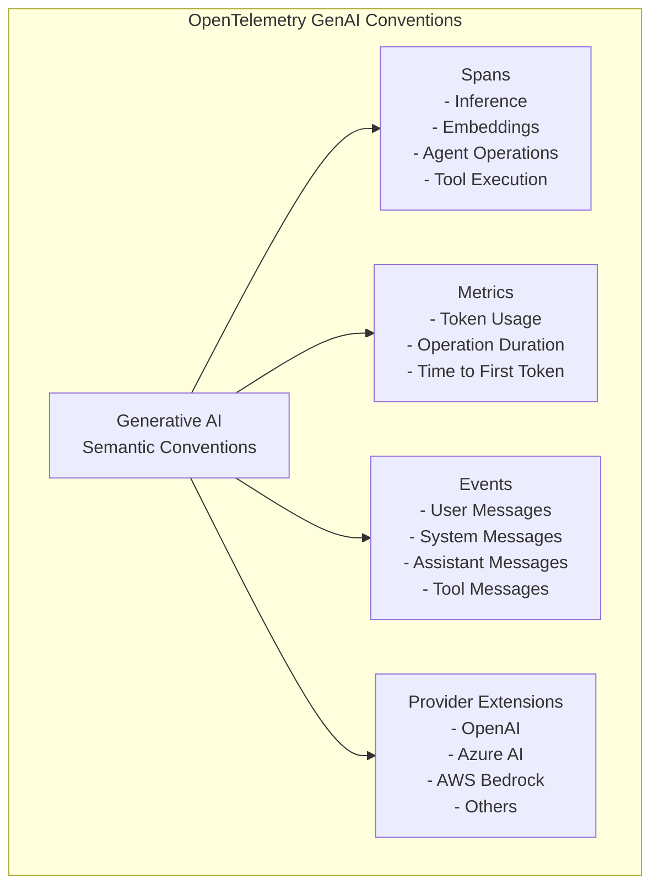

Sources: [docs/gen-ai/README.md:14-26](docs/gen-ai/README.md:14-26), [docs/gen-ai/gen-ai-spans.md:5-18](docs/gen-ai/gen-ai-spans.md:5-18), [docs/gen-ai/gen-ai-metrics.md:5-18](docs/gen-ai/gen-ai-metrics.md:5-18), [docs/gen-ai/gen-ai-events.md:5-16](docs/gen-ai/gen-ai-events.md:5-16)

## Common Attributes

All GenAI telemetry shares a set of common attributes that identify and characterize the operations. The most important of these are:

| Attribute | Description | Example Values |
|-----------|-------------|----------------|
| `gen_ai.system` | Identifies the GenAI product (required) | `openai`, `aws.bedrock`, `az.ai.openai` |
| `gen_ai.operation.name` | The operation being performed (required) | `chat`, `embeddings`, `invoke_agent` |
| `gen_ai.request.model` | Name of the model being used | `gpt-4`, `claude-2` |
| `gen_ai.request.temperature` | Temperature setting (randomness) | `0.7` |
| `gen_ai.usage.input_tokens` | Number of tokens in the prompt | `256` |
| `gen_ai.usage.output_tokens` | Number of tokens in the completion | `1024` |

Sources: [model/gen-ai/registry.yaml:1-107](model/gen-ai/registry.yaml:1-107), [model/gen-ai/spans.yaml:1-32](model/gen-ai/spans.yaml:1-32)

## Span Conventions

Spans represent GenAI operations with a start and end time. The conventions define different span types for different operations.

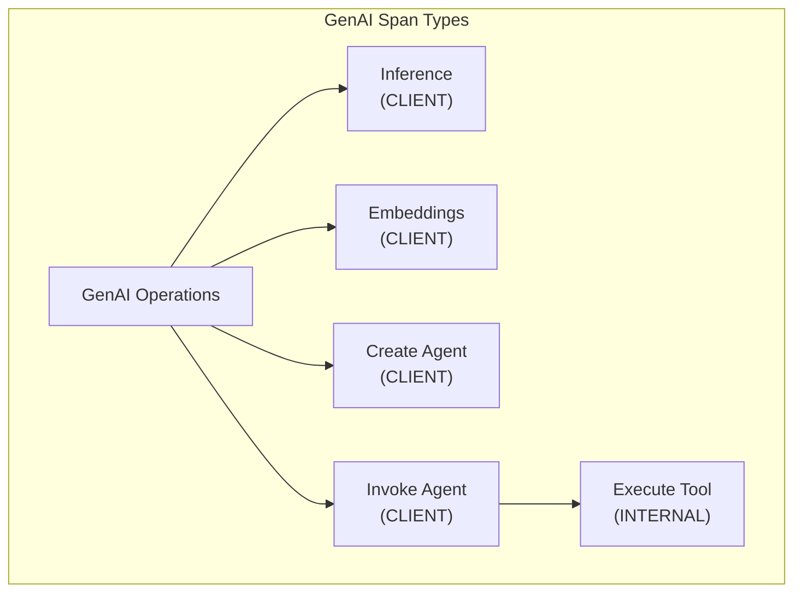

### Inference Spans

Inference spans represent client calls to GenAI models that generate text, images, or other content based on a prompt. The span name should be `{gen_ai.operation.name} {gen_ai.request.model}`.

Key attributes include:
- `gen_ai.system`: Identifies the AI provider (e.g., `openai`, `aws.bedrock`)
- `gen_ai.operation.name`: Type of operation (e.g., `chat`, `text_completion`, `generate_content`)
- Request parameters like `gen_ai.request.temperature`, `gen_ai.request.max_tokens`
- Response information like `gen_ai.response.finish_reasons`, `gen_ai.usage.output_tokens`

Sources: [docs/gen-ai/gen-ai-spans.md:21-180](docs/gen-ai/gen-ai-spans.md:21-180), [model/gen-ai/spans.yaml:92-115](model/gen-ai/spans.yaml:92-115)

### Embeddings Spans

Embeddings spans represent operations that convert text into vector representations. The `gen_ai.operation.name` should be `embeddings`.

Sources: [docs/gen-ai/gen-ai-spans.md:182-250](docs/gen-ai/gen-ai-spans.md:182-250), [model/gen-ai/spans.yaml:195-212](model/gen-ai/spans.yaml:195-212)

### Agent Operations

Agent spans represent interactions with GenAI agents - models that can use tools, access external information, and perform self-directed tasks.

#### Create Agent Span

For creating a new agent, used with remote agent services:
- `gen_ai.operation.name` should be `create_agent`
- Span name should be `create_agent {gen_ai.agent.name}`
- Includes attributes like `gen_ai.agent.id`, `gen_ai.agent.description`

#### Invoke Agent Span

For interacting with an existing agent:
- `gen_ai.operation.name` should be `invoke_agent`
- Span name should be `invoke_agent {gen_ai.agent.name}`
- May include data source references via `gen_ai.data_source.id`

Sources: [docs/gen-ai/gen-ai-agent-spans.md:20-305](docs/gen-ai/gen-ai-agent-spans.md:20-305), [model/gen-ai/spans.yaml:213-267](model/gen-ai/spans.yaml:213-267)

### Execute Tool Span

Tool spans represent the execution of tools by GenAI models (like function calling):
- `gen_ai.operation.name` should be `execute_tool`
- Span name should be `execute_tool {gen_ai.tool.name}`
- Includes tool-specific attributes like `gen_ai.tool.name`, `gen_ai.tool.call.id`

Sources: [docs/gen-ai/gen-ai-spans.md:252-300](docs/gen-ai/gen-ai-spans.md:252-300), [model/gen-ai/spans.yaml:268-297](model/gen-ai/spans.yaml:268-297)

## Metric Conventions

Metrics provide quantitative measurements of GenAI operations. The conventions define client-side and server-side metrics.

### Client Metrics

#### Token Usage Metric

The `gen_ai.client.token.usage` metric measures the number of tokens used in requests and responses.

Attributes:
- `gen_ai.system`: Identifies the AI provider
- `gen_ai.operation.name`: Type of operation
- `gen_ai.token.type`: Whether tokens are `input` or `output`
- `gen_ai.request.model`: Model used

#### Operation Duration Metric

The `gen_ai.client.operation.duration` metric measures the total time taken to complete a GenAI operation.

Sources: [docs/gen-ai/gen-ai-metrics.md:21-246](docs/gen-ai/gen-ai-metrics.md:21-246)

### Server Metrics

For systems hosting GenAI models, additional metrics include:
- `gen_ai.server.request.duration`: Total request processing time
- `gen_ai.server.time_per_output_token`: Time taken per token generated
- `gen_ai.server.time_to_first_token`: Latency until first token is produced

Sources: [docs/gen-ai/gen-ai-metrics.md:248-355](docs/gen-ai/gen-ai-metrics.md:248-355)

## Event Conventions

Events capture the content of interactions with GenAI models. These are opt-in due to potential data privacy and size concerns.

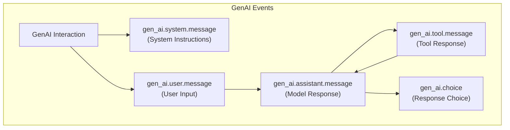

The common events are:
- `gen_ai.system.message`: System instructions to the model
- `gen_ai.user.message`: User input/prompt sent to the model
- `gen_ai.assistant.message`: Model's response, may include tool calls
- `gen_ai.tool.message`: Response from a tool execution
- `gen_ai.choice`: Individual response alternatives when multiple are requested

Sources: [docs/gen-ai/gen-ai-events.md:24-41](docs/gen-ai/gen-ai-events.md:24-41), [docs/gen-ai/gen-ai-events.md:47-361](docs/gen-ai/gen-ai-events.md:47-361)

## Provider-Specific Extensions

The GenAI conventions include extensions for specific AI providers with additional attributes relevant to those systems.

### OpenAI Extensions

Additional attributes for OpenAI API operations:
- `gen_ai.openai.request.service_tier`: Service tier requested (e.g., `default`, `auto`)
- `gen_ai.openai.response.service_tier`: Service tier actually used
- `gen_ai.openai.response.system_fingerprint`: Fingerprint tracking environment changes

Sources: [docs/gen-ai/openai.md:5-218](docs/gen-ai/openai.md:5-218), [model/gen-ai/spans.yaml:138-164](model/gen-ai/spans.yaml:138-164)

### Azure AI Inference Extensions

Extensions for Azure AI operations:
- `az.namespace`: Set to `Microsoft.CognitiveServices` for Azure AI operations
- Special considerations for naming spans based on model availability

Sources: [docs/gen-ai/azure-ai-inference.md:5-150](docs/gen-ai/azure-ai-inference.md:5-150), [model/gen-ai/spans.yaml:166-193](model/gen-ai/spans.yaml:166-193)

### AWS Bedrock Extensions

Extensions for AWS Bedrock operations:
- `aws.bedrock.guardrail.id`: ID of safety guardrails applied
- `aws.bedrock.knowledge_base.id`: ID of knowledge base used for retrieval

Sources: [docs/gen-ai/aws-bedrock.md:5-173](docs/gen-ai/aws-bedrock.md:5-173), [model/gen-ai/spans.yaml:299-310](model/gen-ai/spans.yaml:299-310)

## Implementation in Code

The following diagram shows how the GenAI conventions are implemented in code, mapping conceptual entities to their corresponding code entities:

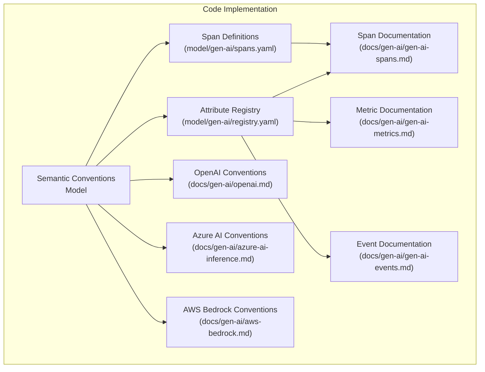

Sources: [model/gen-ai/spans.yaml:1-310](model/gen-ai/spans.yaml:1-310), [model/gen-ai/registry.yaml:1-341](model/gen-ai/registry.yaml:1-341)

## Implementation Example Flow

This diagram shows the flow of a typical GenAI operation instrumented with OpenTelemetry:

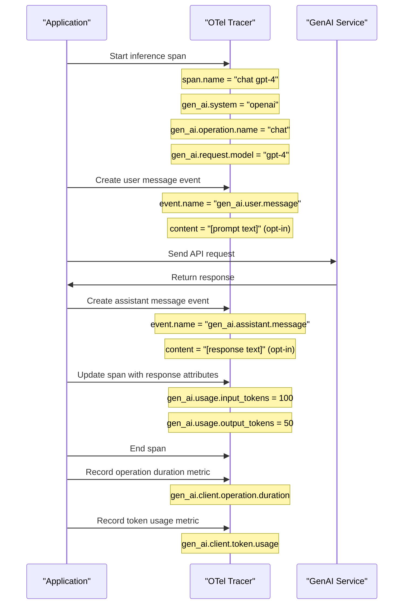

Sources: [docs/gen-ai/gen-ai-spans.md:21-180](docs/gen-ai/gen-ai-spans.md:21-180), [docs/gen-ai/gen-ai-events.md:417-469](docs/gen-ai/gen-ai-events.md:417-469)

## Best Practices for Instrumentation

When instrumenting GenAI applications with these conventions:

1. **Required Attributes**: Always set the required attributes like `gen_ai.system` and `gen_ai.operation.name`.

2. **Span Naming**: Follow the recommended naming pattern: `{gen_ai.operation.name} {gen_ai.request.model}`.

3. **Privacy Considerations**: Content fields in events (like message content) should be opt-in rather than enabled by default, due to potential privacy concerns.

4. **Error Handling**: Use the `error.type` attribute to indicate errors, following the [Recording Errors](/docs/general/recording-errors.md) guidelines.

5. **Conversation Tracking**: When available, use `gen_ai.conversation.id` to correlate messages within the same conversation.

6. **Tool Execution**: For applications using function calling or tools, instrument tool execution with dedicated spans that include tool-specific attributes.

7. **Token Counting**: Record token usage metrics when available from the provider's response.

Sources: [docs/gen-ai/gen-ai-spans.md:41-44](docs/gen-ai/gen-ai-spans.md:41-44), [docs/gen-ai/gen-ai-events.md:24-41](docs/gen-ai/gen-ai-events.md:24-41)

## Versioning and Status

The Generative AI conventions are currently in **Development** status. This means:

- They're ready for use in non-critical workloads
- They may undergo changes based on community feedback
- Attributes may be added, modified, or occasionally removed

As the conventions mature and see wider adoption, they'll move to **Stable** status, at which point backward compatibility will be more strictly maintained.

Sources: [docs/gen-ai/README.md:9-13](docs/gen-ai/README.md:9-13), [docs/gen-ai/gen-ai-spans.md:7-7](docs/gen-ai/gen-ai-spans.md:7-7)