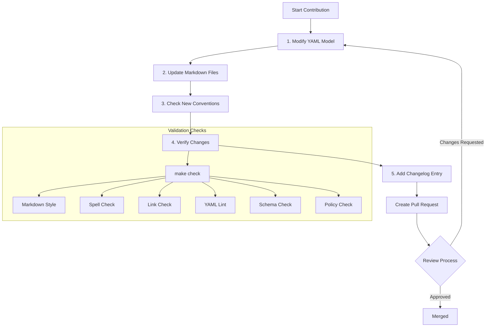
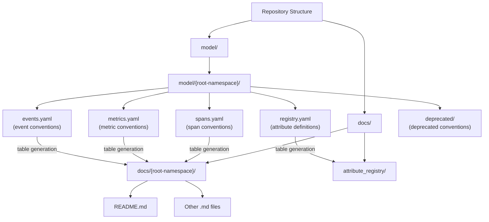

brew bundle
```

Sources: [CONTRIBUTING.md:45-122]()

## Contribution Workflow Overview

The following diagram illustrates the complete workflow for contributing to the semantic conventions repository:



Sources: [CONTRIBUTING.md:50-317]()

## Code Structure and Organization

The repository has a specific structure that organizes YAML model files and their corresponding documentation:



Sources: [CONTRIBUTING.md:130-166]()

## 1. Modify the YAML Model

All semantic conventions are formally defined in YAML files under the `model/` directory. When making changes:

- Add new attributes to the appropriate `registry.yaml` file
- Define new semantic conventions in the appropriate signal file (spans, metrics, events)
- Put deprecated conventions in the `deprecated/` folder

### Schema Files

When modifying existing semantic conventions, you must update the `schema-next.yaml` file to ensure backward compatibility. Semantic conventions follow a strict versioning and stability policy.

```bash
# Example: Updating the schema-next.yaml for an attribute rename
attributes:
  changes:
    - rename:
        from: old.attribute.name
        to: new.attribute.name
```

Sources: [CONTRIBUTING.md:124-182]()

## 2. Update the Markdown Files

After modifying the YAML files, you need to regenerate the corresponding markdown documentation:

```bash