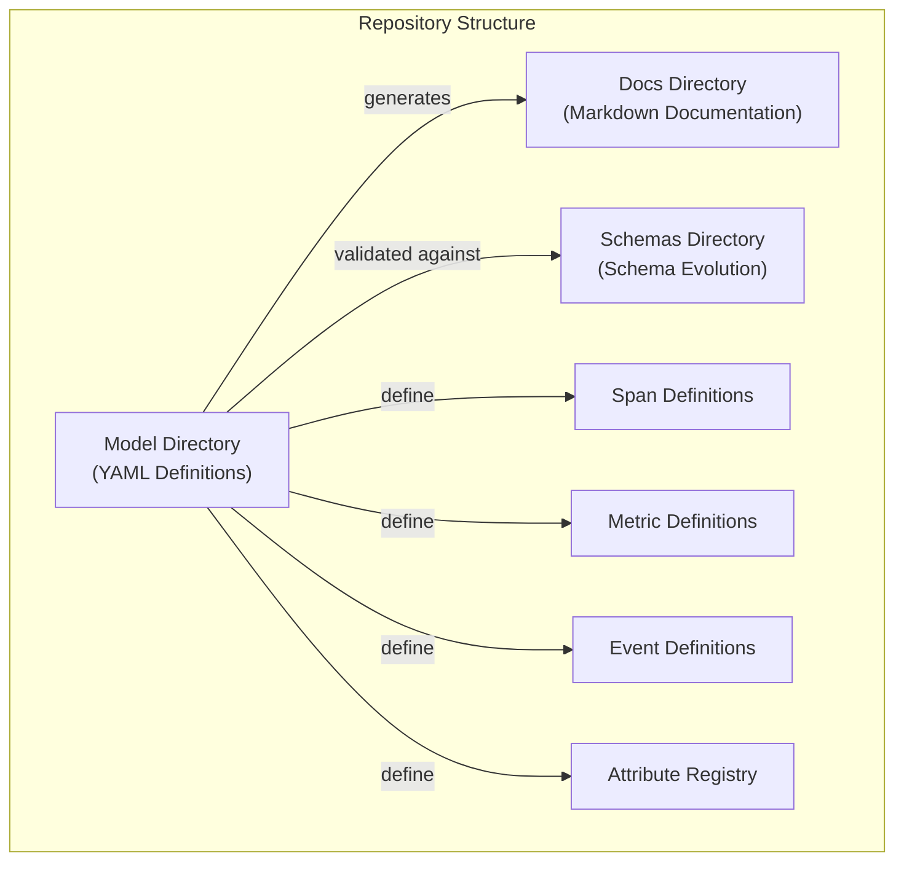
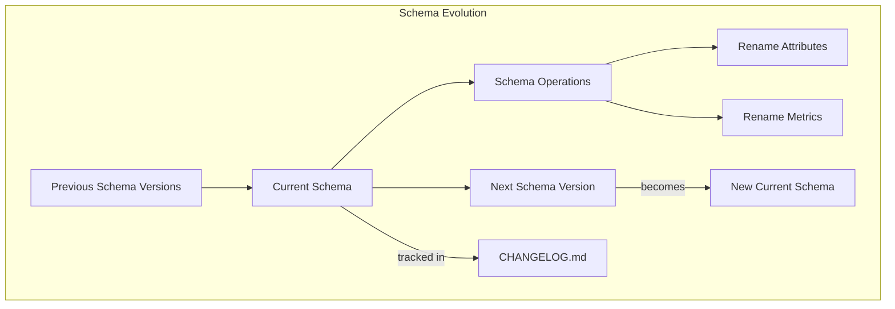
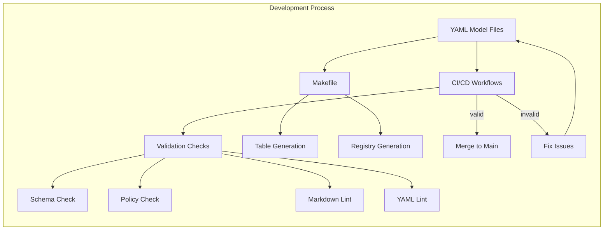
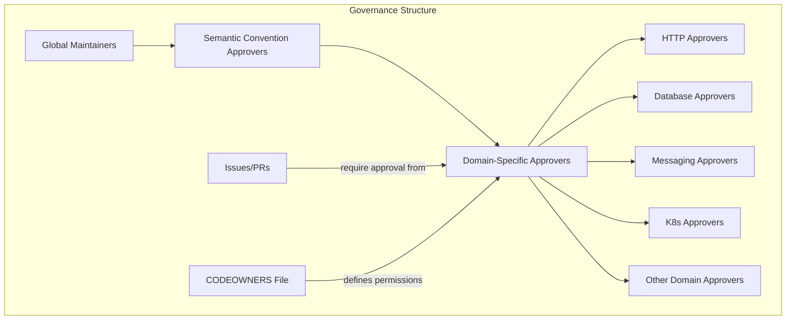
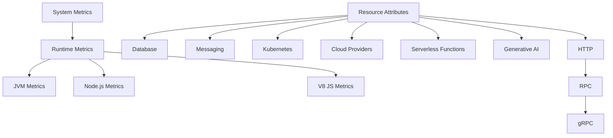
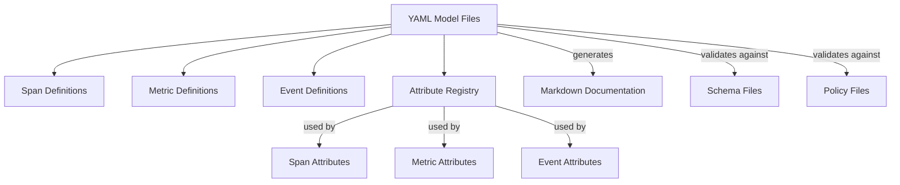
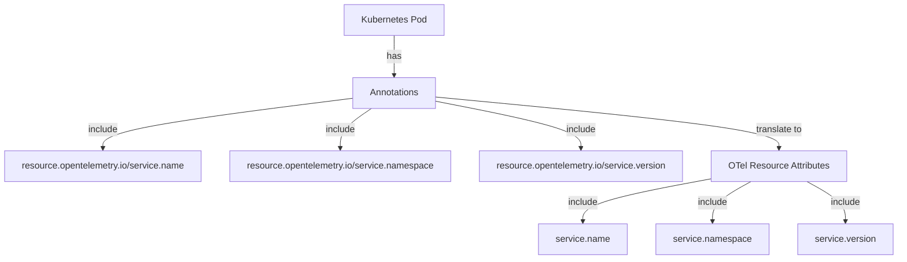

This document provides an overview of the OpenTelemetry Semantic Conventions repository, which defines standardized attributes, metrics, and spans for telemetry data across various domains. These semantic conventions form the foundation for consistent telemetry collection and analysis within the OpenTelemetry ecosystem.

## Purpose and Scope

The OpenTelemetry Semantic Conventions repository exists to:

1. Define a common set of semantic attributes which provide consistent meaning to telemetry data
2. Establish standardized metrics and spans across various technology domains
3. Enable interoperability between observability tools consuming OpenTelemetry data
4. Provide a governance model for evolving these conventions over time

This page covers the high-level architecture of the semantic conventions repository, its core systems, and how they relate to each other. For specific information about contributing to the repository, see [Contributing Guide](#4).

Sources: [README.md:7-8](), [CONTRIBUTING.md:52-63]()

## Core Concepts

### What are Semantic Conventions?

Semantic conventions are standardized naming and attribute definitions for telemetry data. They provide consistent meaning when collecting, producing, and consuming observability signals. These conventions span across:

1. **Spans**: Definitions for distributed tracing data
2. **Metrics**: Standardized metric names and attributes
3. **Logs and Events**: Structured event and log attribute definitions
4. **Resources**: Attributes that identify the source of telemetry data

### Repository Organization

The repository follows a structured organization pattern:

**Key Components:**

1. **Model Directory**: Contains YAML definition files that formally define all attributes, metrics, and spans
2. **Docs Directory**: Contains human-readable documentation, much of which is auto-generated from the YAML models
3. **Schemas Directory**: Contains schema definitions that govern how conventions can evolve over time

Sources: [CONTRIBUTING.md:134-165](), [CONTRIBUTING.md:167-174]()

## Core Architecture

The semantic conventions are organized into a hierarchical structure with several core systems:

```mermaid
graph TD
    subgraph "Core Systems"
        Core["Semantic Conventions Core"]
        Schema["Schema Management System"]
        Build["Build & Validation System"]
        Gov["Governance System"]

        Core --- Schema
        Core --- Build
        Core --- Gov
    end

    subgraph "Domain-Specific Conventions"
        Core --- Resource["Resource Attributes"]
        Core --- HTTP["HTTP Conventions"]
        Core --- DB["Database Conventions"]
        Core --- MSG["Messaging Conventions"]
        Core --- SYS["System Metrics"]
        Core --- GenAI["GenAI Conventions"]
        Core --- K8s["Kubernetes Conventions"]
        Core --- Runtime["Runtime Metrics"]
        Core --- RPC["RPC Conventions"]
        Core --- Cloud["Cloud Provider Conventions"]
        Core --- FaaS["FaaS Conventions"]
    end
```

Sources: [.github/CODEOWNERS:15-147](), [.github/ISSUE_TEMPLATE/bug_report.yaml:24-98]()

### Schema Management System

The schema management system enables the evolution of semantic conventions while maintaining backward compatibility. This system is crucial for ensuring that changes to conventions don't break existing applications.

Key features:
- Schema versioning with clear backward compatibility guarantees
- Rename operations for attributes and metrics
- Changelog tracking for all changes

Sources: [CONTRIBUTING.md:169-174]()

### Build and Validation System

The build and validation system ensures that semantic conventions are consistent, well-documented, and adhere to established policies.

Key components:
- Automated checks for style, spelling, and validation
- Table and registry generation from YAML models
- Policy enforcement ensuring backward compatibility

Sources: [CONTRIBUTING.md:226-248](), [CONTRIBUTING.md:319-436]()

### Governance Model

The repository employs a domain-based governance model where experts in specific areas oversee their respective domains.

This governance model ensures that:
- Domain experts review changes in their areas of expertise
- Multiple approvers from different companies must sign off on changes
- The CODEOWNERS file enforces this governance model in GitHub

Sources: [.github/CODEOWNERS:1-147](), [CONTRIBUTING.md:302-317]()

## Domain-Specific Conventions

The repository organizes semantic conventions into domain-specific groups, with hierarchical relationships between them:

Notable domains include:

| Domain | Description | Key Files |
|--------|-------------|-----------|
| Resource Attributes | Identify telemetry sources | `/model/*/resources.yaml` |
| HTTP | HTTP client/server tracing | `/model/http/spans.yaml` |
| Database | Database client operations | `/model/database/*.yaml` |
| Messaging | Messaging system operations | `/model/messaging/*.yaml` |
| Kubernetes | K8s-related attributes | `/model/k8s/*.yaml` |
| Runtime | Runtime-specific metrics | `/model/*/metrics.yaml` |

Sources: [.github/CODEOWNERS:22-140](), [docs/runtime/README.md:28-54]()

## Semantic Convention Structure

Semantic conventions are structured within YAML model files, which define spans, metrics, events, and attribute registries:

Key components:
- Attribute registries define common attributes used across multiple conventions
- Span, metric, and event definitions reference attributes from registries
- Markdown documentation is generated from YAML definitions
- Schema and policy files validate conventions

Sources: [CONTRIBUTING.md:124-129](), [CONTRIBUTING.md:134-165]()

## Integration with Kubernetes

A notable feature is the integration with Kubernetes, where pod annotations can be used to specify resource attributes:

This allows Kubernetes users to properly label their telemetry data according to semantic conventions.

Sources: [docs/non-normative/k8s-attributes.md:6-84]()

## Contributing to Semantic Conventions

The process for contributing to semantic conventions follows these steps:

1. **Modify the YAML model**: Update or create YAML files in the `model/` directory
2. **Update markdown files**: Generate documentation tables from YAML definitions
3. **Check the new convention**: Validate backward compatibility and naming conventions
4. **Verify changes**: Run automated checks for style, spelling, and validation
5. **Add a changelog entry**: Document the changes in a structured changelog format

For detailed contribution guidelines, see [Contributing Guide](#4).

Sources: [CONTRIBUTING.md:52-63](), [CONTRIBUTING.md:124-298]()

## Conclusion

The OpenTelemetry Semantic Conventions repository serves a critical role in defining standardized telemetry data across various domains. Through its hierarchical organization, strict governance, automated validation, and schema evolution system, it ensures that telemetry data remains consistent and interoperable across the OpenTelemetry ecosystem.

For detailed information about specific convention domains, see [Domain-Specific Conventions](#3).