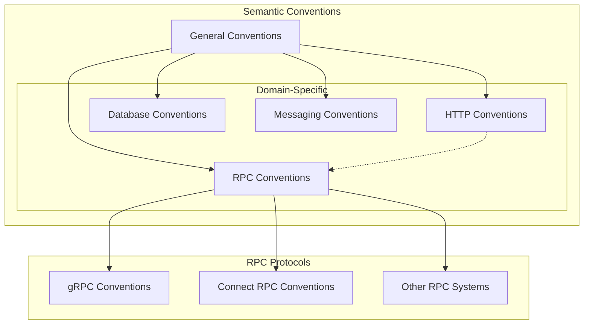
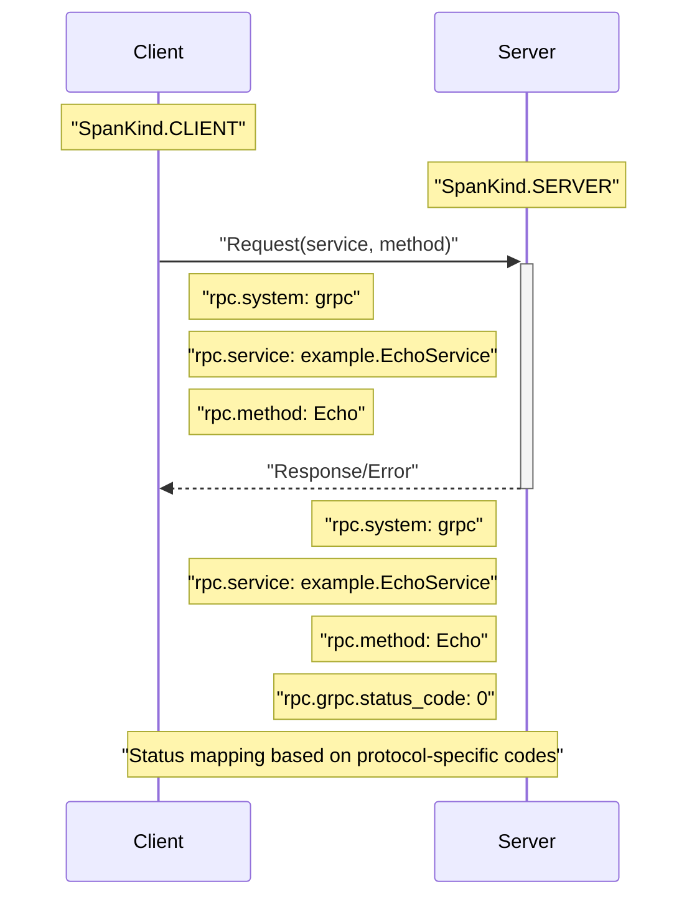
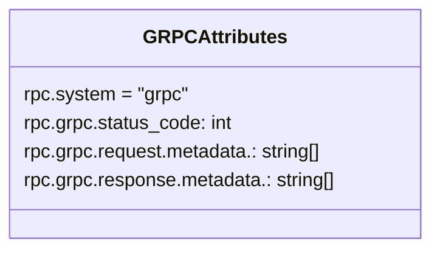
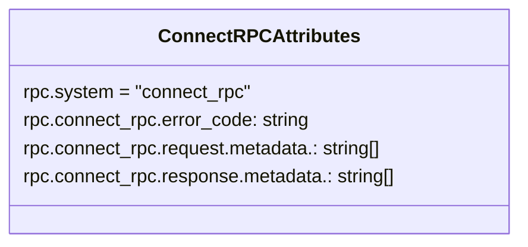
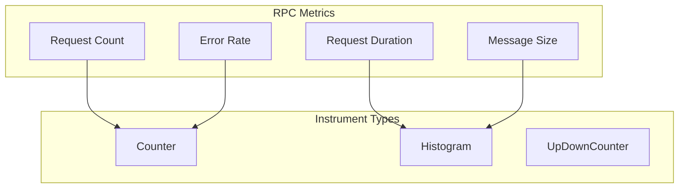
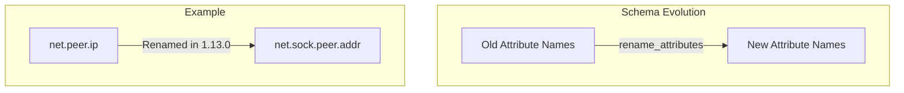

This document describes the semantic conventions for Remote Procedure Call (RPC) systems in OpenTelemetry. These conventions define standardized attributes, metrics, and spans for representing RPC operations in telemetry data. For HTTP-specific conventions, see [HTTP Conventions](#3.1), and for messaging systems, see [Messaging Conventions](#3.3).

## Overview

RPC conventions provide a standardized approach to instrumenting RPC operations across different programming languages and frameworks. They cover both general RPC concepts and protocol-specific details for systems like gRPC and Connect RPC.

The diagram below illustrates how RPC conventions fit into the broader OpenTelemetry semantic conventions framework:

Sources:
- [docs/general/metrics.md:20-37]()
- [docs/general/trace.md:23-34]()
- [docs/rpc/grpc.md:8-11]()
- [docs/rpc/connect-rpc.md:8-11]()

## RPC Span Conventions

RPC span conventions define how to create and populate spans for RPC client and server operations. The following diagram illustrates the relationship between client and server spans in an RPC system:

Sources:
- [docs/rpc/grpc.md:73-99]()
- [docs/rpc/connect-rpc.md:74-76]()

### Common RPC Attributes

Regardless of the specific RPC protocol, the following common attributes are used:

| Attribute | Description | Example |
|-----------|-------------|---------|
| `rpc.system` | The RPC system (e.g., "grpc", "connect_rpc") | `"grpc"` |
| `rpc.service` | The service name | `"example.EchoService"` |
| `rpc.method` | The method name | `"Echo"` |
| `rpc.request.metadata.<key>` | Request metadata | `["value1", "value2"]` |
| `rpc.response.metadata.<key>` | Response metadata | `["value"]` |

### Protocol-Specific Attributes

Different RPC protocols have additional specific attributes:

#### gRPC Attributes

For gRPC, the following additional attributes are defined:

The `rpc.grpc.status_code` attribute uses the [gRPC status codes](https://github.com/grpc/grpc/blob/v1.33.2/doc/statuscodes.md), such as:
- `0`: OK
- `1`: CANCELLED
- `2`: UNKNOWN
- `16`: UNAUTHENTICATED

Sources:
- [docs/rpc/grpc.md:17-70]()

#### Connect RPC Attributes

For Connect RPC, the following attributes are defined:

The `rpc.connect_rpc.error_code` attribute uses string error codes such as:
- `cancelled`
- `unknown`
- `invalid_argument`
- `unauthenticated`

Sources:
- [docs/rpc/connect-rpc.md:17-72]()

## Span Status Mapping

Each RPC protocol has specific rules for mapping their status/error codes to the OpenTelemetry span status.

### gRPC Status Mapping

The table below shows how gRPC status codes map to OpenTelemetry span status for both client and server spans:

| gRPC Status Code | Server Span Status | Client Span Status |
|------------------|-------------------|-------------------|
| OK (0) | unset | unset |
| CANCELLED (1) | unset | Error |
| UNKNOWN (2) | Error | Error |
| INVALID_ARGUMENT (3) | unset | Error |
| DEADLINE_EXCEEDED (4) | Error | Error |
| NOT_FOUND (5) | unset | Error |
| ALREADY_EXISTS (6) | unset | Error |
| PERMISSION_DENIED (7) | unset | Error |
| RESOURCE_EXHAUSTED (8) | unset | Error |
| FAILED_PRECONDITION (9) | unset | Error |
| ABORTED (10) | unset | Error |
| OUT_OF_RANGE (11) | unset | Error |
| UNIMPLEMENTED (12) | Error | Error |
| INTERNAL (13) | Error | Error |
| UNAVAILABLE (14) | Error | Error |
| DATA_LOSS (15) | Error | Error |
| UNAUTHENTICATED (16) | unset | Error |

Sources:
- [docs/rpc/grpc.md:73-99]()

### Connect RPC Status Mapping

For Connect RPC, if `rpc.connect_rpc.error_code` is set, the span status MUST be set to `Error`. In all other cases, it should remain unset.

Sources:
- [docs/rpc/connect-rpc.md:74-76]()

## RPC Metrics Conventions

In addition to spans, OpenTelemetry defines conventions for RPC metrics. RPC metrics provide quantitative measurements of RPC operations, such as request counts, durations, and error rates.

Sources:
- [docs/general/metrics.md:20-28]()

## Schema Evolution

RPC conventions, like other OpenTelemetry semantic conventions, evolve over time. The schema evolution system provides a way to rename or modify attributes as the conventions mature.

For example, the schema file shows attribute renames that occurred in previous versions:

Sources:
- [schemas/1.21.0:9-127]()

## Implementation Guidelines

When implementing RPC conventions, consider the following guidelines:

1. **Setting `rpc.system`**: Always set the `rpc.system` attribute to identify the RPC system (e.g., "grpc", "connect_rpc").

2. **Metadata Handling**: For request and response metadata, only capture specific metadata values that have been explicitly configured to avoid security risks.

3. **Status Mapping**: Follow the protocol-specific status mapping rules to correctly set the OpenTelemetry span status.

4. **Propagation**: Ensure context propagation between client and server spans to maintain trace continuity.

5. **Metrics Registration**: For RPC metrics, use consistent naming and units following the general metric guidelines.

Sources:
- [docs/rpc/grpc.md:31-42]()
- [docs/rpc/connect-rpc.md:40-44]()
- [docs/general/metrics.md:47-78]()

## Relationship with AWS Lambda RPC

When dealing with RPC in serverless environments like AWS Lambda, special considerations apply:

1. For Lambda functions triggered by API Gateway (which is essentially an HTTP-to-RPC gateway), set `faas.trigger` to "http".

2. For Lambda functions triggered by messaging systems, follow both the RPC conventions and relevant messaging conventions.

Sources:
- [docs/faas/aws-lambda.md:147-149]()

## Summary

RPC conventions provide a standardized way to represent RPC operations in OpenTelemetry telemetry data. By following these conventions, developers ensure that telemetry data from different RPC systems can be consistently understood and analyzed across different observability systems.

These conventions cover both general RPC concepts and protocol-specific details for systems like gRPC and Connect RPC, providing a comprehensive framework for instrumenting RPC operations.