Resource attribute conventions define standardized attributes for identifying the sources of telemetry data in OpenTelemetry. These conventions establish a common vocabulary for describing the entities that produce telemetry, ensuring consistency across different observability systems and enabling effective correlation between telemetry signals.

## Purpose and Scope

Resource attributes form the foundational layer of OpenTelemetry semantic conventions. They provide essential context about where telemetry data comes from, enabling users to:

- Uniquely identify the source of telemetry data
- Filter and query telemetry data by source characteristics
- Correlate telemetry signals (logs, metrics, traces) from the same source
- Apply consistent identification patterns across different environments and deployment models

This document focuses on the core resource attribute conventions. For domain-specific resource conventions, please refer to other sections such as [Kubernetes Conventions](3.9) or [Cloud Provider Conventions](3.9).

Sources: [docs/resource/README.md:5-10]()

## Resource Attributes Architecture

Resource attributes are fundamental building blocks in the OpenTelemetry semantic conventions ecosystem, providing the foundation upon which other domain-specific conventions are built.

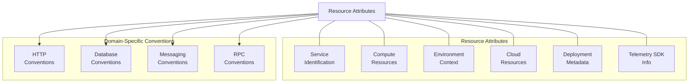

**Resource Attributes Relationship with Telemetry Data**

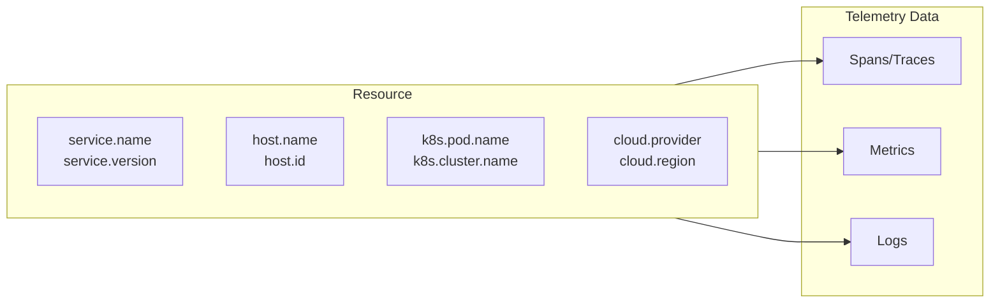

Sources: [docs/resource/README.md]()

## Document Conventions

Resource attributes are grouped logically by the type of the concept they describe. Attributes in the same group have a common prefix that ends with a dot. For example, all attributes that describe Kubernetes properties start with "k8s.".

See [Attribute Requirement Levels](../general/attribute-requirement-level.md) for details on when attributes should be included.

Sources: [docs/resource/README.md:40-45]()

## Special Attribute Handling

Some resource attributes have special handling due to their significance in the telemetry ecosystem:

### Attributes with Dedicated Environment Variables

These attributes can be configured via dedicated environment variables as specified in the OpenTelemetry Environment Variable Specification:

- `service.name`

### Attributes with SDK-Provided Default Values

These attributes must be provided by the SDK if not specified:

- `service.name`
- All attributes in the `telemetry.sdk` group

Sources: [docs/resource/README.md:48-66]()

## Core Resource Attribute Categories

### Service

Service attributes identify the logical service that produces telemetry. These are particularly important for distributed systems where understanding which service generated telemetry is crucial.

| Attribute | Type | Description | Requirement Level | Stability |
|-----------|------|-------------|-------------------|-----------|
| `service.name` | string | Logical name of the service | Required | Stable |
| `service.namespace` | string | Namespace for `service.name` | Recommended | Development |
| `service.instance.id` | string | Unique ID of the service instance | Recommended | Development |
| `service.version` | string | Version of the service | Recommended | Stable |

**Notes:**
- `service.name` must be identical for all instances of horizontally scaled services
- If `service.name` is not specified, SDKs fall back to `unknown_service:` concatenated with `process.executable.name`
- `service.instance.id` must be unique for each instance of the same service and is recommended to be a UUID

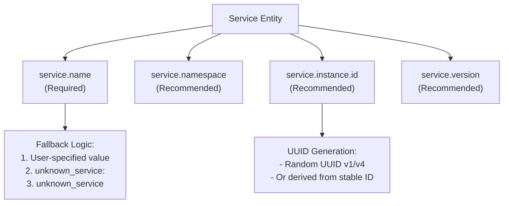

Sources: [docs/resource/README.md:68-139](), [model/service/registry.yaml:1-71]()

### Telemetry SDK

These attributes describe the telemetry SDK used to capture data from the instrumentation libraries.

| Attribute | Type | Description | Requirement Level | Stability |
|-----------|------|-------------|-------------------|-----------|
| `telemetry.sdk.name` | string | Name of the telemetry SDK | Required | Stable |
| `telemetry.sdk.language` | string | Language of the telemetry SDK | Required | Stable |
| `telemetry.sdk.version` | string | Version of the telemetry SDK | Required | Stable |

**Note:** The OpenTelemetry SDK must set `telemetry.sdk.name` to `opentelemetry`. If another SDK is used, it must set this attribute to its own identifier.

Sources: [docs/resource/README.md:141-192]()

### Telemetry Distribution

These attributes identify the distribution of the telemetry SDK used.

| Attribute | Type | Description | Requirement Level | Stability |
|-----------|------|-------------|-------------------|-----------|
| `telemetry.distro.name` | string | Name of the instrumentation agent or distribution | Recommended | Development |
| `telemetry.distro.version` | string | Version of the instrumentation agent or distribution | Recommended | Development |

Sources: [docs/resource/README.md:194-221]()

### Compute Resources

Compute resources represent different compute units that host applications:

#### Compute Units
- Container
- Function as a Service (FaaS)
- Process
- Web engine

#### Compute Instances
- Host

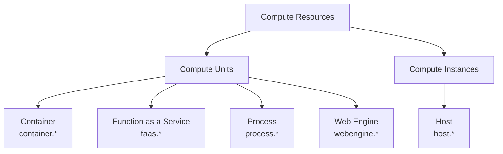

Sources: [docs/resource/README.md:223-240]()

### Environment

Environment attributes define the runtime context of the application:

- Operating System
- Device
- Cloud
- CICD
- Deployment:
  - Deployment Environment
  - Kubernetes
  - CloudFoundry
- Browser

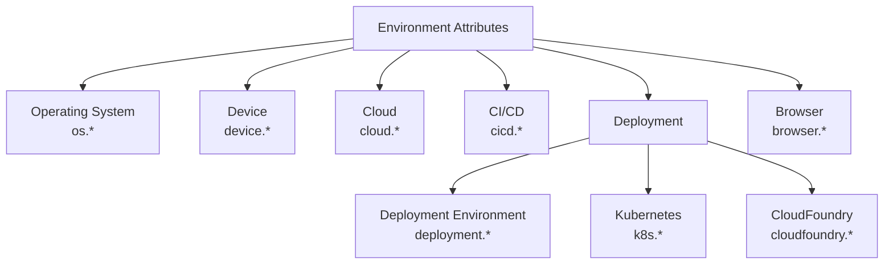

Sources: [docs/resource/README.md:242-256]()

## Kubernetes Resource Attributes

Kubernetes resource attributes provide detailed information about Kubernetes environments. These attributes enable telemetry data to be associated with specific Kubernetes entities.

### Kubernetes Entity Hierarchy

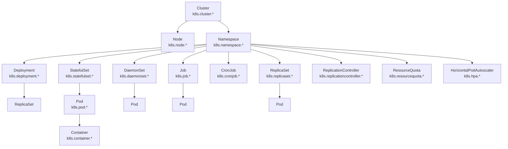

Key Kubernetes attribute groups include:

| K8s Entity | Name Attribute | UID Attribute | Examples | Purpose |
|------------|----------------|--------------|----------|---------|
| Cluster | `k8s.cluster.name` | `k8s.cluster.uid` | "opentelemetry-cluster" | Identify the Kubernetes cluster |
| Node | `k8s.node.name` | `k8s.node.uid` | "node-1" | Identify a node in the cluster |
| Namespace | `k8s.namespace.name` | - | "default" | Identify a namespace |
| Pod | `k8s.pod.name` | `k8s.pod.uid` | "opentelemetry-pod-autoconf" | Identify a pod running in the cluster |
| Container | `k8s.container.name` | - | "redis" | Identify a container spec in a pod |
| Deployment | `k8s.deployment.name` | `k8s.deployment.uid` | "opentelemetry" | Identify a deployment |

Sources: [docs/resource/k8s.md](), [model/k8s/registry.yaml]()

## CloudFoundry Resource Attributes

CloudFoundry resource attributes provide detailed information about CloudFoundry deployments:

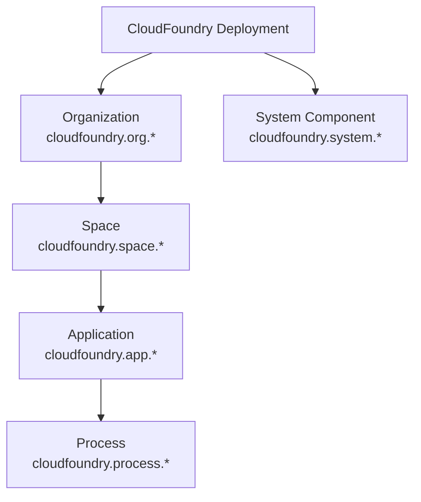

Key CloudFoundry attribute groups include:

| CF Entity | Name Attribute | ID Attribute | Examples | Purpose |
|-----------|----------------|--------------|----------|---------|
| Organization | `cloudfoundry.org.name` | `cloudfoundry.org.id` | "my-org-name" | Identify the CloudFoundry organization |
| Space | `cloudfoundry.space.name` | `cloudfoundry.space.id` | "my-space-name" | Identify a space within an organization |
| Application | `cloudfoundry.app.name` | `cloudfoundry.app.id` | "my-app-name" | Identify an application |
| Process | - | `cloudfoundry.process.id` | - | Identify a specific process |
| System | - | `cloudfoundry.system.id` | "cf/gorouter" | Identify a CloudFoundry system component |

Sources: [docs/resource/cloudfoundry.md]()

## Version Attributes

Version attributes (like `service.version`) are string values that precisely identify an artifact version. They may be:

- Semantic versions (e.g., "1.2.3")
- Git hashes (e.g., "8ae73a")
- Arbitrary version strings (e.g., "0.1.2.20210101")

The specific format depends on what was used when building the artifact.

Sources: [docs/resource/README.md:259-264]()

## Cloud Provider-Specific Attributes

Cloud provider-specific attributes apply only to resources from specific cloud providers listed as a valid `cloud.provider` in the Cloud resource attributes. These include:

- Alibaba Cloud (`alibaba_cloud`)
- Amazon Web Services (`aws`)
- Google Cloud Platform (`gcp`)
- Microsoft Azure (`azure`)
- Tencent Cloud (`tencent_cloud`)
- Heroku dyno

Each cloud provider has its own set of attributes to describe resources specific to that environment.

Sources: [docs/resource/README.md:266-281]()

## Handling Resource Attributes with Mixed Stability

Resource attributes can have different stability levels: `development`, `alpha`, `beta`, `release_candidate`, and `stable`.

Stability guarantees apply to:
- Group properties (type, id, signal-specific properties)
- Overridden properties of stable attributes referenced by a group

However, stability guarantees do not apply to unstable attribute references.

Unstable groups:
- May add or remove references to stable or unstable attributes
- May change requirement level and other properties of attribute references

Stable groups:
- May add or remove references to unstable attributes with `opt_in` requirement level
- Should not have references to unstable attributes with requirement level other than `opt_in`
- Must not remove references to stable attributes

Stable instrumentations should not report telemetry following the unstable part of semantic conventions by default.

Sources: [docs/general/semantic-convention-groups.md:58-84]()

## Guidelines for Using Resource Attributes

1. **Be consistent**: Use the same resource attributes across all telemetry signals (logs, metrics, traces)
2. **Use meaningful values**: Provide values that uniquely identify the resource
3. **Adhere to stability guidelines**: Consider the stability level of attributes when implementing instrumentation
4. **Follow requirement levels**: Include attributes based on their requirement level (Required, Recommended, Opt-In)
5. **Use appropriate granularity**: Choose the appropriate level of detail based on your observability needs

Remember that resource attributes form the foundation for correlating and analyzing telemetry data, so careful implementation is crucial for effective observability.

# Runtime Metrics Conventions

## Purpose and Scope

This document describes the standardized semantic conventions for runtime metrics in OpenTelemetry. Runtime metrics provide insights into the performance and behavior of application runtime environments such as the Java Virtual Machine (JVM), Node.js, and the V8 JavaScript engine. These conventions enable consistent monitoring and observability of runtime performance across different environments.

For system-level metrics not specific to particular runtimes, see [System Metrics Conventions](#3.4). For FaaS (Function as a Service) environments, this document covers runtime-specific metrics, while more general FaaS conventions are covered in [FaaS Conventions](#3.9).

## Runtime Metrics Overview

Runtime metrics focus on capturing telemetry data from the execution environments where applications run. These metrics typically measure:

1. **Memory usage and management** - including heap memory, non-heap memory, and garbage collection
2. **Execution environment** - including thread counts, CPU utilization, and event loop performance
3. **Resource allocation** - tracking how resources are allocated and utilized during runtime

The following diagram illustrates the relationship between different runtime metrics systems within the OpenTelemetry semantic conventions:

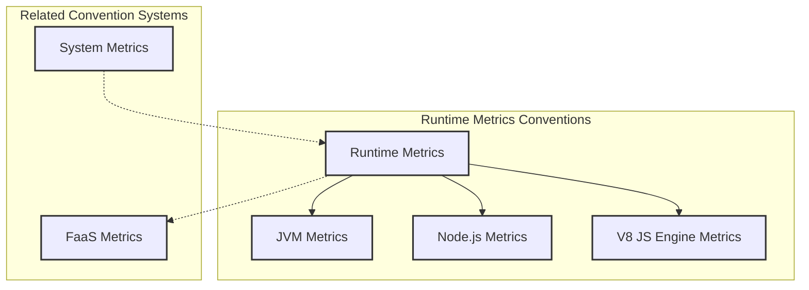

Sources: [docs/runtime/jvm-metrics.md](docs/runtime/jvm-metrics.md), [docs/runtime/nodejs-metrics.md](docs/runtime/nodejs-metrics.md), [docs/runtime/v8js-metrics.md](docs/runtime/v8js-metrics.md), [docs/faas/faas-metrics.md](docs/faas/faas-metrics.md)

## JVM Runtime Metrics

Java Virtual Machine (JVM) metrics provide insights into the performance and resource utilization of Java applications. These metrics are organized into several categories, each addressing different aspects of JVM operation.

```mermaid
flowchart TD
    subgraph "JVM Metrics"
        direction TB
        JVMMetrics["JVM Metrics"]

        Memory["Memory\n(jvm.memory.*)"]
        GC["Garbage Collection\n(jvm.gc.*)"]
        Threads["Threads\n(jvm.thread.*)"]
        Classes["Classes\n(jvm.class.*)"]
        CPU["CPU\n(jvm.cpu.*)"]
        Buffer["Buffer\n(jvm.buffer.*)"]
        FD["File Descriptor\n(jvm.file_descriptor.*)"]

        JVMMetrics --> Memory
        JVMMetrics --> GC
        JVMMetrics --> Threads
        JVMMetrics --> Classes
        JVMMetrics --> CPU
        JVMMetrics --> Buffer
        JVMMetrics --> FD

        Memory --> MemUsed["jvm.memory.used"]
        Memory --> MemCommitted["jvm.memory.committed"]
        Memory --> MemLimit["jvm.memory.limit"]
        Memory --> MemAfterGC["jvm.memory.used_after_last_gc"]
        Memory --> MemInit["jvm.memory.init"]

        GC --> GCDuration["jvm.gc.duration"]

        Threads --> ThreadCount["jvm.thread.count"]

        Classes --> ClassLoaded["jvm.class.loaded"]
        Classes --> ClassUnloaded["jvm.class.unloaded"]
        Classes --> ClassCount["jvm.class.count"]

        CPU --> CPUTime["jvm.cpu.time"]
        CPU --> CPUCount["jvm.cpu.count"]
        CPU --> CPUUtil["jvm.cpu.recent_utilization"]
        CPU --> SysCPUUtil["jvm.system.cpu.utilization"]
        CPU --> SysCPULoad["jvm.system.cpu.load_1m"]

        Buffer --> BufferMemUsed["jvm.buffer.memory.used"]
        Buffer --> BufferMemLimit["jvm.buffer.memory.limit"]
        Buffer --> BufferCount["jvm.buffer.count"]

        FD --> FDCount["jvm.file_descriptor.count"]
    end

    classDef stable stroke-width:2px
    classDef development stroke-width:1px,stroke-dasharray: 5 5

    class Memory,GC,Threads,Classes,CPU stable
    class Buffer,FD,MemInit,SysCPUUtil,SysCPULoad,BufferMemUsed,BufferMemLimit,BufferCount,FDCount development
    class MemUsed,MemCommitted,MemLimit,MemAfterGC,GCDuration,ThreadCount,ClassLoaded,ClassUnloaded,ClassCount,CPUTime,CPUCount,CPUUtil stable
```

Sources: [docs/runtime/jvm-metrics.md:41-410](docs/runtime/jvm-metrics.md)

### JVM Memory Metrics

These metrics track memory usage in the JVM, with separate measurements for different memory pools and types.

| Metric Name | Instrument Type | Unit | Description | Status |
|-------------|-----------------|------|-------------|--------|
| `jvm.memory.used` | UpDownCounter | By | Memory used | Stable |
| `jvm.memory.committed` | UpDownCounter | By | Memory committed | Stable |
| `jvm.memory.limit` | UpDownCounter | By | Max obtainable memory | Stable |
| `jvm.memory.used_after_last_gc` | UpDownCounter | By | Memory used after most recent GC | Stable |
| `jvm.memory.init` | UpDownCounter | By | Initial memory requested | Development |

These metrics use the following common attributes:
- `jvm.memory.type`: Specifies memory type (`heap` or `non_heap`)
- `jvm.memory.pool.name`: Name of the memory pool (e.g., `G1 Old Gen`, `G1 Eden space`)

Sources: [docs/runtime/jvm-metrics.md:41-193](docs/runtime/jvm-metrics.md)

### JVM Garbage Collection Metrics

| Metric Name | Instrument Type | Unit | Description | Status |
|-------------|-----------------|------|-------------|--------|
| `jvm.gc.duration` | Histogram | s | Duration of JVM garbage collection actions | Stable |

Attributes:
- `jvm.gc.name`: Name of the garbage collector
- `jvm.gc.action`: Name of the garbage collector action
- `jvm.gc.cause`: Name of the garbage collector cause (optional)

Sources: [docs/runtime/jvm-metrics.md:195-237](docs/runtime/jvm-metrics.md)

### JVM Thread Metrics

| Metric Name | Instrument Type | Unit | Description | Status |
|-------------|-----------------|------|-------------|--------|
| `jvm.thread.count` | UpDownCounter | {thread} | Number of executing platform threads | Stable |

Attributes:
- `jvm.thread.daemon`: Boolean indicating if thread is daemon
- `jvm.thread.state`: State of the thread (e.g., `runnable`, `blocked`, `waiting`)

Sources: [docs/runtime/jvm-metrics.md:239-289](docs/runtime/jvm-metrics.md)

### JVM Class Metrics

| Metric Name | Instrument Type | Unit | Description | Status |
|-------------|-----------------|------|-------------|--------|
| `jvm.class.loaded` | Counter | {class} | Number of classes loaded since JVM start | Stable |
| `jvm.class.unloaded` | Counter | {class} | Number of classes unloaded since JVM start | Stable |
| `jvm.class.count` | UpDownCounter | {class} | Number of classes currently loaded | Stable |

Sources: [docs/runtime/jvm-metrics.md:291-358](docs/runtime/jvm-metrics.md)

### JVM CPU Metrics

| Metric Name | Instrument Type | Unit | Description | Status |
|-------------|-----------------|------|-------------|--------|
| `jvm.cpu.time` | Counter | s | CPU time used by the process | Stable |
| `jvm.cpu.count` | UpDownCounter | {cpu} | Number of processors available to the JVM | Stable |
| `jvm.cpu.recent_utilization` | Gauge | 1 | Recent CPU utilization for the process | Stable |
| `jvm.system.cpu.utilization` | Gauge | 1 | Recent CPU utilization for the whole system | Development |
| `jvm.system.cpu.load_1m` | Gauge | {run_queue_item} | Average CPU load of the whole system for the last minute | Development |

Sources: [docs/runtime/jvm-metrics.md:360-434](docs/runtime/jvm-metrics.md), [docs/runtime/jvm-metrics.md:477-523](docs/runtime/jvm-metrics.md)

### JVM Buffer and File Descriptor Metrics

| Metric Name | Instrument Type | Unit | Description | Status |
|-------------|-----------------|------|-------------|--------|
| `jvm.buffer.memory.used` | UpDownCounter | By | Memory used by buffers | Development |
| `jvm.buffer.memory.limit` | UpDownCounter | By | Total memory capacity of buffers | Development |
| `jvm.buffer.count` | UpDownCounter | {buffer} | Number of buffers in the pool | Development |
| `jvm.file_descriptor.count` | UpDownCounter | {file_descriptor} | Number of open file descriptors | Development |

Buffer metrics use the attribute `jvm.buffer.pool.name` to identify the buffer pool (e.g., `mapped`, `direct`).

Sources: [docs/runtime/jvm-metrics.md:526-626](docs/runtime/jvm-metrics.md)

## Node.js Runtime Metrics

Node.js metrics primarily focus on the event loop, which is central to Node.js's asynchronous, non-blocking architecture. These metrics provide insights into event loop performance and utilization.

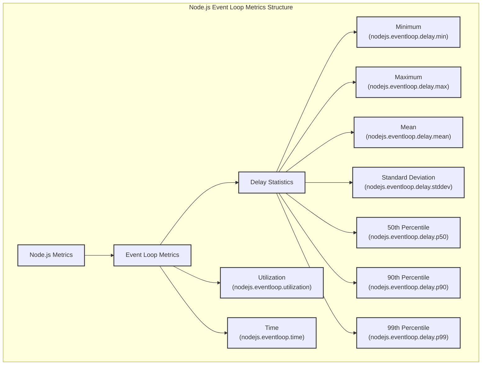

Sources: [docs/runtime/nodejs-metrics.md](docs/runtime/nodejs-metrics.md)

### Node.js Event Loop Delay Metrics

These metrics provide statistical measurements of event loop delay. Node.js runtime returns individual statistical values rather than a complete histogram, so these are represented as separate metrics rather than a single histogram.

| Metric Name | Instrument Type | Unit | Description | Status |
|-------------|-----------------|------|-------------|--------|
| `nodejs.eventloop.delay.min` | Gauge | s | Event loop minimum delay | Development |
| `nodejs.eventloop.delay.max` | Gauge | s | Event loop maximum delay | Development |
| `nodejs.eventloop.delay.mean` | Gauge | s | Event loop mean delay | Development |
| `nodejs.eventloop.delay.stddev` | Gauge | s | Event loop standard deviation delay | Development |
| `nodejs.eventloop.delay.p50` | Gauge | s | Event loop 50 percentile delay | Development |
| `nodejs.eventloop.delay.p90` | Gauge | s | Event loop 90 percentile delay | Development |
| `nodejs.eventloop.delay.p99` | Gauge | s | Event loop 99 percentile delay | Development |

Sources: [docs/runtime/nodejs-metrics.md:31-183](docs/runtime/nodejs-metrics.md)

### Node.js Event Loop Utilization Metrics

| Metric Name | Instrument Type | Unit | Description | Status |
|-------------|-----------------|------|-------------|--------|
| `nodejs.eventloop.utilization` | Gauge | 1 | Event loop utilization (range: 0.0-1.0) | Development |
| `nodejs.eventloop.time` | Counter | s | Cumulative duration of time the event loop has been in each state | Development |

The `nodejs.eventloop.time` metric uses the attribute `nodejs.eventloop.state` with values `active` or `idle` to distinguish between the two states.

Sources: [docs/runtime/nodejs-metrics.md:185-240](docs/runtime/nodejs-metrics.md)

## V8 JavaScript Engine Metrics

The V8 JavaScript engine powers several JavaScript runtimes including Node.js and Deno. These metrics provide insights into V8's memory management and garbage collection.

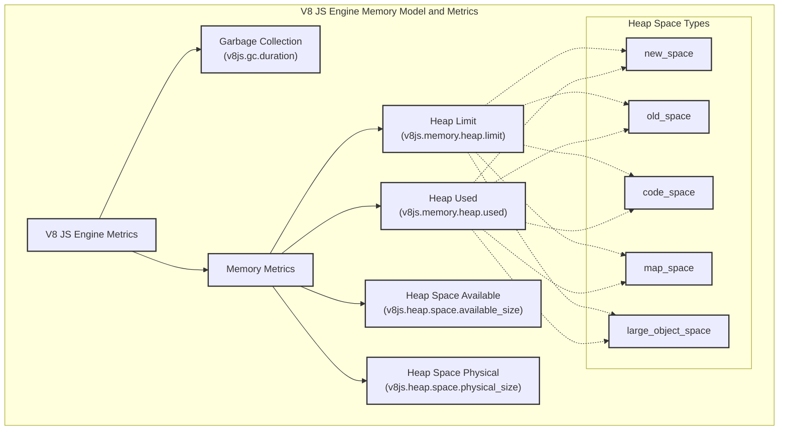

Sources: [docs/runtime/v8js-metrics.md](docs/runtime/v8js-metrics.md)

### V8 Garbage Collection Metrics

| Metric Name | Instrument Type | Unit | Description | Status |
|-------------|-----------------|------|-------------|--------|
| `v8js.gc.duration` | Histogram | s | Garbage collection duration | Development |

This metric uses the attribute `v8js.gc.type` with values like `major`, `minor`, `incremental`, or `weakcb` to identify the type of garbage collection.

Sources: [docs/runtime/v8js-metrics.md:23-62](docs/runtime/v8js-metrics.md)

### V8 Memory Metrics

| Metric Name | Instrument Type | Unit | Description | Status |
|-------------|-----------------|------|-------------|--------|
| `v8js.memory.heap.limit` | UpDownCounter | By | Total heap memory size pre-allocated | Development |
| `v8js.memory.heap.used` | UpDownCounter | By | Heap Memory size allocated | Development |
| `v8js.heap.space.available_size` | UpDownCounter | By | Heap space available size | Development |
| `v8js.heap.space.physical_size` | UpDownCounter | By | Committed size of a heap space | Development |

These metrics use the attribute `v8js.heap.space.name` with values like `new_space`, `old_space`, `code_space`, `map_space`, or `large_object_space` to identify the specific memory space.

Sources: [docs/runtime/v8js-metrics.md:64-222](docs/runtime/v8js-metrics.md)

## FaaS Runtime Metrics

Function as a Service (FaaS) environments have specific runtime metrics that track the execution and resource usage of serverless functions. These metrics complement the general FaaS conventions by providing detailed runtime performance data.

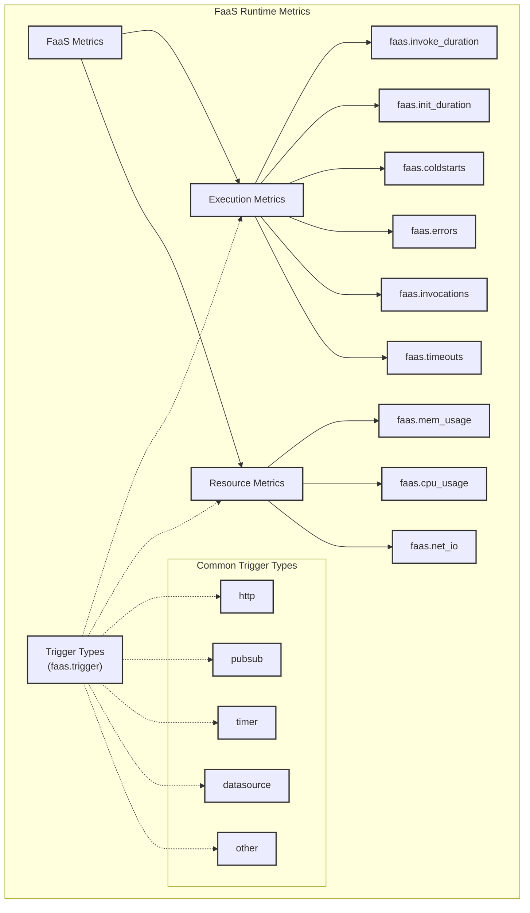

Sources: [docs/faas/faas-metrics.md](docs/faas/faas-metrics.md)

### FaaS Execution Metrics

| Metric Name | Instrument Type | Unit | Description | Status |
|-------------|-----------------|------|-------------|--------|
| `faas.invoke_duration` | Histogram | s | Duration of the function's logic execution | Development |
| `faas.init_duration` | Histogram | s | Duration of the function's initialization (cold start) | Development |
| `faas.coldstarts` | Counter | {coldstart} | Number of invocation cold starts | Development |
| `faas.errors` | Counter | {error} | Number of invocation errors | Development |
| `faas.invocations` | Counter | {invocation} | Number of successful invocations | Development |
| `faas.timeouts` | Counter | {timeout} | Number of invocation timeouts | Development |

Sources: [docs/faas/faas-metrics.md:42-264](docs/faas/faas-metrics.md)

### FaaS Resource Utilization Metrics

| Metric Name | Instrument Type | Unit | Description | Status |
|-------------|-----------------|------|-------------|--------|
| `faas.mem_usage` | Histogram | By | Distribution of max memory usage per invocation | Development |
| `faas.cpu_usage` | Histogram | s | Distribution of CPU usage per invocation | Development |
| `faas.net_io` | Histogram | By | Distribution of net I/O usage per invocation | Development |

All FaaS metrics use the attribute `faas.trigger` to identify the type of trigger that caused the function invocation (e.g., `http`, `pubsub`, `timer`, `datasource`, `other`).

Sources: [docs/faas/faas-metrics.md:266-376](docs/faas/faas-metrics.md)

## Implementation Considerations

When implementing runtime metrics collections, consider the following:

1. **Resource overhead**: Runtime metrics collection itself consumes resources. Collection frequency should be balanced against the overhead it introduces.

2. **Stability status**: Different metrics have different stability statuses:
   - **Stable**: Well-tested metrics that are unlikely to change
   - **Development**: Metrics that may change or be removed in future versions

3. **Instrumentation types**: Choose appropriate instrumentation types:
   - Use **Counters** for values that only increase (like total counts)
   - Use **UpDownCounters** for values that can increase or decrease
   - Use **Gauges** for current value snapshots
   - Use **Histograms** for distributions of values

4. **Units**: Follow the UCUM (Unified Code for Units of Measure) standard for consistent unit representation.

5. **Attributes**: Use attributes to provide additional context and dimensionality to metrics, following the conventions specified for each metric.