## Purpose and Scope

The Schema Evolution System is a critical component of the OpenTelemetry Semantic Conventions repository that manages how telemetry schemas evolve over time while maintaining backward compatibility. This system provides a structured way to track changes in attribute names, metric names, and other convention elements across different versions, enabling telemetry systems to adapt to evolving standards. For information about how these conventions are validated, see the [Build and Validation System](#2.2).

Sources: [schema-next.yaml:1-5]()

## Schema Version Structure

OpenTelemetry semantic conventions are versioned using a structured schema URL pattern (e.g., `https://opentelemetry.io/schemas/1.34.0`). The versioning follows a specific structure:

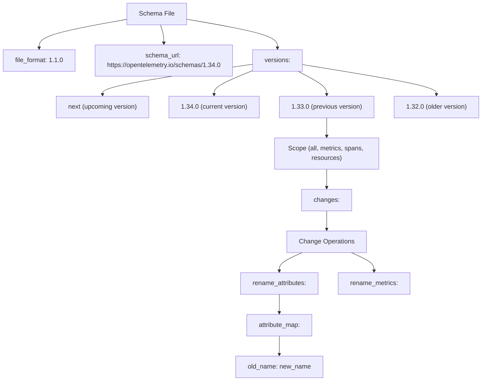

**Schema Version Hierarchy**

Sources: [schema-next.yaml:1-7]()

## Change Operations

The Schema Evolution System supports different types of change operations to evolve semantic conventions between versions. Each operation is explicitly documented to ensure backward compatibility.

### Rename Attributes Operation

The most common change operation is `rename_attributes`, which maps old attribute names to new attribute names:

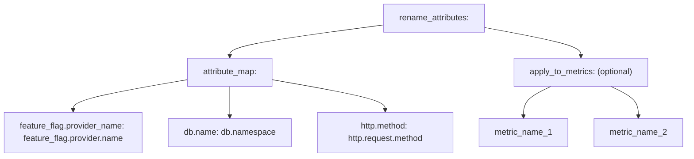

**Rename Attributes Flow**

Sources: [schema-next.yaml:10-17](), [schema-next.yaml:52-56]()

### Rename Metrics Operation

Similar to attribute renaming, the `rename_metrics` operation maps old metric names to new metric names:

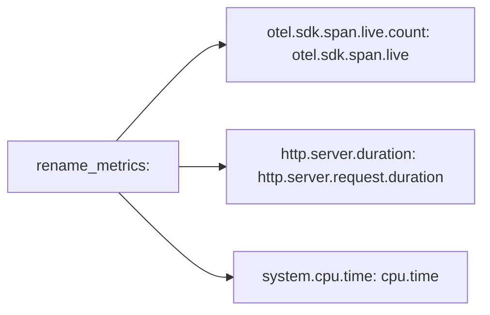

**Metric Renaming Examples**

Sources: [schema-next.yaml:27-33](), [schema-next.yaml:47-51]()

## Scope of Changes

Schema changes can be applied to different scopes of telemetry data:

| Scope | Description | Example Change |
|-------|-------------|----------------|
| `all` | Changes that apply to all telemetry types | Renaming `feature_flag.provider_name` to `feature_flag.provider.name` |
| `metrics` | Changes specific to metrics | Renaming `otel.sdk.span.live.count` to `otel.sdk.span.live` |
| `spans` | Changes specific to spans | Renaming `db.statement` to `db.query.text` |
| `resources` | Changes specific to resource attributes | Renaming `telemetry.auto.version` to `telemetry.distro.version` |

Sources: [schema-next.yaml:7-17](), [schema-next.yaml:25-33](), [schema-next.yaml:267-274](), [schema-next.yaml:492-498]()

## Schema Evolution Process

The following diagram illustrates how the Schema Evolution System manages attribute and metric naming changes over time:

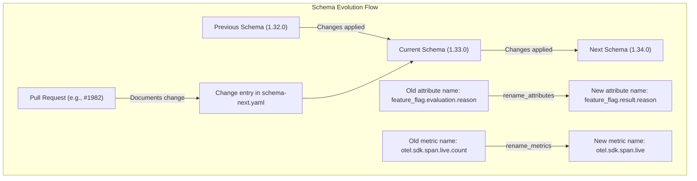

**Schema Evolution Workflow**

Sources: [schema-next.yaml:9-10](), [schema-next.yaml:19-24](), [schema-next.yaml:27-33]()

## Attribute Map Structure

The core of the Schema Evolution System is the `attribute_map` that provides explicit mappings between old and new names:

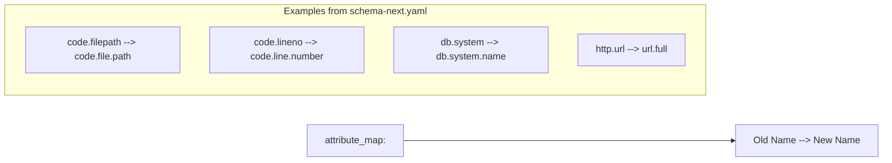

**Attribute Mapping Structure**

Sources: [schema-next.yaml:63-70](), [schema-next.yaml:73-75](), [schema-next.yaml:535-541]()

## Applying Changes to Specific Metrics

Some attribute renamings only apply to specific metrics, which is controlled by the `apply_to_metrics` field:

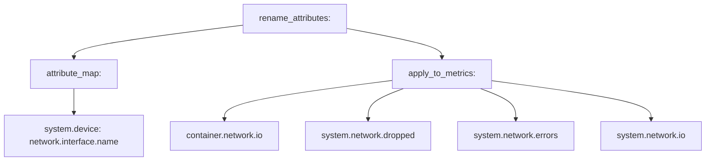

**Targeted Attribute Renaming**

Sources: [schema-next.yaml:115-124]()

## Version History in Schema Files

The schema files maintain a complete history of all changes, organized by version number:

| Version | Notable Changes | PR Reference |
|---------|----------------|--------------|
| 1.34.0 | Rename `feature_flag.provider_name` to `feature_flag.provider.name` | #1982 |
| 1.33.0 | Rename `feature_flag.evaluation.error.message` to `error.message` | #1994 |
| 1.32.0 | Rename metrics like `otel.sdk.span.live.count` to `otel.sdk.span.live` | #2042 |
| 1.31.0 | Rename CPU-related metrics (`system.cpu.time` to `cpu.time`) | #1896 |
| 1.30.0 | Rename code attributes (`code.filepath` to `code.file.path`) | #1624 |

Sources: [schema-next.yaml:5-72]()

## Implementation Details

The Schema Evolution System is implemented through YAML schema files:

1. `schema-next.yaml`: The primary file that tracks all schema changes
2. Version-specific schema files (e.g., `schemas/1.21.0`, `schemas/1.13.0`): Contain changes specific to each version

Each schema file follows a consistent format that includes:
- File format version
- Schema URL
- List of versions and their changes

Sources: [schema-next.yaml:1-5](), [schemas/1.21.0:1-5](), [schemas/1.13.0:1-5]()

## Using the Schema Evolution System

The Schema Evolution System enables several important capabilities for OpenTelemetry implementers:

1. **Backward Compatibility**: Systems can understand telemetry data produced using older conventions by applying the documented mappings
2. **Evolution Tracking**: Contributors can track how conventions have evolved over time
3. **Migration Planning**: Implementers can plan migrations to newer convention versions by following the documented attribute and metric mappings

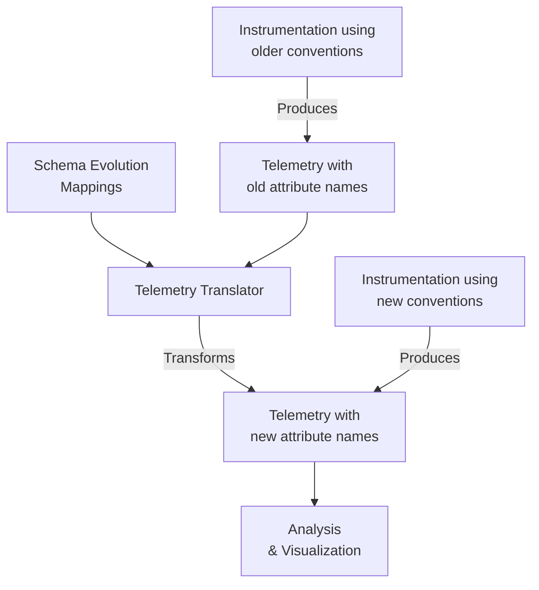

**Telemetry Translation Process**

Sources: [schema-next.yaml]()

## Practical Considerations

When using the Schema Evolution System, consider these best practices:

1. **Version Detection**: Systems should detect which schema version telemetry data conforms to
2. **Transformation Logic**: Implement transformation logic based on schema evolution mappings
3. **Documentation**: When documenting telemetry systems, clearly identify which schema version is being used
4. **Changelog References**: Changes are linked to pull requests for additional context (e.g., `# https://github.com/open-telemetry/semantic-conventions/pull/1982`)

Sources: [schema-next.yaml:9](), [schema-next.yaml:20](), [schema-next.yaml:27]()

## Future Development

The Schema Evolution System continues to evolve to support more complex transformation requirements and ensure backward compatibility as OpenTelemetry semantic conventions mature.

# Build and Validation System


This document provides a detailed overview of the build and validation system used in the OpenTelemetry Semantic Conventions repository. The system ensures that all semantic convention definitions maintain consistency, adhere to policies, and generate accurate documentation. For information about schema evolution, see [Schema Evolution System](#2.1).

## System Overview

The Build and Validation System is a comprehensive framework that automates the validation, testing, and documentation generation for semantic conventions. It consists of containerized tools, make targets, and CI/CD workflows that work together to maintain quality and consistency.

```mermaid
flowchart TB
    subgraph "Build and Validation System"
        direction TB
        YAML["YAML Model Files"]

        subgraph "Validation Layer"
            Lint["Linting Checks"]
            Schema["Schema Validation"]
            Policy["Policy Enforcement"]
            Links["Link Checking"]
        end

        subgraph "Generation Layer"
            Tables["Table Generation"]
            Registry["Registry Generation"]
            Changelog["Changelog Management"]
        end

        subgraph "CI/CD Integration"
            GH["GitHub Actions"]
            PR["PR Validation"]
        end

        YAML --> Validation Layer
        YAML --> Generation Layer
        Validation Layer --> CI/CD Integration
        Generation Layer --> CI/CD Integration
    end
```

Sources: [Makefile](), [.github/workflows/checks.yml](), [dependencies.Dockerfile]()

## Core Components

The build and validation system consists of three main containerized tools that form the backbone of the validation and documentation pipeline:

1. **Weaver**: Generates markdown documentation and enforces policies on the model files
2. **OPA (Open Policy Agent)**: Tests and validates policies that are enforced by Weaver
3. **Lychee**: Validates links in documentation to ensure they resolve correctly

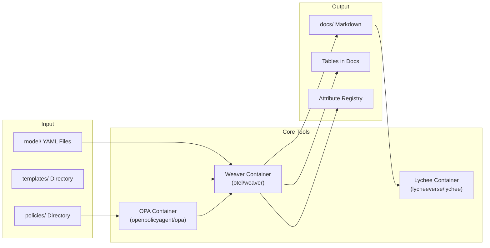

Sources: [dependencies.Dockerfile](), [Makefile:38-55]()

## Make Targets and Workflows

The system provides a comprehensive set of make targets that developers can use to validate their changes and generate documentation. These targets are also used in CI/CD workflows to ensure quality.

| Category | Make Target | Purpose |
|----------|-------------|---------|
| **Validation** | `markdownlint` | Validates markdown files against style rules |
| | `misspell` | Checks for spelling errors in documentation |
| | `table-check` | Verifies generated tables match YAML definitions |
| | `schema-check` | Validates schema files |
| | `check-policies` | Checks semantic conventions against policies |
| | `markdown-link-check` | Validates links in documentation |
| **Generation** | `table-generation` | Generates markdown tables from YAML |
| | `registry-generation` | Generates attribute registry documentation |
| | `markdown-toc` | Updates table of contents in markdown files |
| **Changelog** | `chlog-new` | Creates a new changelog entry |
| | `chlog-validate` | Validates changelog entries |
| | `chlog-update` | Updates changelog with new entries |
| **Combined** | `check` | Runs all validation checks |
| | `fix` | Attempts to fix issues and regenerate tables |
| | `all` | Runs all checks including link validation |

Sources: [Makefile:57-59](), [Makefile:90-98](), [Makefile:247-249](), [Makefile:252-254]()

## Validation Process

The validation process ensures that all semantic conventions adhere to defined standards and policies. This process is executed during local development and in CI/CD workflows.

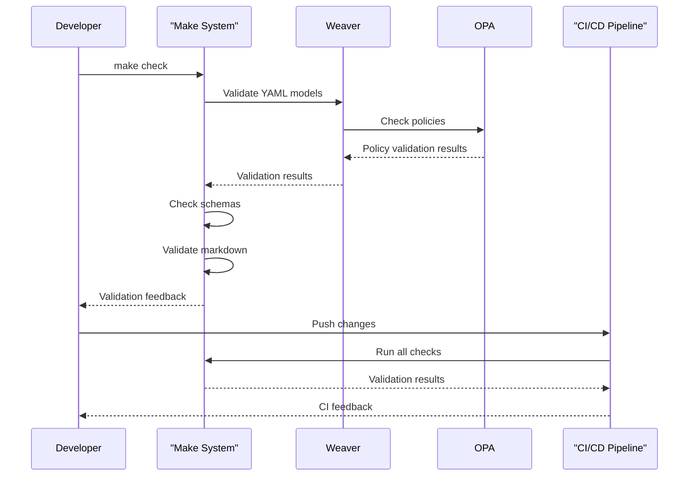

Sources: [.github/workflows/checks.yml](), [Makefile:247-249]()

## Documentation Generation

One of the primary functions of the build system is to generate markdown documentation from YAML model files. This ensures that documentation is always in sync with the actual conventions.

### Table Generation Process

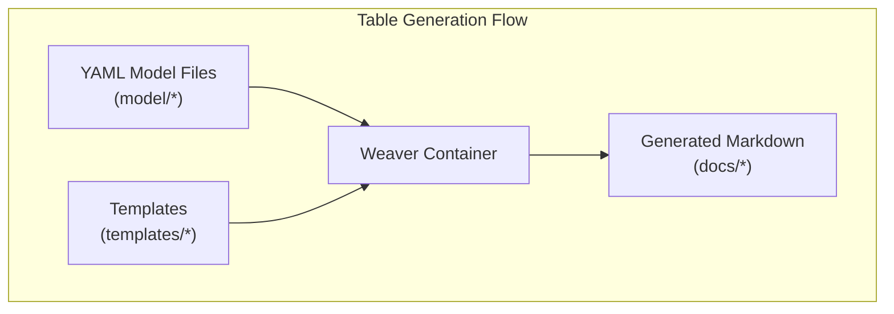

Sources: [Makefile:189-202](), [Makefile:210-221]()

The table generation is handled by the Weaver tool which reads YAML model files, applies templates, and generates markdown documentation. This process is invoked using:

```bash
make table-generation
make registry-generation
```

The `table-generation` target updates markdown tables in existing documentation, while `registry-generation` creates the complete attribute registry documentation.

Sources: [Makefile:189-202](), [Makefile:210-221](), [model/README.md:33-40]()

## CI/CD Integration

The build and validation system is tightly integrated with CI/CD through GitHub Actions workflows. These workflows automatically run various checks on pull requests and merges.

```mermaid
flowchart TB
    subgraph "CI/CD Process"
        PR["Pull Request"]
        Checks["GitHub Action Checks"]

        subgraph "Check Jobs"
            Lint["Markdown/YAML Lint"]
            Links["Link Checking"]
            Tables["Table Validation"]
            Registry["Registry Check"]
            Schema["Schema Validation"]
            Policy["Policy Enforcement"]
            Areas["Area Labels Check"]
        end

        PR --> Checks
        Checks --> Check Jobs
        Check Jobs --> |Pass/Fail| PR
    end
```

Sources: [.github/workflows/checks.yml:11-127]()

Key CI workflows include:

1. **Checks Workflow**: Runs comprehensive validation on PRs and merges
2. **Changelog Workflow**: Ensures proper changelog entries are included
3. **Build System Check**: Validates the build system itself

Sources: [.github/workflows/checks.yml](), [.github/workflows/changelog.yml](), [.github/workflows/build-system-check.yml]()

## Policy Enforcement

The system uses the Open Policy Agent (OPA) to enforce policies on semantic conventions. These policies ensure backward compatibility, proper naming, and adherence to other rules.

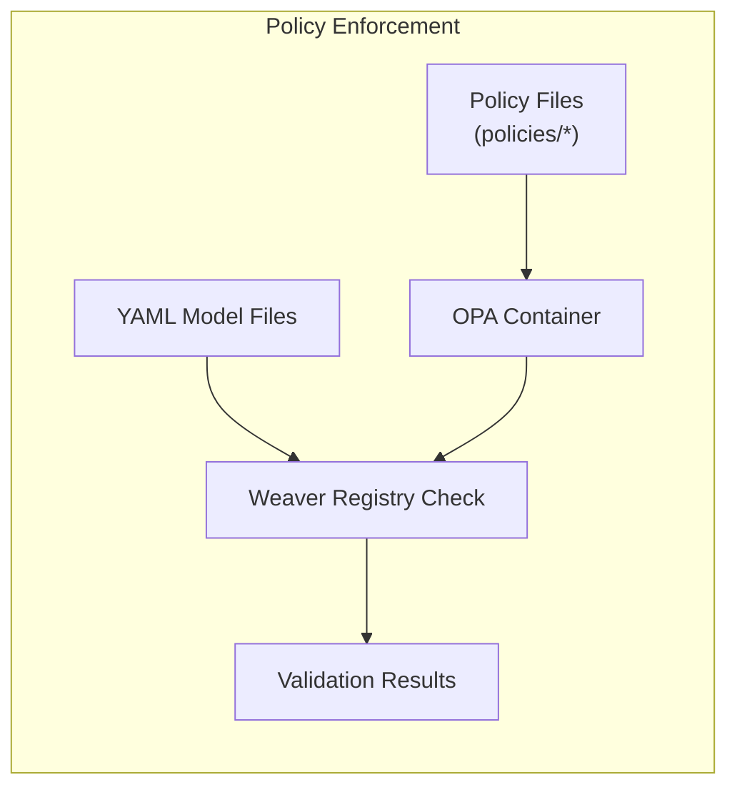

Sources: [Makefile:313-326](), [Makefile:327-335](), [policies/entity_association.rego]()

Policy checks can be executed using:

```bash
make check-policies
make test-policies
```

The `check-policies` target validates semantic conventions against defined policies, while `test-policies` runs tests for the policies themselves.

Sources: [Makefile:313-326](), [Makefile:327-335](), [policies_test/entity_association_test.rego]()

## Schema Validation

Schema files are validated to ensure they match the versions listed in the changelog and contain the correct version information. This validation is performed by the `schema_check.sh` script.

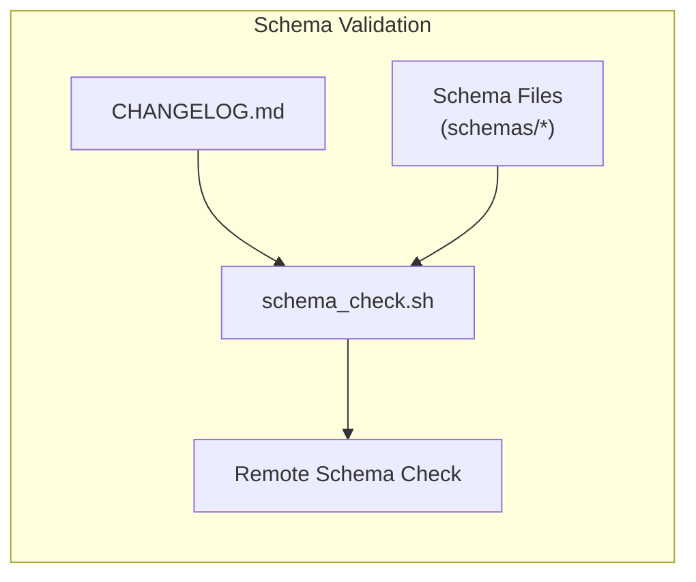

Sources: [internal/tools/schema_check.sh](), [Makefile:240-242]()

The schema validation checks that:

1. Schema files exist for all versions in the changelog
2. Version definitions are present in schema files
3. Schema URLs match the version

Sources: [internal/tools/schema_check.sh:58-93]()

## Developer Workflow

The build and validation system is designed to support developers through the process of creating and modifying semantic conventions.

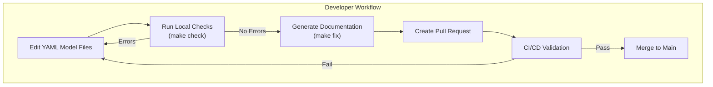

Sources: [Makefile:247-249](), [Makefile:252-254](), [model/README.md]()

The recommended workflow for developers is:

1. Edit YAML model files in the `model/` directory
2. Run `make check` to validate the changes
3. Use `make fix` to regenerate documentation tables
4. Create a PR which will trigger CI/CD validation
5. Address any issues identified by CI/CD
6. After passing all checks, the PR can be merged

Sources: [model/README.md:26-48]()

## Integration with Other Systems

The build and validation system interacts with several other systems in the repository to ensure a cohesive development experience.

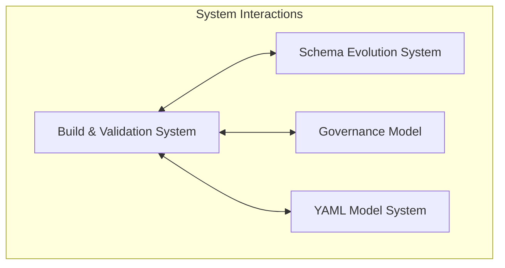

Sources: [.github/workflows/prepare-release.yml](), [.github/workflows/generate-registry-area-labels.yml]()

Key interactions include:

1. **Schema Evolution System**: The build system validates schemas and ensures they align with versioning
2. **Governance Model**: Validation checks enforce ownership and approval requirements
3. **YAML Model System**: Documentation generation transforms YAML models into readable markdown

Sources: [.github/workflows/prepare-release.yml:26-40](), [internal/tools/schema_check.sh]()

## Conclusion

The Build and Validation System is a critical component of the OpenTelemetry Semantic Conventions repository, ensuring quality, consistency, and accurate documentation. By automating validation and generation processes, it enables contributors to focus on defining semantically rich conventions while maintaining high standards.