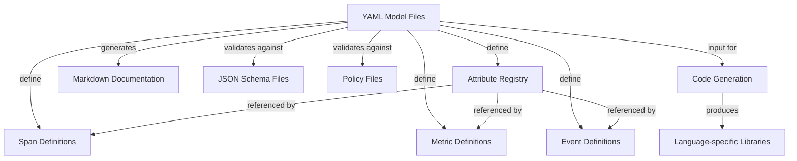
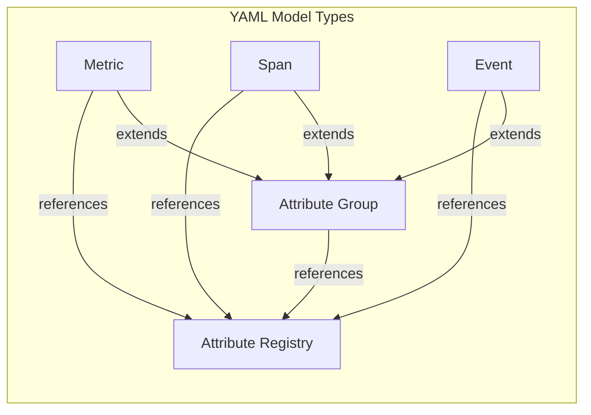
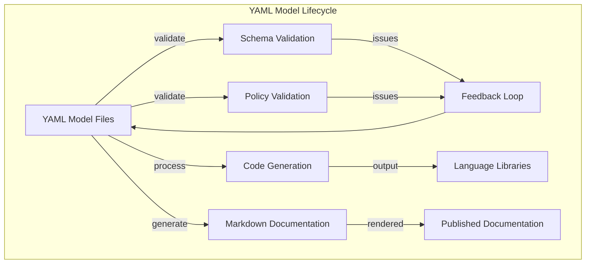

- id: process.cpu.state
  brief: "Deprecated, use `cpu.mode` instead."
  deprecated:
    reason: renamed
    renamed_to: cpu.mode
```

Sources: [model/process/deprecated/registry-deprecated.yaml:1-32]()

By following these guidelines, you'll ensure that your semantic convention additions and modifications are consistent, well-documented, and follow the OpenTelemetry project's standards.

# Working with YAML Models


This document provides a comprehensive guide on how to define, structure, and maintain semantic conventions using YAML model files in the OpenTelemetry semantic-conventions repository. This page focuses specifically on the YAML modeling approach used to define semantic conventions, which are then validated, used to generate documentation, and leveraged for code generation in various languages. For information about adding or modifying specific conventions, see [Adding and Modifying Conventions](#4.1).

## YAML Models Overview

YAML models are the primary way semantic conventions are defined in the OpenTelemetry repository. These model files serve as the source of truth for all semantic conventions and are used to:

1. Define standardized telemetry attributes, metrics, spans, and events
2. Specify relationships between different conventions
3. Document conventions with descriptions, examples, and usage notes
4. Generate markdown documentation automatically
5. Provide a source for code generation in different programming languages



Sources: [model/database/common.yaml](), [model/messaging/spans.yaml](), [docs/non-normative/code-generation.md]()

## YAML File Structure

Each YAML model file contains one or more groups that define semantic conventions. These files are organized by domain (HTTP, database, messaging, etc.) and subdomains.

### Basic Structure

```yaml
groups:
  - id: unique.identifier
    type: [attribute_group|metric|span|event|attribute_registry]
    brief: "Short description of the convention"
    stability: [development|stable]
    attributes:
      - ref: existing.attribute
      - id: new.attribute
        type: string
        brief: "Description of the attribute"
        examples: ["example1", "example2"]
```

### Types of YAML Models

YAML models can define several types of semantic conventions:

1. **Attribute Groups** (`attribute_group`): Collections of related attributes
2. **Metrics** (`metric`): Definitions of metrics with their attributes
3. **Spans** (`span`): Trace span definitions with attributes
4. **Events** (`event`): Event definitions with attributes
5. **Attribute Registry** (`attribute_group` with registry entries): Global definitions of attributes



Sources: [model/database/common.yaml](), [model/messaging/spans.yaml](), [model/kestrel/metrics.yaml](), [model/cpu/registry.yaml]()

## Key Components of YAML Models

### Group Definition

Every YAML model has at least one group that defines a semantic convention:

```yaml
- id: attributes.db.client.minimal
  type: attribute_group
  brief: 'Database Client attributes'
```

The `id` should follow a hierarchical naming pattern to ensure uniqueness across the repository.

### Attributes

Attributes can be defined in two ways:

1. **By Reference**: Referencing an attribute defined elsewhere
   ```yaml
   - ref: server.address
     brief: "Name of the database host."
   ```

2. **Directly**: Defining the attribute inline
   ```yaml
   - id: cpu.logical_number
     type: int
     stability: development
     brief: "The logical CPU number [0..n-1]"
     examples: [1]
   ```

When using references, you can override certain properties like `brief`, `requirement_level`, or `note`.

### Inheritance with "extends"

Groups can extend (inherit from) other groups using the `extends` property:

```yaml
- id: attributes.db.client.with_query
  extends: attributes.db.client.minimal
  type: attribute_group
  brief: "This group defines the attributes describing database operations that may have queries."
```

This creates a hierarchy where all attributes from the parent group are included in the child group.

### Requirement Levels

Attributes can specify different requirement levels:

- `required`: Must be set by instrumentation if available
- `recommended`: Should be set if available
- `opt_in`: Optional, but can be set if desired
- `conditionally_required`: Required under specific conditions

Example:
```yaml
- ref: server.port
  requirement_level:
    conditionally_required: If using a port other than the default port for this DBMS and if `server.address` is set.
```

### Stability Markers

Each semantic convention can be marked with a stability level:

- `development`: Still being developed, may change
- `stable`: Stable and won't change in backward-incompatible ways

Example:
```yaml
- id: metric.kestrel.active_connections
  type: metric
  metric_name: kestrel.active_connections
  stability: stable
  brief: Number of connections that are currently active on the server.
```

Sources: [model/database/common.yaml:1-27](), [model/kestrel/metrics.yaml:14-23](), [model/cpu/registry.yaml:1-42]()

## Specific Model Types

### Attribute Groups

Attribute groups define collections of related attributes:

```yaml
- id: attributes.messaging.common.minimal
  type: attribute_group
  brief: "Common cross-signal messaging attributes."
  stability: development
  attributes:
    - ref: error.type
      examples: ["amqp:decode-error", "KAFKA_STORAGE_ERROR", "channel-error"]
    - ref: server.address
```

### Metrics

Metric definitions include additional properties specific to metrics:

```yaml
- id: metric.azure.cosmosdb.client.operation.request_charge
  type: metric
  metric_name: azure.cosmosdb.client.operation.request_charge
  brief: "[Request units](https://learn.microsoft.com/azure/cosmos-db/request-units) consumed by the operation"
  instrument: histogram
  unit: "{request_unit}"
  stability: development
  extends: attributes.azure.cosmosdb.minimal
```

Key metric-specific properties:
- `metric_name`: The actual name of the metric
- `instrument`: The type of instrument (counter, histogram, etc.)
- `unit`: The unit of measurement

### Spans

Span definitions include properties specific to trace spans:

```yaml
- id: span.aws.lambda.server
  type: span
  span_kind: server
  stability: development
  brief: "This span represents AWS Lambda invocation."
```

Key span-specific properties:
- `span_kind`: The kind of span (server, client, etc.)

Sources: [model/messaging/common.yaml](), [model/azure/cosmosdb-metrics.yaml:1-19](), [model/aws/lambda-spans.yaml]()

## Working with YAML Model Files

### Creating a New YAML Model

1. Identify the domain and subdomain for your convention
2. Create a new YAML file in the appropriate directory (if needed)
3. Define groups with unique IDs following the naming pattern
4. Add attributes, either by reference or direct definition
5. Include appropriate metadata (stability, brief, examples, notes)

### Adding Attributes

When adding attributes, follow these guidelines:

1. Check if the attribute already exists in the registry
2. If it exists, reference it with `ref`
3. If it's new, define it with `id`, `type`, and other properties
4. Add examples and clear descriptions
5. Specify the appropriate requirement level

### Extending Existing Models

To extend an existing model:

1. Use the `extends` property to inherit from another group
2. Override or add specific attributes as needed
3. You can add new attributes and modify inherited ones

Example:
```yaml
- id: messaging.rabbitmq
  type: attribute_group
  stability: development
  extends: messaging.network.attributes
  brief: "Attributes for RabbitMQ"
  attributes:
    - ref: messaging.rabbitmq.destination.routing_key
      requirement_level:
        conditionally_required: If not empty.
```

Sources: [model/messaging/spans.yaml:102-137]()

## Validation and Code Generation

YAML models are validated against JSON schema files and policy rules to ensure consistency and correctness. They are also used to generate documentation and code libraries for different languages.



### Code Generation with Weaver

The [Weaver](https://github.com/open-telemetry/weaver) tool is used to generate code from YAML models. Weaver configuration:

```yaml
params:
  excluded_namespaces: [ios, aspnetcore, signalr]

templates:
  - pattern: semantic_attributes.j2
    filter: >
      semconv_grouped_attributes({
        "exclude_root_namespace": $excluded_namespaces
      })
```

The generation process involves:

1. Reading YAML model files
2. Processing them according to configuration
3. Applying templates to generate code
4. Outputting code files for different languages

Sources: [docs/non-normative/code-generation.md:12-148]()

## Best Practices

1. **Consistent Naming**: Follow the established naming patterns for IDs and attributes
2. **Clear Documentation**: Provide clear and comprehensive descriptions, examples, and notes
3. **Reuse through References**: Reference existing attributes instead of redefining them
4. **Proper Inheritance**: Use the `extends` property to build on existing conventions
5. **Appropriate Stability Markers**: Mark conventions correctly based on their maturity
6. **Complete Requirement Levels**: Clearly specify when attributes are required

## Common Patterns

### Groups and Inheritance

The most common pattern is defining base groups and extending them for specific use cases:

```
Base Group → Extended Group → Technology-Specific Group
```

For example:
```
attributes.db.client.minimal → attributes.db.client.with_query → attributes.azure.cosmosdb.minimal
```

### Attribute References

Most attributes are defined in registry files and referenced in other files:

```
Registry Definition → Reference in Group → Override Properties
```

This ensures consistency across the semantic conventions.

Sources: [model/database/common.yaml:1-81](), [model/messaging/spans.yaml:1-60]()

## Conclusion

YAML models are the foundation of OpenTelemetry semantic conventions. Understanding how to work with these files is essential for contributing to the project and ensuring consistency across telemetry data in different domains. The models provide a structured way to define, document, and generate conventions that can be implemented across different programming languages and platforms.

For information about updating or adding new conventions, see [Adding and Modifying Conventions](#4.1). For details on managing version changes, see [Changelog Management](#4.3).