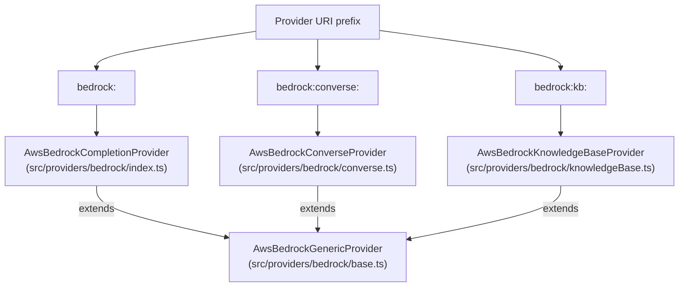
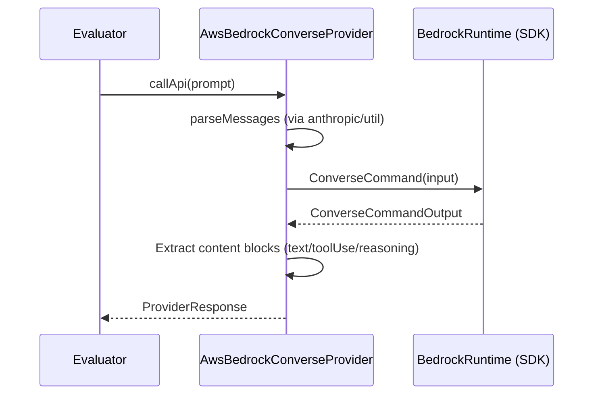
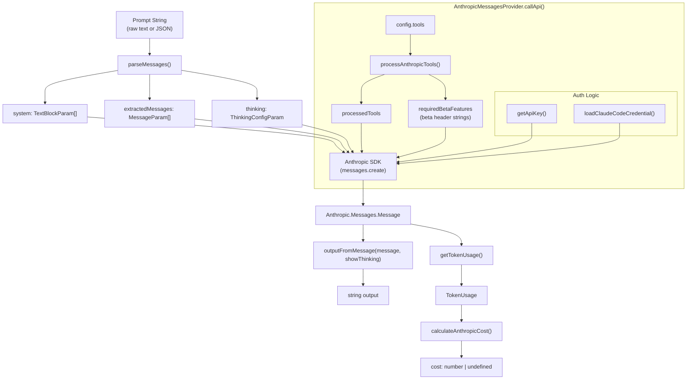
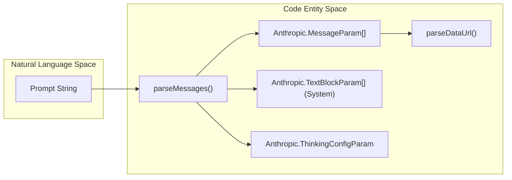
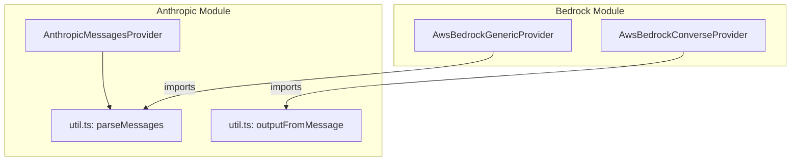

This page documents the AWS Bedrock provider implementation in promptfoo, covering the `AwsBedrockGenericProvider` and `AwsBedrockCompletionProvider` classes, supported model families (Claude, Nova, Llama, Titan, etc.), the Converse API, Application Inference Profiles, extended thinking, guardrails, and multimodal inputs.

---

## Architecture Overview

The Bedrock integration is architected to support multiple AWS Bedrock APIs (InvokeModel, Converse, Async Invoke) through a common base class.

- **`AwsBedrockGenericProvider`**: The base class in `src/providers/bedrock/base.ts` that handles AWS SDK client initialization, credential resolution, and proxy configuration [[src/providers/bedrock/base.ts:16-16]]().
- **`AwsBedrockCompletionProvider`**: Implements the `InvokeModel` API in `src/providers/bedrock/index.ts`. It dispatches model-specific logic to internal handlers based on the model ID [[src/providers/bedrock/index.ts:655-655]]().
- **`AwsBedrockConverseProvider`**: Implements the unified Bedrock Converse API. It supports tool calling and guardrails across different model providers.
- **`AwsBedrockKnowledgeBaseProvider`**: A specialized provider for RAG (Retrieval Augmented Generation) that interacts with AWS Bedrock Knowledge Bases using the `RetrieveAndGenerate` API [[src/providers/bedrock/knowledgeBase.ts:71-74]]().
- **Utility Layer**: `src/providers/bedrock/util.ts` provides message parsing (e.g., `novaParseMessages`) and content extraction logic [[src/providers/bedrock/util.ts:21-21]]().

**Code Entity Mapping**



Sources: [src/providers/bedrock/base.ts:16-16](), [src/providers/bedrock/index.ts:19-21](), [src/providers/bedrock/knowledgeBase.ts:71-74]()

---

## Core Classes and Interfaces

### `AwsBedrockGenericProvider`
The foundation for all Bedrock-based providers. Key responsibilities include:
- **Client Management**: Lazily initializes the `BedrockRuntime` client using `getBedrockInstance()` [[src/providers/bedrock/base.ts:50-50]]().
- **Retry Logic**: Configures `maxAttempts` (default 10) and `retryMode` ('adaptive') [[test/providers/bedrock/index.test.ts:192-193]]().
- **Proxy Support**: Automatically detects `HTTP_PROXY`/`HTTPS_PROXY` and configures a `ProxyAgent` via `@smithy/node-http-handler` [[test/providers/bedrock/index.test.ts:157-162]]().

### `AwsBedrockKnowledgeBaseProvider`
This class allows querying existing AWS Bedrock Knowledge Bases.
- **Configuration**: Requires a `knowledgeBaseId` [[src/providers/bedrock/knowledgeBase.ts:85-89]]().
- **RAG Execution**: Uses `RetrieveAndGenerateCommand` from the `@aws-sdk/client-bedrock-agent-runtime` package [[src/providers/bedrock/knowledgeBase.ts:116-125]]().
- **Citations**: Automatically extracts and includes citation metadata in the response [[src/providers/bedrock/knowledgeBase.ts:35-65]]().

Sources: [src/providers/bedrock/base.ts:16-140](), [src/providers/bedrock/knowledgeBase.ts:71-134](), [test/providers/bedrock/index.test.ts:180-196]()

---

## Authentication and Setup

Promptfoo resolves AWS credentials in the following order [[site/docs/providers/aws-bedrock.md:26-31]]():
1. **Config Explicit**: `accessKeyId` and `secretAccessKey` provided in the YAML `config` block [[site/docs/providers/aws-bedrock.md:47-50]]().
2. **Environment**: `AWS_ACCESS_KEY_ID` and `AWS_SECRET_ACCESS_KEY`.
3. **Local Files**: `~/.aws/credentials`.
4. **IAM**: Roles on EC2/ECS/Lambda.

**Bearer Token Support**: If `apiKey` is provided in the config or `AWS_BEARER_TOKEN_BEDROCK` is set, the provider uses a custom header interceptor to send `Authorization: Bearer <token>` instead of SigV4 signing [[test/providers/bedrock/index.test.ts:152-152]]().

Sources: [site/docs/providers/aws-bedrock.md:26-53](), [test/providers/bedrock/index.test.ts:198-224](), [src/providers/bedrock/knowledgeBase.ts:111-124]()

---

## Model Support and Configuration

### Supported Families
The `BedrockModelFamily` type identifies the handler logic for different foundation models [[src/providers/bedrock/index.ts:36-62]]():

| Family | Handler Example |
|---|---|
| `claude` | Anthropic Claude 3/3.5/3.7/4.x |
| `nova` | Amazon Nova Micro/Lite/Pro |
| `llama` | Meta Llama 2/3/3.1/3.2/3.3/4 |
| `mistral` | Mistral 7B, Mixtral 8x7B |
| `titan` | Amazon Titan Text Express/Lite/Premier |
| `deepseek`| DeepSeek models |

### Extended Thinking (Reasoning)
Promptfoo supports the "thinking" capabilities for modern models:
- **Claude**: Configured via the `thinking` object with `budget_tokens`. Promptfoo includes utilities to clamp tokens for thinking budgets [[src/providers/bedrock/index.ts:104-105]]() [[src/providers/anthropic/util.ts:35-35]]().
- **Nova**: Uses `novaParseMessages` and `novaOutputFromMessage` to handle specialized Nova formatting [[src/providers/bedrock/index.ts:21-21]]().

Sources: [src/providers/bedrock/index.ts:36-62](), [src/providers/bedrock/index.ts:90-105](), [src/providers/anthropic/util.ts:35-49]()

---

## Converse API Integration

The `bedrock:converse:` prefix utilizes the unified interface for Bedrock models.

**Data Flow: Converse API**



### Key Converse Features
- **Extended Thinking**: Enable Claude's reasoning capabilities by setting `thinking` in the provider config [[site/docs/providers/aws-bedrock.md:173-177]]().
- **Unified Interface**: Supports a single interface for reasoning, tool calling, and guardrails across different model providers [[site/docs/providers/aws-bedrock.md:152-154]]().

Sources: [site/docs/providers/aws-bedrock.md:150-177](), [src/providers/bedrock/index.ts:1-21]()

---

## Application Inference Profiles

Inference profiles allow you to use a single ARN to access models across multiple regions for high availability [[site/docs/providers/aws-bedrock.md:55-57]]().

When using an inference profile ARN, the `inferenceModelType` must be specified in the configuration to ensure the correct request schema is used [[site/docs/providers/aws-bedrock.md:61-67]]():

```yaml
providers:
  - id: bedrock:arn:aws:bedrock:us-east-1:123456789012:application-inference-profile/my-profile
    config:
      inferenceModelType: 'claude'
      region: 'us-east-1'
```

Sources: [site/docs/providers/aws-bedrock.md:55-100](), [src/providers/bedrock/index.ts:68-70]()

---

## Multimodal and Media Support

### Vision
- **Claude/Nova**: Supports image inputs via the standard message parsing logic.
- **Llama 3.2 Vision**: Structures image and text inputs using specialized formatters like `formatPromptLlama32Vision` [[test/providers/bedrock/index.test.ts:22-22]]().

### Video Generation
Promptfoo supports video generation using models like **Amazon Nova Reel** [[examples/amazon-bedrock/README.md:9-9]](). These integrations often involve specialized async invocation paths or specific model configuration parameters.

Sources: [test/providers/bedrock/index.test.ts:17-27](), [examples/amazon-bedrock/README.md:1-9]()

# Anthropic Provider


This page documents the Anthropic provider implementation in promptfoo, covering the `anthropic:messages:*` and `anthropic:completion:*` provider families. It explains the provider's data flow, supported models, message formatting logic, tool use, extended thinking, vision support, and cost calculation.

For Claude models accessed through AWS infrastructure, see [AWS Bedrock Integration](#3.3). For how providers are loaded from configuration strings, see [Provider Loading and Registry](#3.1).

---

## Overview

The Anthropic provider integrates directly with the [Anthropic Messages API](https://docs.anthropic.com/en/api/messages) and the legacy completions API. It is primarily activated by provider IDs of the form `anthropic:messages:<model-id>`. The core utility logic lives in `src/providers/anthropic/util.ts`, with types defined in `src/providers/anthropic/types.ts`.

The Bedrock provider also reuses the Anthropic message formatting utilities. Specifically, `outputFromMessage` and `parseMessages` are imported from the Anthropic util module at `src/providers/bedrock/index.ts` [src/providers/bedrock/index.ts:15-17]().

Sources: [src/providers/anthropic/util.ts:1-50](), [src/providers/anthropic/types.ts:1-120](), [src/providers/bedrock/index.ts:15-17]()

---

## Provider ID Format

```
anthropic:messages:<model-id>
anthropic:completion:<model-id>
```

**Examples:**
```
anthropic:messages:claude-3-7-sonnet-latest
anthropic:messages:claude-3-5-sonnet-20241022
anthropic:completion:claude-2.1
```

The `anthropic:` prefix routes to the Anthropic provider family. The `messages:` segment selects the Messages API endpoint (standard for Claude 3+), while `completion:` selects the legacy text completion endpoint [src/providers/registry.ts:13-15]().

Sources: [src/providers/anthropic/messages.ts:1-40](), [src/providers/anthropic/completion.ts:1-15](), [src/providers/registry.ts:13-15]()

---

## Supported Models

The `ANTHROPIC_MODELS` constant [src/providers/anthropic/util.ts:15-187]() defines recognized models and their per-token costs.

### Current Model Roster (Selected)

| Model ID | Input Cost (per MTok) | Output Cost (per MTok) |
|---|---|---|
| `claude-fable-5` | $10.00 | $50.00 |
| `claude-opus-5` | $5.00 | $25.00 |
| `claude-sonnet-5` | $3.00 | $15.00 |
| `claude-opus-4-8` | $5.00 | $25.00 |
| `claude-opus-4-7` | $5.00 | $25.00 |
| `claude-3-7-sonnet-20250219` | $3.00 | $15.00 |
| `claude-3-5-sonnet-20241022` | $3.00 | $15.00 |
| `claude-3-5-haiku-20241022` | $0.80 | $4.00 |
| `claude-3-opus-20240229` | $15.00 | $75.00 |
| `claude-sonnet-4-6` | $3.00 | $15.00 |
| `claude-opus-4-6` | $5.00 | $25.00 |
| `claude-haiku-4-5` | $1.00 | $5.00 |
| `claude-mythos-preview` | $25.00 | $125.00 |

**Note:** Manual sampling parameters (`temperature`, `top_p`, `top_k`) are deprecated for Claude Opus 4.7+, 4.8, and Claude 5 models. `isSamplingParamsDeprecatedClaudeModel` [src/providers/anthropic/util.ts:251-274]() identifies these models to prevent invalid parameter submission.

Sources: [src/providers/anthropic/util.ts:15-187](), [src/providers/anthropic/util.ts:251-274]()

---

## Architecture and Data Flow

The `AnthropicMessagesProvider` [src/providers/anthropic/messages.ts:31]() extends `AnthropicGenericProvider` [src/providers/anthropic/generic.ts:101](), which handles shared logic like API key resolution and Claude Code OAuth authentication.

**Diagram: Anthropic Provider Request Pipeline**



Sources: [src/providers/anthropic/messages.ts:31](), [src/providers/anthropic/util.ts:46-49](), [src/providers/anthropic/generic.ts:101-188]()

---

## Authentication via Claude Code Session

Promptfoo supports reusing OAuth credentials from an active Claude Code session [src/providers/anthropic/generic.ts:148-183](). This allows Claude Pro/Max subscribers to run evaluations without a separate Console API key.

To enable this, set `apiKeyRequired: false` in the provider configuration [site/docs/providers/anthropic.md:30-37]().

**Credential Resolution Order:**
1. macOS Keychain: `Claude Code-credentials` [site/docs/providers/anthropic.md:41]().
2. File System: `$HOME/.claude/.credentials.json` on Linux/macOS or `%USERPROFILE%\.claude\.credentials.json` on Windows [site/docs/providers/anthropic.md:42]().

When using OAuth, Promptfoo injects the required `CLAUDE_CODE_IDENTITY_PROMPT` ("You are Claude Code...") [src/providers/anthropic/messages.ts:25]() and specific beta headers `CLAUDE_CODE_OAUTH_BETA_FEATURES` [src/providers/anthropic/messages.ts:26]().

Sources: [src/providers/anthropic/generic.ts:148-183](), [site/docs/providers/anthropic.md:28-49](), [src/providers/anthropic/messages.ts:25-30]()

---

## Message Formatting: `parseMessages`

`parseMessages(messages: string)` [src/providers/anthropic/util.ts:47]() converts the raw prompt string into the structure expected by the Anthropic Messages API.

**Image handling:** Image blocks are processed to extract base64 data and MIME types from data URLs using `parseDataUrl` [src/providers/anthropic/util.ts:1]().

**Diagram: `parseMessages` Entity Mapping**



Sources: [src/providers/anthropic/util.ts:47](), [src/providers/anthropic/util.ts:1]()

---

## Output Processing: `outputFromMessage`

`outputFromMessage(message, showThinking)` [src/providers/anthropic/util.ts:46]() converts API response blocks back into strings.

- **Thinking Blocks:** If `showThinking` is true, reasoning is rendered in the output [src/providers/anthropic/util.ts:46]().
- **Tool Use:** Tool calls are serialized as JSON strings within the response [test/providers/anthropic/messages.test.ts:183-187]().
- **Refusal Details:** If a model refuses a request, details are extracted via `getRefusalDetails` [src/providers/anthropic/util.ts:38]().

Sources: [src/providers/anthropic/util.ts:46](), [test/providers/anthropic/messages.test.ts:183-187](), [src/providers/anthropic/util.ts:38]()

---

## Tool Use and Extended Thinking

### processAnthropicTools
This function [src/providers/anthropic/util.ts:48]() handles specialized Anthropic tools:
- **Web Tools:** Supports `web_search_20250108`, `web_fetch_20250108`, and future variants [src/providers/anthropic/types.ts:7-12]().
- **Beta Headers:** Automatically enables required beta headers based on the tools and configuration used [src/providers/anthropic/messages.ts:26]().

### Extended Thinking
Controlled via the `thinking` config [src/providers/anthropic/types.ts:81-108]().
- **Types:** `enabled`, `adaptive`, or `disabled`.
- **Budget:** Requires `budget_tokens` when enabled.
- **Normalization:** Models like Fable 5 and Mythos 5 use "always-on" adaptive thinking [src/providers/anthropic/util.ts:240-249](). Promptfoo normalizes these via `normalizeClaudeThinkingConfig` [src/providers/anthropic/util.ts:45]().

Sources: [src/providers/anthropic/util.ts:48](), [src/providers/anthropic/types.ts:7-12](), [src/providers/anthropic/util.ts:45](), [src/providers/anthropic/util.ts:240-249]()

---

## Cost Calculation

`calculateAnthropicCost` [src/providers/anthropic/util.ts:34]() handles standard and cache-aware pricing.

**Cache Pricing:**
Supports `cache_read_input_tokens` and `cache_creation_input_tokens`.
- **Cache Reads:** Typically priced at a lower rate than base input.
- **Cache Writes:** Typically priced at a higher rate than base input.

**Tiered Logic:**
The provider checks for model-specific pricing tiers defined in `ANTHROPIC_MODELS` [src/providers/anthropic/util.ts:15-187]().

Sources: [src/providers/anthropic/util.ts:34](), [src/providers/anthropic/util.ts:15-187]()

---

## Relationship to Bedrock Provider

The Bedrock provider reuses Anthropic utility functions for Claude models [src/providers/bedrock/index.ts:8-17]().

**Diagram: Bedrock vs Anthropic Provider Structure**



Sources: [src/providers/bedrock/index.ts:8-17](), [src/providers/anthropic/messages.ts:31-49]()