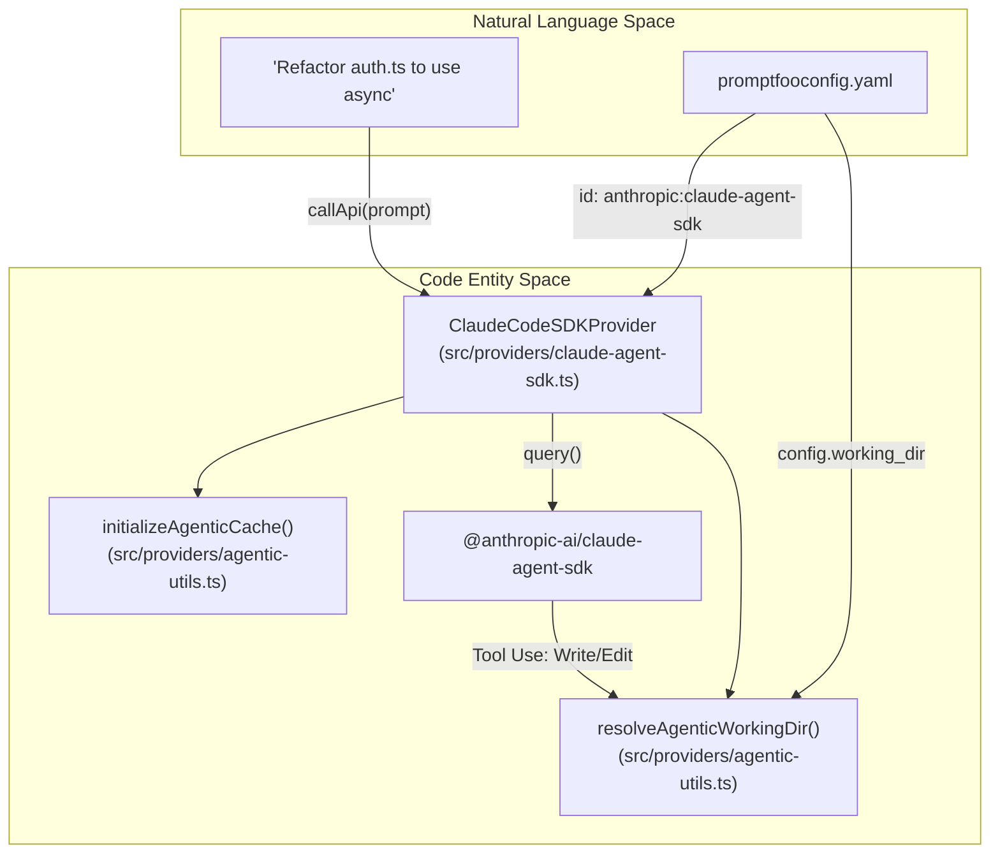
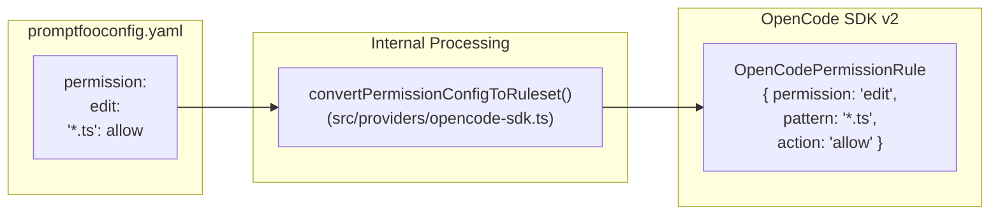

Agent SDK providers enable promptfoo to evaluate complex, multi-step AI agents. Unlike standard completion providers that return a single text response, these providers manage agentic execution lifecycles, including tool use, file system operations, session persistence, and multi-turn reasoning loops.

## Overview of Agentic Execution

Agent SDK providers wrap specialized SDKs (Anthropic Claude Agent SDK, OpenAI Codex SDK, and OpenCode SDK) to expose their agentic capabilities to the promptfoo evaluation engine.

### Key Capabilities
- **Working Directory Management**: Agents operate within a controlled filesystem path, allowing them to read and write files during an evaluation turn [src/providers/agentic-utils.ts:63-100]().
- **Tool & Skill Execution**: Capture and assert on tool calls (e.g., shell commands, filesystem edits, MCP tool usage) [src/providers/claude-agent-sdk.ts:158-201]().
- **Session Persistence**: Reuse session or thread IDs across multiple test cases to evaluate long-term memory and state management [src/providers/openai/codex-sdk.ts:97-101]().
- **Deep Tracing**: Integration with OpenTelemetry to record the "trajectory" of an agent's internal steps as spans [src/providers/claude-agent-sdk.ts:158-201]().

### Data Flow: Natural Language to Agentic Code Entities

The following diagram illustrates how a natural language prompt in a `promptfooconfig.yaml` is transformed into an agentic execution session.

**Agent Execution Pipeline**

Sources: [src/providers/claude-agent-sdk.ts:28-29](), [src/providers/agentic-utils.ts:63-100](), [site/docs/providers/claude-agent-sdk.md:99-112]()

---

## Claude Agent SDK Provider (`ClaudeCodeSDKProvider`)

The `ClaudeCodeSDKProvider` (aliased as `anthropic:claude-code` or `anthropic:claude-agent-sdk`) integrates the Anthropic Claude Agent SDK [src/providers/claude-agent-sdk.ts:14-16](). It supports advanced features like "Extended Thinking" and MCP (Model Context Protocol) tool integration [src/providers/claude-agent-sdk.ts:31]().

### Implementation Details
- **Class**: `ClaudeCodeSDKProvider` [src/providers/claude-agent-sdk.ts:14]().
- **Dependency**: Requires `@anthropic-ai/claude-agent-sdk` [site/docs/providers/claude-agent-sdk.md:24-28]().
- **Permissions**: Supports multiple modes including `default`, `plan`, `acceptEdits`, and `bypassPermissions` [site/docs/providers/claude-agent-sdk.md:120-132]().
- **Models**: Supports model aliases like `claude-3-5-sonnet-latest` and `claude-3-7-sonnet-latest` [src/providers/claude-agent-sdk.ts:13-16]().

### Tool Span Emission
The provider captures internal tool calls and emits them as OpenTelemetry spans using `emitToolSpan`. This allows promptfoo to visualize the agent's trajectory in the UI.

| Function | Purpose |
| :--- | :--- |
| `emitToolSpan` | Creates a child span for a tool call, including input, output, and error status [src/providers/claude-agent-sdk.ts:166-209](). |
| `appendPromptfooResourceAttrs` | Injects promptfoo trace and parent span IDs into the environment for downstream agent processes [src/providers/claude-agent-sdk.ts:109-129](). |
| `FS_READONLY_ALLOWED_TOOLS` | Defines the default set of safe tools (read, list, grep, glob) [src/providers/claude-agent-sdk.ts:15](). |

Sources: [src/providers/claude-agent-sdk.ts:109-209](), [site/docs/providers/claude-agent-sdk.md:15-21]()

---

## OpenAI Codex SDK Provider (`OpenAICodexSDKProvider`)

The `OpenAICodexSDKProvider` (aliased as `openai:codex-sdk`) provides a bridge to OpenAI's agentic coding capabilities [src/providers/openai/codex-sdk.ts:95-112](). It emphasizes thread management and Git-aware safety checks.

### Thread Management
The provider manages conversations via the `Thread` class from `@openai/codex-sdk` [src/providers/openai/codex-sdk.ts:108-112]().
- **Ephemeral Threads**: Created per call by default [src/providers/openai/codex-sdk.ts:109]().
- **Persistent Threads**: If `persist_threads` is enabled, threads are pooled by prompt template and config cache key [src/providers/openai/codex-sdk.ts:110]().
- **Thread Resumption**: Can resume a specific `thread_id` from `~/.codex/sessions` [src/providers/openai/codex-sdk.ts:111]().

### Configuration Parameters
| Parameter | Type | Description |
| :--- | :--- | :--- |
| `sandbox_mode` | `SandboxMode` | Controls filesystem access (`read-only`, `workspace-write`, `danger-full-access`) [src/providers/openai/codex-sdk.ts:117](). |
| `reasoning_effort` | `ReasoningEffort` | Sets reasoning intensity (e.g., `minimal`, `medium`, `xhigh`, `ultra`) [src/providers/openai/codex-sdk.ts:150](). |
| `web_search_mode` | `WebSearchMode` | Controls web access (`disabled`, `cached`, `live`) [src/providers/openai/codex-sdk.ts:158](). |

Sources: [src/providers/openai/codex-sdk.ts:95-163](), [site/docs/providers/openai-codex-sdk.md:19-25]()

---

## OpenCode SDK Provider (`OpenCodeSDKProvider`)

The `OpenCodeSDKProvider` integrates OpenCode, an open-source AI coding agent supporting over 75 LLM providers [src/providers/opencode-sdk.ts:30-51]().

### Architecture
OpenCode uses a client-server model. The promptfoo provider can either connect to an existing server via `baseUrl` or manage a local server lifecycle automatically [src/providers/opencode-sdk.ts:39-44](). It uses `createOpencode` to initialize the environment [src/providers/opencode-sdk.ts:169]().

### Permissions and Rulesets
Promptfoo transforms user-friendly configuration objects into the `PermissionRuleset` array expected by the OpenCode v2 API [src/providers/opencode-sdk.ts:148-156]().

**Permission Mapping Logic**

Sources: [src/providers/opencode-sdk.ts:148-156](), [test/providers/opencode-sdk.test.ts:9-12]()

---

## Shared Agentic Utilities

All agentic providers share a set of core utilities in `src/providers/agentic-utils.ts` to ensure consistent behavior across different SDKs.

### Working Directory Management
`resolveAgenticWorkingDir` determines where the agent will perform its operations. If no `working_dir` is provided in the config, it creates a temporary directory using `os.tmpdir()` and `fs.mkdtempSync` that is cleaned up after execution [src/providers/agentic-utils.ts:28]().

### Caching and State
`initializeAgenticCache` sets up the caching layer for agentic runs. This allows promptfoo to skip expensive agent executions if the prompt, config, and relevant filesystem state have not changed [src/providers/agentic-utils.ts:27]().
- `generateCacheKey`: Creates a unique hash based on the provider, prompt, and configuration [src/providers/opencode-sdk.ts:14]().
- `getCachedResponse`: Retrieves previously stored agent results [src/providers/agentic-utils.ts:26]().

### Skill Comparison
Agent SDK providers enable "Skill Comparison" by pointing different providers at different `working_dir` fixtures, each containing a unique version of a `SKILL.md` file [site/docs/providers/openai-codex-sdk.md:36]().
- **Heuristic Detection**: Promptfoo infers skill usage from direct command references to `SKILL.md` [site/docs/providers/openai-codex-sdk.md:36]().
- **Metadata**: Results include `metadata.toolCalls` for debugging [src/providers/claude-agent-sdk.ts:71-78]().

Sources: [src/providers/agentic-utils.ts:1-100](), [src/providers/claude-agent-sdk.ts:25-29]()

---

## OpenTelemetry (OTEL) Integration

Agent SDK providers integrate with promptfoo's tracing system to provide visibility into the "black box" of agent execution.

### Tracing Flow
1. **Trace Propagation**: The provider retrieves the `traceparent` using `getTraceparent()` from `genaiTracer` [src/providers/claude-agent-sdk.ts:17]().
2. **Resource Attributes**: Promptfoo-specific metadata (`PROMPTFOO_RESOURCE_ATTR_TRACE_ID`, `PROMPTFOO_RESOURCE_ATTR_PARENT_SPAN_ID`) is appended to the environment via `appendPromptfooResourceAttrs` [src/providers/claude-agent-sdk.ts:109-129]().
3. **Span Wrapping**: The `callApi` logic is wrapped in `withGenAISpan` to ensure the entire agent turn is captured as a single high-level span [src/providers/claude-agent-sdk.ts:21]().
4. **Sub-spans**: Internal tool calls are emitted as child spans via `emitToolSpan`, creating a hierarchical view of the agent's reasoning and actions [src/providers/claude-agent-sdk.ts:166-209]().

Sources: [src/providers/claude-agent-sdk.ts:6-22](), [src/providers/claude-agent-sdk.ts:166-209](), [src/tracing/genaiTracer.ts:1-22]()