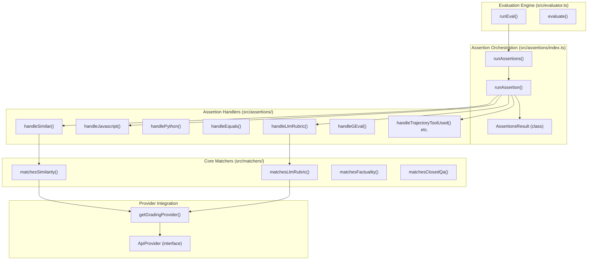
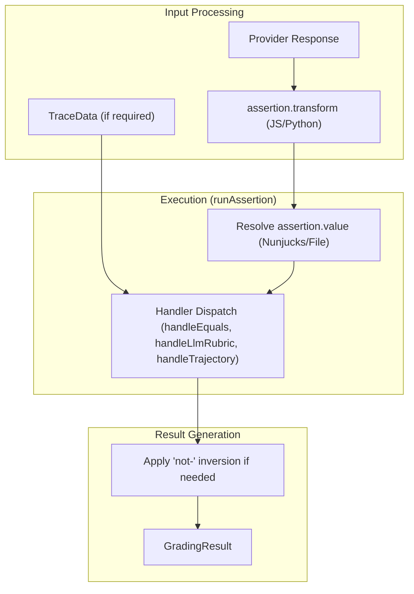

## Purpose and Scope

This document covers promptfoo's assertion and grading system, which validates LLM outputs against expected values or conditions. The system provides both deterministic tests (exact matches, regex patterns, JSON validation) and model-assisted evaluations (similarity scoring, LLM-rubric grading, G-Eval, and trajectory analysis). It handles the execution of individual assertions, the orchestration of assertion sets, and the calculation of final scores and metrics.

For information about the overall evaluation engine that orchestrates these assertions, see [Evaluation Engine](2.1). For configuration syntax and test case setup, see [Test Suite and Configuration](2.2).

## System Overview

The assertion system operates as a layer between the evaluation engine and the actual validation logic, processing LLM outputs through various matching strategies. The `Evaluator` class in `src/evaluator.ts` triggers the assertion engine after receiving a response from a provider.

### Diagram: Assertion Engine Architecture
This diagram bridges the evaluation orchestration in `src/evaluator.ts` to the specialized matching logic in `src/assertions/` and `src/matchers/`.

Sources: [src/evaluator.ts:9-15](), [src/assertions/index.ts:10-20](), [src/assertions/index.ts:47-106](), [src/assertions/index.ts:354-450]()

## Core Components

### Matchers Module

The matchers provide the core logic for model-graded evaluation. Unlike deterministic checks, these functions often require an external LLM provider to compute embeddings or perform qualitative judgment.

**Key matching functions:**

| Function | Purpose | Implementation File |
|---|---|---|
| `matchesSimilarity()` | Embedding-based semantic similarity | `src/matchers/similarity.ts` |
| `matchesLlmRubric()` | Open-ended rubric evaluation via LLM | `src/matchers/llmGrading.ts` |
| `matchesFactuality()` | Factual consistency between output and reference | `src/matchers/llmGrading.ts` |
| `matchesClosedQa()` | Yes/no grading based on specific requirements | `src/matchers/llmGrading.ts` |
| `matchesSelectBest()` | Comparison of multiple outputs | `src/matchers/comparison.ts` |

Sources: [src/assertions/index.ts:10-20](), [src/matchers/llmGrading.ts:12-12](), [src/matchers/similarity.ts:20-20]()

#### `matchesSimilarity()`
Computes numeric similarity between two strings. It attempts to use the provider's `callSimilarityApi` if available; otherwise, it fetches embeddings via `callEmbeddingApi` for both strings and calculates the semantic similarity locally.
Sources: [src/matchers/similarity.ts:20-50]()

#### `matchesLlmRubric()`
Sends the LLM output and a rubric (criteria) to a grading provider. It expects a response containing qualitative judgment. The grading prompt is often context-aware, incorporating the original prompt and variables.
Sources: [src/matchers/llmGrading.ts:12-12]()

### Assertion Orchestration

The `src/assertions/index.ts` module is the entry point for all assertion logic. It manages:
1. **Concurrency**: Executes assertions in parallel up to `PROMPTFOO_ASSERTIONS_MAX_CONCURRENCY` (default 3).
2. **Trace Awareness**: Detects if assertions (like `trace-span-count` or `trajectory:*`) require OpenTelemetry trace data and fetches it if needed via `loadTraceData`.
3. **Type Dispatch**: Maps assertion types (e.g., `equals`, `llm-rubric`, `javascript`) to their respective handlers.

Sources: [src/assertions/index.ts:117-117](), [src/assertions/index.ts:139-151](), [src/assertions/index.ts:179-186]()

## Assertion Types

### Deterministic Assertions
These are logical tests that do not require an LLM to evaluate.

| Type | Description | Handler |
|---|---|---|
| `equals` | Exact string or object equality | `handleEquals` |
| `contains` | Substring check | `handleContains` |
| `regex` | Regular expression match | `handleRegex` |
| `is-json` | Validates JSON and optional schema | `handleIsJson` |
| `javascript` | Custom JS function validation | `handleJavascript` |
| `python` | Custom Python script validation | `handlePython` |
| `latency` | Checks if response time is below threshold | `handleLatency` |
| `cost` | Checks if inference cost is below threshold | `handleCost` |

Sources: [src/assertions/index.ts:47-106](), [site/docs/configuration/expected-outputs/deterministic.md:32-79]()

### Model-Graded Assertions
These require an LLM (the "grader") to determine success. Types are explicitly tracked in `MODEL_GRADED_ASSERTION_TYPES`.

| Type | Description |
|---|---|
| `llm-rubric` | Evaluates output against a human-readable criterion. |
| `factuality` | Compares output to a reference for factual agreement. |
| `g-eval` | Qualitative scoring using Chain of Thought (CoT). |
| `answer-relevance` | Measures how well the response answers the query. |
| `similar` | Semantic similarity via embeddings. |

Sources: [src/assertions/index.ts:125-137](), [site/docs/configuration/expected-outputs/model-graded/index.md:1-38]()

### Trace-Aware Assertions
Assertions that inspect the execution path (trajectory) of an agent or the spans of a trace, defined in `TRACE_AWARE_ASSERTION_TYPES`.

| Type | Description |
|---|---|
| `trajectory:tool-used` | Ensure specific tools were called. |
| `trajectory:tool-args-match` | Validate tool argument payloads. |
| `trajectory:tool-sequence` | Check the order of tool calls. |
| `trace-span-count` | Count spans matching specific patterns. |

Sources: [src/assertions/index.ts:139-151](), [src/assertions/index.ts:93-102]()

## Data Structures

### GradingConfig
The `GradingConfig` defines the environment for model-graded assertions, including the specific weights for factuality scoring and the provider to be used as a judge.

| Property | Type | Description |
|---|---|---|
| `rubricPrompt` | string \| string[] | Custom prompt for the grading LLM. |
| `provider` | string \| ApiProvider | The LLM provider used to perform the grading. |
| `factuality` | object | Weights for `subset`, `superset`, `agree`, `disagree`. |

Sources: [src/types/index.ts:165-190]()

### GradingResult
The final output of an assertion execution, containing the success status and detailed scoring metadata.

| Field | Type | Description |
|---|---|---|
| `pass` | boolean | Whether the assertion succeeded. |
| `score` | number | A value from 0 to 1. |
| `reason` | string | Explanation for the score/result. |
| `tokensUsed` | TokenUsage | Tokens consumed by the grading provider. |
| `assertion` | Assertion | The original assertion configuration. |

Sources: [src/types/index.ts:69-69](), [src/evaluator.ts:69-76]()

## Execution Flow: `runAssertion`

When `runAssertion` is called, it follows a specific data flow to transform raw LLM output and trace context into a `GradingResult`.

### Diagram: Assertion Execution Logic
This diagram shows how `runAssertion` in `src/assertions/index.ts` processes a single test requirement.

Sources: [src/assertions/index.ts:354-450](), [src/assertions/index.ts:153-159](), [src/evaluator.ts:13-15]()

## Grouping with Assertion Sets
Assertions can be grouped using `assert-set`. An `assert-set` passes if a certain `threshold` of its child assertions pass. If no threshold is provided, all must pass.
Sources: [site/docs/configuration/expected-outputs/index.md:59-95]()