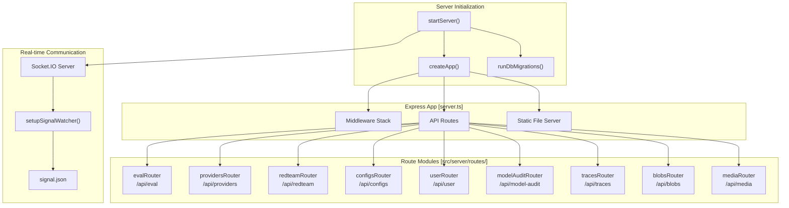
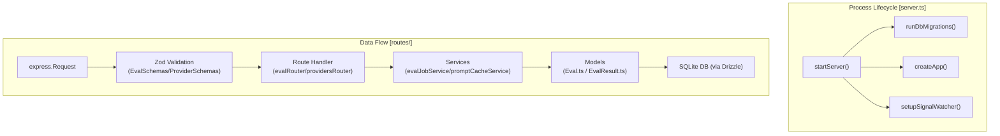
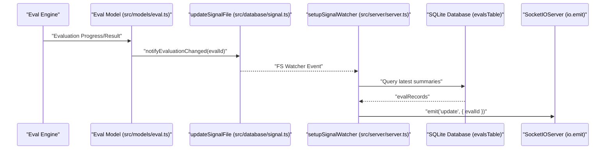
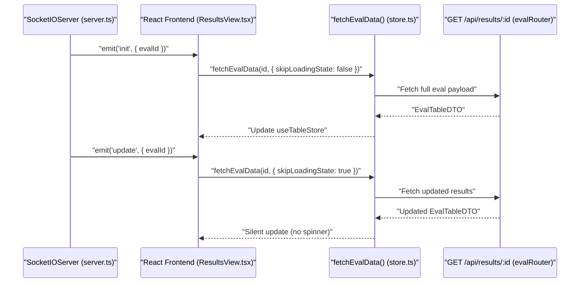
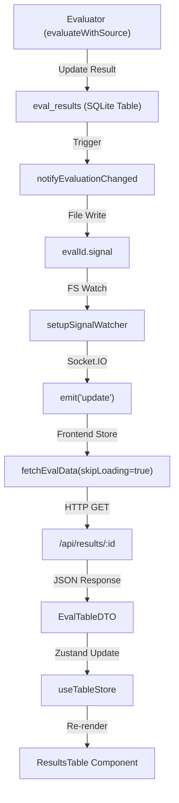

## Purpose and Scope

This document covers the backend Express 5 server that powers promptfoo's web interface. The server provides REST API endpoints for evaluation management, real-time updates via Socket.IO, and serves the React application bundle. Key responsibilities include handling eval CRUD operations, test execution, provider configuration, and red team functionality.

For information about the Results Viewer that consumes these APIs, see page 6.2. For details about real-time updates, see page 6.7.

## Server Architecture

The backend server is built with Express 5 and provides a REST API alongside real-time WebSocket communication. The server architecture follows a modular router pattern with dedicated routes for different functional areas.

### Core Server Components

"Server Architecture and Data Flow"


Sources: `src/server/server.ts:122-195`(), `src/server/server.ts:12-21`(), `src/migrate.ts:1-25`()

## Middleware Configuration

The Express application is configured with several middleware layers that process all incoming requests before they reach route handlers.

### Middleware Stack

Middleware is applied in this order inside `createApp()` [src/server/server.ts:122-131]():

| Middleware | Purpose | Configuration |
|------------|---------|---------------|
| `cors()` | Cross-Origin Resource Sharing | Allows all origins [src/server/server.ts:127]() |
| `csrfProtection` | CSRF token validation | From `src/server/middleware/csrfProtection.ts` [src/server/server.ts:128]() |
| `compression()` | Response body compression | Default settings [src/server/server.ts:129]() |
| `express.json()` | JSON body parsing | Limit: `100mb` [src/server/server.ts:130]() |
| `express.urlencoded()` | URL-encoded body parsing | Limit: `100mb`, extended mode [src/server/server.ts:131]() |
| `setJavaScriptMimeType` | JS MIME type enforcement | Sets `application/javascript` for JS extensions [src/server/server.ts:70-80]() |

The `setJavaScriptMimeType` function [src/server/server.ts:70-80]() handles extensions like `.js`, `.mjs`, and `.cjs` to prevent MIME type enforcement errors in modern browsers.

Sources: `src/server/server.ts:60-80`(), `src/server/server.ts:122-131`()

## API Routes

The server exposes multiple REST API endpoints organized by functional domain. Routes are modularized into separate router files for maintainability.

### Health and Status

| Endpoint | Method | Purpose |
|----------|--------|---------|
| `/health` | GET | Server health check, returns version [src/server/server.ts:132-135]() |
| `/api/remote-health` | GET | Checks remote generation service availability via `checkRemoteHealth` [src/server/server.ts:137-152]() |

### Evaluation Management (`/api/eval`)

The `evalRouter` [src/server/routes/eval.ts:42]() handles the core lifecycle of evaluations.

| Endpoint | Method | Purpose |
|----------|--------|---------|
| `/job` | POST | Creates new async eval job via `evaluateWithSource` [src/server/routes/eval.ts:132-200]() |
| `/job/:id` | GET | Polls job status from `evalJobService` [src/server/routes/eval.ts:202-223]() |
| `/:id/table` | GET | Returns paginated table data with filtering and comparison [src/server/routes/eval.ts:250-310]() |
| `/:evalId/results/:id/rating` | POST | Submits human rating for a specific output [src/server/routes/eval.ts:320-350]() |

#### Table Data Optimization
The table endpoint [src/server/routes/eval.ts:44-130]() handles large responses by stripping per-cell prompts if the JSON payload exceeds string length limits (`RangeError`). It uses a binary search approach to find the maximum number of prompts that can be safely included before the payload becomes too large for `JSON.stringify` [src/server/routes/eval.ts:91-123]().

### Providers Router (`/api/providers`)

The `providersRouter` [src/server/routes/providers.ts:22]() manages LLM provider interactions.

| Endpoint | Method | Purpose |
|----------|--------|---------|
| `/config-status` | GET | Checks if custom provider configurations exist via `getAvailableProviders` [src/server/routes/providers.ts:36-47]() |
| `/test` | POST | Validates provider connectivity via `testProviderConnectivity` [src/server/routes/providers.ts:49-94]() |
| `/discover` | POST | Runs target purpose discovery via `doTargetPurposeDiscovery` [src/server/routes/providers.ts:96-135]() |
| `/http-generator` | POST | Generates HTTP provider config from examples via cloud API [src/server/routes/providers.ts:137-204]() |

### Red Team Router (`/api/redteam`)

The `redteamRouter` [src/server/routes/redteam.ts:34]() handles adversarial test generation.

| Endpoint | Method | Purpose |
|----------|--------|---------|
| `/generate-test` | POST | Generates adversarial test cases using specific plugins/strategies [src/server/routes/redteam.ts:39-182]() |

The generation process uses `redteamProviderManager` [src/server/routes/redteam.ts:92]() and applies strategies to test cases produced by plugin factories [src/server/routes/redteam.ts:97-146](). For multi-turn strategies, it utilizes the `generateMultiTurnPrompt` service [src/server/routes/redteam.ts:163-175]().

Sources: `src/server/routes/eval.ts:1-200`(), `src/server/routes/providers.ts:1-135`(), `src/server/routes/redteam.ts:1-182`()

## Request Validation and OpenAPI

The backend uses **Zod** for strict request and response validation. Schemas are centralized in `src/types/api/`.

### Validation Pattern
Route handlers use `.safeParse()` to validate incoming data. If validation fails, `replyValidationError` is used to return a formatted error message [src/server/utils/errors.ts:22-28]().

```typescript
const result = EvalSchemas.CreateJob.Request.safeParse(req.body);
if (!result.success) {
  res.status(400).json({ error: z.prettifyError(result.error) });
  return;
}
```

### OpenAPI Schema Generation
The system uses centralized Zod schemas such as `ServerSchemas` [src/types/api/server.ts]() and `EvalSchemas` [src/types/api/eval.ts]() to ensure type safety across the API surface. These schemas facilitate the generation of OpenAPI documentation.

Sources: `src/server/routes/eval.ts:133-137`(), `src/server/utils/errors.ts:22-28`(), `src/types/api/server.ts:1-100`()

## Error Handling Utilities

Standardized error handling is provided via specialized utility functions:

- **`handleServerError`**: Used during startup to log and wrap `NodeJS.ErrnoException` into `ServerError` objects [src/server/server.ts:84-92]().
- **`sendError`**: Standardized 500-series error response that logs the full error but returns a sanitized message to the client [src/server/utils/errors.ts:10-20]().
- **`replyValidationError`**: Handles Zod validation failures with a 400 status code [src/server/utils/errors.ts:22-28]().

Sources: `src/server/server.ts:84-92`(), `src/server/utils/errors.ts:1-30`()

## Red Team Generation Service

The `redteamTestCaseGenerationService` provides the underlying logic for the redteam API routes.

- **`generateMultiTurnPrompt`**: Orchestrates the creation of multi-turn adversarial dialogues [src/server/routes/redteam.ts:163-175]().
- **`extractGeneratedPrompt`**: A utility to pull the final string output from a generated `TestCase` object [src/server/routes/redteam.ts:154]().
- **`getPluginConfigurationError`**: Validates if a specific plugin is correctly configured for generation [src/server/routes/redteam.ts:60]().

Sources: `src/server/routes/redteam.ts:60-175`(), `src/server/services/redteamTestCaseGenerationService.ts:1-100`()

## Server Lifecycle and Data Flow

The following diagram associates code entities with the server's lifecycle and data persistence.

"Request Lifecycle and Entity Association"


Sources: `src/server/server.ts:122-195`(), `src/server/routes/eval.ts:132-200`(), `src/models/eval.ts:6-27`(), `src/server/services/evalJobService.ts:1-50`()

# Real-time Updates


This page documents the Socket.IO integration that enables the web UI to reflect in-progress evaluation results without polling. It covers the server-side signal-file mechanism, the Socket.IO event protocol (`init` and `update`), and how the React frontend subscribes and reacts to those events.

For background on the Express server that hosts the Socket.IO server, see page **6.6 Backend Server**. For the Zustand store that holds evaluation table state consumed by the UI, see page **6.3 State Management**.

---

## Overview

Promptfoo's server runs a persistent Socket.IO server alongside the Express HTTP server. As the evaluation engine writes results to the database, it updates a lightweight signal file on disk. A file-system watcher on the server detects these writes, reads the latest eval ID, and broadcasts an `update` event to all connected browser clients. The frontend reconnects to the event stream on page load (receiving an `init` event) and re-fetches evaluation data whenever it receives an `update`.

---

## Server-Side Architecture

### Signal File Mechanism

The evaluation engine and database layer use a signal file to communicate progress to the server process. When an evaluation result is saved or modified, the system calls `notifyEvaluationChanged(id)` [src/models/eval.ts:53](), which triggers `updateSignalFile(id)` [test/models/eval.test.ts:41](). This function writes the current `evalId` to a specific file on disk (typically `.promptfoo/evalId.signal`).

### Socket.IO Server Setup

`startServer` creates the HTTP server and attaches a `SocketIOServer` instance [src/server/server.ts:12]().

The server utilizes `setupSignalWatcher` [src/server/server.ts:19]() to monitor the signal file. When the watcher fires:

1. `readSignalFile()` reads the contents of the signal file [src/server/server.ts:18]().
2. The server determines if an evaluation was updated or deleted using utilities like `hasUnscopedUpdate` [src/server/server.ts:16]() or `isAllEvalsDeleted` [src/server/server.ts:17]().
3. If an update is detected, the server broadcasts to all connected clients via `io.emit('update', { evalId })`.

On new connections, the server typically sends an `init` event with the most recent eval ID so the client can render the latest state immediately.

Sources: [src/server/server.ts:12-21](), [src/models/eval.ts:51-55](), [test/models/eval.test.ts:72-85]()

---

**Diagram: Server-Side Signal and Emit Flow**



Sources: [src/server/server.ts:12-26](), [src/models/eval.ts:51-55]()

---

## Frontend Architecture

### Socket.IO Client and Data Fetching

The web application establishes a Socket.IO connection to the backend to receive live updates. The data flow is managed through the `useTableStore` Zustand store [src/app/src/pages/eval/components/store.ts:12]().

The store provides a `fetchEvalData` function [src/app/src/pages/eval/components/store.ts:207]() which handles the transition between loading states and background updates.

| Parameter | Type | Description |
|-----------|------|-------------|
| `evalId` | `string` | The ID of the evaluation to fetch. |
| `options.skipLoadingState` | `boolean` | If true, updates the store without triggering the UI loading spinner. |

When an `update` event is received by the frontend, it calls `fetchEvalData` with `skipLoadingState: true`. This allows the `ResultsTable` [src/app/src/pages/eval/components/ResultsTable.tsx]() to refresh its content (e.g., updating cost, token usage, or pass rates) silently.

Sources: [src/app/src/pages/eval/components/store.ts:207-220](), [src/app/src/pages/eval/components/ResultsTable.tsx:1-42]()

---

**Diagram: Client-Side Socket Event Handling**



Sources: [src/app/src/pages/eval/components/store.ts:207-220](), [src/server/routes/eval.ts:182-200]()

---

## End-to-End Data Flow

**Diagram: Full Real-Time Update Pipeline**



Sources: [src/server/server.ts](), [src/models/eval.ts](), [src/app/src/pages/eval/components/store.ts](), [src/server/routes/eval.ts]()

---

## Key Symbols Reference

| Symbol | File | Role |
|--------|------|------|
| `createApp` | [src/server/server.ts:122]() | Initializes Express and middleware for the backend. |
| `evalRouter` | [src/server/routes/eval.ts:42]() | Defines the API routes for fetching evaluation tables and jobs. |
| `evalJobService` | [src/server/services/evalJobService.ts]() | Manages in-memory state and progress for active evaluation jobs. |
| `fetchEvalData` | [src/app/src/pages/eval/components/store.ts:207]() | Core frontend logic for fetching evaluation data from the server. |
| `notifyEvaluationChanged` | [src/models/eval.ts:53]() | Utility to trigger the signal mechanism after database mutations. |
| `ResultsTable` | [src/app/src/pages/eval/components/ResultsTable.tsx]() | The primary UI component that renders evaluation results. |

---

## Job Progress Tracking

For evaluations started via the Web UI, the system uses a specific job tracking mechanism. The `evalRouter` handles `POST /api/eval/job` [src/server/routes/eval.ts:132](), which initializes an `evalJobService` instance [src/server/routes/eval.ts:168]().

As the evaluation progresses, the `progressCallback` updates the job status [src/server/routes/eval.ts:179-182](). The frontend can query `GET /api/eval/job/:id` [src/server/routes/eval.ts:202]() to get granular progress percentages before the final `complete` call [src/server/routes/eval.ts:187]() triggers the completion of the evaluation job.

Sources: [src/server/routes/eval.ts:132-202](), [src/server/services/evalJobService.ts]()