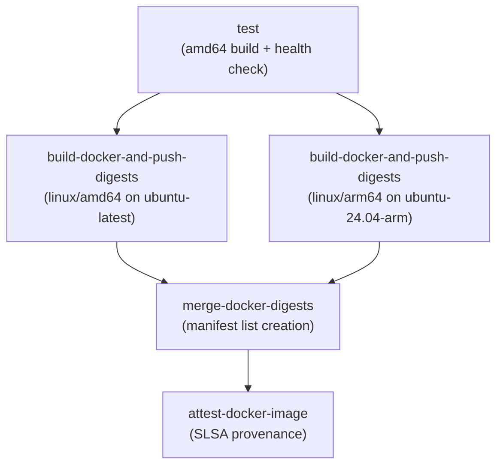
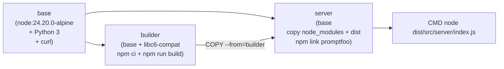
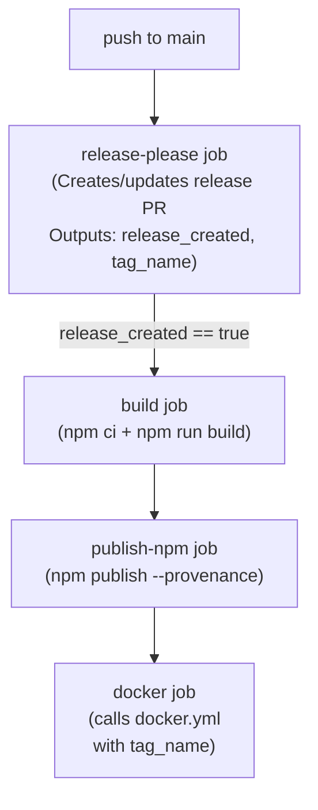

This page documents the GitHub Actions workflows that power promptfoo's continuous integration, automated releases, and Docker image publishing. It covers the job structure of `main.yml`, the multi-architecture Docker build pipeline in `docker.yml`, the `release-please`-driven release process, and the Tusk parallelized test runner workflows.

---

## Workflow Overview

The CI/CD system consists of several primary workflow files:

| File | Trigger | Purpose |
|---|---|---|
| `.github/workflows/main.yml` | PR, push to `main`, `workflow_dispatch` | Core CI: tests, builds, style checks, language checks |
| `.github/workflows/release-please.yml` | push to `main`, `workflow_dispatch` | Automated versioning, npm publish, Docker release |
| `.github/workflows/docker.yml` | `workflow_call`, `workflow_dispatch`, Dockerfile changes | Multi-arch Docker build, health check, GHCR publish |
| `.github/workflows/tusk-test-runner-vitest-unit-tests.yml` | `workflow_dispatch` (Tusk) | Parallelized Vitest tests for `test/` directory |
| `.github/workflows/tusk-test-runner-app-vitest-unit-tests.yml` | `workflow_dispatch` (Tusk) | Parallelized Vitest tests for `src/app/` |

Sources: [.github/workflows/main.yml:1-7](), [.github/workflows/docker.yml:19-43](), [.github/workflows/release-please.yml:1-10]()

---

## Main CI Workflow (`main.yml`)

### Concurrency and Matrix Generation

All runs under the same `github.workflow`/`github.ref` key cancel in-progress runs on PRs [[.github/workflows/main.yml:12-14]](). A dedicated `ci-config` job computes two dynamic matrices:

- **`test-matrix`**: Selects OS/Node/shard combinations. PR runs include one macOS version; `main` branch and dispatch runs expand to all macOS and additional Windows combinations [[.github/workflows/main.yml:32-62]]().
- **`build-matrix`**: PRs and main/dispatch runs select between Node `22.22` (engine floor), `24.x`, and `26.x` [[.github/workflows/main.yml:40-40]]().

**Test matrix: PR vs. main/dispatch**

| Event | Linux (Ubuntu) | macOS | Windows (sharded 1/2/3) |
|---|---|---|---|
| Pull Request | Node 22.22, 24.x, 26.x | Node 22.22 only | Node 22.22 |
| main / dispatch | Node 22.22, 24.x, 26.x | Node 22.22, 24.x | Node 22.22, 24.x, 26.x |

Sources: [.github/workflows/main.yml:32-65]()

### Job Dependency and Flow

**Main CI workflow job graph**

```mermaid
flowchart TD
  ci-config["ci-config\n(Compute matrices)"]
  test["test\n(npm run test, cross-platform)"]
  build["build\n(npm run build)"]
  style-check["style-check\n(Biome + Prettier + circular deps)"]
  python["python\n(ruff + unittest)"]
  docs["docs\n(site typecheck + build)"]
  code-scan-action["code-scan-action\n(tsc + build)"]
  site-tests["site-tests\n(npm test in site/)"]
  webui["webui\n(Vitest + Codecov frontend)"]
  integration-tests["integration-tests\n(npm run test:integration)"]
  smoke-tests["smoke-tests\n(build + test:smoke)"]
  share-test["share-test\n(eval --share + API check)"]
  redteam["redteam\n(test:redteam:integration)"]
  ruby["ruby\n(rubocop + wrapper test)"]
  golang["golang\n(go test)"]

  ci-config --> test
  ci-config --> build
  ci-config --> style-check
  ci-config --> webui
  ci-config --> python
  ci-config --> ruby
  ci-config --> golang
  build --> integration-tests
  build --> smoke-tests
  build --> share-test
  build --> redteam
```

Sources: [.github/workflows/main.yml:18-161]()

### `test` Job

- Runs the matrix produced by `ci-config` [[.github/workflows/main.yml:78-78]]().
- Installs Node `22.22.0` specifically for the `22.22` matrix lane to test the engine floor [[.github/workflows/main.yml:91-91]]().
- Installs Python 3.14.4 and Ruby (4.0.1 on Linux/macOS, 4.0.0 on Windows) [[.github/workflows/main.yml:94-103]]().
- Caches `node_modules` with a key keyed on OS, Node version, and `package-lock.json` hash [[.github/workflows/main.yml:107-112]]().
- On Node `26.x`, installs the tree without scripts then rebuilds `better-sqlite3` to avoid lifecycle script stalls [[.github/workflows/main.yml:114-121]]().
- The test command becomes `npm run test -- --shard=N/3` for Windows shards [[.github/workflows/main.yml:132-132]]().
- Coverage is collected only on Ubuntu + Node `22.22` (non-sharded) and uploaded to Codecov with the `backend` flag [[.github/workflows/main.yml:132-151]]().
- Runs `npm run test:coverage:ratchet -- --report backend` to ensure coverage does not decrease [[.github/workflows/main.yml:136-136]]().

Sources: [.github/workflows/main.yml:71-152](), [package.json:106-106]()

### `build` Job

Runs `npm run build` which executes `concurrently` to run `tsc`, `tsdown`, and `build:app` [[package.json:63-63]](). Verifies the PostHog telemetry key was inlined into `dist/src/*.js` at build time [[.github/workflows/main.yml:157-161]](). The key is injected via `tsdown` (which uses `esbuild` internally) during the build process [[package.json:63-63]](), [[package-lock.json:152-152]]().

Sources: [.github/workflows/main.yml:153-161](), [package.json:63-63]()

---

## Docker Workflow (`docker.yml`)

### Triggers

The workflow runs in four scenarios:
1. Called by `release-please.yml` via `workflow_call` with a `tag_name` input [[.github/workflows/docker.yml:19-24]]().
2. Manual `workflow_dispatch` [[.github/workflows/docker.yml:25-30]]().
3. Release `published` event (human-authored releases) [[.github/workflows/docker.yml:31-33]]().
4. PR or push to `main` where the `Dockerfile` was modified [[.github/workflows/docker.yml:34-43]]().

### Job Pipeline

**Docker workflow job graph**



Sources: [.github/workflows/docker.yml:65-320]()

### Dockerfile Structure

The `Dockerfile` uses a multi-stage build to minimize image size and attack surface.

**Docker Build Stages and Entities**



- **`base`**: Node 24.20.0 Alpine, adds Python 3, creates `promptfoo` user/group [[Dockerfile:2-18]]().
- **`builder`**: Installs all npm deps (`npm ci`), copies source, runs `npm run build` [[Dockerfile:21-53]](). It explicitly blocks lifecycle scripts during `npm ci` and rebuilds only `esbuild` and `@swc/core` [[Dockerfile:40-47]]().
- **`server`**: Copies only `node_modules`, `package.json`, and `dist` from `builder`. Sets `PROMPTFOO_SELF_HOSTED=1`. Entry point: `node dist/src/server/index.js` [[Dockerfile:55-81]]().

Sources: [Dockerfile:1-81]()

---

## Release Process (`release-please.yml`)

### Release Job Flow

The project uses `release-please` to automate versioning based on conventional commits [[.github/workflows/release-please.yml:1-10]]().

**Release pipeline and publishing**



- `npm publish` uses `--provenance` for publish attestation and `--access public` [[.github/workflows/release-please.yml:109-115]]().
- The Docker job is triggered as a `workflow_call` passing `tag_name`, ensuring version parity between npm and GHCR [[.github/workflows/release-please.yml:123-130]]().
- The version is tracked in `.release-please-manifest.json` [[.release-please-manifest.json:1-4]]().

Sources: [.github/workflows/release-please.yml:1-130](), [.release-please-manifest.json:1-4]()

---

## Tusk Parallelized Test Runner

Tusk workflows allow for file-level parallelization of the test suite to reduce overall CI time.

### `tusk-test-runner-vitest-unit-tests.yml`

Targets `test/` directory test files matching `^test/.*\.test\.(js|ts|tsx)$`.
- **`testScript`**: `npx vitest run {{file}} --reporter=verbose` [[.github/workflows/tusk-test-runner-vitest-unit-tests.yml:33-33]]().
- **`coverageScript`**: `npx vitest run {{testFilePaths}} --coverage --coverage.reporter=json-summary --coverage.reporter=json` [[.github/workflows/tusk-test-runner-vitest-unit-tests.yml:34-34]]().

### `tusk-test-runner-app-vitest-unit-tests.yml`

Targets `src/app/` test files matching `^src/app/.*\.(test|spec)\.(js|jsx|ts|tsx)$`.
- **`appDir`**: `src/app` (all commands run relative to this directory) [[.github/workflows/tusk-test-runner-app-vitest-unit-tests.yml:36-36]]().
- **`maxConcurrency`**: `1` (ensures `tsc --incremental` does not conflict) [[.github/workflows/tusk-test-runner-app-vitest-unit-tests.yml:41-41]]().

Sources: [.github/workflows/tusk-test-runner-vitest-unit-tests.yml:1-111](), [.github/workflows/tusk-test-runner-app-vitest-unit-tests.yml:1-137]()

---

## Code Scanning and Quality

- **`promptfoo-code-scan.yml`**: Runs security scans on PRs. It pins Node to `24.15.0` to avoid a Linux HTTPS slowdown regressed in newer versions [[.github/workflows/promptfoo-code-scan.yml:1-31]](), [[renovate.json:48-53]]().
- **`checkArchitectureBoundaries.ts`**: Script executed via `npm run architecture:check` to enforce modularity boundaries [[package.json:58-58]]().
- **`checkCoverageRatchets.ts`**: Script to prevent regression in test coverage by checking against current thresholds [[package.json:106-106]]().
- **`lint:ci`**: Uses Biome for fast linting and formatting checks in CI [[package.json:83-83]]().
- **`package-manifests.test.ts`**: Validates that the `contracts` subpath is correctly exported and extension-safe for ESM [[test/package-manifests.test.ts:103-136]]().

Sources: [package.json:55-112](), [.github/workflows/promptfoo-code-scan.yml:1-31](), [renovate.json:48-53](), [test/package-manifests.test.ts:1-201]()