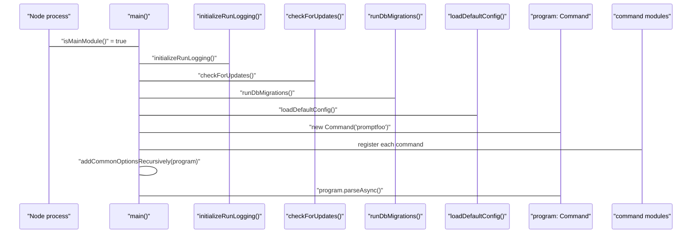
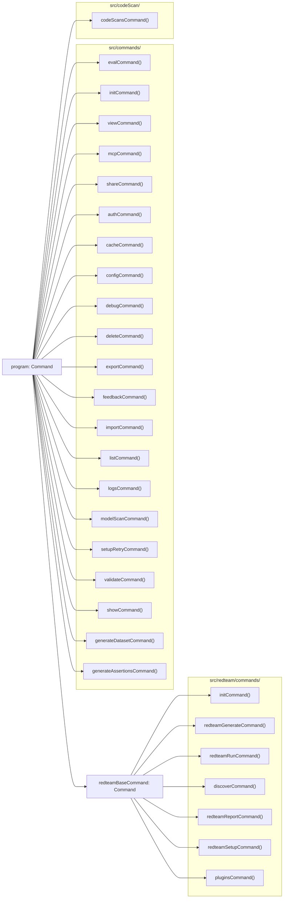
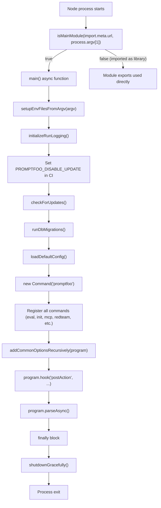
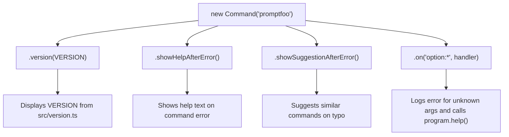
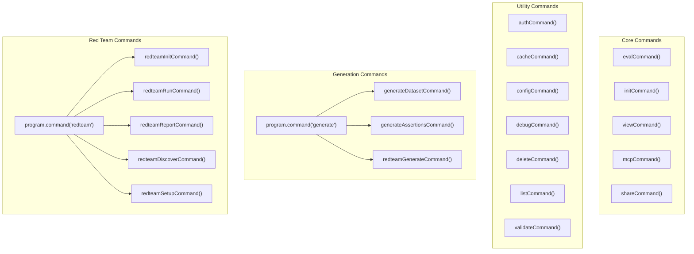

This page documents the architecture and command surface of the `promptfoo` command-line interface — how it is bootstrapped, how commands are registered, and the global mechanisms (option propagation, logging, graceful shutdown) that apply to all commands.

For documentation on the evaluation logic that `promptfoo eval` triggers, see [Eval Command](#4.2). For the red team subcommands in detail, see [Red Team System](#5). For environment variable resolution logic and all `PROMPTFOO_` variables, see [Environment and Logging](#4.4).

---

## Entry Point

The CLI is defined in [src/main.ts](), which exports the `main()` async function and serves as the top-level entry point for the `promptfoo` binary.

The module determines whether it is being run directly using `isMainModule()` [src/mainUtils.ts:34](), which resolves symlinks correctly to handle npm global bin symlinks [src/main.ts:153-158]().

When run as the main module, the sequence is:
1.  **Environment Setup**: Call `setupEnvFilesFromArgv()` and `initializeRunLogging()` [src/main.ts:55-56]().
2.  **Infrastructure**: Check for updates via `checkForUpdates()` [src/main.ts:63]() and run database migrations via `runDbMigrations()` [src/main.ts:64]().
3.  **Config Loading**: Load the default configuration via `loadDefaultConfig()` unless skipped [src/main.ts:66-69]().
4.  **Command Registration**: Initialize the `Commander.js` program and register all commands [src/main.ts:71-135]().
5.  **Execution**: Parse arguments via `program.parseAsync()` [src/main.ts:147]().
6.  **Cleanup**: Call `shutdownGracefully()` in the `finally` block of `main()` to flush telemetry and close resources [src/mainUtils.ts:37]().

For details, see [CLI Architecture](#4.1).

Sources: [src/main.ts:53-176](), [src/mainUtils.ts:34-37]()

---

## Startup Sequence

**Diagram: main() startup sequence**



Sources: [src/main.ts:53-147]()

---

## Command Registration

All commands are registered inside `main()` by calling module-level factory functions that receive the root `program: Command` object and, where needed, `defaultConfig` and `defaultConfigPath` [src/main.ts:87-135]().

**Diagram: command module map (factory function → registered command)**



Sources: [src/main.ts:87-135]()

---

## Common Options — `addCommonOptionsRecursively`

`addCommonOptionsRecursively(command: Command)` walks the entire command tree and attaches global options and a `postAction` hook to every node [src/main.ts:137]().

| Option | Flag | Description |
|--------|------|-------------|
| Verbose | `-v, --verbose` | Show debug logs [site/docs/usage/command-line.md:75]() |
| Env file | `--env-file, --env-path <path>` | Path to a `.env` file (supports multiple) [site/docs/usage/command-line.md:74]() |
| Help | `--help` | Display help information [site/docs/usage/command-line.md:76]() |

The `postAction` hook ensures that error information is printed from `cliState.errorLogFile` and `cliState.debugLogFile` after command completion [src/main.ts:139-145]().

For details, see [CLI Architecture](#4.1).

Sources: [src/main.ts:137-145](), [site/docs/usage/command-line.md:72-77]()

---

## Command Reference

### Primary Evaluation Commands
*   **`eval`**: The core command for running evaluations. It supports extensive filtering, watch mode, and result persistence [src/commands/eval.ts:31-177]().
*   **`retry <evalId>`**: Retries failed or error-prone results from a previous evaluation [src/main.ts:111]().

For details, see [Eval Command](#4.2).

### Utility Commands
*   **`init`**: Scaffolds new projects with prompts and providers [src/commands/init.ts:16]().
*   **`view`**: Starts the local web server to visualize results [src/commands/view.ts:26]().
*   **`share`**: Generates a shareable URL for evaluation results [src/commands/share.ts:23]().
*   **`mcp`**: Starts a Model Context Protocol server to expose tools to AI agents [src/commands/mcp/index.ts:19]().
*   **`auth`**: Manages cloud authentication (login, logout, whoami) [src/commands/auth.ts:13]().
*   **`logs`**: View and list promptfoo log files [src/main.ts:108]().

For details, see [Utility Commands](#4.3).

---

## Environment and Logging

`promptfoo` uses a centralized environment variable management system. The `cliState` singleton maintains the current run's configuration, including paths to log files and the base path for relative file resolution [src/cliState.ts:10-44]().

Logging is handled by a Winston-based logger, supporting different log levels and file-based persistence for debugging [src/logger.ts:22-106](). The `initializeRunLogging()` function sets up the default logging configuration at the start of every execution [src/main.ts:56]().

For details, see [Environment and Logging](#4.4).

---

## Command Lifecycle Diagram

**Diagram: full command lifecycle from invocation to exit**

```mermaid
sequenceDiagram
    participant "shell" as "Shell"
    participant "main.ts:isMainModule" as "isMainModule()"
    participant "main.ts:main" as "main()"
    participant "main.ts:addCommonOptions" as "addCommonOptionsRecursively()"
    participant "program" as "Commander program"
    participant "command module" as "command handler"
    participant "mainUtils.ts:shutdownGracefully" as "shutdownGracefully()"

    "shell"->>"main.ts:isMainModule": "process.argv[1]"
    "main.ts:isMainModule"->>"main.ts:main": "isMain = true" → "await main()"
    "main.ts:main"->>"main.ts:main": "initializeRunLogging()"
    "main.ts:main"->>"main.ts:main": "checkForUpdates()"
    "main.ts:main"->>"main.ts:main": "runDbMigrations()"
    "main.ts:main"->>"main.ts:main": "loadDefaultConfig()"
    "main.ts:main"->>"program": "new Command('promptfoo')"
    "main.ts:main"->>"program": register commands
    "main.ts:main"->>"main.ts:addCommonOptions": "addCommonOptionsRecursively(program)"
    "main.ts:main"->>"program": "program.parseAsync(process.argv)"
    "program"->>"command module": command handler executes
    "program"->>"program": "postAction" hook: "printErrorInformation"
    "main.ts:main"->>"mainUtils.ts:shutdownGracefully": "finally" block
    "mainUtils.ts:shutdownGracefully"->>"mainUtils.ts:shutdownGracefully": "telemetry.shutdown()"
    "mainUtils.ts:shutdownGracefully"->>"mainUtils.ts:shutdownGracefully": "closeLogger()"
    "mainUtils.ts:shutdownGracefully"->>"shell": "process.exit(exitCode)"
```

Sources: [src/main.ts:53-176](), [src/mainUtils.ts:37-126]()

# CLI Architecture


## Purpose and Scope

This document describes the command-line interface architecture of promptfoo, focusing on the initialization flow, command registration system, and integration hooks. The CLI is built on [Commander.js](https://github.com/tj/commander.js/) and serves as the primary entry point for all promptfoo operations. It manages global state, environment loading, and provides a structured lifecycle for executing evaluations, red teaming operations, and utility commands.

## Entry Point and Application Lifecycle

The CLI application starts in `src/main.ts` and follows a structured initialization sequence before executing user commands.

**Initialization Flow**



Sources: [src/main.ts:53-147](), [src/main.ts:153-160]()

The `main()` function orchestrates the entire CLI lifecycle. It performs critical setup operations before parsing commands and ensures proper cleanup afterward:

| Step | Function | Purpose |
|------|----------|---------|
| 1 | `setupEnvFilesFromArgv()` | Loads environment variables from `--env-file` or `--env-path` flags before config loading [src/main.ts:55-55](), [src/mainUtils.ts:32-32]() |
| 2 | `initializeRunLogging()` | Sets up debug and error log files for the session [src/main.ts:56-56](), [src/logger.ts:224-224]() |
| 3 | CI environment check | Sets `PROMPTFOO_DISABLE_UPDATE=true` if `CI` is defined to prevent hanging [src/main.ts:58-61]() |
| 4 | `checkForUpdates()` | Checks npm registry for newer versions [src/main.ts:63-63](), [src/updates.ts:46-46]() |
| 5 | `runDbMigrations()` | Ensures SQLite database schema is current via Drizzle [src/main.ts:64-64](), [src/migrate.ts:39-39]() |
| 6 | `loadDefaultConfig()` | Loads `promptfooconfig.yaml` from default locations [src/main.ts:69-69](), [src/util/config/default.ts:47-47]() |
| 7 | `addCommonOptionsRecursively()` | Adds global flags like `--verbose` and `--env-file` to all commands [src/main.ts:137-137](), [src/mainUtils.ts:124-124]() |
| 8 | `program.parseAsync()` | Parses arguments and executes selected command [src/main.ts:147-147]() |
| 9 | `shutdownGracefully()` | Cleans up resources: telemetry, logger, DB, and worker pools [src/main.ts:178-178](), [src/mainUtils.ts:275]() |

Sources: [src/main.ts:53-178](), [src/mainUtils.ts:32-275]()

## Commander.js Program Configuration

The CLI uses Commander.js to provide a structured command hierarchy with built-in help and error handling.

**Program Setup**



Sources: [src/main.ts:71-85]()

The program is configured with error handling and user assistance features:
- **Version**: Displayed with `--version`, sourced from `src/version.ts` [src/main.ts:73-73]().
- **Help system**: `.showHelpAfterError()` automatically shows help text when commands fail [src/main.ts:74-74]().
- **Command suggestions**: `.showSuggestionAfterError()` suggests similar commands for typos [src/main.ts:75-75]().
- **Option validation**: A custom `option:*` listener catches invalid options, logs the error using `logger.error`, and sets `process.exitCode = 1` [src/main.ts:76-85]().

## Command Registration System

Commands are organized into functional groups and registered with the Commander program during initialization.

**Command Registration Structure**



Sources: [src/main.ts:87-135]()

### MCP Server Command
The `mcpCommand` exposes promptfoo tools via the Model Context Protocol (MCP). This allows AI agents to interact with promptfoo directly.
- **Implementation**: Located in `src/commands/mcp/index.ts` [src/main.ts:19-19]().
- **Tools exposed**: Includes `runEvaluation`, `generateDataset`, `redteamGenerate`, `redteamRun`, `testProvider`, `validatePromptfooConfig`, `compareProviders`, `shareEvaluation`, and `listEvaluations` [site/docs/usage/command-line.md:43-43]().
- **Transport**: Supports both HTTP and stdio transports for agent communication [src/main.ts:92-92]().

Sources: [src/main.ts:19-19](), [src/main.ts:92-92](), [site/docs/usage/command-line.md:43-43]()

## Common Options and Lifecycle Hooks

The `addCommonOptionsRecursively()` function ensures all commands have consistent options and behavior by traversing the entire command tree.

**Common Options Injection**

| Option | Description | Logic |
|--------|-------------|-------|
| `-v, --verbose` | Enable debug logs | Sets log level to `debug` in `preAction` [src/mainUtils.ts:145-148]() |
| `--env-file` | Load `.env` files | Normalized via `normalizeEnvPaths` and loaded via `setupEnv` [src/mainUtils.ts:150-154]() |
| `--help` | Display help | Standard Commander behavior [src/mainUtils.ts:161-161]() |

Sources: [src/mainUtils.ts:124-167]()

### Lifecycle Hooks
- **`preAction`**: Registered on every command. It handles logging levels via `setLogLevel('debug')`, environment variable loading via `setupEnv`, and records telemetry for the command being used [src/mainUtils.ts:143-163]().
- **`postAction`**: Registered on the root program. It prints error/debug log locations if a failure occurred via `printErrorInformation` and executes any `cliState.postActionCallback` [src/main.ts:139-145]().

## Graceful Shutdown

`shutdownGracefully()` is called to ensure all resources are released, whether the process exits normally or via an error.

**Cleanup Sequence**

1. **Force Exit Guarantee**: A 3-second `setTimeout` is created to force exit if cleanup hangs [src/mainUtils.ts:275]().
2. **Telemetry**: Flushes and shuts down the telemetry service [src/mainUtils.ts:275]().
3. **Logger**: Sets `isLoggerShuttingDown = true` and closes log streams [src/mainUtils.ts:275]().
4. **Database**: Closes SQLite connections via `closeDbIfOpen()` [src/mainUtils.ts:275]().
5. **OTEL**: Flushes OpenTelemetry spans via `flushOtel()` [src/mainUtils.ts:275]().
6. **Worker Pools**: Destroys persistent worker pools via `destroyDispatcher()` [src/mainUtils.ts:275]().

Sources: [src/mainUtils.ts:275]()

## CLI State Management

The `cliState` singleton maintains global state across command execution, bridging the CLI entry point with the core evaluation engine.

| Field | Purpose |
|-------|---------|
| `errorLogFile` | Path to the session's error log file [src/cliState.ts:15-15]() |
| `debugLogFile` | Path to the session's debug log file [src/cliState.ts:16-16]() |
| `postActionCallback` | Deferred function to run after CLI completion (e.g., summary generation) [src/cliState.ts:24-24]() |
| `resume` | Flag indicating if the current run is resuming a previous evaluation [src/cliState.ts:20-20]() |

Sources: [src/cliState.ts:1-30](), [src/main.ts:140-143]()