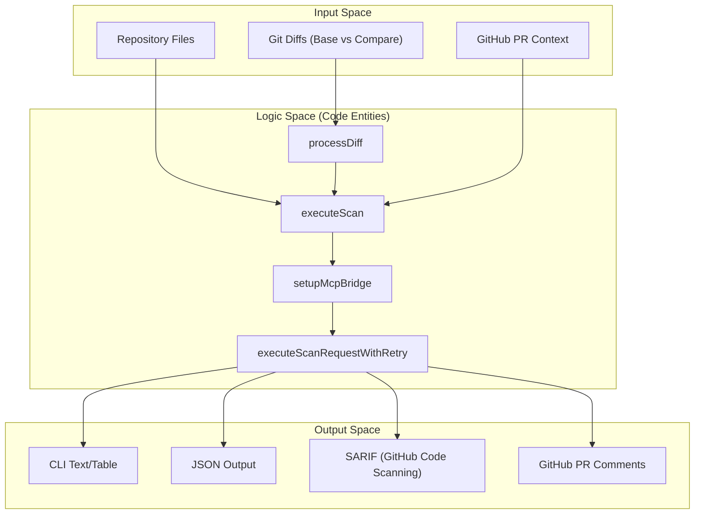
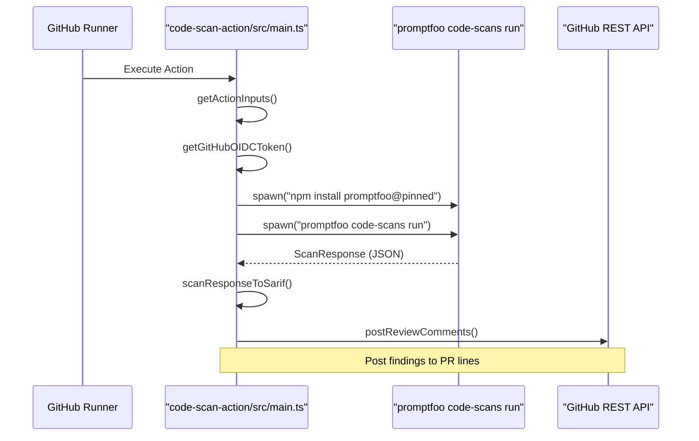

The Code Scanning system in promptfoo provides automated security analysis for LLM-related code. It identifies vulnerabilities such as prompt injection, insecure output handling, and configuration flaws by analyzing source code, git diffs, and integration environments. This functionality is exposed through the `code-scans` CLI command group, a GitHub Action for CI/CD integration, and Model Context Protocol (MCP) tools for agentic workflows.

## Architecture and Data Flow

The code scanning subsystem is organized into several key layers: the core scanning logic in `src/codeScan/`, the CLI entry points in `src/codeScan/commands/`, and external wrappers like the `code-scan-action`.

### High-Level Data Flow
The scanner processes repository content and git metadata, often utilizing a Model Context Protocol (MCP) bridge to allow remote AI agents to explore the filesystem during the analysis phase.

**Code Scanning Pipeline**

**Sources:** [src/codeScan/scanner/index.ts:75-82](), [code-scan-action/src/main.ts:219-245]()

## CLI Command Group

The `code-scans` command group allows users to run security audits locally or in CI. It supports scanning specific directories or analyzing the git state to identify risks introduced in recent changes. The main entry point for the scanner logic is `executeScan`, which orchestrates the entire lifecycle.

### Key Options
| Option | Description | Default |
| :--- | :--- | :--- |
| `--base <ref>` | Base branch/commit to compare against | Auto-detects main/master |
| `--compare <ref>` | Branch/commit to scan | `HEAD` |
| `--diffs-only` | Scan only PR diffs without filesystem exploration | `false` |
| `-f, --format <format>` | Output format: `text`, `json`, or `sarif` | `text` |
| `--guidance <text>` | Custom instructions to tailor the scan's focus | None |

The CLI command implementation for running scans is located in `src/codeScan/commands/run.ts`, while the core logic is handled by `executeScan` in `src/codeScan/scanner/index.ts`.

**Sources:** [src/codeScan/scanner/index.ts:43-57](), [src/codeScan/scanner/index.ts:87-91](), [site/docs/code-scanning/cli.md:46-60]()

## GitHub Action (`code-scan-action`)

The `code-scan-action` is a specialized wrapper that automates scanning within GitHub Workflows. It handles OIDC authentication, fetches PR metadata, and posts findings directly as review comments.

### Implementation Details
The action's entry point is `code-scan-action/src/main.ts`. It utilizes `@actions/github` to interact with the GitHub API and `@actions/exec` to invoke the underlying `promptfoo` binary via the `code-scans run` command. The action pins the `promptfoo` version at build time to ensure consistency [code-scan-action/src/main.ts:14-18]().

**Action Execution Logic**

**Sources:** [code-scan-action/src/main.ts:219-245](), [code-scan-action/src/github.ts:186-193](), [test/code-scan-action/main.test.ts:182-195]()

### Key Functions
- **`getGitHubOIDCToken()`**: Retrieves a GitHub OIDC token for server authentication, allowing passwordless scans [code-scan-action/src/main.ts:30-30]().
- **`partitionReviewCommentsByDiff()`**: Translates scan findings into comments that can be placed on specific lines by checking them against the current PR diff [code-scan-action/src/github.ts:186-193]().
- **`clampCommentToValidRange()`**: Ensures that AI-generated line numbers actually exist within the PR diff by using `clampCommentLines` before attempting to post a comment [code-scan-action/src/github.ts:129-146]().
- **`prepareComments()`**: Constructs the final review body, including the "All Clear" message if no vulnerabilities are found [src/codeScan/util/github.ts:75-121]().

**Sources:** [code-scan-action/src/main.ts:30-30](), [code-scan-action/src/github.ts:129-146](), [src/codeScan/util/github.ts:75-121]()

## MCP-Based Code Scanning

The scanner uses a Model Context Protocol (MCP) bridge to provide AI agents with controlled access to the local filesystem. This is essential for "deep" scans where the agent needs to trace data flows beyond the immediate diff.

- **`setupMcpBridge`**: Orchestrates the connection between the promptfoo server (via Socket.IO) and a local MCP filesystem server [src/codeScan/scanner/index.ts:29-29](), [src/codeScan/scanner/index.ts:194-196]().
- **`stopFilesystemMcpServer`**: Ensures the local MCP server is shut down cleanly after the scan completes [src/codeScan/scanner/index.ts:28-28]().

**Sources:** [src/codeScan/scanner/index.ts:28-29](), [src/codeScan/scanner/index.ts:194-196]()

## Git Diff Analysis

The system utilizes `processDiff` to identify which files and line ranges have changed. This metadata is sent to the scanning engine to focus analysis on the most relevant code.

### File Filtering
The scanner filters files based on several criteria to optimize performance and relevance:
- **`skipReason`**: Files can be skipped if they are in a denylist (e.g., `package-lock.json`) or if the blob is too large [test/codeScans/scanner-no-files.test.ts:11-38]().
- **`includedFiles`**: The logic in `executeScan` filters the result of `processDiff` to only include files that have a patch and no `skipReason` [test/codeScans/scanner-no-files.test.ts:35-37]().

**Sources:** [src/codeScan/scanner/index.ts:26-26](), [test/codeScans/scanner-no-files.test.ts:11-38]()

## Vulnerability Detection and Reporting

Findings are categorized by severity (`critical`, `high`, `medium`, `low`) and can be output in multiple formats including TEXT, JSON, and SARIF.

### SARIF Integration
For integration with GitHub Code Scanning (the "Security" tab), promptfoo converts its internal `ScanResponse` to the SARIF 2.1.0 format.
- **`scanResponseToSarif()`**: Maps `Comment` objects to SARIF `results` [code-scan-action/src/main.ts:20-20]().
- **`hasSarifReportableFindings()`**: Determines if the scan result contains findings that should be included in a SARIF report [code-scan-action/src/main.ts:20-20]().

### Severity Mapping
| CodeScanSeverity | GitHub Display |
| :--- | :--- |
| `CRITICAL` / `HIGH` | 🔴 Error |
| `MEDIUM` | 🟡 Warning |
| `LOW` | 🔵 Note |

Severity ranks are determined by `getSeverityRank` and formatted for display using `formatSeverity`.

**Sources:** [src/codeScan/util/github.ts:7-12](), [src/codeScan/util/github.ts:84-89](), [code-scan-action/src/main.ts:20-20]()