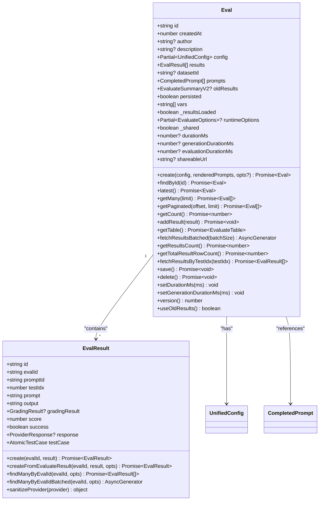
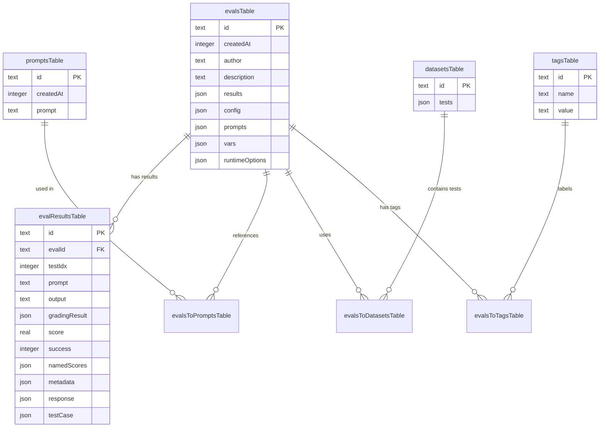
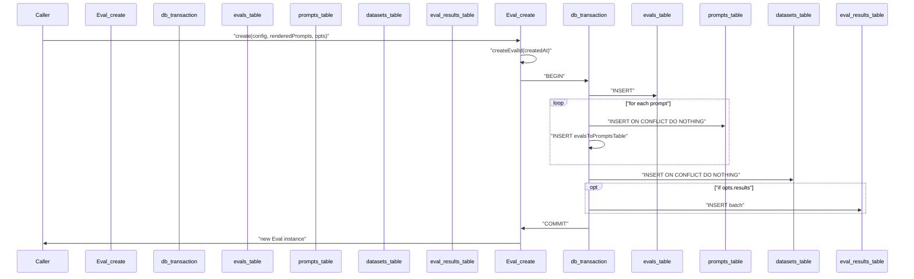
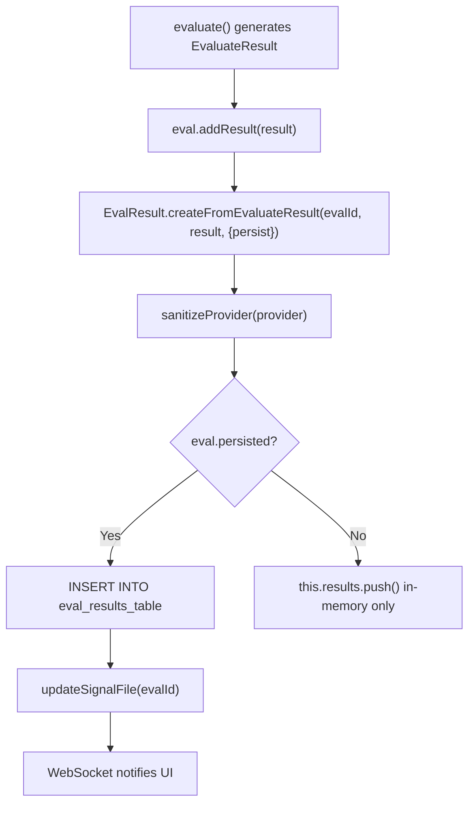
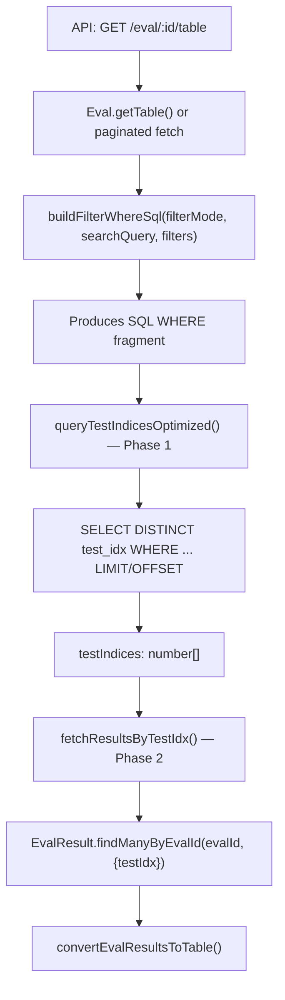
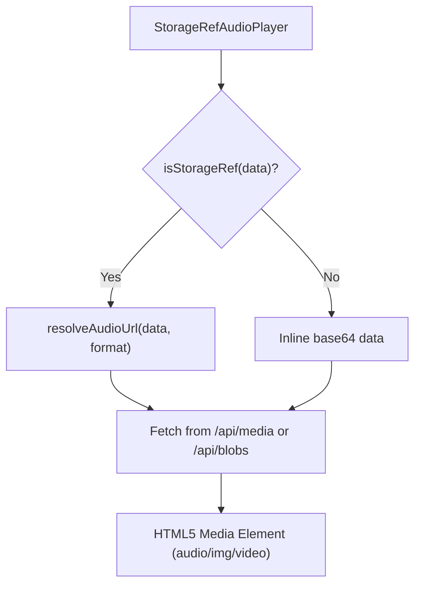

This document covers the core data models used to represent evaluations and their results, the SQLite database schema with Drizzle ORM, and the persistence layer that manages creating, storing, and querying evaluation data. For details on how evaluations are executed and results are generated, see [Evaluation Engine](2.1). For information about how results are displayed in the web UI, see [Results Viewer](6.2).

## Core Data Models

The system uses two primary model classes to represent evaluation data: `Eval` and `EvalResult`.

### Eval Model

The `Eval` class [src/models/eval.ts:317-650]() represents a complete evaluation run with configuration, metadata, and relationships to results.

**`Eval` class — fields and static/instance methods:**

Sources: [src/models/eval.ts:317-650](), [src/models/evalResult.ts:40-265]()

### EvalQueries Static Class

`EvalQueries` [src/models/eval.ts:160-315]() is a static class providing SQL utility queries that operate across multiple `Eval` instances, primarily for metadata and variable discovery:

| Method | Purpose |
|--------|---------|
| `getVarsFromEvals(evals)` | Returns `{evalId: string[]}` map of variable key names per eval [src/models/eval.ts:161-193]() |
| `getVarsFromEval(evalId)` | Returns distinct variable key names for a single eval [src/models/eval.ts:195-206]() |
| `getMetadataKeysFromEval(evalId, comparisonEvalIds?)` | Returns sorted, deduplicated metadata keys using `json_each` [src/models/eval.ts:217-236]() |
| `getMetadataValuesFromEval(evalId, key)` | Returns distinct values for a given metadata key using `json_extract` [src/models/eval.ts:238-274]() |

The metadata queries include safety guards: `json_valid()` checks and escaping via `escapeJsonPathKey` [src/models/eval.ts:109-111]() to prevent malformed data issues.

Sources: [src/models/eval.ts:160-315]()

### EvalResult Model

The `EvalResult` class [src/models/evalResult.ts:40-265]() represents a single test case result within an evaluation. It stores the specific prompt sent, the raw output, and the structured grading result.

| Field | Type | Description |
|-------|------|-------------|
| `evalId` | `string` | Foreign key to parent evaluation [src/models/evalResult.ts:43]() |
| `promptId` | `string` | SHA-256 hash of the prompt [src/models/evalResult.ts:44]() |
| `testIdx` | `number` | Test case index within the eval (0-based) [src/models/evalResult.ts:45]() |
| `prompt` | `string` | Sanitized prompt text sent to the provider [src/models/evalResult.ts:46]() |
| `output` | `string` | Model output text [src/models/evalResult.ts:47]() |
| `gradingResult` | `GradingResult?` | Assertion results and grading metadata [src/models/evalResult.ts:48]() |
| `success` | `boolean` | Overall pass/fail flag [src/models/evalResult.ts:50]() |
| `score` | `number` | Numeric score (0.0–1.0) [src/models/evalResult.ts:49]() |
| `namedScores` | `Record<string, number>` | Custom metric scores [src/models/evalResult.ts:51]() |
| `metadata` | `Record<string, unknown>` | Plugin IDs, strategy IDs, etc. [src/models/evalResult.ts:52]() |
| `testCase` | `AtomicTestCase` | The original test case configuration [src/models/evalResult.ts:54]() |

Sources: [src/models/evalResult.ts:40-265]()

## Database Schema

The system uses SQLite with Drizzle ORM. The schema is defined in `src/database/tables.ts` [src/database/tables.ts:1-200]().

**Database entity-relationship diagram:**

Sources: [src/database/tables.ts:1-200](), [src/models/eval.ts:6-16]()

## Evaluation Creation and Persistence

### Creating an Eval

Evaluations are created using `Eval.create()` [src/models/eval.ts:490-608](), which initializes the eval record and all relationships inside a single database transaction:

**`Eval.create()` transaction sequence:**

Sources: [src/models/eval.ts:490-608]()

### Adding Results

During evaluation execution, results are added incrementally via `eval.addResult()` [src/models/eval.ts:742-755]():

**`addResult()` flow:**

Sources: [src/models/eval.ts:742-755](), [src/models/evalResult.ts:51-141](), [src/database/signal.ts:5]()

## Result Sanitization

Before persisting to the database, several sanitization steps run to prevent credential leaks and circular reference errors:

1.  **`sanitizeProvider()`** [src/models/evalResult.ts:93-131]() — strips circular references from provider objects and handles consistent formatting.
2.  **`sanitizeForDbWithSecrets()`** [src/models/evalResult.ts:177-187]() — redacts credential fields like `apiKey` or `token` at any depth.
3.  **`sanitizeForDb()`** [src/models/evalResult.ts:142-164]() — uses `safeJsonStringify` to handle circular structures and non-serializable values (like Node.js `Timeout` objects) gracefully [src/models/evalResult.ts:147]().
4.  **`sanitizeRuntimeOptions()`** [src/models/eval.ts:79-103]() — removes non-serializable fields from `EvaluateOptions`.

Sources: [src/models/evalResult.ts:93-187](), [src/models/eval.ts:79-103]()

## Versioning System

The system supports two data format versions:

| Version | Description | Detection |
|---------|-------------|-----------|
| **Version 3** | Legacy format — `table` is stored as a blob inside `evalsTable.results` | `oldResults?.table` exists [src/models/eval.ts:650]() |
| **Version 4** | Current format — results stored in `evalResultsTable`; table generated at query time | Default for all new evals [src/models/eval.ts:645]() |

Sources: [src/models/eval.ts:644-654]()

## Querying and Filtering

### Query Pipeline

The server builds paginated `EvaluateTable` responses by determining matching test indices and then fetching result objects.

**Two-phase query pipeline:**

Sources: [src/models/eval.ts:795-900](), [src/models/evalPerformance.ts:48-49](), [src/util/convertEvalResultsToTable.ts:1-100]()

### Filter Types

`buildFilterWhereSql()` [src/models/eval.ts:795-900]() translates `ResultsFilter` entries into parameterized Drizzle `SQL` fragments. It supports filtering by:
*   **Metadata**: Uses `json_extract` on the `metadata` column [src/models/eval.ts:835-843]().
*   **Variables**: Uses `json_extract` on the `test_case.vars` path [src/models/eval.ts:821-829]().
*   **Metrics**: Filters by `namedScores` keys [src/models/eval.ts:845-853]().

JSON field paths are constructed by `buildSafeJsonPath()` [src/models/eval.ts:120-122](), which handles escaping special characters via `escapeJsonPathKey` [src/models/eval.ts:109-111]().

Sources: [src/models/eval.ts:120-122](), [src/models/eval.ts:795-900]()

## Blob Storage for Media Assets

The codebase handles media (audio, images, video) via storage references or base64 strings. Media assets are detected by MIME patterns [src/app/src/pages/eval/components/ResultsTable.tsx:152-155]().

**Media Resolution Flow:**

Sources: [src/app/src/pages/eval/components/ResultsTable.tsx:98-144](), [src/app/src/pages/eval/components/EvalOutputCell.tsx:89-119](), [src/app/src/pages/eval/components/ResultsTable.tsx:152-155]()

## UI State Management

Evaluation data in the web UI is managed by the `useTableStore` Zustand store [src/app/src/pages/eval/components/store.ts:12-215]().

| Action | Purpose |
|--------|---------|
| `fetchEvalData` | Fetches evaluation results from the backend with pagination and filters [src/app/src/pages/eval/components/store.ts:350-420]() |
| `setTable` | Updates the table state after processing raw results [src/app/src/pages/eval/components/store.ts:310-330]() |
| `computeAvailableMetrics` | Extracts unique metric names from the table for filter dropdowns [src/app/src/pages/eval/components/store.ts:55-73]() |

The `ResultsTable` component [src/app/src/pages/eval/components/ResultsTable.tsx:84-2720]() consumes this state to render a paginated view with support for variable markdown cells [src/app/src/pages/eval/components/VariableMarkdownCell.tsx]() and detailed output dialogs [src/app/src/pages/eval/components/EvalOutputPromptDialog.tsx]().

Sources: [src/app/src/pages/eval/components/store.ts:12-420](), [src/app/src/pages/eval/components/ResultsTable.tsx:1-198]()