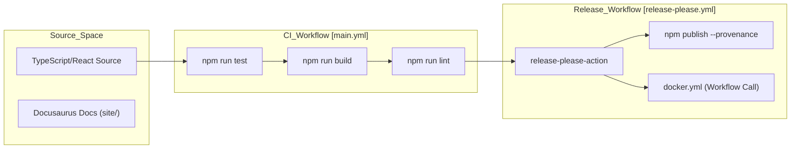
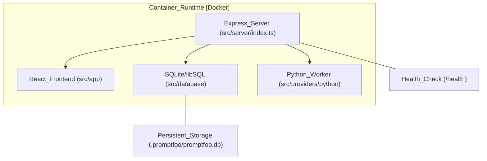

This document provides high-level guidance for contributors to the promptfoo codebase. It covers the development environment, build processes, testing infrastructure, and quality enforcement mechanisms.

For deep technical details on specific subsystems, please refer to the child pages linked throughout this guide.

## Build System and CI/CD

The promptfoo build system is centered around a TypeScript-to-JavaScript compilation process, while the web application is bundled via Vite. The CI/CD pipeline, managed through GitHub Actions, automates testing across multiple Node.js versions (22.22, 24.x, 26.x) and operating systems (Linux, Windows, macOS) [.github/workflows/main.yml:32-60](). The repository currently uses Node 22.22.0 as the floor for engine testing [.github/workflows/main.yml:91]().

The release process is automated using `release-please`, which handles version bumping and changelog generation for both the core `promptfoo` package and the `@promptfoo/code-scan-action` [release-please-config.json:10-28](). Deployment artifacts include npm packages published with OIDC provenance [.github/workflows/release-please.yml:111-113]() and multi-architecture Docker images published to GitHub Container Registry [.github/workflows/docker.yml:64-68]().

For details, see [Build System and CI/CD](#9.1).

**Build and Release Pipeline**

Sources: [.github/workflows/main.yml:32-60](), [.github/workflows/release-please.yml:51-55](), [.github/workflows/docker.yml:64-68](), [release-please-config.json:10-28]()

## Testing Infrastructure

Promptfoo employs a multi-tiered testing strategy to ensure reliability across its core engine and web interface. The codebase utilizes **Jest** for legacy logic and **Vitest** for the React application (`src/app`) and all new test files [site/docs/contributing.md:139-169]().

Testing categories include:
- **Unit Tests**: Isolated component testing. Vitest is mandatory for new files [test/AGENTS.md:169]().
- **Integration Tests**: Cross-component workflows, such as `test:integration` and `test:redteam:integration` [AGENTS.md:65-66]().
- **Smoke Tests**: Validating the **built CLI package** (`dist/src/main.js`) using `spawnSync` to ensure end-to-end functionality [test/AGENTS.md:203-206]().
- **Parallel Execution**: Large suites are sharded in CI [.github/workflows/main.yml:132]() and can be run via the **Tusk test runner** for high-concurrency execution using `Use-Tusk/test-runner` [.github/workflows/tusk-test-runner-app-vitest-unit-tests.yml:57-79]().

For details, see [Testing Infrastructure](#9.2).

Sources: [site/docs/contributing.md:139-149](), [AGENTS.md:63-69](), [.github/workflows/main.yml:130-136](), [test/AGENTS.md:203-206]()

## Code Quality

Code quality is enforced through a combination of linting, formatting, and architectural boundary checks. The project uses **Biome** for high-performance linting and formatting of JavaScript/TypeScript, while **Prettier** remains in use for CSS, Markdown, and YAML files [site/docs/contributing.md:177-186]().

Key quality gates include:
- **Dependency Validation**: Using `npm ci` with specific version overrides (e.g., `npm@11.11.0`) to avoid lockfile compatibility bugs in newer Node versions [.github/workflows/main.yml:124]().
- **Architecture Enforcement**: The project structure separates concerns into directories like `src/providers`, `src/redteam`, `src/commands`, and `src/server` [AGENTS.md:18-35]().
- **Type Safety**: Strict TypeScript compilation via `npm run tsc` or `tsc --build` is required [AGENTS.md:51]().
- **Security Scanning**: Automated adversarial scanning of the codebase itself via the `promptfoo/code-scan-action` which checks for LLM security vulnerabilities in code [.github/workflows/promptfoo-code-scan.yml:52-53]().

For details, see [Code Quality](#9.3).

Sources: [site/docs/contributing.md:125-126](), [AGENTS.md:54-61](), [.github/workflows/main.yml:118-129](), [.github/workflows/promptfoo-code-scan.yml:52-64]()

## Self-Hosting and Deployment

Promptfoo is designed to be easily self-hosted using containerization. The `Dockerfile` provides a build that includes both the Node.js runtime and a Python environment to support various providers.

The deployment architecture is centered on an Express server serving a React frontend and a SQLite database. Key configuration points include:
- **Persistence**: Database state and local configurations are typically stored in the `.promptfoo` directory within the user's home path [AGENTS.md:24-26]().
- **Networking**: The development server runs the Express API on port `15500` and the Vite web UI on port `3000` [site/docs/contributing.md:81-84]().
- **Health Checks**: The server provides a `/health` endpoint to ensure the application and database migrations are ready [.github/workflows/docker.yml:161-167]().

For details, see [Self-Hosting and Deployment](#9.4).

**Deployment Architecture**

Sources: [site/docs/contributing.md:81-84](), [AGENTS.md:18-35](), [.github/workflows/docker.yml:161-167]()