The eval command is the primary interface for running LLM evaluations in promptfoo. It orchestrates the evaluation workflow from configuration loading through test execution to results output. The command is implemented through the `doEval` function which handles configuration resolution, test filtering, evaluation execution, and results processing.

For the underlying evaluation engine that executes tests, see [Evaluation Engine](2.1). For command registration and global CLI architecture, see [CLI Architecture](4.1).

## Command Structure

The eval command is registered via `evalCommand()` which defines CLI options using Commander.js, and executes via `doEval()` which orchestrates the evaluation workflow.

**High-Level Command Flow**

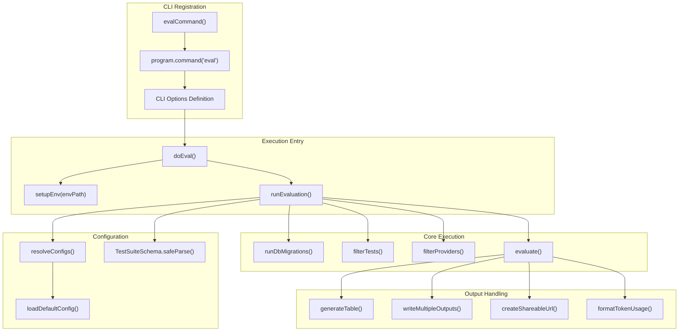

Sources: [src/commands/eval.ts:18-31](), [src/node/doEval.ts:7-40](), [src/main.ts:88-89]()

## Command-Line Options

The `evalCommand` function defines CLI options using Commander.js, with validation via `EvalCommandSchema` and `CommandLineOptionsSchema`.

**Option Categories**

| Category | Options | Description |
|----------|---------|-------------|
| Core Configuration | `-c, --config` | Path to configuration files or cloud config UUID [src/commands/eval.ts:36-39]() |
| | `-p, --prompts` | Paths to prompt files [src/commands/eval.ts:43]() |
| | `-r, --providers` | Provider specifications [src/commands/eval.ts:44-47]() |
| | `-t, --tests` | Path to test cases CSV/YAML [src/commands/eval.ts:48]() |
| Execution Control | `-j, --max-concurrency` | Maximum concurrent API calls [src/commands/eval.ts:88-91]() |
| | `--repeat` | Number of times to run each test [src/commands/eval.ts:92]() |
| | `--delay` | Delay between tests in milliseconds [src/commands/eval.ts:93]() |
| | `--no-cache` | Disable result caching [src/commands/eval.ts:94-98]() |
| | `--remote` | Force remote inference [src/commands/eval.ts:99]() |
| Test Filtering | `-n, --filter-first-n` | Run only first N tests [src/commands/eval.ts:102]() |
| | `--filter-pattern` | Filter tests by description regex [src/commands/eval.ts:103-106]() |
| | `--filter-providers` | Filter by provider regex [src/commands/eval.ts:115-118]() |
| | `--filter-sample` | Random sample of N tests [src/commands/eval.ts:119]() |
| | `--filter-failing` | Re-run failing tests from previous eval [src/commands/eval.ts:122-124]() |
| | `--filter-errors-only` | Re-run error tests only [src/commands/eval.ts:130-132]() |
| | `--filter-metadata` | Filter by metadata key=value [src/commands/eval.ts:133-139]() |
| Output Control | `-o, --output` | Output file paths [src/commands/eval.ts:142-145]() |
| | `--table` / `--no-table` | Display results table in CLI [src/commands/eval.ts:146-147]() |
| | `--share` / `--no-share` | Create shareable URL [src/commands/eval.ts:149-150]() |
| | `--no-write` | Skip writing to database [src/commands/eval.ts:156-160]() |
| Resume/Retry | `--resume [evalId]` | Resume paused evaluation [src/commands/eval.ts:151-154]() |
| | `--retry-errors` | Retry ERROR results from latest eval [src/commands/eval.ts:155]() |
| Other | `-w, --watch` | Watch files and re-run on changes [src/commands/eval.ts:172]() |
| | `--grader` | Override grading provider [src/commands/eval.ts:163-167]() |
| | `--var` | Set variable in key=value format [src/commands/eval.ts:71-78]() |
| | `--suggest-prompts` | Generate prompt suggestions (max 50) [src/commands/eval.ts:168-171]() |

Sources: [src/commands/eval.ts:31-180](), [src/types/index.ts:99-154](), [src/node/doEval.ts:7-10]()

## Main Execution Flow

The `doEval` function orchestrates the evaluation through an inner `runEvaluation` async function. It manages the transition from natural language configuration to code execution entities like `TestSuite` and `Eval` models.

**doEval Execution Pipeline**

```mermaid
graph TD
    doEval["doEval()"] --> setupEnv1["setupEnv(cmdObj.envPath)"]
    setupEnv1 --> runEval["runEvaluation(initialization=true)"]

    runEval --> telemetryStart["telemetry.record('command_used', 'eval - started')"]
    telemetryStart --> migrateCheck{cmdObj.write?}
    migrateCheck -->|Yes| runDbMigrations["runDbMigrations()"]
    migrateCheck -->|No| conflictCheck
    runDbMigrations --> conflictCheck

    conflictCheck{resumeRaw && retryErrors?}
    conflictCheck -->|Yes| error1["Error: Cannot use both"]
    conflictCheck -->|No| modeCheck{Which Mode?}

    modeCheck -->|resumeRaw| resumeFlow["Resume Flow"]
    modeCheck -->|retryErrors| retryFlow["Retry Errors Flow"]
    modeCheck -->|Normal| normalFlow["Normal Flow"]

    resumeFlow --> loadResume["Eval.findById() or Eval.latest()"]
    loadResume --> restoreConfig["resolveConfigs({}, resumeEval.config)"]
    restoreConfig --> restorePrompts["Restore prompts from resumeEval"]
    restorePrompts --> setResumeFlag["cliState.resume = true"]

    retryFlow --> findLatest["latestEval = await Eval.latest()"]
    findLatest --> getErrors["getErrorResultIds(latestEval.id)"]
    getErrors --> deleteErrors["deleteErrorResults(errorResultIds)"]
    deleteErrors --> recalcMetrics["recalculatePromptMetrics(latestEval)"]
    recalcMetrics --> setResumeFlag

    normalFlow --> resolveConfigs["resolveConfigs(cmdObj, defaultConfig)"]

    setResumeFlag --> setupOptions["Setup EvaluateOptions"]
    resolveConfigs --> setupOptions

    setupOptions --> filteringCheck{resumeEval?}
    filteringCheck -->|No| applyFilters["filterTests(), filterProviders()"]
    filteringCheck -->|Yes| skipFilters["Skip filtering"]

    applyFilters --> checkEmail{redteam with tests?}
    skipFilters --> checkEmail
    checkEmail -->|Yes| emailLoop["promptForEmailUnverified() loop"]
    checkEmail -->|No| checkCloud
    emailLoop --> checkCloud["checkCloudPermissions()"]

    checkCloud --> createEvalRecord["Create Eval model instance"]
    createEvalRecord --> runEvaluate["evaluate(testSuite, evalRecord, options)"]

    runEvaluate --> clearResults["evalRecord.clearResults()"]
    clearResults --> checkSharing{wantsToShare?}
    checkSharing -->|Yes| createUrl["createShareableUrl(evalRecord)"]
    checkSharing -->|No| calcMetrics
    createUrl --> calcMetrics["Calculate success/failure metrics"]

    calcMetrics --> displayTable{cmdObj.table?}
    displayTable -->|Yes| genTable["generateTable(table)"]
    displayTable -->|No| writeOutputs
    genTable --> writeOutputs["writeMultipleOutputs(paths, evalRecord)"]

    writeOutputs --> displaySummary["Display evaluation summary"]
    displaySummary --> tokenDisplay["Display token usage"]
    tokenDisplay --> telemetryEnd["telemetry.record('command_used', 'eval')"]

    telemetryEnd --> watchCheck{cmdObj.watch?}
    watchCheck -->|Yes| setupWatch["Setup chokidar watcher"]
    watchCheck -->|No| exitCodeCheck{passRate < threshold?}

    exitCodeCheck -->|Yes| setExitCode["process.exitCode = failedTestExitCode"]
    exitCodeCheck -->|No| cleanup["Cleanup provider connections"]
    setExitCode --> cleanup

    setupWatch --> watchLoop["Watch for file changes"]
    watchLoop --> onFileChange["On change: clearConfigCache(), runEvaluation()"]
```

Sources: [src/node/doEval.ts:7-40](), [src/evaluator.ts:175-220](), [src/main.ts:139-145]()

## Configuration Processing

Configuration loading follows a two-phase approach: Phase 1 loads environment from CLI args, Phase 2 loads environment from config files via `resolveConfigs`.

**Configuration Resolution Flow**

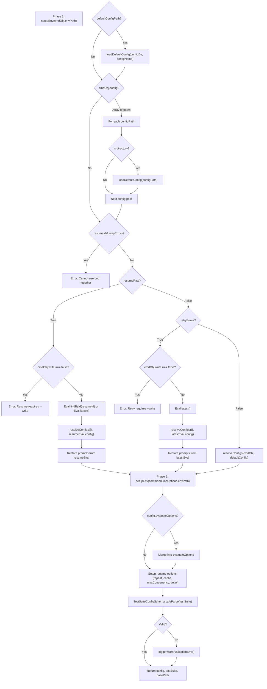

Sources: [src/util/config/load.ts:183-224](), [src/util/config/default.ts:31-59](), [src/types/index.ts:32-35]()

## Test and Provider Filtering

Filtering is only applied when not resuming (to preserve test indices). The command supports multiple filter types implemented in `filterTests` and `filterProviders`.

**Filtering Pipeline**

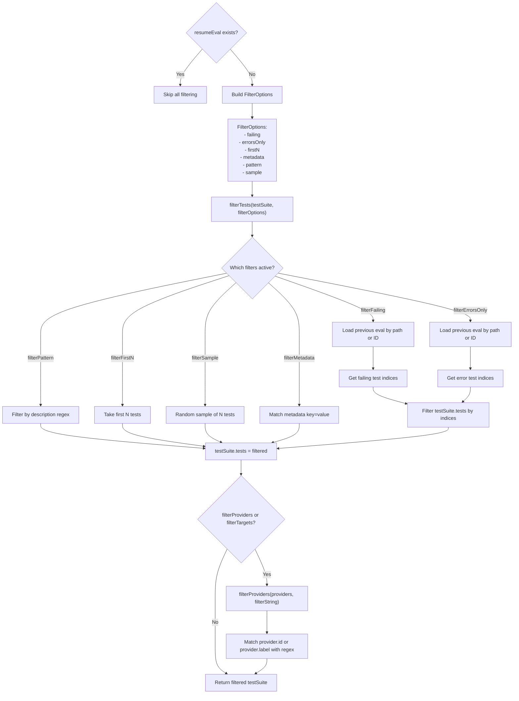

Sources: [src/util/eval/filterTests.ts:11-125](), [src/util/eval/filterProviders.ts:8-37](), [src/util/config/load.ts:42-44]()

## Results Processing and Output

After `evaluate()` completes, `doEval` processes results for display and export. It uses `generateTable` for CLI output and persistence utilities for file export.

**Output Processing Pipeline**

```mermaid
graph TD
    evalComplete["evaluate() returns"] --> clearResults["evalRecord.clearResults()"]

    clearResults --> checkSharing{"wantsToShare?"}
    checkSharing --> determineShare["hasExplicitDisable = cmdObj.share === false || cmdObj.noShare || PROMPTFOO_DISABLE_SHARING"]
    determineShare --> wantsShare["wantsToShare = !hasExplicitDisable && (cmdObj.share || config.sharing || cloudConfig.isEnabled())"]

    wantsShare --> isSharingEnabled{isSharingEnabled(evalRecord)?}
    isSharingEnabled -->|Yes| createUrl["shareableUrl = await createShareableUrl(evalRecord)"]
    isSharingEnabled -->|No| collectMetrics
    createUrl --> setShared["evalRecord.shared = true"]
    setShared --> collectMetrics

    collectMetrics["Calculate metrics from evalRecord.prompts"] --> calcLoop["For each prompt:
    - testPassCount
    - testFailCount
    - testErrorCount
    - tokenUsage"]

    calcLoop --> totals["totalTests = successes + failures + errors
    passRate = (successes / totalTests) * 100"]

    totals --> tableCheck{cmdObj.table && totalTests < 500?}
    tableCheck -->|Yes| getTable["table = await evalRecord.getTable()"]
    tableCheck -->|No| checkOutputPaths
    getTable --> genTable["outputTable = generateTable(table)"]
    genTable --> logTable["logger.info(outputTable.toString())"]
    logTable --> checkTruncate{table.body.length > 25?}
    checkTruncate -->|Yes| logTruncate["logger.info('... N more rows not shown ...')"]
    checkTruncate -->|No| checkOutputPaths

    logTruncate --> checkOutputPaths{outputPath configured?}
    checkOutputPaths -->|Yes| filterPaths["paths = filter out .jsonl paths"]
    checkOutputPaths -->|No| printBorder1
    filterPaths --> writeMultiple["await writeMultipleOutputs(paths, evalRecord, shareableUrl)"]
    writeMultiple --> logOutput["logger.info('Writing output to ...')"]

    logOutput --> printBorder1["printBorder()"]
    printBorder1 --> displayResult{shareableUrl?}
    displayResult -->|Yes| logShare["logger.info('Evaluation complete: ' + shareableUrl)"]
    displayResult -->|No| checkWantsShare{wantsToShare?}

    checkWantsShare -->|Yes,!enabled| notCloudEnabled["notCloudEnabledShareInstructions()"]
    checkWantsShare -->|No| logComplete["logger.info('Evaluation complete. ID: ...')
    + view/share instructions"]

    logShare --> printBorder2
    notCloudEnabled --> printBorder2
    logComplete --> printBorder2["printBorder()"]
```

Sources: [src/index.ts:22-24](), [src/evaluator.ts:87-88](), [src/types/index.ts:104-106]()

## Token Usage Display

Token usage is accumulated and displayed in a hierarchical format with provider breakdown using `TokenUsageTracker`.

**Token Usage Display Structure**

```mermaid
graph TB
    accumulateTokens["accumulateTokenUsage(tokenUsage, prompt.metrics.tokenUsage)"]

    accumulateTokens --> checkTotal{tokenUsage.total > 0?}
    checkTotal -->|Yes| displayHeader["logger.info('Token Usage Summary:')"]
    checkTotal -->|No| skip["Skip token display"]

    displayHeader --> isRedteam{isRedteam?}
    isRedteam -->|Yes| displayProbes["logger.info('Probes: ' + numRequests)"]
    isRedteam -->|No| displayEval
    displayProbes --> displayEval

    displayEval["logger.info('Evaluation:')
    - Total
    - Prompt
    - Completion
    - Cached (if > 0)
    - Reasoning (if > 0)"]

    displayEval --> getProviders["providerIds = tracker.getProviderIds()"]
    getProviders --> checkMultiple{providerIds.length > 1?}

    checkMultiple -->|Yes| sortProviders["Sort providers by total token usage DESC"]
    checkMultiple -->|No| checkGrading

    sortProviders --> loopProviders["For each provider:"]
    loopProviders --> displayProvider["logger.info(provider ID + total + numRequests)"]
    displayProvider --> hasBreakdown{usage.prompt || usage.completion?}
    hasBreakdown -->|Yes| displayDetails["logger.info(breakdown string)"]
    hasBreakdown -->|No| nextProvider
    displayDetails --> nextProvider["Next provider"]
    nextProvider --> checkGrading

    checkGrading{tokenUsage.assertions.total > 0?}
    checkGrading -->|Yes| displayGrading["logger.info('Grading:')
    - Total
    - Prompt
    - Completion
    - Cached (if > 0)
    - Reasoning (if > 0)"]
    checkGrading -->|No| grandTotal

    displayGrading --> grandTotal["grandTotal = evalTokens.total + assertions.total"]
    grandTotal --> displayGrand["logger.info('Grand Total: ' + grandTotal + ' tokens')"]
    displayGrand --> printBorder["printBorder()"]
```

Sources: [src/evaluator.ts:102-111](), [src/util/tokenUsageUtils.ts:103-111](), [src/types/index.ts:4-7]()

## Resume and Retry Logic

The eval command supports two recovery modes: `--resume` for continuing evaluations and `--retry-errors` for re-running specific failures.

### Resume Mode

Resume mode loads a previous `Eval` record and sets `cliState.resume = true`, allowing the evaluator to skip already completed test cases.

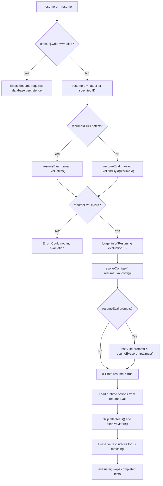

Sources: [src/commands/eval.ts:152-154](), [src/cliState.ts:2-5](), [src/node/doEval.ts:40]()

### Retry Errors Mode

Retry errors mode finds failing tests from the latest run and re-runs them using the resume pipeline.

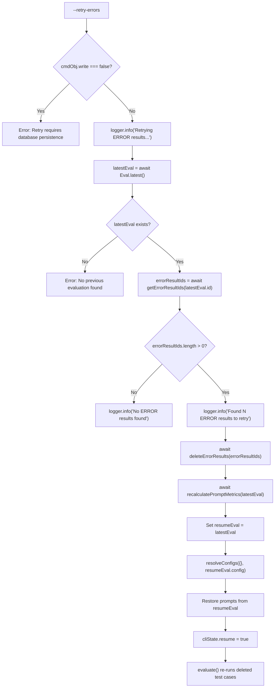

Sources: [src/commands/eval.ts:155](), [src/main.ts:25](), [src/cliState.ts:2-5]()

## Watch Mode

Watch mode (`-w, --watch`) monitors configuration, prompts, and test files, triggering re-evaluation on changes.

**Watch Mode Setup**

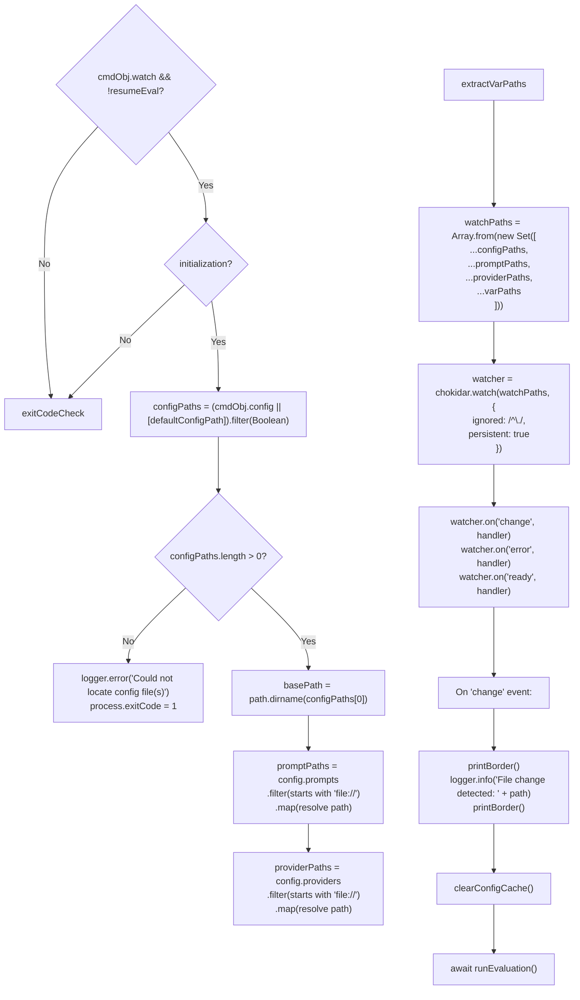

Sources: [src/commands/eval.ts:172](), [src/types/index.ts:126](), [src/util/config/load.ts:54]()

## Error Handling and Exit Codes

The eval command implements error handling with specific exit codes for different failure scenarios. System-level errors use `EvalRunError`.

### Exit Code Strategy

| Condition | Exit Code | Source |
|-----------|-----------|--------|
| Success (Pass Rate >= Threshold) | 0 | CLI Default |
| Pass Rate < Threshold | `PROMPTFOO_FAILED_TEST_EXIT_CODE` (default 100) | [src/envars.ts:20]() |
| System/Configuration Error | 1 | [src/main.ts:84]() |
| No Prompts Selected | 1 | [src/evaluator.ts:137-142]() |

Sources: [src/node/doEval.ts:40](), [src/envars.ts:20](), [src/evaluator.ts:137-142]()

# Utility Commands


This page documents the utility commands available in the promptfoo CLI that support project setup, resource management, result sharing, authentication, and configuration management. These commands provide the infrastructure for the core evaluation and red teaming workflows.

---

## Command Overview

The following utility commands are registered on the root Commander.js program in `main.ts`:

| Command | Source File | Primary Purpose |
|---|---|---|
| `init` | [src/commands/init.ts:214-248]() | Initialize a project or download an example |
| `share` | [src/commands/share.ts:55-205]() | Upload and share eval or model audit results |
| `auth` | [src/commands/auth.ts:251-340]() | Manage cloud authentication and team context |
| `config` | [src/commands/config.ts:1-10]() | Read and write local configuration values |
| `show` | [src/commands/show.ts:174-213]() | Display details of specific evals, prompts, or datasets |
| `list` | [src/commands/list.ts:10-156]() | List evals, prompts, and datasets in the local database |
| `cache` | [src/commands/cache.ts:1-44]() | Manage and clear the provider response cache |
| `delete` | [src/commands/delete.ts:1-30]() | Remove evaluations from the local database |
| `import` | [src/commands/import.ts:1-53]() | Import eval records from JSON or OpenAI Evals formats |
| `export` | [src/commands/export.ts:120-225]() | Export eval records or debug logs |
| `validate` | [src/commands/validate.ts:316-375]() | Validate configurations and provider connectivity |
| `view` | [src/commands/view.ts:1-30]() | Start the local web viewer for results |

**Command hierarchy diagram:**

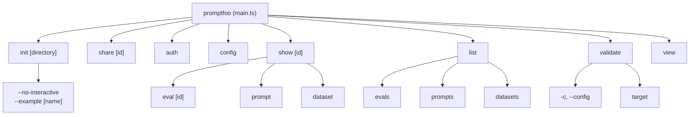

Sources: [src/commands/init.ts:214-248](), [src/commands/show.ts:174-213](), [src/commands/list.ts:10-156](), [src/commands/validate.ts:316-375]()

---

## `init` — Project Initialization

The `init` command bootstraps a new promptfoo project. It supports interactive guided setup and direct example download from the GitHub repository.

### Example Download Flow
When the `--example` flag is used, the CLI interacts with the GitHub API to fetch files from the `examples/` directory of the promptfoo repository [src/commands/init.ts:156-183](). It attempts to use the current package version as a Git ref, falling back to `main` if the version is not found [src/commands/init.ts:188-192]().

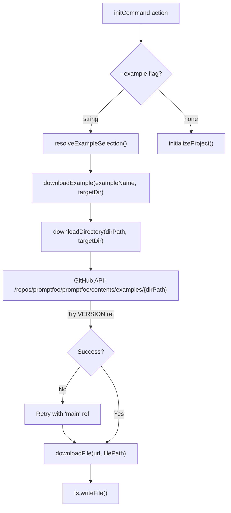

Sources: [src/commands/init.ts:156-183](), [src/commands/init.ts:107-127](), [src/commands/init.ts:210-254]()

### Interactive Onboarding
If no example is specified, `initializeProject` in `src/onboarding.ts` runs a wizard to generate a `promptfooconfig.yaml` [src/onboarding.ts:313-650]().

- **Use Case Selection**: Users choose between `redteam`, `rag`, `agent`, or `compare` [src/onboarding.ts:318-326]().
- **Template Rendering**: Uses `getNunjucksEngine()` to render the `CONFIG_TEMPLATE` [src/onboarding.ts:20-106]().
- **Provider Scaffolding**: Depending on selection, it may create `provider.py`, `provider.js`, or `context.py` files [src/onboarding.ts:385-450]().
- **Red Team Init**: The `redteamInit` function provides a specialized onboarding for adversarial testing, allowing users to define a target purpose and select specific vulnerability plugins [src/redteam/commands/init.ts:202-300]().

Sources: [src/onboarding.ts:313-650](), [src/onboarding.ts:652-691](), [src/redteam/commands/init.ts:202-300]()

---

## `share` — Sharing Results

The `share` command uploads evaluation or model audit results to a remote server (promptfoo cloud or self-hosted) to generate a shareable URL.

### Data Flow for Sharing
The implementation uses a chunked upload mechanism to handle large evaluation records [src/share.ts:213-240](). It supports both standard `Eval` objects and `ModelAudit` records [src/share.ts:22-24]().

1. **Permission Check**: Validates cloud permissions and organization context via `checkCloudPermissions` [src/share.ts:14-17]().
2. **Initial Record**: Sends the base `Eval` metadata (prompts, config, traces) via `sendEvalRecord` [src/share.ts:137-175]().
3. **Result Chunking**: Results are split into batches using `sendChunkedResults` to avoid payload size limits [src/share.ts:213-240]().
4. **Adaptive Resizing**: If a chunk fails due to `PAYLOAD_TOO_LARGE`, the system automatically reduces the chunk size and retries [src/share.ts:37-51]().
5. **Blob Handling**: Large assets are uploaded separately via `uploadBlobRefsForShare` or inlined via `inlineBlobRefsForShare` depending on the storage configuration [src/share.ts:7-19]().

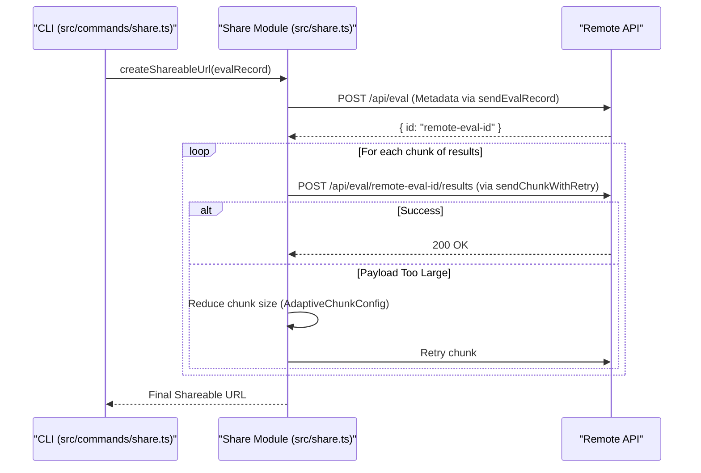

Sources: [src/share.ts:137-211](), [src/share.ts:213-240](), [src/commands/share.ts:25-53](), [src/share.ts:37-51]()

---

## `auth` — Authentication

The `auth` command manages the connection between the CLI and Promptfoo Cloud using the `CloudConfig` singleton [src/globalConfig/cloud.ts:94-124]().

- **Login**: Supports API key login via `validateAndSetApiToken` or browser-based OAuth via `openAuthBrowser` [src/commands/auth.ts:208-250](), [src/util/server.ts:15]().
- **Team Context**: `setupTeamContext` allows users to select a specific team and organization to associate their work with [src/commands/auth.ts:119-206]().
- **Persistence**: Validated tokens, hostnames, and custom auth headers are stored in the global config file via `cloudConfig` [src/globalConfig/cloud.ts:182-205]().
- **Resolution**: The CLI resolves the API host by checking the config file, `PROMPTFOO_CLOUD_API_URL`, and finally defaulting to `https://api.promptfoo.app` [src/globalConfig/cloud.ts:143-163]().

Sources: [src/commands/auth.ts:119-206](), [src/commands/auth.ts:208-250](), [src/globalConfig/cloud.ts:94-216](), [src/util/cloud.ts:27-43]()

---

## `show` and `list` — Data Inspection

These commands interact with the SQLite database via Drizzle ORM to display historical results.

### `show` Command
`handleEval(id)` fetches an evaluation by ID using `Eval.findById(id)` [src/commands/show.ts:81-82](). It then uses `generateTable()` from `src/table.ts` to render the results in the terminal [src/commands/show.ts:93](). The table generator handles ANSI colors for PASS/FAIL status and ellipsizes long outputs [src/table.ts:30-43]().

### `list` Command
Lists resources stored in the database:
- **Evals**: Uses `Eval.getMany()` [src/commands/list.ts:29]().
- **Prompts**: Uses `getPrompts()` [src/commands/list.ts:72]().
- **Datasets**: Uses `getTestCases()` [src/commands/list.ts:114]().

Sources: [src/commands/show.ts:81-123](), [src/commands/list.ts:10-156](), [src/table.ts:7-48]()

---

## `validate` — Configuration & Provider Testing

The `validate` command ensures that your configuration is syntactically correct and that providers are reachable.

- **Config Validation**: Validates `promptfooconfig.yaml` against the `UnifiedConfigSchema` [src/commands/validate.ts:273-290]().
- **Connectivity Testing**: `testProviderConnectivity` attempts a simple API call to verify credentials and network access [src/server/routes/providers.ts:71-75]().
- **Cloud Provider Resolution**: If a provider ID is a UUID, the system attempts to fetch the configuration from Promptfoo Cloud via `getProviderFromCloud` [src/util/cloud.ts:51-80]().

Sources: [src/commands/validate.ts:273-290](), [src/server/routes/providers.ts:49-94](), [src/util/cloud.ts:51-80]()

---

## MCP Server Tools

Promptfoo exposes its utility functions to AI agents via the Model Context Protocol (MCP) [src/commands/mcp/server.ts]().

| MCP Tool | Implementation File | Role |
|---|---|---|
| `runEvaluation` | [src/commands/mcp/tools/runEvaluation.ts]() | Triggers a full evaluation pipeline |
| `testProvider` | [src/server/routes/providers.ts:49-94]() | Verifies connectivity for a specific provider config |
| `redteamGenerate` | [src/redteam/commands/generate.ts]() | Generates adversarial test cases |
| `targetDiscovery` | [src/redteam/commands/discover.ts]() | Runs the Target Discovery Agent to map an LLM's purpose |
| `validatePromptfooConfig` | [src/commands/validate.ts]() | Validates a configuration object |

### Target Discovery Agent
The `doTargetPurposeDiscovery` function uses an iterative probing mechanism to identify a target's purpose, limitations, and tools [src/redteam/commands/discover.ts:149-158](). It communicates with the target provider over multiple turns [src/redteam/commands/discover.ts:102-103]().

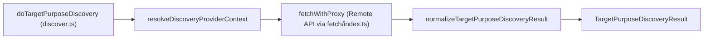

Sources: [src/redteam/commands/discover.ts:114-130](), [src/redteam/commands/discover.ts:149-158](), [src/server/routes/providers.ts:96-135]()

---

## Logging Infrastructure

The `logger.ts` utility provides a unified logging interface wrapping `winston` [src/logger.ts:185-201]().

- **Sanitization**: Automatically redacts sensitive information like Azure Blob SAS tokens and API keys using `redactAzureBlobSasTokens` and `sanitizeObject` [src/logger.ts:11](), [src/share.ts:144-146]().
- **Location Tracking**: In debug mode, the logger captures the caller's file and line number via `getCallerLocation` [src/logger.ts:97-126]().
- **Formatters**: Provides `consoleFormatter` for terminal output and `fileFormatter` for persistent logs [src/logger.ts:151-183]().

Sources: [src/logger.ts:97-201](), [src/share.ts:144-146](), [test/logger.test.ts:179-202]()

# Environment and Logging


This document describes the environment variable management and logging systems in promptfoo. These systems provide consistent configuration handling across the CLI, web UI, and library usage, along with structured logging for debugging and troubleshooting.

## Environment Variable System

promptfoo uses a centralized environment variable management system implemented in `[src/envars.ts]()`. This system provides type-safe access to over 200 environment variables used for feature flags, provider configuration, and system behavior tuning.

### Resolution Hierarchy

Environment variables are resolved in a two-tier hierarchy. This allows configuration files to override system environment variables through the `env` property in the test suite configuration. The CLI state is checked first via `cliState.config.env` `[src/cliState.ts:13-13]()`, followed by `process.env`. The system also utilizes `dotenv` to load variables from `.env` files at startup `[src/envars.ts:6-6]()`.

**Natural Language to Code Entity Space: Environment Resolution**

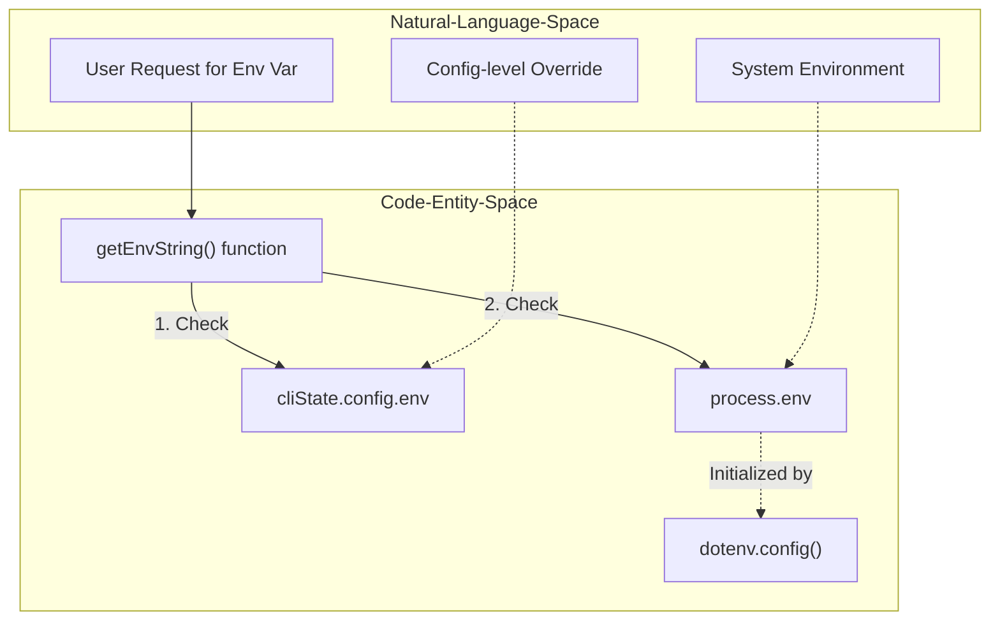

**Sources:** `[src/envars.ts:1-7]()`, `[src/envars.ts:368-386]()`, `[src/cliState.ts:1-20]()`

### Type-Safe Accessor Functions

The system provides four type-safe accessor functions, all exported from `[src/envars.ts]()`. These functions handle the conversion from string-based environment variables to internal TypeScript types:

| Function | Return Type | Parsing Logic |
|----------|-------------|---------------|
| `getEnvString()` | `string \| undefined` | Returns raw string value or default `[src/envars.ts:368-386]()` |
| `getEnvBool()` | `boolean` | Accepts: `"1"`, `"true"`, `"yes"`, `"yup"`, `"yeppers"` `[src/envars.ts:394-411]()` |
| `getEnvInt()` | `number \| undefined` | Uses `Number.parseInt()` with base 10 `[src/envars.ts:419-431]()` |
| `getEnvFloat()` | `number \| undefined` | Uses `Number.parseFloat()` `[src/envars.ts:439-447]()` |

### Environment Variable Categories

Environment variables are defined in the `EnvVars` type definition `[src/envars.ts:9-357]()`. This type serves as the central registry for all supported keys (e.g., `EnvVarKey`).

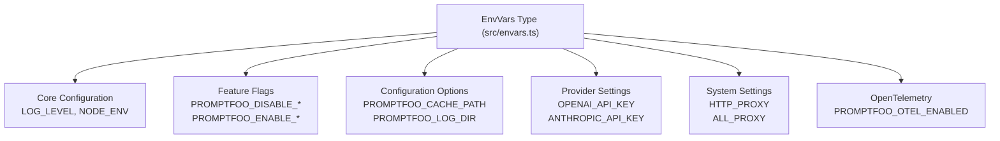

**Sources:** `[src/envars.ts:9-169]()`

#### Key Feature Flags
- `PROMPTFOO_DISABLE_TELEMETRY`: Opt out of anonymous usage tracking `[src/envars.ts:56-56]()`.
- `PROMPTFOO_DISABLE_REDTEAM_REMOTE_GENERATION`: Disable remote generation for red team features `[src/envars.ts:51-51]()`.
- `PROMPTFOO_OTEL_ENABLED`: Enable OpenTelemetry tracing for LLM provider calls `[src/envars.ts:89-89]()`.
- `PROMPTFOO_CACHE_ENABLED`: Toggles evaluation caching `[src/envars.ts:21-21]()`.

## Logging System Architecture

The logging system is built on `winston` and provides structured, level-based logging with automatic file rotation and location tracking.

### Core Components

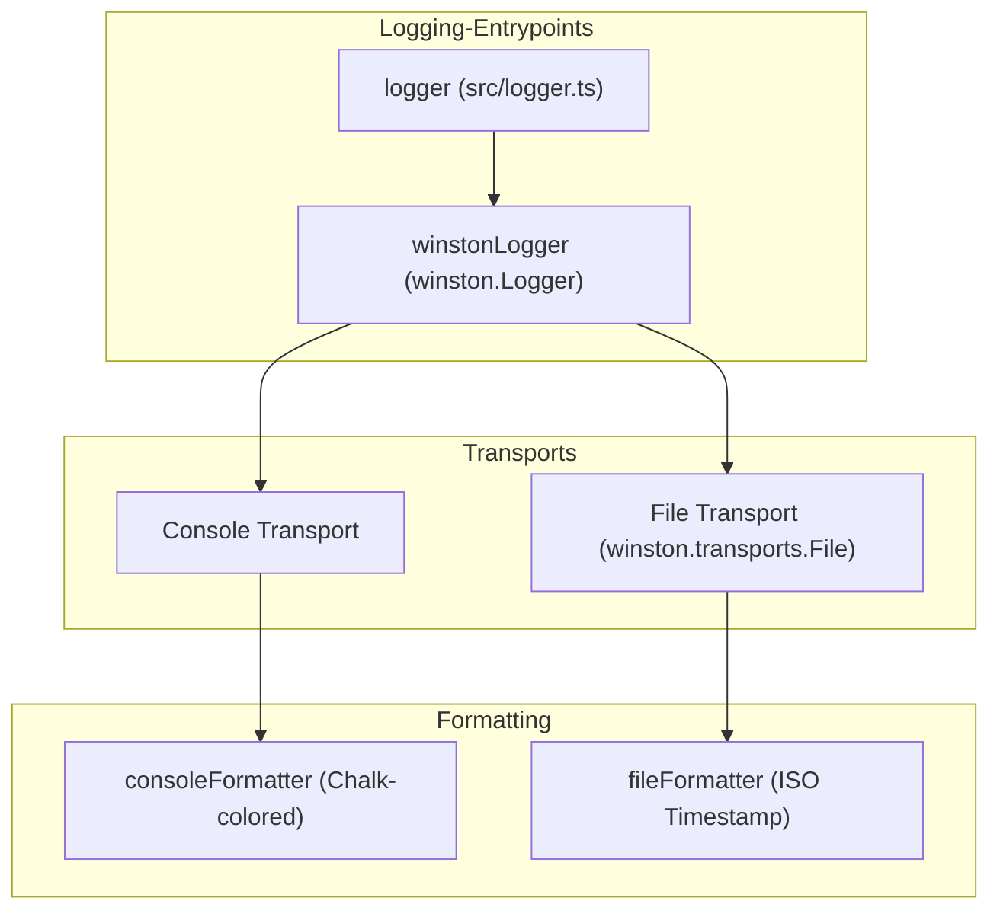

**Sources:** `[src/logger.ts:151-201]()`

### Log Levels

The system defines four log levels in `LOG_LEVELS` `[src/logger.ts:35-40]()`:
- `error` (0): Critical errors, displayed in red.
- `warn` (1): Warnings, displayed in yellow.
- `info` (2): Informational messages (default).
- `debug` (3): Detailed debugging information, displayed in cyan.

### Per-Run Log Files

The system supports file-based logging for troubleshooting.
- **Log Directory**: Configured via `PROMPTFOO_LOG_DIR` or defaults to the config directory `[src/logger.ts:131-131]()`.
- **Rotation**: The system retains up to 50 log files (`MAX_LOG_FILES`), deleting the oldest first `[src/logger.ts:13-13]()`.
- **Stderr Routing**: Commands that print machine-readable payloads (like SARIF) use `PROMPTFOO_LOG_TO_STDERR` to ensure logs do not corrupt stdout `[src/logger.ts:191-197]()`.

### Caller Location Tracking

The `getCallerLocation()` function extracts file and line information from the call stack for debug logs `[src/logger.ts:97-126]()`. It parses the stack trace to identify the actual source code location, skipping internal logger frames.

**Natural Language to Code Entity Space: Debug Location Tracking**

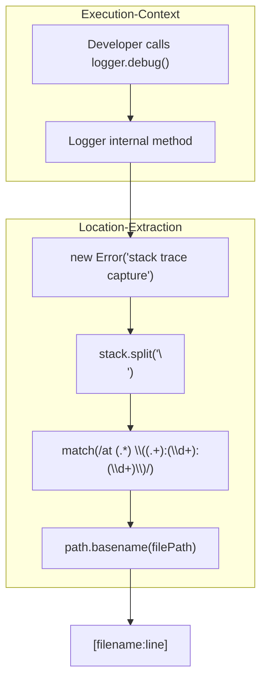

**Sources:** `[src/logger.ts:97-126]()`

### Specialized Logging Features

- **Source Map Support**: The system lazily loads `source-map-support` via `initializeSourceMapSupport()` when debug is enabled to map TypeScript stack traces back to the original source `[src/logger.ts:73-91]()`.
- **Structured Logging**: Can be enabled via `setStructuredLogging(true)`, allowing machine-readable JSON output `[src/logger.ts:31-33]()`.
- **Log Callback**: A global `globalLogCallback` can be registered via `setLogCallback()` to intercept log messages, primarily used by the Web UI to stream logs `[src/logger.ts:16-20]()`.
- **Sanitization**: The logger includes `SanitizedLogContext` and uses `sanitizeObject` and `sanitizeUrl` to ensure sensitive data like API keys or PII are not leaked into log files `[src/logger.ts:48-54]()`, `[src/logger.ts:11-11]()`.

## Telemetry System

The `Telemetry` class in `[src/telemetry.ts]()` handles anonymous usage tracking.

- **Client**: Uses `posthog-node` for event capture `[src/telemetry.ts:1-3]()`.
- **Opt-out**: Controlled by `PROMPTFOO_DISABLE_TELEMETRY` `[src/telemetry.ts:107-108]()`.
- **Initialization**: The singleton is initialized with a unique ID from `getUserId()` `[src/telemetry.ts:63-69]()`.
- **Events**: Events are sent to both PostHog and a backup endpoint `R_ENDPOINT` `[src/telemetry.ts:136-175]()`.

**Sources:** `[src/telemetry.ts:53-222]()`, `[src/globalConfig/accounts.ts:63-73]()`

## Environment Variables Reference (Summary)

| Variable | Purpose |
|----------|---------|
| `LOG_LEVEL` | Sets verbosity: `error`, `warn`, `info`, `debug` `[src/envars.ts:13-13]()` |
| `PROMPTFOO_CACHE_PATH` | Custom path to evaluation cache `[src/envars.ts:118-118]()` |
| `PROMPTFOO_EVAL_TIMEOUT_MS` | Global timeout for individual provider calls `[src/envars.ts:63-63]()` |
| `PROMPTFOO_LOG_DIR` | Directory for file-based logs `[src/envars.ts:131-131]()` |
| `PROMPTFOO_LOG_TO_STDERR` | Redirects console logs to stderr `[src/envars.ts:132-132]()` |
| `PROMPTFOO_OTEL_ENABLED` | Enables OpenTelemetry tracing `[src/envars.ts:89-89]()` |
| `PROMPTFOO_DISABLE_SHARING` | Disables result sharing functionality `[src/envars.ts:55-55]()` |

**Sources:** `[src/envars.ts:9-155]()`, `[src/logger.ts:189-197]()`

# Red Team System


The Red Team System is promptfoo's adversarial testing framework for identifying vulnerabilities in LLM applications. It automatically generates malicious inputs using specialized plugins, applies attack strategies like jailbreaks and prompt injections, and evaluates target systems for security weaknesses across 50+ vulnerability categories including privacy leaks, harmful content generation, and access control bypasses [site/docs/red-team/quickstart.md:16-21]().

This page is a system-level overview. Detailed documentation is split across subsections:

| Subsection | Topic |
|---|---|
| [Red Team Architecture](#5.1) | Overall design, key concepts, vulnerability categories |
| [Test Generation and Configuration](#5.2) | `synthesize()`, `SynthesizeOptions`, plugin/strategy expansion |
| [Plugins and Metadata](#5.3) | Plugin registry, builtin plugins, custom plugin authoring |
| [Strategies](#5.4) | Attack transformation strategies, `jailbreak`, `prompt-injection`, etc. |
| [Attack Providers](#5.5) | Iterative attack providers: `CrescendoProvider`, `GoatProvider`, etc. |
| [Graders and Evaluation](#5.6) | `RedteamGraderBase`, rubric rendering, result suggestions |
| [Red Team Commands](#5.7) | CLI subcommands: `init`, `generate`, `run`, `discover`, `report` |
| [Provider Manager and Shared Utilities](#5.8) | `redteamProviderManager`, `getTargetResponse()`, runtime transforms |

For information about the evaluation engine that executes red team tests, see page 2.1. For provider integration details, see page 3.

## System Architecture

The Red Team System orchestrates test generation through a plugin-strategy pipeline, where plugins generate base adversarial inputs and strategies transform them into sophisticated attacks [site/docs/red-team/index.md:44-51]().

### Red Team High-Level Flow
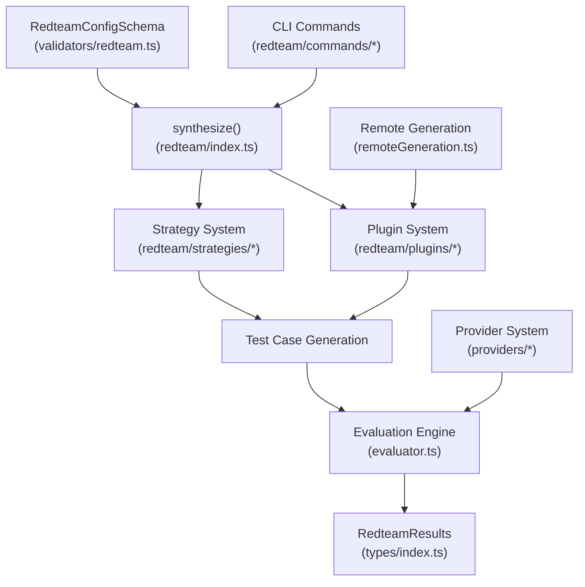

**Sources:** [src/redteam/index.ts:1-100](), [src/redteam/commands/generate.ts:1-66](), [src/validators/redteam.ts:1-60](), [src/redteam/shared.ts:1-50]()

## Core Components

### Synthesis Engine

The `synthesize()` function in [src/redteam/index.ts:700]() is the central orchestrator, coordinating plugin execution, strategy application, and test case assembly. It manages concurrency, progress tracking, and data flow between components.

### Synthesis Data Flow
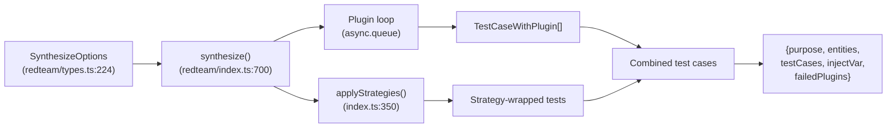

Key responsibilities:
- **Plugin validation**: Inline `validatePlugin` function at [src/redteam/index.ts:982-1009]() filters unregistered or invalid plugins before execution.
- **Concurrency management**: Uses `async.queue` with the `maxConcurrency` parameter, capped by `MAX_MAX_CONCURRENCY` at [src/redteam/index.ts:187]().
- **Progress tracking**: Updates `cli-progress` bars during generation [src/redteam/index.ts:1112-1119]().
- **Strategy orchestration**: Calls `applyStrategies()` at [src/redteam/index.ts:350-567]() after all plugin test cases are generated.
- **Test counting**: `calculateTotalTests()` at [src/redteam/index.ts:621-686]() pre-calculates expected test counts for display.

**Sources:** [src/redteam/index.ts:187-187](), [src/redteam/index.ts:350-567](), [src/redteam/index.ts:621-686](), [src/redteam/index.ts:700-1048](), [src/redteam/types.ts:72-77]()

### Plugin System

Plugins generate adversarial test cases targeting specific vulnerability types. Each registered plugin implements an `action` function matching the shape of `PluginActionParams` [src/redteam/plugins/index.ts:97-98](). For full details see [Plugins and Metadata](#5.3).

### Plugin Registry and Expansion
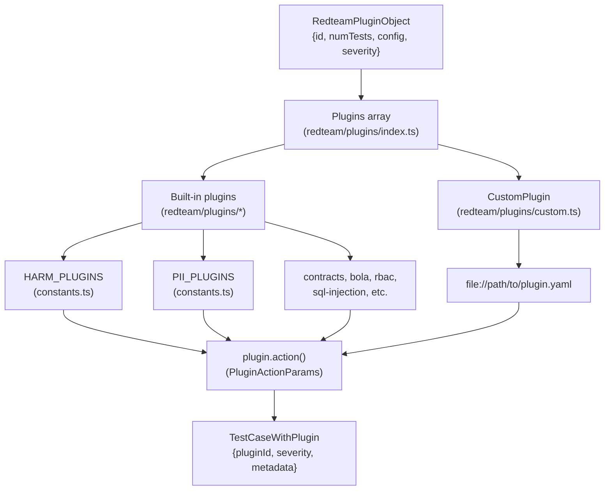

Plugin categories:
- **`HARM_PLUGINS`**: Generates content violating safety policies [src/redteam/constants/plugins.ts:127-164]().
- **`PII_PLUGINS`**: Tests for personally identifiable information leaks [src/redteam/constants/plugins.ts:114-125]().
- **Security plugins**: Tests access control, injection vulnerabilities, and data exfiltration (e.g., `RBAC_PLUGINS`, `FINANCIAL_PLUGINS`).
- **Custom plugins**: User-defined YAML/JS plugins loaded via the `file://` prefix [src/validators/redteam.ts:102-108]().

**Sources:** [src/redteam/constants/plugins.ts:114-164](), [src/redteam/index.ts:22-29](), [src/redteam/plugins/index.ts:94-98](), [src/validators/redteam.ts:102-108]()

### Strategy System

Strategies transform base test cases into sophisticated attack patterns. They implement delivery mechanisms like jailbreaks, prompt injections, and multi-turn conversations [site/docs/red-team/quickstart.md:106-112](). For full details see [Strategies](#5.4).

### Strategy Application Pipeline
```mermaid
graph LR
    BaseTests["TestCaseWithPlugin[]"] --> StrategyFilter["pluginMatchesStrategyTargets()\n(strategies/util.ts)"]

    StrategyFilter --> StrategyExec["strategy.action()\n(RedteamStrategyObject)"]

    StrategyExec --> Jailbreak["jailbreak\n(strategies/jailbreak/*)"]
    StrategyExec --> Injection["prompt-injection\n(strategies/prompt-injection)"]
    StrategyExec --> Layer["layer\n(strategies/layer)"]
    StrategyExec --> Retry["retry\n(strategies/retry)"]

    Jailbreak --> TransformedTests["TestCase[]\nwith strategyId metadata"]
    Injection --> TransformedTests
    Layer --> TransformedTests
    Retry --> TransformedTests
```

Strategy types:
- **`basic`**: Passes tests through unchanged.
- **`jailbreak`**: Applies adversarial prompting via iterative attack providers.
- **`prompt-injection`**: Embeds malicious instructions inside indirect input fields.
- **`layer`**: Composes multiple strategies sequentially.
- **`retry`**: Re-runs previously failed tests.

The `applyStrategies()` function at [src/redteam/index.ts:350-567]() handles strategy expansion, target plugin filtering, `numTests` capping, and metadata tagging.

**Sources:** [src/redteam/index.ts:350-567](), [src/validators/redteam.ts:189-198]()

### Command System

The CLI interface provides commands for different red team operations. For full details see [Red Team Commands](#5.7).

### CLI Command Wiring
```mermaid
graph TB
    CLI["main.ts"] --> RedteamCommands["redteam/commands/*"]

    RedteamCommands --> GenerateCmd["generate.ts\ndoGenerateRedteam()"]
    RedteamCommands --> RunCmd["run.ts\nredteamRunCommand()"]
    RedteamCommands --> DiscoverCmd["discover.ts\ndoTargetPurposeDiscovery()"]
    RedteamCommands --> PoisonCmd["poison.ts\npoisonCommand()"]

    GenerateCmd --> ConfigLoad["resolveConfigs()\n(util/config/load.ts)"]
    GenerateCmd --> Synthesize["synthesize()\n(redteam/index.ts:700)"]
    GenerateCmd --> OutputWrite["writePromptfooConfig()\n(util/config/writer.ts)"]

    RunCmd --> Shared["doRedteamRun()\n(redteam/shared.ts:23)"]
    Shared --> GenerateCmd
    Shared --> EvalEngine["doEval()\n(commands/eval.ts)"]

    DiscoverCmd --> RemoteAPI["fetchWithProxy()\n(util/fetch/index.ts)"]
```

Key commands:
- **`generate`** (`doGenerateRedteam`): Creates adversarial test cases and writes them to `redteam.yaml` [src/redteam/commands/generate.ts:19-23]().
- **`run`** (`doRedteamRun`): Combines generation and evaluation in one step [src/redteam/shared.ts:23-107]().
- **`discover`**: Automatically extracts the target system's purpose via an agentic dialogue [site/docs/red-team/quickstart.md:68-74]().
- **`poison`**: Generates poisoned documents for RAG red teaming.

**Sources:** [src/redteam/commands/generate.ts:19-23](), [src/redteam/commands/run.ts:19-135](), [src/redteam/shared.ts:23-107]()

## Configuration and Validation

The system uses Zod schemas for configuration validation and type safety. For full details see [Test Generation and Configuration](#5.2).

### Schema Hierarchy
```mermaid
graph TB
    YAML["promptfooconfig.yaml\nredteam section"] --> RedteamConfigSchema["RedteamConfigSchema\n(validators/redteam.ts:250)"]

    RedteamConfigSchema --> PluginValidation["RedteamPluginSchema\n(validators/redteam.ts:128)"]
    RedteamConfigSchema --> StrategyValidation["RedteamStrategySchema\n(validators/redteam.ts:189)"]

    PluginValidation --> PluginExpansion["handleCollectionExpansion()\n(validators/redteam.ts:404)"]
    StrategyValidation --> StrategyExpansion["DEFAULT_STRATEGIES\n(constants.ts)"]

    PluginExpansion --> CollectionPlugins["harmful, pii, default,\nguardrails-eval collections"]
    PluginExpansion --> IndividualPlugins["contracts, bola, rbac,\nsql-injection, etc."]

    CollectionPlugins --> FinalConfig["RedteamFileConfig\n(redteam/types.ts:217)"]
    IndividualPlugins --> FinalConfig
    StrategyExpansion --> FinalConfig

    FinalConfig --> SynthesizeOptions["SynthesizeOptions\n(redteam/types.ts:224)"]
```

Configuration features:
- **Plugin collections**: Shortcuts like `harmful`, `pii`, `default`, and compliance presets like `owasp:llm` expand to matching individual plugins [src/validators/redteam.ts:404-450]().
- **Severity overrides**: Custom severity levels per plugin from configuration or cloud settings [src/redteam/index.ts:195-204]().
- **Strategy targeting**: `config.plugins` on a strategy limits which plugin test cases it transforms [src/redteam/types.ts:172-172]().
- **File references**: `file://` paths supported for custom plugins and strategies [src/validators/redteam.ts:102-109]().
- **Multilingual migration**: `multilingual` strategy is deprecated; use the top-level `language` field instead [src/validators/redteam.ts:152-176]().

**Sources:** [src/redteam/index.ts:195-204](), [src/redteam/types.ts:172-172](), [src/validators/redteam.ts:102-109](), [src/validators/redteam.ts:250-570]()

## Integration Points

The Red Team System integrates with several external systems for provider management, cloud synchronization, and remote inference.

### External Integration Map
```mermaid
graph LR
    RedteamSystem["Red Team System"] --> ProviderSystem["providers/*\n(page 3)"]
    RedteamSystem --> CloudAPI["util/cloud.ts"]
    RedteamSystem --> RemoteGen["remoteGeneration.ts"]

    ProviderSystem --> TargetProviders["Target providers\n(LLM APIs, HTTP, custom)"]
    ProviderSystem --> AttackProviders["redteamProviderManager\n(providers/shared.ts)"]

    CloudAPI --> ConfigSync["getConfigFromCloud()"]
    CloudAPI --> SeverityOverrides["getPluginSeverityOverridesFromCloud()"]
    CloudAPI --> PolicyManagement["getCustomPolicies()\n(util/generation.ts)"]

    RemoteGen --> HealthCheck["checkRemoteHealth()\n(util/apiHealth.ts)"]
    RemoteGen --> RemotePlugins["shouldGenerateRemote()"]
    RemoteGen --> RemoteGrading["doRemoteGrading()\n(remoteGrading.ts)"]

    AttackProviders --> REDTEAM_MODEL["REDTEAM_MODEL\n(default: openai:gpt-4o)"]
```

Integration capabilities:
- **Provider abstraction**: Works with any LLM provider via the `ApiProvider` interface.
- **Cloud synchronization**: Syncs configurations and custom policies from Promptfoo Cloud via `util/cloud.ts` [src/redteam/commands/generate.ts:26-32]().
- **Remote generation**: `shouldGenerateRemote()` decides whether to execute plugins locally or via cloud API [src/redteam/remoteGeneration.ts:45-46]().
- **Health monitoring**: `checkRemoteHealth()` is called in `doRedteamRun()` before test execution [src/redteam/shared.ts:59-65]().

**Sources:** [src/redteam/commands/generate.ts:26-32](), [src/redteam/remoteGeneration.ts:45-46](), [src/redteam/shared.ts:59-65](), [src/redteam/providers/shared.ts:44-44]()