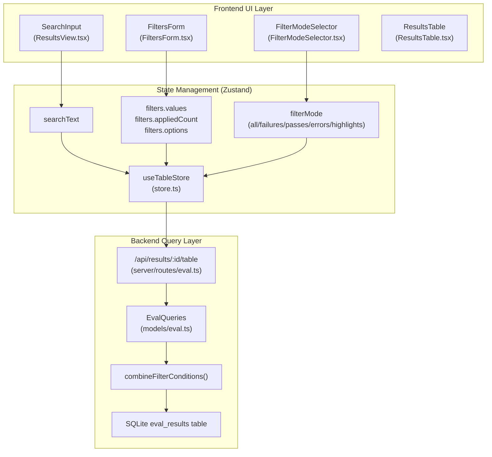
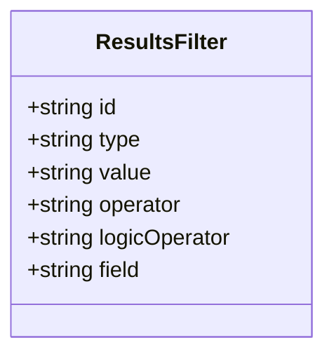
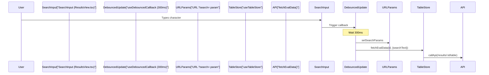
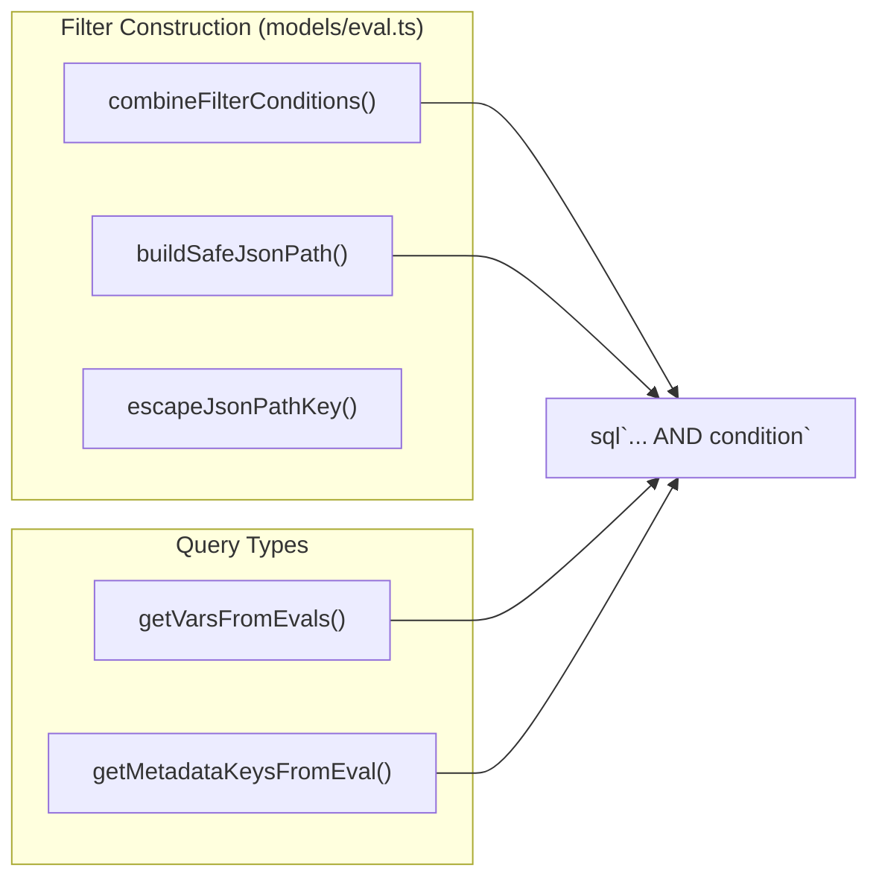

The filtering and search system enables users to narrow down evaluation results based on various criteria including test outcomes, metrics, metadata, and red team-specific attributes. This page covers the frontend filter UI, state management via Zustand, search functionality with debouncing, and backend SQL query construction.

---

## System Overview

The filtering and search system operates across three layers: the frontend UI components that expose filter controls, the Zustand state store that manages filter configuration, and the backend SQL query builder that translates filters into database queries.

### High-Level Architecture

**Sources:** [src/app/src/pages/eval/components/ResultsView.tsx:14-43](), [src/app/src/pages/eval/components/store.ts:222-300](), [src/models/eval.ts:160-160](), [src/app/src/pages/eval/components/ResultsTable.tsx:1-40]()

---

## Filter Types and Operators

The system supports six primary filter types, each with specific operators. Filters are defined by the `ResultsFilter` interface in the store.

### Filter Type Definitions

| Filter Type | Purpose | Available Operators | Notes |
|-------------|---------|-------------------|-------|
| `metric` | Filter by custom metric values | `is_defined`, `eq`, `neq`, `gt`, `gte`, `lt`, `lte` | Supports numeric comparisons [src/app/src/pages/eval/components/ResultsView.tsx:110-122]() |
| `metadata` | Filter by test case metadata fields | `equals`, `contains`, `not_contains`, `exists` | Requires field name specification [src/app/src/pages/eval/components/ResultsView.tsx:88-90]() |
| `plugin` | Filter by red team plugin ID | `equals`, `not_equals` | Red team evals only [src/app/src/pages/eval/components/ResultsView.tsx:124-128]() |
| `strategy` | Filter by attack strategy | `equals` | Red team evals only, includes "basic" [src/app/src/pages/eval/components/ResultsView.tsx:130-134]() |
| `severity` | Filter by vulnerability severity | `equals` | Critical/High/Medium/Low/Informational [src/app/src/pages/eval/components/ResultsView.tsx:136-138]() |
| `policy` | Filter by policy violation | `equals` | Formats policy ID to human name [src/app/src/pages/eval/components/ResultsView.tsx:140-142]() |

**Sources:** [src/app/src/pages/eval/components/store.ts:145-172](), [src/app/src/pages/eval/components/ResultsView.tsx:84-145]()

### ResultsFilter Interface

The `ResultsFilter` structure in `store.ts` defines how a single filter criterion is represented.

**Sources:** [src/app/src/pages/eval/components/store.ts:52-52]()

---

## Search Functionality

Search operates independently from structured filters and supports both plain text and regex patterns.

### Search Text Handling

`ResultsView` utilizes `useDebouncedCallback` to manage the `searchText` state, ensuring that the heavy `fetchEvalData` operation is only triggered after the user pauses typing.

**Sources:** [src/app/src/pages/eval/components/ResultsView.tsx:28-29](), [src/app/src/pages/eval/components/Eval.tsx:124-154]()

### Search Highlighting

When `shouldHighlightSearchText` is enabled in the `useTableStore`, the `EvalOutputCell` identifies match ranges in the output text and applies visual highlights using the `searchText` prop.

**Sources:** [src/app/src/pages/eval/components/EvalOutputCell.tsx:42-42](), [src/app/src/pages/eval/components/ResultsTable.test.tsx:70-77]()

---

## Filter State Management

Filters are managed in the `useTableStore` Zustand store. The store tracks the active filter values, the total count of applied filters, and available options extracted from the evaluation data.

### Store State Shape

| Property | Type | Description |
|----------|------|-------------|
| `filters.values` | `Record<string, ResultsFilter>` | Active filter objects keyed by UUID |
| `filters.appliedCount` | `number` | Count of filters with valid values |
| `filters.options` | `Record<string, string[]>` | Available metrics, metadata keys, etc. |

**Sources:** [src/app/src/pages/eval/components/store.ts:21-28](), [src/app/src/pages/eval/components/store.ts:55-73]()

### Filter Mode Provider

Beyond individual filters, the `FilterModeProvider` manages the overall view mode (`all`, `failures`, `passes`, `errors`, `highlights`). This mode is passed as a query parameter to the backend.

**Sources:** [src/app/src/pages/eval/components/FilterModeProvider.tsx](), [src/app/src/pages/eval/components/Eval.tsx:79-79]()

---

## Backend Query Construction

The backend translates frontend filter parameters into SQL WHERE clauses. This logic is encapsulated in `EvalQueries` within `models/eval.ts`.

### SQL Building Pipeline

The system uses `drizzle-orm` to construct safe parameterized queries. Dynamic JSON filtering is handled via SQLite's `json_extract`.

**Sources:** [src/models/eval.ts:109-122](), [src/models/eval.ts:138-158](), [src/models/eval.ts:161-193]()

### Safe JSON Paths

To prevent SQL injection while allowing filtering on dynamic metadata keys, the system uses `buildSafeJsonPath` which escapes backslashes and double quotes before wrapping the key in a JSON path string (`$."key"`).

**Sources:** [src/models/eval.ts:109-122]()

---

## Red Team Filter Options

Red team evaluations expose additional filter types derived from the `UnifiedConfig`.

### Building Red Team Options

The store dynamically computes available severities, plugins, and strategies based on the `redteam` configuration in the evaluation results.

| Function | Logic |
|----------|-------|
| `computeAvailableSeverities` | Maps plugins to their risk category severities [src/app/src/pages/eval/components/store.ts:174-205]() |
| `buildPolicyOptions` | Extracts unique policy IDs from redteam plugin configs [src/app/src/pages/eval/components/store.ts:78-97]() |
| `extractUniqueStrategyIds` | Deduplicates strategies and filters out internal 'retry' [src/app/src/pages/eval/components/store.ts:129-135]() |

**Sources:** [src/app/src/pages/eval/components/store.ts:145-172](), [src/app/src/pages/eval/components/store.ts:174-205]()

---

## Performance and Pagination

For large evaluation sets, the system uses server-side pagination and debouncing to maintain UI performance.

1.  **Server-side Filtering**: Filters are applied at the database level during the `fetchEvalData` call, which supports pagination via `pageIndex` and `pageSize`.
2.  **Pagination Control**: The `ResultsTable` component provides a UI for selecting page sizes (10, 50, 100, 500, 1000) and navigating between pages.
3.  **Debouncing**: Search and filter updates are debounced (300ms) to prevent UI lag and excessive database load.

**Sources:** [src/app/src/pages/eval/components/store.ts:207-215](), [src/app/src/pages/eval/components/ResultsTable.tsx:80-82](), [src/app/src/pages/eval/components/ResultsView.tsx:28-29]()