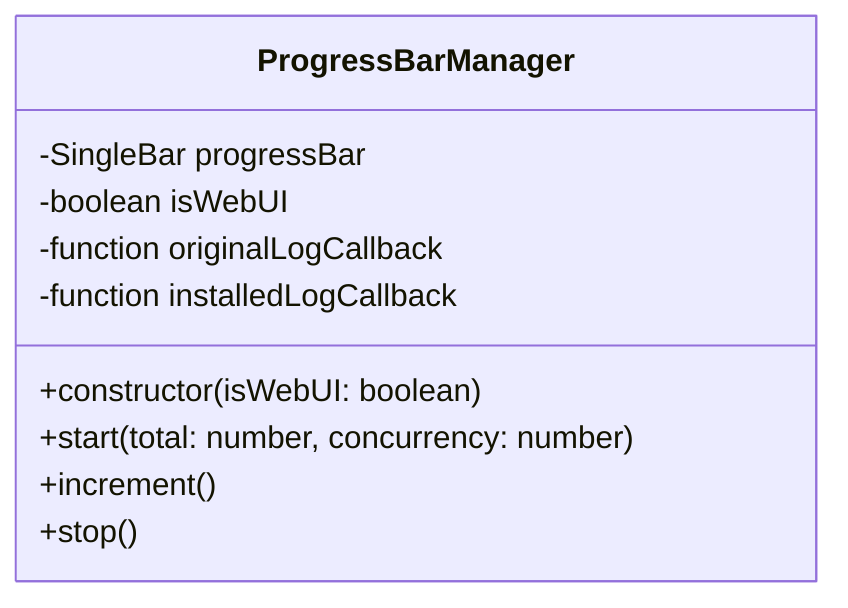
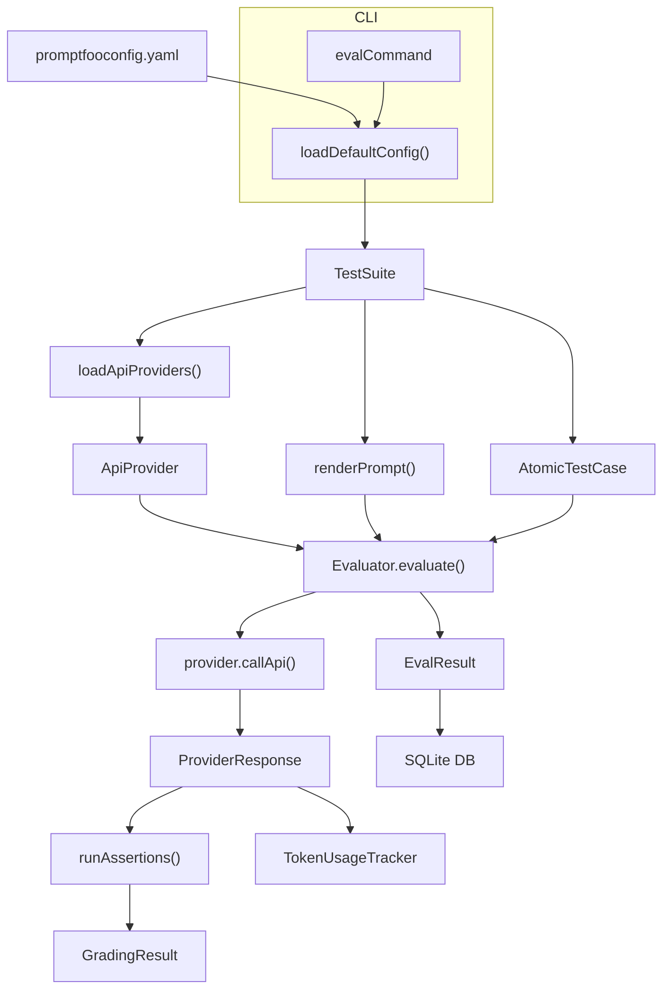
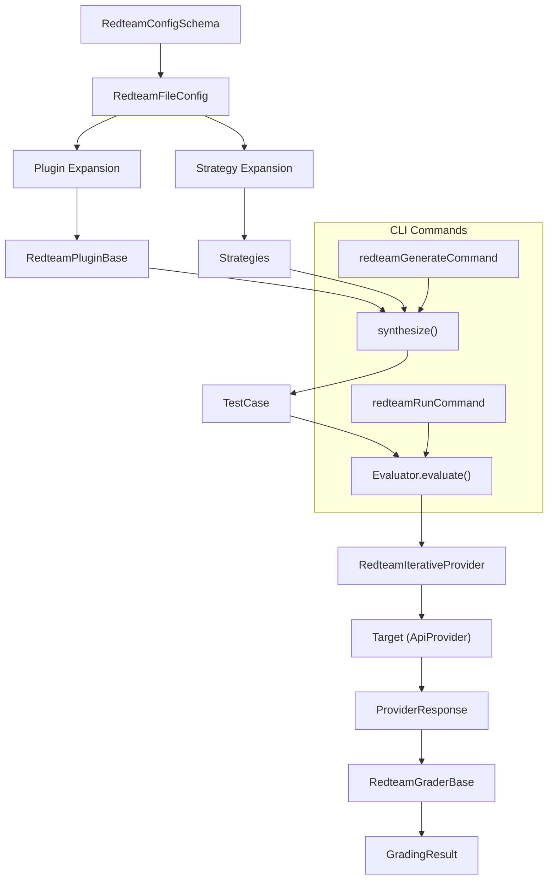
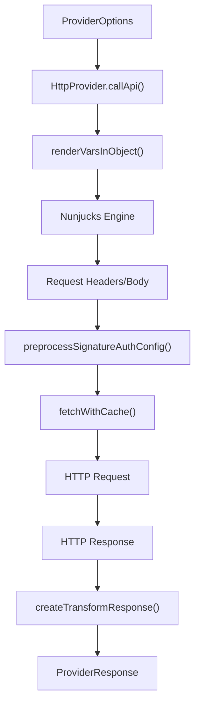

This page defines key terms, jargon, abbreviations, and domain concepts used within the promptfoo codebase. It aims to provide an onboarding engineer with a comprehensive understanding of the terminology, including code pointers to relevant implementations.

## Evaluation Concepts

### Test Suite
A collection of prompts, providers, and test cases that define an evaluation run. It is typically configured via a `promptfooconfig.yaml` file. The `TestSuite` object is a core data structure representing this configuration.
Sources: [src/types/index.ts:75-75](), [src/evaluator.ts:75-75]()

### Prompt
A piece of text or a structured message sent to an LLM. In promptfoo, prompts can be defined directly in the configuration or loaded from external files. They often contain Nunjucks templating variables that are resolved during evaluation.
Sources: [src/types/index.ts:71-71](), [src/evaluator.ts:71-71]()

### Provider
An abstraction layer for interacting with Large Language Models (LLMs) or other API services. Providers encapsulate the logic for making API calls, handling authentication, and parsing responses. Examples include `OpenAiChatCompletionProvider` for OpenAI models and `HttpProvider` for generic HTTP endpoints.
Sources: [src/types/providers.ts:13-20](), [src/evaluator.ts:77-77](), [src/providers/http.ts:58-64]()

### Test Case
A specific input scenario used to evaluate a prompt and provider. A test case consists of input variables (`vars`), optional expected outputs (`assert`), and metadata.
Sources: [src/types/index.ts:64-64](), [src/evaluator.ts:64-64]()

### Assertion
A condition used to check the output of an LLM. Assertions can be deterministic (e.g., `contains`, `not-contains`) or model-graded (e.g., `matches-llm-rubric`, `matches-similarity`).
Sources: [src/types/index.ts:61-63](), [src/evaluator.ts:9-15]()

### Model-graded Assertion
An assertion type where another LLM (the "grader") is used to evaluate the output of the primary LLM. This allows for more nuanced and subjective evaluations. Examples include `matchesLlmRubric` and `matchesFactuality`.
Sources: [src/evaluator.ts:12-12](), [src/assertions/index.ts:1-15]()

### Eval
An instance of an evaluation run. The evaluation process is managed by the `Evaluator` class, which orchestrates the pipeline from prompt rendering to assertion execution.
Sources: [src/evaluator.ts:175-175](), [src/evaluator.ts:122-122]()

### EvalResult
The outcome of a single test case execution, including the LLM's output, assertions results, token usage, and any errors.
Sources: [src/types/index.ts:67-67](), [src/evaluator.ts:67-67]()

### Token Usage
Metrics tracking the number of tokens consumed by prompts and completions during an evaluation. This is crucial for cost estimation and performance analysis. The `TokenUsageTracker` class manages this.
Sources: [src/types/index.ts:7-7](), [src/evaluator.ts:102-102]()

### ProgressBarManager
A utility class responsible for displaying and updating the command-line progress bar during evaluation runs. It handles logging messages without disrupting the progress bar.
Sources: [src/evaluator.ts:175-179]()

### RateLimitRegistry
Manages rate limiting and concurrency for API calls to providers. It uses an Adaptive Increase/Multiplicative Decrease (AIMD) algorithm to dynamically adjust concurrency based on provider responses.
Sources: [src/evaluator.ts:37-39](), [src/types/index.ts:51-62]()

### Nunjucks Templating
A templating engine used to render prompts and other configuration elements. It allows for dynamic insertion of variables and execution of custom filters.
Sources: [src/evaluator.ts:21-21](), [src/providers/http.ts:35-35]()

## Red Team Terminology

### Red Team
The process of proactively identifying vulnerabilities and risks in LLM applications through adversarial testing.
Sources: [src/redteam/index.ts:1-10]()

### Plugin
A modular component in the red team system that generates adversarial test cases or evaluates LLM responses for specific vulnerabilities (e.g., PII leakage, harmful content). Plugins are referenced in the configuration and expanded during synthesis.
Sources: [src/redteam/types.ts:70-70](), [src/redteam/index.ts:42-42]()

### Strategy
A method or approach used to generate adversarial prompts or manipulate test cases. Strategies can involve techniques like jailbreaking, prompt injection, or multi-turn conversations.
Sources: [src/redteam/types.ts:71-71](), [src/redteam/index.ts:56-56]()

### Target
The LLM application or provider being red-teamed. In promptfoo, this often refers to a configured `ApiProvider`.
Sources: [src/redteam/index.ts:44-44]()

### Purpose
The intended function or goal of the LLM application being red-teamed. This context helps in generating more relevant adversarial tests.
Sources: [src/redteam/index.ts:39-39]()

### Context
Additional information or constraints provided to the red team system to guide test generation, such as user roles or system policies.
Sources: [src/redteam/index.ts:48-49]()

### Attack Provider
Specialized providers used in red teaming that implement iterative attack loops, memory systems, and backtracking to find vulnerabilities.
Sources: [src/redteam/providers/shared.ts:1-10](), [src/redteam/index.ts:44-44]()

### RedteamConfigSchema
The Zod schema defining the structure of the `redteam` section within `promptfooconfig.yaml`, which specifies plugins, strategies, and other red team settings.
Sources: [src/types/index.ts:19-19](), [src/validators/redteam.ts:1-10]()

### Severity
A classification of the impact or risk associated with a detected vulnerability, ranging from Low to Critical.
Sources: [src/redteam/index.ts:195-204](), [src/redteam/constants.ts:1-4]()

## Provider Abstractions

### ApiProvider
The core interface for any LLM or API service integration. It defines methods like `callApi` for making requests and `id` for identification.
Sources: [src/types/providers.ts:13-20](), [src/evaluator.ts:77-77]()

### HttpProvider
A generic provider that allows interaction with any HTTP API endpoint. It supports dynamic request construction using Nunjucks, various authentication methods, and response transformations.
Sources: [src/providers/http.ts:48-54](), [src/providers/http.ts:58-64]()

### ProviderOptions
A type defining the configuration options for an `ApiProvider`, including its ID, label, and specific configuration parameters.
Sources: [src/types/index.ts:41-41](), [src/types/providers.ts:1-12]()

### ProviderRegistry
A map that stores and manages available `ApiProvider` implementations, allowing them to be loaded by their string identifiers.
Sources: [src/providers/registry.ts:138-148](), [src/evaluator.ts:29-29]()

### `loadApiProvider()`
A function responsible for resolving a provider string or object into an `ApiProvider` instance, handling file-based configurations and cloud providers.
Sources: [src/providers/registry.ts:1-10](), [src/commands/eval.ts:45-47]()

### `maybeLoadConfigFromExternalFile()`
A utility function that recursively resolves `file://` references within a configuration object, loading content from external files.
Sources: [src/providers/http.ts:17-20]()

## Configuration Schema Terms

### `promptfooconfig.yaml`
The primary configuration file for promptfoo, typically located in the project root. It defines prompts, providers, test cases, and other evaluation settings.
Sources: [site/static/config-schema.json:7-73]()

### `UnifiedConfig`
A type representing the complete, merged configuration for a promptfoo run, combining settings from `promptfooconfig.yaml`, command-line options, and default values.
Sources: [src/types/index.ts:15-15](), [src/commands/eval.ts:20-20]()

### `CommandLineOptions`
A type representing the options that can be passed via the command line when running promptfoo. These options can override settings in the `promptfooconfig.yaml`.
Sources: [src/types/index.ts:99-152](), [src/commands/eval.ts:15-15]()

### `EvaluateOptions`
A type defining various settings that control the evaluation process, such as `maxConcurrency`, `repeat`, and `delay`.
Sources: [site/static/config-schema.json:61-63]()

### `RedteamFileConfig`
A type representing the configuration specifically for red teaming, typically found within the `redteam` section of `promptfooconfig.yaml`.
Sources: [src/types/index.ts:34-34](), [src/redteam/types.ts:65-72]()

### `NunjucksFilterMap`
A map of custom Nunjucks filters that can be used within prompts for data manipulation.
Sources: [src/types/index.ts:6-6](), [src/contracts/shared.ts:1-10]()

## Infrastructure Concepts

### CLI State (`cliState`)
A singleton object that holds global state relevant to the command-line interface, such as the current log file paths and post-action callbacks.
Sources: [src/cliState.ts:1-10](), [src/main.ts:2-2]()

### `main()`
The entry point for the promptfoo CLI application. It initializes the environment, loads configurations, registers commands using Commander.js, and handles global error logging.
Sources: [src/main.ts:53-148]()

### `shutdownGracefully()`
A function called during application shutdown to perform cleanup tasks, such as flushing OpenTelemetry traces and disposing of resources.
Sources: [src/mainUtils.ts:37-37](), [src/main.ts:37-38]()

### OpenTelemetry Tracing
An observability framework integrated into promptfoo to collect and export traces of LLM calls and evaluation steps, aiding in debugging and performance analysis.
Sources: [src/evaluator.ts:47-54]()

### `EvalRunError`
A custom error class used to signal a failure during an evaluation run, carrying an `exitCode` for CLI processes.
Sources: [src/main.ts:40-40]()

### `ConfigResolutionError`
An error type indicating a problem during the loading or merging of configuration files.
Sources: [src/main.ts:48-48](), [src/util/config/load.ts:1-10]()

### `runDbMigrations()`
Executes database schema migrations to ensure the local SQLite database is up-to-date.
Sources: [src/main.ts:64-64]()

### `mcpCommand`
The command for starting the Model Context Protocol (MCP) server, which exposes promptfoo tools to AI agents and development environments.
Sources: [src/main.ts:19-19]()

### `ProgressBarManager`
Title: ProgressBarManager Class Structure

The `ProgressBarManager` class is responsible for managing the command-line progress bar during evaluation runs. It ensures that log messages do not interfere with the progress bar's display by clearing the line before logging and re-rendering afterward.
Sources: [src/evaluator.ts:175-220]()

### Evaluation Data Flow
Title: Evaluation Data Flow and Code Entities

This diagram illustrates the high-level data flow during an evaluation run. The process starts with configuration loading via `loadDefaultConfig`, proceeds through prompt rendering and test case generation, uses `ApiProvider` instances to make LLM calls, and finally processes responses through assertions and grading, persisting results in SQLite.
Sources: [src/evaluator.ts:21-21](), [src/evaluator.ts:75-77](), [src/evaluator.ts:102-102](), [src/main.ts:67-69](), [src/commands/eval.ts:18-32]()

### Red Team System Overview
Title: Red Team Architecture and Core Classes

This diagram outlines the architecture of the red team system. It starts with the `RedteamConfigSchema` to define red team settings, which are then expanded into plugins and strategy instances. The `synthesize()` function generates adversarial test cases, which are then fed into the evaluation engine. Iterative attack providers manage loops against the target LLM, and graders evaluate the responses for vulnerabilities.
Sources: [src/redteam/index.ts:42-56](), [src/redteam/types.ts:65-72](), [src/validators/redteam.ts:1-10](), [src/main.ts:131-132]()

### `HttpProvider` Request Flow
Title: HttpProvider Internal Logic

This diagram illustrates the internal request flow within the `HttpProvider`. User configuration is processed, variables are rendered using Nunjucks templating, and authentication settings are applied. The request is then made via `fetchWithCache()`, and the HTTP response undergoes transformation before being returned as a `ProviderResponse`.
Sources: [src/providers/http.ts:58-64](), [src/providers/http.ts:22-22](), [src/providers/http.ts:35-35](), [src/providers/http.ts:90-110](), [src/providers/http.ts:44-46]()