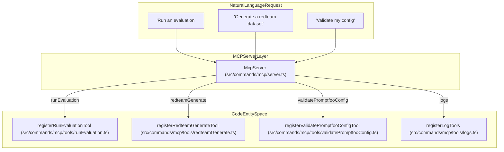
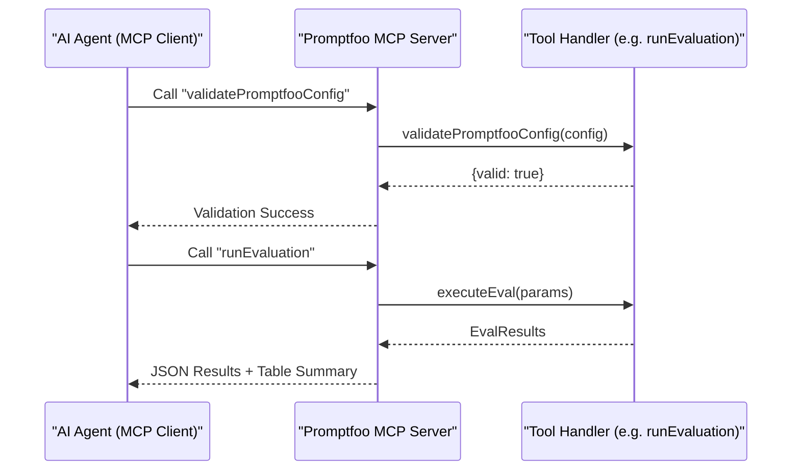

The promptfoo Model Context Protocol (MCP) server provides a standardized interface for AI agents and development environments to interact with promptfoo's evaluation and red-teaming toolset. By exposing core functionalities as MCP tools, agents can autonomously run evaluations, generate datasets, and perform security scans using either `stdio` or `HTTP` transport modes.

## Overview and Architecture

The MCP server is implemented as a CLI command (`mcpCommand`) that initializes a server instance capable of handling tool execution requests from MCP clients. It allows external LLM agents to treat promptfoo as a sophisticated tool for testing and securing other LLMs.

### Implementation Details
The server is registered in the main CLI entrypoint and defined in the MCP command module. It leverages the Model Context Protocol to manage tool definitions and transport. The system supports both client-side MCP integration (where promptfoo acts as a client to other servers) and server-side integration (where promptfoo provides tools to agents).

### Transport Modes
1.  **stdio**: The default mode for local integration where the agent (e.g., Claude Desktop or a local IDE) starts promptfoo as a subprocess and communicates via standard input/output [src/commands/mcp/server.ts:59-70]().
2.  **HTTP**: Used for remote or networked integrations where the agent connects to a persistent promptfoo MCP endpoint. The server implementation handles `WebStandardStreamableHTTPServerTransport` with session management [src/commands/mcp/server.ts:139-142]().

### Data Flow
When an MCP client invokes a tool:
1.  The request is received via the MCP server instance (`McpServer`) [src/commands/mcp/server.ts:76-82]().
2.  The server maps the tool name to a specific internal command handler registered via functions like `registerRunEvaluationTool` or `registerRedteamGenerateTool` [src/commands/mcp/server.ts:93-112]().
3.  The handler executes the logic, often involving the evaluation engine or redteam subsystems.
4.  Results are formatted and returned to the client as JSON.

### System Mapping: NL Space to Code Entity Space

The following diagram maps natural language tool requests to the specific code entities that handle them.

**MCP Tool Execution Mapping**

Sources: [src/commands/mcp/server.ts:75-117](), [src/commands/mcp/server.ts:108-112]()

## Available Tools

The MCP server exposes a comprehensive suite of tools that mirror the CLI functionality. These tools allow agents to perform complex evaluation tasks without manually constructing CLI strings.

| Tool Name | Registration Function | Description |
| :--- | :--- | :--- |
| `runEvaluation` | `registerRunEvaluationTool` | Executes an evaluation based on a provided configuration [src/commands/mcp/server.ts:99](). |
| `generateDataset` | `registerGenerateDatasetTool` | Generates synthetic test cases from prompts or existing data [src/commands/mcp/server.ts:103](). |
| `redteamGenerate` | `registerRedteamGenerateTool` | Generates adversarial test cases for red-teaming [src/commands/mcp/server.ts:109](). |
| `redteamRun` | `registerRedteamRunTool` | Executes a red-team evaluation against a target [src/commands/mcp/server.ts:108](). |
| `testProvider` | `registerTestProviderTool` | Tests specific provider connectivity and session settings [src/commands/mcp/server.ts:97](). |
| `validatePromptfooConfig` | `registerValidatePromptfooConfigTool` | Validates configuration integrity and connectivity [src/commands/mcp/server.ts:96](). |
| `compareProviders` | `registerCompareProvidersTool` | Runs a quick comparison between two or more LLM providers [src/commands/mcp/server.ts:105](). |
| `shareEvaluation` | `registerShareEvaluationTool` | Generates a shareable URL for an evaluation result [src/commands/mcp/server.ts:100](). |
| `listEvaluations` | `registerListEvaluationsTool` | Lists historical evaluation runs from the local database [src/commands/mcp/server.ts:94](). |

Sources: [src/commands/mcp/server.ts:93-112]()

## Integration and Usage

### MCP Client and Server Roles
Promptfoo can act as both an MCP server (providing tools to agents) and an MCP client (consuming tools from other servers). The `MCPClient` class handles the client-side logic, allowing providers to use external tools during an evaluation [src/providers/mcp/client.ts:92-105]().

**Agent Evaluation Lifecycle**

Sources: [src/commands/mcp/server.ts:93-100](), [src/providers/mcp/client.ts:146-153]()

### Key Classes

-   `MCPClient`: Manages connections to multiple MCP servers, handling initialization and transport [src/providers/mcp/client.ts:92-99]().
-   `McpServer`: The core class from the `@modelcontextprotocol/sdk` used to define the promptfoo server instance [src/commands/mcp/server.ts:76-77]().
-   `WebStandardStreamableHTTPServerTransport`: The transport layer used for HTTP/SSE communication [src/commands/mcp/server.ts:139-142]().

## Configuration

The MCP integration uses specific types to define server connectivity and authentication.

### MCP Configuration Types
-   `MCPServerConfig`: Defines a single server connection, including `path` for local files, `command`/`args` for stdio, or `url` for remote endpoints [src/providers/mcp/types.ts:5-13]().
-   `MCPConfig`: The top-level configuration object for enabling MCP on a provider, including `timeout`, `maxTotalTimeout`, and `pingOnConnect` [src/providers/mcp/types.ts:73-108]().
-   `MCPServerAuth`: Supports multiple authentication strategies: `bearer`, `basic`, `api_key`, and `oauth` (client credentials or password) [src/providers/mcp/types.ts:64-69]().

### Timeout Management
The system provides granular control over request timeouts:
-   `timeout`: Default 60s, configurable via `MCP_REQUEST_TIMEOUT_MS` [src/providers/mcp/client.ts:68]().
-   `resetTimeoutOnProgress`: Resets the timer when progress notifications are received [src/providers/mcp/types.ts:92]().
-   `maxTotalTimeout`: An absolute cap on execution time [src/providers/mcp/types.ts:98]().

Sources: [src/providers/mcp/types.ts:1-129](), [src/providers/mcp/client.ts:63-90]()