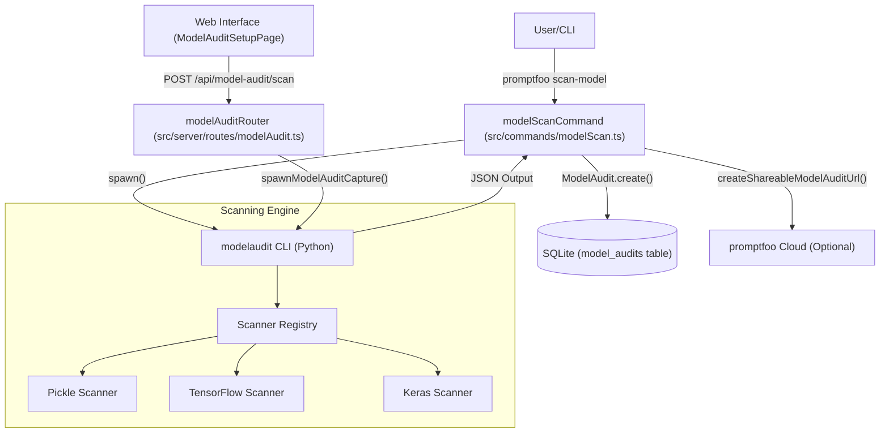
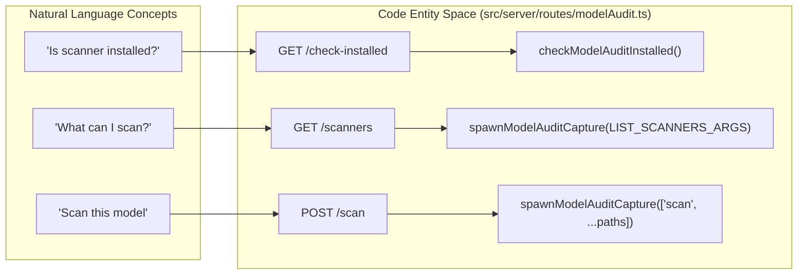

The Model Audit system in promptfoo provides static security scanning for Machine Learning (ML) models. It integrates the `modelaudit` engine to detect security vulnerabilities, malicious code, and backdoors across 30+ model formats before they are deployed into production.

## Overview and Purpose

ModelAudit acts as a security gate in the AI pipeline. It identifies risks such as:
*   **Malicious code execution:** Arbitrary code embedded in Python pickle files (`.pkl`, `.pt`, `.pth`).
*   **Suspicious Operations:** Dangerous TensorFlow or Keras operations (e.g., `PyFunc`, `Lambda` layers) that can access system resources.
*   **Embedded Payloads:** Hidden executables, network communication patterns (URLs, IPs), or hardcoded credentials.
*   **Tampering:** Mismatched file hashes or suspicious ZIP archive structures.

Sources: [site/docs/model-audit/index.md:21-53](), [site/docs/model-audit/scanners.md:41-58]()

## System Architecture

The Model Audit system is implemented as a wrapper around the `modelaudit` Python CLI. It bridges the Node.js/TypeScript environment of promptfoo with the Python-based scanning engine.

### Data Flow Diagram
This diagram illustrates the flow from a user command to the execution of the scanner and the persistence of results.

"Model Audit Data Flow"

Sources: [src/commands/modelScan.ts:1-25](), [src/server/routes/modelAudit.ts:40-89](), [src/types/modelAudit.ts:1-30]()

### Implementation Details

The core logic resides in `src/commands/modelScan.ts`, which handles argument parsing, environment validation, and process execution.

*   **Process Spawning:** The function `spawnModelAudit` [src/commands/modelScan.ts:216]() (referenced as `spawn` call within the command action) executes the underlying `modelaudit` command. It handles signal forwarding (e.g., `SIGINT`, `SIGTERM`) to ensure child processes are terminated when the user cancels a scan [src/commands/modelScan.ts:210-211]().
*   **Result Parsing:** The system uses `parseCompleteModelAuditResults` [src/util/modelAuditResults.ts:26]() to transform raw JSON output from the Python tool into the `ModelAuditScanResults` type.
*   **Exit Codes:** The wrapper maps `modelaudit` exit codes: `0` for clean, `1` for security findings, and `2+` for fatal errors [src/commands/modelScan.ts:125-132](). The helper `getProcessErrorExitCode` handles signal-based terminations [src/commands/modelScan.ts:133-143]().
*   **Update Checks:** The system verifies the installed version of `modelaudit` via `checkModelAuditUpdates` [src/updates.ts:87]() and `getModelAuditCurrentVersion` [src/updates.ts:76](), comparing it against PyPI [src/updates.ts:57]().

Sources: [src/commands/modelScan.ts:123-160](), [src/commands/modelScan.ts:210-211](), [src/updates.ts:57-115]()

## Supported Formats and Scanners

ModelAudit uses specialized scanners tailored to specific file formats. Users can discover available scanners via `promptfoo scan-model --list-scanners` [site/docs/model-audit/index.md:153]().

| Scanner | Supported Extensions | Key Checks |
| :--- | :--- | :--- |
| **Pickle** | `.pkl`, `.pt`, `.pth`, `.bin` | Dangerous opcodes, `os.system`, `eval`, `exec` |
| **TensorFlow** | `.pb`, SavedModel dirs | `PyFunc` ops, file I/O operations, Python calls in graph |
| **Keras** | `.h5`, `.keras` | Unsafe `Lambda` layers, base64 encoded Python code |
| **ONNX** | `.onnx` | External data references, path traversal, tensor integrity |
| **TensorRT** | `.engine`, `.plan` | Shared library references, unauthorized plugins |
| **TF Lite** | `.tflite` | Custom ops, Flex delegate execution, buffer validation |

Sources: [site/docs/model-audit/scanners.md:39-180]()

## Server Integration (API Routes)

The promptfoo web server exposes the Model Audit functionality via the `modelAuditRouter`.

### Key API Endpoints
*   `GET /api/model-audit/check-installed`: Verifies if the `modelaudit` Python package is available in the environment [src/server/routes/modelAudit.ts:92]().
*   `GET /api/model-audit/scanners`: Queries the Python engine for a list of available scanners by spawning `modelaudit` with `LIST_SCANNERS_ARGS` [src/server/routes/modelAudit.ts:109-123]().
*   `POST /api/model-audit/check-path`: Validates if a provided path exists and identifies it as a file or directory, handling home directory expansion [src/server/routes/modelAudit.ts:149-163]().
*   `POST /api/model-audit/scan`: The primary execution endpoint. It accepts `ScanRequestSchema`, resolves paths to absolute locations, and spawns the scanner via `spawnModelAuditCapture` [src/server/routes/modelAudit.ts:195-218]().

"Natural Language to Code: Server Routes"

Sources: [src/server/routes/modelAudit.ts:92-218](), [src/types/api/modelAudit.ts:8-121]()

## CLI Usage and Configuration

The `promptfoo scan-model` command supports various flags to customize the audit.

### Argument Parsing
The `parseModelAuditArgs` function [src/util/modelAuditCliParser.ts:142]() maps high-level promptfoo options to the specific CLI flags expected by the Python engine. It handles deprecated options by mapping them to environment variables where applicable [src/commands/modelScan.ts:181-205]().

| Option | CLI Flag | Description |
| :--- | :--- | :--- |
| `blacklist` | `--blacklist` | Additional patterns to check against model names |
| `maxSize` | `--max-size` | Maximum total size to scan (e.g., `1GB`) |
| `scanners` | `--scanners` | Specific scanners to run (e.g., `pickle,tf_savedmodel`) |
| `strict` | `--strict` | Fail on warnings and enable stricter validation |
| `sbom` | `--sbom` | Generate a Software Bill of Materials (CycloneDX) |
| `dryRun` | `--dry-run` | Preview scan without processing files |

Sources: [src/util/modelAuditCliParser.ts:121-137](), [src/commands/modelScan.ts:181-205](), [site/docs/model-audit/index.md:171-188]()

### Remote Scanning
ModelAudit supports scanning models from remote sources via URI schemes, authenticated exclusively via environment variables [site/docs/model-audit/usage.md:40]():
*   **HuggingFace:** `hf://org/model` (Uses `HF_TOKEN`) [site/docs/model-audit/usage.md:44-50]()
*   **Cloud Storage:** `s3://bucket/path` (`AWS_ACCESS_KEY_ID`), `gs://bucket/path` (`GOOGLE_APPLICATION_CREDENTIALS`), `r2://bucket/path` [site/docs/model-audit/usage.md:77-107]()
*   **Registries:** `models:/name/version` (MLflow) [site/docs/model-audit/usage.md:64-75]()
*   **JFrog Artifactory:** Authenticated via `JFROG_URL` and `JFROG_API_TOKEN` [site/docs/model-audit/usage.md:52-62]()

## Interpreting Scan Results

Scan results are structured as `ModelAuditScanResults` [src/types/modelAudit.ts:29]().

1.  **Summary Statistics:** `total_checks`, `passed_checks`, `failed_checks`, and `duration` (mapped from raw JSON output).
2.  **Issues:** An array of `ModelAuditIssue` objects containing `severity` (`critical`, `error`, `warning`, `info`, `debug`), `message`, and `location` [src/types/modelAudit.ts:29]().
3.  **Verdict:** The system determines a pass/fail verdict based on `hasFindings` via `getModelAuditVerdict` [src/commands/modelScan.ts:118-120]().
4.  **Metadata:** The command action captures revision information such as `modelId`, `revisionSha`, and `contentHash` to avoid redundant scans [src/commands/modelScan.ts:45-51]().

Sources: [src/commands/modelScan.ts:45-51](), [src/commands/modelScan.ts:118-120](), [src/types/modelAudit.ts:29]()