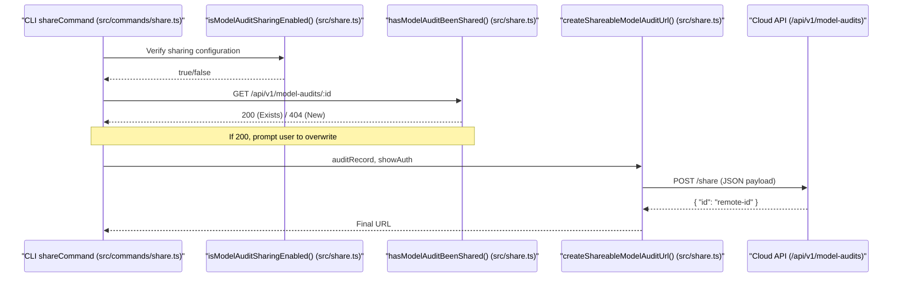
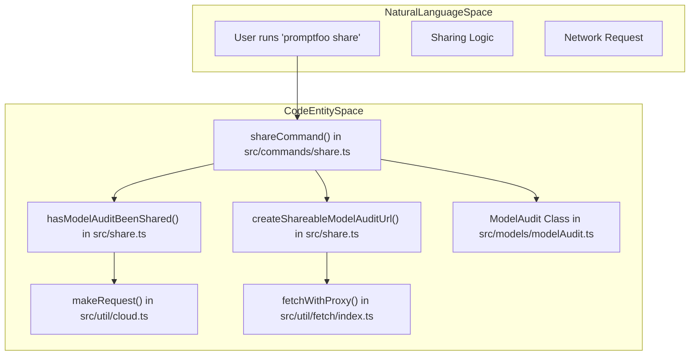

This page documents the model audit sharing subsystem: the `ModelAudit` data structure, how scan results are uploaded to the cloud, and the functions used to generate shareable URLs. It also compares the model audit sharing flow to the evaluation sharing flow documented in [Sharing System](7.1).

For documentation on cloud authentication, API key management, and the `CloudConfig` singleton, see [Cloud Configuration](7.2). For documentation on the `share` CLI command and how it dispatches between eval and model audit sharing, see [CLI Architecture](4.1).

---

## Overview

Model audit sharing lets users publish model scan results (produced by `promptfoo scan-model`) to a cloud-hosted viewer and obtain a shareable URL. The implementation lives primarily in `src/share.ts` and `src/commands/share.ts`.

Unlike evaluation sharing, which uses a chunked multi-request upload to handle large result sets, model audit sharing is a single synchronous POST. It targets a distinct API endpoint and URL path specialized for security scan reports.

Sources: [src/share.ts:722-795](), [src/commands/share.ts:40-53]()

---

## The `ModelAudit` Data Structure

The `ModelAudit` data model represents the results of a static security scan. When shared, the following fields are serialized and sent to the cloud:

| Field | Description |
|---|---|
| `id` | Unique scan identifier; typically prefixed with `scan-` |
| `name` | Human-readable name for the scan |
| `author` | The user who initiated the scan, resolved via `getAuthor()` |
| `modelId` | Identifier for the model being scanned |
| `modelSource` | Source of the model (e.g., `hf://`, `s3://`, `models:/`) |
| `results` | The `ModelAuditScanResults` object containing check aggregates |
| `checks` | Detailed array of individual scanner results |
| `issues` | Array of `ModelAuditIssue` objects identified during the scan |
| `metadata` | Arbitrary key-value metadata associated with the scan |
| `revisionSha` | Git revision or content SHA used for deduplication |
| `scannerVersion` | Version of the `modelaudit` Python package used |
| `createdAt` | ISO timestamp of scan creation |

Sources: [src/share.ts:743-766](), [src/commands/modelScan.ts:16-16](), [src/types/modelAudit.ts:29-81]()

---

## Enabling Model Audit Sharing

The function `isModelAuditSharingEnabled()` determines whether the environment is configured to support sharing scan results.

**Decision logic:**
1. If `PROMPTFOO_SHARE_API_BASE_URL` is set and does not point to the default `api.promptfoo.app`, sharing is enabled (Self-hosted mode).
2. If `cloudConfig.isEnabled()` is true (meaning a valid API key is present), sharing is enabled (Cloud mode).
3. Otherwise, sharing is disabled.

Note: Model audits cannot be shared to the public `api.promptfoo.app` without authentication, as they often contain sensitive infrastructure or model path information.

Sources: [src/share.ts:75-89]()

---

## Upload Flow

The diagram below maps the upload sequence from the CLI command to the cloud API.

**Model Audit Upload Sequence**

Sources: [src/share.ts:722-816](), [src/commands/share.ts:208-244](), [src/util/cloud.ts:27-44]()

---

## Key Functions and Entities

The following diagram bridges the natural language concepts of "Sharing" to the specific code entities in the `promptfoo` codebase.

**Code Entity Mapping**

Sources: [src/share.ts:722-816](), [src/commands/share.ts:55-134](), [src/util/cloud.ts:27-30]()

### `isModelAuditSharingEnabled()`
[src/share.ts:75-89]()
Validates environment variables and `cloudConfig` state to ensure the scan can be sent to a remote endpoint.

### `hasModelAuditBeenShared(audit)`
[src/share.ts:694-714]()
Checks if a scan with the given ID already exists on the remote server using `makeRequest('model-audits/:id', 'GET')`. This prevents accidental duplication.

### `createShareableModelAuditUrl(auditRecord, showAuth?)`
[src/share.ts:722-795]()
The primary implementation for uploading scans. It:
1. Determines the target API URL via `getShareApiBaseUrl()`.
2. Sets the `Authorization` header if `cloudConfig` is enabled.
3. POSTs the serialized `auditRecord` to the `/share` endpoint.
4. Returns the public URL constructed via `getShareableModelAuditUrl()`.

### `getShareableModelAuditUrl(audit, remoteAuditId, showAuth?)`
[src/share.ts:804-816]()
Constructs the final user-facing URL. It uses `determineShareDomain` to find the correct application host and appends `/model-audit/{remoteAuditId}`.

---

## Comparison: Model Audit vs. Evaluation Sharing

While both share a common infrastructure in `src/share.ts`, their implementations differ to accommodate the data volume and structure.

| Feature | Model Audit Sharing | Evaluation Sharing |
|---|---|---|
| **Code Entrypoint** | `createShareableModelAuditUrl()` | `createShareableUrl()` |
| **Data Flow** | Single atomic POST | Chunked multi-POST with retry |
| **API Path** | `/api/v1/model-audits/share` | `/api/eval` |
| **URL Pattern** | `.../model-audit/{id}` | `.../eval/{id}` |
| **Idempotency** | Checks for scan ID existence | Checks for eval ID + Team ID |
| **Rollback** | Not supported | `rollbackEval()` on failure |
| **Traces** | Not included | Uploaded via `getTraces()` |

Sources: [src/share.ts:137-211](), [src/share.ts:722-795](), [src/commands/share.ts:136-205]()

---

## CLI Integration and ID Routing

The `share` command in `src/commands/share.ts` acts as a router. If an ID is provided, it checks the prefix to determine whether to load a `ModelAudit` or an `Eval`.

**ID Routing Logic**
- If ID starts with `scan-`: Load via `ModelAudit.findById(id)` [src/commands/share.ts:87-93]().
- Otherwise: Load via `Eval.findById(id)` [src/commands/share.ts:96-102]().
- If no ID: Compare `latest()` timestamps of both types and share the most recent [src/commands/share.ts:106-126]().

Once identified as a model audit, the CLI dispatches to `createAndDisplayShareableModelAuditUrl`, which handles the high-level logging and error reporting for the user.

Sources: [src/commands/share.ts:40-53](), [src/commands/share.ts:85-134](), [src/commands/share.ts:208-244]()