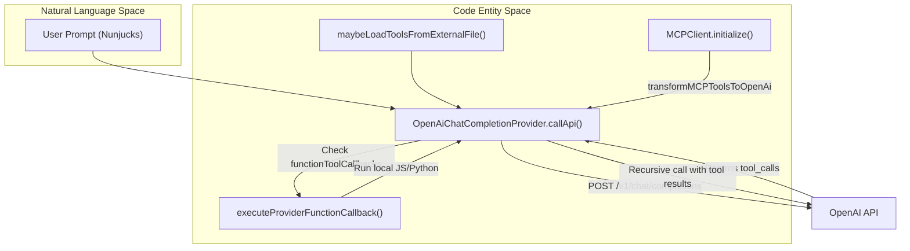
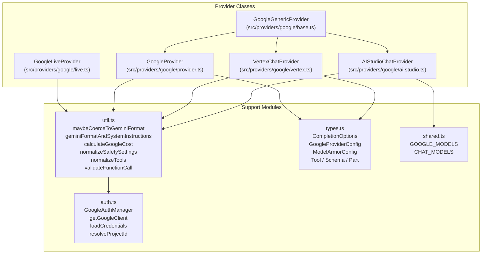
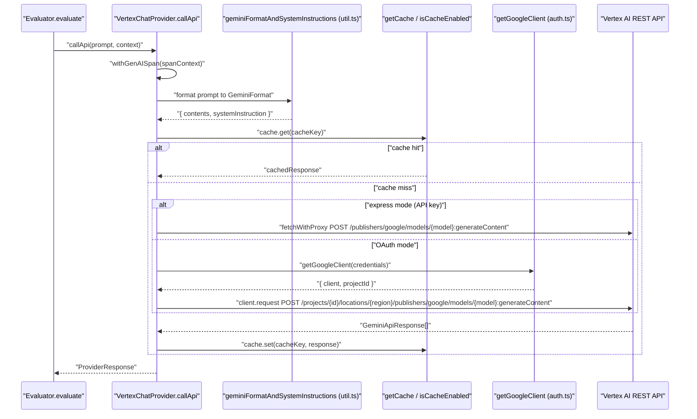

This page documents the OpenAI provider implementation in promptfoo, including the core provider classes, supported model families (GPT-4.x, GPT-5.x, o-series), configuration for reasoning effort, tool/function calling, structured outputs, and cost calculation.

For provider loading and string-to-class resolution, see page [3.1](). For Azure OpenAI, see page [3.8]().

---

## Provider Classes

The OpenAI integration is implemented through specialized provider classes that inherit from `OpenAiGenericProvider`.

**Provider Class Hierarchy:**

```mermaid
classDiagram
    class "OpenAiGenericProvider" {
        +modelName: string
        +options: ProviderOptions
        +getApiKey() string
        +getApiUrl() string
    }
    class "OpenAiChatCompletionProvider" {
        +config: OpenAiCompletionOptions
        +mcpClient: MCPClient
        +callApi(prompt) ProviderResponse
        +getOpenAiBody(prompt, context)
        +validateFunctionToolCall()
    }
    class "OpenAiResponsesProvider" {
        +config: OpenAiCompletionOptions
        +callApi(prompt) ProviderResponse
        +getOpenAiBody(prompt, context)
    }
    class "OpenAiAssistantProvider" {
        +callApi(prompt) ProviderResponse
    }
    "OpenAiGenericProvider" <|-- "OpenAiChatCompletionProvider"
    "OpenAiGenericProvider" <|-- "OpenAiResponsesProvider"
    "OpenAiGenericProvider" <|-- "OpenAiAssistantProvider"
```

- **`OpenAiChatCompletionProvider`**: Interfaces with the `/v1/chat/completions` endpoint. It handles chat messages, tool calling, and local function execution. [src/providers/openai/chat.ts:92-115]()
- **`OpenAiResponsesProvider`**: Interfaces with the newer `/responses` API. It supports background execution and advanced reasoning configurations. [src/providers/openai/responses.ts:35-145]()
- **`OpenAiGenericProvider`**: Provides shared utilities for API key retrieval, URL construction, and environment variable overrides. [src/providers/openai/index.ts:18-20]()

Sources: [src/providers/openai/chat.ts:92-115](), [src/providers/openai/responses.ts:35-145](), [src/providers/openai/index.ts:18-20]()

---

## Supported Models and Routing

Promptfoo uses a routing system to map model strings to specific endpoints.

| Prefix | Endpoint | Class |
| :--- | :--- | :--- |
| `openai:chat:<model>` | `/v1/chat/completions` | `OpenAiChatCompletionProvider` |
| `openai:responses:<model>` | `/responses` | `OpenAiResponsesProvider` |
| `openai:assistant:<id>` | Assistants API | `OpenAiAssistantProvider` |
| `openai:embedding:<model>` | `/v1/embeddings` | `OpenAiEmbeddingProvider` |
| `openai:tts:<model>` | `/v1/audio/speech` | `OpenAiAudioProvider` |
| `openai:video:<model>` | Sora Video API | `OpenAiVideoProvider` |

### Model Families
The toolkit defines metadata and costs for several model families in `OPENAI_CHAT_MODELS`:
- **GPT-4.1 Series**: `gpt-4.1`, `gpt-4.1-mini`, `gpt-4.1-nano`. [src/providers/openai/util.ts:133-153]()
- **Reasoning (o-series)**: `o1`, `o1-mini`, `o3`, `o3-mini`. [src/providers/openai/util.ts:154-182]()
- **GPT-5 Series**: `gpt-5-search-api`, and various GPT-5 aliases. [src/providers/openai/util.ts:110-116]()
- **Specialized**: `chat-latest` and search-preview models. [src/providers/openai/util.ts:96-132]()

Sources: [site/docs/providers/openai.md:17-41](), [src/providers/openai/util.ts:77-235]()

---

## Configuration and Reasoning

### Reasoning Effort
For o-series and GPT-5 models, users can configure `reasoning_effort`.
- **o-series**: Supports `low`, `medium`, `high`. [src/providers/openai/types.ts:68-72]()
- **GPT-5**: Supports `none`, `minimal`, `low`, `medium`, `high`, `xhigh`, `max`. [src/providers/openai/types.ts:89-93]()

### Structured Outputs
The `response_format` option supports `json_schema` for strict schema enforcement. [src/providers/openai/types.ts:153-165]()

```yaml
providers:
  - id: openai:chat:gpt-4o
    config:
      response_format:
        type: json_schema
        json_schema:
          name: "research_paper"
          strict: true
          schema:
            type: object
            properties:
              title: { type: string }
              authors: { type: array, items: { type: string } }
            required: [title, authors]
            additionalProperties: false
```

Sources: [src/providers/openai/types.ts:53-93](), [src/providers/openai/types.ts:149-165]()

---

## Tool and Function Calling

Promptfoo implements a complex flow for tool calling, including support for Model Context Protocol (MCP) and local callbacks.

**Tool Execution Data Flow:**



- **MCP Integration**: `OpenAiChatCompletionProvider` can initialize an `mcpClient` to fetch tools from external MCP servers. [src/providers/openai/chat.ts:121-124]()
- **Function Callbacks**: `functionToolCallbacks` allow mapping tool names to local JavaScript functions or file references (`file://...`). [src/providers/openai/chat.ts:146-159]()

Sources: [src/providers/openai/chat.ts:98-100](), [src/providers/openai/chat.ts:121-124](), [src/providers/openai/chat.ts:146-159]()

---

## Token Usage and Cost Calculation

Promptfoo calculates costs based on the specific model and the tokens returned in the API response.

### Cost Calculation Logic
The `calculateOpenAIUsageCost` function uses model-specific rates for input, output, and audio tokens.
- **Search Surcharges**: Certain models like `gpt-5-search-api` incur a flat surcharge ($0.01 - $0.025) per request. [src/providers/openai/chat.ts:82-90]()
- **Audio Costs**: Supported for models like `gpt-4o-mini-tts`. [src/providers/openai/util.ts:77-87]()

### Token Usage Extraction
The `getTokenUsage` function parses the `usage` object from OpenAI's response, extracting:
- `total_tokens`, `prompt_tokens`, `completion_tokens`. [src/providers/openai/util.ts:35]()
- `completion_tokens_details`: `reasoning_tokens`, `accepted_prediction_tokens`. [test/providers/openai/util.test.ts:93-119]()
- `prompt_tokens_details`: `cached_tokens` (cache hits) and `cache_write_tokens`. [test/providers/openai/util.test.ts:121-145]()

Sources: [src/providers/openai/chat.ts:82-90](), [src/providers/openai/util.ts:31-38](), [test/providers/openai/util.test.ts:93-145]()

---

## Tracing

All OpenAI provider calls are wrapped with OpenTelemetry tracing using `withGenAISpan`.
- **Span Attributes**: Records `gen_ai.model_name`, `gen_ai.usage.input_tokens`, `gen_ai.usage.output_tokens`, and OpenAI-specific attributes like `openai.api.type`. [test/providers/openai/chat.test.ts:119-168]()
- **Context**: `buildChatSpanContext` is used to maintain trace continuity across turns. [src/providers/openai/responses.ts:29]()

Sources: [test/providers/openai/chat.test.ts:119-168](), [src/providers/openai/responses.ts:29]()

# Google and Vertex Integration


This page documents promptfoo's integration with Google's LLM platforms: **Google AI Studio** (via the `google:` prefix) and **Google Cloud Vertex AI** (via the `vertex:` prefix). It covers the provider class hierarchy, supported models, authentication mechanisms, safety and guardrail features, function calling, multimodal input handling, and cost calculation.

For general information on how providers are loaded and registered in the system, see [Provider Loading and Registry](#3.1). For the Anthropic provider that is also available through Vertex AI, see [Anthropic Provider](#3.4).

---

## Architecture Overview

The Google integration is organized under `src/providers/google/` and consists of several discrete classes and a shared utility layer.

**Class hierarchy and file layout:**



Sources: [src/providers/google/vertex.ts:161-168](), [src/providers/google/ai.studio.ts:54-64](), [src/providers/google/live.ts:109-117](), [src/providers/google/util.ts:1-48](), [src/providers/google/types.ts:1-65](), [src/providers/google/shared.ts:1-25]()

---

## Provider Classes

### `AIStudioChatProvider`

Defined in `src/providers/google/ai.studio.ts`, this provider handles Google AI Studio (Gemini API). It extends `GoogleGenericProvider` and forces `vertexai: false` in its config [src/providers/google/ai.studio.ts:62]().

Key methods:

| Method | Description |
|--------|-------------|
| `id()` | Returns `google:<modelName>` |
| `getApiEndpoint(action?)` | Builds AI Studio URL using `getApiBaseUrl` and `getApiVersion` [src/providers/google/ai.studio.ts:72-77]() |
| `getApiVersion()` | Returns `v1alpha` for `gemini-2.0-flash-thinking-exp`, else `v1beta` [src/providers/google/ai.studio.ts:88-96]() |
| `getApiHost()` | Reads `config.apiHost`, `GOOGLE_API_HOST`, or `PALM_API_HOST` [src/providers/google/ai.studio.ts:102-111]() |
| `getApiKey()` | Priority: `config.apiKey` > `GOOGLE_API_KEY` > `GEMINI_API_KEY` [src/providers/google/ai.studio.ts:118-125]() |
| `getAuthHeaders()` | Returns headers with `x-goog-api-key` set [src/providers/google/ai.studio.ts:151-163]() |
| `callApi(prompt, context)` | Routes to `callGemini` or legacy PaLM path [src/providers/google/ai.studio.ts:168-217]() |

Sources: [src/providers/google/ai.studio.ts:54-217]()

---

### `VertexChatProvider`

Defined in `src/providers/google/vertex.ts`, this provider handles Vertex AI. It extends `GoogleGenericProvider` and forces `vertexai: true` [src/providers/google/vertex.ts:161-167]().

Key methods:

| Method | Description |
|--------|-------------|
| `getApiHost()` | Returns `{region}-aiplatform.googleapis.com` or `aiplatform.googleapis.com` for `global` [src/providers/google/vertex.ts:174-182]() |
| `getApiVersion()` | Reads `config.apiVersion` or defaults to `v1` [src/providers/google/vertex.ts:187-194]() |
| `getPublisher()` | Reads `config.publisher` or defaults to `google` [src/providers/google/vertex.ts:199-206]() |
| `getAuthHeaders()` | In express mode, adds `x-goog-api-key`; in OAuth mode, returns `Content-Type` [src/providers/google/vertex.ts:223-224]() |
| `getApiEndpoint(action?)` | Constructs the model-specific endpoint URL [src/providers/google/vertex.ts:212-216]() |

Sources: [src/providers/google/vertex.ts:161-224]()

---

### `GoogleLiveProvider`

Defined in `src/providers/google/live.ts`, this provider implements the Gemini Live API over a WebSocket connection for real-time, multi-turn interactions.

Key behaviors:
- `id()` returns `google:live:${this.modelName}` [src/providers/google/live.ts:123-125]().
- Connects via `ws://` WebSocket to the Live API endpoint.
- `getApiKey()` aligns priority with Python SDK: `GOOGLE_API_KEY` > `GEMINI_API_KEY` [src/providers/google/live.ts:161-164]().
- Supports `getAccessToken()` for OAuth2 authentication via `google-auth-library` [src/providers/google/live.ts:174-177]().

Sources: [src/providers/google/live.ts:109-177]()

---

## Request Flow

**Vertex AI Gemini call flow:**



Sources: [src/providers/google/vertex.ts:1-224](), [src/providers/google/util.ts:32-48](), [src/providers/google/auth.ts:20-38]()

---

## Supported Models

### Gemini (Google AI Studio — `google:` prefix)

| Model | Notes |
|-------|-------|
| `google:gemini-3.7-flash` | Latest Gemini Flash model for coding and agentic workflows |
| `google:gemini-3.5-flash` | Frontier Flash model |
| `google:gemini-3.1-pro-preview` | Tiered pricing above 200K tokens |
| `google:gemini-2.5-pro` | 1M context, enhanced reasoning |
| `google:gemini-2.0-flash-thinking-exp` | Reasoning with thinking process |

Sources: [site/docs/providers/google.md:140-143](), [site/docs/providers/vertex.md:21-36]()

### Gemini (Vertex AI — `vertex:` prefix)

| Model | Notes |
|-------|-------|
| `vertex:gemini-3.7-flash` | Latest Flash model; use `config.region: global` [site/docs/providers/vertex.md:21-32]() |
| `vertex:gemini-3.5-flash` | Frontier Flash model for agentic tasks [site/docs/providers/vertex.md:29]() |
| `vertex:gemini-3.1-pro-preview` | Improved reasoning and performance [site/docs/providers/vertex.md:45]() |

Sources: [site/docs/providers/vertex.md:19-57]()

### Claude and Llama (Vertex AI only)

Vertex AI also hosts third-party models:
- **Claude:** Supports Claude 5, 4.8, 4.7, 4.6, and 4.5 families [site/docs/providers/vertex.md:59-122](). Note that Claude 5 models require provider data sharing enabled via Google Cloud CLI [site/docs/providers/vertex.md:77-87]().
- **Claude 4.8/5 Pricing:** Vertex applies a 10% price premium for regional endpoints over the global endpoint [site/docs/providers/vertex.md:71-76]().

---

## Authentication

### Google AI Studio (`google:` prefix)

Authentication is via API key. Key lookup order in `AIStudioChatProvider`:
1. `config.apiKey`
2. `env.GOOGLE_API_KEY`
3. `env.GEMINI_API_KEY`
4. `env.PALM_API_KEY`

The key is passed via the `x-goog-api-key` HTTP header [src/providers/google/ai.studio.ts:151-163]().

### Vertex AI (`vertex:` prefix)

Vertex AI supports **Express Mode** (API Key) and **OAuth/ADC Mode**.
- **Express Mode:** Triggered if an API key is found. The key is passed via `x-goog-api-key` [src/providers/google/vertex.ts:223-224]().
- **OAuth Mode:** Uses `google-auth-library`. Configured via `credentials` (JSON string or `file://` path), `keyFilename`, or `googleAuthOptions` [src/providers/google/util.ts:37-38]().

---

## Safety Settings and Model Armor

### Safety Settings
Safety settings are normalized via `normalizeSafetySettings` [src/providers/google/util.ts:32-42](). It maps legacy `probability` to the standard `threshold` field.

```yaml
providers:
  - id: vertex:gemini-2.5-pro
    config:
      safetySettings:
        - category: HARM_CATEGORY_HARASSMENT
          threshold: BLOCK_MEDIUM_AND_ABOVE
```

### Model Armor (Vertex AI Only)
Model Armor screens prompts and responses for safety and compliance. Configured via `ModelArmorConfig` in `GoogleProviderConfig`.

| Field | Description |
|-------|-------------|
| `promptTemplate` | Resource path for screening prompts |
| `responseTemplate` | Resource path for screening responses |

Sources: [src/providers/google/util.ts:32-42](), [src/providers/google/vertex.ts:51-65]()

---

## Function Calling and Tools

### Tool Configuration
Tools are specified in `config.tools` or `config.tool_config`. The system normalizes these via `resolveGoogleToolConfig` [src/providers/google/util.ts:113-148]().

- **Modes:** `AUTO`, `ANY`, `NONE`, `VALIDATED` [src/providers/google/util.ts:53-64]().
- **Explicit Config:** Supports both camelCase (`toolConfig`) and snake_case (`tool_config`) [src/providers/google/util.ts:70-108]().

### Validation
Function calls are validated against declared schemas using `validateFunctionCall`. It supports both standard Gemini and Live API response formats (e.g., `toolCall` vs `functionCall`) [test/providers/google/util.test.ts:207-227]().

Sources: [src/providers/google/util.ts:113-148](), [test/providers/google/util.test.ts:157-227]()

---

## Multimodal and Structured Output

### Multimodal Inputs
- **Images/Video:** Handled via `Part` objects. The system supports `inlineData` for base64 encoded content and `fileData` for URI-based content [src/providers/google/util.ts:26]().
- **Audio:** Gemini 3.1 Flash-Lite and Gemini 3.0 support audio input [site/docs/providers/vertex.md:47-51]().

### Structured Output
Controlled via `response_mime_type: 'application/json'` in `generationConfig`. The system allows providing a `response_schema` to enforce specific JSON structures [src/providers/google/util.ts:34-35]().

---

## Cost Calculation

The `calculateGoogleCostFromUsage` function handles pricing based on model metadata [src/providers/google/util.ts:32]().
- **Claude Regional Premium:** Vertex AI Claude models (Sonnet 4.5+, Claude 5) incur a 10% premium if not using the `global` region [site/docs/providers/vertex.md:71-76]().
- **Sonnet 4.5 Long Context:** Vertex AI Sonnet 4.5 has a specific pricing tier for requests exceeding 200,000 tokens [src/providers/google/vertex.ts:79-88]().
- **Custom Costs:** Users can override via `config.inputCost` and `config.outputCost` [src/providers/google/vertex.ts:112-115]().

Sources: [src/providers/google/vertex.ts:79-116](), [src/providers/google/util.ts:32](), [site/docs/providers/vertex.md:71-76]()