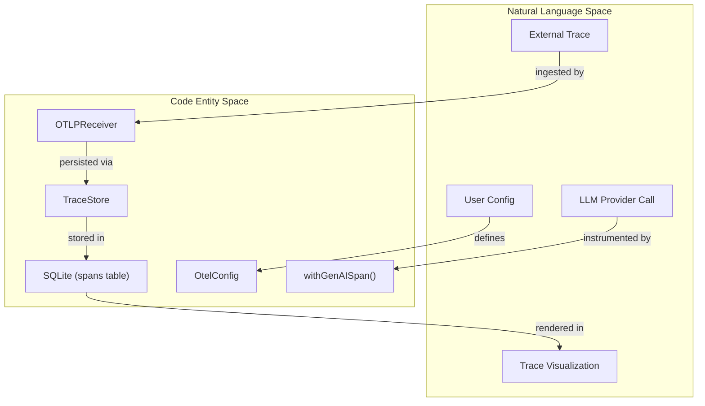
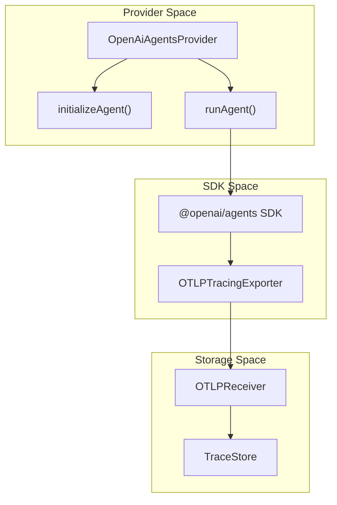

Promptfoo integrates with OpenTelemetry (OTLP) to provide deep visibility into LLM provider execution flows, performance bottlenecks, and resource usage during evaluations. This system allows Promptfoo to act as both a producer of traces (instrumenting its own provider calls) and an OTLP receiver (ingesting traces from external services).

## System Architecture

The tracing subsystem consists of an OTLP receiver for ingestion, a local storage layer using SQLite, and instrumentation logic that wraps provider calls.

### Data Flow and Code Entity Mapping

The following diagram illustrates how natural language tracing concepts map to specific code entities and the flow of trace data.

**Tracing Component Map**

Sources: [src/tracing/otlpReceiver.ts:189-202](), [src/tracing/genaiTracer.ts:8-9](), [src/tracing/store.ts:148-157]()

## OTLP Receiver

Promptfoo includes a built-in OTLP receiver that allows the CLI and server to ingest traces directly from instrumented applications (e.g., Vercel AI SDK, LangChain, or custom SDKs) without requiring a separate OpenTelemetry Collector.

### Receiver Implementation
The OTLP receiver is managed through the evaluation lifecycle to ensure it is running when needed.
- **Lifecycle Management**: `startOtlpReceiverIfNeeded` checks the `TestSuite` configuration and environment variables to initialize the receiver [src/tracing/evaluatorTracing.ts:140-155]().
- **Configuration**: The receiver defaults to `127.0.0.1:4318` and supports both `json` and `protobuf` formats [src/tracing/evaluatorTracing.ts:187-202]().
- **Active State**: The `CliState` maintains a reference to the `activeOtlpReceiver`, providing host and port information to the rest of the system [src/cliState.ts:7-11](), [src/cliState.ts:99-101]().

### Local Storage and Persistence
Traces are persisted to the local SQLite database via the `TraceStore`.
- **Database Schema**: Spans are stored in the `spansTable` and grouped by `traceId` in the `tracesTable` [src/database/tables.ts:1-10]().
- **`addSpans()`**: Ingested spans are processed, optionally sanitized, and inserted into the database [src/tracing/store.ts:184-218]().
- **Sanitization**: The system can redact sensitive information from attributes using `sanitizeTraceAttributes` [src/tracing/store.ts:62-66]().

Sources: [src/tracing/evaluatorTracing.ts:140-202](), [src/tracing/store.ts:148-218](), [src/cliState.ts:7-112]()

## Provider Instrumentation

Promptfoo automatically instruments built-in providers using GenAI Semantic Conventions.

### `genaiTracer` and `withGenAISpan()`
Provider calls are wrapped in spans that capture standardized attributes. The `withGenAISpan` utility manages the lifecycle of these spans. Standard attributes recorded include:
- **Request Metadata**: `gen_ai.request.model`, `gen_ai.request.temperature`, and `gen_ai.request.max_tokens` [site/docs/tracing.md:78-81]().
- **Usage Metrics**: `gen_ai.usage.input_tokens`, `gen_ai.usage.output_tokens`, and reasoning tokens [site/docs/tracing.md:86-88]().
- **Promptfoo Specifics**: `promptfoo.provider.id`, `promptfoo.test.index`, and `promptfoo.cache_hit` [site/docs/tracing.md:95-98]().

### Trace Context Generation
Promptfoo generates W3C Trace Context headers to propagate state.
- **`generateTraceparent()`**: Creates a standard W3C `traceparent` header (version-traceId-spanId-flags) to link internal and external spans [src/tracing/evaluatorTracing.ts:64-72]().
- **Context Management**: The `generateTraceId` and `generateSpanId` functions create the necessary 16-byte and 8-byte identifiers [src/tracing/evaluatorTracing.ts:49-58]().

Sources: [src/tracing/evaluatorTracing.ts:47-72](), [site/docs/tracing.md:66-105]()

## Trajectory and Trace-Aware Assertions

Promptfoo allows for automated validation of execution trajectories using specialized assertion types that operate on the trace data.

### Trajectory Extraction (`trajectoryUtils.ts`)
The `extractTrajectorySteps()` function processes raw spans into a normalized list of `TrajectoryStep` objects [src/assertions/trajectoryUtils.ts:12-33]().
- **Tool Identification**: The system extracts tool names and arguments from attributes like `tool.name` or `gen_ai.tool.name` [src/assertions/trajectoryUtils.ts:144-150]().
- **Command Normalization**: Tool calls matching names like `exec_command` or `shell` are classified as `command` steps [src/assertions/trajectoryUtils.ts:36-46]().
- **Search Logic**: Spans are heuristically identified as `search` steps if their names match patterns like `find` or `lookup` [src/assertions/trajectoryUtils.ts:48-48](), [src/assertions/trajectoryUtils.ts:101-110]().

### Assertion Types
Users can define assertions that inspect the trace in their configuration:
| Assertion Type | Handler | Description |
| --- | --- | --- |
| `trajectory:tool-used` | `handleTrajectoryToolUsed` | Validates that specific tools were called, supporting min/max counts [src/assertions/trajectory.ts:136-194](). |
| `trajectory:tool-sequence` | `handleTrajectoryToolSequence` | Validates the specific order of tool calls (exact or in-order) [src/assertions/trajectory.ts:22-25](). |
| `trajectory:tool-args-match` | `handleTrajectoryToolArgsMatch` | Validates that tool arguments match expected values (partial or exact) [src/assertions/trajectory.ts:33-39](). |
| `trajectory:goal-success` | `matchesTrajectoryGoalSuccess` | Uses an LLM to judge if the overall trajectory achieved a goal [src/assertions/trajectory.ts:27-29](). |

Sources: [src/assertions/trajectory.ts:1-209](), [src/assertions/trajectoryUtils.ts:1-230](), [test/assertions/trajectory.test.ts:111-197]()

## OpenAI Agents Integration

The `OpenAiAgentsProvider` provides deep integration with the `@openai/agents` SDK, including specialized tracing support.

- **Trace Setup**: The provider uses `setupTracingIfNeeded` to register the `OTLPTracingExporter` and start the SDK's trace export loop [src/providers/openai/agents.ts:150-175]().
- **Context Injection**: It uses `getOrCreateTrace` from the SDK to wrap agent runs, ensuring spans are correctly associated with the Promptfoo evaluation context [src/providers/openai/agents.ts:4-8]().
- **Agent Visualization**: The provider captures multi-turn interactions, tool executions, and handoffs between agents, which are then stored in the local `TraceStore` [src/providers/openai/agents.ts:106-145]().

**Agent Tracing Data Flow**

Sources: [src/providers/openai/agents.ts:41-207](), [test/providers/openai/agents.test.ts:83-126]()

## Vercel AI SDK Integration

Promptfoo integrates with the Vercel AI SDK by acting as a standard OTLP destination. By setting the `OTEL_EXPORTER_OTLP_ENDPOINT` in a Vercel AI application to the Promptfoo receiver (e.g., `http://localhost:4318/v1/traces`), Promptfoo captures the full execution lifecycle of the SDK, including middleware, model calls, and tool invocations.

Sources: [site/docs/tracing.md:16-37](), [site/docs/providers/vercel.md:1-10]()