This page introduces the promptfoo repository as a whole: what it does, how its major subsystems relate, and the entry points available to users. For details on any specific subsystem, follow the links to the relevant child pages throughout this document.

---

## What is promptfoo?

promptfoo is an open-source **LLM evaluation and red-teaming toolkit** (MIT license, version 0.122.2). It provides a CLI, a Node.js library, and a local web UI for:

- Running structured test suites against LLM prompts, agents, and RAG pipelines.
- Comparing responses across multiple providers side-by-side.
- Performing automated red-team scans to find security and safety vulnerabilities.
- Integrating evaluations into CI/CD pipelines.
- Reviewing pull requests for LLM-related security issues via code scanning.

> From `CITATION.cff`: *"LLM evaluation and testing toolkit for prompts, agents, and RAGs. Supports redteaming, pentesting, and vulnerability scanning for LLMs. Compare performance across various models (GPT, Claude, Gemini, Llama, etc.). Features declarative configs, CLI, and CI/CD integration."*

Sources: [README.md:1-97](), [CITATION.cff:1-21](), [package.json:1-5]()

---

## Monorepo Layout

The repository is a Node.js workspace monorepo with primary packages for the core engine, the web application, and documentation.

| Directory | Package name | Purpose |
|-----------|-------------|---------|
| `/` (root) | `promptfoo` | CLI binary, TypeScript library, evaluation engine, provider integrations, red team system |
| `src/app` | `app` | React/Vite web application (results viewer, red team setup wizard, reports) |
| `site` | `promptfoo-docs` | Docusaurus documentation site |

The root package exposes two entry points:

- **CLI binary**: `dist/src/entrypoint.js` (invoked as `promptfoo` or `pf`) [package.json:51-54]()
- **Node.js library**: `dist/src/index.js` / `dist/src/index.cjs` (imported as `promptfoo`) [package.json:12-18]()

For details on the monorepo structure and entry points, see [Monorepo Architecture](#1.1). For information on building from source, see [Dependencies and Build System](#1.2).

Sources: [package.json:29-32](), [src/app/package.json:1-6](), [site/package.json:1-4]()

---

## Major Subsystems

**System interaction diagram:**

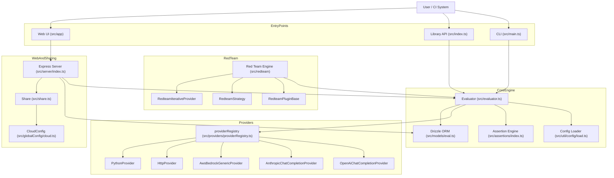

Sources: [package.json:12-18](), [src/app/package.json:8-21](), [src/main.ts:1-148]()

---

The table below maps each subsystem to its wiki page and primary source location.

| Subsystem | Description | Key Files | Wiki Page |
|-----------|-------------|-----------|-----------|
| Core Evaluation Engine | Runs test suites: renders prompts, calls providers, executes assertions | `src/evaluator.ts` | [Core Evaluation System](#2) |
| Test Suite & Config | Loads and validates `promptfooconfig.yaml`; merges configs | `src/util/config/`, `src/types/index.ts` | [Test Suite and Configuration](#2.2) |
| Assertions & Grading | Deterministic and model-graded assertion types | `src/assertions/` | [Assertions and Grading](#2.3) |
| Data Persistence | SQLite via Drizzle ORM; `Eval` and `EvalResult` models | `src/models/eval.ts`, `src/migrate.ts` | [Data Models and Persistence](#2.4) |
| Provider System | `ApiProvider` abstraction + integrations for major LLM providers | `src/providers/` | [Provider System](#3) |
| CLI | `Commander.js`-based CLI; `promptfoo` and `pf` commands | `src/main.ts` | [CLI System](#4) |
| Red Team System | Adversarial test generation, plugins, and iterative attack providers | `src/redteam/` | [Red Team System](#5) |
| Web Interface | React frontend + Express 5 + Socket.IO backend | `src/app/`, `src/server/` | [Web Interface](#6) |
| Sharing & Cloud | Chunked upload to cloud, shareable URLs, and authentication | `src/share.ts`, `src/globalConfig/cloud.ts` | [Sharing and Cloud Integration](#7) |

---

## User Interaction Modes

promptfoo can be used in three primary ways:

### 1. CLI

The CLI is the most common interface, providing commands for evaluation, red-teaming, and result management.

```sh
promptfoo eval                  # Run standard evaluation
promptfoo redteam run           # Run adversarial scan
promptfoo view                  # Open the local web results viewer
promptfoo mcp                   # Start Model Context Protocol server
```

The CLI entry point is defined in `package.json` pointing to the built `dist/src/entrypoint.js` [package.json:51-54](). Command registration is handled in `src/main.ts` [src/main.ts:71-137]().

Sources: [package.json:51-54](), [README.md:42-48](), [src/main.ts:71-137]()

### 2. Node.js Library

The package can be imported into TypeScript/JavaScript projects to programmatically run evaluations.

```ts
import { evaluate } from 'promptfoo';

const result = await evaluate({
  prompts: ['Rephrase this: {{text}}'],
  providers: ['openai:gpt-4o'],
  tests: [{ vars: { text: 'Hello world' } }],
});
```

The library entry point is `src/index.ts` (via `dist/src/index.js`) [package.json:12-18]().

Sources: [package.json:12-18](), [src/index.ts:1-10]()

### 3. Web UI

A local React application launched by `promptfoo view`. It connects to an Express server (`src/server/index.ts`) and uses Socket.IO for real-time progress updates during evaluations.

Sources: [src/app/package.json:1-10](), [package.json:87-88](), [src/main.ts:91]()

---

## Core Evaluation Flow

**High-level evaluation lifecycle:**

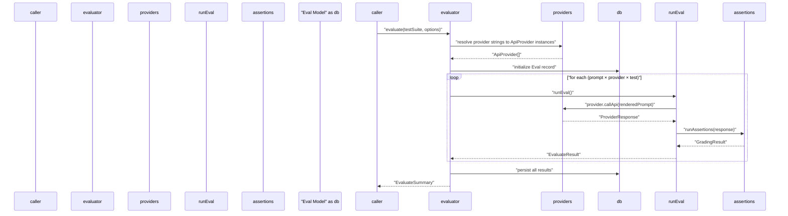

Sources: [src/evaluator.ts:1-136](), [src/node/doEval.ts:1-50](), [src/assertions/index.ts:1-15]()

---

## Key Code Entities at a Glance

**Core type and class map:**

```mermaid
classDiagram
  class "TestSuite" {
    +providers ApiProvider[]
    +prompts Prompt[]
    +tests TestCase[]
    +defaultTest TestCase
  }
  class "Eval" {
    +id string
    +create(config, prompts)
    +addResult(result)
  }
  class "ApiProvider" {
    <<interface>>
    +id() string
    +callApi(prompt, context) ProviderResponse
  }
  class "Evaluator" {
    +evaluate(testSuite, options)
    +runEval(options)
  }
  class "RedteamPluginBase" {
    <<abstract>>
    +getTests(count)
  }
  class "RedteamGraderBase" {
    <<abstract>>
    +getResult(prompt, output, test)
  }

  Evaluator --> TestSuite : "processes"
  Evaluator --> Eval : "persists to"
  TestSuite "1" --> "*" ApiProvider : "uses"
  RedteamPluginBase ..> "TestCase" : "generates"
```

Sources: [src/types/index.ts:1-209](), [src/evaluator.ts:175-179](), [src/types/providers.ts:1-44]()

---

## Technology Stack Summary

| Layer | Technology |
|-------|-----------|
| Runtime | Node.js `>=22.22.0` [package.json:49-50]() |
| Language | TypeScript 7.x [package.json:153]() |
| Build | `tsdown` + `tsc` [package.json:63]() |
| Database | SQLite via `drizzle-orm` [package.json:53]() |
| CLI framework | `commander` 14 [package.json:45]() |
| Web Server | `express` 5 + `socket.io` [package.json:55, 88]() |
| Frontend | React 19, Vite 8, Zustand 5, Radix UI [src/app/package.json:60, 75, 77, 80-96]() |
| Documentation | Docusaurus 3 [site/package.json:28]() |

Sources: [package.json:1-162](), [src/app/package.json:1-100](), [site/package.json:1-97]()

# Monorepo Architecture


## Purpose and Scope

This document describes the monorepo structure of Promptfoo, covering workspace organization, dependency management, and the build system. It explains how the three main workspaces (CLI core, Web UI, and Documentation) are organized and how they interact during development and deployment. For information about specific subsystems within each workspace, see the relevant sections: Core Evaluation System (section 2), Web Interface (section 6), and CLI System (section 4).

## Workspace Structure

Promptfoo uses npm workspaces to organize three distinct packages within a single repository. The workspace configuration is defined in the root `package.json`.

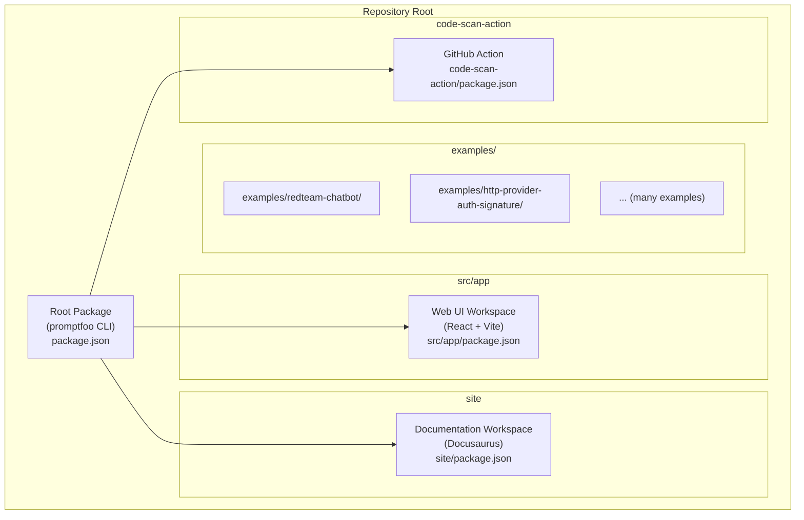

**Sources:** [package.json:29-32](), [package-lock.json:11-14]()

### Root Package (CLI Core)

The root package serves as the main CLI application and core library. It contains:

- **CLI Entry Point**: `dist/src/entrypoint.js` — registered as both `promptfoo` and `pf` bin commands [package.json:51-54]().
- **Library Entry Point**: `dist/src/index.js` (ESM) / `dist/src/index.cjs` (CommonJS) [package.json:12-17]().
- **Type Definitions**: `dist/src/index.d.ts` [package.json:33-34]().
- **Core Source**: All TypeScript source code in the `src/` directory.
- **Build Output**: Compiled and bundled JavaScript in the `dist/` directory [package.json:42-47]().
- **Exports**: Dual ESM/CJS exports via the `exports` field [package.json:13-28]().
- **Node Engine**: Requires Node `>=22.22.0` [package.json:48-50]().

### Web UI Workspace (src/app)

The Web UI workspace provides a browser-based interface for viewing evaluation results.

| Property | Value |
|----------|-------|
| Location | `src/app/` [package.json:30]() |
| Package Name | `app` [src/app/package.json:2]() |
| Type | ES Module (`"type": "module"`) [src/app/package.json:6]() |
| Build Tool | Vite [src/app/package.json:8]() |
| Framework | React 19 [src/app/package.json:60]() |
| UI Components | Radix UI primitives (`@radix-ui/*`) [src/app/package.json:80-96]() |
| Styling | Tailwind CSS v4 [src/app/package.json:72]() |
| State Management | Zustand [src/app/package.json:77]() |
| Data Fetching | TanStack Query [src/app/package.json:31]() |
| Routing | React Router v7 [src/app/package.json:65]() |
| Test Runner | Vitest [src/app/package.json:16]() |

The workspace is marked as private [src/app/package.json:3]() and is not published to npm. Build artifacts are embedded into the root package during the main build process via `npm run build:app` [package.json:60]().

**Sources:** [src/app/package.json:1-100](), [package.json:60]()

### Documentation Workspace (site)

The documentation workspace uses Docusaurus to generate the static documentation site.

| Property | Value |
|----------|-------|
| Location | `site/` [package.json:31]() |
| Package Name | `promptfoo-docs` [site/package.json:2]() |
| Build Tool | Docusaurus 3.x (`@docusaurus/core`) [site/package.json:28]() |
| Dev Server Port | 3100 (configurable via `PORT` env) [site/package.json:11]() |
| Mermaid Support | `@docusaurus/theme-mermaid` [site/package.json:33]() |

The site fetches GitHub stats before each build via `scripts/fetch-stats.mjs` [site/package.json:7-12]().

**Sources:** [site/package.json:1-96]()

### GitHub Action Workspace (code-scan-action)

A specialized package for scanning pull requests with promptfoo's code-scan capabilities.

- **Location**: `code-scan-action/`
- **Build Tool**: `esbuild` [code-scan-action/package.json:10]()
- **Target**: Node 22 [code-scan-action/package.json:10]()
- **Dependencies**: `@actions/core`, `@actions/github`, `@octokit/rest` [code-scan-action/package.json:21-25]()

**Sources:** [code-scan-action/package.json:1-35]()

## Internal Layer Boundaries

The architecture enforces strict dependency boundaries between modules to prevent circular dependencies and maintain separation of concerns. These are defined in `architecture/layers.json` and enforced by `scripts/checkArchitectureBoundaries.ts`.

| Layer | Responsibility | Allowed to Import From |
|-------|----------------|------------------------|
| **CLI/Commands** | Entrypoints and user interaction | `eval`, `redteam`, `server`, `util` |
| **Red Team** | Adversarial generation and attack providers | `eval`, `providers`, `util` |
| **Eval Engine** | Core evaluation logic and assertions | `providers`, `database`, `util` |
| **Providers** | LLM and API integrations | `util`, `types` |
| **Database** | Persistence layer (SQLite/Drizzle) | `types`, `util` |

**Sources:** [package.json:58](), [scripts/checkArchitectureBoundaries.ts:1-20]()

## Dependency Management

Promptfoo maintains an extensive list of dependencies to support various LLM providers and evaluation capabilities.

### Core Dependencies

Core dependencies are always installed and include:

- **LLM SDKs**: `@anthropic-ai/sdk`, `openai`, `ai` (Vercel AI SDK) [package-lock.json:16,74,35]()
- **Database**: `drizzle-orm` with `@libsql/client` [package-lock.json:53,26]()
- **Server**: `express` 5.x, `socket.io`, `cors`, `compression` [package-lock.json:55,88,47,46]()
- **CLI**: `commander`, `chalk`, `cli-progress`, `@inquirer/*` packages [package-lock.json:45,41,43,19-25]()
- **Templating**: `nunjucks` [package-lock.json:73]()
- **Utilities**: `js-yaml`, `glob`, `ajv`, `zod`, `winston` (logging) [package-lock.json:66,62,36,95,93]()
- **Tracing**: `@opentelemetry/*` packages [package-lock.json:27-33]()

### Optional and Dev Dependencies

Optional dependencies reduce the installation footprint and are loaded dynamically when needed. These include platform-specific binaries and specialized SDKs:

| Package Group | Purpose |
|---|---|
| `@aws-sdk/*` | AWS Bedrock and S3 integration [package-lock.json:104-107]() |
| `@azure/*` | Azure provider support [package-lock.json:110-111]() |
| `@ibm-cloud/watsonx-ai` | IBM watsonx support [package-lock.json:114]() |
| `@modelcontextprotocol/sdk` | MCP integration [package-lock.json:178]() |
| `playwright` | Browser-based providers [package-lock.json:143]() |

**Sources:** [package-lock.json:1-198]()

### Dependency Overrides

The repository uses npm `overrides` to enforce specific versions and reduce vulnerability surface:

| Override | Target Version |
|---|---|
| `chokidar` | `5.0.0` [package.json:115]() |
| `whatwg-url` | `16.0.1` [package.json:116]() |
| `esbuild` | `0.28.2` [package.json:117]() |
| `react`, `react-dom` | `^19.2.4` [package.json:124-125]() |

**Sources:** [package.json:113-162]()

## Build System

The build system orchestrates the compilation of TypeScript source code and the bundling of the web application.

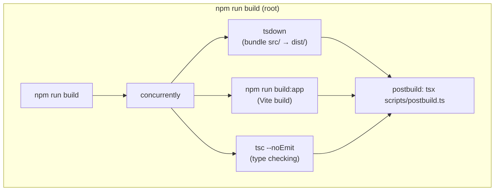

**Sources:** [package.json:63-64,108]()

### Build Script Breakdown

The main build command (`npm run build`) runs three tasks in parallel via `concurrently` [package.json:63]():

1. **`npm run tsc`**: Runs `tsc --noEmit` to perform type checking across the project [package.json:108]().
2. **`tsdown`**: Bundles the TypeScript source in `src/` into the `dist/` directory using `tsdown.config.ts` [package.json:63]().
3. **`npm run build:app`**: Triggers the Vite build process in the `src/app` workspace [package.json:60]().

After these complete, the **`postbuild`** hook runs `tsx scripts/postbuild.ts` to perform final asset organization and dual-format (ESM/CJS) support [package.json:64]().

### Development Workflows

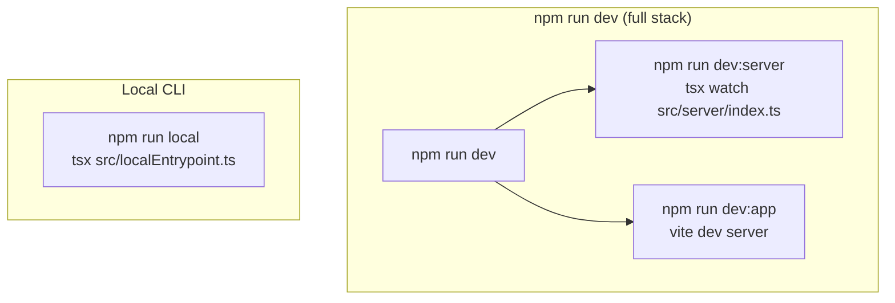

**Sources:** [package.json:74-75,89]()

The development setup uses `concurrently` to run both the Express backend server (`src/server/index.ts`) and the Vite frontend dev server simultaneously [package.json:75]().

## Code Quality and Testing

Promptfoo uses a variety of tools to ensure code quality and stability.

### Code Quality Tools

| Tool | Purpose | Command |
|---|---|---|
| **Biome** | Linting and formatting (JS/TS/JSON) | `npm run lint` [package.json:87]() |
| **Prettier** | Formatting (CSS/MD/YAML) | `npm run format` [package.json:79]() |
| **Vitest** | Unit and Integration testing | `npm test` [package.json:104]() |
| **Drizzle Kit** | Database migrations | `npm run db:generate` [package.json:66]() |
| **Architecture Check** | Enforce module boundaries | `npm run architecture:check` [package.json:58]() |

**Sources:** [package.json:58-104]()

### Testing Infrastructure

The test suite is divided into several categories to balance speed and coverage:

- **Unit Tests**: Fast tests for individual functions and classes using Vitest [package.json:104]().
- **Integration Tests**: Tests that exercise multiple components or external APIs [package.json:98]().
- **Smoke Tests**: High-level tests to ensure basic functionality is intact [package.json:103]().
- **Red Team Integration**: Specialized end-to-end tests for adversarial capabilities [package.json:102]().
- **App Tests**: Browser and component tests for the React interface [package.json:94-95]().

**Sources:** [package.json:94-105]()

## Release and Versioning

The release process is automated to ensure consistency in versioning and metadata updates.

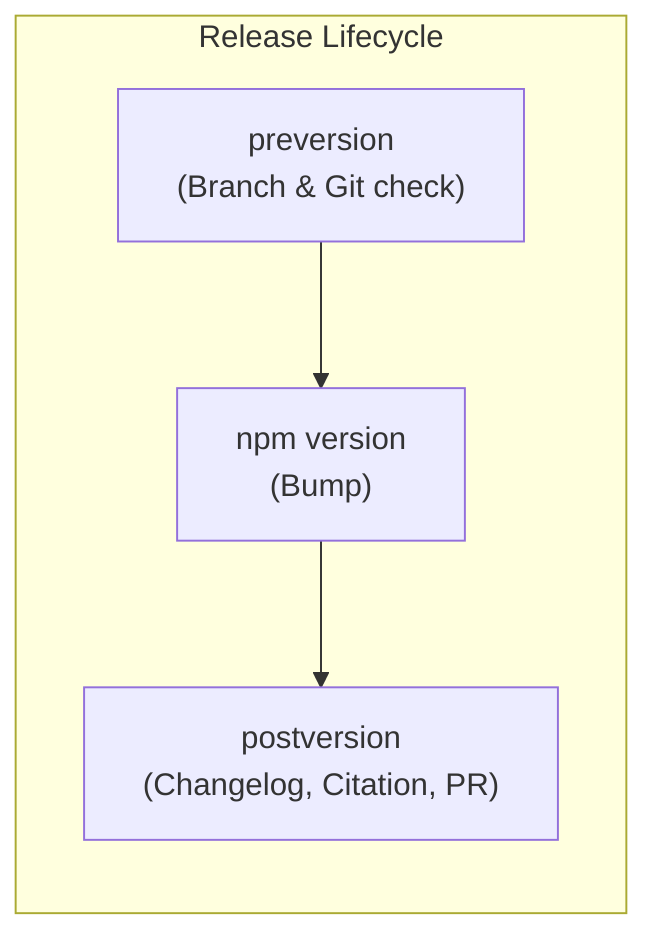

**Sources:** [package.json:90-92]()

1. **`preversion`**: Ensures the user is on the `main` branch and has the GitHub CLI installed before starting a version bump branch [package.json:90]().
2. **`postversion`**: Runs `scripts/update-changelog-version.cjs` and `scripts/generateCitation.ts` to keep project metadata in sync with the new version, then automatically creates a GitHub Pull Request [package.json:92]().
3. **`prepublishOnly`**: Validates the presence of `PROMPTFOO_POSTHOG_KEY`, performs a clean build, and bundles assets before publishing to npm [package.json:93]().

**Sources:** [package.json:90-93]()

# Dependencies and Build System


This page documents the npm/Node.js dependency structure, TypeScript compilation pipeline, and build scripts for the promptfoo core package. It covers the root-level build configuration and how the workspace packages are assembled into the final distributable.

For information about the CI/CD workflows that consume the build (GitHub Actions, Docker publishing, release automation), see [Build System and CI/CD](9.1). For the testing infrastructure (Vitest configs, coverage), see [Testing Infrastructure](9.2). For the monorepo layout and the purpose of each workspace, see [Monorepo Architecture](1.1).

---

## Node.js and npm Requirements

The repository enforces a specific Node.js version range across all packages to ensure compatibility with modern ESM features and the SQLite driver:

| Requirement | Value |
|---|---|
| Supported Node versions | `^20.20.0 || >=22.22.0` |
| npm version (minimum) | `>= 11` (via Renovate constraint) |
| Package manager | npm with lockfile version 3 |
| Module system | ESM (`"type": "module"` in root `package.json`) |

Sources: [package.json:48-50](), [renovate.json:8-10](), [package-lock.json:4-4]()

---

## Workspace Structure

The repository uses npm workspaces to manage multiple packages from a single `package-lock.json`. This allows for shared dependencies while isolating the frontend UI and documentation from the core CLI logic.

**Workspace layout:**

| Workspace path | Package name | Purpose |
|---|---|---|
| _(root)_ | `promptfoo` | CLI, core evaluation engine, server backend |
| `src/app` | `app` | React web UI (Vite-based) |
| `site` | `promptfoo-docs` | Docusaurus documentation site |

Sources: [package.json:29-32](), [src/app/package.json:1-4](), [site/package.json:1-4]()

**Workspace dependency diagram:**

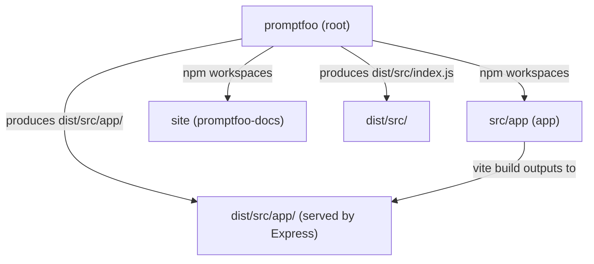

Sources: [package.json:12-28](), [package.json:29-32]()

---

## Runtime Dependencies

These packages are required in the published `promptfoo` npm package to support the CLI, the evaluation engine, and the local server.

### Core Infrastructure

| Package | Version | Role |
|---|---|---|
| `express` | `^5.2.1` | HTTP server for the web UI and API |
| `socket.io` | `^4.8.3` | Real-time evaluation progress streaming |
| `commander` | `^14.0.3` | CLI command and argument parsing |
| `@libsql/client` | `^0.17.3` | SQLite/LibSQL driver for evaluation persistence |
| `drizzle-orm` | `^0.45.1` | ORM for SQLite schema management |
| `zod` | `^4.3.6` | Runtime schema validation and TypeScript inference |
| `winston` | `^3.19.0` | Logging infrastructure |
| `dotenv` | `^17.3.1` | Environment variable loading |
| `tsx` | `^4.23.11` | TypeScript execution for development and scripts |

Sources: [package-lock.json:15-95]()

### LLM Provider SDKs (Runtime)

The project includes several SDKs as direct dependencies to ensure robust integration with major providers:

| Package | Role |
|---|---|
| `@anthropic-ai/sdk` | Anthropic Claude API client |
| `openai` | OpenAI and Azure OpenAI client |
| `ai` (Vercel AI SDK) | Unified AI SDK for streaming and tool use |
| `@opentelemetry/api` | Tracing and observability |
| `posthog-node` | Telemetry and usage analytics |

Sources: [package-lock.json:16-34](), [package-lock.json:73-77]()

---

## Optional Dependencies

Optional dependencies are installed when present but do not cause install failures if unavailable. They gate platform-specific provider integrations or heavy media processing libraries.

| Package group | Packages | When needed |
|---|---|---|
| AWS | `@aws-sdk/client-bedrock-runtime`, `@aws-sdk/client-bedrock-agent-runtime`, `@aws-sdk/client-s3`, `@aws-sdk/client-sagemaker-runtime` | AWS Bedrock and SageMaker providers |
| Azure | `@azure/identity`, `@azure/openai-assistants`, `@azure/ai-projects`, `@azure/storage-blob` | Azure OpenAI and AI Foundry providers |
| Google | `google-auth-library`, `@googleapis/sheets` | Google Vertex AI auth and Google Sheets integration |
| IBM | `@ibm-cloud/watsonx-ai`, `ibm-cloud-sdk-core` | IBM Watsonx provider |
| Agent SDKs | `@anthropic-ai/claude-agent-sdk`, `@openai/agents`, `@openai/codex-sdk`, `@opencode-ai/sdk` | Agentic evaluation and SDK-based providers |
| Infrastructure | `@modelcontextprotocol/sdk` | MCP server support and tool exposure |

Sources: [package-lock.json:162-182]()

---

## TypeScript Configuration and Compilation

The root package uses a two-phase TypeScript process to ensure type safety while maintaining high performance during bundling.

1. **Type checking**: `tsc --noEmit` — validates types across the project without emitting files. [package.json:108-108]()
2. **Bundling**: `tsdown` — a fast TypeScript bundler (based on esbuild/rolldown) that compiles and bundles source into the `dist/` directory. [package.json:63-63]()

The published output includes both ESM and CJS formats to support the widest range of Node.js environments:

```
dist/src/index.js      ← ESM (import)
dist/src/index.cjs     ← CommonJS (require)
dist/src/index.d.ts    ← Type declarations
dist/src/entrypoint.js ← CLI binary entrypoint (aliased to 'promptfoo' and 'pf')
```

Sources: [package.json:12-28](), [package.json:33-41](), [package.json:51-54]()

### postbuild.ts

The `postbuild` script (`tsx scripts/postbuild.ts`) runs after every successful build. It handles tasks that the bundler cannot, such as copying static assets or refining the `dist` structure for distribution.

Sources: [package.json:64-64]()

---

## Build Scripts

### Full Build Pipeline

The build pipeline is designed for speed and concurrency. It uses `concurrently` to run the type checker, the core bundler, and the frontend build in parallel.

**Build pipeline diagram:**

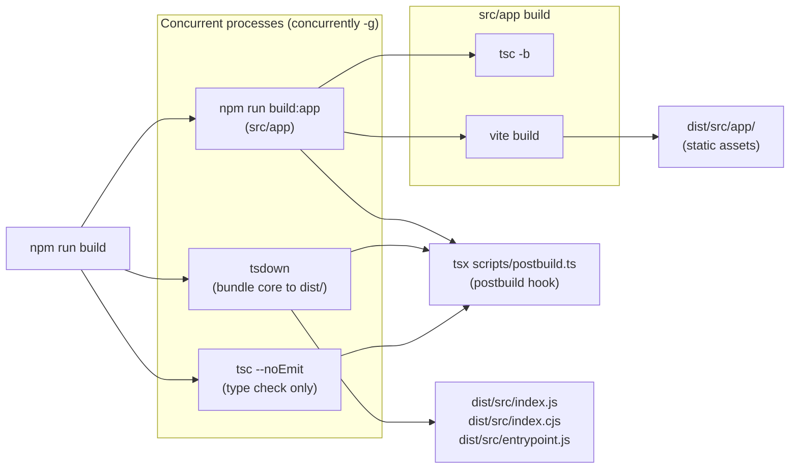

Sources: [package.json:63-64](), [src/app/package.json:10-10]()

### Key npm Scripts Reference

| Script | Command | Purpose |
|---|---|---|
| `build` | `concurrently ... "npm run tsc" "tsdown" "npm run build:app"` | Full production build of all components |
| `build:clean` | `shx rm -rf dist` | Remove build artifacts and stale files |
| `build:watch` | `tsdown --watch` | Incremental watch build for core CLI/server |
| `build:app` | `npm run build --prefix src/app` | Build React app only (Vite + TSC) |
| `dev` | `concurrently "npm run dev:server" "npm run dev:app"` | Start backend server (tsx watch) + frontend (Vite) |
| `dev:server` | `tsx watch src/server/index.ts` | Express server with hot reload for backend logic |
| `dev:app` | `npm run dev --prefix src/app` | Vite dev server for rapid frontend iteration |
| `local` | `tsx src/localEntrypoint.ts` | Run CLI directly from source using tsx |

Sources: [package.json:55-75](), [package.json:89-89]()

The `NODE_OPTIONS='--max-old-space-size=8192'` flag is applied to `tsdown` invocations to prevent heap exhaustion during complex bundling operations. [package.json:62-63]()

---

## Database Schema Management

Drizzle ORM manages the SQLite schema used by the evaluation persistence layer. This allows for declarative schema definitions and automated migrations.

| Script | Command | Purpose |
|---|---|---|
| `db:generate` | `npx drizzle-kit generate` | Generate migration SQL files from TypeScript schema |
| `db:migrate` | `tsx src/migrate.ts` | Apply pending SQL migrations to the local database |
| `db:studio` | `npx drizzle-kit studio` | Launch a web-based GUI to inspect the SQLite database |

Sources: [package.json:66-68]()

---

## Dependency Management

### npm Overrides

The root `package.json` defines overrides to force specific versions of transitive dependencies, resolving security vulnerabilities and ensuring version consistency across workspaces:

| Override | Pinned value | Reason |
|---|---|---|
| `chokidar` | `5.0.0` | Ensure consistent file watching behavior |
| `whatwg-url` | `16.0.1` | Fix compatibility issues in Node environments |
| `esbuild` | `0.28.2` | Pin bundler version for deterministic builds |
| `react` / `react-dom` | `^19.2.4` | Enforce React 19 across the monorepo |
| `undici` | `>=7.29.0 <8` | Fix specific Node "terminated" errors and vulnerabilities |

Sources: [package.json:113-162](), [CHANGELOG.md:41-50]()

### Renovate Automation

The `renovate.json` configuration automates dependency updates with specific grouping rules to reduce PR noise:

| Group | Packages |
|---|---|
| LLM providers | Anthropic, AWS SDK, Azure, OpenAI, PostHog, IBM, fal.ai, langfuse |
| Frameworks | Storybook, Docusaurus, React, TanStack, MUI |
| Tooling | Vitest, SWC, Biome, Playwright, Drizzle ORM, tsdown |
| Infrastructure | OpenTelemetry, socket.io, GitHub Actions, Octokit |

Sources: [renovate.json:61-191]()

---

## src/app Workspace Dependencies

The React app (`src/app`) is a separate TypeScript project that bundles into static assets served by the Express backend.

Key app-level dependencies:

| Package | Role |
|---|---|
| `vite` | Fast frontend build tool and dev server |
| `react` / `react-dom` | Core UI framework (v19) |
| `@tanstack/react-query` | Asynchronous state and API data fetching |
| `@tanstack/react-table` | High-performance results table rendering |
| `zustand` | Lightweight client-side state management |
| `socket.io-client` | Client-side real-time evaluation updates |
| `@radix-ui/*` | Accessible, unstyled UI components (Dialog, Tabs, etc.) |
| `tailwindcss` | Utility-first CSS framework (v4) |

Sources: [src/app/package.json:31-99]()

# Core Evaluation System


This page provides an overview of the evaluation pipeline that powers promptfoo's LLM testing capabilities, tracing how a configuration file becomes a set of scored results. It covers the major components and their roles as they relate to each other.

For deeper coverage of individual subsystems, see:
- [Evaluation Engine](#2.1) — `Evaluator` class internals, concurrency, and progress tracking
- [Test Suite and Configuration](#2.2) — config file loading, merging, and the `TestSuite` type
- [Assertions and Grading](#2.3) — all assertion types and grading logic
- [Data Models and Persistence](#2.4) — the `Eval`/`EvalResult` database models
- [Utilities and Output Generation](#2.5) — prompt rendering, transforms, and output formats

---

## What the Core Evaluation System Does

The core evaluation system takes a `TestSuite` (a fully-resolved in-memory representation of a `promptfooconfig.yaml`) and executes a matrix of test cases: every configured **prompt** × every configured **provider** × every **test case** (and its variable combinations). For each cell in that matrix, it calls the provider API, applies output transforms, runs all assertions, and accumulates scored `EvaluateResult` objects. The system also handles concurrency control, rate limiting, progress reporting, caching, extension hooks, and result persistence.

---

## Top-Level Entry Points

There are two entry points depending on whether the caller is using the CLI or the Node.js library API.

| Entry point | File | Role |
|---|---|---|
| `evaluate()` (public) | [src/index.ts:63-63]() | Library API — entry point for programmatic usage |
| `evaluate()` (internal) | [src/evaluator.ts:901-1185]() | The core execution logic; creates the `Evaluator` instance and runs the eval loop |
| `doEval()` | [src/node/doEval.ts:441-653]() | CLI-side handler — resolves configs, handles CLI flags, and calls the internal `evaluate()` |

The public `evaluate()` in `src/index.ts` is the primary programmatic API [src/index.ts:63-63](). It delegates to the core `evaluate` function in the Node-specific entry point [src/index.ts:4-4]().

Sources: [src/index.ts:4-63](), [src/evaluator.ts:901-1185](), [src/node/doEval.ts:40-40]()

---

## Evaluation Pipeline

**Diagram: End-to-End Evaluation Pipeline**

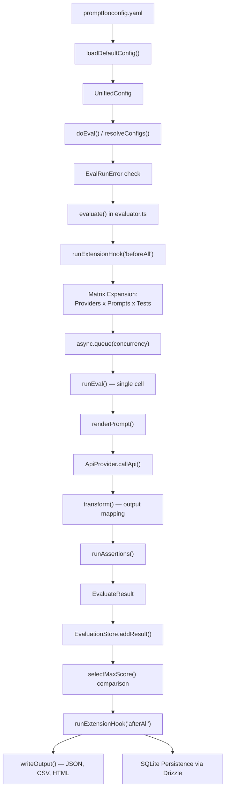

Sources: [src/evaluator.ts:901-1185](), [src/main.ts:67-69](), [src/evaluatorHelpers.ts:21-21](), [src/matchers/comparison.ts:23-23](), [src/node/doEval.ts:7-7]()

---

## Key Code Entities

**Diagram: Core Code Entities and Their Relationships**

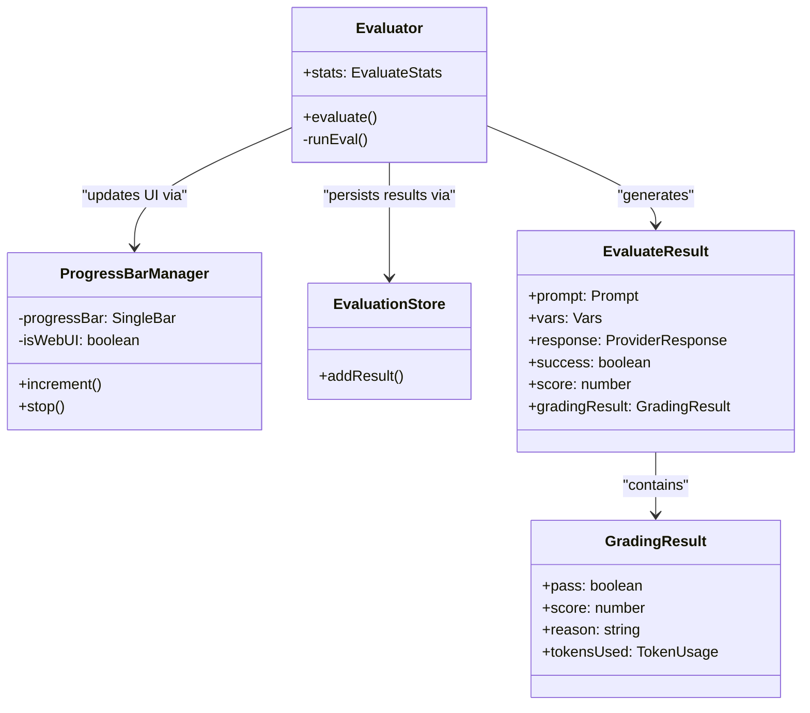

Sources: [src/evaluator.ts:175-200](), [src/evaluator.ts:122-122](), [src/types/index.ts:325-346](), [src/types/index.ts:453-468]()

---

## Central Data Types

### `TestSuite`
`TestSuite` is the normalized in-memory form of a configuration file [src/types/index.ts:75-75](). It contains instantiated `providers`, processed `prompts`, and normalized `tests` (as `AtomicTestCase` objects).

### `UnifiedConfig`
The Zod-validated structure representing the `promptfooconfig.yaml` [src/types/index.ts:15-15]().

### `EvaluateResult`
The output of a single `runEval()` call [src/evaluator.ts:67-67](). It includes the final `prompt`, the `response` from the provider, and the `gradingResult`.

### `GradingResult`
The outcome of running assertions against a provider response [src/evaluator.ts:69-69](). It tracks whether the test passed, the numerical score, and token usage from model-graded assertions.

### `ResultFailureReason`
An enum identifying why a test failed [src/evaluator.ts:73-73]():
- `ASSERT`: Assertion failure.
- `ERROR`: Provider or system error.

Sources: [src/types/index.ts:1-209](), [src/evaluator.ts:60-80]()

---

## The `runEval()` Function

`runEval()` is the internal method in `Evaluator` that handles the execution of a single prompt/provider/test combination.

1. **Prompt Rendering**: Uses `renderPrompt()` to resolve variables and templates [src/evaluatorHelpers.ts:21-21]().
2. **Provider Call**: Invokes the `ApiProvider` via the `RateLimitRegistry` to manage throttling [src/evaluator.ts:37-39]().
3. **Output Transformation**: Applies `transform` logic to the raw provider response [src/util/transform.ts:112-112]().
4. **Assertion Execution**: Calls `runAssertions()` to process deterministic and model-graded checks [src/assertions/index.ts:13-13]().

Sources: [src/evaluator.ts:9-26](), [src/evaluatorHelpers.ts:21-21]()

---

## Concurrency and Rate Limiting

The `Evaluator` manages concurrency via `async.queue` [src/evaluator.ts:4-4](). It uses a `RateLimitRegistry` to prevent overwhelming providers.

- **Adaptive Concurrency**: The system can adjust the number of simultaneous requests based on provider feedback using an AIMD algorithm [src/evaluator.ts:39-41]().
- **ProgressBarManager**: Manages CLI progress bars [src/evaluator.ts:175-175]() or reports progress to the web UI.

Sources: [src/evaluator.ts:37-43](), [src/evaluator.ts:175-179]()

---

## Extension Hooks

The evaluation lifecycle includes several hooks for custom logic defined in `evaluatorHelpers.ts` [src/evaluatorHelpers.ts:31-37]():
- `beforeAll`: Runs once before the evaluation starts.
- `beforeEach`: Runs before each individual test case.
- `afterEach`: Runs after each individual test case.
- `afterAll`: Runs once after all tests have completed.

Sources: [src/evaluatorHelpers.ts:21-37](), [src/index.ts:31-37]()

---

## Result Persistence and Output

Evaluation results are stored in a SQLite database using the `EvaluationStore` interface [src/evaluator.ts:118-120]().
- **Database**: Managed via Drizzle ORM migrations triggered at startup [src/main.ts:64-64]().
- **Output Formats**: The CLI supports multiple output formats including JSON, CSV, YAML, and HTML via `writeOutput()` [src/util/index.ts:28-28]().
- **Binary Data**: Media assets (images, audio) generated by models are handled by the `extractor` [src/evaluator.ts:16-16]().

Sources: [src/main.ts:64-64](), [src/util/index.ts:24-29](), [src/evaluator.ts:16-24]()

# Evaluation Engine


## Purpose and Scope

The Evaluation Engine is the core orchestration system that executes test cases against LLM providers and validates their outputs. This document covers the evaluation lifecycle, test execution mechanics, and result aggregation. For information about specific assertion types and grading, see **Assertions and Grading (2.3)**. For provider implementation details, see **Provider System (3)**.

The evaluation engine is implemented primarily in `evaluator.ts` and provides both CLI and programmatic interfaces for running tests via the `evaluate()` function [src/index.ts:4]().

**Sources:** [src/evaluator.ts:1-179](), [src/index.ts:1-73]()

---

## Core Architecture

### The Evaluator Class

The evaluation engine is encapsulated in the `Evaluator` class, which manages the complete evaluation lifecycle from configuration to result persistence.

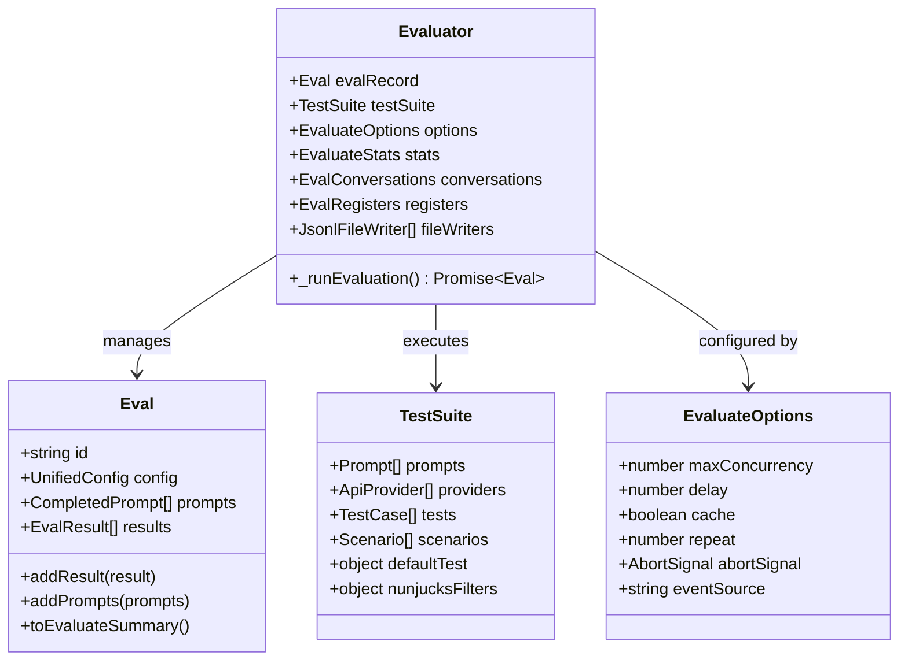

**Key Components:**

- **`Evaluator`**: Main orchestrator class that coordinates test execution [src/evaluator.ts:122]().
- **`evalRecord`**: Persistent record of the evaluation, often mapped to the `Eval` model.
- **`conversations`**: Map storing conversation history for multi-turn evaluations [src/evaluator.ts:124]().
- **`registers`**: Storage for values passed between test cases via `storeOutputAs` [src/evaluator.ts:125]().

**Sources:** [src/evaluator.ts:116-136](), [src/types/index.ts:208-209]()

---

## Evaluation Lifecycle

### High-Level Execution Flow

The evaluation lifecycle begins with the `evaluate()` function, which initializes the `Evaluator` and triggers the internal `_runEvaluation()` loop.

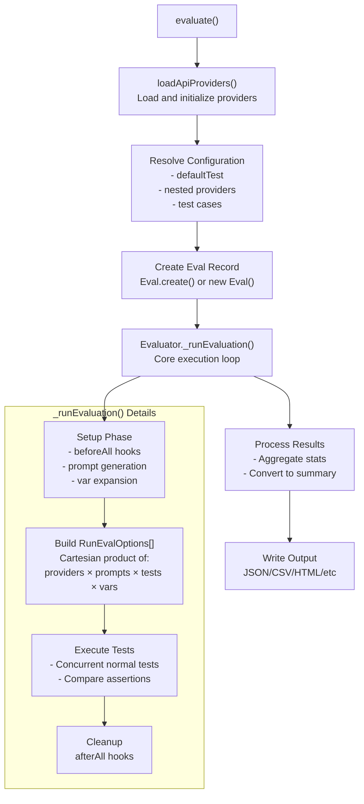

**Sources:** [src/evaluator.ts:1-179](), [src/commands/eval.ts:18-170](), [src/index.ts:63-73]()

---

### The _runEvaluation Method

The `_runEvaluation()` method implements the core evaluation loop with several distinct phases:

#### Phase 1: Configuration and Setup

1. **Timeout Management**: Sets up global `AbortController` using values from `getEvalTimeoutMs()` and `getMaxEvalTimeMs()` [src/envars.ts:20]().
2. **Extension Hooks**: Runs `beforeAll` hooks using `runExtensionHook()` that can modify the test suite [src/evaluator.ts:21]().
3. **Prompt Rendering**: Prepares prompts using `renderPrompt()` [src/evaluator.ts:21]().
4. **Prompt ID Generation**: Creates unique IDs for prompts using `generateIdFromPrompt()` [src/evaluator.ts:25]().

**Sources:** [src/evaluator.ts:1-26](), [src/envars.ts:20]()

#### Phase 2: Test Case Building

The evaluator builds a complete list of `RunEvalOptions` objects, one for each test execution:

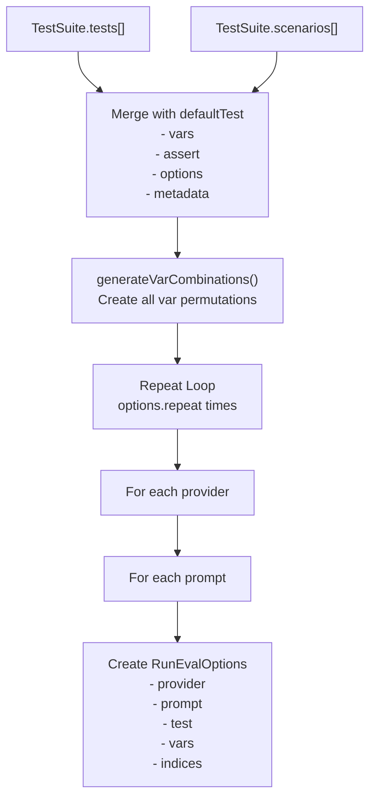

**Important Details:**
- **Concurrency Control**: The CLI `eval` command allows setting `-j, --max-concurrency` [src/commands/eval.ts:89-91](), which defaults to `DEFAULT_MAX_CONCURRENCY` [src/constants.ts:19]().
- **Filtering**: Supports extensive filtering including `--filter-range` [src/commands/eval.ts:108-110](), `--filter-pattern` [src/commands/eval.ts:104-106](), and `--filter-metadata` [src/commands/eval.ts:134-139]().

**Sources:** [src/commands/eval.ts:88-140](), [src/constants.ts:19]()

---

## Test Execution

### The runEval Function

The `runEval()` function executes a single test case against a provider. It is the atomic unit of evaluation.

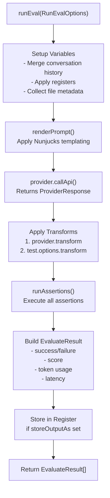

**Sources:** [src/evaluator.ts:74](), [src/evaluatorHelpers.ts:21]()

### Variable and Context Setup

Before prompt rendering, `runEval()` prepares the execution context:

**Conversation Management:**
- Checks if prompt uses `_conversation` variable via `analyzeTemplateReference` [src/evaluator.ts:157]().
- Caches these results in `promptUsesConversationVariableCache` (max 1024 entries) [src/evaluator.ts:145-149]().

**File Metadata:**
- Collects metadata from `file://` references using `collectFileMetadata()` [src/evaluator.ts:21]().

**Sources:** [src/evaluator.ts:144-170](), [src/evaluatorHelpers.ts:21]()

### Provider Execution and Scheduling

The evaluator uses a `RateLimitRegistry` to manage concurrency and rate limits:

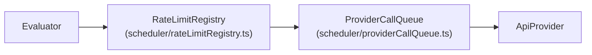

- **`RateLimitRegistry`**: Manages the global state of provider rate limits. It exposes an `execute` method that wraps provider calls [src/types/index.ts:51-62]().
- **`ProviderCallQueue`**: A grouped call queue that manages deferred provider calls, especially for serial grading orchestration [src/types/index.ts:67-69]().
- **Adaptive Concurrency**: The system uses `createProviderRateLimitOptions` to configure the scheduler [src/evaluator.ts:36]().

**Sources:** [src/evaluator.ts:33-44](), [src/types/index.ts:48-69]()

---

## Assertion Execution

After provider output and transformations, assertions are evaluated:

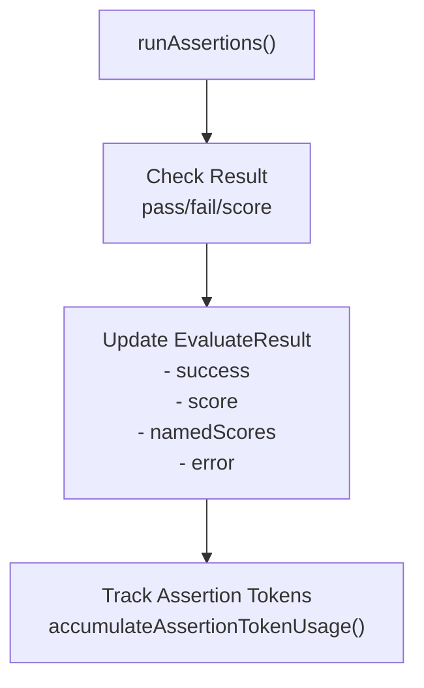

**Assertion Result Handling:**
- **Deterministic Metrics**: Logical tests like `equals`, `contains`, and `regex` [site/docs/configuration/expected-outputs/deterministic.md:32-80]().
- **Model-Graded**: Uses an LLM provider to grade output based on a rubric [site/docs/configuration/expected-outputs/index.md:52-53]().
- **Token Tracking**: Token usage is tracked for assertions via `accumulateAssertionTokenUsage` [src/evaluator.ts:104]().

**Sources:** [src/evaluator.ts:9-15](), [src/evaluator.ts:103-112](), [site/docs/configuration/expected-outputs/index.md:46-57]()

---

## Progress Reporting

The `ProgressBarManager` class manages progress visualization:

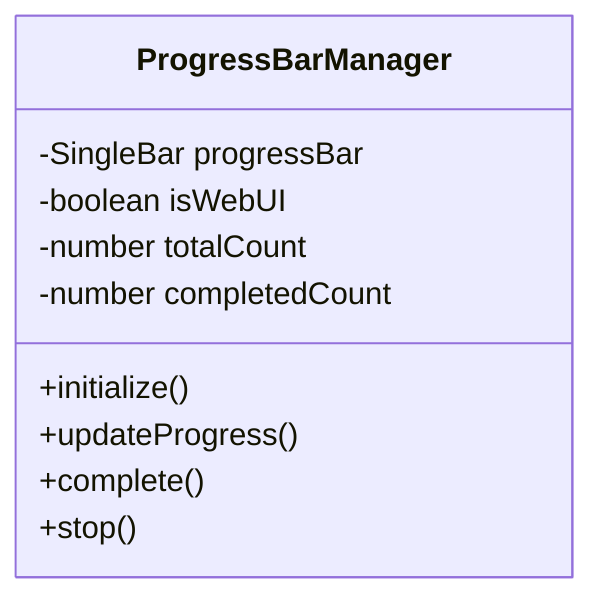

- **CLI Progress**: Uses `cli-progress` to show real-time status [src/evaluator.ts:176]().
- **CI Mode**: Switches to `CIProgressReporter` when running in continuous integration environments [src/evaluator.ts:27]().
- **Logger Integration**: The manager can intercept log callbacks to prevent progress bar corruption [src/evaluator.ts:178-179]().

**Sources:** [src/evaluator.ts:171-179](), [src/evaluator.ts:27]()

---

## Advanced Features

### Token Usage Tracking

Token usage is tracked using `TokenUsageTracker` [src/evaluator.ts:102](). It breaks down usage into:
- **Total Usage**: `accumulateResponseTokenUsage` [src/evaluator.ts:107]().
- **Grading Usage**: `accumulateGradingTokenUsage` [src/evaluator.ts:106]().
- **Assertion Usage**: `accumulateAssertionTokenUsage` [src/evaluator.ts:104]().

**Sources:** [src/evaluator.ts:102-111](), [src/contracts/shared.ts:7]()

### Concurrency and Timeouts

- **Global Timeout**: Enforced via `getEvalTimeoutMs` [src/envars.ts:20]().
- **Concurrency**: Controlled via `InternalEvaluateOptions.maxConcurrency` [src/types/internal.ts:14]().
- **Delay**: Optional delay between tests to prevent rate limits [src/types/index.ts:109]().

**Sources:** [src/envars.ts:20](), [src/types/index.ts:107-109]()