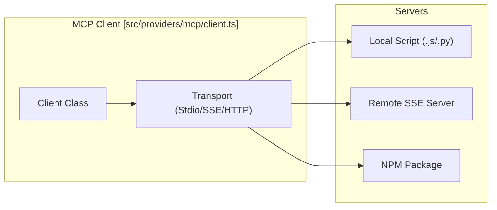
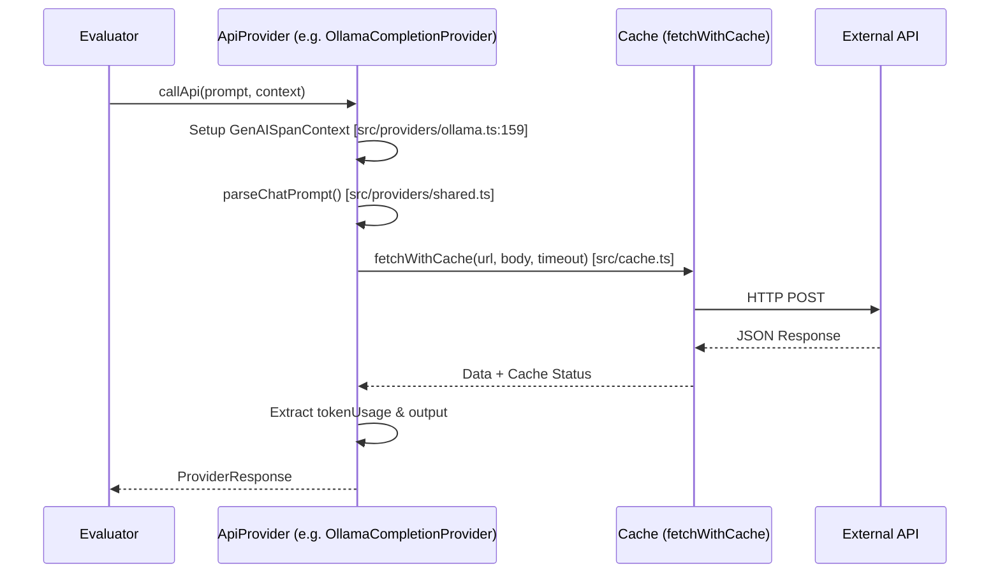
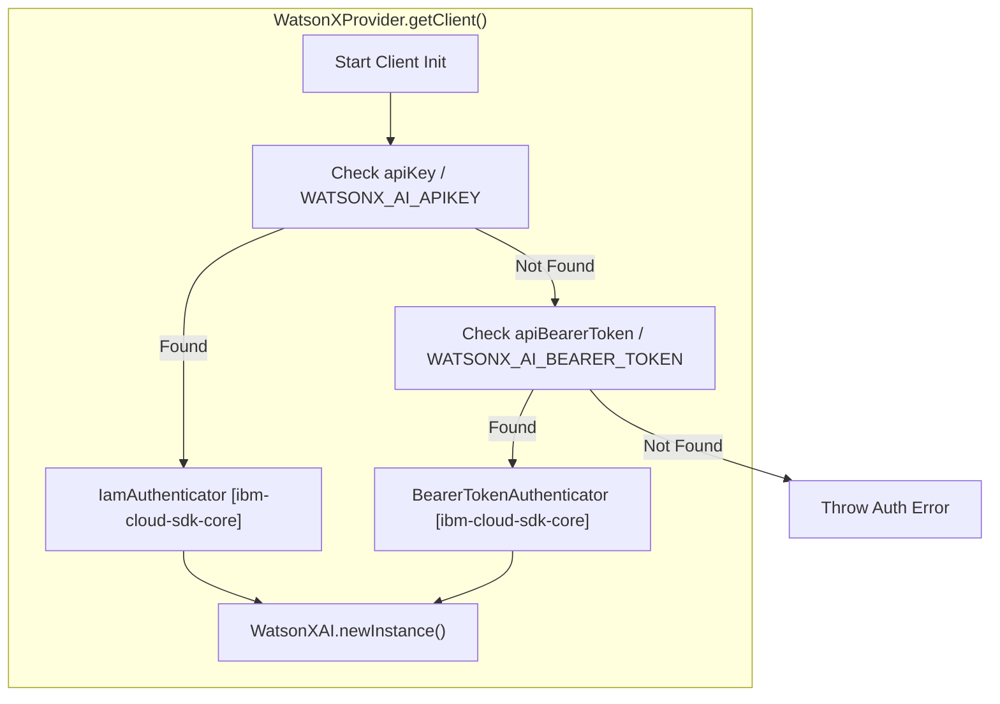

## Purpose and Scope

This document provides an overview of Promptfoo's provider ecosystem, covering the 50+ LLM provider integrations beyond the core providers detailed in earlier sections. It focuses on the architecture patterns used to integrate different provider types, including OpenAI-compatible wrappers, embedding providers, open-source model providers (Ollama, LocalAI), and specialized services like Mistral, WatsonX, xAI, and HuggingFace.

---

## Provider Categories

Promptfoo organizes providers into several major categories based on their implementation patterns and capabilities:

### Category Overview Diagram

```mermaid
graph TB
    subgraph "Provider Categories"
        OpenAIBased["OpenAI-Based Providers<br/>(Wrapper Pattern)"]
        Embeddings["Embedding Providers"]
        OpenSource["Open Source Providers"]
        Custom["Custom Providers"]
        Cloud["Cloud Providers"]
    end

    subgraph "OpenAI-Based Examples"
        OAI1["OpenRouter"]
        OAI2["Perplexity"]
        OAI3["TogetherAI"]
        OAI4["Mistral"]
        OAI5["xAI (Grok)"]
        OAI6["DeepSeek"]
    end

    subgraph "Embedding Examples"
        EMB1["OpenAI Embeddings"]
        EMB2["Voyage"]
        EMB3["Vertex Embeddings"]
        EMB4["Ollama Embeddings"]
        EMB5["LocalAI Embeddings"]
    end

    subgraph "Open Source Examples"
        OS1["Ollama"]
        OS2["Replicate"]
        OS3["LocalAI"]
        OS4["vLLM"]
    end

    subgraph "Custom Examples"
        CUST1["PythonProvider"]
        CUST2["ScriptCompletionProvider"]
        CUST3["GolangProvider"]
        CUST4["HttpProvider"]
    end

    OpenAIBased --> OAI1
    OpenAIBased --> OAI2
    OpenAIBased --> OAI3
    OpenAIBased --> OAI4
    OpenAIBased --> OAI5
    OpenAIBased --> OAI6

    Embeddings --> EMB1
    Embeddings --> EMB2
    Embeddings --> EMB3
    Embeddings --> EMB4
    Embeddings --> EMB5

    OpenSource --> OS1
    OpenSource --> OS2
    OpenSource --> OS3
    OpenSource --> OS4

    Custom --> CUST1
    Custom --> CUST2
    Custom --> CUST3
    Custom --> CUST4
```

**Sources:** `[src/providers/index.ts:1-331]()`

---

## Local and Open Source Providers

### Ollama Integration
The `OllamaCompletionProvider` and `OllamaChatProvider` interface with the local Ollama API (default `http://localhost:11434`) `[src/providers/ollama.ts:220-220]()`. It supports extensive model options including `num_predict`, `temperature`, and `top_p` `[src/providers/ollama.ts:16-54]()`. It also supports reasoning models via the `think` parameter `[src/providers/ollama.ts:52-52]()` and tool usage via `tools` `[src/providers/ollama.ts:51-51]()`.

### LocalAI Integration
`LocalAiChatProvider`, `LocalAiCompletionProvider`, and `LocalAiEmbeddingProvider` provide an OpenAI-compatible interface for local models `[src/providers/localai.ts:57-183]()`. They utilize `fetchWithCache` to communicate with the LocalAI endpoint, defaulting to `http://localhost:8080/v1` `[src/providers/localai.ts:34-38]()`.

### Replicate Integration
The `ReplicateProvider` handles models hosted on Replicate by constructing predictions and polling for completion `[src/providers/replicate.ts:111-131]()`. It supports specific input options like `max_new_tokens`, `system_prompt`, and `stop_sequences` `[src/providers/replicate.ts:202-214]()`.

---

## Major Cloud and API Providers

### Mistral AI
Mistral is implemented via `MistralChatCompletionProvider` and `MistralEmbeddingProvider` `[src/providers/mistral.ts:237-254]()`. It includes a comprehensive cost table for models like `mistral-large-latest` and `pixtral-12b` `[src/providers/mistral.ts:20-218]()`. It supports tool calling and structured outputs via `response_format` `[src/providers/mistral.ts:242-254]()`.

### xAI (Grok)
The `xai` provider supports Grok models through an interface compatible with OpenAI's format `[site/docs/providers/xai.md:21-23]()`. It includes specific support for reasoning models like `grok-4.6`, `grok-4.5`, and `grok-4.3` `[src/providers/xai/chat.ts:123-185]()`. For reasoning models, it accepts a `reasoning_effort` parameter (`none`, `low`, `medium`, `high`) `[site/docs/providers/xai.md:127-127]()`. The `XAIResponsesProvider` supports advanced agent tools including `web_search`, `x_search`, and `code_execution` `[src/providers/xai/chat.ts:19-74]()`.

### IBM WatsonX
The `WatsonXProvider` and `WatsonXChatProvider` use the `@ibm-cloud/watsonx-ai` SDK `[src/providers/watsonx.ts:11-12]()`. It supports both IAM (API Key) and Bearer Token authentication `[src/providers/watsonx.ts:50-55]()`. It includes a sophisticated `TIER_PRICING` model for cost calculation based on IBM's pricing classes `[src/providers/watsonx.ts:98-117]()`.

### HuggingFace Ecosystem
HuggingFace integration spans two primary areas:
1. **Inference**: `HuggingfaceChatCompletionProvider` (OpenAI-compatible) and `HuggingfaceTextGenerationProvider` `[src/providers/huggingface.ts:68-142]()`. It supports routing via inference providers using a suffix pattern `huggingface:chat:org/model:provider-name` `[src/providers/huggingface.ts:63-63]()`.
2. **Datasets**: Allows using HuggingFace datasets as test cases via `fetchHuggingFaceDataset`.

### Azure OpenAI
The `azure` provider enables access to GPT-4, reasoning models (o1, o3), and third-party models via Azure AI Foundry `[site/docs/providers/azure.md:8-10]()`. It supports `AzureChatCompletionProvider`, `AzureEmbeddingProvider`, and `AzureAssistantProvider` `[site/docs/providers/azure.md:89-97]()`. Authentication is handled via API Key, Service Principal (Client Credentials), or Azure CLI `[site/docs/providers/azure.md:14-73]()`.

---

## Model Context Protocol (MCP) Integration

Promptfoo supports the Model Context Protocol (MCP) to connect LLMs to external tools and data sources.

### MCP Client Architecture

**Sources:** `[src/providers/mcp/client.ts:89-141]()`, `[src/providers/mcp/client.ts:152-195]()`

The `MCPClient` manages connections to multiple servers and handles tool discovery `[src/providers/mcp/client.ts:89-91]()`. It supports `StdioClientTransport` for local processes and `SSEClientTransport` or `StreamableHTTPClientTransport` for remote servers `[src/providers/mcp/client.ts:93-96]()`.

---

## Shared Provider Patterns

### Tracing and Observability
Most modern providers in the ecosystem use the `withGenAISpan` utility to wrap API calls `[src/providers/ollama.ts:187-188]()`, `[src/providers/mistral.ts:460-461]()`, `[src/providers/huggingface.ts:216-216]()`. This integrates provider execution with the OpenTelemetry-based tracing system, capturing `tokenUsage` and model metadata `[src/providers/ollama.ts:159-172]()`.

### Request Flow and Data Normalization

**Sources:** `[src/providers/ollama.ts:157-238]()`, `[src/providers/shared.ts:1-50]()`

### Configuration and Security
Providers resolve API keys using a hierarchy:
1. Explicit `apiKey` in provider config `[src/providers/mistral.ts:238-238]()`.
2. Provider-specific environment variables (e.g., `XAI_API_KEY`, `HF_TOKEN`, `AZURE_API_KEY`) `[src/providers/xai/chat.test.ts:62-62]()`, `[src/providers/huggingface.ts:91-91]()`.
3. Global environment variables.

### Common Utilities
| Feature | Implementation | Key File |
| :--- | :--- | :--- |
| **Caching** | `fetchWithCache` | `[src/cache.ts]()` |
| **Tracing** | `withGenAISpan` | `[src/tracing/genaiTracer.ts]()` |
| **Timeouts** | `getRequestTimeoutMs` | `[src/providers/shared.ts:25]()` |
| **Prompt Parsing** | `parseChatPrompt` | `[src/providers/shared.ts:25]()` |

---

## Implementation Details: WatsonX Authentication

WatsonX demonstrates a complex authentication flow supporting multiple IBM Cloud methods:

**Sources:** `[src/providers/watsonx.ts:222-226]()`, `[src/providers/watsonx.ts:50-55]()`, `[test/providers/watsonx.test.ts:162-181]()`