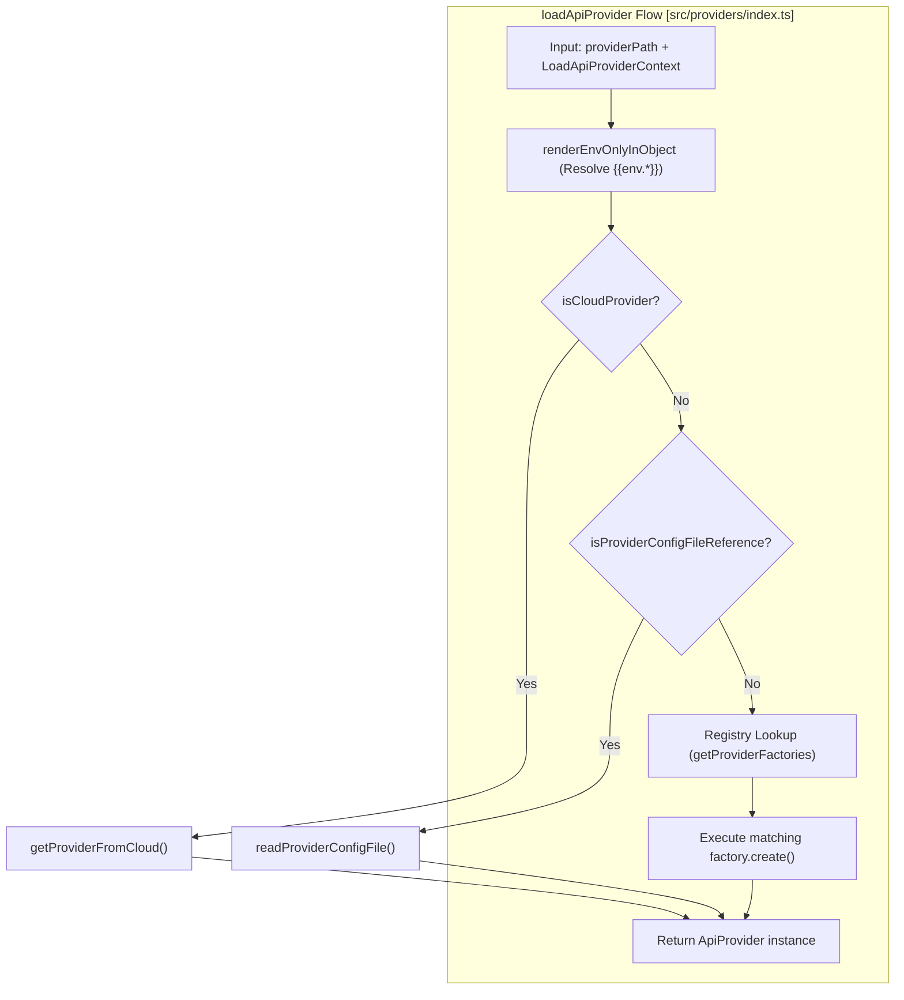
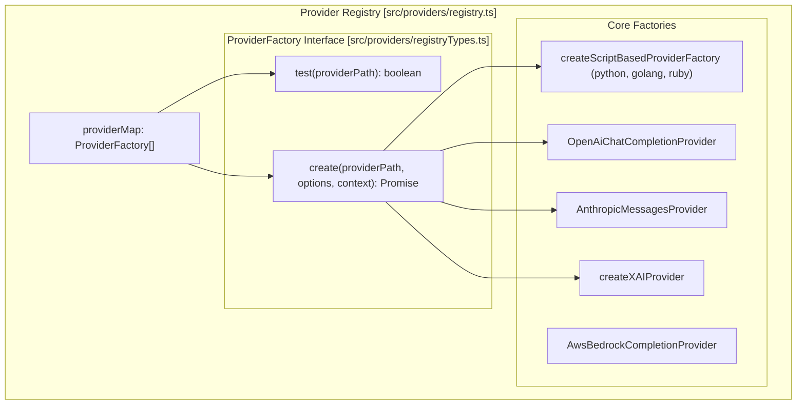
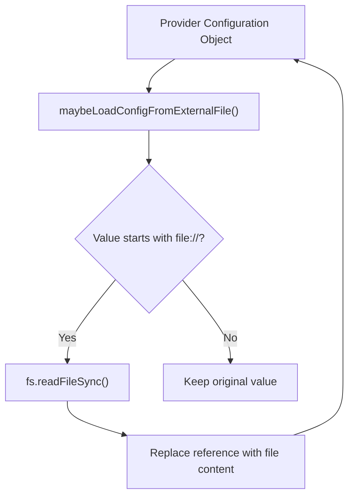
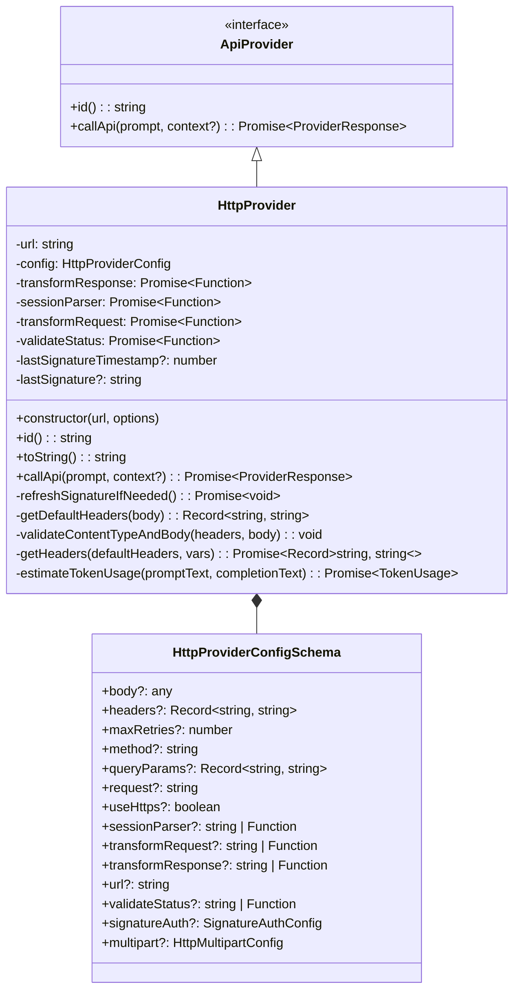
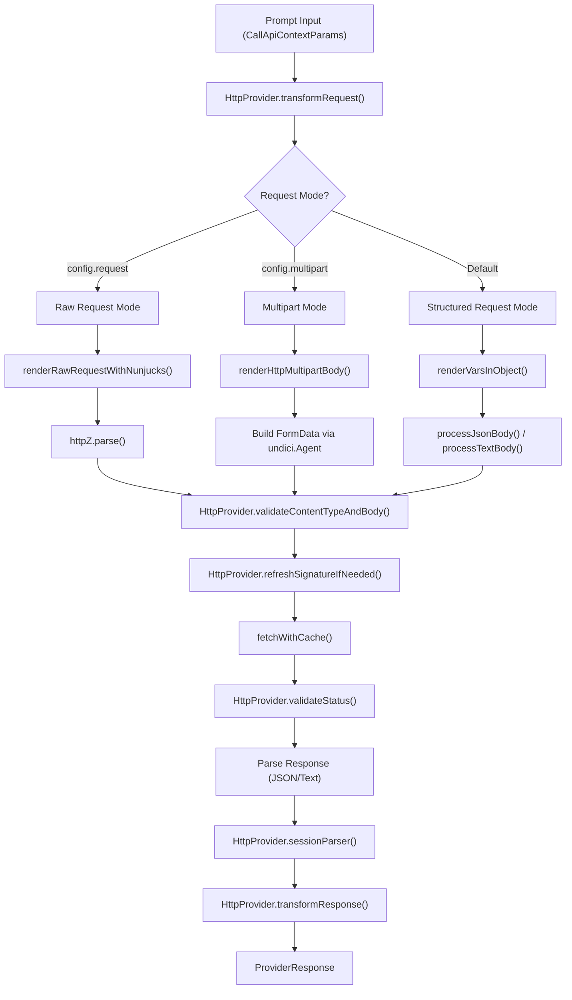
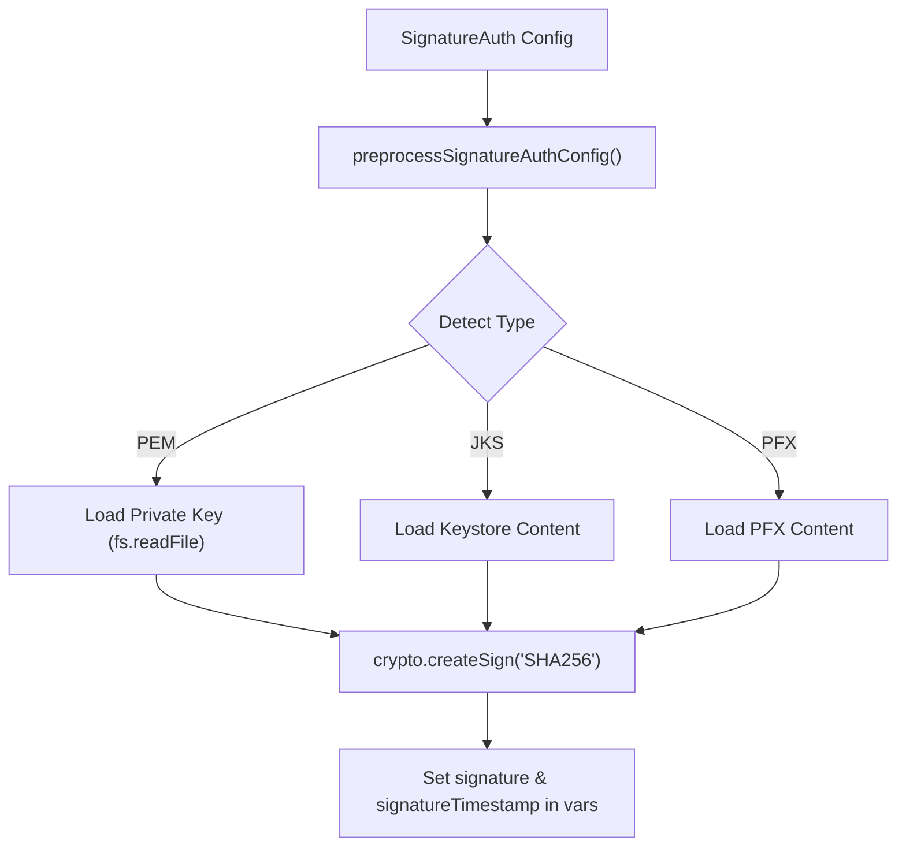

This system handles the dynamic loading, registration, and instantiation of API providers based on configuration strings, files, or objects. It provides a unified interface for working with diverse provider types ranging from cloud APIs to local executables.

For information about specific provider implementations and their capabilities, see [Provider Ecosystem](#3.9). For HTTP-specific provider functionality, see [HTTP Provider](#3.2).

## Core Loading Functions

The provider loading system centers around two main functions: `loadApiProvider` for single providers and `loadApiProviders` for multiple providers.

### loadApiProvider Function

The `loadApiProvider` function in `src/providers/index.ts` takes a provider identifier and returns a single `ApiProvider` instance. It handles several resolution paths:

- **Environment Template Rendering**: Renders `{{ env.VAR }}` templates in the provider ID and configuration at load time using `renderEnvOnlyInObject` [src/providers/index.ts:94-100]().
- **Cloud references**: Identifies `promptfoo://provider/` strings via `isCloudProvider`, fetches the configuration from Promptfoo Cloud via `getProviderFromCloud`, and merges it with local overrides [src/providers/index.ts:120-163]().
- **File references**: Loads provider definitions from `file://` paths pointing to YAML or JSON files via `readProviderConfigFile` [src/providers/index.ts:165-200]().
- **Registry Lookup**: Delegates to `getProviderFactories` to find matching implementations in the `providerMap` [src/providers/index.ts:202-214]().

Title: "loadApiProvider Resolution Flow"

**loadApiProvider Resolution Process**
Sources: [src/providers/index.ts:83-220](), [test/providers.test.ts:48-161]()

### loadApiProviders Function

The `loadApiProviders` function processes arrays of provider specifications. It uses `normalizeProviderRef` to classify inputs and `loadProviderConfigsFromFile` to flatten nested configurations from files [src/providers/index.ts:14-19](). It ensures that if a file reference contains multiple providers, they are all instantiated and returned as a flat list [src/providers/index.ts:173-178]().

Sources: [src/providers/index.ts:222-265](), [test/providers.test.ts:84-123]()

## Provider Registry Architecture

The registry uses a factory pattern where each provider type has a dedicated factory that can test for compatibility and create instances. The primary registry is the `providerMap` array in `src/providers/registry.ts`.

Title: "Provider Registry and Factory Mapping"

**Provider Factory Registry Pattern**
Sources: [src/providers/registry.ts:138-148](), [test/providers/registry.test.ts:57-85]()

### Factory Implementation Examples

Each factory in the `providerMap` array implements the `ProviderFactory` interface.

**Script-based Provider Factory**:
Uses `createScriptBasedProviderFactory` to register executors for `exec` (ScriptCompletionProvider), `golang` (GolangProvider), `python` (PythonProvider), and `ruby` (RubyProvider) [src/providers/registry.ts:93-101]().

**xAI Provider Factory**:
Checks for the `xai:` prefix and calls `createXAIProvider` [src/providers/registry.ts:113-117]().

**Dynamic Loading (getProviderFactories)**:
The `getProviderFactories` function handles lazy-loading of provider families (like `redteam` or `bedrock`) to keep the core bundle small. It returns the `providerMap` for standard providers but merges additional factories for specialized families [src/providers/registry.test.ts:87-113]().

Sources: [src/providers/registry.ts:138-148](), [src/providers/registry.test.ts:87-138](), [test/providers/registry.test.ts:140-171]()

## Configuration and Environment Integration

### Environment Variable Resolution
The system uses `src/envars.ts` to manage configuration keys such as `PROMPTFOO_CACHE_ENABLED` or `PROMPTFOO_OTEL_ENABLED` [src/envars.ts:21-80](). At load time, `loadApiProvider` merges environment overrides from the test suite context with provider-specific options [src/providers/index.ts:91-92]().

### File-based Configuration
Providers can be defined in external files. The system supports recursive resolution of `file://` references within provider configurations (e.g., loading an API key or a system prompt from a separate text file) via `maybeLoadConfigFromExternalFile` [test/providers.test.ts:125-161]().

Title: "Recursive Configuration Resolution"

**Recursive File Reference Resolution**
Sources: [test/providers.test.ts:125-161](), [src/providers/index.ts:165-180]()

## Error Handling and Validation

The system enforces strict validation during the loading process:
- **Sanitization**: Invalid provider configurations are passed through `sanitizeObject` before being logged to avoid leaking secrets [src/providers/index.ts:65-79]().
- **Type Safety**: Uses `isApiProvider` to ensure loaded objects implement the required `callApi` interface [src/providers/index.ts:5-11]().
- **Conflict Prevention**: `loadApiProvider` throws an error if it encounters a file containing an array of providers, directing the user to `loadApiProviders` instead [src/providers/index.ts:174-178]().
- **Registry Context**: `LoadApiProviderContext` is passed through the registry to ensure providers have access to the `basePath` for resolving relative paths to scripts or local models [src/providers/registry.ts:119-122]().

Sources: [src/providers/index.ts:65-79](), [src/providers/index.ts:174-178](), [test/providers.test.ts:65-82](), [src/providers/registry.ts:141-147]()

# HTTP Provider

The HTTP Provider enables integration with custom API endpoints for LLM inference through flexible HTTP/HTTPS requests. This provider allows you to evaluate models hosted on your own servers or third-party services not directly supported by built-in providers. It supports structured and raw HTTP request modes, advanced authentication mechanisms, and comprehensive request/response transformation capabilities.

The HTTP Provider is implemented in the `HttpProvider` class and provides a general-purpose way to integrate with any HTTP endpoint that offers language model capabilities.

## HTTP Provider Architecture

The HTTP provider is implemented through the `HttpProvider` class [src/providers/http.ts:433](), which conforms to the `ApiProvider` interface [src/types/providers.ts:123](). This provider enables communication with any HTTP/HTTPS endpoint by constructing and sending HTTP requests containing prompts and processing the responses.

### HttpProvider Class Structure

Sources:
- [src/providers/http.ts:397-431]()
- [src/providers/http.ts:433-460]()
- [src/types/providers.ts:123-140]()

## Request Processing Flow

The HTTP provider processes requests through multiple stages, with different paths for structured, raw, and multipart request modes.

### Request Processing Pipeline

Sources:
- [src/providers/http.ts:1061-1192]()
- [src/providers/http.ts:1218-1244]()
- [src/providers/http.ts:682-704]()
- [src/providers/http.ts:495-574]()

## Configuration Options

The HTTP provider is configured using the `HttpProviderConfig` schema, defined via Zod in the codebase [src/providers/http.ts:397-431]().

### Configuration Schema Highlights

| Option | Type | Description |
|--------|------|-------------|
| `url` | string | The target endpoint [src/providers/http.ts:401](). |
| `method` | string | HTTP verb (GET, POST, etc.) [src/providers/http.ts:402](). |
| `headers` | Record | HTTP headers with template support [src/providers/http.ts:403](). |
| `body` | any | Request payload [src/providers/http.ts:404](). |
| `request` | string | Raw HTTP request string (supports `file://`) [src/providers/http.ts:407](). |
| `multipart` | object | Config for `multipart/form-data` via `HttpMultipartConfigSchema` [src/providers/http.ts:413](). |
| `transformResponse` | string \| Function | Extract result from response using `createTransformResponse` [src/providers/http.ts:409](). |
| `signatureAuth` | object | Digital signature configuration [src/providers/http.ts:425](). |

### Multipart Support
The provider supports `multipart/form-data` for file uploads and complex form fields [site/docs/providers/http.md:76-81](). It uses `renderHttpMultipartBody` to build the request [src/providers/http.ts:39-42](). It can generate deterministic files (PDF, PNG, JPEG) or upload local files via the `path` source [site/docs/providers/http.md:114-118]().

Sources:
- [src/providers/http.ts:397-431]()
- [src/providers/http.ts:39-42]()
- [site/docs/providers/http.md:76-142]()

## Authentication Mechanisms

### Digital Signature Authentication
The HTTP provider supports signing requests with digital signatures. It handles various certificate types including PEM, JKS, and PFX via `preprocessSignatureAuthConfig` [src/providers/http.ts:85-199](). This function maps generic certificate fields to type-specific fields (e.g., `certificateContent` to `pfxContent` for PFX) [src/providers/http.ts:149-151]().

Sources:
- [src/providers/http.ts:85-199]()
- [src/providers/http.ts:954-988]()
- [test/providers/http/auth.test.ts:36-98]()

### Standard Auth
- **Bearer/API Key**: Managed via the `headers` configuration with variable substitution [site/docs/providers/http.md:18-22]().
- **Basic Auth**: Can be constructed manually in headers or via raw request [site/docs/providers/http.md:152-167]().
- **OAuth**: Supported through token refresh mechanisms and `TOKEN_REFRESH_BUFFER_MS` [src/providers/http.ts:25]().

## Dynamic Request Construction

The provider uses Nunjucks templating to render requests dynamically [src/providers/http.ts:35]().

### JSON Variable Escaping
To prevent invalid JSON when substituting multiline strings or quotes, the provider uses `escapeJsonVariables` [src/providers/http.ts:74-81](). This ensures that a variable like `value\nwith\nnewlines` is safely converted to `value\\nwith\\nnewlines` within a JSON context [src/providers/http.ts:71-73]().

### Raw Request Parsing
When `config.request` is used, the provider utilizes `http-z` to parse the raw HTTP string into a structured request object [src/providers/http.ts:7](). This is handled in `renderRawRequestWithNunjucks` [src/providers/http.ts:1218-1244]().

Sources:
- [src/providers/http.ts:74-81]()
- [src/providers/http.ts:1218-1244]()

## Response Transformation and Validation

### transformResponse
Users can provide a string (evaluated as a function body) or a JavaScript function to extract data from the response [src/providers/http.ts:706-777](). It is created via `createTransformResponse` [src/providers/httpTransforms.ts:43-46]().

### validateStatus
Custom logic to determine if an HTTP status code should be treated as a success or failure [src/providers/http.ts:804-856]().

### sessionParser
Extracts session information (like Cookies) from responses to maintain state in multi-turn evaluations [src/providers/http.ts:451-489]().

Sources:
- [src/providers/http.ts:706-777]()
- [src/providers/http.ts:804-856]()
- [src/providers/http.ts:451-489]()

## TLS and mTLS Configuration

The provider supports advanced TLS configurations for secure communication.

- **mTLS**: Configured via `signatureAuth` or `https` agent settings [src/providers/http.ts:115-120]().
- **Certificate Handling**: Supports loading certificates from files via `maybeLoadFromExternalFile` [src/providers/http.ts:18]().
- **Custom Agents**: Uses `undici` for high-performance HTTP pooling and `https.Agent` for specialized TLS requirements [src/providers/http.ts:4-8]().

Sources:
- [src/providers/http.ts:4-8]()
- [src/providers/http.ts:18]()

## WebSocket Provider

While `HttpProvider` handles standard REST/RPC, promptfoo also provides a specialized `WebSocketProvider` for real-time bidirectional communication [src/providers/websocket.ts:91]().

- **Message Templates**: Uses `messageTemplate` to construct outgoing messages [src/providers/websocket.ts:103]().
- **Streaming Response**: Supports streaming response accumulation via `streamResponse` [src/providers/websocket.ts:109-113]().
- **Implementation**: Uses the `ws` library for connection management [src/providers/websocket.ts:3]().

Sources:
- [src/providers/websocket.ts:91-108]()
- [src/providers/websocket.ts:102-119]()
- [site/docs/providers/websocket.md:7-15]()