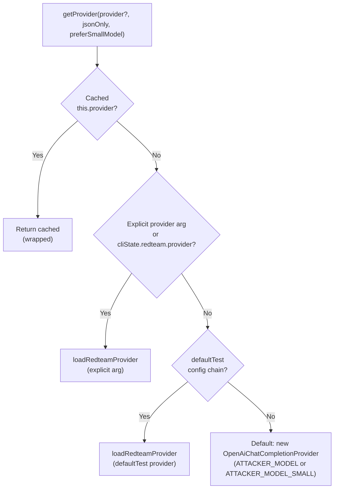
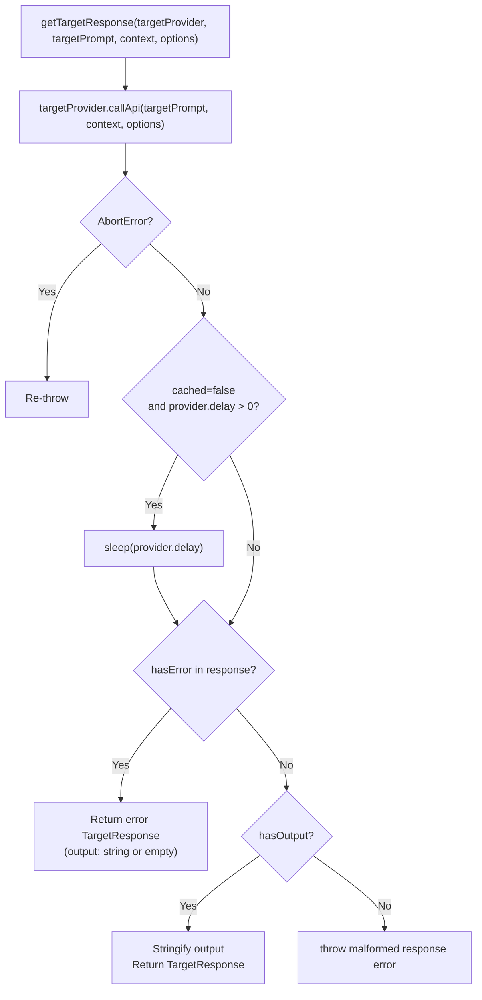
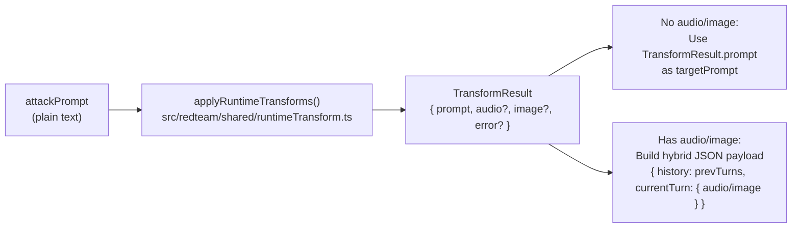

This page documents the shared infrastructure used by all red team attack provider implementations: the `RedteamProviderManager` singleton, the `getTargetResponse()` helper, `tryUnblocking()`, `applyRuntimeTransforms()` / per-turn layers, and a set of conversation utilities. These components live in [`src/redteam/providers/shared.ts`]() and [`src/redteam/util.ts`]() and are consumed by every multi-turn attack provider.

For documentation of the attack providers themselves (Crescendo, Iterative, GOAT, etc.) that call these utilities, see [5.5](). For the layer strategy that injects `_perTurnLayers` into provider configs, see [5.4]().

---

## Overview

All red team attack providers share three common needs:

1.  **A consistent LLM** to act as the attacker/judge (distinct from the target being tested).
2.  **A normalized way** to call the target provider and get a string response back.
3.  **Conversation utilities** for message management, refusal detection, and variable transformation.

The module at `src/redteam/providers/shared.ts` satisfies all three, providing a single singleton and a set of exported functions that each attack provider imports.

**Provider Manager and Shared Utilities — Module Map**

```mermaid
graph TD
  subgraph "src/redteam/providers/shared.ts"
    RPM["redteamProviderManager\n(RedteamProviderManager)"]
    GTR["getTargetResponse()"]
    TU["tryUnblocking()"]
    CIC["createIterationContext()"]
    ERH["externalizeResponseForRedteamHistory()"]
    CPP["checkPenalizedPhrases()"]
    BGA["buildGraderResultAssertion()"]
    ICMA["isValidChatMessageArray()"]
    GLMC["getLastMessageContent()"]
    MTR["messagesToRedteamHistory()"]
  end
  subgraph "src/redteam/shared/runtimeTransform.ts"
    ART["applyRuntimeTransforms()"]
  end
  subgraph "src/redteam/util.ts"
    IBR["isBasicRefusal()"]
    GSI["getSessionId()"]
    EPT["extractPromptFromTags()"]
    EIV["extractInputVarsFromPrompt()"]
  end
  "CrescendoProvider" --> RPM
  "CrescendoProvider" --> GTR
  "CrescendoProvider" --> TU
  "CrescendoProvider" --> ART
  "RedteamIterativeProvider" --> RPM
  "RedteamIterativeProvider" --> GTR
  "RedteamIterativeProvider" --> CIC
  "RedteamIterativeProvider" --> ART
  "GoatProvider" --> TU
  "GoatProvider" --> ART
  "RedteamIterativeTreeProvider" --> RPM
  "RedteamIterativeTreeProvider" --> GTR
  "RedteamIterativeTreeProvider" --> CIC
  "RedteamIterativeTreeProvider" --> ART
```

Sources: [`src/redteam/providers/shared.ts:157-244`](), [`src/redteam/providers/iterative.ts:43-60`](), [`src/redteam/providers/crescendo/index.ts:43-66`](), [`src/redteam/providers/goat.ts:41-54`](), [`src/redteam/providers/iterativeTree.ts:52-68`]()

---

## `RedteamProviderManager`

`RedteamProviderManager` is a class instantiated once as the module-level export `redteamProviderManager` [`src/redteam/providers/shared.ts:244`](). It maintains up to five cached `ApiProvider` slots and exposes `getProvider()`, `getGradingProvider()`, and `getMultilingualProvider()`.

### Cached Slots

| Property | Purpose |
| :--- | :--- |
| `provider` | Default redteam attack provider [`src/redteam/providers/shared.ts:158`]() |
| `jsonOnlyProvider` | Same provider, forced `response_format: json_object` [`src/redteam/providers/shared.ts:160`]() |
| `multilingualProvider` | Configured for multilingual attack generation [`src/redteam/providers/shared.ts:161`]() |
| `gradingProvider` | Provider used for scoring/grading [`src/redteam/providers/shared.ts:162`]() |
| `gradingJsonOnlyProvider` | Grading provider, forced JSON output [`src/redteam/providers/shared.ts:163`]() |
| `rateLimitRegistry` | Optional `RateLimitRegistry` from `src/scheduler.ts` [`src/redteam/providers/shared.ts:164`]() |

Sources: [`src/redteam/providers/shared.ts:157-164`]()

### Rate Limiting Integration

When `setRateLimitRegistry(registry)` is called, every provider returned by the manager is automatically wrapped with `wrapProviderWithRateLimiting()` [`src/redteam/providers/shared.ts:178-183`](). The registry is intentionally **not** cleared by `clearProvider()`, as it is managed by the evaluator lifecycle, not by provider resets [`src/redteam/providers/shared.ts:185-187`]().

### `getProvider()` — Resolution Priority

The resolution checks `cliState.config?.redteam?.provider` first, then falls back to `cliState.config?.defaultTest` levels: `.provider`, `.options.provider.text`, and `.options.provider` [`src/redteam/providers/shared.ts:125-155`]().

**`redteamProviderManager.getProvider()` resolution chain**



Sources: [`src/redteam/providers/shared.ts:125-155`](), [`src/redteam/providers/shared.ts:197-206`]()

### `getGradingProvider()` — Resolution Priority

Grading (scoring) uses a separate resolution chain, allowing a more capable model to be used for evaluation than for attack generation.

| Priority | Source |
| :--- | :--- |
| 1 | Explicit `provider` argument to `getGradingProvider()` |
| 2 | Cached `this.gradingProvider` / `this.gradingJsonOnlyProvider` |
| 3 | `defaultTest` config chain (same logic as `getProvider`) |
| 4 | Fallback: delegates to `getProvider()` (same model as attack) |

Sources: [`src/redteam/providers/shared.ts:208-230`]()

---

## `TargetResponse` Type

Every attack provider ultimately calls the target through `getTargetResponse()`, which returns a `TargetResponse`. The key distinction from `ProviderResponse` is that `output` is always a `string` (never `undefined` or an object):

```typescript
export type TargetResponse = {
  traceContext?: TraceContextData | null;
  traceSummary?: string;
  image?: {
    data?: string;
    format?: string;
  };
} & Omit<ProviderResponse, 'output'> & {
  output: string;
};
```

Sources: [`src/redteam/providers/shared.ts:246-258`]()

---

## `getTargetResponse()`

`getTargetResponse()` wraps a single call to `targetProvider.callApi()`, normalizes the output to a string, handles provider delays, and returns a `TargetResponse` [`src/redteam/providers/shared.ts:261-331`]().

**`getTargetResponse()` execution flow**



Sources: [`src/redteam/providers/shared.ts:261-331`]()

Non-string outputs are serialized with `safeJsonStringify()`. The function always sets `tokenUsage.numRequests = 1` if it is not present [`src/redteam/providers/shared.ts:326-328`]().

---

## `tryUnblocking()`

Some targets respond to adversarial prompts with clarifying questions that block the conversation from progressing. `tryUnblocking()` detects these and generates an answer via the remote generation API [`src/redteam/providers/shared.ts:507-550`]().

### Behavior

1.  Checks `checkServerFeatureSupport('blocking-question-analysis', '2025-06-16T...')` [`src/redteam/providers/shared.ts:515-518`]().
2.  Checks `PROMPTFOO_ENABLE_UNBLOCKING` environment variable — **disabled by default** [`src/redteam/providers/shared.ts:520`]().
3.  If either check fails, returns `{ success: false }` immediately [`src/redteam/providers/shared.ts:521`]().
4.  Otherwise, sends conversation history to the remote generation API via `PromptfooChatCompletionProvider` with task `blocking-question-analysis` [`src/redteam/providers/shared.ts:523-537`]().

**Consumers:** `CrescendoProvider` [`src/redteam/providers/crescendo/index.ts:449-487`]() and `GoatProvider` [`src/redteam/providers/goat.ts:235-305`]() call `tryUnblocking()` after each target turn.

---

## `applyRuntimeTransforms()` and Per-Turn Layers

The `layer` strategy can compose an attack provider with additional per-turn transforms (e.g., audio, base64). When configured, the strategy injects a `_perTurnLayers: LayerConfig[]` array into the attack provider's config [`src/redteam/providers/crescendo/index.ts:145`]().

At each turn, providers call `applyRuntimeTransforms()` from `src/redteam/shared/runtimeTransform.ts`:

```typescript
export async function applyRuntimeTransforms(
  attackPrompt: string,
  injectVar: string,
  perTurnLayers: LayerConfig[],
  Strategies: any,
  context: {
    evaluationId?: string;
    testCaseId?: string;
    purpose?: string;
    goal?: string;
  },
): Promise<TransformResult>
```

**Per-turn layer transform flow**



Sources: [`src/redteam/providers/crescendo/index.ts:35-39`](), [`src/redteam/providers/iterative.ts:35-39`](), [`src/redteam/providers/goat.ts:36-40`]()

---

## `createIterationContext()`

Multi-iteration providers need to re-run `transformVars` on each iteration to generate fresh values (e.g., a new `sessionId` per attempt).

```typescript
export async function createIterationContext({
  originalVars,
  transformVarsConfig,
  context,
  iterationNumber,
  loggerTag,
}: {
  originalVars: Record<string, VarValue>;
  transformVarsConfig?: TransformFunction | string;
  context?: CallApiContextParams;
  iterationNumber: number;
  loggerTag: string;
}): Promise<CallApiContextParams | undefined>
```

Sources: [`src/redteam/providers/shared.ts:413-466`]()

On each iteration it calls `transform(transformVarsConfig, originalVars, { uuid: randomUUID() }, ...)` and merges the result back into `originalVars` [`src/redteam/providers/shared.ts:441-447`]().

---

## `externalizeResponseForRedteamHistory()`

Before copying a `ProviderResponse` into conversation history, any large binary payloads (base64 images, audio) are extracted and stored externally via the blob storage system.

```typescript
export async function externalizeResponseForRedteamHistory<T extends ProviderResponse>(
  response: T,
  context?: {
    evalId?: string;
    testIdx?: number;
    promptIdx?: number;
  },
): Promise<T>
```

Sources: [`src/redteam/providers/shared.ts:493-505`]()

This calls `extractAndStoreBinaryData()` from `src/blobs/extractor.ts` only when blob storage is enabled or remote blob upload is available [`src/redteam/providers/shared.ts:497-501`]().

---

## Conversation Helpers

| Function | Signature | Purpose |
| :--- | :--- | :--- |
| `isValidChatMessageArray` | `(parsed: unknown) => parsed is Message[]` | Validates JSON is an array of `{role, content}` messages [`src/redteam/providers/shared.ts:340-349`]() |
| `getLastMessageContent` | `(messages, role) => string \| undefined` | Extracts last message of a given role [`src/redteam/providers/shared.ts:351-356`]() |
| `messagesToRedteamHistory` | `(messages) => {prompt, output}[]` | Converts message pairs to history format [`src/redteam/providers/shared.ts:358-387`]() |
| `checkPenalizedPhrases` | `(output: string) => boolean` | Detects hollow compliance phrases (e.g., "yes, I can help you") [`src/redteam/providers/shared.ts:389-399`]() |

---

## `src/redteam/util.ts` — General Red Team Utilities

`src/redteam/util.ts` provides functions used by both providers and plugins.

### Refusal Detection

`isBasicRefusal()` checks if the response starts with common refusal prefixes or matches specific word-boundary patterns like `\bAs an AI\b` or `\bcannot assist with that request\b` [`src/redteam/util.ts:136-212`]().

### Multi-Input Mode Helpers

When the `inputs` config is set, these functions parse the attacker's JSON output:

| Function | Role |
| :--- | :--- |
| `extractPromptFromTags(text)` | Extracts content from the first `<Prompt>...</Prompt>` tag [`src/redteam/util.ts:40-43`]() |
| `extractVariablesFromJson(parsed, inputs)` | Extracts named keys from a parsed JSON object [`src/redteam/util.ts:71-84`]() |
| `extractInputVarsFromPrompt(prompt, inputs)` | Combines tag extraction and JSON variable parsing [`src/redteam/util.ts:113-127`]() |

Sources: [`src/redteam/util.ts:28-127`]()