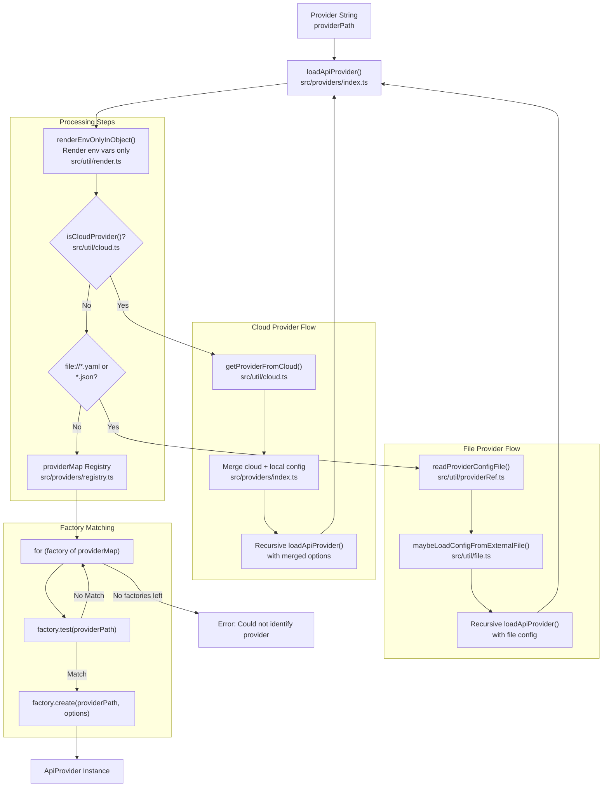
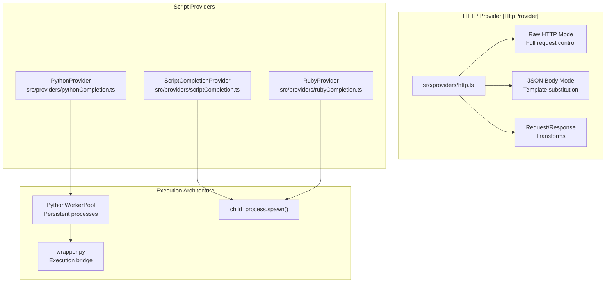

## Purpose and Scope

The Provider System is the abstraction layer responsible for loading, configuring, and managing LLM integrations across 50+ different APIs and services. It implements a factory pattern that instantiates the appropriate provider class based on configuration strings, file paths, or provider objects.

This document covers:
- Provider loading and resolution mechanisms
- Provider registry and factory pattern
- Major provider categories and implementations
- Authentication and configuration systems
- Provider features (transformations, sessions, token tracking)

For information about how providers are used during evaluation, see [Evaluation Engine](#2.1).

---

## Provider Loading Architecture

### Factory Pattern and Provider Registry

**Provider Loading Flow**

The `loadApiProvider()` function is the central entry point. It processes the provider path through several stages:

1.  **Environment Variable Rendering**: Only `{{ env.* }}` templates are rendered at load time using `renderEnvOnlyInObject()`, preserving runtime variable templates like `{{ vars.* }}` for per-test customization [src/providers/index.ts:94-101]().
2.  **Cloud Provider Resolution**: If the path starts with `promptfoo://provider/`, it fetches the provider definition from Promptfoo Cloud via `getProviderFromCloud()`, merges local config overrides, and recursively loads the resolved provider [src/providers/index.ts:120-163]().
3.  **File Provider Loading**: YAML/JSON files are loaded via `readProviderConfigFile()`, their `file://` references resolved recursively via `maybeLoadConfigFromExternalFile()`, and the provider ID is extracted for recursive loading [src/providers/index.ts:165-196]().
4.  **Factory Pattern Matching**: The `providerMap` registry iterates through factories. The first matching factory creates the provider instance [src/providers/registry.ts:138-156]().

Sources: [src/providers/index.ts:83-224](), [src/providers/registry.ts:138-1849](), [src/util/render.ts:20-20](), [src/util/cloud.ts:8-11]()

For details, see [Provider Loading and Registry](#3.1).

---

## Major Provider Categories

### HTTP and Custom Providers

**Custom Provider Features**

-   **HTTP Provider**: Flexible provider supporting raw request mode, JSON templating, custom authentication (TLS client certs, digital signatures), and request/response transformations [src/providers/http.ts:48-193]().
-   **Python Provider**: Uses `PythonWorkerPool` for persistent worker processes, avoiding the overhead of spawning a new Python interpreter for every request [src/providers/pythonCompletion.ts:93-93]().
-   **Script Provider**: Executes arbitrary shell commands using `ScriptCompletionProvider` [src/providers/scriptCompletion.ts:101-101]().

Sources: [src/providers/http.ts:48-193](), [src/providers/pythonCompletion.ts:93-93](), [src/providers/scriptCompletion.ts:101-101](), [src/providers/registry.ts:45-101]().

For details, see [HTTP Provider](#3.2) and [Python and Script Providers](#3.7).

---

### Native LLM Integrations

The system includes deep integrations for major model providers, handling their specific message formats, tool calling schemas, and cost calculation logic.

-   **OpenAI**: Supports GPT-4o, o-series reasoning models, and assistant APIs [src/providers/openai/chat.ts:77-77](). For details, see [OpenAI Integration](#3.5).
-   **Anthropic**: Native integration with Claude's message format, thinking blocks, and tool use [src/providers/anthropic/messages.ts:14-14](). For details, see [Anthropic Provider](#3.4).
-   **AWS Bedrock**: Supports multi-vendor models (Claude, Llama, Titan, Nova) with model-specific configurations and Knowledge Base RAG integration [src/providers/registry.ts:141-152](). For details, see [AWS Bedrock Integration](#3.3).
-   **Google/Vertex**: Native integration with Gemini models, multi-modal capabilities, and Model Armor guardrails [src/providers/registry.ts:173-174](). For details, see [Google and Vertex Integration](#3.6).
-   **Moonshot (Kimi)**: OpenAI-compatible provider for Kimi K2 thinking models, handling specific sampling parameter pinning and reasoning content extraction [src/providers/registry.ts:71-71]().
-   **Agent SDKs**: Specialized providers for agentic execution models like the Claude Agent SDK and OpenAI Codex [src/providers/openai/codex-sdk.ts:10-10](). For details, see [Agent SDK Providers](#3.8).

Sources: [src/providers/registry.ts:9-118](), [src/providers/openai/chat.ts:77-77](), [src/providers/anthropic/messages.ts:14-14](), [test/providers.test.ts:9-15]().

---

## Provider Features and Shared Utilities

### Token Usage and Cost Tracking

Token usage is tracked at multiple levels to provide accurate cost and performance metrics.

| Feature | Description | Implementation |
| :--- | :--- | :--- |
| **TokenUsage** | Tracks prompt, completion, and cached tokens | [src/types/shared.ts:1]() |
| **ApiProvider** | Interface for all providers, including `callApi` and optional `callEmbeddingApi` | [src/types/providers.ts:123-140]() |
| **Cost Calculation** | Calculates USD cost based on model-specific rates | [src/providers/shared.ts:38-62]() |
| **Token Usage Utils** | Shared utilities for initializing and managing token counts | [src/util/tokenUsageUtils.ts:36-36]() |

Sources: [src/types/providers.ts:123-140](), [src/types/shared.ts:1](), [src/providers/http.ts:36-36]().

### Request and Response Transformations

Providers support two levels of transformation:
1.  **Request Transforms**: Modify the outgoing request (e.g., adding custom headers or reformatting the body) [src/providers/http.ts:43-43]().
2.  **Response Transforms**: Extract specific data from the model response (e.g., `json.output` to extract a field from a JSON response) [src/providers/http.ts:44-44]().

For details, see [Provider Ecosystem](#3.9).

---

## Summary of Child Pages

-   [Provider Loading and Registry](#3.1): Detailed documentation of `loadApiProvider()`, the `providerMap` registry, and configuration resolution.
-   [HTTP Provider](#3.2): Advanced configuration for the `HttpProvider`, including templating and authentication.
-   [AWS Bedrock Integration](#3.3): Integration with AWS Bedrock Converse API and multi-vendor models.
-   [Anthropic Provider](#3.4): Native Claude integration, message formatting, and extended thinking.
-   [OpenAI Integration](#3.5): GPT-4o, o-series, tool calling, and structured outputs.
-   [Google and Vertex Integration](#3.6): Gemini models, Vertex AI, and AI Studio integrations.
-   [Python and Script Providers](#3.7): Custom execution via Python, shell scripts, and persistent worker pools.
-   [Agent SDK Providers](#3.8): Agentic execution models and SDK integrations.
-   [Provider Ecosystem](#3.9): Survey of additional providers (Ollama, Mistral, Cohere, Moonshot) and shared utilities.